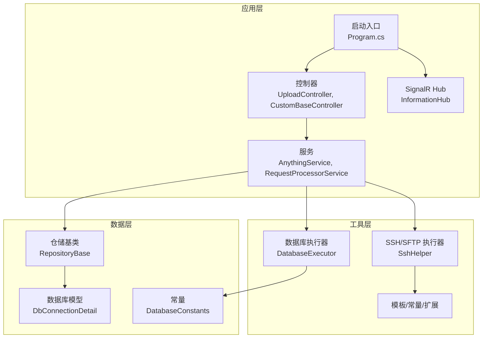
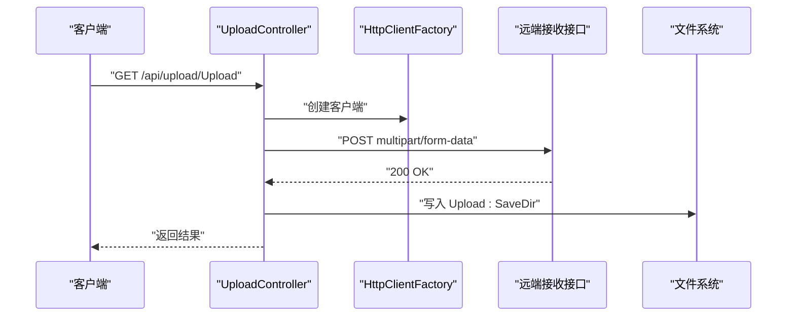
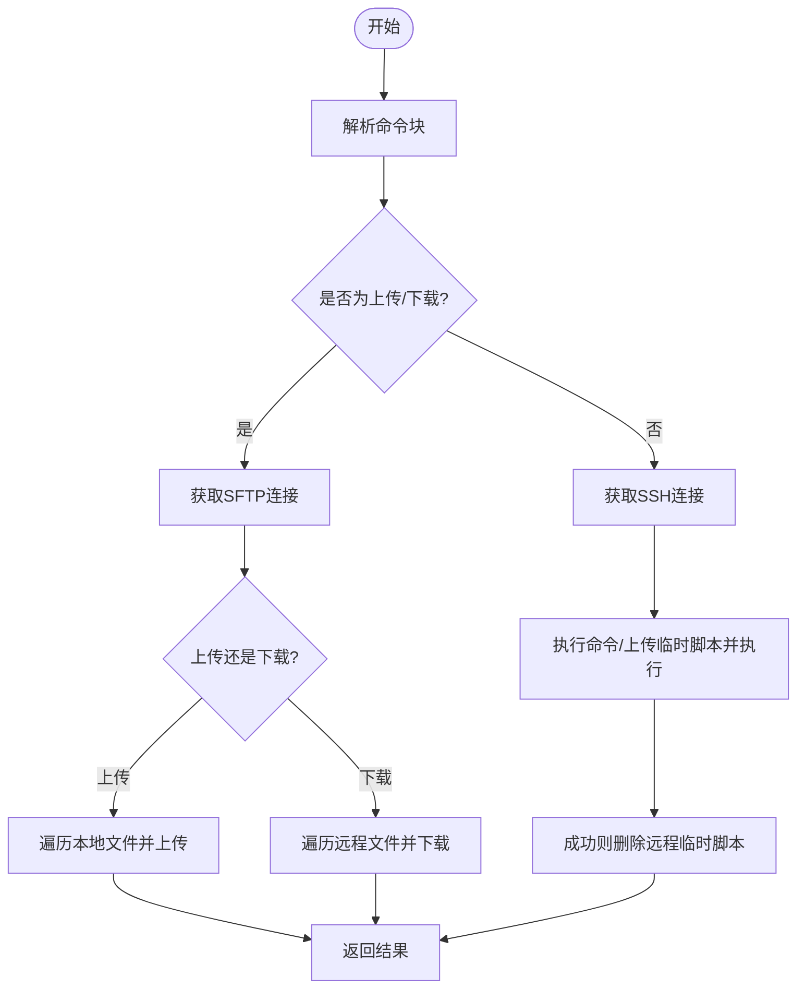
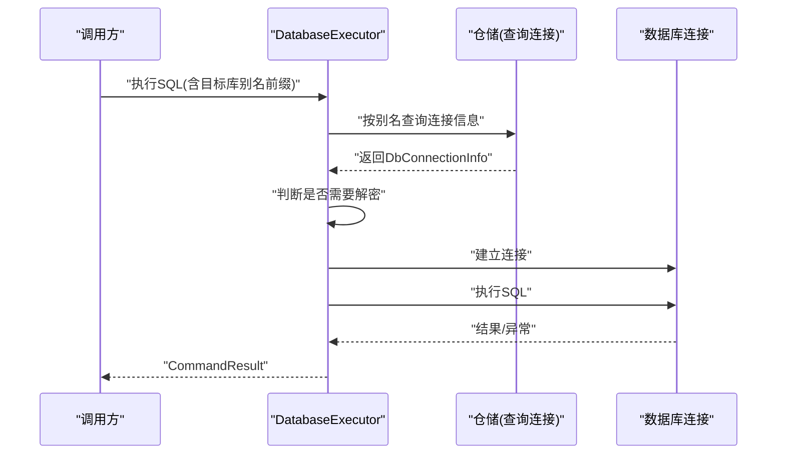
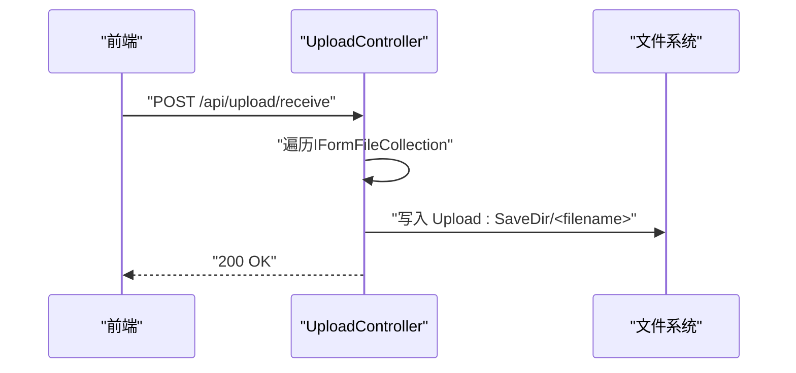
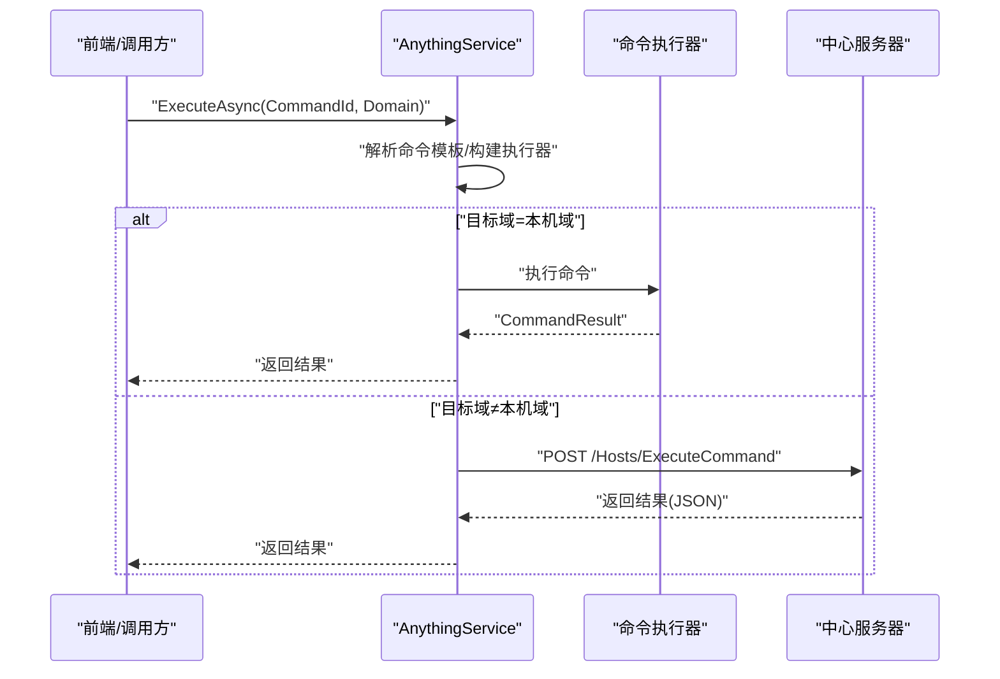
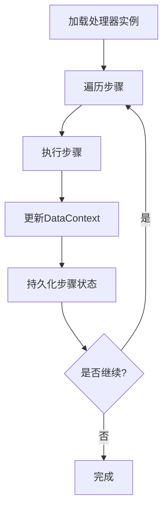
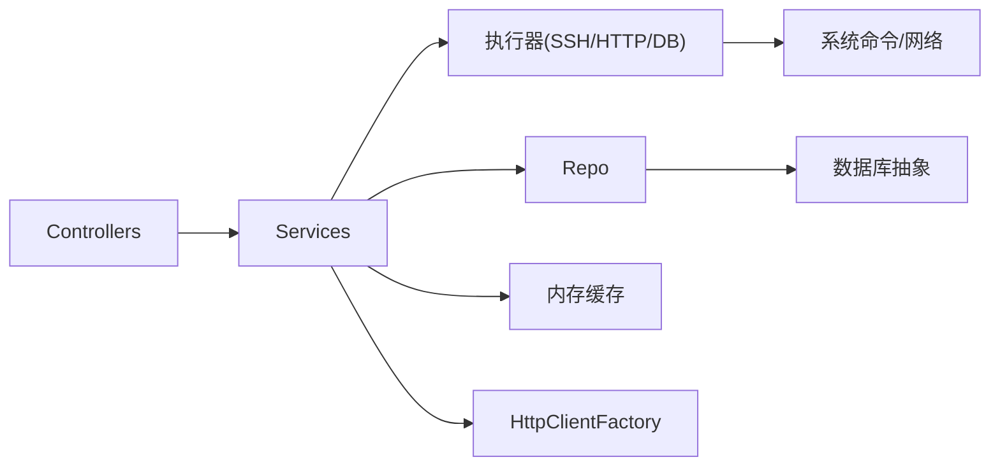

# 常见问题排查

<cite>
**本文引用的文件**
- [README.md](file://README.md)
- [appsettings.json](file://Sylas.RemoteTasks.App/appsettings.json)
- [Program.cs](file://Sylas.RemoteTasks.App/Program.cs)
- [LambdaHandler.cs](file://Sylas.RemoteTasks.App/ExceptionHandlers/LambdaHandler.cs)
- [CustomBaseController.cs](file://Sylas.RemoteTasks.App/Controllers/CustomBaseController.cs)
- [UploadController.cs](file://Sylas.RemoteTasks.App/Controllers/UploadController.cs)
- [SshHelper.cs](file://Sylas.RemoteTasks.Utils/CommandExecutor/SshHelper.cs)
- [DatabaseExecutor.cs](file://Sylas.RemoteTasks.Utils/CommandExecutor/DatabaseExecutor.cs)
- [DbConnectionDetail.cs](file://Sylas.RemoteTasks.Database/SyncBase/DbConnectionDetail.cs)
- [DatabaseConstants.cs](file://Sylas.RemoteTasks.Utils/Constants/DatabaseConstants.cs)
- [RepositoryBase.cs](file://Sylas.RemoteTasks.App/Infrastructure/RepositoryBase.cs)
- [AnythingService.cs](file://Sylas.RemoteTasks.App/RemoteHostModule/Anything/AnythingService.cs)
- [RequestProcessorService.cs](file://Sylas.RemoteTasks.App/RequestProcessor/RequestProcessorService.cs)
- [TokenValidationHelper.cs](file://Sylas.RemoteTasks.App/Helpers/TokenValidationHelper.cs)
- [signalr.js](file://Sylas.RemoteTasks.App/wwwroot/lib/signalr/dist/browser/signalr.js)
</cite>

## 目录
1. [简介](#简介)
2. [项目结构](#项目结构)
3. [核心组件](#核心组件)
4. [架构总览](#架构总览)
5. [详细组件分析](#详细组件分析)
6. [依赖关系分析](#依赖关系分析)
7. [性能考量](#性能考量)
8. [故障排查指南](#故障排查指南)
9. [结论](#结论)
10. [附录](#附录)

## 简介
本文件面向 Sylas.RemoteTasks 的运维与开发人员，聚焦于系统中常见的运行问题，提供“症状—原因—步骤—预防”的完整排查流程。重点覆盖以下方面：
- 远程主机连接失败（SSH/SFTP）
- 任务执行超时
- 数据库连接异常
- 权限验证失败（OAuth/JWT）
- 文件上传/下载问题
- 请求管道与数据处理器异常
- SignalR/WebSocket 连接问题

## 项目结构
系统采用多项目分层组织，核心模块包括：
- 应用层：控制器、后台服务、信号推送、请求处理器
- 工具层：命令执行器（SSH/SFTP/HTTP/数据库）、模板解析、系统辅助
- 数据层：数据库抽象、仓储基类、连接信息模型
- 配置层：appsettings.json 提供连接串、端口、身份认证、上传路径等

图表来源
- [Program.cs](file://Sylas.RemoteTasks.App/Program.cs#L1-L122)
- [UploadController.cs](file://Sylas.RemoteTasks.App/Controllers/UploadController.cs#L1-L69)
- [CustomBaseController.cs](file://Sylas.RemoteTasks.App/Controllers/CustomBaseController.cs#L1-L123)
- [AnythingService.cs](file://Sylas.RemoteTasks.App/RemoteHostModule/Anything/AnythingService.cs#L1-L680)
- [RequestProcessorService.cs](file://Sylas.RemoteTasks.App/RequestProcessor/RequestProcessorService.cs#L1-L72)
- [SshHelper.cs](file://Sylas.RemoteTasks.Utils/CommandExecutor/SshHelper.cs#L1-L619)
- [DatabaseExecutor.cs](file://Sylas.RemoteTasks.Utils/CommandExecutor/DatabaseExecutor.cs#L1-L84)
- [RepositoryBase.cs](file://Sylas.RemoteTasks.App/Infrastructure/RepositoryBase.cs#L1-L233)
- [DbConnectionDetail.cs](file://Sylas.RemoteTasks.Database/SyncBase/DbConnectionDetail.cs#L1-L54)
- [DatabaseConstants.cs](file://Sylas.RemoteTasks.Utils/Constants/DatabaseConstants.cs#L1-L13)

章节来源
- [README.md](file://README.md#L1-L43)
- [appsettings.json](file://Sylas.RemoteTasks.App/appsettings.json#L1-L142)
- [Program.cs](file://Sylas.RemoteTasks.App/Program.cs#L1-L122)

## 核心组件
- SSH/SFTP 执行器：负责远程主机连接、命令执行、文件上传/下载、连接池管理与重连检测
- 数据库执行器：按别名查找目标连接串，解密敏感连接串，执行 SQL 并返回结果
- 仓储基类：统一的增删改查、分页查询、局部更新（基于正则剔除未传字段）
- 任何任务服务：解析命令模板、选择执行器、跨节点转发、结果收集与超时控制
- 请求处理器服务：按配置动态加载处理器实例，执行步骤链路，维护 DataContext
- 异常处理：统一返回 OperationResult/RequestResult 格式，避免泄露内部细节
- 上传控制器：接收前端上传或模拟上传，写入配置的保存目录

章节来源
- [SshHelper.cs](file://Sylas.RemoteTasks.Utils/CommandExecutor/SshHelper.cs#L1-L619)
- [DatabaseExecutor.cs](file://Sylas.RemoteTasks.Utils/CommandExecutor/DatabaseExecutor.cs#L1-L84)
- [RepositoryBase.cs](file://Sylas.RemoteTasks.App/Infrastructure/RepositoryBase.cs#L1-L233)
- [AnythingService.cs](file://Sylas.RemoteTasks.App/RemoteHostModule/Anything/AnythingService.cs#L1-L680)
- [RequestProcessorService.cs](file://Sylas.RemoteTasks.App/RequestProcessor/RequestProcessorService.cs#L1-L72)
- [LambdaHandler.cs](file://Sylas.RemoteTasks.App/ExceptionHandlers/LambdaHandler.cs#L1-L28)
- [UploadController.cs](file://Sylas.RemoteTasks.App/Controllers/UploadController.cs#L1-L69)

## 架构总览
系统通过 Kestrel 提供 HTTP/HTTPS 服务，启用 SignalR 进行实时通知；控制器与服务通过依赖注入装配；远程任务通过执行器与远端主机交互；数据库访问通过仓储与执行器完成。

图表来源
- [UploadController.cs](file://Sylas.RemoteTasks.App/Controllers/UploadController.cs#L17-L69)
- [appsettings.json](file://Sylas.RemoteTasks.App/appsettings.json#L39-L49)

章节来源
- [Program.cs](file://Sylas.RemoteTasks.App/Program.cs#L1-L122)
- [appsettings.json](file://Sylas.RemoteTasks.App/appsettings.json#L1-L142)

## 详细组件分析

### SSH/SFTP 连接与文件传输
- 连接池与并发：最大连接数限制、异步获取连接、连接断开自动重连
- 命令执行：支持脚本块拆分、临时脚本上传、权限变更、远程清理
- 文件传输：目录/文件上传、远程目录确保、下载目录递归、包含/排除规则
- 错误处理：异常抛出与日志输出，连接返回池

图表来源
- [SshHelper.cs](file://Sylas.RemoteTasks.Utils/CommandExecutor/SshHelper.cs#L205-L318)
- [SshHelper.cs](file://Sylas.RemoteTasks.Utils/CommandExecutor/SshHelper.cs#L319-L484)

章节来源
- [SshHelper.cs](file://Sylas.RemoteTasks.Utils/CommandExecutor/SshHelper.cs#L1-L619)

### 数据库执行器与连接解析
- 别名匹配：根据目标库别名查询连接信息
- 连接串安全：若包含关键字则直接使用，否则尝试 AES 解密
- SQL 执行：SELECT 返回序列化结果，非 SELECT 返回影响行数
- 异常捕获：统一包装为 CommandResult

图表来源
- [DatabaseExecutor.cs](file://Sylas.RemoteTasks.Utils/CommandExecutor/DatabaseExecutor.cs#L26-L81)
- [DbConnectionDetail.cs](file://Sylas.RemoteTasks.Database/SyncBase/DbConnectionDetail.cs#L1-L54)
- [DatabaseConstants.cs](file://Sylas.RemoteTasks.Utils/Constants/DatabaseConstants.cs#L1-L13)

章节来源
- [DatabaseExecutor.cs](file://Sylas.RemoteTasks.Utils/CommandExecutor/DatabaseExecutor.cs#L1-L84)
- [DbConnectionDetail.cs](file://Sylas.RemoteTasks.Database/SyncBase/DbConnectionDetail.cs#L1-L54)
- [DatabaseConstants.cs](file://Sylas.RemoteTasks.Utils/Constants/DatabaseConstants.cs#L1-L13)

### 上传/下载控制器与文件落盘
- 接收上传：从表单读取文件，写入配置的保存目录
- 上传模拟：构造 multipart/form-data，发送至远端接收接口
- 安全注意：保存目录必须存在且具备写权限

图表来源
- [UploadController.cs](file://Sylas.RemoteTasks.App/Controllers/UploadController.cs#L55-L69)
- [appsettings.json](file://Sylas.RemoteTasks.App/appsettings.json#L39-L49)

章节来源
- [UploadController.cs](file://Sylas.RemoteTasks.App/Controllers/UploadController.cs#L1-L69)
- [CustomBaseController.cs](file://Sylas.RemoteTasks.App/Controllers/CustomBaseController.cs#L1-L123)
- [appsettings.json](file://Sylas.RemoteTasks.App/appsettings.json#L39-L49)

### 任务执行与跨节点转发
- 命令解析：模板变量解析、状态命令预执行
- 执行器选择：按配置构造执行器实例
- 节点转发：当命令域与本机域不一致时，转发至中心服务器
- 结果收集：基于命令执行编号轮询结果队列，带超时控制

图表来源
- [AnythingService.cs](file://Sylas.RemoteTasks.App/RemoteHostModule/Anything/AnythingService.cs#L294-L389)
- [AnythingService.cs](file://Sylas.RemoteTasks.App/RemoteHostModule/Anything/AnythingService.cs#L308-L372)

章节来源
- [AnythingService.cs](file://Sylas.RemoteTasks.App/RemoteHostModule/Anything/AnythingService.cs#L1-L680)

### 请求处理器与数据上下文
- 动态加载：按类名反射获取处理器实例
- 步骤执行：逐个执行步骤，维护 DataContext 供后续步骤复用
- 结果持久化：每步结束后更新步骤状态

图表来源
- [RequestProcessorService.cs](file://Sylas.RemoteTasks.App/RequestProcessor/RequestProcessorService.cs#L11-L69)

章节来源
- [RequestProcessorService.cs](file://Sylas.RemoteTasks.App/RequestProcessor/RequestProcessorService.cs#L1-L72)

## 依赖关系分析
- 控制器依赖服务；服务依赖执行器、仓储、模板、缓存、HTTP 客户端
- 执行器依赖系统命令、SSH/SFTP、HTTP 客户端、数据库驱动
- 仓储依赖数据库抽象与表元信息
- 异常处理器统一返回标准结果格式

图表来源
- [Program.cs](file://Sylas.RemoteTasks.App/Program.cs#L26-L62)
- [AnythingService.cs](file://Sylas.RemoteTasks.App/RemoteHostModule/Anything/AnythingService.cs#L30-L38)
- [SshHelper.cs](file://Sylas.RemoteTasks.Utils/CommandExecutor/SshHelper.cs#L1-L619)
- [DatabaseExecutor.cs](file://Sylas.RemoteTasks.Utils/CommandExecutor/DatabaseExecutor.cs#L1-L84)
- [RepositoryBase.cs](file://Sylas.RemoteTasks.App/Infrastructure/RepositoryBase.cs#L1-L233)

章节来源
- [Program.cs](file://Sylas.RemoteTasks.App/Program.cs#L1-L122)

## 性能考量
- 连接池与并发：SSH/SFTP 连接数上限与信号量保护，避免过度并发导致资源枯竭
- 临时脚本：上传脚本后及时删除，减少磁盘占用
- 数据库执行：SELECT 结果序列化可能较大，注意内存与网络负载
- 上传大文件：Kestrel 已放宽请求体大小限制，仍需关注磁盘 IO 与网络带宽
- 缓存：执行器与执行器参数缓存降低重复解析成本

章节来源
- [SshHelper.cs](file://Sylas.RemoteTasks.Utils/CommandExecutor/SshHelper.cs#L185-L187)
- [Program.cs](file://Sylas.RemoteTasks.App/Program.cs#L14-L17)

## 故障排查指南

### 一、远程主机连接失败
- 症状
  - SSH/SFTP 连接获取失败或立即断开
  - 命令执行报错，提示连接为空或不可用
  - 上传/下载抛出“本地路径不存在”或“远程路径不存在”
- 可能原因
  - 主机地址/端口/用户名/私钥配置错误
  - 私钥文件不存在或权限不足
  - 连接池已达上限（最大连接数）
  - 远程主机网络不可达或防火墙阻断
- 排查步骤
  1) 检查 SSH 私钥路径与文件是否存在，确认权限
  2) 确认主机地址、端口、用户名正确
  3) 查看连接池上限与当前连接数，必要时增加上限或释放连接
  4) 测试直连 SSH/SFTP，确认网络连通性
  5) 查看日志中“重新连接”提示，确认断线重连逻辑是否生效
- 快速修复
  - 修正私钥路径与权限
  - 调整最大连接数配置（谨慎）
  - 临时禁用连接池，定位网络问题
- 预防措施
  - 使用统一的密钥管理与权限最小化原则
  - 增加连接健康检查与自动回收
  - 限制同时并发的远程任务数量

章节来源
- [SshHelper.cs](file://Sylas.RemoteTasks.Utils/CommandExecutor/SshHelper.cs#L36-L80)
- [SshHelper.cs](file://Sylas.RemoteTasks.Utils/CommandExecutor/SshHelper.cs#L87-L120)
- [SshHelper.cs](file://Sylas.RemoteTasks.Utils/CommandExecutor/SshHelper.cs#L173-L187)

### 二、任务执行超时
- 症状
  - 任务长时间无响应，最终返回“执行时间过长，请稍后查看”
- 可能原因
  - 远程命令执行耗时过长
  - 结果收集等待超时（默认 30 秒）
  - 跨节点转发时中心服务器响应慢
- 排查步骤
  1) 检查命令模板解析是否正确
  2) 查看中心服务器转发链路与授权头传递
  3) 增大等待超时阈值（谨慎评估）
  4) 分析日志中“等待命令返回结果...”记录
- 快速修复
  - 优化远程命令（拆分、并行化）
  - 为长任务提供进度回调或中间结果
- 预防措施
  - 为长任务设计阶段性输出
  - 引入任务队列与状态轮询

章节来源
- [AnythingService.cs](file://Sylas.RemoteTasks.App/RemoteHostModule/Anything/AnythingService.cs#L440-L491)
- [AnythingService.cs](file://Sylas.RemoteTasks.App/RemoteHostModule/Anything/AnythingService.cs#L336-L372)

### 三、数据库连接异常
- 症状
  - 执行 SQL 报错，提示连接失败或权限不足
  - 解密连接串时报错
- 可能原因
  - 连接串关键字缺失，触发解密流程但密钥不匹配
  - 目标数据库不可达或凭据错误
  - 数据库类型不支持或驱动缺失
- 排查步骤
  1) 确认连接串是否包含允许的关键字（如 Server/User ID）
  2) 若未包含关键字，检查是否为加密串并确认解密密钥
  3) 验证数据库可达性与凭据
  4) 检查数据库类型映射与驱动
- 快速修复
  - 在连接串中加入允许关键字，避免解密
  - 使用正确的数据库驱动与版本
- 预防措施
  - 统一连接串格式与关键字白名单
  - 对敏感连接串进行集中管理与轮换

章节来源
- [DatabaseExecutor.cs](file://Sylas.RemoteTasks.Utils/CommandExecutor/DatabaseExecutor.cs#L57-L60)
- [DatabaseConstants.cs](file://Sylas.RemoteTasks.Utils/Constants/DatabaseConstants.cs#L1-L13)
- [DbConnectionDetail.cs](file://Sylas.RemoteTasks.Database/SyncBase/DbConnectionDetail.cs#L1-L54)

### 四、权限验证失败
- 症状
  - 401/403，提示未授权或作用域/角色校验失败
  - 中心服务器转发时授权头丢失
- 可能原因
  - Bearer Token 缺失或过期
  - 作用域/角色声明不匹配
  - 身份提供商配置错误（Authority、ApiName、ApiSecret）
  - 跨节点转发时未携带 Authorization 头
- 排查步骤
  1) 确认请求头中包含有效的 Bearer Token
  2) 检查 Token 的作用域与角色声明
  3) 校验 IdentityServer 配置项
  4) 检查跨节点转发时是否复制 Authorization 头
- 快速修复
  - 重新获取有效 Token
  - 校正身份提供商配置
  - 在转发时显式设置 Authorization 头
- 预防措施
  - 使用统一的身份认证与令牌刷新机制
  - 严格的角色与作用域策略

章节来源
- [Program.cs](file://Sylas.RemoteTasks.App/Program.cs#L74-L87)
- [TokenValidationHelper.cs](file://Sylas.RemoteTasks.App/Helpers/TokenValidationHelper.cs#L253-L282)
- [TokenValidationHelper.cs](file://Sylas.RemoteTasks.App/Helpers/TokenValidationHelper.cs#L341-L346)
- [AnythingService.cs](file://Sylas.RemoteTasks.App/RemoteHostModule/Anything/AnythingService.cs#L336-L350)

### 五、文件上传/下载问题
- 症状
  - 上传后接收端无文件或保存目录不存在
  - 下载提示远程路径不存在
  - 上传/下载过程中抛出异常
- 可能原因
  - Upload:SaveDir 未配置或无写权限
  - 本地路径不存在或权限不足
  - 远程路径不存在且未自动创建
  - 包含/排除规则导致文件未被选中
- 排查步骤
  1) 检查 Upload:SaveDir 是否存在且可写
  2) 确认本地文件路径与权限
  3) 检查远程路径是否存在，必要时启用自动创建
  4) 校验 include/exclude 规则
- 快速修复
  1) 创建保存目录并赋予写权限
  2) 修正本地/远程路径
  3) 调整包含/排除规则
- 预防措施
  - 在部署阶段预创建目录并校验权限
  - 为上传/下载增加预检查与回滚

章节来源
- [UploadController.cs](file://Sylas.RemoteTasks.App/Controllers/UploadController.cs#L65-L69)
- [CustomBaseController.cs](file://Sylas.RemoteTasks.App/Controllers/CustomBaseController.cs#L16-L123)
- [SshHelper.cs](file://Sylas.RemoteTasks.Utils/CommandExecutor/SshHelper.cs#L319-L421)
- [SshHelper.cs](file://Sylas.RemoteTasks.Utils/CommandExecutor/SshHelper.cs#L423-L484)

### 六、请求管道与数据处理器异常
- 症状
  - 加载处理器实例失败
  - 执行步骤时 DataContext 为空或类型不匹配
  - 步骤执行后未持久化状态
- 可能原因
  - 类名反射失败或未注册
  - 步骤配置缺失或顺序错误
  - 反射调用方法签名不匹配
- 排查步骤
  1) 确认处理器类名与实现类一致
  2) 检查步骤集合与 DataHandlers 配置
  3) 校验 ExecuteStepsFromDbAsync 方法签名
- 快速修复
  1) 修正处理器类名
  2) 重新配置步骤与 DataHandlers
- 预防措施
  - 在启动阶段做反射可用性检查
  - 为步骤配置增加校验与默认值

章节来源
- [RequestProcessorService.cs](file://Sylas.RemoteTasks.App/RequestProcessor/RequestProcessorService.cs#L26-L55)

### 七、SignalR/WebSocket 连接问题
- 症状
  - 连接协商失败或启动异常
  - 传输协议不匹配导致连接中断
- 可能原因
  - 客户端/服务端不支持所选传输协议
  - 跨域或代理导致握手失败
- 排查步骤
  1) 检查浏览器控制台与日志中的协商错误
  2) 确认服务端启用了 SignalR 并映射 Hub
  3) 校验传输协议支持情况
- 快速修复
  - 降级到受支持的传输协议
  - 修正 CORS 与代理配置
- 预防措施
  - 在部署前验证传输协议兼容性

章节来源
- [Program.cs](file://Sylas.RemoteTasks.App/Program.cs#L38-L39)
- [Program.cs](file://Sylas.RemoteTasks.App/Program.cs#L119-L119)
- [signalr.js](file://Sylas.RemoteTasks.App/wwwroot/lib/signalr/dist/browser/signalr.js#L2884-L2988)

## 结论
本排查手册围绕 SSH/SFTP、数据库、权限、文件传输、请求处理器与 SignalR 等关键路径提供了系统化的诊断思路与修复建议。建议在生产环境中：
- 统一密钥与连接串管理
- 为长任务与大文件传输设计超时与重试策略
- 强化身份认证与授权策略
- 增强日志与监控，覆盖连接池、执行器、处理器与网络层

## 附录

### A. 错误代码对照表（示例）
- 通用返回
  - 成功：Code=1
  - 失败：Code=0，Message=错误描述
- 远程执行
  - CommandResult.Succeed=true/false
  - CommandResult.Message=执行输出/错误
- 上传/下载
  - OperationResult.Succeed=true/false
  - OperationResult.Message=相对路径列表或错误

章节来源
- [LambdaHandler.cs](file://Sylas.RemoteTasks.App/ExceptionHandlers/LambdaHandler.cs#L9-L25)
- [DatabaseExecutor.cs](file://Sylas.RemoteTasks.Utils/CommandExecutor/DatabaseExecutor.cs#L76-L81)
- [UploadController.cs](file://Sylas.RemoteTasks.App/Controllers/UploadController.cs#L55-L69)

### B. 快速修复清单
- SSH/SFTP
  - 校验私钥路径与权限
  - 检查主机连通性与端口开放
  - 适当调整最大连接数
- 数据库
  - 为连接串加入允许关键字
  - 校验数据库驱动与凭据
- 权限
  - 确保 Authorization 头有效
  - 校正身份提供商配置
- 文件
  - 创建并赋权 Upload:SaveDir
  - 校验本地/远程路径与包含/排除规则
- 处理器
  - 校正处理器类名与步骤配置
  - 增加反射可用性检查