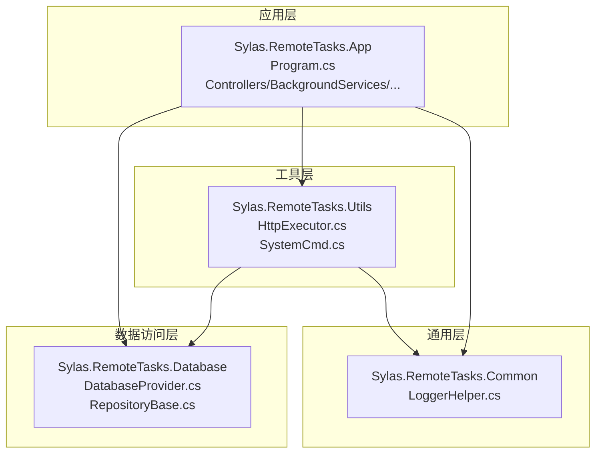
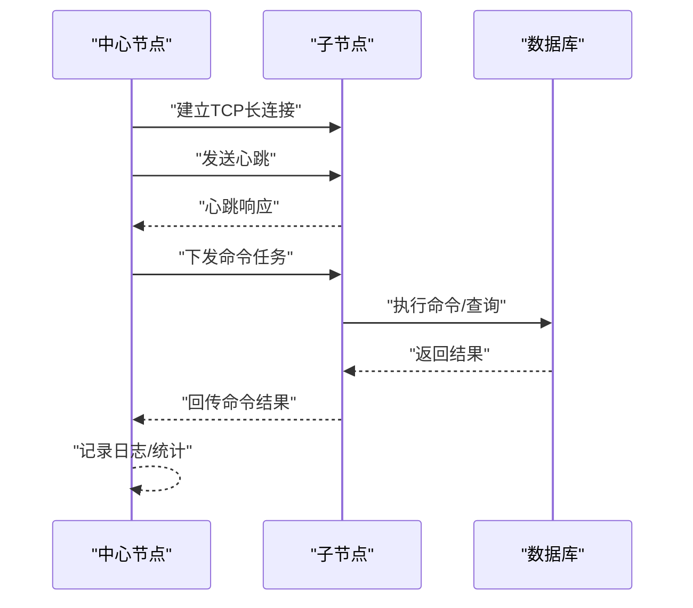
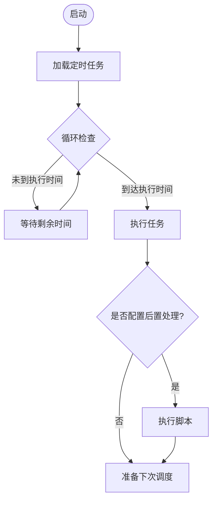
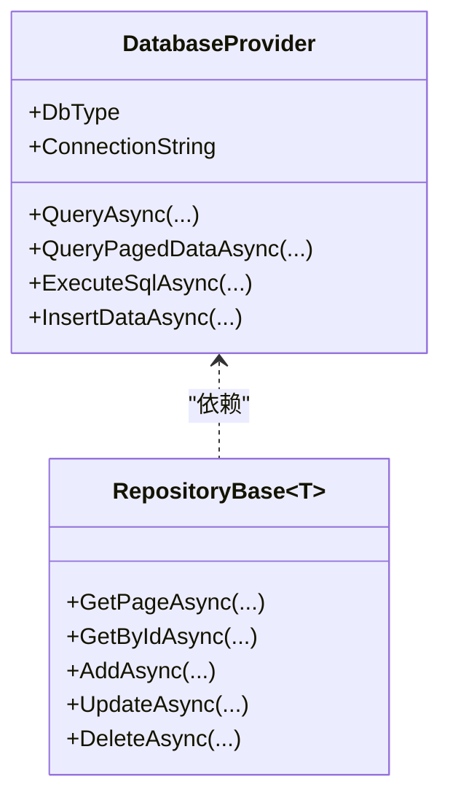
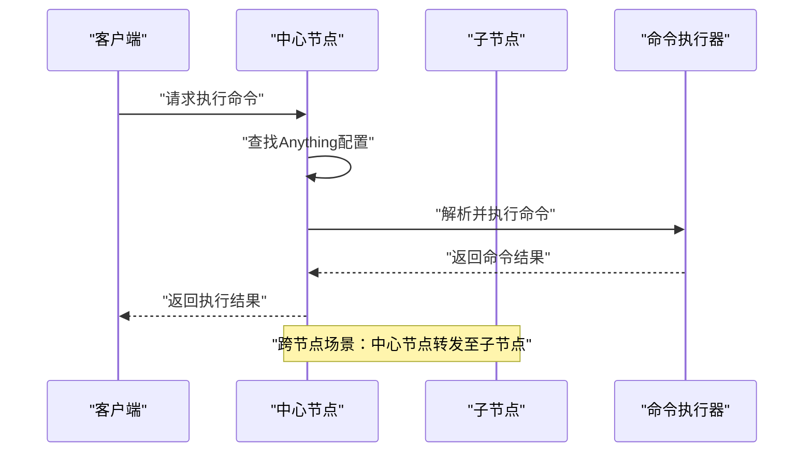
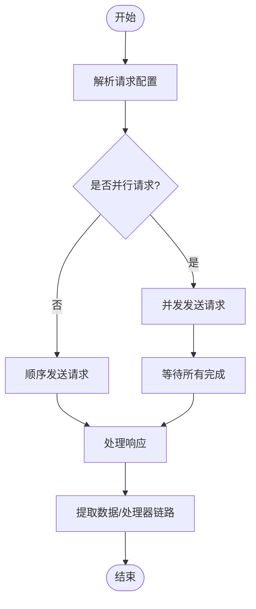
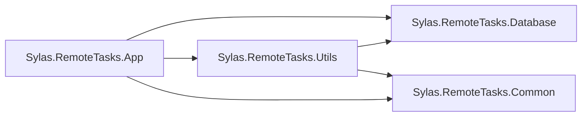

# 性能诊断与优化

<cite>
**本文档引用的文件**
- [appsettings.json](file://Sylas.RemoteTasks.App/appsettings.json)
- [Program.cs](file://Sylas.RemoteTasks.App/Program.cs)
- [PublishService.cs](file://Sylas.RemoteTasks.App/BackgroundServices/PublishService.cs)
- [ServerRegistrationService.cs](file://Sylas.RemoteTasks.App/BackgroundServices/ServerRegistrationService.cs)
- [DatabaseProvider.cs](file://Sylas.RemoteTasks.Database/DatabaseProvider.cs)
- [RepositoryBase.cs](file://Sylas.RemoteTasks.App/Infrastructure/RepositoryBase.cs)
- [RequestProcessorService.cs](file://Sylas.RemoteTasks.App/RequestProcessor/RequestProcessorService.cs)
- [AnythingService.cs](file://Sylas.RemoteTasks.App/RemoteHostModule/Anything/AnythingService.cs)
- [HttpExecutor.cs](file://Sylas.RemoteTasks.Utils/CommandExecutor/HttpExecutor.cs)
- [LoggerHelper.cs](file://Sylas.RemoteTasks.Common/LoggerHelper.cs)
- [Sylas.RemoteTasks.App.csproj](file://Sylas.RemoteTasks.App/Sylas.RemoteTasks.App.csproj)
- [Sylas.RemoteTasks.Database.csproj](file://Sylas.RemoteTasks.Database/Sylas.RemoteTasks.Database.csproj)
- [Sylas.RemoteTasks.Utils.csproj](file://Sylas.RemoteTasks.Utils/Sylas.RemoteTasks.Utils.csproj)
</cite>

## 目录
1. [简介](#简介)
2. [项目结构](#项目结构)
3. [核心组件](#核心组件)
4. [架构总览](#架构总览)
5. [详细组件分析](#详细组件分析)
6. [依赖关系分析](#依赖关系分析)
7. [性能考量](#性能考量)
8. [故障排查指南](#故障排查指南)
9. [结论](#结论)
10. [附录](#附录)

## 简介
本文件面向 Sylas.RemoteTasks 的性能诊断与优化，聚焦以下目标：
- 识别与定位 CPU 使用率过高、内存泄漏、数据库查询缓慢、网络延迟等性能问题
- 建立性能监控指标体系与基准测试方法（响应时间、吞吐量、并发用户数、资源利用率等）
- 提供数据库优化、缓存策略、并发控制、资源池管理等优化策略与实施步骤
- 推荐性能测试工具与自动化监控配置思路

## 项目结构
系统采用多项目分层组织，核心模块包括：
- 应用层（Sylas.RemoteTasks.App）：Web 主机、控制器、后台服务、远程主机模块、请求处理器、基础设施仓储等
- 数据访问层（Sylas.RemoteTasks.Database）：数据库抽象、通用仓储、SQL 构建与执行
- 工具层（Sylas.RemoteTasks.Utils）：命令执行器（HTTP、系统命令、SSH）、模板引擎、消息与网络辅助
- 通用层（Sylas.RemoteTasks.Common）：通用 DTO、扩展、日志与辅助工具



图表来源
- [Program.cs](file://Sylas.RemoteTasks.App/Program.cs#L1-L122)
- [DatabaseProvider.cs](file://Sylas.RemoteTasks.Database/DatabaseProvider.cs#L1-L485)
- [RepositoryBase.cs](file://Sylas.RemoteTasks.App/Infrastructure/RepositoryBase.cs#L1-L233)
- [HttpExecutor.cs](file://Sylas.RemoteTasks.Utils/CommandExecutor/HttpExecutor.cs#L1-L258)
- [LoggerHelper.cs](file://Sylas.RemoteTasks.Common/LoggerHelper.cs#L1-L115)

章节来源
- [Program.cs](file://Sylas.RemoteTasks.App/Program.cs#L1-L122)
- [Sylas.RemoteTasks.App.csproj](file://Sylas.RemoteTasks.App/Sylas.RemoteTasks.App.csproj#L1-L61)
- [Sylas.RemoteTasks.Database.csproj](file://Sylas.RemoteTasks.Database/Sylas.RemoteTasks.Database.csproj#L1-L52)
- [Sylas.RemoteTasks.Utils.csproj](file://Sylas.RemoteTasks.Utils/Sylas.RemoteTasks.Utils.csproj#L1-L47)

## 核心组件
- 应用启动与管线：Program.cs 负责注册缓存、认证授权、SignalR、HttpClient、仓储与后台服务，配置 Kestrel 上传限制等
- 后台服务
  - PublishService：基于 TCP 的发布/订阅与命令下发，负责与子节点通信、心跳、断线重连、命令发送与结果接收
  - ServerRegistrationService：服务节点注册/注销、定时任务调度、Cron 解析与执行
- 数据访问
  - DatabaseProvider：统一数据库访问、参数化查询、分页查询、动态 SQL 构建与执行
  - RepositoryBase：基于 Dapper 的通用仓储，封装 CRUD 与分页查询
- 远程执行
  - AnythingService：Anything 配置与命令执行，含内存缓存、跨节点命令转发、命令队列与结果收集
  - HttpExecutor：HTTP 请求执行器，支持串并行、压力测试、响应提取与数据处理器链路
- 日志与监控
  - LoggerHelper：异步/同步日志写入、心跳日志记录、控制台输出

章节来源
- [Program.cs](file://Sylas.RemoteTasks.App/Program.cs#L1-L122)
- [PublishService.cs](file://Sylas.RemoteTasks.App/BackgroundServices/PublishService.cs#L1-L645)
- [ServerRegistrationService.cs](file://Sylas.RemoteTasks.App/BackgroundServices/ServerRegistrationService.cs#L1-L493)
- [DatabaseProvider.cs](file://Sylas.RemoteTasks.Database/DatabaseProvider.cs#L1-L485)
- [RepositoryBase.cs](file://Sylas.RemoteTasks.App/Infrastructure/RepositoryBase.cs#L1-L233)
- [AnythingService.cs](file://Sylas.RemoteTasks.App/RemoteHostModule/Anything/AnythingService.cs#L1-L680)
- [HttpExecutor.cs](file://Sylas.RemoteTasks.Utils/CommandExecutor/HttpExecutor.cs#L1-L258)
- [LoggerHelper.cs](file://Sylas.RemoteTasks.Common/LoggerHelper.cs#L1-L115)

## 架构总览
系统采用“中心节点 + 子节点”的分布式架构，通过 TCP 长连接进行心跳与命令下发；应用层通过 SignalR 提供实时通知；数据访问层统一抽象数据库操作；工具层提供命令执行与网络能力。

```mermaid
graph TB
Center["中心节点<br/>PublishService<br/>ServerRegistrationService"]
Child["子节点/服务节点<br/>PublishService<br/>AnythingService"]
DB["数据库<br/>DatabaseProvider/RepositoryBase"]
Utils["工具层<br/>HttpExecutor/SystemCmd"]
Center <- --> Child
Center --> DB
Child --> DB
Center --> Utils
Child --> Utils
```

图表来源
- [PublishService.cs](file://Sylas.RemoteTasks.App/BackgroundServices/PublishService.cs#L1-L645)
- [ServerRegistrationService.cs](file://Sylas.RemoteTasks.App/BackgroundServices/ServerRegistrationService.cs#L1-L493)
- [DatabaseProvider.cs](file://Sylas.RemoteTasks.Database/DatabaseProvider.cs#L1-L485)
- [RepositoryBase.cs](file://Sylas.RemoteTasks.App/Infrastructure/RepositoryBase.cs#L1-L233)
- [HttpExecutor.cs](file://Sylas.RemoteTasks.Utils/CommandExecutor/HttpExecutor.cs#L1-L258)

## 详细组件分析

### 组件A：TCP 发布与命令下发（PublishService）
- 关键职责
  - 监听 TCP 端口，接受子节点连接
  - 心跳检测与断线重连
  - 命令下发与结果回传
  - 与中心服务器建立长连接，接收中心任务并转发至子节点
- 性能关注点
  - 线程模型：每连接派生子线程处理，需关注线程数量与上下文切换成本
  - 缓冲区大小与粘包处理：缓冲区过大/过小都会影响吞吐与内存占用
  - 心跳频率与超时：过于频繁的心跳增加网络负载，过于稀疏可能导致误判断线
  - 异常恢复：连接异常、接收超时、关闭信号处理
- 优化建议
  - 使用连接池与复用，减少频繁创建销毁
  - 采用异步 I/O 与背压机制，避免阻塞
  - 合理设置心跳周期与超时阈值，结合日志辅助定位网络抖动
  - 对命令队列与结果收集使用并发安全容器，避免锁竞争



图表来源
- [PublishService.cs](file://Sylas.RemoteTasks.App/BackgroundServices/PublishService.cs#L346-L434)
- [PublishService.cs](file://Sylas.RemoteTasks.App/BackgroundServices/PublishService.cs#L443-L624)

章节来源
- [PublishService.cs](file://Sylas.RemoteTasks.App/BackgroundServices/PublishService.cs#L1-L645)

### 组件B：服务注册与定时任务（ServerRegistrationService）
- 关键职责
  - 服务节点注册/注销（状态字段）
  - Cron 表达式解析与任务调度
  - 任务执行与结果处理（脚本执行）
- 性能关注点
  - Cron 解析缓存：并发调度场景下解析开销
  - 任务执行粒度：单任务串行 vs 多任务并行
  - 内存占用：运行中任务集合与取消令牌
- 优化建议
  - 使用轻量级调度器或队列，避免轮询过于频繁
  - 对 Cron 解析结果进行缓存，减少重复计算
  - 严格控制任务生命周期，及时释放 Scope 与对象



图表来源
- [ServerRegistrationService.cs](file://Sylas.RemoteTasks.App/BackgroundServices/ServerRegistrationService.cs#L187-L341)

章节来源
- [ServerRegistrationService.cs](file://Sylas.RemoteTasks.App/BackgroundServices/ServerRegistrationService.cs#L1-L493)

### 组件C：数据库访问（DatabaseProvider/RepositoryBase）
- 关键职责
  - 统一数据库连接、参数化查询、分页查询、动态 SQL
  - 仓储封装 CRUD 与分页
- 性能关注点
  - 参数化查询与 SQL 注入防护
  - 分页查询的 COUNT 与 LIMIT 实现
  - 不同数据库类型的适配与执行计划复用
- 优化建议
  - 使用参数化查询，避免字符串拼接
  - 为高频查询建立索引与合适的统计信息
  - 分页查询使用覆盖索引，减少回表
  - 对大结果集采用流式读取或分批处理



图表来源
- [DatabaseProvider.cs](file://Sylas.RemoteTasks.Database/DatabaseProvider.cs#L1-L485)
- [RepositoryBase.cs](file://Sylas.RemoteTasks.App/Infrastructure/RepositoryBase.cs#L1-L233)

章节来源
- [DatabaseProvider.cs](file://Sylas.RemoteTasks.Database/DatabaseProvider.cs#L1-L485)
- [RepositoryBase.cs](file://Sylas.RemoteTasks.App/Infrastructure/RepositoryBase.cs#L1-L233)

### 组件D：远程执行与命令队列（AnythingService）
- 关键职责
  - Anything 配置与命令解析
  - 命令执行器选择与参数解析
  - 跨节点命令转发与结果收集
  - 内存缓存与模板变量解析
- 性能关注点
  - 命令执行器实例映射与缓存
  - 命令队列与结果容器的并发安全
  - 跨节点通信的网络延迟与超时
- 优化建议
  - 对常用 Anything 配置与执行器进行缓存
  - 使用并发字典与队列，避免锁争用
  - 对跨节点命令设置合理超时与重试策略



图表来源
- [AnythingService.cs](file://Sylas.RemoteTasks.App/RemoteHostModule/Anything/AnythingService.cs#L294-L389)

章节来源
- [AnythingService.cs](file://Sylas.RemoteTasks.App/RemoteHostModule/Anything/AnythingService.cs#L1-L680)

### 组件E：HTTP 请求执行器（HttpExecutor）
- 关键职责
  - 单请求/批量请求执行
  - 压力测试场景的多线程请求
  - 响应提取与数据处理器链路
- 性能关注点
  - HttpClient 复用与连接池
  - 多线程并发与背压
  - 响应提取与模板解析开销
- 优化建议
  - 使用 IHttpClientFactory 管理 HttpClient 实例
  - 合理设置超时与重试策略
  - 对模板解析与响应提取进行缓存



图表来源
- [HttpExecutor.cs](file://Sylas.RemoteTasks.Utils/CommandExecutor/HttpExecutor.cs#L29-L140)
- [HttpExecutor.cs](file://Sylas.RemoteTasks.Utils/CommandExecutor/HttpExecutor.cs#L148-L255)

章节来源
- [HttpExecutor.cs](file://Sylas.RemoteTasks.Utils/CommandExecutor/HttpExecutor.cs#L1-L258)

## 依赖关系分析
- 应用层依赖数据访问层与工具层，工具层再依赖数据访问层
- 项目间引用关系清晰，便于隔离与测试
- 关键外部依赖：Dapper、Microsoft.Extensions.*、Newtonsoft.Json、SSH.NET、SignalR



图表来源
- [Sylas.RemoteTasks.App.csproj](file://Sylas.RemoteTasks.App/Sylas.RemoteTasks.App.csproj#L42-L43)
- [Sylas.RemoteTasks.Database.csproj](file://Sylas.RemoteTasks.Database/Sylas.RemoteTasks.Database.csproj#L35-L36)
- [Sylas.RemoteTasks.Utils.csproj](file://Sylas.RemoteTasks.Utils/Sylas.RemoteTasks.Utils.csproj#L32-L33)

章节来源
- [Sylas.RemoteTasks.App.csproj](file://Sylas.RemoteTasks.App/Sylas.RemoteTasks.App.csproj#L1-L61)
- [Sylas.RemoteTasks.Database.csproj](file://Sylas.RemoteTasks.Database/Sylas.RemoteTasks.Database.csproj#L1-L52)
- [Sylas.RemoteTasks.Utils.csproj](file://Sylas.RemoteTasks.Utils/Sylas.RemoteTasks.Utils.csproj#L1-L47)

## 性能考量
- 响应时间
  - 通过日志记录关键路径耗时（如仓储 SQL 生成、命令执行、HTTP 请求）
  - 在关键方法处埋点，统计 P50/P95/P99 响应时间
- 吞吐量
  - 统计每秒事务数（TPS），区分请求处理、数据库写入、网络往返
  - 压测工具模拟并发请求，观察系统在不同负载下的表现
- 并发用户数
  - 评估 TCP 连接数、线程数、HttpClient 连接池大小
  - 监控队列长度与等待时间，避免阻塞
- 资源利用率
  - CPU：热点方法、GC 次数与暂停时间
  - 内存：对象分配、缓存命中率、内存泄漏检测
  - 磁盘：日志文件大小、临时文件清理
  - 网络：带宽、延迟、丢包率

章节来源
- [RepositoryBase.cs](file://Sylas.RemoteTasks.App/Infrastructure/RepositoryBase.cs#L73-L120)
- [AnythingService.cs](file://Sylas.RemoteTasks.App/RemoteHostModule/Anything/AnythingService.cs#L607-L617)
- [LoggerHelper.cs](file://Sylas.RemoteTasks.Common/LoggerHelper.cs#L48-L76)

## 故障排查指南
- CPU 使用率过高
  - 检查是否存在大量线程或死循环（TCP 服务、定时任务）
  - 关注模板解析与 JSON 序列化开销
  - 使用性能分析器定位热点方法
- 内存泄漏
  - 检查缓存项是否正确过期（AnythingService 内存缓存）
  - 确认 Scope 与对象释放时机（RepositoryBase、AnythingService）
  - 监控 GC 与大对象堆
- 数据库查询缓慢
  - 检查慢查询日志与执行计划
  - 优化分页查询、添加必要索引
  - 使用参数化查询，避免隐式转换
- 网络延迟
  - 心跳频率与超时阈值调整
  - 压测网络环境，识别瓶颈
  - 优化 HTTP 请求并发与重试策略

章节来源
- [PublishService.cs](file://Sylas.RemoteTasks.App/BackgroundServices/PublishService.cs#L482-L543)
- [ServerRegistrationService.cs](file://Sylas.RemoteTasks.App/BackgroundServices/ServerRegistrationService.cs#L196-L340)
- [AnythingService.cs](file://Sylas.RemoteTasks.App/RemoteHostModule/Anything/AnythingService.cs#L274-L276)
- [DatabaseProvider.cs](file://Sylas.RemoteTasks.Database/DatabaseProvider.cs#L337-L370)

## 结论
通过对 TCP 通信、数据库访问、远程执行与定时调度等关键路径的性能分析，建议从“连接池与异步 I/O、参数化与索引优化、缓存与并发控制、日志与监控”四个方面入手，持续优化系统在高并发与大数据量场景下的稳定性与吞吐能力。

## 附录
- 性能监控指标清单
  - 响应时间：P50/P95/P99
  - 吞吐量：TPS/QPS
  - 并发用户数：活跃连接/线程数
  - 资源利用率：CPU/内存/磁盘/网络
  - 错误率：HTTP/数据库/网络异常
- 基准测试方法
  - 使用压测工具模拟并发请求，逐步提升负载，记录系统指标
  - 区分读写比例与数据规模，评估瓶颈点
- 自动化监控配置建议
  - 结合日志与性能计数器，建立告警阈值
  - 对关键路径埋点，形成仪表板
  - 定期巡检缓存命中率与数据库慢查询