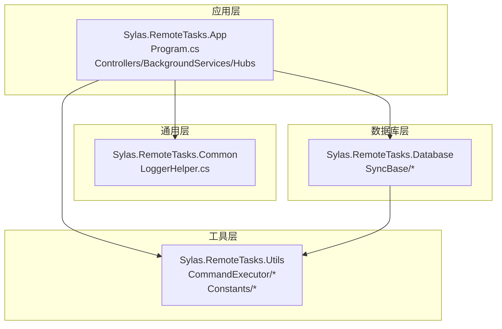
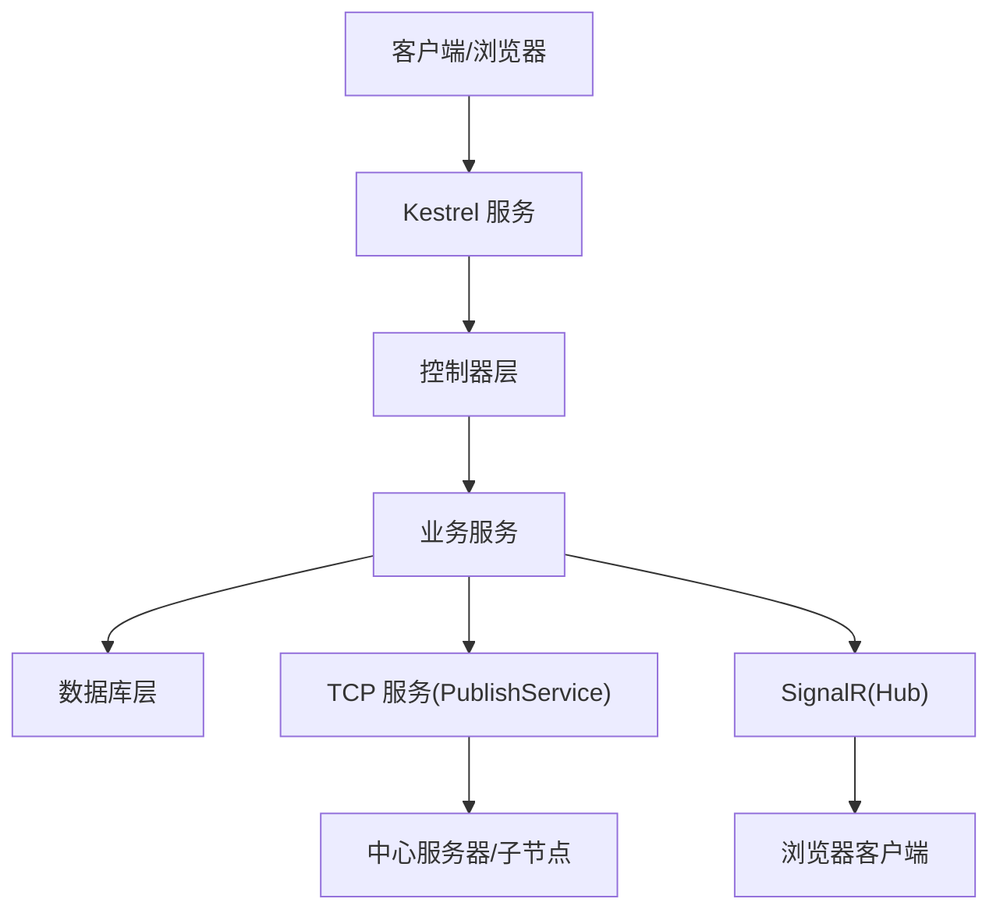
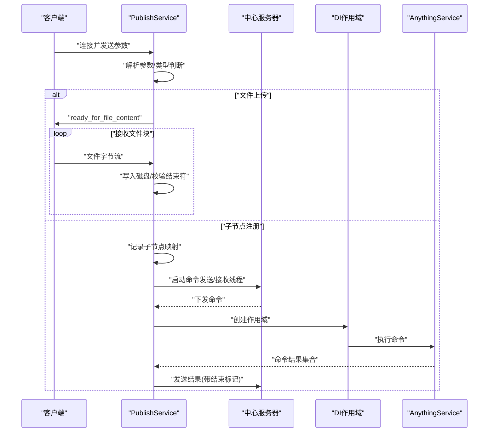
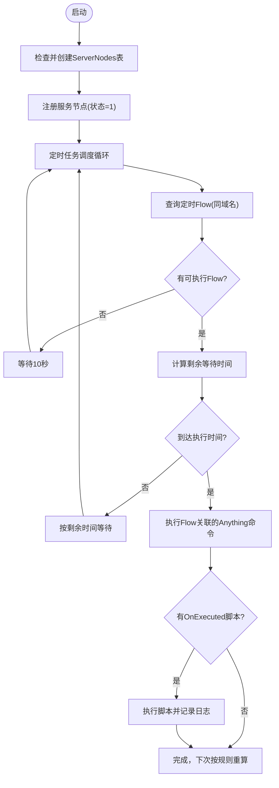
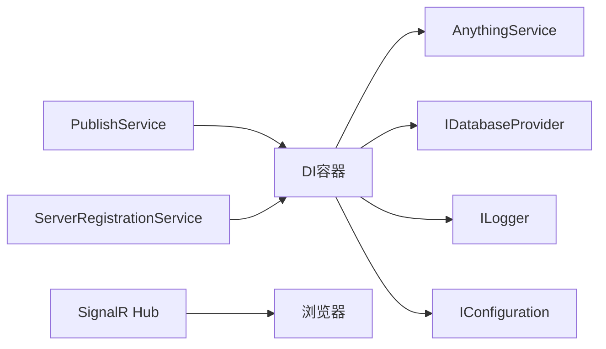

# 故障排查指南

<cite>
**本文引用的文件**
- [README.md](file://README.md)
- [appsettings.json](file://Sylas.RemoteTasks.App/appsettings.json)
- [Program.cs](file://Sylas.RemoteTasks.App/Program.cs)
- [LoggerHelper.cs](file://Sylas.RemoteTasks.Common/LoggerHelper.cs)
- [LambdaHandler.cs](file://Sylas.RemoteTasks.App/ExceptionHandlers/LambdaHandler.cs)
- [PublishService.cs](file://Sylas.RemoteTasks.App/BackgroundServices/PublishService.cs)
- [ServerRegistrationService.cs](file://Sylas.RemoteTasks.App/BackgroundServices/ServerRegistrationService.cs)
- [signalr.js](file://Sylas.RemoteTasks.App/wwwroot/lib/signalr/dist/browser/signalr.js)
- [SystemCmd.cs](file://Sylas.RemoteTasks.Utils/CommandExecutor/SystemCmd.cs)
- [DbConnectionDetail.cs](file://Sylas.RemoteTasks.Database/SyncBase/DbConnectionDetail.cs)
- [DatabaseConstants.cs](file://Sylas.RemoteTasks.Utils/Constants/DatabaseConstants.cs)
- [DatabaseInfo.cs](file://Sylas.RemoteTasks.Database/SyncBase/DatabaseInfo.cs)
- [TokenValidationHelper.cs](file://Sylas.RemoteTasks.App/Helpers/TokenValidationHelper.cs)
- [Error.cshtml](file://Sylas.RemoteTasks.App/Views/Shared/Error.cshtml)
</cite>

## 目录
1. [简介](#简介)
2. [项目结构](#项目结构)
3. [核心组件](#核心组件)
4. [架构总览](#架构总览)
5. [详细组件分析](#详细组件分析)
6. [依赖关系分析](#依赖关系分析)
7. [性能考量](#性能考量)
8. [故障排查指南](#故障排查指南)
9. [结论](#结论)
10. [附录](#附录)

## 简介
本指南面向 Sylas.RemoteTasks 的运维与开发人员，聚焦于常见问题定位、日志分析、性能诊断、网络与数据库问题排查，提供可操作的排查步骤、解决方案、日志分析工具与调试技巧，并给出预防性维护与监控告警建议。文档基于仓库源码进行梳理，确保与实际实现一致。

## 项目结构
Sylas.RemoteTasks 采用多项目组合的解决方案，核心应用位于 Sylas.RemoteTasks.App，包含后台服务、控制器、数据处理与远程执行模块；通用工具与数据库抽象分别位于 Sylas.RemoteTasks.Common 与 Sylas.RemoteTasks.Database；实用工具位于 Sylas.RemoteTasks.Utils。

图表来源
- [Program.cs](file://Sylas.RemoteTasks.App/Program.cs#L1-L122)
- [LoggerHelper.cs](file://Sylas.RemoteTasks.Common/LoggerHelper.cs#L1-L115)
- [DbConnectionDetail.cs](file://Sylas.RemoteTasks.Database/SyncBase/DbConnectionDetail.cs#L1-L54)

章节来源
- [README.md](file://README.md#L1-L43)
- [appsettings.json](file://Sylas.RemoteTasks.App/appsettings.json#L1-L142)
- [Program.cs](file://Sylas.RemoteTasks.App/Program.cs#L1-L122)

## 核心组件
- 后台服务
  - PublishService：负责 TCP 服务端监听、文件上传接收、与子节点通信、心跳与重连。
  - ServerRegistrationService：服务节点注册/注销、定时任务调度。
- 异常处理
  - LambdaHandler：统一异常处理，返回标准结果结构。
- 日志
  - LoggerHelper：控制台与文件日志记录，支持异步写入。
- 网络与信号
  - SignalR 客户端脚本 signalr.js：长轮询、二进制传输、重试策略与错误日志。
- 数据库
  - DbConnectionDetail、DatabaseInfo、DatabaseConstants：数据库连接解析与常量。
- 身份验证
  - TokenValidationHelper：JWT 与引用令牌校验流程。
- 系统与资源
  - SystemCmd：系统信息采集、进程 CPU/内存统计。

章节来源
- [PublishService.cs](file://Sylas.RemoteTasks.App/BackgroundServices/PublishService.cs#L1-L645)
- [ServerRegistrationService.cs](file://Sylas.RemoteTasks.App/BackgroundServices/ServerRegistrationService.cs#L1-L493)
- [LambdaHandler.cs](file://Sylas.RemoteTasks.App/ExceptionHandlers/LambdaHandler.cs#L1-L28)
- [LoggerHelper.cs](file://Sylas.RemoteTasks.Common/LoggerHelper.cs#L1-L115)
- [signalr.js](file://Sylas.RemoteTasks.App/wwwroot/lib/signalr/dist/browser/signalr.js#L2260-L2309)
- [DbConnectionDetail.cs](file://Sylas.RemoteTasks.Database/SyncBase/DbConnectionDetail.cs#L1-L54)
- [DatabaseConstants.cs](file://Sylas.RemoteTasks.Utils/Constants/DatabaseConstants.cs#L1-L13)
- [DatabaseInfo.cs](file://Sylas.RemoteTasks.Database/SyncBase/DatabaseInfo.cs#L249-L281)
- [TokenValidationHelper.cs](file://Sylas.RemoteTasks.App/Helpers/TokenValidationHelper.cs#L207-L282)
- [SystemCmd.cs](file://Sylas.RemoteTasks.Utils/CommandExecutor/SystemCmd.cs#L381-L765)

## 架构总览
应用通过 Kestrel 提供 HTTP/HTTPS 服务，SignalR 用于实时通信；后台服务负责 TCP 通信、文件上传、与中心服务器的心跳与命令下发；数据库层提供连接解析与同步能力；工具层提供系统信息采集与命令执行。

图表来源
- [Program.cs](file://Sylas.RemoteTasks.App/Program.cs#L89-L121)
- [PublishService.cs](file://Sylas.RemoteTasks.App/BackgroundServices/PublishService.cs#L88-L340)
- [ServerRegistrationService.cs](file://Sylas.RemoteTasks.App/BackgroundServices/ServerRegistrationService.cs#L55-L93)
- [signalr.js](file://Sylas.RemoteTasks.App/wwwroot/lib/signalr/dist/browser/signalr.js#L1705-L1939)

## 详细组件分析

### TCP 服务与文件上传（PublishService）
- 功能要点
  - 监听本地 TCP 端口，接受客户端连接与任务参数。
  - 支持文件上传：接收文件名、大小、保存目录，按块接收并写入磁盘，校验结束标志。
  - 子节点注册：当参数包含特定标识时，建立子线程处理命令发送与结果接收。
  - 心跳与重连：与中心服务器保持长连接，定期发送心跳，超时自动重连。
- 关键日志位置
  - 心跳日志目录 Logs/Heartbeats。
  - 命令接收与结果回传日志目录 Logs/Commands。
- 错误处理
  - 连接异常、参数解析失败、文件写入失败、结束标志不符等均会记录错误并触发重连或中断。

图表来源
- [PublishService.cs](file://Sylas.RemoteTasks.App/BackgroundServices/PublishService.cs#L140-L334)
- [PublishService.cs](file://Sylas.RemoteTasks.App/BackgroundServices/PublishService.cs#L346-L434)
- [PublishService.cs](file://Sylas.RemoteTasks.App/BackgroundServices/PublishService.cs#L443-L624)

章节来源
- [PublishService.cs](file://Sylas.RemoteTasks.App/BackgroundServices/PublishService.cs#L1-L645)

### 服务注册与定时任务（ServerRegistrationService）
- 功能要点
  - 启动时注册服务节点至数据库表 ServerNodes，停止时注销。
  - 解析 AnythingFlow 定时任务，按 Cron 表达式调度执行。
  - 执行后可选执行 OnExecuted 脚本，输出结果。
- 关键点
  - Cron 解析支持秒、分、时三段表达式，缓存解析结果。
  - 每次循环释放 DI 作用域，避免内存泄漏。

图表来源
- [ServerRegistrationService.cs](file://Sylas.RemoteTasks.App/BackgroundServices/ServerRegistrationService.cs#L55-L93)
- [ServerRegistrationService.cs](file://Sylas.RemoteTasks.App/BackgroundServices/ServerRegistrationService.cs#L187-L341)
- [ServerRegistrationService.cs](file://Sylas.RemoteTasks.App/BackgroundServices/ServerRegistrationService.cs#L362-L490)

章节来源
- [ServerRegistrationService.cs](file://Sylas.RemoteTasks.App/BackgroundServices/ServerRegistrationService.cs#L1-L493)

### 异常处理与统一返回（LambdaHandler）
- 功能要点
  - 捕获异常并以 JSON 结构返回，状态码固定为 200，便于前端统一处理。
  - 适用于开发环境与生产环境的错误兜底。
- 注意事项
  - 生产环境建议结合日志与监控系统，避免将敏感信息直接暴露给前端。

章节来源
- [LambdaHandler.cs](file://Sylas.RemoteTasks.App/ExceptionHandlers/LambdaHandler.cs#L1-L28)
- [Error.cshtml](file://Sylas.RemoteTasks.App/Views/Shared/Error.cshtml#L1-L25)

### 日志体系（LoggerHelper）
- 功能要点
  - 控制台日志：Info/错误/严重级别输出。
  - 文件日志：异步追加写入，自动创建目录与文件名按日期命名。
- 使用建议
  - 结合应用日志配置与外部日志系统（如 Serilog、ELK）集中收集。

章节来源
- [LoggerHelper.cs](file://Sylas.RemoteTasks.Common/LoggerHelper.cs#L1-L115)

### SignalR 客户端行为（signalr.js）
- 关键行为
  - 长轮询传输、二进制支持、超时与错误日志、重试策略。
  - 服务端返回非 200 状态码时记录错误并触发关闭逻辑。
- 故障定位
  - 关注客户端日志中的“Unexpected response code”、“Poll terminated by server”等提示。

章节来源
- [signalr.js](file://Sylas.RemoteTasks.App/wwwroot/lib/signalr/dist/browser/signalr.js#L2260-L2309)
- [signalr.js](file://Sylas.RemoteTasks.App/wwwroot/lib/signalr/dist/browser/signalr.js#L1705-L1939)

### 数据库连接与常量（DbConnectionDetail、DatabaseInfo、DatabaseConstants）
- 功能要点
  - 解析多种数据库连接字符串，提取主机、端口、账号、密码、数据库类型等。
  - 提供连接关键字白名单，辅助安全审计。
- 常见问题
  - 连接字符串格式不正确、缺少必要关键字、端口默认值差异。

章节来源
- [DbConnectionDetail.cs](file://Sylas.RemoteTasks.Database/SyncBase/DbConnectionDetail.cs#L1-L54)
- [DatabaseInfo.cs](file://Sylas.RemoteTasks.Database/SyncBase/DatabaseInfo.cs#L249-L281)
- [DatabaseConstants.cs](file://Sylas.RemoteTasks.Utils/Constants/DatabaseConstants.cs#L1-L13)

### 身份验证与令牌校验（TokenValidationHelper）
- 功能要点
  - 支持 JWT 与引用令牌（introspection）校验，自动选择有效方案。
  - 记录令牌检索、有效性与错误信息，便于定位鉴权问题。
- 常见问题
  - Audience/Scope 配置不一致、时钟偏移、令牌格式不兼容。

章节来源
- [TokenValidationHelper.cs](file://Sylas.RemoteTasks.App/Helpers/TokenValidationHelper.cs#L207-L282)
- [TokenValidationHelper.cs](file://Sylas.RemoteTasks.App/Helpers/TokenValidationHelper.cs#L493-L532)

### 系统与资源监控（SystemCmd）
- 功能要点
  - 采集系统 CPU/内存、磁盘使用率，进程 CPU/内存统计。
  - 跨平台适配（Windows/Linux）。
- 使用建议
  - 结合定时任务或仪表板展示，作为健康检查与容量规划依据。

章节来源
- [SystemCmd.cs](file://Sylas.RemoteTasks.Utils/CommandExecutor/SystemCmd.cs#L381-L765)

## 依赖关系分析
- 组件耦合
  - PublishService 依赖 DI 容器获取 AnythingService、日志与配置。
  - ServerRegistrationService 依赖数据库提供者与 RepositoryBase。
  - SignalR 与前端交互，受 Kestrel 与路由配置影响。
- 外部依赖
  - 数据库驱动、网络栈、操作系统命令行工具。
- 循环依赖风险
  - 通过 DI 与作用域隔离，避免直接循环引用。

图表来源
- [Program.cs](file://Sylas.RemoteTasks.App/Program.cs#L60-L68)
- [PublishService.cs](file://Sylas.RemoteTasks.App/BackgroundServices/PublishService.cs#L50-L86)
- [ServerRegistrationService.cs](file://Sylas.RemoteTasks.App/BackgroundServices/ServerRegistrationService.cs#L66-L90)

章节来源
- [Program.cs](file://Sylas.RemoteTasks.App/Program.cs#L1-L122)

## 性能考量
- 线程与并发
  - TCP 服务对每个客户端连接启用子线程处理，注意高并发下的线程池与资源消耗。
- I/O 优化
  - 文件上传使用大缓冲区，建议结合磁盘吞吐与网络带宽评估。
- 心跳与重连
  - 心跳频率与超时阈值需平衡网络抖动与资源占用。
- 定时任务
  - Cron 解析结果缓存，避免重复计算；每次循环释放作用域，降低内存压力。
- 日志与监控
  - 异步文件写入减少阻塞；结合外部日志系统进行聚合分析。

[本节为通用指导，无需列出具体文件来源]

## 故障排查指南

### 一、常见问题与排查步骤

1) TCP 服务端无法接收文件或连接异常
- 现象
  - 客户端发送“ready_for_file_content”后无响应，或日志报错“文件名为空”“保存路径无效”。
- 排查步骤
  - 检查服务端配置项 Upload:SaveDir 是否设置，或客户端是否传入保存目录。
  - 确认文件大小、文件名参数是否正确传递，结束符“000000”是否完整。
  - 查看 Logs/Heartbeats 与 Logs/Commands 下的心跳与命令日志。
- 解决方案
  - 设置正确的保存目录；确保客户端按协议发送参数与结束符；修复网络中断导致的粘包问题。

章节来源
- [PublishService.cs](file://Sylas.RemoteTasks.App/BackgroundServices/PublishService.cs#L156-L215)
- [appsettings.json](file://Sylas.RemoteTasks.App/appsettings.json#L39-L43)

2) 子节点注册与命令下发失败
- 现象
  - 子节点连接后未收到命令，或命令结果未回传。
- 排查步骤
  - 检查中心服务器配置 CenterServer 与 CenterServerPort。
  - 关注“子节点连接参数”“命令发送/接收线程”日志。
  - 校验子节点域名与实例路径标识是否唯一且一致。
- 解决方案
  - 修正配置；确保唯一实例标识；检查 DI 作用域创建与 AnythingService 调用链。

章节来源
- [PublishService.cs](file://Sylas.RemoteTasks.App/BackgroundServices/PublishService.cs#L280-L326)
- [PublishService.cs](file://Sylas.RemoteTasks.App/BackgroundServices/PublishService.cs#L443-L624)

3) 心跳超时与连接中断
- 现象
  - 日志出现“超过心跳频率未收到心跳包”“心跳包发送失败”等。
- 排查步骤
  - 检查网络连通性与防火墙策略。
  - 校验心跳频率与超时阈值配置。
  - 查看 Logs/Heartbeats 下的 keep-alive 记录。
- 解决方案
  - 调整心跳参数；修复网络波动；增加重连退避策略。

章节来源
- [PublishService.cs](file://Sylas.RemoteTasks.App/BackgroundServices/PublishService.cs#L519-L543)
- [PublishService.cs](file://Sylas.RemoteTasks.App/BackgroundServices/PublishService.cs#L530-L542)

4) SignalR 连接失败或长轮询异常
- 现象
  - 客户端日志出现“Unexpected response code”“Poll terminated by server”。
- 排查步骤
  - 检查服务端路由、中间件顺序与 HTTPS 配置。
  - 关注 SignalR 客户端日志中的错误级别与用户代理头。
- 解决方案
  - 修正路由与中间件顺序；确保 HTTPS 证书与协议配置正确；优化长轮询超时与重试。

章节来源
- [signalr.js](file://Sylas.RemoteTasks.App/wwwroot/lib/signalr/dist/browser/signalr.js#L2260-L2309)
- [Program.cs](file://Sylas.RemoteTasks.App/Program.cs#L109-L121)

5) 数据库连接失败或参数不完整
- 现象
  - 连接字符串解析失败、缺少关键字或端口默认值不匹配。
- 排查步骤
  - 使用 DatabaseInfo 解析连接字符串，核对主机、端口、账号、密码、数据库。
  - 检查 AllowedConnectionStringKeywords 白名单配置。
- 解决方案
  - 修正连接字符串格式；补充缺失关键字；统一端口配置。

章节来源
- [DatabaseInfo.cs](file://Sylas.RemoteTasks.Database/SyncBase/DatabaseInfo.cs#L249-L281)
- [DatabaseConstants.cs](file://Sylas.RemoteTasks.Utils/Constants/DatabaseConstants.cs#L1-L13)
- [appsettings.json](file://Sylas.RemoteTasks.App/appsettings.json#L20-L23)

6) 定时任务未执行或执行异常
- 现象
  - Cron 表达式无效、任务未触发、执行后脚本失败。
- 排查步骤
  - 检查 Cron 表达式格式与解析缓存。
  - 查看 AnythingFlow 表记录与 OnExecuted 脚本参数。
  - 关注日志目录 Logs/AnythingFlow 的执行记录。
- 解决方案
  - 修正 Cron 表达式；确保脚本可执行与参数正确；优化作用域释放。

章节来源
- [ServerRegistrationService.cs](file://Sylas.RemoteTasks.App/BackgroundServices/ServerRegistrationService.cs#L362-L490)
- [ServerRegistrationService.cs](file://Sylas.RemoteTasks.App/BackgroundServices/ServerRegistrationService.cs#L187-L341)

7) 身份验证失败
- 现象
  - JWT 或引用令牌校验失败，返回未认证。
- 排查步骤
  - 检查 IdentityServer 配置、Audience/Scope、时钟偏移。
  - 查看 TokenValidationHelper 的日志与异常分支。
- 解决方案
  - 统一配置与密钥；调整 ClockSkew；确保令牌格式与签名有效。

章节来源
- [TokenValidationHelper.cs](file://Sylas.RemoteTasks.App/Helpers/TokenValidationHelper.cs#L493-L532)
- [TokenValidationHelper.cs](file://Sylas.RemoteTasks.App/Helpers/TokenValidationHelper.cs#L277-L282)

### 二、日志分析与调试技巧

- 日志位置
  - 控制台：LoggerHelper 控制台输出。
  - 文件：默认 Logs/Others 与 Logs/Heartbeats、Logs/Commands、Logs/AnythingFlow。
- 分析要点
  - 时间戳与线程/Socket 标识，快速定位会话。
  - 错误级别：Critical/Error/Warning 区分紧急程度。
  - 关键事件：文件上传完成、命令下发/回传、心跳、连接建立/断开。
- 调试技巧
  - 临时提升日志级别（如 Debug）观察细节。
  - 使用外部日志系统聚合，设置告警阈值。
  - 对高频日志进行采样与去噪。

章节来源
- [LoggerHelper.cs](file://Sylas.RemoteTasks.Common/LoggerHelper.cs#L48-L112)
- [PublishService.cs](file://Sylas.RemoteTasks.App/BackgroundServices/PublishService.cs#L400-L425)
- [ServerRegistrationService.cs](file://Sylas.RemoteTasks.App/BackgroundServices/ServerRegistrationService.cs#L217-L306)

### 三、性能诊断

- TCP 与文件上传
  - 监控缓冲区使用、磁盘写入速率、网络带宽利用率。
  - 优化：分块大小、并发连接数、磁盘 IOPS。
- 定时任务
  - Cron 解析缓存命中率、作用域释放及时性。
  - 优化：减少不必要的查询与序列化。
- SignalR
  - 长轮询超时、重试次数与延迟，二进制传输开销。
  - 优化：合理设置超时与重试策略，必要时切换到 WebSockets。
- 系统资源
  - 使用 SystemCmd 采集 CPU/内存/磁盘，结合仪表板可视化。

章节来源
- [SystemCmd.cs](file://Sylas.RemoteTasks.Utils/CommandExecutor/SystemCmd.cs#L381-L765)
- [signalr.js](file://Sylas.RemoteTasks.App/wwwroot/lib/signalr/dist/browser/signalr.js#L2735-L2751)

### 四、网络问题排查

- 连接与端口
  - 检查 TcpPort、CenterServerPort 是否开放与映射。
  - 使用 telnet 或 nc 验证端口连通性。
- 防火墙与代理
  - 确认防火墙放行与代理配置（如 Nginx）。
- TLS/HTTPS
  - 校验证书路径与协议版本，避免客户端证书校验失败。

章节来源
- [appsettings.json](file://Sylas.RemoteTasks.App/appsettings.json#L29-L64)
- [Program.cs](file://Sylas.RemoteTasks.App/Program.cs#L14-L17)
- [signalr.js](file://Sylas.RemoteTasks.App/wwwroot/lib/signalr/dist/browser/signalr.js#L2260-L2309)

### 五、数据库问题排查

- 连接字符串
  - 使用 DatabaseInfo 解析，核对关键字与正则匹配。
- 权限与实例
  - 校验账号权限、实例名与端口。
- 连接池与超时
  - 适当调整连接超时与最大连接数。

章节来源
- [DatabaseInfo.cs](file://Sylas.RemoteTasks.Database/SyncBase/DatabaseInfo.cs#L249-L281)
- [DbConnectionDetail.cs](file://Sylas.RemoteTasks.Database/SyncBase/DbConnectionDetail.cs#L1-L54)

### 六、预防性维护与监控告警

- 日志与告警
  - 将 LoggerHelper 输出接入集中日志系统，设置 Error/Critical 告警。
- 健康检查
  - 定期检查 Logs/Heartbeats 与 Logs/Commands 的连续性。
- 资源监控
  - 使用 SystemCmd 采集系统指标，设置 CPU/内存/磁盘阈值告警。
- 配置审计
  - 审核 AllowedConnectionStringKeywords 与 IdentityServer 配置变更。

章节来源
- [LoggerHelper.cs](file://Sylas.RemoteTasks.Common/LoggerHelper.cs#L48-L112)
- [SystemCmd.cs](file://Sylas.RemoteTasks.Utils/CommandExecutor/SystemCmd.cs#L630-L765)
- [appsettings.json](file://Sylas.RemoteTasks.App/appsettings.json#L20-L23)
- [TokenValidationHelper.cs](file://Sylas.RemoteTasks.App/Helpers/TokenValidationHelper.cs#L493-L532)

## 结论
通过明确各组件职责、掌握日志与调试技巧、结合网络与数据库专项排查，可高效定位并解决 Sylas.RemoteTasks 的运行问题。建议持续完善监控与告警体系，配合预防性维护，保障系统稳定运行。

[本节为总结，无需列出具体文件来源]

## 附录

### A. 关键配置项速查
- 日志级别与控制台格式
- 上传保存目录 Upload:SaveDir
- TCP 端口 TcpPort、中心服务器 CenterServer/CenterServerPort
- 身份认证 IdentityServerConfiguration
- 请求管线 RequestPipeline

章节来源
- [appsettings.json](file://Sylas.RemoteTasks.App/appsettings.json#L1-L142)

### B. 常用排查清单
- 网络连通性与端口开放
- 心跳日志完整性
- 文件上传参数与结束符
- 定时任务 Cron 表达式
- 数据库连接字符串解析
- SignalR 长轮询状态码

章节来源
- [PublishService.cs](file://Sylas.RemoteTasks.App/BackgroundServices/PublishService.cs#L519-L624)
- [ServerRegistrationService.cs](file://Sylas.RemoteTasks.App/BackgroundServices/ServerRegistrationService.cs#L362-L490)
- [DatabaseInfo.cs](file://Sylas.RemoteTasks.Database/SyncBase/DatabaseInfo.cs#L249-L281)
- [signalr.js](file://Sylas.RemoteTasks.App/wwwroot/lib/signalr/dist/browser/signalr.js#L2260-L2309)