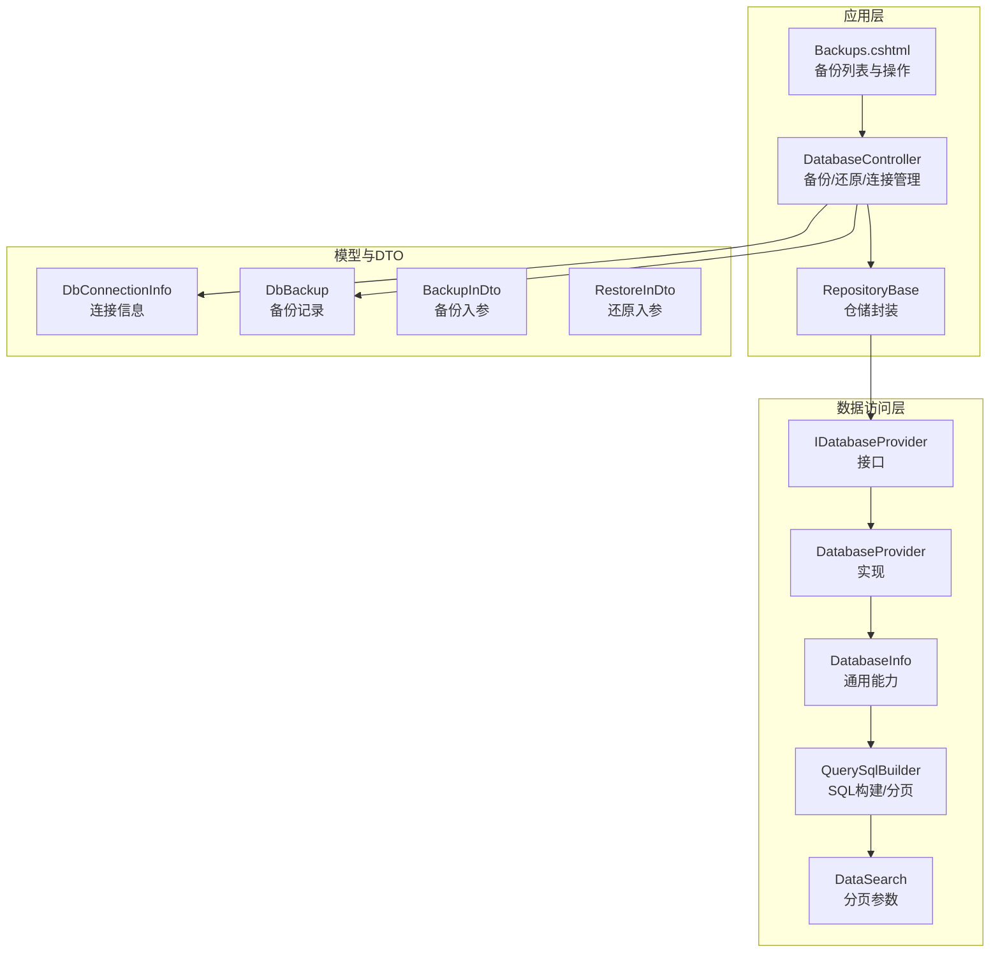
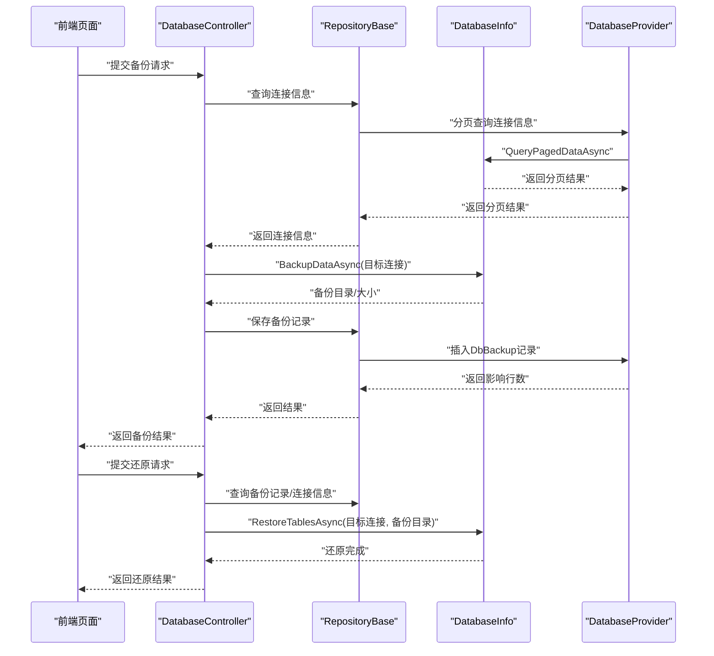
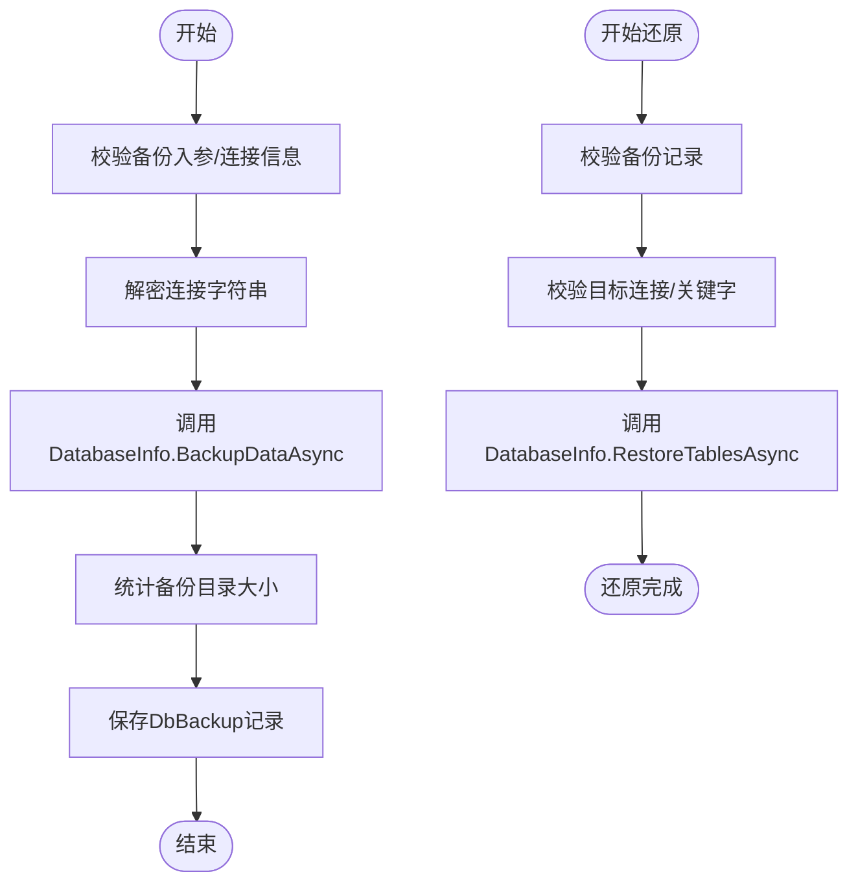
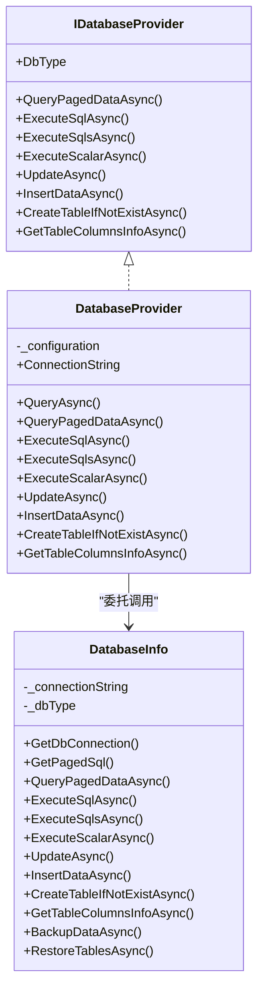
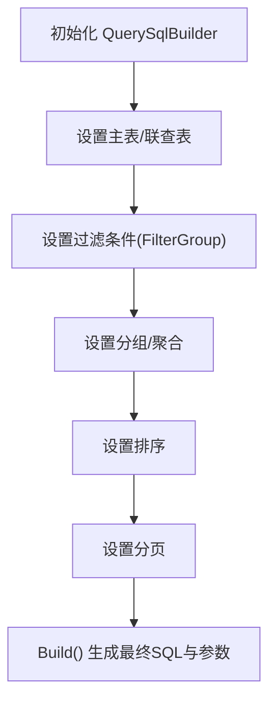
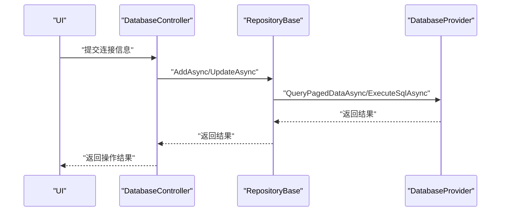
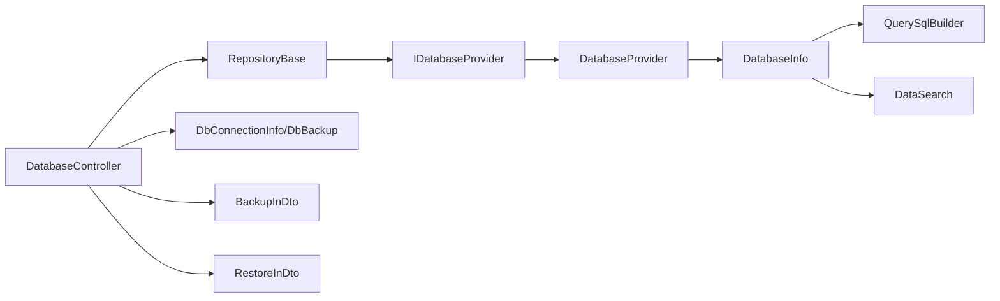

# 数据库问题排查

<cite>
**本文引用的文件**
- [Sylas.RemoteTasks.App/Controllers/DatabaseController.cs](file://Sylas.RemoteTasks.App/Controllers/DatabaseController.cs)
- [Sylas.RemoteTasks.App/DatabaseManager/Models/Dtos/BackupInDto.cs](file://Sylas.RemoteTasks.App/DatabaseManager/Models/Dtos/BackupInDto.cs)
- [Sylas.RemoteTasks.App/DatabaseManager/Models/Dtos/RestoreInDto.cs](file://Sylas.RemoteTasks.App/DatabaseManager/Models/Dtos/RestoreInDto.cs)
- [Sylas.RemoteTasks.App/DatabaseManager/Models/DbBackup.cs](file://Sylas.RemoteTasks.App/DatabaseManager/Models/DbBackup.cs)
- [Sylas.RemoteTasks.App/Views/Database/Backups.cshtml](file://Sylas.RemoteTasks.App/Views/Database/Backups.cshtml)
- [Sylas.RemoteTasks.Database/SyncBase/DatabaseInfo.cs](file://Sylas.RemoteTasks.Database/SyncBase/DatabaseInfo.cs)
- [Sylas.RemoteTasks.Database/DatabaseProvider.cs](file://Sylas.RemoteTasks.Database/DatabaseProvider.cs)
- [Sylas.RemoteTasks.Database/IDatabaseProvider.cs](file://Sylas.RemoteTasks.Database/IDatabaseProvider.cs)
- [Sylas.RemoteTasks.Database/DatabaseHelper.cs](file://Sylas.RemoteTasks.Database/DatabaseHelper.cs)
- [Sylas.RemoteTasks.Database/SyncBase/QuerySqlBuilder.cs](file://Sylas.RemoteTasks.Database/SyncBase/QuerySqlBuilder.cs)
- [Sylas.RemoteTasks.Database/SyncBase/DataSearch.cs](file://Sylas.RemoteTasks.Database/SyncBase/DataSearch.cs)
- [Sylas.RemoteTasks.Database/Dtos/DbConnectionInfo.cs](file://Sylas.RemoteTasks.Database/Dtos/DbConnectionInfo.cs)
- [Sylas.RemoteTasks.App/Infrastructure/RepositoryBase.cs](file://Sylas.RemoteTasks.App/Infrastructure/RepositoryBase.cs)
- [Sylas.RemoteTasks.Database/README.md](file://Sylas.RemoteTasks.Database/README.md)
</cite>

## 目录
1. [简介](#简介)
2. [项目结构](#项目结构)
3. [核心组件](#核心组件)
4. [架构总览](#架构总览)
5. [详细组件分析](#详细组件分析)
6. [依赖关系分析](#依赖关系分析)
7. [性能考量](#性能考量)
8. [故障排查指南](#故障排查指南)
9. [结论](#结论)
10. [附录](#附录)

## 简介
本文件面向 Sylas.RemoteTasks 的数据库运维与开发人员，聚焦数据库问题的诊断与解决，覆盖连接超时、查询性能、死锁、事务异常、备份恢复失败等常见问题，并提供数据库诊断工具与 SQL 技巧、配置优化要点（连接池、事务隔离级别、存储过程与分区策略）以及监控与维护最佳实践。内容基于仓库中实际实现进行梳理，确保可操作性与可追溯性。

## 项目结构
围绕数据库能力的关键模块分布如下：
- 应用层控制器与视图：负责备份/还原入口、连接信息管理、页面展示
- 数据访问层：统一的数据库抽象接口与实现，提供分页查询、执行 SQL、动态更新/插入、表结构查询等
- 数据模型：备份记录、连接信息 DTO
- 查询构建器：跨数据库的 SQL 组装与分页适配
- 工具与帮助类：连接字符串解析、连接对象创建、对比与迁移辅助

**图表来源**
- [Sylas.RemoteTasks.App/Controllers/DatabaseController.cs](file://Sylas.RemoteTasks.App/Controllers/DatabaseController.cs#L115-L232)
- [Sylas.RemoteTasks.App/DatabaseManager/Models/DbBackup.cs](file://Sylas.RemoteTasks.App/DatabaseManager/Models/DbBackup.cs#L10-L46)
- [Sylas.RemoteTasks.Database/IDatabaseProvider.cs](file://Sylas.RemoteTasks.Database/IDatabaseProvider.cs#L12-L97)
- [Sylas.RemoteTasks.Database/DatabaseProvider.cs](file://Sylas.RemoteTasks.Database/DatabaseProvider.cs#L19-L484)
- [Sylas.RemoteTasks.Database/SyncBase/DatabaseInfo.cs](file://Sylas.RemoteTasks.Database/SyncBase/DatabaseInfo.cs#L64-L88)
- [Sylas.RemoteTasks.Database/SyncBase/QuerySqlBuilder.cs](file://Sylas.RemoteTasks.Database/SyncBase/QuerySqlBuilder.cs#L11-L389)
- [Sylas.RemoteTasks.Database/SyncBase/DataSearch.cs](file://Sylas.RemoteTasks.Database/SyncBase/DataSearch.cs#L8-L49)
- [Sylas.RemoteTasks.App/Views/Database/Backups.cshtml](file://Sylas.RemoteTasks.App/Views/Database/Backups.cshtml#L30-L45)

**章节来源**
- [Sylas.RemoteTasks.App/Controllers/DatabaseController.cs](file://Sylas.RemoteTasks.App/Controllers/DatabaseController.cs#L115-L232)
- [Sylas.RemoteTasks.Database/README.md](file://Sylas.RemoteTasks.Database/README.md#L1-L24)

## 核心组件
- 数据库接口与实现
  - 接口定义了分页查询、执行 SQL、动态更新/插入、表结构查询等能力
  - 实现类负责参数绑定、连接打开、事务控制、DataSet 填充等
- DatabaseInfo 通用能力
  - 支持多种数据库类型，提供连接对象创建、分页 SQL 生成、表存在性判断、DDL 获取、备份/还原流程等
- 查询构建器与分页参数
  - QuerySqlBuilder 负责跨数据库的 SQL 组装、分页适配、参数占位符处理
  - DataSearch 提供分页、过滤、排序参数
- 备份/还原与连接管理
  - 控制器提供备份、还原、备份记录管理；视图提供前端交互
  - 连接信息模型与 DTO 负责持久化与输入校验

**章节来源**
- [Sylas.RemoteTasks.Database/IDatabaseProvider.cs](file://Sylas.RemoteTasks.Database/IDatabaseProvider.cs#L12-L97)
- [Sylas.RemoteTasks.Database/DatabaseProvider.cs](file://Sylas.RemoteTasks.Database/DatabaseProvider.cs#L19-L484)
- [Sylas.RemoteTasks.Database/SyncBase/DatabaseInfo.cs](file://Sylas.RemoteTasks.Database/SyncBase/DatabaseInfo.cs#L64-L88)
- [Sylas.RemoteTasks.Database/SyncBase/QuerySqlBuilder.cs](file://Sylas.RemoteTasks.Database/SyncBase/QuerySqlBuilder.cs#L11-L389)
- [Sylas.RemoteTasks.Database/SyncBase/DataSearch.cs](file://Sylas.RemoteTasks.Database/SyncBase/DataSearch.cs#L8-L49)
- [Sylas.RemoteTasks.App/Controllers/DatabaseController.cs](file://Sylas.RemoteTasks.App/Controllers/DatabaseController.cs#L115-L232)

## 架构总览
下图展示了“备份/还原”与“连接管理”的关键调用链路，体现控制器、仓储、数据库抽象与具体实现之间的协作关系。

**图表来源**
- [Sylas.RemoteTasks.App/Controllers/DatabaseController.cs](file://Sylas.RemoteTasks.App/Controllers/DatabaseController.cs#L115-L232)
- [Sylas.RemoteTasks.App/Infrastructure/RepositoryBase.cs](file://Sylas.RemoteTasks.App/Infrastructure/RepositoryBase.cs#L20-L105)
- [Sylas.RemoteTasks.Database/SyncBase/DatabaseInfo.cs](file://Sylas.RemoteTasks.Database/SyncBase/DatabaseInfo.cs#L893-L1075)
- [Sylas.RemoteTasks.Database/DatabaseProvider.cs](file://Sylas.RemoteTasks.Database/DatabaseProvider.cs#L337-L387)

## 详细组件分析

### 组件一：备份与还原流程
- 备份
  - 控制器接收备份入参，解密目标连接字符串，调用 DatabaseInfo 执行备份，统计备份目录大小并写入 DbBackup 记录
  - 备份过程中对查询条件进行安全校验，避免危险 SQL 语句
- 还原
  - 控制器校验备份记录与目标连接信息，检查允许还原的目标关键字，再调用 DatabaseInfo 执行还原
  - 还原采用逐表读取备份文件、按列信息重建表结构并批量写入的方式

**图表来源**
- [Sylas.RemoteTasks.App/Controllers/DatabaseController.cs](file://Sylas.RemoteTasks.App/Controllers/DatabaseController.cs#L115-L137)
- [Sylas.RemoteTasks.App/Controllers/DatabaseController.cs](file://Sylas.RemoteTasks.App/Controllers/DatabaseController.cs#L213-L232)
- [Sylas.RemoteTasks.App/DatabaseManager/Models/Dtos/BackupInDto.cs](file://Sylas.RemoteTasks.App/DatabaseManager/Models/Dtos/BackupInDto.cs#L6-L24)
- [Sylas.RemoteTasks.App/DatabaseManager/Models/Dtos/RestoreInDto.cs](file://Sylas.RemoteTasks.App/DatabaseManager/Models/Dtos/RestoreInDto.cs#L6-L20)
- [Sylas.RemoteTasks.App/DatabaseManager/Models/DbBackup.cs](file://Sylas.RemoteTasks.App/DatabaseManager/Models/DbBackup.cs#L10-L46)
- [Sylas.RemoteTasks.Database/SyncBase/DatabaseInfo.cs](file://Sylas.RemoteTasks.Database/SyncBase/DatabaseInfo.cs#L893-L1075)

**章节来源**
- [Sylas.RemoteTasks.App/Controllers/DatabaseController.cs](file://Sylas.RemoteTasks.App/Controllers/DatabaseController.cs#L115-L137)
- [Sylas.RemoteTasks.App/Controllers/DatabaseController.cs](file://Sylas.RemoteTasks.App/Controllers/DatabaseController.cs#L213-L232)
- [Sylas.RemoteTasks.App/DatabaseManager/Models/Dtos/BackupInDto.cs](file://Sylas.RemoteTasks.App/DatabaseManager/Models/Dtos/BackupInDto.cs#L6-L24)
- [Sylas.RemoteTasks.App/DatabaseManager/Models/Dtos/RestoreInDto.cs](file://Sylas.RemoteTasks.App/DatabaseManager/Models/Dtos/RestoreInDto.cs#L6-L20)
- [Sylas.RemoteTasks.App/DatabaseManager/Models/DbBackup.cs](file://Sylas.RemoteTasks.App/DatabaseManager/Models/DbBackup.cs#L10-L46)
- [Sylas.RemoteTasks.Database/SyncBase/DatabaseInfo.cs](file://Sylas.RemoteTasks.Database/SyncBase/DatabaseInfo.cs#L893-L1075)

### 组件二：数据库抽象与事务控制
- IDatabaseProvider 定义统一接口，DatabaseProvider 作为实现，负责参数绑定、连接打开、DataSet 填充、分页查询等
- DatabaseInfo 提供静态连接对象创建、数据库类型识别、分页 SQL 生成、表结构查询、DDL 获取、备份/还原等通用能力
- 事务控制
  - DatabaseProvider 在执行 SQL 时显式开启事务并在异常时回滚
  - DatabaseInfo 在执行单条/多条 SQL 时同样使用事务包裹，保证原子性

**图表来源**
- [Sylas.RemoteTasks.Database/IDatabaseProvider.cs](file://Sylas.RemoteTasks.Database/IDatabaseProvider.cs#L12-L97)
- [Sylas.RemoteTasks.Database/DatabaseProvider.cs](file://Sylas.RemoteTasks.Database/DatabaseProvider.cs#L19-L484)
- [Sylas.RemoteTasks.Database/SyncBase/DatabaseInfo.cs](file://Sylas.RemoteTasks.Database/SyncBase/DatabaseInfo.cs#L64-L88)

**章节来源**
- [Sylas.RemoteTasks.Database/IDatabaseProvider.cs](file://Sylas.RemoteTasks.Database/IDatabaseProvider.cs#L12-L97)
- [Sylas.RemoteTasks.Database/DatabaseProvider.cs](file://Sylas.RemoteTasks.Database/DatabaseProvider.cs#L19-L484)
- [Sylas.RemoteTasks.Database/SyncBase/DatabaseInfo.cs](file://Sylas.RemoteTasks.Database/SyncBase/DatabaseInfo.cs#L360-L488)

### 组件三：查询构建与分页
- QuerySqlBuilder 支持多表 LEFT JOIN、WHERE 条件、GROUP BY/HAVING、ORDER BY 与分页，自动适配不同数据库的分页语法
- DataSearch 提供分页页码、页大小、过滤条件、排序规则的标准化参数

**图表来源**
- [Sylas.RemoteTasks.Database/SyncBase/QuerySqlBuilder.cs](file://Sylas.RemoteTasks.Database/SyncBase/QuerySqlBuilder.cs#L11-L389)
- [Sylas.RemoteTasks.Database/SyncBase/DataSearch.cs](file://Sylas.RemoteTasks.Database/SyncBase/DataSearch.cs#L8-L49)

**章节来源**
- [Sylas.RemoteTasks.Database/SyncBase/QuerySqlBuilder.cs](file://Sylas.RemoteTasks.Database/SyncBase/QuerySqlBuilder.cs#L11-L389)
- [Sylas.RemoteTasks.Database/SyncBase/DataSearch.cs](file://Sylas.RemoteTasks.Database/SyncBase/DataSearch.cs#L8-L49)

### 组件四：连接信息与仓储
- DbConnectionInfo 与相关 DTO 负责连接信息的持久化与输入校验
- RepositoryBase 封装通用的分页查询、新增、更新、删除逻辑，内部调用 IDatabaseProvider 完成 SQL 执行

**图表来源**
- [Sylas.RemoteTasks.App/Controllers/DatabaseController.cs](file://Sylas.RemoteTasks.App/Controllers/DatabaseController.cs#L49-L78)
- [Sylas.RemoteTasks.App/Infrastructure/RepositoryBase.cs](file://Sylas.RemoteTasks.App/Infrastructure/RepositoryBase.cs#L71-L121)
- [Sylas.RemoteTasks.Database/DatabaseProvider.cs](file://Sylas.RemoteTasks.Database/DatabaseProvider.cs#L337-L387)

**章节来源**
- [Sylas.RemoteTasks.App/DatabaseManager/Models/Dtos/DbConnectionInfoInDto.cs](file://Sylas.RemoteTasks.App/DatabaseManager/Models/Dtos/DbConnectionInfoInDto.cs#L6-L33)
- [Sylas.RemoteTasks.Database/Dtos/DbConnectionInfo.cs](file://Sylas.RemoteTasks.Database/Dtos/DbConnectionInfo.cs#L10-L32)
- [Sylas.RemoteTasks.App/Infrastructure/RepositoryBase.cs](file://Sylas.RemoteTasks.App/Infrastructure/RepositoryBase.cs#L20-L121)

## 依赖关系分析
- 控制器依赖仓储与数据库抽象，仓储依赖数据库抽象，数据库抽象依赖 DatabaseInfo 与具体驱动
- 查询构建器与分页参数独立于具体数据库，通过 DatabaseInfo 的分页 SQL 生成与参数化机制适配多数据库
- 备份/还原流程依赖连接信息与安全关键字白名单，确保仅能还原到允许的目标

**图表来源**
- [Sylas.RemoteTasks.App/Controllers/DatabaseController.cs](file://Sylas.RemoteTasks.App/Controllers/DatabaseController.cs#L115-L232)
- [Sylas.RemoteTasks.App/Infrastructure/RepositoryBase.cs](file://Sylas.RemoteTasks.App/Infrastructure/RepositoryBase.cs#L10-L121)
- [Sylas.RemoteTasks.Database/IDatabaseProvider.cs](file://Sylas.RemoteTasks.Database/IDatabaseProvider.cs#L12-L97)
- [Sylas.RemoteTasks.Database/DatabaseProvider.cs](file://Sylas.RemoteTasks.Database/DatabaseProvider.cs#L19-L484)
- [Sylas.RemoteTasks.Database/SyncBase/DatabaseInfo.cs](file://Sylas.RemoteTasks.Database/SyncBase/DatabaseInfo.cs#L64-L88)
- [Sylas.RemoteTasks.Database/SyncBase/QuerySqlBuilder.cs](file://Sylas.RemoteTasks.Database/SyncBase/QuerySqlBuilder.cs#L11-L389)
- [Sylas.RemoteTasks.Database/SyncBase/DataSearch.cs](file://Sylas.RemoteTasks.Database/SyncBase/DataSearch.cs#L8-L49)

**章节来源**
- [Sylas.RemoteTasks.App/Controllers/DatabaseController.cs](file://Sylas.RemoteTasks.App/Controllers/DatabaseController.cs#L115-L232)
- [Sylas.RemoteTasks.App/Infrastructure/RepositoryBase.cs](file://Sylas.RemoteTasks.App/Infrastructure/RepositoryBase.cs#L10-L121)
- [Sylas.RemoteTasks.Database/README.md](file://Sylas.RemoteTasks.Database/README.md#L1-L24)

## 性能考量
- 连接与事务
  - 显式开启连接与事务，避免隐式事务带来的开销与不确定性
  - 对批量写入采用参数化与事务包裹，减少往返次数与回滚成本
- 查询与分页
  - 使用 QuerySqlBuilder 组合条件，确保 WHERE/GROUP/ORDER/BY 的正确性与可维护性
  - 分页采用各数据库方言的高效分页语法，避免全表扫描
- 备份/还原
  - 备份采用流式读取与逐表写入，避免一次性加载大量数据
  - 还原前先创建表结构，减少运行时 DDL 开销

**章节来源**
- [Sylas.RemoteTasks.Database/DatabaseProvider.cs](file://Sylas.RemoteTasks.Database/DatabaseProvider.cs#L177-L258)
- [Sylas.RemoteTasks.Database/SyncBase/QuerySqlBuilder.cs](file://Sylas.RemoteTasks.Database/SyncBase/QuerySqlBuilder.cs#L365-L383)
- [Sylas.RemoteTasks.Database/SyncBase/DatabaseInfo.cs](file://Sylas.RemoteTasks.Database/SyncBase/DatabaseInfo.cs#L914-L1075)

## 故障排查指南

### 1. 连接超时
- 现象
  - 请求超时、连接建立失败、日志出现连接异常
- 诊断步骤
  - 检查连接字符串格式与关键字白名单配置
  - 使用连接字符串解析工具确认主机、端口、数据库名、凭据
  - 验证网络连通性与防火墙策略
- 处理建议
  - 适当增大连接超时与命令超时
  - 启用连接池并合理设置最大/最小连接数
  - 对长事务进行拆分，缩短持有连接的时间

**章节来源**
- [Sylas.RemoteTasks.App/Controllers/DatabaseController.cs](file://Sylas.RemoteTasks.App/Controllers/DatabaseController.cs#L224-L228)
- [Sylas.RemoteTasks.Database/SyncBase/DatabaseInfo.cs](file://Sylas.RemoteTasks.Database/SyncBase/DatabaseInfo.cs#L210-L299)

### 2. 查询性能问题
- 现象
  - 分页查询慢、COUNT(*) 耗时长、排序/过滤导致全表扫描
- 诊断步骤
  - 使用 QuerySqlBuilder 生成的 SQL 与参数，结合数据库执行计划分析
  - 检查 WHERE 条件是否命中索引、是否存在隐式转换
  - 关注大数据量场景下的分页策略与排序字段
- 处理建议
  - 为高频过滤/排序字段建立合适索引
  - 优化 WHERE 条件，避免在 WHERE 中对列进行函数计算
  - 采用覆盖索引减少回表

**章节来源**
- [Sylas.RemoteTasks.Database/SyncBase/QuerySqlBuilder.cs](file://Sylas.RemoteTasks.Database/SyncBase/QuerySqlBuilder.cs#L11-L389)
- [Sylas.RemoteTasks.Database/SyncBase/DataSearch.cs](file://Sylas.RemoteTasks.Database/SyncBase/DataSearch.cs#L8-L49)

### 3. 死锁
- 现象
  - 事务长时间阻塞、返回死锁错误
- 诊断步骤
  - 分析事务边界与锁粒度，定位并发写入热点
  - 检查是否存在循环依赖或不同顺序获取锁
- 处理建议
  - 缩短事务时间，避免在事务内进行 I/O 或用户交互
  - 统一更新顺序，避免循环锁等待
  - 降低隔离级别（谨慎评估一致性要求）

**章节来源**
- [Sylas.RemoteTasks.Database/DatabaseProvider.cs](file://Sylas.RemoteTasks.Database/DatabaseProvider.cs#L395-L416)
- [Sylas.RemoteTasks.Database/SyncBase/DatabaseInfo.cs](file://Sylas.RemoteTasks.Database/SyncBase/DatabaseInfo.cs#L372-L400)

### 4. 事务异常
- 现象
  - 单条或多条 SQL 执行失败导致事务回滚
- 诊断步骤
  - 捕获异常并查看回滚分支，确认异常 SQL 与参数
  - 检查参数类型与长度，避免截断或类型不匹配
- 处理建议
  - 对每条 SQL 明确异常处理与回滚策略
  - 使用参数化查询，避免拼接 SQL 导致的类型与注入风险

**章节来源**
- [Sylas.RemoteTasks.Database/DatabaseProvider.cs](file://Sylas.RemoteTasks.Database/DatabaseProvider.cs#L395-L416)
- [Sylas.RemoteTasks.Database/SyncBase/DatabaseInfo.cs](file://Sylas.RemoteTasks.Database/SyncBase/DatabaseInfo.cs#L388-L400)

### 5. 备份/还原失败
- 现象
  - 备份目录为空、还原找不到表、字段类型不匹配
- 诊断步骤
  - 校验备份记录是否存在、备份目录是否完整
  - 检查目标连接关键字白名单与连接字符串有效性
  - 确认备份文件中的表结构与字段类型是否可被目标数据库识别
- 处理建议
  - 备份前校验查询条件安全性，避免危险语句
  - 还原前先创建表结构，确保字段类型兼容
  - 对大表采用分批导入策略，避免内存与锁竞争

**章节来源**
- [Sylas.RemoteTasks.App/Controllers/DatabaseController.cs](file://Sylas.RemoteTasks.App/Controllers/DatabaseController.cs#L115-L137)
- [Sylas.RemoteTasks.App/Controllers/DatabaseController.cs](file://Sylas.RemoteTasks.App/Controllers/DatabaseController.cs#L213-L232)
- [Sylas.RemoteTasks.Database/SyncBase/DatabaseInfo.cs](file://Sylas.RemoteTasks.Database/SyncBase/DatabaseInfo.cs#L893-L1075)

### 6. 数据库诊断工具与 SQL 技巧
- 连接状态检查
  - 使用连接字符串解析工具确认主机、端口、数据库名、凭据
  - 通过连接对象状态与 ChangeDatabase 方法验证切换数据库的有效性
- 查询计划分析
  - 生成 QuerySqlBuilder 输出的 SQL，结合数据库 EXPLAIN/执行计划分析
- 索引使用情况
  - 通过过滤/排序字段建立索引，避免函数计算导致的索引失效
- 锁等待分析
  - 分析事务时间与锁粒度，定位热点更新与并发冲突点

**章节来源**
- [Sylas.RemoteTasks.Database/SyncBase/DatabaseInfo.cs](file://Sylas.RemoteTasks.Database/SyncBase/DatabaseInfo.cs#L210-L299)
- [Sylas.RemoteTasks.Database/SyncBase/QuerySqlBuilder.cs](file://Sylas.RemoteTasks.Database/SyncBase/QuerySqlBuilder.cs#L365-L383)

### 7. 数据库配置优化要点
- 连接池设置
  - 合理设置最大/最小连接数、连接超时、命令超时
- 事务隔离级别
  - 根据业务一致性需求选择合适隔离级别，平衡并发与一致性
- 存储过程与分区策略
  - 对复杂查询使用存储过程封装，配合分区表提升大表查询性能
- 备份与恢复策略
  - 定期增量/差异备份，验证还原流程与数据完整性

**章节来源**
- [Sylas.RemoteTasks.Database/README.md](file://Sylas.RemoteTasks.Database/README.md#L1-L24)

### 8. 监控与维护最佳实践
- 日志与告警
  - 记录 SQL 执行耗时、异常堆栈与参数，便于快速定位问题
- 性能基线
  - 建立关键查询的性能基线，定期回归测试
- 维护窗口
  - 在低峰期执行大批量导入/导出与索引重建
- 版本与兼容性
  - 统一数据库版本与驱动，避免因方言差异导致的兼容问题

**章节来源**
- [Sylas.RemoteTasks.Database/DatabaseProvider.cs](file://Sylas.RemoteTasks.Database/DatabaseProvider.cs#L96-L104)
- [Sylas.RemoteTasks.Database/SyncBase/DatabaseInfo.cs](file://Sylas.RemoteTasks.Database/SyncBase/DatabaseInfo.cs#L325-L351)

## 结论
通过对 Sylas.RemoteTasks 的数据库层进行系统化分析，可以将常见数据库问题归因到连接、查询、事务、备份/还原等关键环节。借助统一的数据库抽象、查询构建器与严格的事务控制，能够有效提升稳定性与可维护性。建议在生产环境中完善监控与告警、定期进行性能回归测试，并制定规范化的备份与恢复演练流程。

## 附录
- 快速参考
  - 备份入口：控制器的 BackupAsync
  - 还原入口：控制器的 RestoreAsync
  - 连接信息管理：控制器的连接字符串 CRUD 与分页查询
  - 查询构建：QuerySqlBuilder + DataSearch
  - 事务控制：DatabaseProvider/DatabaseInfo 的事务包裹

**章节来源**
- [Sylas.RemoteTasks.App/Controllers/DatabaseController.cs](file://Sylas.RemoteTasks.App/Controllers/DatabaseController.cs#L115-L232)
- [Sylas.RemoteTasks.App/Views/Database/Backups.cshtml](file://Sylas.RemoteTasks.App/Views/Database/Backups.cshtml#L30-L45)
- [Sylas.RemoteTasks.Database/SyncBase/QuerySqlBuilder.cs](file://Sylas.RemoteTasks.Database/SyncBase/QuerySqlBuilder.cs#L11-L389)
- [Sylas.RemoteTasks.Database/SyncBase/DataSearch.cs](file://Sylas.RemoteTasks.Database/SyncBase/DataSearch.cs#L8-L49)
- [Sylas.RemoteTasks.Database/DatabaseProvider.cs](file://Sylas.RemoteTasks.Database/DatabaseProvider.cs#L395-L416)
- [Sylas.RemoteTasks.Database/SyncBase/DatabaseInfo.cs](file://Sylas.RemoteTasks.Database/SyncBase/DatabaseInfo.cs#L372-L400)