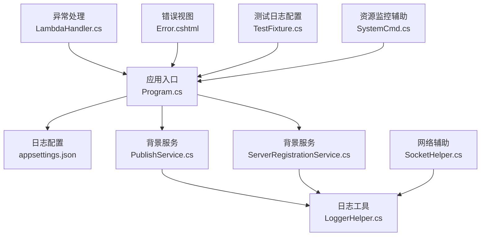
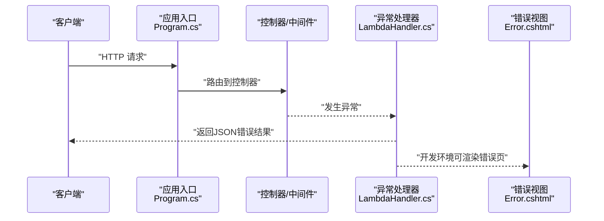
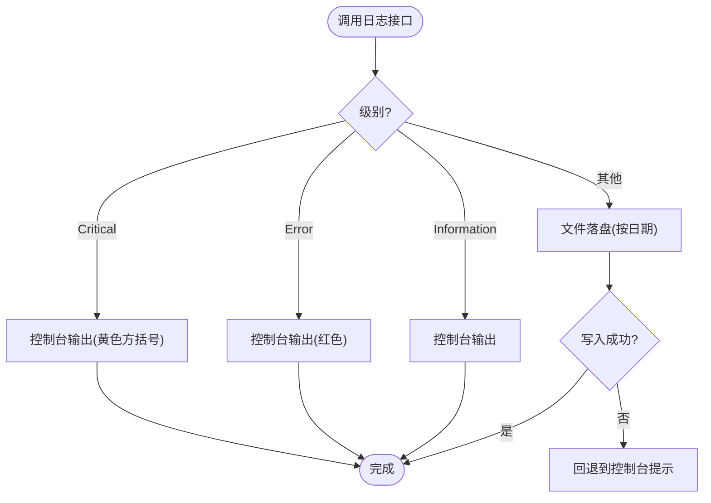
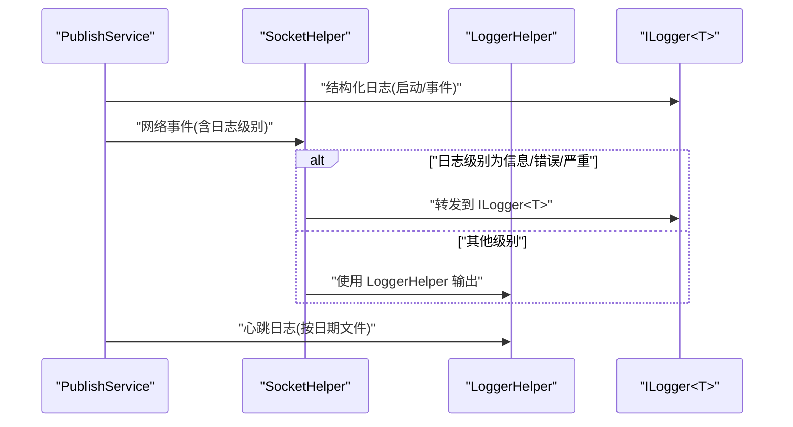
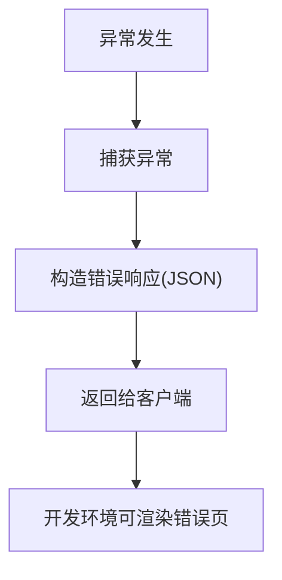
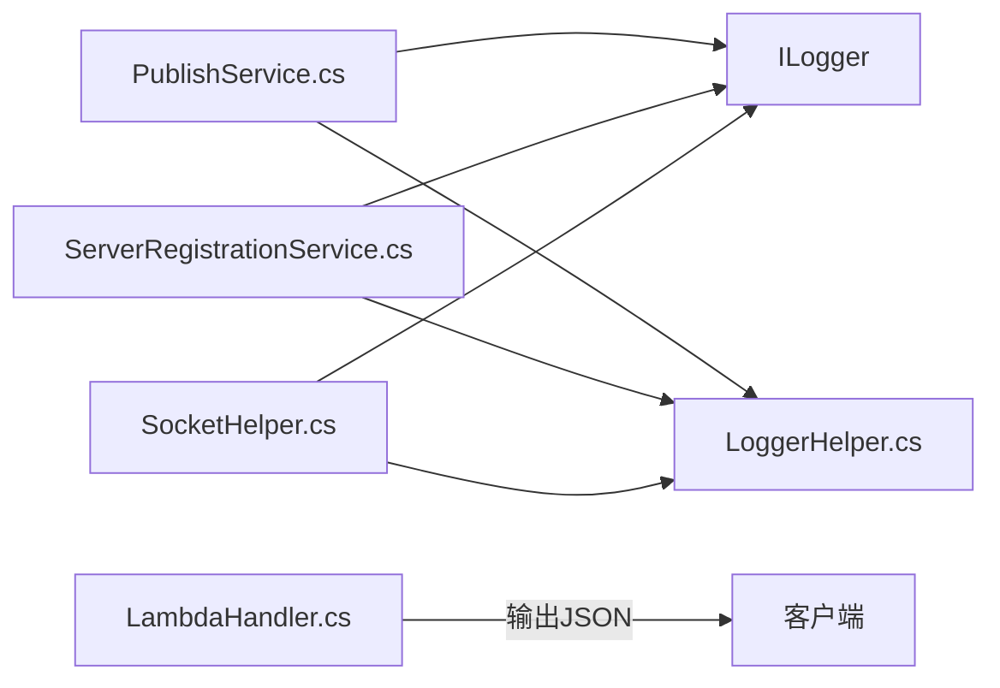
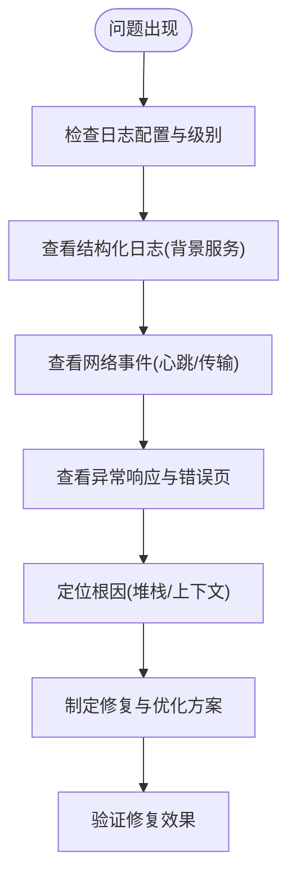

# 日志分析与诊断

<cite>
**本文引用的文件**   
- [appsettings.json](file://Sylas.RemoteTasks.App/appsettings.json)
- [Program.cs](file://Sylas.RemoteTasks.App/Program.cs)
- [LoggerHelper.cs](file://Sylas.RemoteTasks.Common/LoggerHelper.cs)
- [PublishService.cs](file://Sylas.RemoteTasks.App/BackgroundServices/PublishService.cs)
- [ServerRegistrationService.cs](file://Sylas.RemoteTasks.App/BackgroundServices/ServerRegistrationService.cs)
- [SocketHelper.cs](file://Sylas.RemoteTasks.Utils/SocketHelper.cs)
- [LambdaHandler.cs](file://Sylas.RemoteTasks.App/ExceptionHandlers/LambdaHandler.cs)
- [Error.cshtml](file://Sylas.RemoteTasks.App/Views/Shared/Error.cshtml)
- [TestFixture.cs](file://Sylas.RemoteTasks.Test/TestFixture.cs)
- [SystemCmd.cs](file://Sylas.RemoteTasks.Utils/CommandExecutor/SystemCmd.cs)
</cite>

## 目录
1. [简介](#简介)
2. [项目结构](#项目结构)
3. [核心组件](#核心组件)
4. [架构总览](#架构总览)
5. [详细组件分析](#详细组件分析)
6. [依赖分析](#依赖分析)
7. [性能考量](#性能考量)
8. [故障排查指南](#故障排查指南)
9. [结论](#结论)
10. [附录](#附录)

## 简介
本文件面向 Sylas.RemoteTasks 的运维与开发人员，提供系统日志的采集、分析与诊断指南。内容覆盖：
- 日志级别与输出格式
- 关键日志字段与上下文
- 日志轮转与落盘策略
- 日志聚合、搜索过滤、趋势与异常检测技巧
- 通过日志定位问题根因（错误堆栈、性能瓶颈、资源使用）
- 日志配置示例与最佳实践

## 项目结构
围绕日志主题的关键位置如下：
- 应用配置与日志框架集成：Program.cs、appsettings.json
- 自定义日志工具：LoggerHelper.cs
- 背景服务日志：PublishService.cs、ServerRegistrationService.cs
- 网络层日志桥接：SocketHelper.cs
- 异常处理与错误页：LambdaHandler.cs、Error.cshtml
- 测试环境日志配置：TestFixture.cs
- 资源监控辅助：SystemCmd.cs

图表来源
- [Program.cs](file://Sylas.RemoteTasks.App/Program.cs#L1-L122)
- [appsettings.json](file://Sylas.RemoteTasks.App/appsettings.json#L1-L142)
- [LoggerHelper.cs](file://Sylas.RemoteTasks.Common/LoggerHelper.cs#L1-L115)
- [PublishService.cs](file://Sylas.RemoteTasks.App/BackgroundServices/PublishService.cs#L1-L200)
- [ServerRegistrationService.cs](file://Sylas.RemoteTasks.App/BackgroundServices/ServerRegistrationService.cs#L1-L200)
- [SocketHelper.cs](file://Sylas.RemoteTasks.Utils/SocketHelper.cs#L328-L363)
- [LambdaHandler.cs](file://Sylas.RemoteTasks.App/ExceptionHandlers/LambdaHandler.cs#L1-L28)
- [Error.cshtml](file://Sylas.RemoteTasks.App/Views/Shared/Error.cshtml#L1-L25)
- [TestFixture.cs](file://Sylas.RemoteTasks.Test/TestFixture.cs#L1-L53)
- [SystemCmd.cs](file://Sylas.RemoteTasks.Utils/CommandExecutor/SystemCmd.cs#L381-L417)

章节来源
- [Program.cs](file://Sylas.RemoteTasks.App/Program.cs#L1-L122)
- [appsettings.json](file://Sylas.RemoteTasks.App/appsettings.json#L1-L142)

## 核心组件
- 日志配置与框架集成
  - 通过 appsettings.json 的 Logging 节点配置默认级别与控制台输出格式；Program.cs 中未显式 AddLogging，但测试环境 TestFixture.cs 展示了如何在测试中启用控制台与调试输出。
- 自定义日志工具 LoggerHelper
  - 提供控制台 Info/Error/Critical 输出与异步/同步文件落盘能力，支持按日期分日志文件。
- 背景服务日志
  - PublishService 与 ServerRegistrationService 使用 ILogger<T> 输出结构化日志，包含服务生命周期、网络交互、心跳等关键事件。
- 网络层日志桥接
  - SocketHelper 在不同日志级别下桥接到 LoggerHelper 或 ILogger，确保网络事件可被统一采集。
- 异常处理与错误页
  - LambdaHandler 将异常包装为 JSON 响应；Error.cshtml 在开发环境展示请求 ID 等上下文。

章节来源
- [appsettings.json](file://Sylas.RemoteTasks.App/appsettings.json#L1-L142)
- [Program.cs](file://Sylas.RemoteTasks.App/Program.cs#L1-L122)
- [LoggerHelper.cs](file://Sylas.RemoteTasks.Common/LoggerHelper.cs#L1-L115)
- [PublishService.cs](file://Sylas.RemoteTasks.App/BackgroundServices/PublishService.cs#L1-L200)
- [ServerRegistrationService.cs](file://Sylas.RemoteTasks.App/BackgroundServices/ServerRegistrationService.cs#L1-L200)
- [SocketHelper.cs](file://Sylas.RemoteTasks.Utils/SocketHelper.cs#L328-L363)
- [LambdaHandler.cs](file://Sylas.RemoteTasks.App/ExceptionHandlers/LambdaHandler.cs#L1-L28)
- [Error.cshtml](file://Sylas.RemoteTasks.App/Views/Shared/Error.cshtml#L1-L25)
- [TestFixture.cs](file://Sylas.RemoteTasks.Test/TestFixture.cs#L1-L53)

## 架构总览
以下序列图展示了“请求-异常-日志”链路，体现日志在异常处理与运行时事件中的作用。

图表来源
- [Program.cs](file://Sylas.RemoteTasks.App/Program.cs#L99-L122)
- [LambdaHandler.cs](file://Sylas.RemoteTasks.App/ExceptionHandlers/LambdaHandler.cs#L1-L28)
- [Error.cshtml](file://Sylas.RemoteTasks.App/Views/Shared/Error.cshtml#L1-L25)

## 详细组件分析

### 日志配置与级别
- 默认级别与输出格式
  - appsettings.json 中设置 Default 为 Debug，Microsoft.AspNetCore 为 Warning，并通过 Console 提供简单格式化输出，包含时间戳与作用域开关。
- 测试环境日志
  - TestFixture.cs 展示了 AddConfiguration + AddConsole + AddDebug 的组合，便于在单元测试中查看日志。
- 运行时日志
  - Program.cs 未显式 AddLogging，但应用仍可通过 ILogger<T> 输出日志；若需扩展，可在 Program.cs 中加入 AddLogging 并绑定 Logging 节点。

章节来源
- [appsettings.json](file://Sylas.RemoteTasks.App/appsettings.json#L1-L142)
- [TestFixture.cs](file://Sylas.RemoteTasks.Test/TestFixture.cs#L32-L40)
- [Program.cs](file://Sylas.RemoteTasks.App/Program.cs#L1-L122)

### LoggerHelper 工具
- 控制台输出
  - 提供 LogInformation、LogError、LogCritical，统一时间戳格式。
- 文件落盘
  - 支持异步/同步写入 Logs/Others 或指定目录，按日期命名文件；异常时回退到控制台提示。
- 使用建议
  - 适用于非结构化日志、心跳日志、离散事件记录；与 ILogger<T> 结合使用，避免重复输出。

图表来源
- [LoggerHelper.cs](file://Sylas.RemoteTasks.Common/LoggerHelper.cs#L1-L115)

章节来源
- [LoggerHelper.cs](file://Sylas.RemoteTasks.Common/LoggerHelper.cs#L1-L115)

### 背景服务日志（PublishService 与 ServerRegistrationService）
- PublishService
  - 记录 TCP 服务启动、客户端接入、任务准备、文件传输、心跳、与中心服务器通信等关键事件。
  - 心跳日志落盘至 Logs/Heartbeats，便于追踪节点存活与网络健康。
- ServerRegistrationService
  - 记录服务注册/注销、数据库状态更新、任务调度等事件，便于核对服务状态与数据库一致性。

图表来源
- [PublishService.cs](file://Sylas.RemoteTasks.App/BackgroundServices/PublishService.cs#L1-L200)
- [SocketHelper.cs](file://Sylas.RemoteTasks.Utils/SocketHelper.cs#L328-L363)
- [LoggerHelper.cs](file://Sylas.RemoteTasks.Common/LoggerHelper.cs#L1-L115)

章节来源
- [PublishService.cs](file://Sylas.RemoteTasks.App/BackgroundServices/PublishService.cs#L1-L200)
- [ServerRegistrationService.cs](file://Sylas.RemoteTasks.App/BackgroundServices/ServerRegistrationService.cs#L1-L200)
- [SocketHelper.cs](file://Sylas.RemoteTasks.Utils/SocketHelper.cs#L328-L363)
- [LoggerHelper.cs](file://Sylas.RemoteTasks.Common/LoggerHelper.cs#L1-L115)

### 异常处理与错误页
- LambdaHandler
  - 将异常包装为 JSON 错误响应，便于前端或下游系统消费。
- Error.cshtml
  - 开发环境下展示请求 ID 等上下文，有助于快速定位问题来源。

图表来源
- [LambdaHandler.cs](file://Sylas.RemoteTasks.App/ExceptionHandlers/LambdaHandler.cs#L1-L28)
- [Error.cshtml](file://Sylas.RemoteTasks.App/Views/Shared/Error.cshtml#L1-L25)

章节来源
- [LambdaHandler.cs](file://Sylas.RemoteTasks.App/ExceptionHandlers/LambdaHandler.cs#L1-L28)
- [Error.cshtml](file://Sylas.RemoteTasks.App/Views/Shared/Error.cshtml#L1-L25)

## 依赖分析
- 组件耦合
  - LoggerHelper 与 ILogger<T> 并行存在，前者适合简单落盘与控制台输出，后者适合结构化日志与框架集成。
  - SocketHelper 在不同日志级别下选择 LoggerHelper 或 ILogger，保证网络事件可被统一采集。
- 外部依赖
  - appsettings.json 提供日志框架配置入口；Program.cs 未显式 AddLogging，但不影响运行时日志输出。

图表来源
- [PublishService.cs](file://Sylas.RemoteTasks.App/BackgroundServices/PublishService.cs#L1-L200)
- [ServerRegistrationService.cs](file://Sylas.RemoteTasks.App/BackgroundServices/ServerRegistrationService.cs#L1-L200)
- [SocketHelper.cs](file://Sylas.RemoteTasks.Utils/SocketHelper.cs#L328-L363)
- [LoggerHelper.cs](file://Sylas.RemoteTasks.Common/LoggerHelper.cs#L1-L115)
- [LambdaHandler.cs](file://Sylas.RemoteTasks.App/ExceptionHandlers/LambdaHandler.cs#L1-L28)

章节来源
- [appsettings.json](file://Sylas.RemoteTasks.App/appsettings.json#L1-L142)
- [Program.cs](file://Sylas.RemoteTasks.App/Program.cs#L1-L122)

## 性能考量
- 日志级别
  - 生产环境建议提升默认级别至 Warning 或更高，减少低价值日志对 IO 的影响。
- 文件落盘
  - LoggerHelper 的异步写入（RecordLogAsync）可降低阻塞风险；批量日志建议合并写入或引入缓冲队列。
- 网络日志
  - SocketHelper 的日志桥接避免重复输出，建议仅在必要时输出高粒度日志。
- 资源监控
  - SystemCmd 提供 CPU/内存采样能力，结合日志可进行性能回归分析。

章节来源
- [LoggerHelper.cs](file://Sylas.RemoteTasks.Common/LoggerHelper.cs#L48-L112)
- [SystemCmd.cs](file://Sylas.RemoteTasks.Utils/CommandExecutor/SystemCmd.cs#L381-L417)

## 故障排查指南
- 快速定位步骤
  - 确认日志级别与输出：检查 appsettings.json 的 Logging 节点；确认是否启用了 AddConsole/AddDebug（测试环境示例见 TestFixture.cs）。
  - 查看结构化日志：关注 PublishService 与 ServerRegistrationService 的关键事件（启动、接入、心跳、数据库更新）。
  - 异常路径：通过 LambdaHandler 的 JSON 错误响应与 Error.cshtml 的请求 ID 定位问题。
- 常见问题与建议
  - 心跳中断：检查 Logs/Heartbeats 下的心跳日志与 PublishService 的连接与重连逻辑。
  - 文件传输失败：关注 PublishService 中的文件名、保存目录、准备信号与接收流程。
  - 数据库状态异常：核对 ServerRegistrationService 的注册/注销与数据库更新日志。
  - 资源瓶颈：结合 SystemCmd 的 CPU/内存采样与日志时间窗进行对比分析。

图表来源
- [appsettings.json](file://Sylas.RemoteTasks.App/appsettings.json#L1-L142)
- [PublishService.cs](file://Sylas.RemoteTasks.App/BackgroundServices/PublishService.cs#L1-L200)
- [ServerRegistrationService.cs](file://Sylas.RemoteTasks.App/BackgroundServices/ServerRegistrationService.cs#L1-L200)
- [LambdaHandler.cs](file://Sylas.RemoteTasks.App/ExceptionHandlers/LambdaHandler.cs#L1-L28)
- [Error.cshtml](file://Sylas.RemoteTasks.App/Views/Shared/Error.cshtml#L1-L25)

章节来源
- [appsettings.json](file://Sylas.RemoteTasks.App/appsettings.json#L1-L142)
- [PublishService.cs](file://Sylas.RemoteTasks.App/BackgroundServices/PublishService.cs#L1-L200)
- [ServerRegistrationService.cs](file://Sylas.RemoteTasks.App/BackgroundServices/ServerRegistrationService.cs#L1-L200)
- [LambdaHandler.cs](file://Sylas.RemoteTasks.App/ExceptionHandlers/LambdaHandler.cs#L1-L28)
- [Error.cshtml](file://Sylas.RemoteTasks.App/Views/Shared/Error.cshtml#L1-L25)

## 结论
- 本项目采用“结构化日志 + 自定义落盘”的双通道设计，既满足框架集成需求，也便于离散事件与心跳的持久化。
- 建议在生产环境提升日志级别、引入日志轮转与集中化采集，配合搜索过滤与趋势分析工具，形成闭环的可观测性体系。

## 附录

### 日志级别与输出格式
- 级别顺序（从低到高）：Trace → Debug → Information → Warning → Error → Critical → None
- 控制台输出格式：包含时间戳与日志级别文本；LoggerHelper 提供统一时间戳格式。
- appsettings.json 中 Console.FormatterOptions.TimestampFormat 可定制时间戳格式。

章节来源
- [appsettings.json](file://Sylas.RemoteTasks.App/appsettings.json#L1-L142)
- [LoggerHelper.cs](file://Sylas.RemoteTasks.Common/LoggerHelper.cs#L1-L115)

### 关键日志字段与含义
- 时间戳：统一格式，便于排序与聚合。
- 服务标识：如“ServerNode”、“TCP Service”等，用于区分来源。
- 事件描述：包含端口、线程号、文件名、状态等上下文。
- 心跳日志：位于 Logs/Heartbeats，按日期分文件，便于追踪节点存活。

章节来源
- [PublishService.cs](file://Sylas.RemoteTasks.App/BackgroundServices/PublishService.cs#L1-L200)
- [ServerRegistrationService.cs](file://Sylas.RemoteTasks.App/BackgroundServices/ServerRegistrationService.cs#L1-L200)
- [LoggerHelper.cs](file://Sylas.RemoteTasks.Common/LoggerHelper.cs#L1-L115)

### 日志轮转与落盘配置
- LoggerHelper 默认按日期生成日志文件；未内置轮转策略。
- 建议在部署层（如 systemd/journald、容器日志驱动）或第三方工具（如 logrotate、Filebeat）实现轮转与归档。

章节来源
- [LoggerHelper.cs](file://Sylas.RemoteTasks.Common/LoggerHelper.cs#L48-L112)

### 日志分析工具与技巧
- 聚合与搜索
  - 使用集中化日志平台（如 ELK/EFK、Loki+Grafana）采集 Logs/Others 与 Logs/Heartbeats。
  - 搜索关键词：服务名、线程号、文件名、状态码、错误消息。
- 过滤与分组
  - 按时间窗过滤；按服务/模块分组统计错误占比。
- 趋势与异常检测
  - 统计错误率、响应时延、心跳丢失率；设置阈值告警。
- 性能分析
  - 结合 SystemCmd 的 CPU/内存采样，定位高负载时段与热点模块。

章节来源
- [SystemCmd.cs](file://Sylas.RemoteTasks.Utils/CommandExecutor/SystemCmd.cs#L381-L417)

### 通过日志定位问题根因
- 错误堆栈跟踪
  - 在开发环境查看 Error.cshtml 的请求 ID；在生产环境通过异常处理器返回的 JSON 错误信息定位。
- 性能瓶颈分析
  - 关注 PublishService 的文件传输与网络交互日志，结合 SystemCmd 的资源采样。
- 资源使用监控
  - 使用 SystemCmd 的进程 CPU/内存采样，与日志时间窗对齐分析。

章节来源
- [Error.cshtml](file://Sylas.RemoteTasks.App/Views/Shared/Error.cshtml#L1-L25)
- [LambdaHandler.cs](file://Sylas.RemoteTasks.App/ExceptionHandlers/LambdaHandler.cs#L1-L28)
- [SystemCmd.cs](file://Sylas.RemoteTasks.Utils/CommandExecutor/SystemCmd.cs#L381-L417)

### 日志配置示例与最佳实践
- 示例：在 Program.cs 中启用日志并绑定配置
  - 参考 TestFixture.cs 的 AddConfiguration + AddConsole + AddDebug 组合，在生产环境可替换为 AddAzureWebAppDiagnostics 或第三方日志提供程序。
- 最佳实践
  - 生产环境默认级别 ≥ Warning；仅在排障时临时降级。
  - 使用结构化日志携带上下文（服务名、线程号、请求 ID），便于检索。
  - 对高频事件（如心跳）采用异步落盘或缓冲队列。
  - 在部署层配置日志轮转与保留策略，避免磁盘占满。

章节来源
- [TestFixture.cs](file://Sylas.RemoteTasks.Test/TestFixture.cs#L32-L40)
- [appsettings.json](file://Sylas.RemoteTasks.App/appsettings.json#L1-L142)