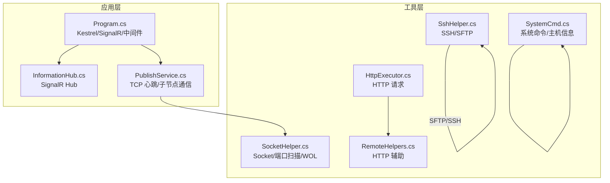
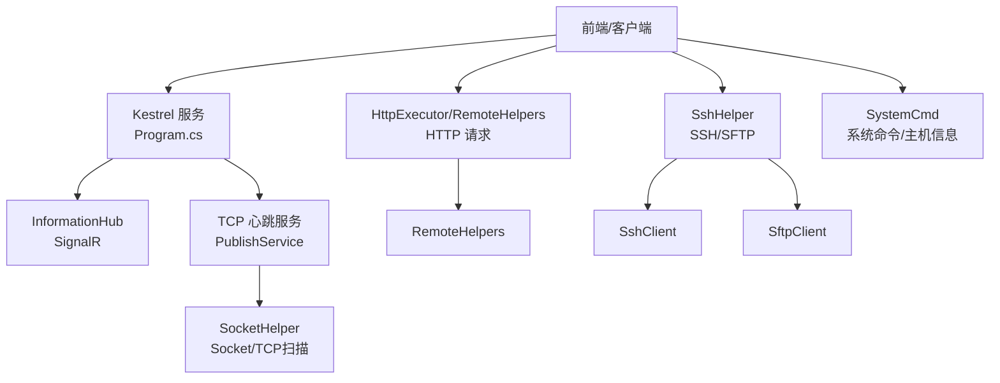
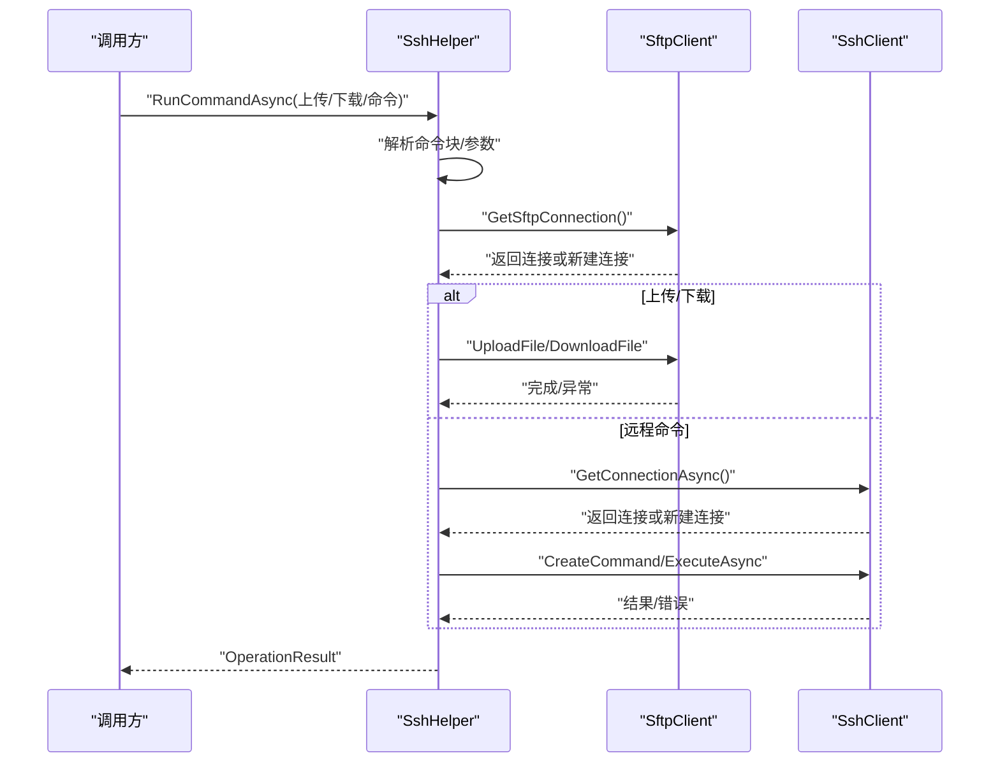
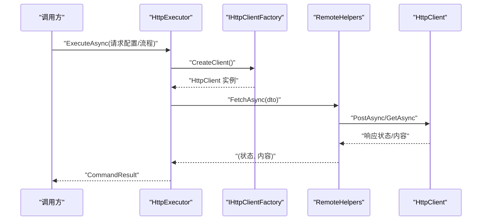
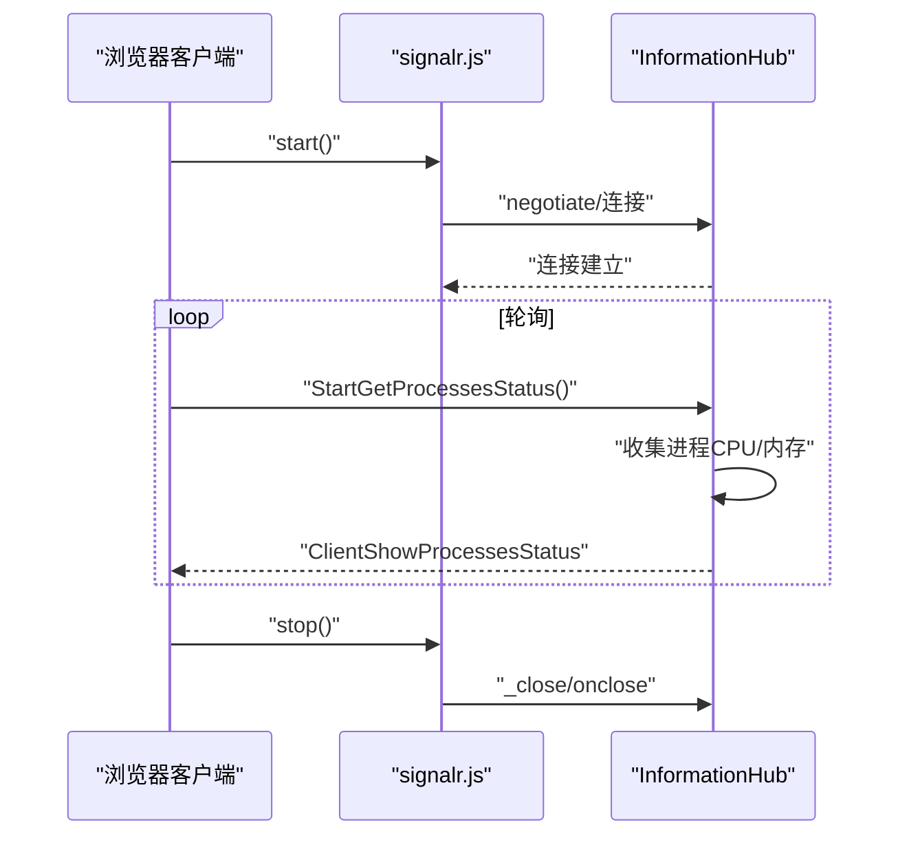
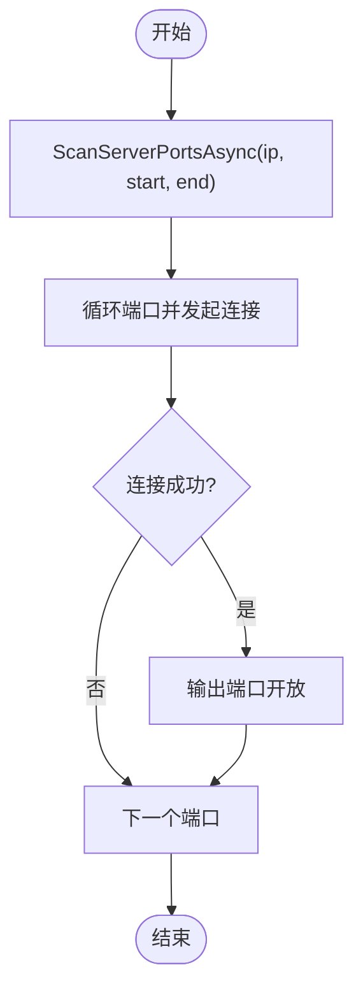
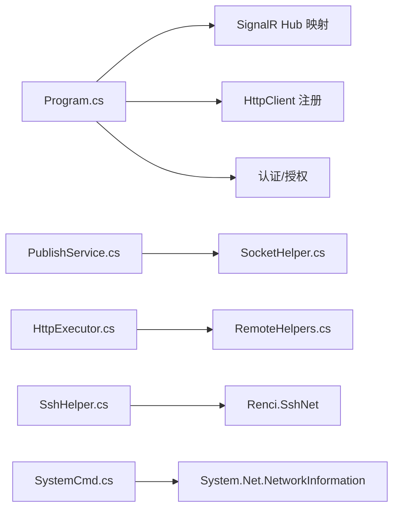

# 网络问题排查

<cite>
**本文引用的文件**
- [appsettings.json](file://Sylas.RemoteTasks.App/appsettings.json)
- [Program.cs](file://Sylas.RemoteTasks.App/Program.cs)
- [InformationHub.cs](file://Sylas.RemoteTasks.App/Hubs/InformationHub.cs)
- [PublishService.cs](file://Sylas.RemoteTasks.App/BackgroundServices/PublishService.cs)
- [SshHelper.cs](file://Sylas.RemoteTasks.Utils/CommandExecutor/SshHelper.cs)
- [HttpExecutor.cs](file://Sylas.RemoteTasks.Utils/CommandExecutor/HttpExecutor.cs)
- [RemoteHelpers.cs](file://Sylas.RemoteTasks.Utils/RemoteHelpers.cs)
- [SocketHelper.cs](file://Sylas.RemoteTasks.Utils/SocketHelper.cs)
- [SystemCmd.cs](file://Sylas.RemoteTasks.Utils/CommandExecutor/SystemCmd.cs)
- [signalr.js](file://Sylas.RemoteTasks.App/wwwroot/lib/signalr/dist/browser/signalr.js)
- [README.md](file://README.md)
</cite>

## 目录
1. [简介](#简介)
2. [项目结构](#项目结构)
3. [核心组件](#核心组件)
4. [架构总览](#架构总览)
5. [详细组件分析](#详细组件分析)
6. [依赖关系分析](#依赖关系分析)
7. [性能考量](#性能考量)
8. [故障排查指南](#故障排查指南)
9. [结论](#结论)
10. [附录](#附录)

## 简介
本文件面向 Sylas.RemoteTasks 项目，聚焦“网络问题排查”。内容涵盖 SSH 连接失败、HTTP 请求超时、文件传输中断、WebSocket 连接异常等常见网络故障的诊断与解决方法，并结合项目中已实现的网络相关模块（SSH、HTTP、Socket、SignalR）给出定位思路与实操建议。

## 项目结构
该项目采用 ASP.NET Core 多项目结构，网络相关能力主要分布在以下模块：
- 应用层（Sylas.RemoteTasks.App）
  - Kestrel 服务、SignalR Hub、后台服务、控制器与视图
- 工具层（Sylas.RemoteTasks.Utils）
  - SSH/SFTP 执行器、HTTP 请求执行器、Socket 辅助、系统命令执行器
- 测试层（Sylas.RemoteTasks.Test）
  - 包含 SSH、Socket 等网络相关测试用例

图表来源
- [Program.cs](file://Sylas.RemoteTasks.App/Program.cs#L14-L121)
- [InformationHub.cs](file://Sylas.RemoteTasks.App/Hubs/InformationHub.cs#L11-L58)
- [PublishService.cs](file://Sylas.RemoteTasks.App/BackgroundServices/PublishService.cs#L88-L282)
- [SshHelper.cs](file://Sylas.RemoteTasks.Utils/CommandExecutor/SshHelper.cs#L18-L187)
- [HttpExecutor.cs](file://Sylas.RemoteTasks.Utils/CommandExecutor/HttpExecutor.cs#L21-L102)
- [RemoteHelpers.cs](file://Sylas.RemoteTasks.Utils/RemoteHelpers.cs#L27-L141)
- [SocketHelper.cs](file://Sylas.RemoteTasks.Utils/SocketHelper.cs#L20-L128)
- [SystemCmd.cs](file://Sylas.RemoteTasks.Utils/CommandExecutor/SystemCmd.cs#L23-L648)

章节来源
- [Program.cs](file://Sylas.RemoteTasks.App/Program.cs#L14-L121)
- [README.md](file://README.md#L1-L43)

## 核心组件
- SSH/SFTP 执行器（SshHelper）
  - 提供 SSH/SFTP 连接池、命令执行、文件上传/下载、远程文件列表等能力
- HTTP 请求执行器（HttpExecutor）
  - 支持单请求、请求流程编排、多线程并发压力测试、响应提取与数据处理器
- HTTP 辅助（RemoteHelpers）
  - 封装 HttpClient，统一处理请求头、内容类型、分页拉取、AI 接口调用等
- Socket 辅助（SocketHelper）
  - 提供 TCP 端口扫描、WOL（Wake-on-LAN）、文本收发、心跳检测等
- 系统命令执行器（SystemCmd）
  - 跨平台执行命令、获取主机信息（CPU/内存/磁盘/IP）、进程资源监控
- SignalR Hub（InformationHub）
  - 服务端推送进程状态，基于浏览器 SignalR 客户端进行长连接通信

章节来源
- [SshHelper.cs](file://Sylas.RemoteTasks.Utils/CommandExecutor/SshHelper.cs#L18-L619)
- [HttpExecutor.cs](file://Sylas.RemoteTasks.Utils/CommandExecutor/HttpExecutor.cs#L21-L258)
- [RemoteHelpers.cs](file://Sylas.RemoteTasks.Utils/RemoteHelpers.cs#L27-L624)
- [SocketHelper.cs](file://Sylas.RemoteTasks.Utils/SocketHelper.cs#L20-L364)
- [SystemCmd.cs](file://Sylas.RemoteTasks.Utils/CommandExecutor/SystemCmd.cs#L23-L788)
- [InformationHub.cs](file://Sylas.RemoteTasks.App/Hubs/InformationHub.cs#L11-L58)

## 架构总览
下图展示应用与网络相关模块的交互关系，以及典型网络故障的定位入口。

图表来源
- [Program.cs](file://Sylas.RemoteTasks.App/Program.cs#L14-L121)
- [InformationHub.cs](file://Sylas.RemoteTasks.App/Hubs/InformationHub.cs#L11-L58)
- [PublishService.cs](file://Sylas.RemoteTasks.App/BackgroundServices/PublishService.cs#L88-L282)
- [SshHelper.cs](file://Sylas.RemoteTasks.Utils/CommandExecutor/SshHelper.cs#L18-L187)
- [HttpExecutor.cs](file://Sylas.RemoteTasks.Utils/CommandExecutor/HttpExecutor.cs#L21-L102)
- [RemoteHelpers.cs](file://Sylas.RemoteTasks.Utils/RemoteHelpers.cs#L27-L141)
- [SocketHelper.cs](file://Sylas.RemoteTasks.Utils/SocketHelper.cs#L20-L128)
- [SystemCmd.cs](file://Sylas.RemoteTasks.Utils/CommandExecutor/SystemCmd.cs#L23-L120)

## 详细组件分析

### SSH 连接与文件传输（SshHelper）
- 连接池与并发控制
  - 通过连接池与信号量限制最大并发连接数，避免资源耗尽
  - 自动检测连接断开并尝试重连
- 命令执行与脚本处理
  - 支持多行命令块解析与逐条执行；自动创建临时脚本并在执行后清理
- 文件传输
  - 目录/文件上传、下载；按 include/exclude 条件筛选；远程目录确保与本地一致性
- 故障定位要点
  - 连接池耗尽：检查最大连接数与并发命令数
  - 私钥/认证失败：确认私钥路径与权限
  - SFTP 断开：关注连接池中连接状态与自动重连日志

图表来源
- [SshHelper.cs](file://Sylas.RemoteTasks.Utils/CommandExecutor/SshHelper.cs#L206-L318)
- [SshHelper.cs](file://Sylas.RemoteTasks.Utils/CommandExecutor/SshHelper.cs#L319-L484)

章节来源
- [SshHelper.cs](file://Sylas.RemoteTasks.Utils/CommandExecutor/SshHelper.cs#L18-L619)

### HTTP 请求与压力测试（HttpExecutor/RemoteHelpers）
- 单请求与请求流程
  - 支持 JSON/表单/多部分表单等内容类型；模板变量解析与响应提取
- 多线程压力测试
  - 通过线程变量文件批量生成请求，支持并行请求与串行链路
- 分页与递归拉取
  - 支持分页参数替换、父子关系数据递归拉取
- 故障定位要点
  - 请求头缺失或重复：检查默认请求头与自定义头合并逻辑
  - 成功模式不匹配：核对 isSuccessPattern 与响应内容
  - 超时/状态码异常：查看返回状态与响应体

图表来源
- [HttpExecutor.cs](file://Sylas.RemoteTasks.Utils/CommandExecutor/HttpExecutor.cs#L29-L140)
- [RemoteHelpers.cs](file://Sylas.RemoteTasks.Utils/RemoteHelpers.cs#L50-L141)

章节来源
- [HttpExecutor.cs](file://Sylas.RemoteTasks.Utils/CommandExecutor/HttpExecutor.cs#L21-L258)
- [RemoteHelpers.cs](file://Sylas.RemoteTasks.Utils/RemoteHelpers.cs#L27-L624)

### WebSocket 与 SignalR（InformationHub/signalr.js）
- Hub 端
  - 提供进程状态轮询推送，断开时停止轮询
- 客户端
  - 基于浏览器 SignalR JS 客户端，自动协商传输方式与心跳
- 故障定位要点
  - 连接状态：关注 onclose/onerror 日志
  - 传输协商：确认 WebSocket/ServerSentEvents 支持
  - 心跳与超时：检查 serverTimeout 与 ping 机制

图表来源
- [InformationHub.cs](file://Sylas.RemoteTasks.App/Hubs/InformationHub.cs#L14-L56)
- [signalr.js](file://Sylas.RemoteTasks.App/wwwroot/lib/signalr/dist/browser/signalr.js#L2731-L3124)

章节来源
- [InformationHub.cs](file://Sylas.RemoteTasks.App/Hubs/InformationHub.cs#L11-L58)
- [signalr.js](file://Sylas.RemoteTasks.App/wwwroot/lib/signalr/dist/browser/signalr.js#L1705-L3151)

### TCP 扫描与 Socket 辅助（SocketHelper/SystemCmd）
- TCP 端口扫描
  - 并发扫描指定范围端口，快速识别开放端口
- Wake-on-LAN
  - 构造 Magic Packet，向网卡广播唤醒包
- 主机信息与进程监控
  - 获取 IP/CPU/内存/磁盘信息；按进程名并发采集 CPU/内存占用

图表来源
- [SocketHelper.cs](file://Sylas.RemoteTasks.Utils/SocketHelper.cs#L30-L54)

章节来源
- [SocketHelper.cs](file://Sylas.RemoteTasks.Utils/SocketHelper.cs#L20-L364)
- [SystemCmd.cs](file://Sylas.RemoteTasks.Utils/CommandExecutor/SystemCmd.cs#L386-L417)

## 依赖关系分析
- 应用层依赖
  - Program.cs 注册 SignalR、HttpClient、认证/授权、路由与 Hub 映射
  - BackgroundService 使用 SocketHelper 进行 TCP 扫描与 WOL
- 工具层依赖
  - SshHelper 依赖 Renci.SshNet；HttpExecutor 依赖 IHttpClientFactory；RemoteHelpers 封装 HttpClient
- 前端依赖
  - 使用 SignalR 浏览器 JS 客户端进行实时通信

图表来源
- [Program.cs](file://Sylas.RemoteTasks.App/Program.cs#L38-L87)
- [PublishService.cs](file://Sylas.RemoteTasks.App/BackgroundServices/PublishService.cs#L88-L282)
- [HttpExecutor.cs](file://Sylas.RemoteTasks.Utils/CommandExecutor/HttpExecutor.cs#L21-L102)
- [RemoteHelpers.cs](file://Sylas.RemoteTasks.Utils/RemoteHelpers.cs#L27-L141)
- [SshHelper.cs](file://Sylas.RemoteTasks.Utils/CommandExecutor/SshHelper.cs#L13-L29)
- [SystemCmd.cs](file://Sylas.RemoteTasks.Utils/CommandExecutor/SystemCmd.cs#L9-L16)

章节来源
- [Program.cs](file://Sylas.RemoteTasks.App/Program.cs#L14-L121)
- [PublishService.cs](file://Sylas.RemoteTasks.App/BackgroundServices/PublishService.cs#L88-L282)
- [HttpExecutor.cs](file://Sylas.RemoteTasks.Utils/CommandExecutor/HttpExecutor.cs#L21-L258)
- [RemoteHelpers.cs](file://Sylas.RemoteTasks.Utils/RemoteHelpers.cs#L27-L624)
- [SshHelper.cs](file://Sylas.RemoteTasks.Utils/CommandExecutor/SshHelper.cs#L13-L29)
- [SystemCmd.cs](file://Sylas.RemoteTasks.Utils/CommandExecutor/SystemCmd.cs#L9-L16)

## 性能考量
- 连接池与并发
  - SSH/SFTP 连接池上限与并发命令数需与目标主机能力匹配，避免连接耗尽
- HTTP 请求
  - 合理设置超时与重试策略；压力测试时注意线程变量文件规模与并发度
- Socket 与系统命令
  - TCP 扫描与进程监控为高并发 IO，建议在低峰时段执行
- 带宽监控
  - 结合 SystemCmd 获取磁盘与内存使用情况，观察大流量场景下的资源占用

[本节为通用指导，无需列出章节来源]

## 故障排查指南

### 一、SSH 连接失败
- 现象
  - 连接超时、认证失败、连接断开
- 诊断步骤
  - 检查目标主机端口连通性（见“网络连通性”）
  - 查看 SshHelper 日志与异常信息，确认私钥路径与权限
  - 使用 SocketHelper 扫描目标主机 22 端口是否开放
- 建议
  - 降低并发命令数，避免连接池耗尽
  - 确认远端主机允许密钥认证与连接数限制

章节来源
- [SshHelper.cs](file://Sylas.RemoteTasks.Utils/CommandExecutor/SshHelper.cs#L36-L120)
- [SocketHelper.cs](file://Sylas.RemoteTasks.Utils/SocketHelper.cs#L30-L54)

### 二、HTTP 请求超时/失败
- 现象
  - 响应状态非 200、响应体为空、超时
- 诊断步骤
  - 使用 HttpExecutor/RemoteHelpers 检查请求头、内容类型与成功模式
  - 若为分页接口，确认分页参数替换与递归逻辑
  - 在压力测试场景下，检查线程变量文件与并发度
- 建议
  - 适当增大超时时间；对关键接口增加重试与熔断
  - 核对 isSuccessPattern 与响应提取器

章节来源
- [HttpExecutor.cs](file://Sylas.RemoteTasks.Utils/CommandExecutor/HttpExecutor.cs#L29-L140)
- [RemoteHelpers.cs](file://Sylas.RemoteTasks.Utils/RemoteHelpers.cs#L50-L141)

### 三、文件传输中断（SFTP）
- 现象
  - 上传/下载中断、断点续传不可用
- 诊断步骤
  - 观察 SshHelper 的自动重连日志
  - 检查本地/远程路径是否存在、权限是否足够
  - 使用 SocketHelper 扫描目标主机 22 端口连通性
- 建议
  - 降低单次传输文件数量与大小，分批传输
  - 确保网络稳定与目标主机磁盘空间充足

章节来源
- [SshHelper.cs](file://Sylas.RemoteTasks.Utils/CommandExecutor/SshHelper.cs#L319-L484)
- [SocketHelper.cs](file://Sylas.RemoteTasks.Utils/SocketHelper.cs#L30-L54)

### 四、WebSocket 连接异常
- 现象
  - 连接断开、onclose 触发、心跳失败
- 诊断步骤
  - 检查 SignalR Hub 的断开逻辑与日志
  - 在浏览器端查看 signalr.js 的协商与错误日志
  - 确认服务器端口与防火墙放行
- 建议
  - 优先使用 WebSocket；若不可用，回退至 ServerSentEvents
  - 调整 serverTimeout 与 ping 周期

章节来源
- [InformationHub.cs](file://Sylas.RemoteTasks.App/Hubs/InformationHub.cs#L51-L56)
- [signalr.js](file://Sylas.RemoteTasks.App/wwwroot/lib/signalr/dist/browser/signalr.js#L2731-L3124)

### 五、网络连通性与配置检查
- 端口扫描
  - 使用 SocketHelper 的 TCP 扫描快速定位开放端口
- DNS 解析
  - SystemCmd 获取本机 IP 列表，确认域名解析是否正确
- 防火墙与代理
  - 确认服务器端口放行（如 22/8989/5105/7166），必要时临时放通测试
  - 若使用代理，检查 HttpClient 代理配置（项目中未显式配置，需在部署环境评估）

章节来源
- [SocketHelper.cs](file://Sylas.RemoteTasks.Utils/SocketHelper.cs#L30-L54)
- [SystemCmd.cs](file://Sylas.RemoteTasks.Utils/CommandExecutor/SystemCmd.cs#L455-L494)
- [appsettings.json](file://Sylas.RemoteTasks.App/appsettings.json#L29-L63)

### 六、网络诊断工具与命令
- 基础连通性
  - ping：验证主机可达
  - traceroute/tracert：追踪路由路径
  - telnet：测试端口连通（如 22/80/443/8989）
- HTTP/HTTPS
  - curl：验证接口可用性与响应头
- 系统与网络
  - netstat：查看监听与连接状态
  - ss/lsof：查看具体连接详情

[本节为通用指导，无需列出章节来源]

### 七、性能测试与带宽监控
- 压力测试
  - 使用 HttpExecutor 的多线程请求配置进行并发压测
- 资源监控
  - 使用 SystemCmd 获取 CPU/内存/磁盘使用情况，观察大流量场景下的资源占用
- 端口扫描
  - 使用 SocketHelper 的端口扫描评估网络延迟与丢包

章节来源
- [HttpExecutor.cs](file://Sylas.RemoteTasks.Utils/CommandExecutor/HttpExecutor.cs#L31-L81)
- [SystemCmd.cs](file://Sylas.RemoteTasks.Utils/CommandExecutor/SystemCmd.cs#L630-L648)
- [SocketHelper.cs](file://Sylas.RemoteTasks.Utils/SocketHelper.cs#L30-L54)

## 结论
本项目在网络相关模块上提供了较为完善的诊断与执行能力：SSH/SFTP 连接池与文件传输、HTTP 请求编排与压力测试、Socket 端口扫描与 WOL、SignalR 实时通信与 Hub 推送。针对常见网络问题，建议按照“连通性—认证—协议—资源—策略”的顺序逐步排查，并结合项目内置工具与通用网络诊断命令进行定位与修复。

[本节为总结性内容，无需列出章节来源]

## 附录

### A. 关键配置参考
- 应用端口与中心服务器
  - TCP 端口、中心服务器地址与 Web 服务器地址
- Kestrel 与 HTTPS
  - Kestrel 端点配置与证书设置（示例注释）

章节来源
- [appsettings.json](file://Sylas.RemoteTasks.App/appsettings.json#L29-L63)
- [appsettings.json](file://Sylas.RemoteTasks.App/appsettings.json#L51-L63)

### B. 部署与运行参考
- Docker 运行示例（端口映射）
  - 包含 TCP/HTTP/HTTPS 端口映射与重启策略

章节来源
- [README.md](file://README.md#L4-L17)