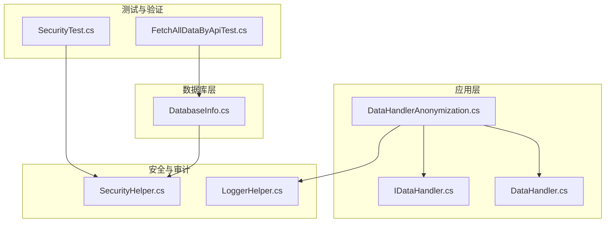
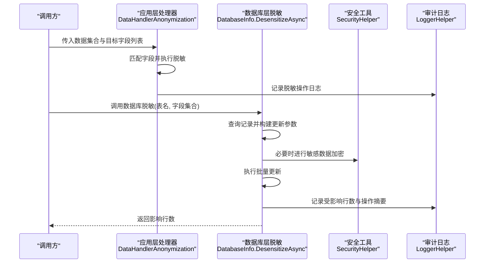
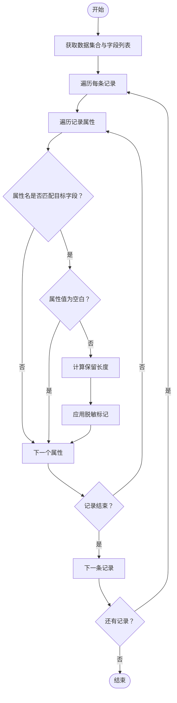
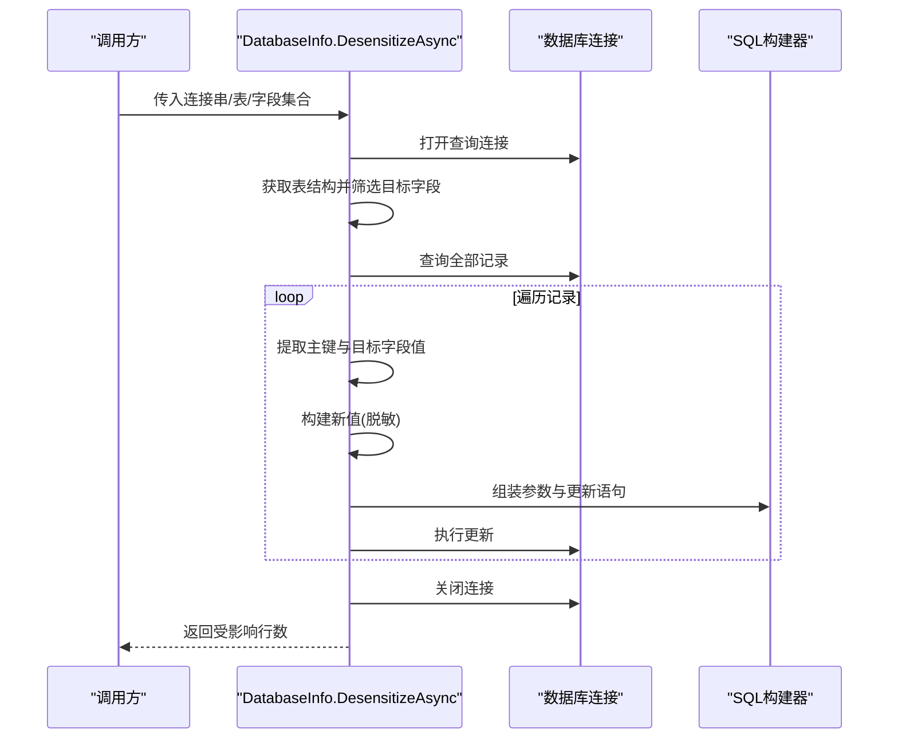
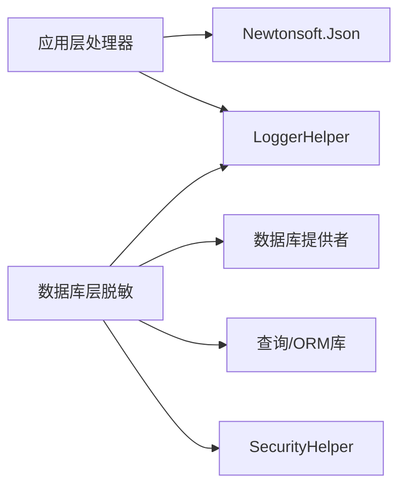

# 数据匿名化处理器

<cite>
**本文引用的文件**
- [DataHandlerAnonymization.cs](file://Sylas.RemoteTasks.App/DataHandlers/DataHandlerAnonymization.cs)
- [IDataHandler.cs](file://Sylas.RemoteTasks.App/DataHandlers/IDataHandler.cs)
- [DataHandler.cs](file://Sylas.RemoteTasks.App/DataHandlers/DataHandler.cs)
- [DatabaseInfo.cs](file://Sylas.RemoteTasks.Database/SyncBase/DatabaseInfo.cs)
- [SecurityHelper.cs](file://Sylas.RemoteTasks.Common/SecurityHelper.cs)
- [SecurityTest.cs](file://Sylas.RemoteTasks.Test/Database/SecurityTest.cs)
- [LoggerHelper.cs](file://Sylas.RemoteTasks.Common/LoggerHelper.cs)
- [FetchAllDataByApiTest.cs](file://Sylas.RemoteTasks.Test/Remote/FetchAllDataByApiTest.cs)
</cite>

## 目录
1. [简介](#简介)
2. [项目结构](#项目结构)
3. [核心组件](#核心组件)
4. [架构总览](#架构总览)
5. [详细组件分析](#详细组件分析)
6. [依赖关系分析](#依赖关系分析)
7. [性能考量](#性能考量)
8. [故障排查指南](#故障排查指南)
9. [结论](#结论)
10. [附录：匿名化配置与最佳实践](#附录匿名化配置与最佳实践)

## 简介
本文件围绕“数据匿名化处理器”展开，系统性阐述 DataHandlerAnonymization 的数据脱敏算法、隐私保护机制与合规性考虑；同时结合数据库级脱敏能力、加密工具与日志审计能力，给出可操作的配置参数、规则模板与自定义映射建议，并提供面向不同行业标准的匿名化示例与最佳实践。

## 项目结构
匿名化能力由三层协同实现：
- 应用层处理器：对 JSON 数据集合执行字段级脱敏（前端/中间层）
- 数据库层脱敏：对持久化数据执行批量更新脱敏（后端/数据库）
- 安全与审计：基于 AES 加密与日志记录，保障数据安全与可追溯

图表来源
- [DataHandlerAnonymization.cs](file://Sylas.RemoteTasks.App/DataHandlers/DataHandlerAnonymization.cs#L1-L42)
- [IDataHandler.cs](file://Sylas.RemoteTasks.App/DataHandlers/IDataHandler.cs#L1-L8)
- [DataHandler.cs](file://Sylas.RemoteTasks.App/DataHandlers/DataHandler.cs#L1-L16)
- [DatabaseInfo.cs](file://Sylas.RemoteTasks.Database/SyncBase/DatabaseInfo.cs#L4076-L4145)
- [SecurityHelper.cs](file://Sylas.RemoteTasks.Common/SecurityHelper.cs#L1-L228)
- [LoggerHelper.cs](file://Sylas.RemoteTasks.Common/LoggerHelper.cs#L1-L115)
- [SecurityTest.cs](file://Sylas.RemoteTasks.Test/Database/SecurityTest.cs#L1-L41)
- [FetchAllDataByApiTest.cs](file://Sylas.RemoteTasks.Test/Remote/FetchAllDataByApiTest.cs#L1-L82)

章节来源
- [DataHandlerAnonymization.cs](file://Sylas.RemoteTasks.App/DataHandlers/DataHandlerAnonymization.cs#L1-L42)
- [DatabaseInfo.cs](file://Sylas.RemoteTasks.Database/SyncBase/DatabaseInfo.cs#L4076-L4145)

## 核心组件
- 接口层：统一的异步数据处理器接口，便于扩展多种脱敏策略
- 应用层处理器：针对 JSON 集合按列名匹配进行字段脱敏
- 数据库层脱敏：按表与字段批量读取并更新，确保持久化数据一致性
- 安全工具：AES 加密/解密、HMAC 签名等，支撑敏感数据保护
- 审计日志：统一的日志记录能力，支持关键事件追踪

章节来源
- [IDataHandler.cs](file://Sylas.RemoteTasks.App/DataHandlers/IDataHandler.cs#L1-L8)
- [DataHandlerAnonymization.cs](file://Sylas.RemoteTasks.App/DataHandlers/DataHandlerAnonymization.cs#L1-L42)
- [DatabaseInfo.cs](file://Sylas.RemoteTasks.Database/SyncBase/DatabaseInfo.cs#L4076-L4145)
- [SecurityHelper.cs](file://Sylas.RemoteTasks.Common/SecurityHelper.cs#L1-L228)
- [LoggerHelper.cs](file://Sylas.RemoteTasks.Common/LoggerHelper.cs#L1-L115)

## 架构总览
下图展示从数据进入系统到完成脱敏与持久化的整体流程，包括应用层脱敏与数据库层脱敏两条路径，以及安全与审计的贯穿。

图表来源
- [DataHandlerAnonymization.cs](file://Sylas.RemoteTasks.App/DataHandlers/DataHandlerAnonymization.cs#L7-L39)
- [DatabaseInfo.cs](file://Sylas.RemoteTasks.Database/SyncBase/DatabaseInfo.cs#L4084-L4145)
- [SecurityHelper.cs](file://Sylas.RemoteTasks.Common/SecurityHelper.cs#L36-L88)
- [LoggerHelper.cs](file://Sylas.RemoteTasks.Common/LoggerHelper.cs#L48-L112)

## 详细组件分析

### 应用层匿名化处理器 DataHandlerAnonymization
- 输入参数
  - 参数0：数据集合（JSON 数组），元素为对象节点
  - 参数1：逗号分隔的目标字段名字符串
- 处理逻辑
  - 遍历数据集合中的每个对象节点
  - 对象节点的每个属性，若其名称与目标字段匹配，则对该属性值执行脱敏
  - 脱敏策略：保留前若干字符，其余以固定标记替代
- 关键点
  - 字段匹配大小写不敏感
  - 空值或空白值跳过处理
  - 保留长度为字符串长度的一半向下取整，若为0则至少保留1位

图表来源
- [DataHandlerAnonymization.cs](file://Sylas.RemoteTasks.App/DataHandlers/DataHandlerAnonymization.cs#L7-L39)

章节来源
- [DataHandlerAnonymization.cs](file://Sylas.RemoteTasks.App/DataHandlers/DataHandlerAnonymization.cs#L1-L42)

### 数据库层脱敏 DatabaseInfo.DesensitizeAsync
- 功能概述
  - 依据连接串、表名与字段集合，对数据库中的记录执行批量脱敏更新
- 主要步骤
  - 解析连接串确定数据库类型与参数占位符
  - 获取表结构，定位主键字段
  - 查询全表记录，逐条构建更新参数
  - 对目标字段执行脱敏：若原值非空且长度大于1，则在前缀添加固定标记并截断后半部分
  - 组装更新 SQL 并执行，累计受影响行数
- 关键点
  - 字段匹配大小写不敏感
  - 若字段值已以前缀标记开头则不再重复标记
  - 使用参数化查询防止注入

图表来源
- [DatabaseInfo.cs](file://Sylas.RemoteTasks.Database/SyncBase/DatabaseInfo.cs#L4084-L4145)

章节来源
- [DatabaseInfo.cs](file://Sylas.RemoteTasks.Database/SyncBase/DatabaseInfo.cs#L4076-L4145)

### 安全与加密工具 SecurityHelper
- 能力概览
  - AES 对称加密/解密（字符串与字节数组）
  - HMAC-SHA256 签名
  - 密钥派生与初始化向量管理
- 使用场景
  - 存储敏感配置（如数据库连接串）时进行加密
  - 对外传输或日志中避免直接暴露明文
- 注意事项
  - 默认密钥与 IV 仅用于演示，生产需替换为强密钥与随机 IV
  - 建议配合密钥管理服务与访问控制

章节来源
- [SecurityHelper.cs](file://Sylas.RemoteTasks.Common/SecurityHelper.cs#L1-L228)
- [SecurityTest.cs](file://Sylas.RemoteTasks.Test/Database/SecurityTest.cs#L1-L41)

### 审计与日志 LoggerHelper
- 能力概览
  - 控制台与文件双通道输出
  - 支持 Info/Error/Critical 等级别
  - 异步/同步写入，自动创建目录与文件
- 使用建议
  - 在脱敏前后记录关键元数据（表名、字段、影响行数、时间戳）
  - 对高风险操作启用 Critical 级别日志

章节来源
- [LoggerHelper.cs](file://Sylas.RemoteTasks.Common/LoggerHelper.cs#L1-L115)

## 依赖关系分析
- 应用层处理器依赖 JSON 解析库（Newtonsoft.Json）进行对象属性遍历与修改
- 数据库层脱敏依赖数据库提供者与 ORM/查询库（如 Dapper）进行结构查询与批量更新
- 安全工具独立于业务逻辑，可被任意模块调用
- 日志工具作为横切关注点，贯穿各层

图表来源
- [DataHandlerAnonymization.cs](file://Sylas.RemoteTasks.App/DataHandlers/DataHandlerAnonymization.cs#L1-L1)
- [DatabaseInfo.cs](file://Sylas.RemoteTasks.Database/SyncBase/DatabaseInfo.cs#L4084-L4145)
- [SecurityHelper.cs](file://Sylas.RemoteTasks.Common/SecurityHelper.cs#L1-L228)
- [LoggerHelper.cs](file://Sylas.RemoteTasks.Common/LoggerHelper.cs#L1-L115)

## 性能考量
- 应用层脱敏
  - 时间复杂度近似 O(N×M)，N 为记录数，M 为匹配字段数
  - 建议：仅对必要字段脱敏；对超大集合采用分页/流式处理
- 数据库层脱敏
  - 全表扫描与逐条更新，时间复杂度 O(R×F)，R 为记录数，F 为目标字段数
  - 建议：在目标字段上建立索引；分批更新并设置事务边界；限制单次更新数量
- 加密/解密
  - AES 为轻量算法，瓶颈通常在 I/O 与网络传输
  - 建议：批量加密/解密；避免在热路径频繁创建 Aes 实例

## 故障排查指南
- 字段未生效
  - 检查字段名大小写与拼写；确认参数1为逗号分隔的字段列表
  - 确认数据集合元素确为对象节点，且属性名存在
- 空值或空白值未处理
  - 代码对空值/空白值会跳过，属预期行为
- 数据库脱敏失败
  - 核查连接串与表名；确认目标字段存在于表结构中
  - 检查主键是否存在；若不存在将抛出异常
- 日志缺失
  - 确认日志目录可写；检查日志文件名与日期
- 加密解密异常
  - 确认密钥与 IV 设置一致；避免硬编码默认密钥

章节来源
- [DataHandlerAnonymization.cs](file://Sylas.RemoteTasks.App/DataHandlers/DataHandlerAnonymization.cs#L10-L10)
- [DatabaseInfo.cs](file://Sylas.RemoteTasks.Database/SyncBase/DatabaseInfo.cs#L4096-L4109)
- [LoggerHelper.cs](file://Sylas.RemoteTasks.Common/LoggerHelper.cs#L48-L112)
- [SecurityHelper.cs](file://Sylas.RemoteTasks.Common/SecurityHelper.cs#L105-L114)

## 结论
该匿名化体系通过“应用层字段脱敏 + 数据库层批量脱敏”的双轨设计，覆盖了开发与运维场景下的数据保护需求。配合安全工具与审计日志，可在保证数据可用性的前提下满足隐私合规要求。建议在生产环境中强化密钥管理、引入更细粒度的访问控制与审计策略，并根据业务规模优化批处理与性能。

## 附录：匿名化配置与最佳实践

### 匿名化配置参数
- 应用层处理器
  - 参数0：数据集合（JSON 数组）
  - 参数1：目标字段列表（逗号分隔）
- 数据库层脱敏
  - 连接串：包含数据库凭据与连接参数
  - 表名：目标表
  - 字段集合：目标字段列表（大小写不敏感）

章节来源
- [DataHandlerAnonymization.cs](file://Sylas.RemoteTasks.App/DataHandlers/DataHandlerAnonymization.cs#L7-L10)
- [DatabaseInfo.cs](file://Sylas.RemoteTasks.Database/SyncBase/DatabaseInfo.cs#L4079-L4082)

### 规则模板与自定义映射
- 字段映射模板
  - 映射表：字段名 -> 脱敏策略（如“保留前N位”、“固定标记”）
  - 自定义映射：按业务域（如身份证、邮箱、电话）定义不同保留比例
- 规则优先级
  - 优先级1：主键/唯一标识（严格保留或完全屏蔽）
  - 优先级2：高敏感字段（如身份证、银行卡号）保留最少
  - 优先级3：一般字段（如昵称、地址）适度遮蔽

### 加密处理方法
- 配置加密
  - 使用 AES 对配置项（如连接串）进行加密存储
  - 解密仅在运行时进行，避免明文落盘
- 传输加密
  - 对外接口使用 HTTPS/TLS
  - 内部组件间通信建议启用 mTLS 或令牌校验

章节来源
- [SecurityHelper.cs](file://Sylas.RemoteTasks.Common/SecurityHelper.cs#L36-L88)
- [SecurityTest.cs](file://Sylas.RemoteTasks.Test/Database/SecurityTest.cs#L19-L25)

### 数据完整性与统计保护
- 完整性
  - 保留主键用于更新定位；更新采用参数化 SQL
  - 分批处理并记录受影响行数，便于核对
- 统计保护
  - 对数值型字段可采用区间化或聚合时加噪声（需另行实现）
  - 避免通过脱敏后的数据反推出原始值（如保留过长前缀）

### 审计跟踪机制
- 关键事件
  - 脱敏开始/结束、目标表/字段、影响行数、执行用户/作业
- 日志落盘
  - 文件命名按日期；目录权限最小化
  - 定期轮转与清理策略

章节来源
- [LoggerHelper.cs](file://Sylas.RemoteTasks.Common/LoggerHelper.cs#L48-L112)
- [FetchAllDataByApiTest.cs](file://Sylas.RemoteTasks.Test/Remote/FetchAllDataByApiTest.cs#L29-L35)

### 不同行业标准示例与合规要求
- 金融行业（PCI DSS）
  - 敏感卡数据必须立即屏蔽或替换；日志不得留存明文
- 医疗健康（HIPAA）
  - 保护受保护健康信息（PHI）；最小化披露原则
- 个人数据保护（GDPR）
  - 数据主体权利（访问、更正、删除）；数据最小化与目的限制
- 通用建议
  - 建立数据分类分级制度
  - 制定脱敏策略清单与审批流程
  - 定期进行合规性审计与渗透测试

### 最佳实践清单
- 明确数据分类与脱敏策略
- 采用最小权限与最小暴露原则
- 引入自动化测试与回归验证
- 建立变更管理与回滚预案
- 强化密钥与证书生命周期管理
- 完善监控告警与事件响应