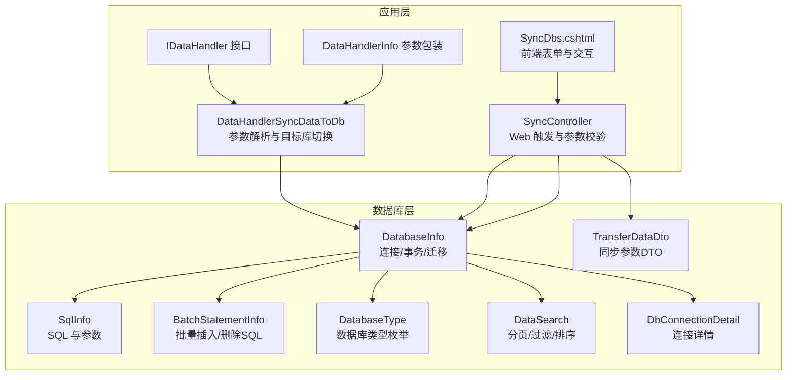
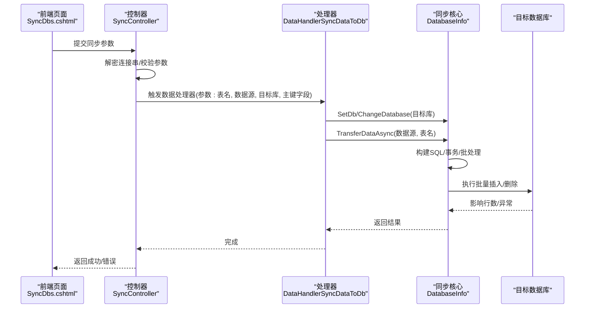
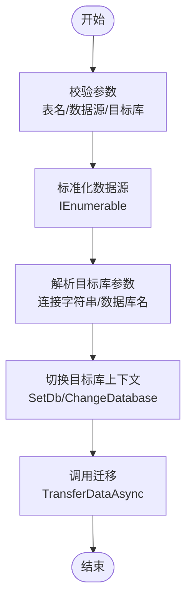
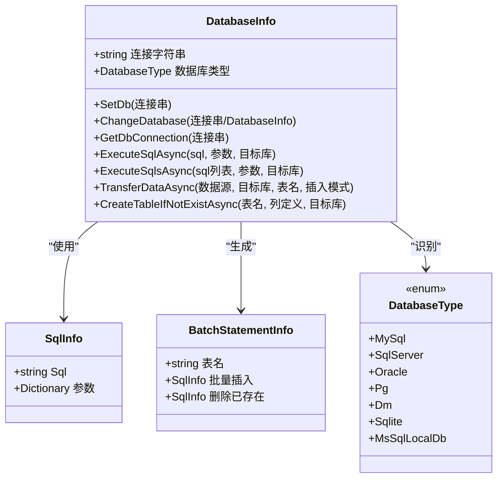
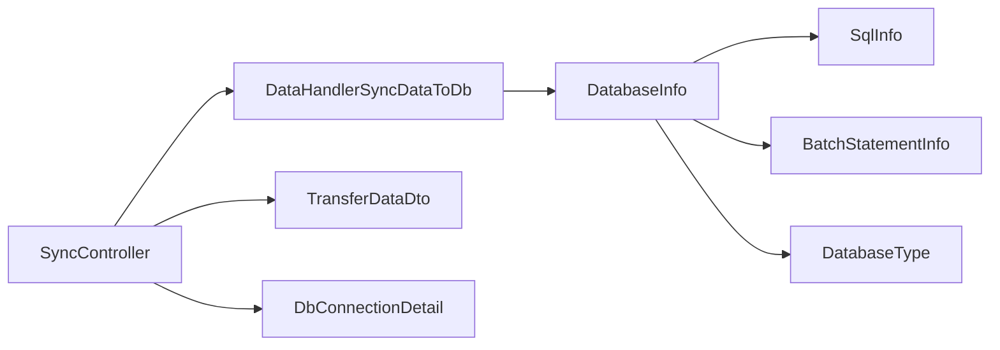
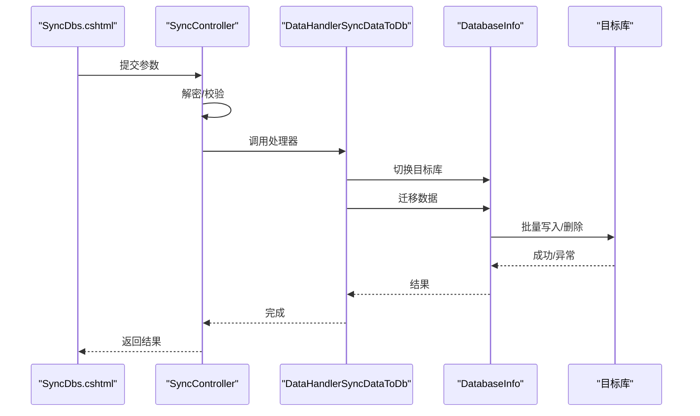

# 数据同步处理器

<cite>
**本文引用的文件**
- [DataHandlerSyncDataToDb.cs](file://Sylas.RemoteTasks.App/DataHandlers/DataHandlerSyncDataToDb.cs)
- [IDataHandler.cs](file://Sylas.RemoteTasks.App/DataHandlers/IDataHandler.cs)
- [DataHandler.cs](file://Sylas.RemoteTasks.App/DataHandlers/DataHandler.cs)
- [DatabaseInfo.cs](file://Sylas.RemoteTasks.Database/SyncBase/DatabaseInfo.cs)
- [TransferDataDto.cs](file://Sylas.RemoteTasks.Database/Dtos/TransferDataDto.cs)
- [DbConnectionDetail.cs](file://Sylas.RemoteTasks.Database/SyncBase(DbConnectionDetail.cs)
- [BatchStatementInfo.cs](file://Sylas.RemoteTasks.Database/SyncBase/BatchStatementInfo.cs)
- [DataSearch.cs](file://Sylas.RemoteTasks.Database/SyncBase/DataSearch.cs)
- [SqlInfo.cs](file://Sylas.RemoteTasks.Database/SyncBase/SqlInfo.cs)
- [DatabaseType.cs](file://Sylas.RemoteTasks.Database/SyncBase/DatabaseType.cs)
- [SyncController.cs](file://Sylas.RemoteTasks.App/Controllers/SyncController.cs)
- [SyncDbs.cshtml](file://Sylas.RemoteTasks.App/Views/Sync/SyncDbs.cshtml)
</cite>

## 目录
1. [简介](#简介)
2. [项目结构](#项目结构)
3. [核心组件](#核心组件)
4. [架构总览](#架构总览)
5. [详细组件分析](#详细组件分析)
6. [依赖分析](#依赖分析)
7. [性能考虑](#性能考虑)
8. [故障排查指南](#故障排查指南)
9. [结论](#结论)
10. [附录](#附录)

## 简介
本文件围绕“数据同步处理器”展开，重点阐述 DataHandlerSyncDataToDb 的实现原理、数据同步算法、增量更新机制与冲突解决策略，并覆盖连接管理、事务与回滚、配置参数、过滤与映射规则、一致性与并发控制、性能优化、典型场景与配置模板、以及故障恢复与错误处理最佳实践。

## 项目结构
该功能由应用层数据处理器与数据库层同步基座共同组成：
- 应用层 DataHandlers：封装具体数据处理器（如 DataHandlerSyncDataToDb），负责参数解析、目标数据库切换与调用同步基座。
- 数据库层 SyncBase：提供数据库连接、事务、SQL 构造、批量迁移等能力（DatabaseInfo、SqlInfo、BatchStatementInfo 等）。
- 控制器与视图：提供 Web 界面与 API，用于触发同步流程（SyncController、SyncDbs.cshtml）。
- DTO：定义传输参数（TransferDataDto）。

图表来源
- [DataHandlerSyncDataToDb.cs](file://Sylas.RemoteTasks.App/DataHandlers/DataHandlerSyncDataToDb.cs#L1-L65)
- [IDataHandler.cs](file://Sylas.RemoteTasks.App/DataHandlers/IDataHandler.cs#L1-L8)
- [DataHandler.cs](file://Sylas.RemoteTasks.App/DataHandlers/DataHandler.cs#L1-L16)
- [DatabaseInfo.cs](file://Sylas.RemoteTasks.Database/SyncBase/DatabaseInfo.cs#L1-L200)
- [SqlInfo.cs](file://Sylas.RemoteTasks.Database/SyncBase/SqlInfo.cs#L1-L38)
- [BatchStatementInfo.cs](file://Sylas.RemoteTasks.Database/SyncBase/BatchStatementInfo.cs#L1-L24)
- [DatabaseType.cs](file://Sylas.RemoteTasks.Database/SyncBase/DatabaseType.cs#L1-L38)
- [DataSearch.cs](file://Sylas.RemoteTasks.Database/SyncBase/DataSearch.cs#L1-L49)
- [TransferDataDto.cs](file://Sylas.RemoteTasks.Database/Dtos/TransferDataDto.cs#L1-L30)
- [DbConnectionDetail.cs](file://Sylas.RemoteTasks.Database/SyncBase/DbConnectionDetail.cs#L1-L55)
- [SyncController.cs](file://Sylas.RemoteTasks.App/Controllers/SyncController.cs#L1-L120)
- [SyncDbs.cshtml](file://Sylas.RemoteTasks.App/Views/Sync/SyncDbs.cshtml#L1-L112)

章节来源
- [DataHandlerSyncDataToDb.cs](file://Sylas.RemoteTasks.App/DataHandlers/DataHandlerSyncDataToDb.cs#L1-L65)
- [DatabaseInfo.cs](file://Sylas.RemoteTasks.Database/SyncBase/DatabaseInfo.cs#L1-L200)
- [SyncController.cs](file://Sylas.RemoteTasks.App/Controllers/SyncController.cs#L1-L120)
- [SyncDbs.cshtml](file://Sylas.RemoteTasks.App/Views/Sync/SyncDbs.cshtml#L1-L112)

## 核心组件
- DataHandlerSyncDataToDb：应用层数据处理器，负责解析参数、识别目标数据库连接字符串或数据库名、切换目标库上下文，并委托 DatabaseInfo 完成数据迁移。
- DatabaseInfo：数据库同步核心，提供连接管理、事务与回滚、SQL 构造、批量迁移、表存在性检测与创建、字段类型转换器等能力。
- SqlInfo/BatchStatementInfo：承载单条 SQL 与参数、批量插入/删除 SQL 的结构化信息。
- TransferDataDto：同步参数 DTO，支持源/目标连接标识、源/目标表名、仅插入模式等。
- SyncController/SyncDbs.cshtml：Web 触发入口，负责参数收集、解密连接串、调用同步逻辑。

章节来源
- [DataHandlerSyncDataToDb.cs](file://Sylas.RemoteTasks.App/DataHandlers/DataHandlerSyncDataToDb.cs#L1-L65)
- [DatabaseInfo.cs](file://Sylas.RemoteTasks.Database/SyncBase/DatabaseInfo.cs#L1-L200)
- [SqlInfo.cs](file://Sylas.RemoteTasks.Database/SyncBase/SqlInfo.cs#L1-L38)
- [BatchStatementInfo.cs](file://Sylas.RemoteTasks.Database/SyncBase/BatchStatementInfo.cs#L1-L24)
- [TransferDataDto.cs](file://Sylas.RemoteTasks.Database/Dtos/TransferDataDto.cs#L1-L30)
- [SyncController.cs](file://Sylas.RemoteTasks.App/Controllers/SyncController.cs#L365-L454)
- [SyncDbs.cshtml](file://Sylas.RemoteTasks.App/Views/Sync/SyncDbs.cshtml#L1-L112)

## 架构总览
DataHandlerSyncDataToDb 通过服务作用域获取 DatabaseInfo，根据传入的目标数据库参数（连接字符串或数据库名）进行切换，随后调用 DatabaseInfo 的数据迁移方法。DatabaseInfo 内部负责：
- 连接管理：根据连接字符串推断数据库类型，创建对应连接对象。
- 事务与回滚：在执行批量写入前开启事务，异常时回滚，确保原子性。
- SQL 构造：生成批量插入与删除现有记录的 SQL，支持不同数据库方言参数占位符。
- 字段类型转换：基于表结构自动构建字段转换器，避免类型不匹配导致的写入失败。
- 并发与批处理：采用队列与批次生成 SQL，提升吞吐与稳定性。

图表来源
- [SyncDbs.cshtml](file://Sylas.RemoteTasks.App/Views/Sync/SyncDbs.cshtml#L60-L89)
- [SyncController.cs](file://Sylas.RemoteTasks.App/Controllers/SyncController.cs#L370-L412)
- [DataHandlerSyncDataToDb.cs](file://Sylas.RemoteTasks.App/DataHandlers/DataHandlerSyncDataToDb.cs#L18-L62)
- [DatabaseInfo.cs](file://Sylas.RemoteTasks.Database/SyncBase/DatabaseInfo.cs#L1448-L1523)

## 详细组件分析

### DataHandlerSyncDataToDb 组件分析
- 参数解析与校验
  - 必需参数：表名、数据源、目标库；可选参数：主键字段，默认为 id。
  - 数据源支持单对象或集合，内部统一转为 IEnumerable<object>。
  - 目标库参数支持两种形态：连接字符串或数据库名。处理器会根据包含的关键字判断使用 SetDb 或 ChangeDatabase。
- 目标库切换
  - 通过 DatabaseInfo.SetDb/ChangeDatabase 切换目标库上下文，确保后续迁移在正确的目标库执行。
- 调用迁移
  - 最终调用 DatabaseInfo.TransferDataAsync，完成数据迁移。

图表来源
- [DataHandlerSyncDataToDb.cs](file://Sylas.RemoteTasks.App/DataHandlers/DataHandlerSyncDataToDb.cs#L18-L62)

章节来源
- [DataHandlerSyncDataToDb.cs](file://Sylas.RemoteTasks.App/DataHandlers/DataHandlerSyncDataToDb.cs#L1-L65)

### DatabaseInfo 同步算法与事务处理
- 连接管理
  - 支持多种数据库类型，依据连接字符串推断类型并创建对应连接对象。
  - 提供连接详情解析（主机、端口、实例、账号、密码、数据库、类型）。
- 事务与回滚
  - 在执行批量 SQL 前开启事务；若任一 SQL 抛出异常则回滚，保证原子性。
- SQL 构造与批处理
  - 生成批量插入与删除现有记录的 SQL，支持不同数据库方言的参数占位符。
  - 采用队列与批次（如每批 1000 条）生成 SQL，减少内存占用并提升吞吐。
- 字段类型转换
  - 基于表结构获取字段类型转换器，自动将字符串值转换为目标类型，避免类型不匹配。
- 表存在性与创建
  - 若目标表不存在，根据列定义生成建表 SQL 并创建。

图表来源
- [DatabaseInfo.cs](file://Sylas.RemoteTasks.Database/SyncBase/DatabaseInfo.cs#L149-L163)
- [SqlInfo.cs](file://Sylas.RemoteTasks.Database/SyncBase/SqlInfo.cs#L1-L38)
- [BatchStatementInfo.cs](file://Sylas.RemoteTasks.Database/SyncBase/BatchStatementInfo.cs#L1-L24)
- [DatabaseType.cs](file://Sylas.RemoteTasks.Database/SyncBase/DatabaseType.cs#L1-L38)

章节来源
- [DatabaseInfo.cs](file://Sylas.RemoteTasks.Database/SyncBase/DatabaseInfo.cs#L149-L163)
- [DatabaseInfo.cs](file://Sylas.RemoteTasks.Database/SyncBase/DatabaseInfo.cs#L372-L433)
- [DatabaseInfo.cs](file://Sylas.RemoteTasks.Database/SyncBase/DatabaseInfo.cs#L1366-L1523)
- [DatabaseInfo.cs](file://Sylas.RemoteTasks.Database/SyncBase/DatabaseInfo.cs#L2331-L2394)

### 增量更新机制与冲突解决策略
- 增量更新
  - 默认模式下，先删除目标表中与源数据主键匹配的记录，再批量插入源数据，从而实现“全量覆盖式”的增量更新。
  - 仅插入模式（InsertOnly）跳过删除步骤，仅做插入，避免破坏目标表中其他数据。
- 冲突解决
  - 主键冲突：通过删除已存在记录后再插入的方式解决；若源数据本身存在重复主键，建议上游去重。
  - 类型冲突：通过字段类型转换器自动转换，降低因类型不匹配导致的失败。
  - 并发冲突：通过事务包裹批量写入，确保写入过程原子性；若外部并发写入，建议在业务层加锁或使用时间戳/版本字段配合更新策略。

章节来源
- [TransferDataDto.cs](file://Sylas.RemoteTasks.Database/Dtos/TransferDataDto.cs#L24-L28)
- [DatabaseInfo.cs](file://Sylas.RemoteTasks.Database/SyncBase/DatabaseInfo.cs#L1377-L1387)
- [DatabaseInfo.cs](file://Sylas.RemoteTasks.Database/SyncBase/DatabaseInfo.cs#L1388-L1432)

### 数据源与目标数据库连接管理
- 数据源
  - 支持从 HTTP 请求或其他来源获取数据，统一以 IEnumerable<object> 输入。
- 目标库
  - 支持直接传入连接字符串或数据库名；处理器根据关键字判断使用 SetDb 或 ChangeDatabase。
  - DatabaseInfo 提供连接字符串解析、连接对象创建、数据库切换、连接池与安全字符清理等能力。

章节来源
- [DataHandlerSyncDataToDb.cs](file://Sylas.RemoteTasks.App/DataHandlers/DataHandlerSyncDataToDb.cs#L48-L59)
- [DatabaseInfo.cs](file://Sylas.RemoteTasks.Database/SyncBase/DatabaseInfo.cs#L210-L299)
- [DatabaseInfo.cs](file://Sylas.RemoteTasks.Database/SyncBase/DatabaseInfo.cs#L149-L163)

### 过滤条件与映射规则
- 过滤与排序
  - 通过 DataSearch 提供分页、过滤条件与排序规则，便于在查询阶段就进行数据筛选。
- 字段映射
  - 同步过程中会根据源数据字段与目标表结构建立映射关系，自动忽略不匹配字段并按目标表列定义生成 SQL。

章节来源
- [DataSearch.cs](file://Sylas.RemoteTasks.Database/SyncBase/DataSearch.cs#L1-L49)
- [DatabaseInfo.cs](file://Sylas.RemoteTasks.Database/SyncBase/DatabaseInfo.cs#L2340-L2355)
- [DatabaseInfo.cs](file://Sylas.RemoteTasks.Database/SyncBase/DatabaseInfo.cs#L2398-L2412)

### 数据一致性保证与并发控制
- 一致性
  - 事务包裹批量写入，异常即回滚，确保要么全部成功，要么保持原状。
- 并发
  - 建议在业务层对目标表加排他锁或使用时间戳/版本字段，避免外部并发写入造成的数据竞争。
  - 批处理与队列机制降低单次写入压力，提升整体稳定性。

章节来源
- [DatabaseInfo.cs](file://Sylas.RemoteTasks.Database/SyncBase/DatabaseInfo.cs#L386-L399)
- [DatabaseInfo.cs](file://Sylas.RemoteTasks.Database/SyncBase/DatabaseInfo.cs#L417-L432)
- [DatabaseInfo.cs](file://Sylas.RemoteTasks.Database/SyncBase/DatabaseInfo.cs#L2331-L2394)

### 性能优化策略
- 批量处理
  - 采用固定批次大小（如 1000 条/批）生成 SQL，平衡内存占用与吞吐。
- 字段类型转换缓存
  - 针对表的字段转换器进行缓存，避免重复反射与表达式构建。
- SQL 构造优化
  - 针对不同数据库方言生成合适的参数占位符，减少参数绑定开销。
- 并行化
  - 多表/多文件同步时可并行执行多个迁移任务，充分利用 I/O 与 CPU。

章节来源
- [DatabaseInfo.cs](file://Sylas.RemoteTasks.Database/SyncBase/DatabaseInfo.cs#L515-L549)
- [DatabaseInfo.cs](file://Sylas.RemoteTasks.Database/SyncBase/DatabaseInfo.cs#L2331-L2394)

### 同步场景示例与配置模板
- 场景一：从 JSON 文件导入数据到目标库
  - 步骤：上传 JSON → 反序列化为字典列表 → 解密目标库连接串 → 调用 DatabaseInfo.TransferDataAsync。
  - 关键参数：目标连接串 ID、目标表名、是否仅插入。
- 场景二：Web 界面触发同步
  - 步骤：前端选择源/目标连接串与表名 → 提交参数 → 控制器解密并校验 → 调用处理器 → 完成同步。
- 配置模板（参数说明）
  - 源连接串 ID：源数据库连接信息的标识。
  - 目标连接串 ID：目标数据库连接信息的标识。
  - 源表名：可为逗号/分号分隔的多个表名。
  - 目标表名：可为逗号/分号分隔的多个表名（与源表一一对应）。
  - 仅插入：true 时不删除已存在记录，仅插入新数据。

章节来源
- [SyncController.cs](file://Sylas.RemoteTasks.App/Controllers/SyncController.cs#L424-L454)
- [SyncDbs.cshtml](file://Sylas.RemoteTasks.App/Views/Sync/SyncDbs.cshtml#L60-L89)
- [TransferDataDto.cs](file://Sylas.RemoteTasks.Database/Dtos/TransferDataDto.cs#L1-L30)

## 依赖分析
- 组件耦合
  - DataHandlerSyncDataToDb 依赖 DatabaseInfo 的连接与迁移能力。
  - DatabaseInfo 依赖 SqlInfo/BatchStatementInfo 进行 SQL 生成与执行。
  - SyncController 作为入口，协调参数解析、连接串解密与处理器调用。
- 外部依赖
  - 多种数据库驱动（MySql、Oracle、SqlServer、Pg、Sqlite、Dm）。
  - Dapper 用于轻量 ORM 查询与执行。
  - 前端通过 SignalR/JS 与后端交互（与同步功能关联不大，但影响用户体验）。

图表来源
- [DataHandlerSyncDataToDb.cs](file://Sylas.RemoteTasks.App/DataHandlers/DataHandlerSyncDataToDb.cs#L1-L65)
- [DatabaseInfo.cs](file://Sylas.RemoteTasks.Database/SyncBase/DatabaseInfo.cs#L1-L200)
- [SqlInfo.cs](file://Sylas.RemoteTasks.Database/SyncBase/SqlInfo.cs#L1-L38)
- [BatchStatementInfo.cs](file://Sylas.RemoteTasks.Database/SyncBase/BatchStatementInfo.cs#L1-L24)
- [DatabaseType.cs](file://Sylas.RemoteTasks.Database/SyncBase/DatabaseType.cs#L1-L38)
- [TransferDataDto.cs](file://Sylas.RemoteTasks.Database/Dtos/TransferDataDto.cs#L1-L30)
- [DbConnectionDetail.cs](file://Sylas.RemoteTasks.Database/SyncBase/DbConnectionDetail.cs#L1-L55)
- [SyncController.cs](file://Sylas.RemoteTasks.App/Controllers/SyncController.cs#L365-L454)

章节来源
- [DataHandlerSyncDataToDb.cs](file://Sylas.RemoteTasks.App/DataHandlers/DataHandlerSyncDataToDb.cs#L1-L65)
- [DatabaseInfo.cs](file://Sylas.RemoteTasks.Database/SyncBase/DatabaseInfo.cs#L1-L200)
- [SyncController.cs](file://Sylas.RemoteTasks.App/Controllers/SyncController.cs#L365-L454)

## 性能考虑
- 批处理大小：建议根据目标库性能与网络状况调整批次大小（如 1000 条/批）。
- 并行度：多表/多文件同步时可并行执行，注意数据库连接池与并发限制。
- 字段类型转换：启用缓存，避免重复构建转换器。
- SQL 方言：针对不同数据库使用合适的参数占位符，减少参数绑定成本。
- I/O 优化：尽量在源端进行过滤与分页，减少传输与目标端写入压力。

## 故障排查指南
- 常见错误
  - 参数不足：检查表名、数据源、目标库参数是否齐全。
  - 连接串无效：确认连接串格式正确且可解析；必要时使用 DbConnectionDetail 进行验证。
  - 表不存在：启用自动建表功能或手动创建表结构。
  - 类型不匹配：检查字段类型转换器是否生效，必要时在源端清洗数据。
- 事务与回滚
  - 若出现部分失败，检查异常日志并确认事务是否正常回滚。
- 并发问题
  - 如遇并发写入冲突，建议在业务层增加锁或引入时间戳/版本字段。

章节来源
- [DataHandlerSyncDataToDb.cs](file://Sylas.RemoteTasks.App/DataHandlers/DataHandlerSyncDataToDb.cs#L20-L23)
- [DatabaseInfo.cs](file://Sylas.RemoteTasks.Database/SyncBase/DatabaseInfo.cs#L727-L736)
- [DatabaseInfo.cs](file://Sylas.RemoteTasks.Database/SyncBase/DatabaseInfo.cs#L386-L399)
- [DatabaseInfo.cs](file://Sylas.RemoteTasks.Database/SyncBase/DatabaseInfo.cs#L417-L432)

## 结论
DataHandlerSyncDataToDb 通过简洁的参数模型与目标库切换，将复杂的数据迁移工作委托给 DatabaseInfo。后者以事务、批处理、SQL 构造与类型转换为核心能力，提供了高可靠、高性能的数据同步方案。结合 Web 界面与控制器，用户可以快速完成从任意数据源到目标数据库的同步任务。建议在生产环境中配合严格的参数校验、连接串解密、并发控制与监控告警，确保稳定运行。

## 附录
- 关键流程时序（从 Web 触发到数据库写入）

图表来源
- [SyncDbs.cshtml](file://Sylas.RemoteTasks.App/Views/Sync/SyncDbs.cshtml#L60-L89)
- [SyncController.cs](file://Sylas.RemoteTasks.App/Controllers/SyncController.cs#L370-L412)
- [DataHandlerSyncDataToDb.cs](file://Sylas.RemoteTasks.App/DataHandlers/DataHandlerSyncDataToDb.cs#L18-L62)
- [DatabaseInfo.cs](file://Sylas.RemoteTasks.Database/SyncBase/DatabaseInfo.cs#L1448-L1523)