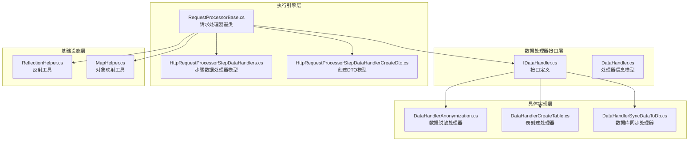
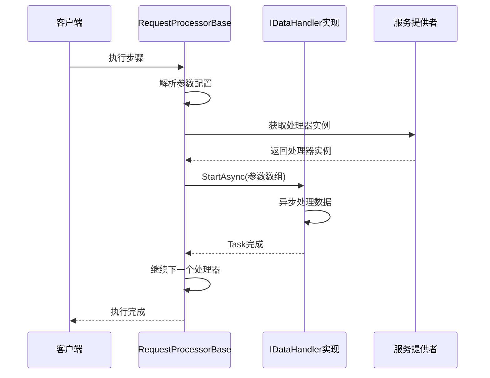
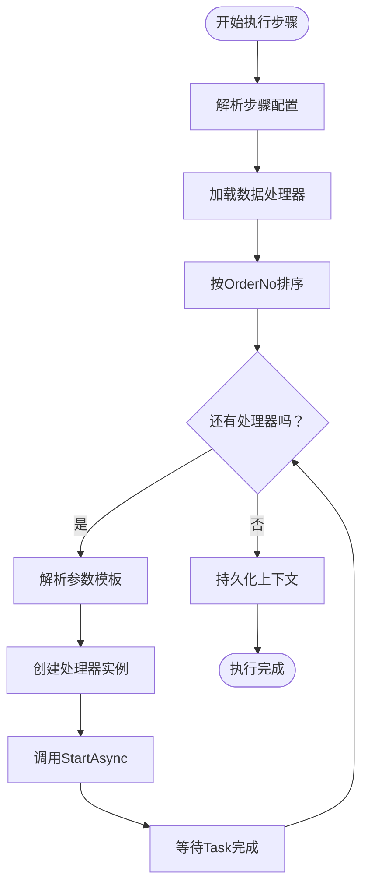
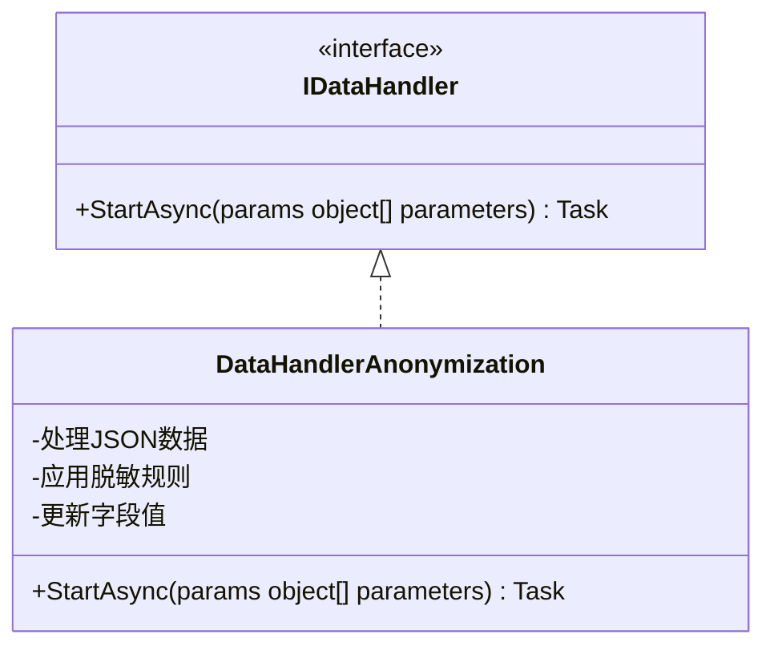
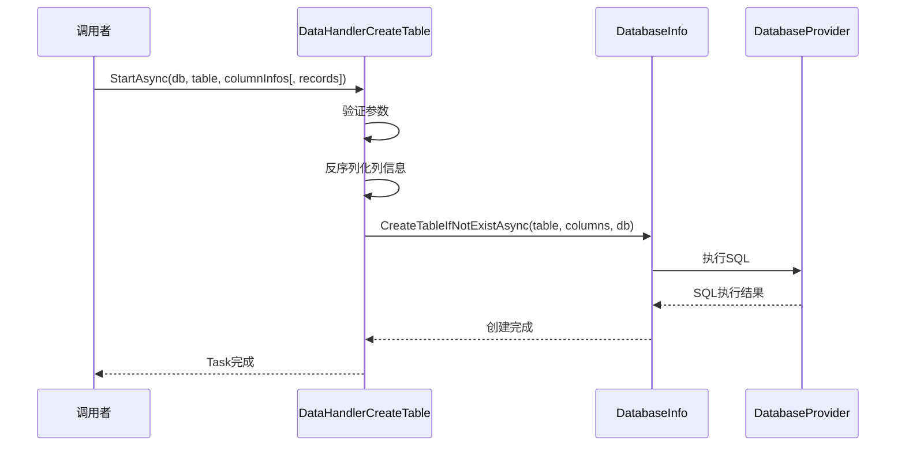
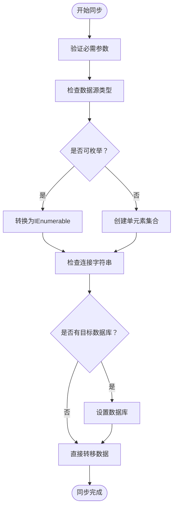
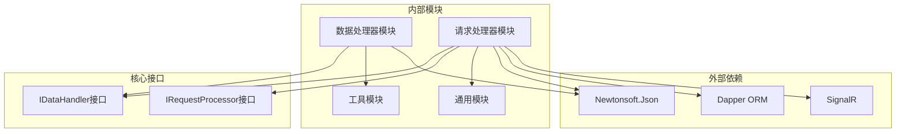

# 数据处理器接口设计

<cite>
**本文档引用的文件**
- [IDataHandler.cs](file://Sylas.RemoteTasks.App/DataHandlers/IDataHandler.cs)
- [DataHandler.cs](file://Sylas.RemoteTasks.App/DataHandlers/DataHandler.cs)
- [DataHandlerAnonymization.cs](file://Sylas.RemoteTasks.App/DataHandlers/DataHandlerAnonymization.cs)
- [DataHandlerCreateTable.cs](file://Sylas.RemoteTasks.App/DataHandlers/DataHandlerCreateTable.cs)
- [DataHandlerSyncDataToDb.cs](file://Sylas.RemoteTasks.App/DataHandlers/DataHandlerSyncDataToDb.cs)
- [RequestProcessorBase.cs](file://Sylas.RemoteTasks.App/RequestProcessor/RequestProcessorBase.cs)
- [HttpRequestProcessorStepDataHandlers.cs](file://Sylas.RemoteTasks.App/RequestProcessor/Models/HttpRequestProcessorStepDataHandlers.cs)
- [HttpRequestProcessorStepDataHandlerCreateDto.cs](file://Sylas.RemoteTasks.App/RequestProcessor/Models/Dtos/HttpRequestProcessorStepDataHandlerCreateDto.cs)
- [ReflectionHelper.cs](file://Sylas.RemoteTasks.Utils/ReflectionHelper.cs)
- [MapHelper.cs](file://Sylas.RemoteTasks.Common/MapHelper.cs)
- [HttpRequestProcessor.cs](file://Sylas.RemoteTasks.App/RequestProcessor/Models/HttpRequestProcessor.cs)
</cite>

## 目录
1. [简介](#简介)
2. [项目结构](#项目结构)
3. [核心组件](#核心组件)
4. [架构概览](#架构概览)
5. [详细组件分析](#详细组件分析)
6. [依赖关系分析](#依赖关系分析)
7. [性能考量](#性能考量)
8. [故障排除指南](#故障排除指南)
9. [结论](#结论)

## 简介

本文档深入解析Sylas.RemoteTasks项目中的数据处理器接口设计，重点分析IDataHandler接口的设计理念、实现模式以及在整个数据处理架构中的关键作用。该接口采用简洁而强大的设计理念，通过统一的StartAsync方法和params object[]参数机制，实现了高度可扩展的数据处理能力。

IDataHandler接口作为数据处理管道的核心抽象，为各种数据处理场景提供了统一的编程模型，包括数据脱敏、表结构创建、数据同步等常见业务需求。其设计充分体现了.NET异步编程的最佳实践，支持高效的并发处理和资源管理。

## 项目结构

数据处理器相关的核心文件分布如下：



**图表来源**
- [IDataHandler.cs](file://Sylas.RemoteTasks.App/DataHandlers/IDataHandler.cs#L1-L8)
- [DataHandler.cs](file://Sylas.RemoteTasks.App/DataHandlers/DataHandler.cs#L1-L16)
- [DataHandlerAnonymization.cs](file://Sylas.RemoteTasks.App/DataHandlers/DataHandlerAnonymization.cs#L1-L42)
- [DataHandlerCreateTable.cs](file://Sylas.RemoteTasks.App/DataHandlers/DataHandlerCreateTable.cs#L1-L34)
- [DataHandlerSyncDataToDb.cs](file://Sylas.RemoteTasks.App/DataHandlers/DataHandlerSyncDataToDb.cs#L1-L65)
- [RequestProcessorBase.cs](file://Sylas.RemoteTasks.App/RequestProcessor/RequestProcessorBase.cs#L1-L279)

**章节来源**
- [IDataHandler.cs](file://Sylas.RemoteTasks.App/DataHandlers/IDataHandler.cs#L1-L8)
- [RequestProcessorBase.cs](file://Sylas.RemoteTasks.App/RequestProcessor/RequestProcessorBase.cs#L1-L279)

## 核心组件

### IDataHandler接口设计

IDataHandler接口采用了极简而强大的设计哲学，仅定义了一个核心方法：

```csharp
public interface IDataHandler
{
    Task StartAsync(params object[] parameters);
}
```

**设计特点：**
- **统一入口**：所有数据处理器都必须实现StartAsync方法
- **灵活参数**：使用params object[]允许传入任意数量和类型的参数
- **异步模式**：返回Task确保非阻塞的异步处理
- **命名约定**：遵循.NET异步编程标准

### DataHandlerInfo模型

为了支持数据处理器的配置和执行，项目提供了DataHandlerInfo模型：

```csharp
public class DataHandlerInfo
{
    public string Handler { get; set; }
    public List<string> Parameters { get; set; }
    public int OrderNo { get; set; }
}
```

该模型用于存储处理器名称、参数列表和执行顺序，为动态加载和执行提供了基础。

**章节来源**
- [IDataHandler.cs](file://Sylas.RemoteTasks.App/DataHandlers/IDataHandler.cs#L1-L8)
- [DataHandler.cs](file://Sylas.RemoteTasks.App/DataHandlers/DataHandler.cs#L1-L16)

## 架构概览

数据处理器架构采用分层设计，通过请求处理器基类协调各个数据处理器的执行：



**图表来源**
- [RequestProcessorBase.cs](file://Sylas.RemoteTasks.App/RequestProcessor/RequestProcessorBase.cs#L256-L276)
- [IDataHandler.cs](file://Sylas.RemoteTasks.App/DataHandlers/IDataHandler.cs#L1-L8)

架构的关键优势：
- **解耦设计**：处理器之间相互独立，可通过配置动态组合
- **扩展性强**：新增处理器只需实现IDataHandler接口
- **异步执行**：充分利用.NET异步编程优势
- **参数灵活**：支持任意数量和类型的参数传递

## 详细组件分析

### 数据处理器执行流程

RequestProcessorBase类负责协调所有数据处理器的执行：



**图表来源**
- [RequestProcessorBase.cs](file://Sylas.RemoteTasks.App/RequestProcessor/RequestProcessorBase.cs#L256-L276)

### 具体处理器实现分析

#### 数据脱敏处理器

DataHandlerAnonymization展示了如何实现敏感数据保护：



**图表来源**
- [IDataHandler.cs](file://Sylas.RemoteTasks.App/DataHandlers/IDataHandler.cs#L1-L8)
- [DataHandlerAnonymization.cs](file://Sylas.RemoteTasks.App/DataHandlers/DataHandlerAnonymization.cs#L1-L42)

#### 表创建处理器

DataHandlerCreateTable演示了如何处理数据库结构变更：



**图表来源**
- [DataHandlerCreateTable.cs](file://Sylas.RemoteTasks.App/DataHandlers/DataHandlerCreateTable.cs#L17-L31)

#### 数据库同步处理器

DataHandlerSyncDataToDb展示了复杂数据处理场景：



**图表来源**
- [DataHandlerSyncDataToDb.cs](file://Sylas.RemoteTasks.App/DataHandlers/DataHandlerSyncDataToDb.cs#L18-L61)

**章节来源**
- [RequestProcessorBase.cs](file://Sylas.RemoteTasks.App/RequestProcessor/RequestProcessorBase.cs#L256-L276)
- [DataHandlerAnonymization.cs](file://Sylas.RemoteTasks.App/DataHandlers/DataHandlerAnonymization.cs#L1-L42)
- [DataHandlerCreateTable.cs](file://Sylas.RemoteTasks.App/DataHandlers/DataHandlerCreateTable.cs#L1-L34)
- [DataHandlerSyncDataToDb.cs](file://Sylas.RemoteTasks.App/DataHandlers/DataHandlerSyncDataToDb.cs#L1-L65)

### 参数处理策略

数据处理器采用灵活的参数处理机制：

1. **模板解析**：使用TmplHelper.ResolveExpressionValue解析参数模板
2. **类型转换**：自动将字符串参数转换为实际类型
3. **动态绑定**：通过反射机制动态调用处理器方法
4. **异常处理**：统一的异常捕获和错误报告机制

**章节来源**
- [RequestProcessorBase.cs](file://Sylas.RemoteTasks.App/RequestProcessor/RequestProcessorBase.cs#L263-L274)

## 依赖关系分析



**图表来源**
- [RequestProcessorBase.cs](file://Sylas.RemoteTasks.App/RequestProcessor/RequestProcessorBase.cs#L1-L279)
- [DataHandlerAnonymization.cs](file://Sylas.RemoteTasks.App/DataHandlers/DataHandlerAnonymization.cs#L1-L42)
- [DataHandlerCreateTable.cs](file://Sylas.RemoteTasks.App/DataHandlers/DataHandlerCreateTable.cs#L1-L34)
- [DataHandlerSyncDataToDb.cs](file://Sylas.RemoteTasks.App/DataHandlers/DataHandlerSyncDataToDb.cs#L1-L65)

**章节来源**
- [ReflectionHelper.cs](file://Sylas.RemoteTasks.Utils/ReflectionHelper.cs#L1-L80)
- [MapHelper.cs](file://Sylas.RemoteTasks.Common/MapHelper.cs#L1-L55)

## 性能考量

### 异步处理优化

1. **Task.CompletedTask模式**：对于简单处理器，直接返回已完成的任务以避免不必要的异步开销
2. **参数预处理**：在调用前完成参数解析和类型转换
3. **内存管理**：避免创建不必要的中间对象，特别是大数据集处理时

### 扩展性最佳实践

1. **处理器隔离**：每个处理器专注于单一职责
2. **参数最小化**：只传递必要的参数，避免过大的参数对象
3. **错误边界**：在处理器内部处理特定领域的异常，向上抛出通用异常

### 资源管理

1. **依赖注入**：通过IServiceProvider管理处理器生命周期
2. **作用域控制**：使用IServiceScopeFactory创建临时作用域
3. **连接池**：合理管理数据库连接和其他外部资源

## 故障排除指南

### 常见问题及解决方案

#### 参数解析错误
- **症状**：处理器无法正确解析参数
- **原因**：参数模板语法错误或数据类型不匹配
- **解决方案**：检查ParametersInput配置和模板语法

#### 反射调用失败
- **症状**：找不到StartAsync方法或实例化失败
- **原因**：处理器类名错误或缺少无参构造函数
- **解决方案**：验证处理器类名和构造函数定义

#### 异常处理问题
- **症状**：处理器异常导致整个流程中断
- **原因**：处理器内部未正确处理异常
- **解决方案**：在处理器中实现适当的异常捕获和恢复逻辑

### 调试技巧

1. **日志记录**：利用ILogger记录处理器执行状态
2. **参数验证**：在StartAsync方法开始处验证参数有效性
3. **单元测试**：为每个处理器编写独立的测试用例

**章节来源**
- [RequestProcessorBase.cs](file://Sylas.RemoteTasks.App/RequestProcessor/RequestProcessorBase.cs#L263-L274)
- [DataHandlerAnonymization.cs](file://Sylas.RemoteTasks.App/DataHandlers/DataHandlerAnonymization.cs#L10-L38)

## 结论

IDataHandler接口设计体现了现代.NET应用架构的最佳实践，通过简洁的接口定义和灵活的参数机制，实现了高度可扩展的数据处理能力。该设计的主要优势包括：

1. **设计优雅**：接口定义简洁明了，符合单一职责原则
2. **扩展性强**：支持动态加载和组合各种数据处理器
3. **性能优秀**：基于Task的异步模式确保高效执行
4. **维护友好**：清晰的职责分离便于长期维护

通过RequestProcessorBase的协调机制，系统能够灵活地组织和执行各种数据处理任务，为复杂的数据处理场景提供了强大的基础设施支持。这种设计模式值得在其他类似的数据处理系统中借鉴和应用。