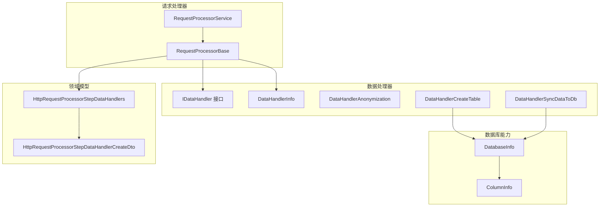
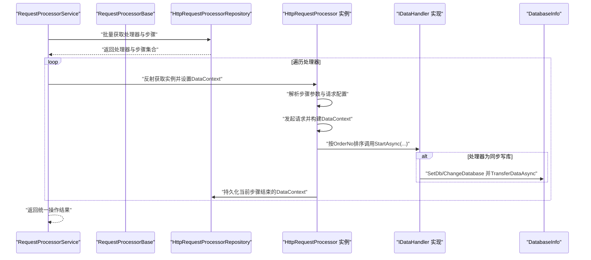
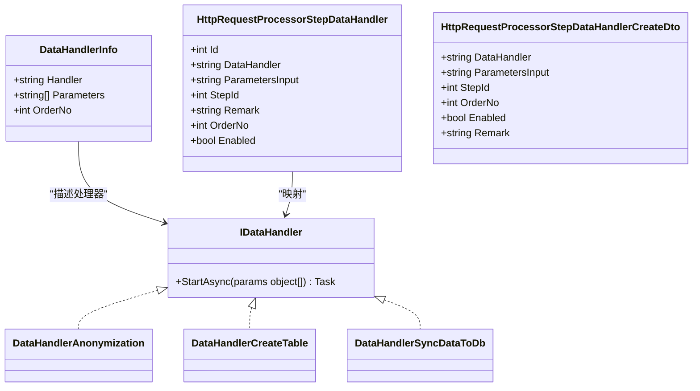
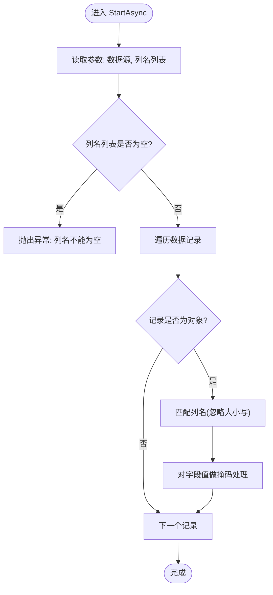
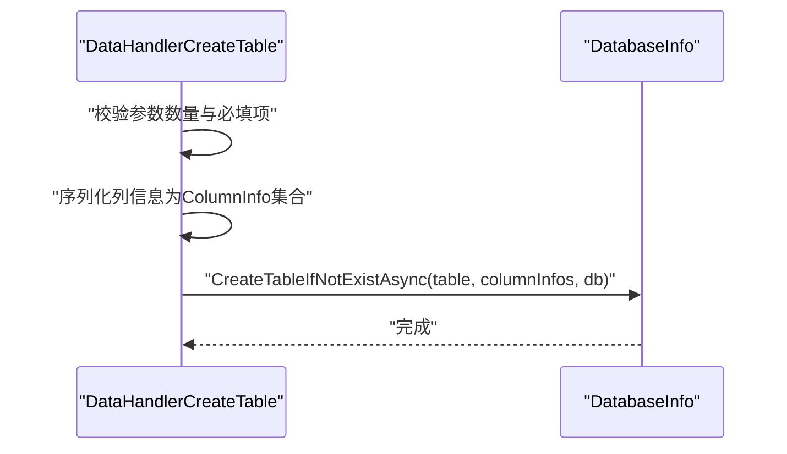
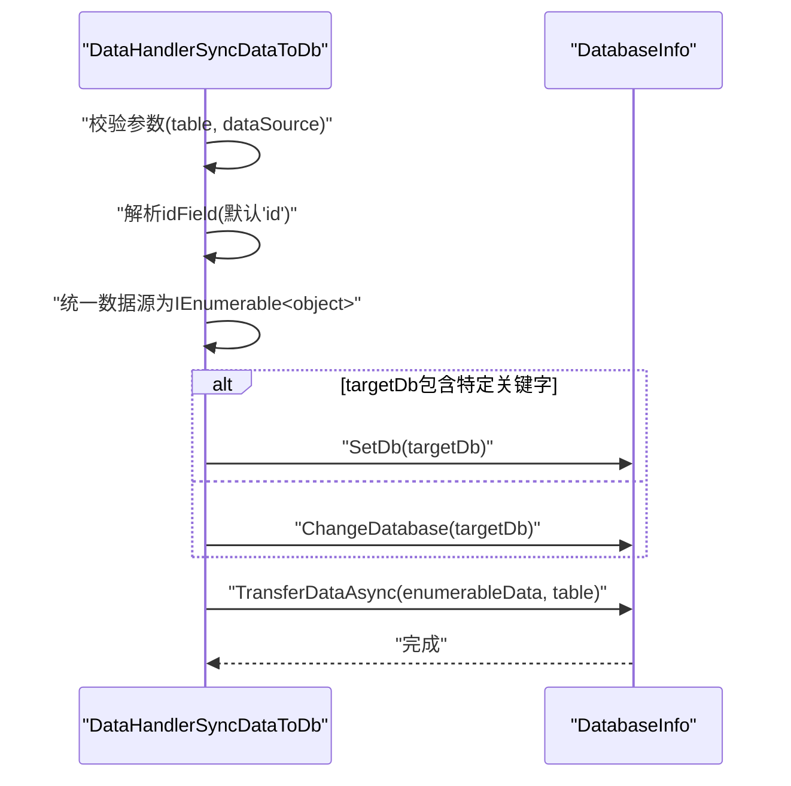
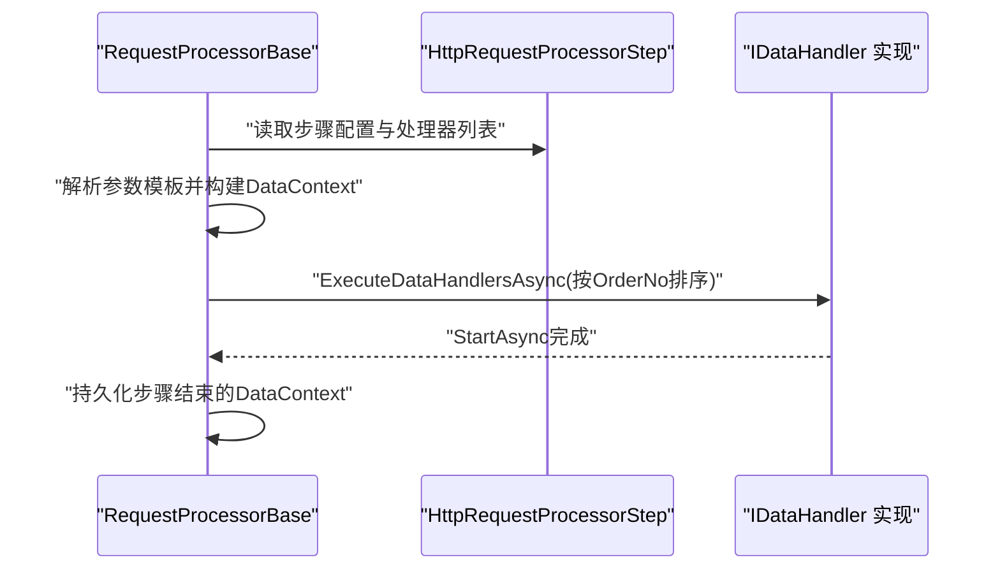
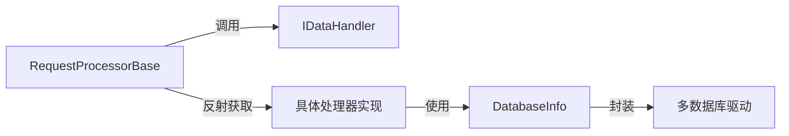

# 数据处理器模块

<cite>
**本文档引用的文件**
- [IDataHandler.cs](file://Sylas.RemoteTasks.App/DataHandlers/IDataHandler.cs)
- [DataHandler.cs](file://Sylas.RemoteTasks.App/DataHandlers/DataHandler.cs)
- [DataHandlerAnonymization.cs](file://Sylas.RemoteTasks.App/DataHandlers/DataHandlerAnonymization.cs)
- [DataHandlerCreateTable.cs](file://Sylas.RemoteTasks.App/DataHandlers/DataHandlerCreateTable.cs)
- [DataHandlerSyncDataToDb.cs](file://Sylas.RemoteTasks.App/DataHandlers/DataHandlerSyncDataToDb.cs)
- [RequestProcessorBase.cs](file://Sylas.RemoteTasks.App/RequestProcessor/RequestProcessorBase.cs)
- [RequestProcessorService.cs](file://Sylas.RemoteTasks.App/RequestProcessor/RequestProcessorService.cs)
- [HttpRequestProcessorStepDataHandlers.cs](file://Sylas.RemoteTasks.App/RequestProcessor/Models/HttpRequestProcessorStepDataHandlers.cs)
- [HttpRequestProcessorStepDataHandlerCreateDto.cs](file://Sylas.RemoteTasks.App/RequestProcessor/Models/Dtos/HttpRequestProcessorStepDataHandlerCreateDto.cs)
- [DatabaseInfo.cs](file://Sylas.RemoteTasks.Database/SyncBase/DatabaseInfo.cs)
- [ColumnInfo.cs](file://Sylas.RemoteTasks.Database/Dtos/ColumnInfo.cs)
- [OperationResult.cs](file://Sylas.RemoteTasks.Common/Dtos/OperationResult.cs)
</cite>

## 目录
1. [简介](#简介)
2. [项目结构](#项目结构)
3. [核心组件](#核心组件)
4. [架构总览](#架构总览)
5. [详细组件分析](#详细组件分析)
6. [依赖关系分析](#依赖关系分析)
7. [性能考量](#性能考量)
8. [故障排查指南](#故障排查指南)
9. [结论](#结论)
10. [附录](#附录)

## 简介
本模块围绕“数据处理器”展开，目标是为远程任务流程中的数据处理阶段提供可扩展、可配置、可复用的处理能力。数据处理器通过统一接口定义，结合请求处理器在每个步骤中对数据进行清洗、脱敏、建表、同步等操作，形成端到端的数据处理流水线。本文档将系统阐述接口设计、实现细节、调用关系、领域模型与使用模式，并给出配置项、参数与返回值说明，以及与其他组件的关系与常见问题的解决方案。

## 项目结构
数据处理器模块位于应用层的 DataHandlers 命名空间内，配合请求处理器 RequestProcessor 完成步骤级的数据处理编排。关键文件包括：
- 接口与基础模型：IDataHandler、DataHandlerInfo
- 具体处理器：DataHandlerAnonymization、DataHandlerCreateTable、DataHandlerSyncDataToDb
- 请求处理器集成：RequestProcessorBase、RequestProcessorService
- 数据库能力：DatabaseInfo（封装数据库连接、建表、数据同步）
- 领域模型：ColumnInfo（表字段信息）、HttpRequestProcessorStepDataHandlers（步骤数据处理器映射）

图表来源
- [RequestProcessorBase.cs](file://Sylas.RemoteTasks.App/RequestProcessor/RequestProcessorBase.cs#L1-L279)
- [RequestProcessorService.cs](file://Sylas.RemoteTasks.App/RequestProcessor/RequestProcessorService.cs#L1-L72)
- [IDataHandler.cs](file://Sylas.RemoteTasks.App/DataHandlers/IDataHandler.cs#L1-L8)
- [DataHandler.cs](file://Sylas.RemoteTasks.App/DataHandlers/DataHandler.cs#L1-L16)
- [DataHandlerAnonymization.cs](file://Sylas.RemoteTasks.App/DataHandlers/DataHandlerAnonymization.cs#L1-L42)
- [DataHandlerCreateTable.cs](file://Sylas.RemoteTasks.App/DataHandlers/DataHandlerCreateTable.cs#L1-L34)
- [DataHandlerSyncDataToDb.cs](file://Sylas.RemoteTasks.App/DataHandlers/DataHandlerSyncDataToDb.cs#L1-L65)
- [DatabaseInfo.cs](file://Sylas.RemoteTasks.Database/SyncBase/DatabaseInfo.cs#L1-L800)
- [ColumnInfo.cs](file://Sylas.RemoteTasks.Database/Dtos/ColumnInfo.cs#L1-L55)
- [HttpRequestProcessorStepDataHandlers.cs](file://Sylas.RemoteTasks.App/RequestProcessor/Models/HttpRequestProcessorStepDataHandlers.cs#L1-L15)
- [HttpRequestProcessorStepDataHandlerCreateDto.cs](file://Sylas.RemoteTasks.App/RequestProcessor/Models/Dtos/HttpRequestProcessorStepDataHandlerCreateDto.cs#L1-L13)

章节来源
- [RequestProcessorBase.cs](file://Sylas.RemoteTasks.App/RequestProcessor/RequestProcessorBase.cs#L1-L279)
- [RequestProcessorService.cs](file://Sylas.RemoteTasks.App/RequestProcessor/RequestProcessorService.cs#L1-L72)
- [IDataHandler.cs](file://Sylas.RemoteTasks.App/DataHandlers/IDataHandler.cs#L1-L8)
- [DataHandler.cs](file://Sylas.RemoteTasks.App/DataHandlers/DataHandler.cs#L1-L16)
- [DataHandlerAnonymization.cs](file://Sylas.RemoteTasks.App/DataHandlers/DataHandlerAnonymization.cs#L1-L42)
- [DataHandlerCreateTable.cs](file://Sylas.RemoteTasks.App/DataHandlers/DataHandlerCreateTable.cs#L1-L34)
- [DataHandlerSyncDataToDb.cs](file://Sylas.RemoteTasks.App/DataHandlers/DataHandlerSyncDataToDb.cs#L1-L65)
- [DatabaseInfo.cs](file://Sylas.RemoteTasks.Database/SyncBase/DatabaseInfo.cs#L1-L800)
- [ColumnInfo.cs](file://Sylas.RemoteTasks.Database/Dtos/ColumnInfo.cs#L1-L55)
- [HttpRequestProcessorStepDataHandlers.cs](file://Sylas.RemoteTasks.App/RequestProcessor/Models/HttpRequestProcessorStepDataHandlers.cs#L1-L15)
- [HttpRequestProcessorStepDataHandlerCreateDto.cs](file://Sylas.RemoteTasks.App/RequestProcessor/Models/Dtos/HttpRequestProcessorStepDataHandlerCreateDto.cs#L1-L13)

## 核心组件
- IDataHandler：统一的数据处理器接口，定义异步启动方法 StartAsync(params object[])，用于在请求处理器的每个步骤中按顺序执行数据处理逻辑。
- DataHandlerInfo：用于描述处理器类名、参数列表与执行顺序的轻量模型。
- 具体处理器：
  - DataHandlerAnonymization：对 JSON 数据中的指定列进行脱敏处理。
  - DataHandlerCreateTable：根据字段元数据在目标数据库创建表（若不存在）。
  - DataHandlerSyncDataToDb：将数据同步到目标数据库，支持连接串或数据库名切换。
- RequestProcessorBase：负责在每个步骤中解析参数、发起请求、构建数据上下文，并调用数据处理器。
- RequestProcessorService：协调多个请求处理器实例的执行，维护步骤状态与上下文持久化。
- DatabaseInfo：封装数据库连接、建表、数据同步、事务等能力。
- 领域模型：ColumnInfo 描述表字段；HttpRequestProcessorStepDataHandlers 映射步骤与处理器的配置。

章节来源
- [IDataHandler.cs](file://Sylas.RemoteTasks.App/DataHandlers/IDataHandler.cs#L1-L8)
- [DataHandler.cs](file://Sylas.RemoteTasks.App/DataHandlers/DataHandler.cs#L1-L16)
- [DataHandlerAnonymization.cs](file://Sylas.RemoteTasks.App/DataHandlers/DataHandlerAnonymization.cs#L1-L42)
- [DataHandlerCreateTable.cs](file://Sylas.RemoteTasks.App/DataHandlers/DataHandlerCreateTable.cs#L1-L34)
- [DataHandlerSyncDataToDb.cs](file://Sylas.RemoteTasks.App/DataHandlers/DataHandlerSyncDataToDb.cs#L1-L65)
- [RequestProcessorBase.cs](file://Sylas.RemoteTasks.App/RequestProcessor/RequestProcessorBase.cs#L1-L279)
- [RequestProcessorService.cs](file://Sylas.RemoteTasks.App/RequestProcessor/RequestProcessorService.cs#L1-L72)
- [DatabaseInfo.cs](file://Sylas.RemoteTasks.Database/SyncBase/DatabaseInfo.cs#L1-L800)
- [ColumnInfo.cs](file://Sylas.RemoteTasks.Database/Dtos/ColumnInfo.cs#L1-L55)
- [HttpRequestProcessorStepDataHandlers.cs](file://Sylas.RemoteTasks.App/RequestProcessor/Models/HttpRequestProcessorStepDataHandlers.cs#L1-L15)
- [HttpRequestProcessorStepDataHandlerCreateDto.cs](file://Sylas.RemoteTasks.App/RequestProcessor/Models/Dtos/HttpRequestProcessorStepDataHandlerCreateDto.cs#L1-L13)

## 架构总览
数据处理器在请求处理器的每个步骤中被调用，典型流程如下：
- 步骤参数解析：从步骤配置中读取数据上下文模板与处理器列表。
- 发起请求并构建上下文：向外部 API 获取数据，基于模板构建 DataContext。
- 执行数据处理器：按 OrderNo 排序依次调用处理器的 StartAsync 方法。
- 上下文持久化：仅保存必要字段，避免大体量 $data 的重复存储。

图表来源
- [RequestProcessorService.cs](file://Sylas.RemoteTasks.App/RequestProcessor/RequestProcessorService.cs#L1-L72)
- [RequestProcessorBase.cs](file://Sylas.RemoteTasks.App/RequestProcessor/RequestProcessorBase.cs#L1-L279)
- [DataHandlerSyncDataToDb.cs](file://Sylas.RemoteTasks.App/DataHandlers/DataHandlerSyncDataToDb.cs#L1-L65)
- [DatabaseInfo.cs](file://Sylas.RemoteTasks.Database/SyncBase/DatabaseInfo.cs#L1-L800)

## 详细组件分析

### 接口与模型设计
- IDataHandler：定义 StartAsync(params object[])，作为所有处理器的统一入口。
- DataHandlerInfo：承载处理器类名、参数列表与执行顺序，便于序列化与持久化。
- HttpRequestProcessorStepDataHandlers：步骤与处理器的映射实体，包含处理器类名、参数输入、顺序号、启用标记等。
- HttpRequestProcessorStepDataHandlerCreateDto：创建步骤处理器时的输入 DTO，用于 API 或界面传参。

图表来源
- [IDataHandler.cs](file://Sylas.RemoteTasks.App/DataHandlers/IDataHandler.cs#L1-L8)
- [DataHandler.cs](file://Sylas.RemoteTasks.App/DataHandlers/DataHandler.cs#L1-L16)
- [DataHandlerAnonymization.cs](file://Sylas.RemoteTasks.App/DataHandlers/DataHandlerAnonymization.cs#L1-L42)
- [DataHandlerCreateTable.cs](file://Sylas.RemoteTasks.App/DataHandlers/DataHandlerCreateTable.cs#L1-L34)
- [DataHandlerSyncDataToDb.cs](file://Sylas.RemoteTasks.App/DataHandlers/DataHandlerSyncDataToDb.cs#L1-L65)
- [HttpRequestProcessorStepDataHandlers.cs](file://Sylas.RemoteTasks.App/RequestProcessor/Models/HttpRequestProcessorStepDataHandlers.cs#L1-L15)
- [HttpRequestProcessorStepDataHandlerCreateDto.cs](file://Sylas.RemoteTasks.App/RequestProcessor/Models/Dtos/HttpRequestProcessorStepDataHandlerCreateDto.cs#L1-L13)

章节来源
- [IDataHandler.cs](file://Sylas.RemoteTasks.App/DataHandlers/IDataHandler.cs#L1-L8)
- [DataHandler.cs](file://Sylas.RemoteTasks.App/DataHandlers/DataHandler.cs#L1-L16)
- [HttpRequestProcessorStepDataHandlers.cs](file://Sylas.RemoteTasks.App/RequestProcessor/Models/HttpRequestProcessorStepDataHandlers.cs#L1-L15)
- [HttpRequestProcessorStepDataHandlerCreateDto.cs](file://Sylas.RemoteTasks.App/RequestProcessor/Models/Dtos/HttpRequestProcessorStepDataHandlerCreateDto.cs#L1-L13)

### 数据处理器实现与调用关系

#### DataHandlerAnonymization（脱敏处理器）
- 输入参数：首个参数为数据源（通常为 JSON 数组），第二个参数为逗号分隔的列名列表。
- 处理逻辑：遍历数据记录，对匹配列名的字段进行部分掩码处理。
- 返回值：无（Task.CompletedTask）。

图表来源
- [DataHandlerAnonymization.cs](file://Sylas.RemoteTasks.App/DataHandlers/DataHandlerAnonymization.cs#L1-L42)

章节来源
- [DataHandlerAnonymization.cs](file://Sylas.RemoteTasks.App/DataHandlers/DataHandlerAnonymization.cs#L1-L42)

#### DataHandlerCreateTable（建表处理器）
- 输入参数：db、table、列信息数组（序列化后的ColumnInfo集合）、可选数据记录。
- 处理逻辑：反序列化列信息，调用 DatabaseInfo.CreateTableIfNotExistAsync 在指定数据库创建表。
- 返回值：无（Task.CompletedTask）。

图表来源
- [DataHandlerCreateTable.cs](file://Sylas.RemoteTasks.App/DataHandlers/DataHandlerCreateTable.cs#L1-L34)
- [DatabaseInfo.cs](file://Sylas.RemoteTasks.Database/SyncBase/DatabaseInfo.cs#L744-L759)
- [ColumnInfo.cs](file://Sylas.RemoteTasks.Database/Dtos/ColumnInfo.cs#L1-L55)

章节来源
- [DataHandlerCreateTable.cs](file://Sylas.RemoteTasks.App/DataHandlers/DataHandlerCreateTable.cs#L1-L34)
- [DatabaseInfo.cs](file://Sylas.RemoteTasks.Database/SyncBase/DatabaseInfo.cs#L744-L759)
- [ColumnInfo.cs](file://Sylas.RemoteTasks.Database/Dtos/ColumnInfo.cs#L1-L55)

#### DataHandlerSyncDataToDb（同步处理器）
- 输入参数：table、dataSource、targetDb（可选）、idField（可选，默认"id"）。
- 处理逻辑：判断 dataSource 是否为集合，统一转为 IEnumerable<object>；根据 targetDb 内容决定 SetDb 或 ChangeDatabase；调用 DatabaseInfo.TransferDataAsync 执行同步。
- 返回值：无（Task.CompletedTask）。

图表来源
- [DataHandlerSyncDataToDb.cs](file://Sylas.RemoteTasks.App/DataHandlers/DataHandlerSyncDataToDb.cs#L1-L65)
- [DatabaseInfo.cs](file://Sylas.RemoteTasks.Database/SyncBase/DatabaseInfo.cs#L1-L800)

章节来源
- [DataHandlerSyncDataToDb.cs](file://Sylas.RemoteTasks.App/DataHandlers/DataHandlerSyncDataToDb.cs#L1-L65)
- [DatabaseInfo.cs](file://Sylas.RemoteTasks.Database/SyncBase/DatabaseInfo.cs#L1-L800)

### 请求处理器与数据处理器的协作
- RequestProcessorBase.ExecuteStepsFromDbAsync：解析步骤参数、发起请求、构建 DataContext，并调用 ExecuteDataHandlersAsync。
- ExecuteDataHandlersAsync：按 OrderNo 排序，解析参数模板，反射获取处理器实例并调用 StartAsync。
- RequestProcessorService：批量调度处理器实例，维护步骤状态与上下文持久化。

图表来源
- [RequestProcessorBase.cs](file://Sylas.RemoteTasks.App/RequestProcessor/RequestProcessorBase.cs#L256-L276)
- [RequestProcessorService.cs](file://Sylas.RemoteTasks.App/RequestProcessor/RequestProcessorService.cs#L11-L69)

章节来源
- [RequestProcessorBase.cs](file://Sylas.RemoteTasks.App/RequestProcessor/RequestProcessorBase.cs#L256-L276)
- [RequestProcessorService.cs](file://Sylas.RemoteTasks.App/RequestProcessor/RequestProcessorService.cs#L11-L69)

## 依赖关系分析
- 组件耦合：
  - RequestProcessorBase 依赖 IDataHandler 接口与反射机制，通过服务定位器获取处理器实例。
  - DataHandlerCreateTable 与 DataHandlerSyncDataToDb 依赖 DatabaseInfo，实现数据库操作。
- 外部依赖：
  - DatabaseInfo 依赖多种数据库驱动与 Dapper，支持多数据库类型。
  - 参数模板解析依赖模板引擎与表达式求值工具。
- 潜在循环依赖：
  - 模块间通过接口与服务定位器解耦，未见直接循环依赖迹象。

图表来源
- [RequestProcessorBase.cs](file://Sylas.RemoteTasks.App/RequestProcessor/RequestProcessorBase.cs#L256-L276)
- [DataHandlerCreateTable.cs](file://Sylas.RemoteTasks.App/DataHandlers/DataHandlerCreateTable.cs#L1-L34)
- [DataHandlerSyncDataToDb.cs](file://Sylas.RemoteTasks.App/DataHandlers/DataHandlerSyncDataToDb.cs#L1-L65)
- [DatabaseInfo.cs](file://Sylas.RemoteTasks.Database/SyncBase/DatabaseInfo.cs#L1-L800)

章节来源
- [RequestProcessorBase.cs](file://Sylas.RemoteTasks.App/RequestProcessor/RequestProcessorBase.cs#L256-L276)
- [DataHandlerCreateTable.cs](file://Sylas.RemoteTasks.App/DataHandlers/DataHandlerCreateTable.cs#L1-L34)
- [DataHandlerSyncDataToDb.cs](file://Sylas.RemoteTasks.App/DataHandlers/DataHandlerSyncDataToDb.cs#L1-L65)
- [DatabaseInfo.cs](file://Sylas.RemoteTasks.Database/SyncBase/DatabaseInfo.cs#L1-L800)

## 性能考量
- 数据处理批量化：建议在处理器内部对数据进行分批处理，避免一次性加载大量内存。
- 数据库操作事务化：DatabaseInfo 的执行方法均采用事务封装，确保一致性与原子性。
- 连接池与参数化：DatabaseInfo 支持多种数据库连接，建议合理配置连接池参数。
- 模板解析开销：参数模板解析发生在步骤执行前，应尽量简化模板表达式，避免复杂计算。

## 故障排查指南
- 参数不足或为空：
  - 建表处理器要求至少三个参数（db、table、列信息），否则抛出异常。
  - 同步处理器要求至少两个参数（table、dataSource），否则抛出异常。
- 列名不匹配：
  - 脱敏处理器按列名进行匹配，忽略大小写；若列名为空或不存在，需检查输入参数。
- 数据源类型不一致：
  - 同步处理器会将单个对象包装为集合，但若传入不可枚举对象，需确保类型正确。
- 数据库连接问题：
  - 若 targetDb 包含特定关键字则使用 SetDb，否则使用 ChangeDatabase；请确认连接串格式正确。
- 上下文持久化过大：
  - DataContext 中的 $data 字段较大，建议仅保留必要字段进行持久化。

章节来源
- [DataHandlerCreateTable.cs](file://Sylas.RemoteTasks.App/DataHandlers/DataHandlerCreateTable.cs#L19-L31)
- [DataHandlerSyncDataToDb.cs](file://Sylas.RemoteTasks.App/DataHandlers/DataHandlerSyncDataToDb.cs#L18-L62)
- [DataHandlerAnonymization.cs](file://Sylas.RemoteTasks.App/DataHandlers/DataHandlerAnonymization.cs#L7-L39)
- [RequestProcessorBase.cs](file://Sylas.RemoteTasks.App/RequestProcessor/RequestProcessorBase.cs#L196-L207)

## 结论
数据处理器模块通过统一接口与可插拔实现，为请求处理器提供了强大的数据处理能力。结合模板解析、反射调用与数据库抽象，实现了从数据获取、清洗、脱敏、建表到同步的全链路自动化。建议在生产环境中关注参数校验、模板优化与数据库连接配置，以获得更稳定与高效的运行表现。

## 附录

### 配置选项与参数说明
- IDataHandler.StartAsync
  - 参数：params object[]，由请求处理器解析模板后传入。
  - 返回：Task（无返回值）。
- DataHandlerAnonymization
  - 参数[0]：数据源（JSON 数组或对象）
  - 参数[1]：逗号分隔的列名列表
- DataHandlerCreateTable
  - 参数[0]：目标数据库标识
  - 参数[1]：表名
  - 参数[2]：列信息数组（序列化后的ColumnInfo集合）
  - 参数[3]：可选数据记录
- DataHandlerSyncDataToDb
  - 参数[0]：目标表名
  - 参数[1]：数据源（单对象或集合）
  - 参数[2]：目标数据库连接串或数据库名（可选）
  - 参数[3]：主键字段名（可选，默认"id"）
- RequestProcessorBase 步骤配置
  - Parameters/RequestBody：模板化的查询与请求体参数
  - DataContextBuilder：数据上下文构建模板
  - PresetDataContext：预设上下文键值对
- OperationResult
  - 属性：Succeed（bool）、Message（string）、Data（IEnumerable<string>）

章节来源
- [IDataHandler.cs](file://Sylas.RemoteTasks.App/DataHandlers/IDataHandler.cs#L1-L8)
- [DataHandlerAnonymization.cs](file://Sylas.RemoteTasks.App/DataHandlers/DataHandlerAnonymization.cs#L7-L39)
- [DataHandlerCreateTable.cs](file://Sylas.RemoteTasks.App/DataHandlers/DataHandlerCreateTable.cs#L17-L31)
- [DataHandlerSyncDataToDb.cs](file://Sylas.RemoteTasks.App/DataHandlers/DataHandlerSyncDataToDb.cs#L17-L62)
- [RequestProcessorBase.cs](file://Sylas.RemoteTasks.App/RequestProcessor/RequestProcessorBase.cs#L134-L207)
- [OperationResult.cs](file://Sylas.RemoteTasks.Common/Dtos/OperationResult.cs#L1-L52)