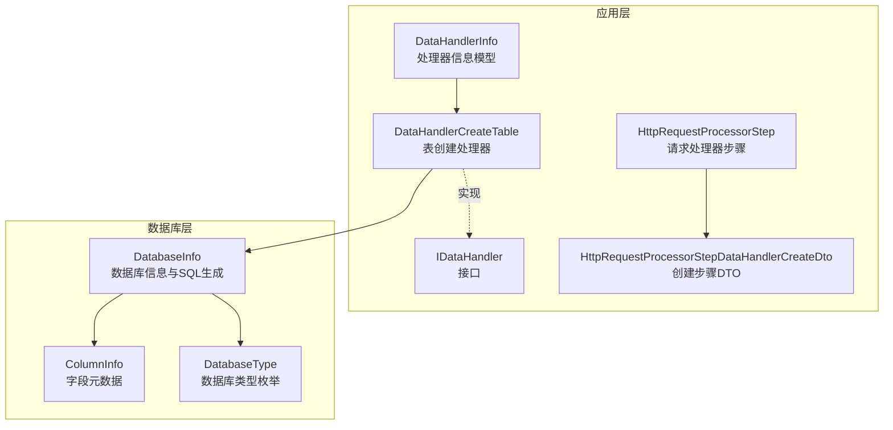
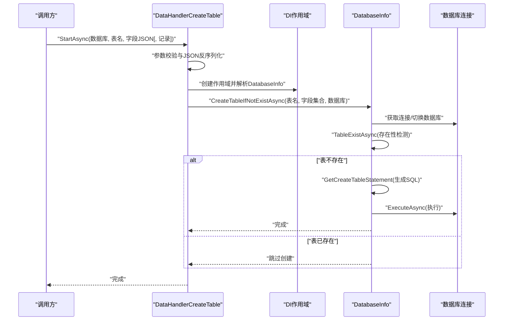
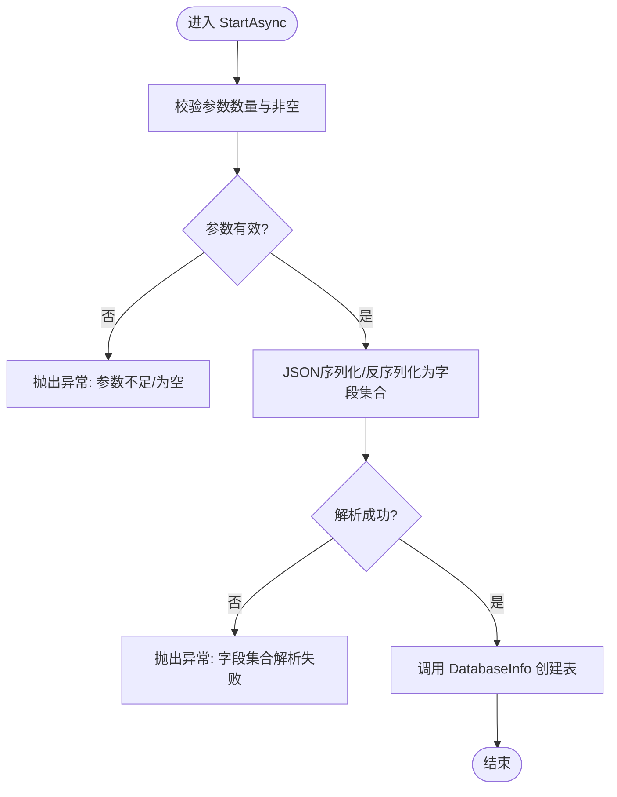
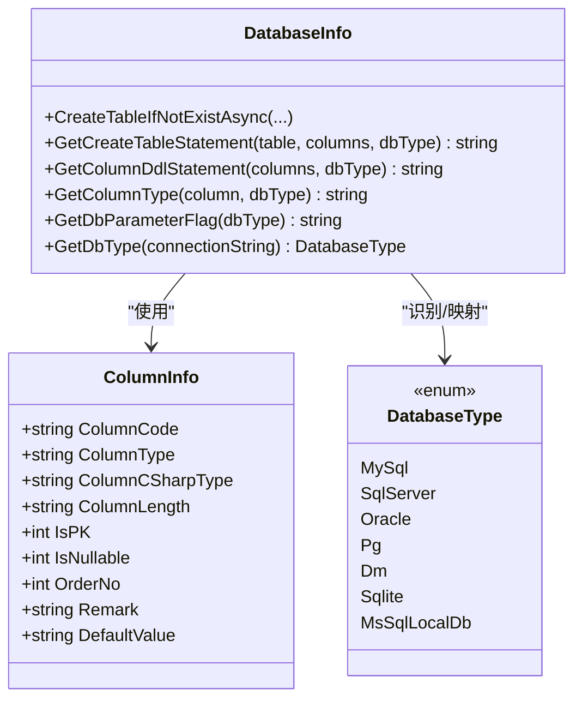
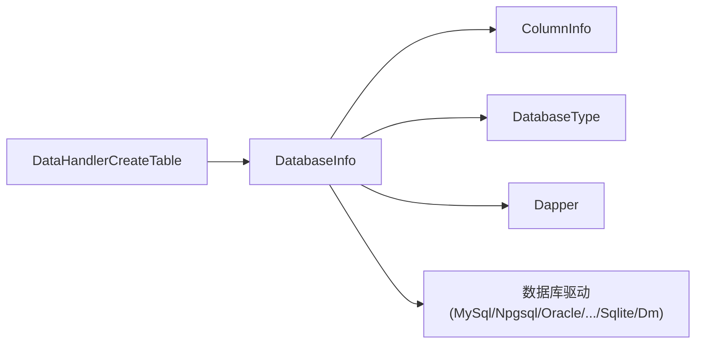

# 表创建处理器

<cite>
**本文引用的文件**
- [DataHandlerCreateTable.cs](file://Sylas.RemoteTasks.App/DataHandlers/DataHandlerCreateTable.cs)
- [IDataHandler.cs](file://Sylas.RemoteTasks.App/DataHandlers/IDataHandler.cs)
- [DataHandler.cs](file://Sylas.RemoteTasks.App/DataHandlers/DataHandler.cs)
- [DatabaseInfo.cs](file://Sylas.RemoteTasks.Database/SyncBase/DatabaseInfo.cs)
- [ColumnInfo.cs](file://Sylas.RemoteTasks.Database/Dtos/ColumnInfo.cs)
- [DatabaseType.cs](file://Sylas.RemoteTasks.Database/SyncBase/DatabaseType.cs)
- [HttpRequestProcessorStepDataHandlerCreateDto.cs](file://Sylas.RemoteTasks.App/RequestProcessor/Models/Dtos/HttpRequestProcessorStepDataHandlerCreateDto.cs)
- [HttpRequestProcessorStep.cs](file://Sylas.RemoteTasks.App/RequestProcessor/Models/HttpRequestProcessorStep.cs)
- [DatabaseInfoTest.cs](file://Sylas.RemoteTasks.Test/Database/DatabaseInfoTest.cs)
- [DatabaseHelper.cs](file://Sylas.RemoteTasks.Database/DatabaseHelper.cs)
</cite>

## 目录
1. [简介](#简介)
2. [项目结构](#项目结构)
3. [核心组件](#核心组件)
4. [架构总览](#架构总览)
5. [详细组件分析](#详细组件分析)
6. [依赖关系分析](#依赖关系分析)
7. [性能考量](#性能考量)
8. [故障排查指南](#故障排查指南)
9. [结论](#结论)
10. [附录：表创建示例与最佳实践](#附录表创建示例与最佳实践)

## 简介
本文件围绕“表创建处理器”展开，系统性阐述 DataHandlerCreateTable 的表结构生成算法、字段映射机制、约束定义过程、SQL 语句生成逻辑、数据库兼容性处理与索引创建策略；并记录表创建配置参数、字段属性与默认值设置，解释表结构验证、依赖关系检查与版本迁移机制，最后给出多数据库类型的表创建示例与优化建议。

## 项目结构
DataHandlerCreateTable 位于应用层 DataHandlers 命名空间，负责接收外部参数（数据库名、表名、字段集合等），通过 DI 获取 DatabaseInfo，并调用其“若不存在则创建表”的能力。DatabaseInfo 是数据库操作的核心类，封装了跨数据库的 SQL 生成、连接管理、表存在性检测、列类型映射、参数占位符识别等能力。

图表来源
- [DataHandlerCreateTable.cs](file://Sylas.RemoteTasks.App/DataHandlers/DataHandlerCreateTable.cs#L1-L34)
- [IDataHandler.cs](file://Sylas.RemoteTasks.App/DataHandlers/IDataHandler.cs#L1-L8)
- [DataHandler.cs](file://Sylas.RemoteTasks.App/DataHandlers/DataHandler.cs#L1-L16)
- [DatabaseInfo.cs](file://Sylas.RemoteTasks.Database/SyncBase/DatabaseInfo.cs#L64-L88)
- [ColumnInfo.cs](file://Sylas.RemoteTasks.Database/Dtos/ColumnInfo.cs#L1-L55)
- [DatabaseType.cs](file://Sylas.RemoteTasks.Database/SyncBase/DatabaseType.cs#L1-L38)
- [HttpRequestProcessorStep.cs](file://Sylas.RemoteTasks.App/RequestProcessor/Models/HttpRequestProcessorStep.cs#L1-L19)
- [HttpRequestProcessorStepDataHandlerCreateDto.cs](file://Sylas.RemoteTasks.App/RequestProcessor/Models/Dtos/HttpRequestProcessorStepDataHandlerCreateDto.cs#L1-L13)

章节来源
- [DataHandlerCreateTable.cs](file://Sylas.RemoteTasks.App/DataHandlers/DataHandlerCreateTable.cs#L1-L34)
- [DatabaseInfo.cs](file://Sylas.RemoteTasks.Database/SyncBase/DatabaseInfo.cs#L64-L88)

## 核心组件
- DataHandlerCreateTable：应用层处理器，负责参数校验、JSON 反序列化、调用 DatabaseInfo 创建表。
- DatabaseInfo：核心数据库工具类，提供“若不存在则创建表”、SQL 生成、列类型映射、参数占位符识别、表存在性检测等。
- ColumnInfo：字段元数据模型，承载字段代码、类型、长度、是否主键、是否可空、排序、备注、默认值等。
- DatabaseType：数据库类型枚举，统一管理 MySQL、SqlServer、Oracle、PostgreSQL、达梦、Sqlite 等。
- IDataHandler：处理器接口，统一 StartAsync 启动入口。
- DataHandlerInfo：处理器信息模型，用于编排执行顺序与参数。
- RequestProcessor 相关模型：用于在请求处理流程中组织“创建表”步骤及其参数。

章节来源
- [DataHandlerCreateTable.cs](file://Sylas.RemoteTasks.App/DataHandlers/DataHandlerCreateTable.cs#L7-L31)
- [DatabaseInfo.cs](file://Sylas.RemoteTasks.Database/SyncBase/DatabaseInfo.cs#L744-L759)
- [ColumnInfo.cs](file://Sylas.RemoteTasks.Database/Dtos/ColumnInfo.cs#L6-L43)
- [DatabaseType.cs](file://Sylas.RemoteTasks.Database/SyncBase/DatabaseType.cs#L6-L36)
- [IDataHandler.cs](file://Sylas.RemoteTasks.App/DataHandlers/IDataHandler.cs#L3-L6)
- [DataHandler.cs](file://Sylas.RemoteTasks.App/DataHandlers/DataHandler.cs#L3-L14)
- [HttpRequestProcessorStep.cs](file://Sylas.RemoteTasks.App/RequestProcessor/Models/HttpRequestProcessorStep.cs#L3-L16)
- [HttpRequestProcessorStepDataHandlerCreateDto.cs](file://Sylas.RemoteTasks.App/RequestProcessor/Models/Dtos/HttpRequestProcessorStepDataHandlerCreateDto.cs#L3-L11)

## 架构总览
DataHandlerCreateTable 作为请求处理流程中的一个“数据处理器”，通过 DI 注入 DatabaseInfo，后者根据传入的字段集合与目标数据库类型，生成跨数据库兼容的 CREATE TABLE 语句并执行。该流程贯穿以下关键点：
- 参数校验与 JSON 反序列化
- 表存在性检测
- SQL 生成（含表名、列定义、主键、默认值、可空性）
- 数据库类型识别与参数占位符适配
- 执行与日志记录

图表来源
- [DataHandlerCreateTable.cs](file://Sylas.RemoteTasks.App/DataHandlers/DataHandlerCreateTable.cs#L17-L31)
- [DatabaseInfo.cs](file://Sylas.RemoteTasks.Database/SyncBase/DatabaseInfo.cs#L744-L759)
- [DatabaseInfo.cs](file://Sylas.RemoteTasks.Database/SyncBase/DatabaseInfo.cs#L3221-L3244)

## 详细组件分析

### DataHandlerCreateTable 表创建处理器
- 参数约定
  - 参数0：目标数据库名（可选）
  - 参数1：目标表名
  - 参数2：字段集合的 JSON 字符串（反序列化为 ColumnInfo 列表）
  - 参数3（可选）：初始记录（用于后续同步场景）
- 核心流程
  - 校验参数数量与非空
  - JSON 序列化后反序列化为字段集合
  - 调用 DatabaseInfo 的“若不存在则创建表”方法
- 错误处理
  - 参数不足或字段集合解析失败抛出异常
  - 调用链中由 DatabaseInfo 统一处理表存在性与 SQL 执行

图表来源
- [DataHandlerCreateTable.cs](file://Sylas.RemoteTasks.App/DataHandlers/DataHandlerCreateTable.cs#L17-L31)

章节来源
- [DataHandlerCreateTable.cs](file://Sylas.RemoteTasks.App/DataHandlers/DataHandlerCreateTable.cs#L17-L31)

### DatabaseInfo 表结构生成与约束定义
- 表创建入口
  - 支持多种重载：基于连接、连接字符串、另一张表结构复制等方式创建
  - 在执行前进行表存在性检测，避免重复创建
- SQL 生成总控
  - GetCreateTableStatement：根据表名、字段集合与数据库类型生成完整 CREATE TABLE 语句
  - GetColumnDdlStatement：逐列生成 DDL 片段，拼接主键声明与逗号分隔
  - GetTableStatement：按数据库类型对表名/列名进行标识符转义
- 字段映射与类型转换
  - GetColumnType：按数据库类型将 C# 类型映射为具体 SQL 类型
  - 各数据库类型映射函数：SqlServer、MySql、PostgreSQL、Oracle、达梦、Sqlite
  - 长度处理：当 ColumnLength 为空或解析失败时采用默认策略
- 约束与默认值
  - 主键：单列 int 自增主键自动附加自增定义；否则在末尾追加 PRIMARY KEY 声明
  - 可空性：IsNullable==0 或 IsPK==1 时追加 NOT NULL
  - 默认值：DefaultValue 非空时追加 DEFAULT 子句
- 数据库兼容性
  - 标识符转义：不同数据库使用不同的引号风格
  - 参数占位符：Oracle/Dm 使用冒号前缀，其他使用 @ 前缀
  - 特殊语法：如 SqlServer 的 schema 前缀、Pg/Oracle 的自增语法差异

图表来源
- [DatabaseInfo.cs](file://Sylas.RemoteTasks.Database/SyncBase/DatabaseInfo.cs#L3221-L3244)
- [DatabaseInfo.cs](file://Sylas.RemoteTasks.Database/SyncBase/DatabaseInfo.cs#L3251-L3311)
- [DatabaseInfo.cs](file://Sylas.RemoteTasks.Database/SyncBase/DatabaseInfo.cs#L3329-L3449)
- [ColumnInfo.cs](file://Sylas.RemoteTasks.Database/Dtos/ColumnInfo.cs#L6-L43)
- [DatabaseType.cs](file://Sylas.RemoteTasks.Database/SyncBase/DatabaseType.cs#L6-L36)

章节来源
- [DatabaseInfo.cs](file://Sylas.RemoteTasks.Database/SyncBase/DatabaseInfo.cs#L744-L759)
- [DatabaseInfo.cs](file://Sylas.RemoteTasks.Database/SyncBase/DatabaseInfo.cs#L3221-L3244)
- [DatabaseInfo.cs](file://Sylas.RemoteTasks.Database/SyncBase/DatabaseInfo.cs#L3251-L3311)
- [DatabaseInfo.cs](file://Sylas.RemoteTasks.Database/SyncBase/DatabaseInfo.cs#L3329-L3449)
- [ColumnInfo.cs](file://Sylas.RemoteTasks.Database/Dtos/ColumnInfo.cs#L6-L43)
- [DatabaseType.cs](file://Sylas.RemoteTasks.Database/SyncBase/DatabaseType.cs#L6-L36)

### 字段映射机制与约束定义过程
- 映射规则要点
  - C# 类型到 SQL 类型：整型、长整型、浮点、双精度、十进制、字符串、布尔、日期时间、字节数组均有明确映射
  - 长度处理：字符串类型依据 ColumnLength 选择合适长度或降级为大文本类型
  - 标识符大小写：Oracle/Dm 强制大写，Pg 强制小写，其他保持原样
- 约束生成
  - 单列 int 自增主键：根据数据库类型生成 IDENTITY/GENERATED/AUTO_INCREMENT 等
  - 复合主键：在列定义结束后追加 PRIMARY KEY 声明
  - 可空性：非空字段追加 NOT NULL
  - 默认值：非空默认值追加 DEFAULT 子句
- 索引策略
  - 当前实现主要生成主键约束；未显式生成额外索引
  - 若需索引，可在上层业务或后续步骤中扩展

章节来源
- [DatabaseInfo.cs](file://Sylas.RemoteTasks.Database/SyncBase/DatabaseInfo.cs#L3251-L3311)
- [DatabaseInfo.cs](file://Sylas.RemoteTasks.Database/SyncBase/DatabaseInfo.cs#L3312-L3328)
- [DatabaseInfo.cs](file://Sylas.RemoteTasks.Database/SyncBase/DatabaseInfo.cs#L3343-L3462)

### SQL 语句生成逻辑与数据库兼容性
- 语句模板
  - 各数据库类型分别提供 CREATE TABLE 模板，包含字符集、排序规则、引擎等（如 MySQL 的 InnoDB、utf8mb4）
  - SqlServer 添加 schema 前缀
- 参数占位符
  - Oracle/Dm 使用冒号前缀，其他使用 @ 前缀
- 连接字符串识别
  - 通过连接字符串关键字识别数据库类型，确保参数占位符与类型映射正确

章节来源
- [DatabaseInfo.cs](file://Sylas.RemoteTasks.Database/SyncBase/DatabaseInfo.cs#L3234-L3244)
- [DatabaseInfo.cs](file://Sylas.RemoteTasks.Database/SyncBase/DatabaseInfo.cs#L3511-L3524)
- [DatabaseInfo.cs](file://Sylas.RemoteTasks.Database/SyncBase/DatabaseInfo.cs#L3526-L3536)

### 表结构验证、依赖关系检查与版本迁移机制
- 表存在性检测
  - 通过异常关键词匹配判断“表不存在”异常，避免误判
- 依赖关系检查
  - 当前实现聚焦于表创建，未包含外键/索引依赖检查
- 版本迁移
  - 未提供迁移脚本生成或版本控制逻辑；可通过上层流程在创建后执行额外步骤实现

章节来源
- [DatabaseInfo.cs](file://Sylas.RemoteTasks.Database/SyncBase/DatabaseInfo.cs#L727-L736)
- [DatabaseInfo.cs](file://Sylas.RemoteTasks.Database/SyncBase/DatabaseInfo.cs#L788-L797)

### 请求处理流程中的表创建步骤
- 步骤模型
  - HttpRequestProcessorStep：包含步骤参数、请求体、数据上下文、备注、顺序号、数据处理器集合
  - HttpRequestProcessorStepDataHandlerCreateDto：描述“创建表”步骤的处理器名与参数输入
- 参数输入
  - ParametersInput：以键值对形式传递，通常包含数据库名、表名、字段 JSON 等

章节来源
- [HttpRequestProcessorStep.cs](file://Sylas.RemoteTasks.App/RequestProcessor/Models/HttpRequestProcessorStep.cs#L3-L16)
- [HttpRequestProcessorStepDataHandlerCreateDto.cs](file://Sylas.RemoteTasks.App/RequestProcessor/Models/Dtos/HttpRequestProcessorStepDataHandlerCreateDto.cs#L3-L11)

## 依赖关系分析
- 组件耦合
  - DataHandlerCreateTable 依赖 DatabaseInfo 的静态/实例方法族
  - DatabaseInfo 依赖 ColumnInfo 与 DatabaseType，同时依赖底层数据库驱动
- 外部依赖
  - Dapper 用于执行 SQL
  - 各数据库客户端驱动（MySql.Data、Npgsql、Oracle.ManagedDataAccess、Microsoft.Data.SqlClient、Microsoft.Data.Sqlite、Dm）
- 潜在循环依赖
  - 未发现直接循环依赖；各模块职责清晰

图表来源
- [DataHandlerCreateTable.cs](file://Sylas.RemoteTasks.App/DataHandlers/DataHandlerCreateTable.cs#L11-L15)
- [DatabaseInfo.cs](file://Sylas.RemoteTasks.Database/SyncBase/DatabaseInfo.cs#L150-L163)

章节来源
- [DataHandlerCreateTable.cs](file://Sylas.RemoteTasks.App/DataHandlers/DataHandlerCreateTable.cs#L11-L15)
- [DatabaseInfo.cs](file://Sylas.RemoteTasks.Database/SyncBase/DatabaseInfo.cs#L150-L163)

## 性能考量
- SQL 生成复杂度
  - 列定义遍历 O(n)，主键声明追加 O(1)，整体 O(n)
- 执行效率
  - 单次创建表的执行成本较低；批量创建需注意事务与超时设置
- 连接管理
  - 使用 using 语句确保连接释放；避免长时间持有连接
- 日志与可观测性
  - 关键路径记录 SQL 与结果，便于问题定位

[本节为通用指导，不直接分析具体文件]

## 故障排查指南
- 常见异常与定位
  - 参数不足/为空：检查调用方传参与 ParametersInput 格式
  - 字段集合解析失败：确认 JSON 结构与字段属性（ColumnCode、ColumnCSharpType、IsPK、IsNullable、DefaultValue 等）
  - 表不存在异常：确认异常关键词匹配逻辑与数据库权限
- 排查步骤
  - 打印生成的 SQL 语句，核对表名/列名标识符与类型映射
  - 检查数据库类型识别是否正确（连接字符串关键字）
  - 核对参数占位符是否与数据库类型一致

章节来源
- [DataHandlerCreateTable.cs](file://Sylas.RemoteTasks.App/DataHandlers/DataHandlerCreateTable.cs#L19-L22)
- [DatabaseInfo.cs](file://Sylas.RemoteTasks.Database/SyncBase/DatabaseInfo.cs#L727-L736)
- [DatabaseInfo.cs](file://Sylas.RemoteTasks.Database/SyncBase/DatabaseInfo.cs#L3511-L3524)

## 结论
DataHandlerCreateTable 通过简洁的参数约定与 JSON 字段集合，结合 DatabaseInfo 的跨数据库 SQL 生成能力，实现了“若不存在则创建表”的通用流程。其字段映射、约束生成与数据库兼容性处理覆盖主流数据库类型，满足多环境部署需求。建议在生产环境中配合日志与参数校验，必要时扩展索引与迁移能力以满足更复杂的表演进需求。

[本节为总结性内容，不直接分析具体文件]

## 附录：表创建示例与最佳实践

### 示例：不同数据库类型的表创建
- MySQL
  - 特性：InnoDB 引擎、utf8mb4 字符集、动态行格式
  - 适用：Web 应用、高并发读写
- SqlServer
  - 特性：支持 schema 前缀、IDENTITY 自增
  - 适用：企业级应用、强一致场景
- PostgreSQL
  - 特性：标准 SQL、自增语法、丰富类型
  - 适用：数据分析、地理信息、高扩展性
- Oracle/Dm
  - 特性：大字段类型、自增语法差异
  - 适用：金融、电信等传统行业
- Sqlite
  - 特性：轻量、无服务器
  - 适用：嵌入式、移动端、开发测试

章节来源
- [DatabaseInfo.cs](file://Sylas.RemoteTasks.Database/SyncBase/DatabaseInfo.cs#L3234-L3244)
- [DatabaseInfo.cs](file://Sylas.RemoteTasks.Database/SyncBase/DatabaseInfo.cs#L3343-L3462)

### 最佳实践
- 字段设计
  - 明确主键策略：优先单列 int 自增；复合主键需谨慎评估查询与索引成本
  - 控制字符串长度：合理设置 ColumnLength，避免过度占用存储
  - 默认值与可空性：尽量减少 NULL，明确 DefaultValue
- 兼容性
  - 使用统一的字段元数据模型（ColumnInfo），避免硬编码类型
  - 通过 DatabaseType 与 GetDbType 统一识别数据库类型
- 安全与性能
  - 使用参数化 SQL（参数占位符由 GetDbParameterFlag 识别）
  - 避免在创建表时执行大量数据导入，建议分步进行
- 可维护性
  - 记录生成的 SQL 与执行日志，便于审计与回滚
  - 如需版本迁移，建议在上层流程中引入迁移步骤或脚本生成

### 测试参考
- 跨数据库复制表的测试用例展示了字段元数据与 SQL 生成的输出，可用于验证字段映射与 SQL 生成的正确性

章节来源
- [DatabaseInfoTest.cs](file://Sylas.RemoteTasks.Test/Database/DatabaseInfoTest.cs#L129-L149)

### 从其他格式转换为表结构
- 提供了将 Oracle/SqlServer 等数据库的 CREATE TABLE 语句转换为 MySQL 语法的辅助逻辑，便于跨库迁移与兼容

章节来源
- [DatabaseHelper.cs](file://Sylas.RemoteTasks.Database/DatabaseHelper.cs#L199-L210)