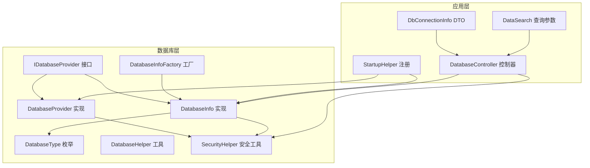
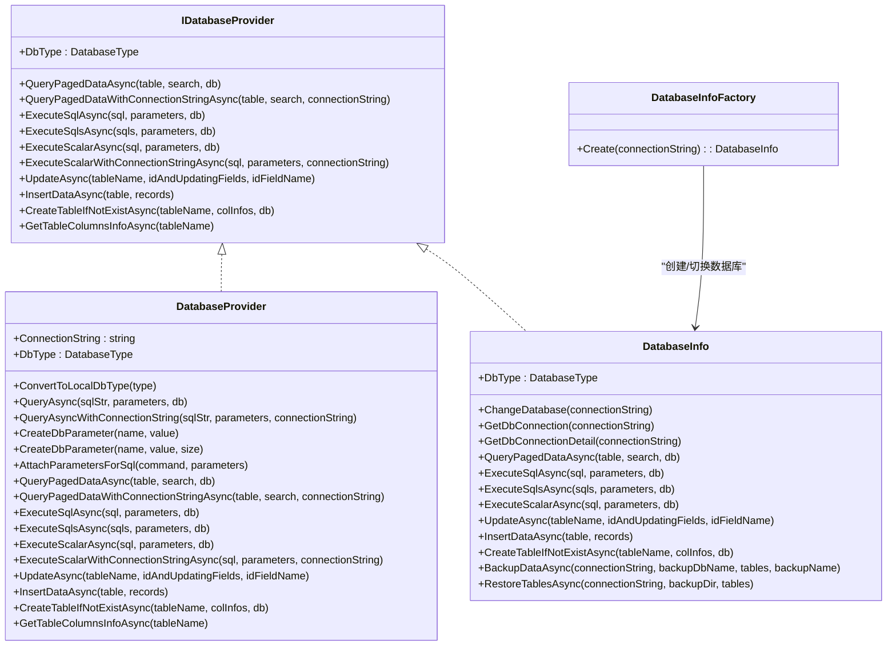
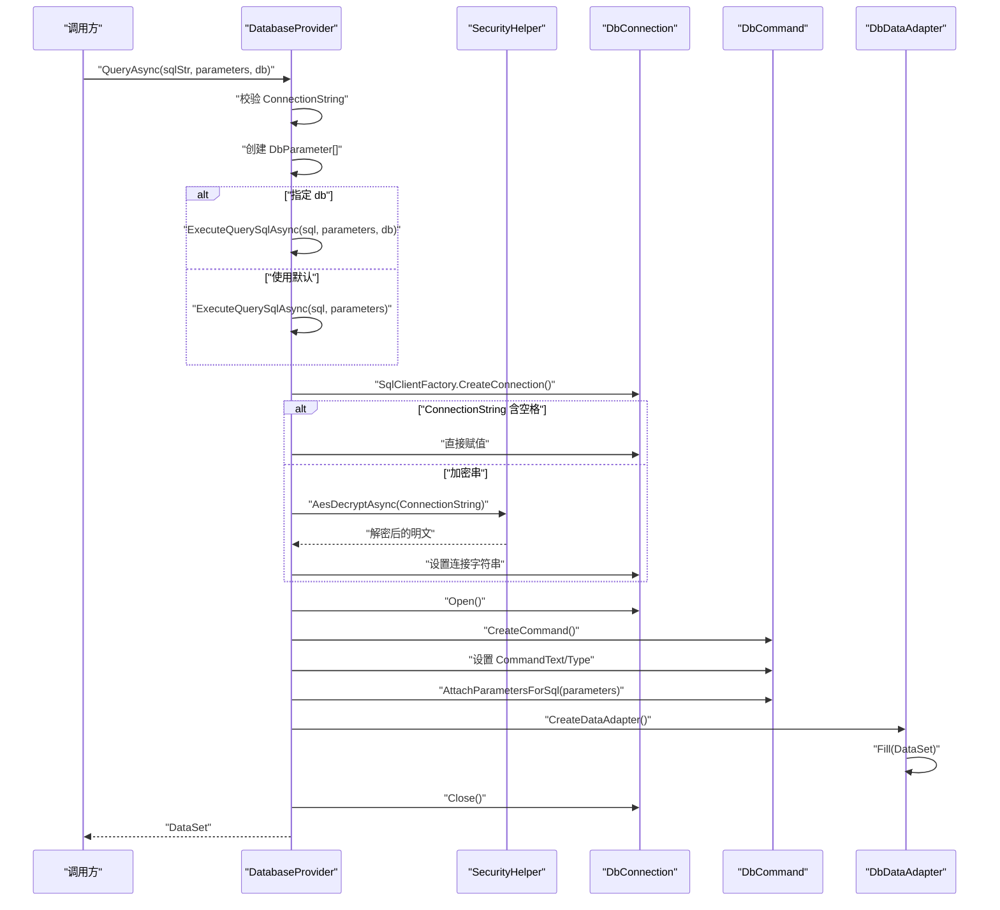
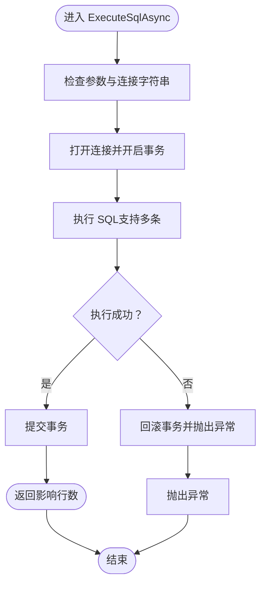
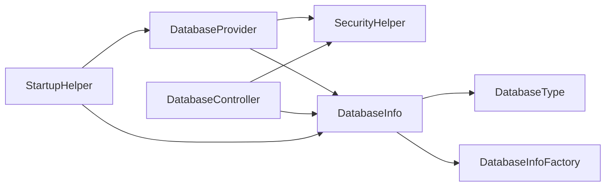

# DatabaseProvider 设计

<cite>
**本文引用的文件列表**
- [DatabaseProvider.cs](file://Sylas.RemoteTasks.Database/DatabaseProvider.cs)
- [IDatabaseProvider.cs](file://Sylas.RemoteTasks.Database/IDatabaseProvider.cs)
- [DatabaseInfo.cs](file://Sylas.RemoteTasks.Database/SyncBase/DatabaseInfo.cs)
- [DatabaseType.cs](file://Sylas.RemoteTasks.Database/SyncBase/DatabaseType.cs)
- [DatabaseHelper.cs](file://Sylas.RemoteTasks.Database/DatabaseHelper.cs)
- [SecurityHelper.cs](file://Sylas.RemoteTasks.Common/SecurityHelper.cs)
- [StartupHelper.cs](file://Sylas.RemoteTasks.App/Helpers/StartupHelper.cs)
- [DatabaseController.cs](file://Sylas.RemoteTasks.App/Controllers/DatabaseController.cs)
- [DbConnectionInfo.cs](file://Sylas.RemoteTasks.Database/Dtos/DbConnectionInfo.cs)
- [DataSearch.cs](file://Sylas.RemoteTasks.Database/SyncBase/DataSearch.cs)
</cite>

## 目录
1. [简介](#简介)
2. [项目结构](#项目结构)
3. [核心组件](#核心组件)
4. [架构总览](#架构总览)
5. [详细组件分析](#详细组件分析)
6. [依赖关系分析](#依赖关系分析)
7. [性能考量](#性能考量)
8. [故障排查指南](#故障排查指南)
9. [结论](#结论)
10. [附录](#附录)

## 简介
本文件围绕 Sylas.RemoteTasks 项目中的 DatabaseProvider 类展开，系统性阐述其接口设计、实现细节、调用关系与使用模式。重点覆盖：
- 构造函数注入与连接字符串管理
- 数据库类型检测与参数化处理
- 查询与执行方法族（QueryAsync、ExecuteSqlAsync、CreateDbParameter 等）
- 与 IDatabaseProvider 接口的关系及依赖注入注册
- 安全处理（AES 加解密）与常见问题解决方案
- 适合初学者入门与资深开发者深入的技术细节

## 项目结构
DatabaseProvider 所属模块位于 Sylas.RemoteTasks.Database，主要文件包括：
- 接口定义：IDatabaseProvider
- 实现类：DatabaseProvider
- 数据库信息与工厂：DatabaseInfo、DatabaseInfoFactory
- 数据库类型枚举：DatabaseType
- 辅助工具：DatabaseHelper、SecurityHelper
- 控制器与依赖注入示例：StartupHelper、DatabaseController
- DTO：DbConnectionInfo、DataSearch

图表来源
- [IDatabaseProvider.cs](file://Sylas.RemoteTasks.Database/IDatabaseProvider.cs#L1-L99)
- [DatabaseProvider.cs](file://Sylas.RemoteTasks.Database/DatabaseProvider.cs#L1-L485)
- [DatabaseInfo.cs](file://Sylas.RemoteTasks.Database/SyncBase/DatabaseInfo.cs#L1-L1200)
- [DatabaseType.cs](file://Sylas.RemoteTasks.Database/SyncBase/DatabaseType.cs#L1-L38)
- [DatabaseHelper.cs](file://Sylas.RemoteTasks.Database/DatabaseHelper.cs#L1-L245)
- [SecurityHelper.cs](file://Sylas.RemoteTasks.Common/SecurityHelper.cs#L1-L228)
- [StartupHelper.cs](file://Sylas.RemoteTasks.App/Helpers/StartupHelper.cs#L39-L54)
- [DatabaseController.cs](file://Sylas.RemoteTasks.App/Controllers/DatabaseController.cs#L1-L235)
- [DbConnectionInfo.cs](file://Sylas.RemoteTasks.Database/Dtos/DbConnectionInfo.cs#L1-L34)
- [DataSearch.cs](file://Sylas.RemoteTasks.Database/SyncBase/DataSearch.cs#L1-L49)

章节来源
- [DatabaseProvider.cs](file://Sylas.RemoteTasks.Database/DatabaseProvider.cs#L1-L485)
- [IDatabaseProvider.cs](file://Sylas.RemoteTasks.Database/IDatabaseProvider.cs#L1-L99)

## 核心组件
- IDatabaseProvider：定义数据库操作契约，涵盖分页查询、执行 SQL、动态更新/插入、建表等。
- DatabaseProvider：面向 SQL Server 的具体实现，提供基于 DbConnection/DbCommand 的查询与执行能力，并内置参数化与连接字符串管理。
- DatabaseInfo：更通用的数据库操作实现，支持多种数据库类型（MySql、SqlServer、Oracle、Pg、Sqlite、Dm），并提供工厂模式创建实例。
- DatabaseType：统一的数据库类型枚举，用于类型检测与参数占位符生成。
- SecurityHelper：提供 AES 加解密能力，用于连接字符串的安全存储与运行时解密。
- StartupHelper：演示如何在依赖注入容器中注册 IDatabaseProvider 与 DatabaseInfo。
- DatabaseController：展示连接字符串的加密入库、解密使用与备份/还原流程。

章节来源
- [IDatabaseProvider.cs](file://Sylas.RemoteTasks.Database/IDatabaseProvider.cs#L1-L99)
- [DatabaseProvider.cs](file://Sylas.RemoteTasks.Database/DatabaseProvider.cs#L1-L485)
- [DatabaseInfo.cs](file://Sylas.RemoteTasks.Database/SyncBase/DatabaseInfo.cs#L1-L1200)
- [DatabaseType.cs](file://Sylas.RemoteTasks.Database/SyncBase/DatabaseType.cs#L1-L38)
- [SecurityHelper.cs](file://Sylas.RemoteTasks.Common/SecurityHelper.cs#L1-L228)
- [StartupHelper.cs](file://Sylas.RemoteTasks.App/Helpers/StartupHelper.cs#L39-L54)
- [DatabaseController.cs](file://Sylas.RemoteTasks.App/Controllers/DatabaseController.cs#L1-L235)

## 架构总览
DatabaseProvider 与 DatabaseInfo 均实现 IDatabaseProvider 接口，形成“接口统一 + 多实现”的架构：
- DatabaseProvider：聚焦 SQL Server，简化参数化与连接管理。
- DatabaseInfo：多数据库支持，提供工厂与连接字符串解析、事务封装、批量操作等。

图表来源
- [IDatabaseProvider.cs](file://Sylas.RemoteTasks.Database/IDatabaseProvider.cs#L1-L99)
- [DatabaseProvider.cs](file://Sylas.RemoteTasks.Database/DatabaseProvider.cs#L1-L485)
- [DatabaseInfo.cs](file://Sylas.RemoteTasks.Database/SyncBase/DatabaseInfo.cs#L1-L1200)
- [DatabaseInfo.cs](file://Sylas.RemoteTasks.Database/SyncBase/DatabaseInfo.cs#L36-L58)

## 详细组件分析

### 接口与实现关系
- IDatabaseProvider 统一定义了数据库操作契约，确保 DatabaseProvider 与 DatabaseInfo 在使用上的一致性。
- DatabaseProvider 作为 SQL Server 专用实现，提供更贴近 SqlClient 的便捷方法；DatabaseInfo 支持多数据库，内部封装连接与参数差异。

章节来源
- [IDatabaseProvider.cs](file://Sylas.RemoteTasks.Database/IDatabaseProvider.cs#L1-L99)
- [DatabaseProvider.cs](file://Sylas.RemoteTasks.Database/DatabaseProvider.cs#L19-L485)
- [DatabaseInfo.cs](file://Sylas.RemoteTasks.Database/SyncBase/DatabaseInfo.cs#L64-L88)

### 构造函数注入与连接字符串管理
- 构造函数注入 IConfiguration，优先从配置中读取名为 “Default” 的连接字符串，若存在则赋给 ConnectionString 属性。
- 运行时若发现 ConnectionString 中不含空格，认为是加密串，调用 SecurityHelper.AesDecryptAsync 解密后用于连接。
- 支持临时覆盖 ConnectionString 的方法（如 QueryAsyncWithConnectionString、QueryPagedDataWithConnectionStringAsync），便于按需切换目标数据库。

章节来源
- [DatabaseProvider.cs](file://Sylas.RemoteTasks.Database/DatabaseProvider.cs#L25-L33)
- [DatabaseProvider.cs](file://Sylas.RemoteTasks.Database/DatabaseProvider.cs#L234-L237)
- [DatabaseProvider.cs](file://Sylas.RemoteTasks.Database/DatabaseProvider.cs#L201-L216)
- [DatabaseProvider.cs](file://Sylas.RemoteTasks.Database/DatabaseProvider.cs#L378-L387)
- [SecurityHelper.cs](file://Sylas.RemoteTasks.Common/SecurityHelper.cs#L53-L59)

### 数据库类型检测
- DbType 属性通过 DatabaseInfo.GetDbType(ConnectionString) 推断数据库类型，用于后续参数占位符与 SQL 方言适配。
- DatabaseHelper 也提供基于连接字符串片段的简单判断逻辑，但 DatabaseProvider 主要依赖 DatabaseInfo 的类型推断。

章节来源
- [DatabaseProvider.cs](file://Sylas.RemoteTasks.Database/DatabaseProvider.cs#L37-L37)
- [DatabaseInfo.cs](file://Sylas.RemoteTasks.Database/SyncBase/DatabaseInfo.cs#L150-L163)
- [DatabaseHelper.cs](file://Sylas.RemoteTasks.Database/DatabaseHelper.cs#L211-L224)

### 参数化与类型映射
- ConvertToLocalDbType：将 C# 类型映射为 SqlDbType，用于 CreateDbParameter 的类型设定。
- CreateDbParameter：重载方法支持无尺寸与带尺寸的字符串参数，自动处理 DBNull.Value 与 Direction。
- AttachParametersForSql：直接附加参数至 DbCommand，避免重复创建。

章节来源
- [DatabaseProvider.cs](file://Sylas.RemoteTasks.Database/DatabaseProvider.cs#L52-L72)
- [DatabaseProvider.cs](file://Sylas.RemoteTasks.Database/DatabaseProvider.cs#L266-L311)
- [DatabaseProvider.cs](file://Sylas.RemoteTasks.Database/DatabaseProvider.cs#L318-L327)

### 查询与执行方法族
- QueryAsync：支持按 db 或 connectionString 切换数据库，内部将 Dictionary<string, object?> 转换为 DbParameter[]。
- QueryAsyncWithConnectionString：临时覆盖 ConnectionString 后执行查询。
- ExecuteSqlAsync/ExecuteSqlsAsync/ExecuteScalarAsync：分别返回影响行数或标量值，支持事务封装与多 SQL 批处理。
- QueryPagedDataAsync/QueryPagedDataWithConnectionStringAsync：基于 DatabaseInfo.GetPagedSql 生成分页 SQL，返回 PagedData<T>。

章节来源
- [DatabaseProvider.cs](file://Sylas.RemoteTasks.Database/DatabaseProvider.cs#L177-L192)
- [DatabaseProvider.cs](file://Sylas.RemoteTasks.Database/DatabaseProvider.cs#L201-L216)
- [DatabaseProvider.cs](file://Sylas.RemoteTasks.Database/DatabaseProvider.cs#L395-L440)
- [DatabaseProvider.cs](file://Sylas.RemoteTasks.Database/DatabaseProvider.cs#L337-L387)

### 动态更新/插入/建表/列信息
- UpdateAsync：委托 DatabaseInfo.UpdateAsync 完成动态更新，自动识别主键并追加更新时间字段。
- InsertDataAsync：批量插入记录。
- CreateTableIfNotExistAsync：根据列信息创建表（若不存在）。
- GetTableColumnsInfoAsync：获取表列元信息。

章节来源
- [DatabaseProvider.cs](file://Sylas.RemoteTasks.Database/DatabaseProvider.cs#L450-L483)
- [DatabaseInfo.cs](file://Sylas.RemoteTasks.Database/SyncBase/DatabaseInfo.cs#L497-L504)
- [DatabaseInfo.cs](file://Sylas.RemoteTasks.Database/SyncBase/DatabaseInfo.cs#L720-L725)
- [DatabaseInfo.cs](file://Sylas.RemoteTasks.Database/SyncBase/DatabaseInfo.cs#L744-L759)
- [DatabaseInfo.cs](file://Sylas.RemoteTasks.Database/SyncBase/DatabaseInfo.cs#L806-L853)

### 依赖注入与使用模式
- 在 StartupHelper 中注册：
  - AddScoped<IDatabaseProvider, DatabaseProvider>()：将 DatabaseProvider 作为 IDatabaseProvider 注入。
  - AddScoped<DatabaseInfo>() 与 AddSingleton<DatabaseInfoFactory>()：提供多数据库支持与工厂模式。
- 控制器中可直接注入 IDatabaseProvider 或 DatabaseInfo 使用，或通过工厂创建新实例。

章节来源
- [StartupHelper.cs](file://Sylas.RemoteTasks.App/Helpers/StartupHelper.cs#L39-L54)
- [DatabaseController.cs](file://Sylas.RemoteTasks.App/Controllers/DatabaseController.cs#L1-L235)

### 安全处理与连接字符串生命周期
- 存储阶段：控制器在入库前对连接字符串进行 AES 加密。
- 运行阶段：DatabaseProvider 在连接前判断是否加密，若加密则解密后再建立连接。
- 还原阶段：控制器从存储中解密连接字符串，再交由 DatabaseInfo.RestoreTablesAsync 使用。

章节来源
- [DatabaseController.cs](file://Sylas.RemoteTasks.App/Controllers/DatabaseController.cs#L49-L54)
- [DatabaseController.cs](file://Sylas.RemoteTasks.App/Controllers/DatabaseController.cs#L67-L70)
- [DatabaseController.cs](file://Sylas.RemoteTasks.App/Controllers/DatabaseController.cs#L122-L122)
- [DatabaseController.cs](file://Sylas.RemoteTasks.App/Controllers/DatabaseController.cs#L222-L222)
- [SecurityHelper.cs](file://Sylas.RemoteTasks.Common/SecurityHelper.cs#L36-L60)

### 关键流程图：QueryAsync 执行路径

图表来源
- [DatabaseProvider.cs](file://Sylas.RemoteTasks.Database/DatabaseProvider.cs#L177-L258)
- [SecurityHelper.cs](file://Sylas.RemoteTasks.Common/SecurityHelper.cs#L53-L59)

### 关键流程图：ExecuteSqlAsync 事务执行

图表来源
- [DatabaseProvider.cs](file://Sylas.RemoteTasks.Database/DatabaseProvider.cs#L395-L416)
- [DatabaseInfo.cs](file://Sylas.RemoteTasks.Database/SyncBase/DatabaseInfo.cs#L372-L400)

## 依赖关系分析
- DatabaseProvider 依赖：
  - IConfiguration：读取默认连接字符串
  - SecurityHelper：解密连接字符串
  - System.Data.SqlClient/DbConnection/DbCommand：底层数据库访问
  - DatabaseInfo：部分功能委托（如动态更新、建表、列信息）
- DatabaseInfo 依赖：
  - 多种数据库驱动（MySql、Oracle、Pg、Sqlite、Dm）
  - Dapper：轻量 ORM 支持
  - DatabaseType：类型检测
  - DatabaseInfoFactory：工厂模式创建实例
- 控制器依赖：
  - SecurityHelper：加密/解密连接字符串
  - DatabaseInfo：备份/还原

图表来源
- [DatabaseProvider.cs](file://Sylas.RemoteTasks.Database/DatabaseProvider.cs#L1-L485)
- [DatabaseInfo.cs](file://Sylas.RemoteTasks.Database/SyncBase/DatabaseInfo.cs#L1-L1200)
- [DatabaseType.cs](file://Sylas.RemoteTasks.Database/SyncBase/DatabaseType.cs#L1-L38)
- [StartupHelper.cs](file://Sylas.RemoteTasks.App/Helpers/StartupHelper.cs#L39-L54)
- [DatabaseController.cs](file://Sylas.RemoteTasks.App/Controllers/DatabaseController.cs#L1-L235)

## 性能考量
- 参数化查询：统一使用 DbParameter/AttachParametersForSql，避免拼接 SQL，降低注入风险并提升缓存命中率。
- 连接池与事务：DatabaseInfo 在执行 SQL 时使用连接与事务封装，减少连接开销并保证一致性。
- 分页查询：DatabaseInfo 通过 GetPagedSql 生成分页 SQL，先查总数再查数据，避免一次性加载大量数据。
- 批量写入：DatabaseInfo 支持批量插入与还原，按批次处理，减少内存占用与网络往返。
- 加密解密：仅在必要时进行 AES 解密，避免频繁 IO。

[本节为通用性能建议，不直接分析具体文件]

## 故障排查指南
- 连接字符串为空
  - 现象：抛出“未指定需要连接的数据库: 数据库连接配置 Default 为空”
  - 处理：确保 appsettings.json 中存在名为 “Default” 的连接字符串，或在调用时显式传入 connectionString
  - 参考
    - [DatabaseProvider.cs](file://Sylas.RemoteTasks.Database/DatabaseProvider.cs#L179-L182)
    - [DatabaseProvider.cs](file://Sylas.RemoteTasks.Database/DatabaseProvider.cs#L203-L206)
- 连接字符串加密格式错误
  - 现象：解密失败或连接失败
  - 处理：确认存储的连接字符串确为 AES 加密，且密钥一致；运行时通过 SecurityHelper.AesDecryptAsync 正常解密
  - 参考
    - [DatabaseProvider.cs](file://Sylas.RemoteTasks.Database/DatabaseProvider.cs#L234-L237)
    - [SecurityHelper.cs](file://Sylas.RemoteTasks.Common/SecurityHelper.cs#L53-L59)
- 数据库类型不匹配
  - 现象：参数占位符或 SQL 方言不兼容
  - 处理：确保 ConnectionString 正确，DbType 由 DatabaseInfo.GetDbType 自动推断；如需多数据库，请使用 DatabaseInfo
  - 参考
    - [DatabaseProvider.cs](file://Sylas.RemoteTasks.Database/DatabaseProvider.cs#L37-L37)
    - [DatabaseInfo.cs](file://Sylas.RemoteTasks.Database/SyncBase/DatabaseInfo.cs#L150-L163)
- 参数类型映射异常
  - 现象：参数类型与数据库不匹配
  - 处理：使用 CreateDbParameter 的重载方法，确保 SqlDbType 映射正确；字符串参数建议指定 size
  - 参考
    - [DatabaseProvider.cs](file://Sylas.RemoteTasks.Database/DatabaseProvider.cs#L52-L72)
    - [DatabaseProvider.cs](file://Sylas.RemoteTasks.Database/DatabaseProvider.cs#L292-L311)
- 事务未提交或回滚
  - 现象：执行 SQL 后无变更或异常
  - 处理：检查 ExecuteSqlAsync/ExecuteSqlsAsync 是否在异常时触发回滚；确保事务包裹范围正确
  - 参考
    - [DatabaseProvider.cs](file://Sylas.RemoteTasks.Database/DatabaseProvider.cs#L395-L416)
    - [DatabaseInfo.cs](file://Sylas.RemoteTasks.Database/SyncBase/DatabaseInfo.cs#L372-L400)

## 结论
DatabaseProvider 通过清晰的接口设计与完善的参数化机制，提供了稳定可靠的 SQL Server 数据库访问能力；配合 DatabaseInfo 的多数据库支持与工厂模式，满足复杂场景下的扩展需求。结合安全工具与依赖注入实践，既保证了安全性，又提升了可维护性与可测试性。

[本节为总结性内容，不直接分析具体文件]

## 附录

### 方法清单与参数说明（来自接口定义）
- QueryPagedDataAsync<T>
  - 参数：table、search、db
  - 返回：PagedData<T>
  - 参考
    - [IDatabaseProvider.cs](file://Sylas.RemoteTasks.Database/IDatabaseProvider.cs#L25-L25)
- QueryPagedDataWithConnectionStringAsync<T>
  - 参数：table、search、connectionString
  - 返回：PagedData<T>
  - 参考
    - [IDatabaseProvider.cs](file://Sylas.RemoteTasks.Database/IDatabaseProvider.cs#L33-L33)
- ExecuteSqlAsync
  - 参数：sql、parameters、db
  - 返回：int（影响行数）
  - 参考
    - [IDatabaseProvider.cs](file://Sylas.RemoteTasks.Database/IDatabaseProvider.cs#L42-L42)
- ExecuteSqlsAsync
  - 参数：sqls、parameters、db
  - 返回：int（累计影响行数）
  - 参考
    - [IDatabaseProvider.cs](file://Sylas.RemoteTasks.Database/IDatabaseProvider.cs#L50-L50)
- ExecuteScalarAsync
  - 参数：sql、parameters、db
  - 返回：int（标量值）
  - 参考
    - [IDatabaseProvider.cs](file://Sylas.RemoteTasks.Database/IDatabaseProvider.cs#L58-L58)
- ExecuteScalarWithConnectionStringAsync
  - 参数：sql、parameters、connectionString
  - 返回：int（标量值）
  - 参考
    - [IDatabaseProvider.cs](file://Sylas.RemoteTasks.Database/IDatabaseProvider.cs#L66-L66)
- UpdateAsync
  - 参数：tableName、idAndUpdatingFields、idFieldName
  - 返回：bool
  - 参考
    - [IDatabaseProvider.cs](file://Sylas.RemoteTasks.Database/IDatabaseProvider.cs#L75-L75)
- InsertDataAsync
  - 参数：table、records
  - 返回：int（插入数量）
  - 参考
    - [IDatabaseProvider.cs](file://Sylas.RemoteTasks.Database/IDatabaseProvider.cs#L82-L82)
- CreateTableIfNotExistAsync
  - 参数：tableName、colInfos、db
  - 返回：Task
  - 参考
    - [IDatabaseProvider.cs](file://Sylas.RemoteTasks.Database/IDatabaseProvider.cs#L90-L90)
- GetTableColumnsInfoAsync
  - 参数：tableName
  - 返回：IEnumerable<ColumnInfo>
  - 参考
    - [IDatabaseProvider.cs](file://Sylas.RemoteTasks.Database/IDatabaseProvider.cs#L96-L96)

### 依赖注入注册示例
- 在 StartupHelper 中注册：
  - AddScoped<IDatabaseProvider, DatabaseProvider>()
  - AddScoped<DatabaseInfo>()
  - AddSingleton<DatabaseInfoFactory>()

章节来源
- [StartupHelper.cs](file://Sylas.RemoteTasks.App/Helpers/StartupHelper.cs#L39-L54)