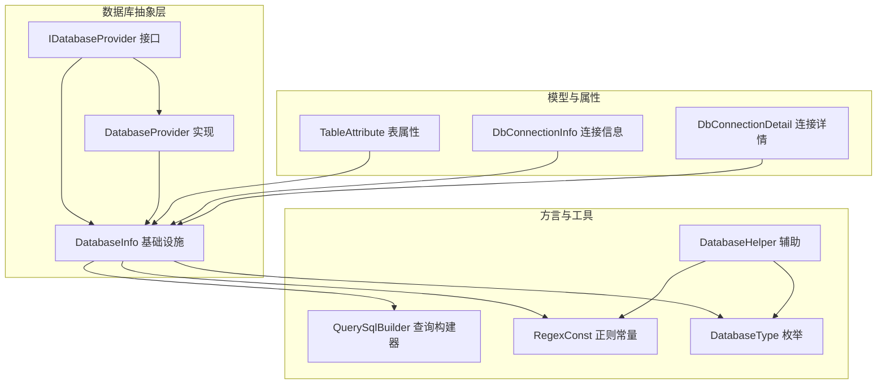
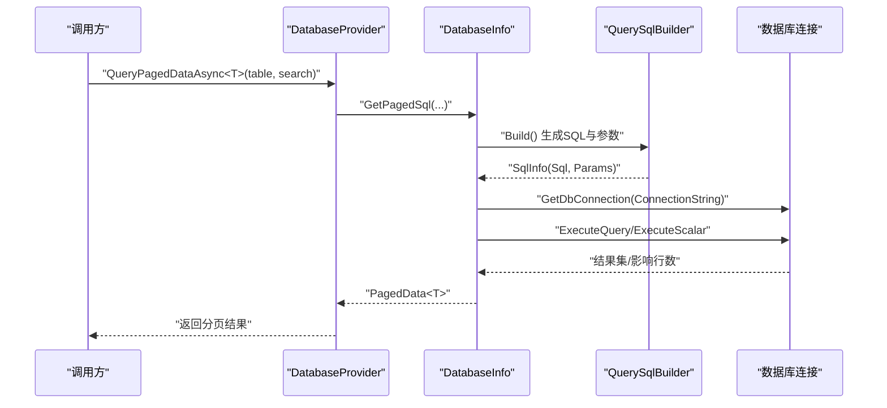
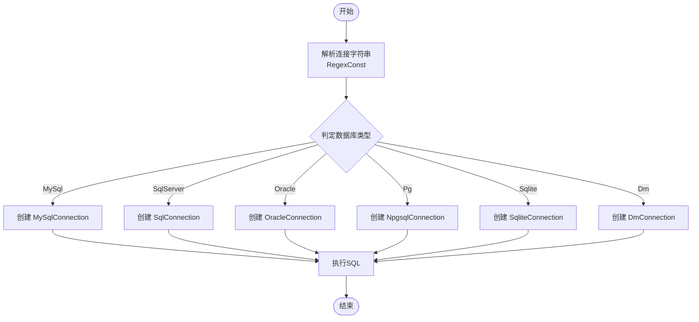
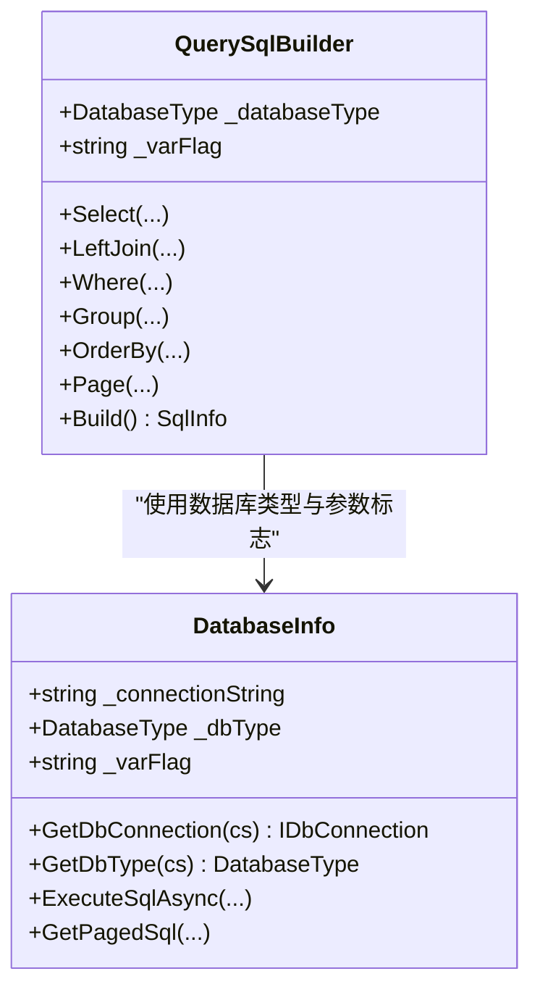
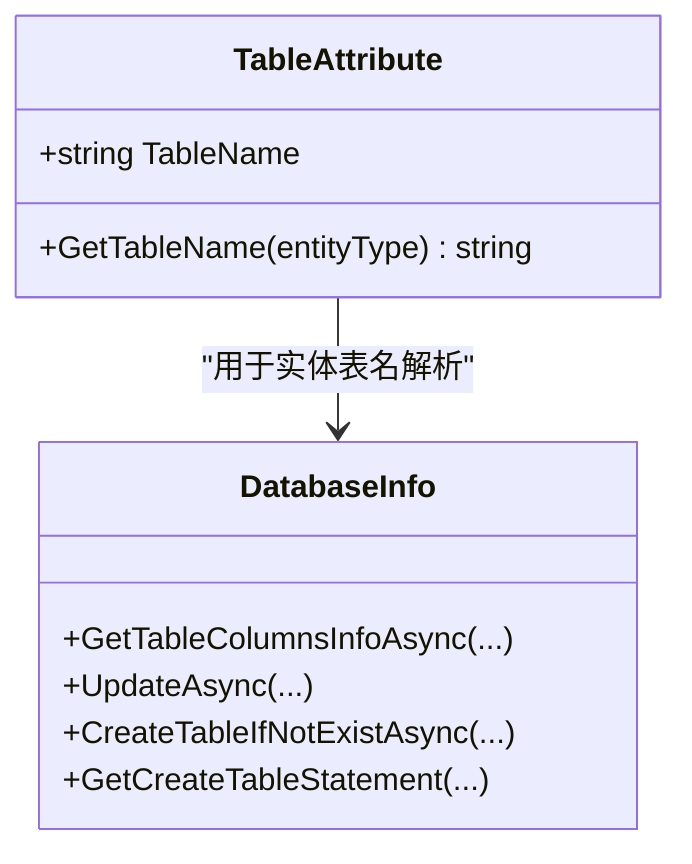
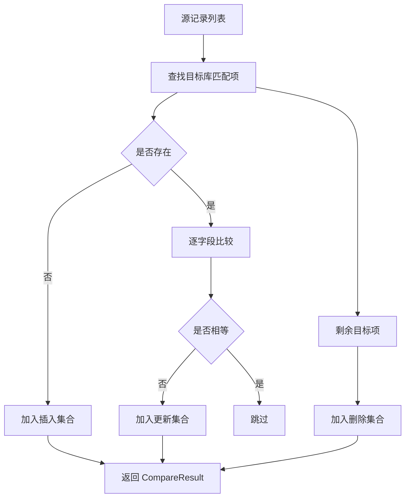
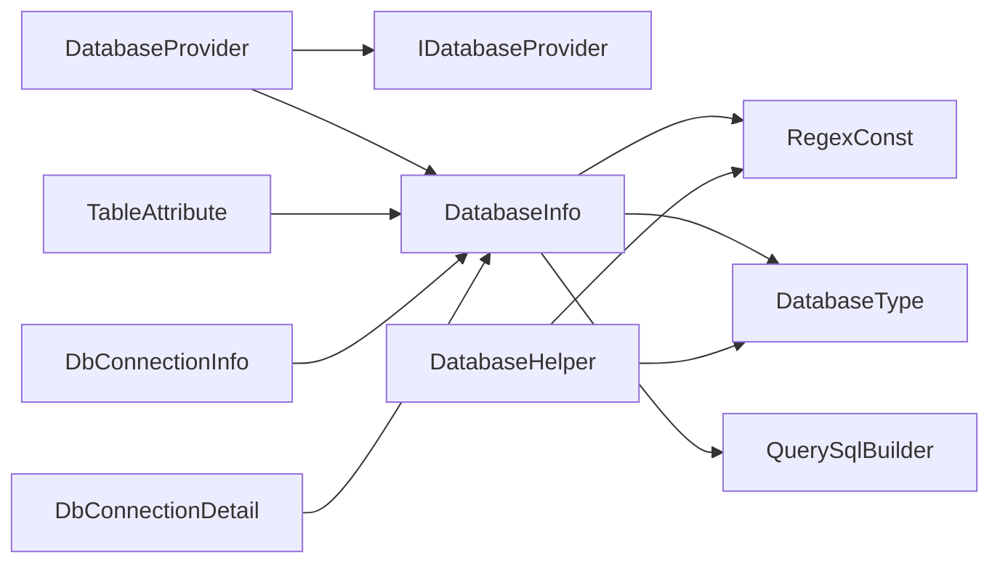

# 多数据库支持

<cite>
**本文档引用的文件**
- [DatabaseHelper.cs](file://Sylas.RemoteTasks.Database/DatabaseHelper.cs)
- [DatabaseProvider.cs](file://Sylas.RemoteTasks.Database/DatabaseProvider.cs)
- [IDatabaseProvider.cs](file://Sylas.RemoteTasks.Database/IDatabaseProvider.cs)
- [DatabaseInfo.cs](file://Sylas.RemoteTasks.Database/SyncBase/DatabaseInfo.cs)
- [DatabaseType.cs](file://Sylas.RemoteTasks.Database/SyncBase/DatabaseType.cs)
- [QuerySqlBuilder.cs](file://Sylas.RemoteTasks.Database/SyncBase/QuerySqlBuilder.cs)
- [DbConnectionDetail.cs](file://Sylas.RemoteTasks.Database/SyncBase/DbConnectionDetail.cs)
- [RegexConst.cs](file://Sylas.RemoteTasks.Common/RegexConst.cs)
- [TableAttribute.cs](file://Sylas.RemoteTasks.Database/Attributes/TableAttribute.cs)
- [DbConnectionInfo.cs](file://Sylas.RemoteTasks.Database/Dtos/DbConnectionInfo.cs)
</cite>

## 目录
1. [简介](#简介)
2. [项目结构](#项目结构)
3. [核心组件](#核心组件)
4. [架构总览](#架构总览)
5. [详细组件分析](#详细组件分析)
6. [依赖关系分析](#依赖关系分析)
7. [性能考量](#性能考量)
8. [故障排查指南](#故障排查指南)
9. [结论](#结论)
10. [附录](#附录)

## 简介
本项目提供一套跨数据库访问与兼容方案，覆盖 SQL Server、MySQL、Oracle、PostgreSQL、SQLite、达梦（DM）等主流数据库。系统通过统一的接口抽象、连接字符串解析与数据库类型检测、参数占位符适配、SQL 方言转换与分页策略、以及表属性映射与方言适配，实现“一处编写、多库运行”的能力。

## 项目结构
围绕数据库能力的关键模块分布如下：
- 接口与实现：IDatabaseProvider 定义统一能力；DatabaseProvider 作为具体实现。
- 基础设施：DatabaseInfo 提供连接管理、SQL 构建、方言适配、表结构与列信息获取等。
- 类型与枚举：DatabaseType 定义受支持的数据库类型。
- 工具与辅助：DatabaseHelper 提供连接构造、SQL 转换与数据对比等辅助功能；RegexConst 提供连接字符串解析所需的正则。
- 查询构建：QuerySqlBuilder 支持按数据库类型生成带参数占位符的 SQL 与分页子句。
- 属性映射：TableAttribute 用于实体到表名的映射；DbConnectionInfo 作为持久化连接信息的实体模型。

图表来源
- [IDatabaseProvider.cs](file://Sylas.RemoteTasks.Database/IDatabaseProvider.cs#L12-L98)
- [DatabaseProvider.cs](file://Sylas.RemoteTasks.Database/DatabaseProvider.cs#L19-L484)
- [DatabaseInfo.cs](file://Sylas.RemoteTasks.Database/SyncBase/DatabaseInfo.cs#L64-L88)
- [QuerySqlBuilder.cs](file://Sylas.RemoteTasks.Database/SyncBase/QuerySqlBuilder.cs#L11-L388)
- [RegexConst.cs](file://Sylas.RemoteTasks.Common/RegexConst.cs#L9-L127)
- [DatabaseHelper.cs](file://Sylas.RemoteTasks.Database/DatabaseHelper.cs#L20-L245)
- [DatabaseType.cs](file://Sylas.RemoteTasks.Database/SyncBase/DatabaseType.cs#L6-L37)
- [TableAttribute.cs](file://Sylas.RemoteTasks.Database/Attributes/TableAttribute.cs#L14-L31)
- [DbConnectionInfo.cs](file://Sylas.RemoteTasks.Database/Dtos/DbConnectionInfo.cs#L10-L33)
- [DbConnectionDetail.cs](file://Sylas.RemoteTasks.Database/SyncBase/DbConnectionDetail.cs#L6-L54)

章节来源
- [IDatabaseProvider.cs](file://Sylas.RemoteTasks.Database/IDatabaseProvider.cs#L12-L98)
- [DatabaseProvider.cs](file://Sylas.RemoteTasks.Database/DatabaseProvider.cs#L19-L484)
- [DatabaseInfo.cs](file://Sylas.RemoteTasks.Database/SyncBase/DatabaseInfo.cs#L64-L88)

## 核心组件
- DatabaseType：定义受支持的数据库类型（MySql、SqlServer、Oracle、Pg、Dm、Sqlite、MsSqlLocalDb）。
- IDatabaseProvider：定义统一的数据库操作契约，包括分页查询、执行 SQL、动态更新、插入、建表、列信息获取等。
- DatabaseProvider：基于 DbProviderFactory 的具体实现，负责连接字符串解密、参数绑定、事务控制、分页与统计等。
- DatabaseInfo：更通用的基础设施类，封装连接对象创建、连接字符串解析、数据库类型判定、SQL 方言转换、DDL 生成、表存在性检查、动态更新/删除等。
- QuerySqlBuilder：按数据库类型生成 SQL 语句与参数占位符，支持 LEFT JOIN、WHERE、GROUP BY/HAVING、ORDER BY 与分页。
- DatabaseHelper：提供连接构造、SQL 转换（如 Oracle 到 MySQL 的 DDL 转换）、记录对比与增删改查辅助。
- RegexConst：提供连接字符串解析所需的正则表达式集合，支持 Oracle、MySQL、SQL Server、达梦、SQLite、MsSqlLocalDb 等。
- TableAttribute：实体到表名的映射装饰器。
- DbConnectionInfo：持久化存储的连接信息实体。

章节来源
- [DatabaseType.cs](file://Sylas.RemoteTasks.Database/SyncBase/DatabaseType.cs#L6-L37)
- [IDatabaseProvider.cs](file://Sylas.RemoteTasks.Database/IDatabaseProvider.cs#L12-L98)
- [DatabaseProvider.cs](file://Sylas.RemoteTasks.Database/DatabaseProvider.cs#L19-L484)
- [DatabaseInfo.cs](file://Sylas.RemoteTasks.Database/SyncBase/DatabaseInfo.cs#L64-L88)
- [QuerySqlBuilder.cs](file://Sylas.RemoteTasks.Database/SyncBase/QuerySqlBuilder.cs#L11-L388)
- [DatabaseHelper.cs](file://Sylas.RemoteTasks.Database/DatabaseHelper.cs#L20-L245)
- [RegexConst.cs](file://Sylas.RemoteTasks.Common/RegexConst.cs#L9-L127)
- [TableAttribute.cs](file://Sylas.RemoteTasks.Database/Attributes/TableAttribute.cs#L14-L31)
- [DbConnectionInfo.cs](file://Sylas.RemoteTasks.Database/Dtos/DbConnectionInfo.cs#L10-L33)

## 架构总览
系统采用“接口抽象 + 基础设施 + 方言适配 + 查询构建器”的分层设计：
- 上层通过 IDatabaseProvider 或 DatabaseInfo 调用数据库能力。
- 中间层负责连接字符串解析、数据库类型判定、参数占位符适配与 SQL 方言转换。
- 下层使用各数据库厂商提供的连接与命令对象，结合 Dapper/ADO.NET 执行 SQL。

图表来源
- [DatabaseProvider.cs](file://Sylas.RemoteTasks.Database/DatabaseProvider.cs#L337-L370)
- [DatabaseInfo.cs](file://Sylas.RemoteTasks.Database/SyncBase/DatabaseInfo.cs#L309-L351)
- [QuerySqlBuilder.cs](file://Sylas.RemoteTasks.Database/SyncBase/QuerySqlBuilder.cs#L277-L386)

## 详细组件分析

### 数据库类型检测与连接字符串处理
- 连接字符串解析：通过 RegexConst 中的预定义正则，识别 Oracle、MySQL、SQL Server、达梦、SQLite、MsSqlLocalDb 等类型，并提取主机、端口、数据库名、账号、密码、实例名等信息。
- 数据库类型判定：DatabaseInfo.GetDbType 根据连接字符串关键字进行判定；DatabaseHelper 内部也提供简单判定逻辑。
- 连接对象创建：DatabaseInfo.GetDbConnection 根据类型返回对应连接对象；同时提供便捷方法生成 Oracle/MySQL/SQL Server 的连接对象。
- 连接字符串安全：DatabaseProvider 在执行前尝试对连接字符串进行 AES 解密，确保敏感信息的安全存储与传输。

图表来源
- [RegexConst.cs](file://Sylas.RemoteTasks.Common/RegexConst.cs#L41-L95)
- [DatabaseInfo.cs](file://Sylas.RemoteTasks.Database/SyncBase/DatabaseInfo.cs#L150-L163)
- [DatabaseInfo.cs](file://Sylas.RemoteTasks.Database/SyncBase/DatabaseInfo.cs#L210-L296)
- [DatabaseInfo.cs](file://Sylas.RemoteTasks.Database/SyncBase/DatabaseInfo.cs#L3511-L3524)

章节来源
- [RegexConst.cs](file://Sylas.RemoteTasks.Common/RegexConst.cs#L9-L127)
- [DatabaseInfo.cs](file://Sylas.RemoteTasks.Database/SyncBase/DatabaseInfo.cs#L210-L296)
- [DatabaseInfo.cs](file://Sylas.RemoteTasks.Database/SyncBase/DatabaseInfo.cs#L3511-L3524)
- [DatabaseHelper.cs](file://Sylas.RemoteTasks.Database/DatabaseHelper.cs#L211-L224)

### 参数占位符与方言适配
- 参数占位符：QuerySqlBuilder 根据数据库类型选择参数前缀（@ 或 :），并在 Oracle/DM 中将 @ 替换为 :，保证参数绑定一致性。
- 方言差异：DatabaseInfo 在执行 SQL 时对 Oracle/DM 的参数占位符进行替换；分页子句根据不同数据库类型生成 OFFSET/LIMIT/ROWNUM/ROW_NUMBER 等子句。
- 表名转义：按数据库类型对表名进行引号包裹（如方括号、反引号、双引号）。

图表来源
- [QuerySqlBuilder.cs](file://Sylas.RemoteTasks.Database/SyncBase/QuerySqlBuilder.cs#L17-L388)
- [DatabaseInfo.cs](file://Sylas.RemoteTasks.Database/SyncBase/DatabaseInfo.cs#L3511-L3524)
- [DatabaseInfo.cs](file://Sylas.RemoteTasks.Database/SyncBase/DatabaseInfo.cs#L368-L382)

章节来源
- [QuerySqlBuilder.cs](file://Sylas.RemoteTasks.Database/SyncBase/QuerySqlBuilder.cs#L17-L388)
- [DatabaseInfo.cs](file://Sylas.RemoteTasks.Database/SyncBase/DatabaseInfo.cs#L368-L382)
- [DatabaseInfo.cs](file://Sylas.RemoteTasks.Database/SyncBase/DatabaseInfo.cs#L3511-L3524)

### 表属性映射与数据库方言适配
- 表名映射：TableAttribute 提供实体到表名的映射，若未标注则默认使用类型名。
- 列信息与类型转换：DatabaseInfo 通过表列信息推导参数类型转换器，避免字符串与强类型的不一致问题；同时支持动态更新时自动追加更新时间字段。
- DDL 生成：按数据库类型生成 CREATE TABLE 语句，包含字符集、排序规则、引擎等方言特性。

图表来源
- [TableAttribute.cs](file://Sylas.RemoteTasks.Database/Attributes/TableAttribute.cs#L14-L31)
- [DatabaseInfo.cs](file://Sylas.RemoteTasks.Database/SyncBase/DatabaseInfo.cs#L515-L549)
- [DatabaseInfo.cs](file://Sylas.RemoteTasks.Database/SyncBase/DatabaseInfo.cs#L744-L759)
- [DatabaseInfo.cs](file://Sylas.RemoteTasks.Database/SyncBase/DatabaseInfo.cs#L3234-L3244)

章节来源
- [TableAttribute.cs](file://Sylas.RemoteTasks.Database/Attributes/TableAttribute.cs#L14-L31)
- [DatabaseInfo.cs](file://Sylas.RemoteTasks.Database/SyncBase/DatabaseInfo.cs#L515-L549)
- [DatabaseInfo.cs](file://Sylas.RemoteTasks.Database/SyncBase/DatabaseInfo.cs#L744-L759)
- [DatabaseInfo.cs](file://Sylas.RemoteTasks.Database/SyncBase/DatabaseInfo.cs#L3234-L3244)

### 数据同步与 SQL 转换
- 记录对比：DatabaseHelper.CompareRecordsForSyncDb 支持忽略字段、日期字段比较、动态对象比较，输出插入、更新、删除三类集合。
- DDL 转换：DatabaseHelper.ConvertCreateTableSql 将 Oracle 的 DDL 转换为 MySQL 兼容的 DDL（如类型映射、主键、索引段落处理）。
- 连接构造：提供针对 Oracle/MySQL/SQL Server 的便捷连接对象构造方法，便于快速测试与集成。

图表来源
- [DatabaseHelper.cs](file://Sylas.RemoteTasks.Database/DatabaseHelper.cs#L69-L164)
- [DatabaseHelper.cs](file://Sylas.RemoteTasks.Database/DatabaseHelper.cs#L199-L210)

章节来源
- [DatabaseHelper.cs](file://Sylas.RemoteTasks.Database/DatabaseHelper.cs#L69-L164)
- [DatabaseHelper.cs](file://Sylas.RemoteTasks.Database/DatabaseHelper.cs#L199-L210)

### 连接信息模型与持久化
- DbConnectionInfo：用于持久化存储连接信息（名称、别名、连接字符串、备注、排序），配合 TableAttribute 映射到表。
- DbConnectionDetail：解析后的连接详情（主机、端口、数据库、账号、密码、实例名、类型），便于 UI 展示与配置管理。

章节来源
- [DbConnectionInfo.cs](file://Sylas.RemoteTasks.Database/Dtos/DbConnectionInfo.cs#L10-L33)
- [DbConnectionDetail.cs](file://Sylas.RemoteTasks.Database/SyncBase/DbConnectionDetail.cs#L6-L54)

## 依赖关系分析
- DatabaseProvider 依赖 IDatabaseProvider 接口，内部委托 DatabaseInfo 完成大部分数据库操作。
- DatabaseInfo 依赖 RegexConst 进行连接字符串解析，依赖 DatabaseType 进行类型判定，依赖 QuerySqlBuilder 生成 SQL。
- DatabaseHelper 与 DatabaseInfo 协同，前者侧重连接与 SQL 转换，后者侧重通用基础设施与方言适配。
- TableAttribute 与 DbConnectionInfo 为上层业务提供表名映射与连接信息持久化能力。

图表来源
- [DatabaseProvider.cs](file://Sylas.RemoteTasks.Database/DatabaseProvider.cs#L19-L484)
- [DatabaseInfo.cs](file://Sylas.RemoteTasks.Database/SyncBase/DatabaseInfo.cs#L64-L88)
- [RegexConst.cs](file://Sylas.RemoteTasks.Common/RegexConst.cs#L9-L127)
- [DatabaseType.cs](file://Sylas.RemoteTasks.Database/SyncBase/DatabaseType.cs#L6-L37)
- [QuerySqlBuilder.cs](file://Sylas.RemoteTasks.Database/SyncBase/QuerySqlBuilder.cs#L11-L388)
- [DatabaseHelper.cs](file://Sylas.RemoteTasks.Database/DatabaseHelper.cs#L20-L245)
- [TableAttribute.cs](file://Sylas.RemoteTasks.Database/Attributes/TableAttribute.cs#L14-L31)
- [DbConnectionInfo.cs](file://Sylas.RemoteTasks.Database/Dtos/DbConnectionInfo.cs#L10-L33)
- [DbConnectionDetail.cs](file://Sylas.RemoteTasks.Database/SyncBase/DbConnectionDetail.cs#L6-L54)

章节来源
- [DatabaseProvider.cs](file://Sylas.RemoteTasks.Database/DatabaseProvider.cs#L19-L484)
- [DatabaseInfo.cs](file://Sylas.RemoteTasks.Database/SyncBase/DatabaseInfo.cs#L64-L88)

## 性能考量
- 连接池与复用：通过各数据库连接对象的内置连接池机制提升并发性能；建议在生产环境合理配置最大/最小连接数。
- 参数绑定优化：优先使用带长度的字符串参数以提高执行计划复用率（DatabaseProvider.CreateDbParameter 支持 size 参数）。
- 分页策略：QuerySqlBuilder 针对不同数据库生成最优分页子句，避免全表扫描；建议结合索引与筛选条件使用。
- 字符串转换缓存：DatabaseInfo 对表字段类型转换器进行缓存，减少重复反射与表达式编译开销。
- 连接字符串解密：仅在必要时进行解密，避免频繁 IO 与加解密成本。

## 故障排查指南
- 连接字符串解析失败：检查连接字符串格式是否符合预设正则；确认大小写与空格；可参考 RegexConst 中的模式。
- 数据库类型判定错误：核对连接字符串关键字（如 server/port/host/data source/user id 等）是否正确；必要时手动指定类型。
- 参数占位符不匹配：Oracle/DM 使用冒号前缀，确保 SQL 中使用 : 参数或在执行前进行替换；DatabaseInfo 会自动处理。
- 表不存在：CreateTableIfNotExistAsync 会自动检测并创建表；若失败，检查列定义与数据库方言差异。
- 动态更新失败：确认更新字段中包含主键或显式指定的 ID 字段；检查字段类型转换器是否正确。
- 安全与加密：确保连接字符串在存储时已加密，在运行时被正确解密；解密失败会抛出异常。

章节来源
- [RegexConst.cs](file://Sylas.RemoteTasks.Common/RegexConst.cs#L9-L127)
- [DatabaseInfo.cs](file://Sylas.RemoteTasks.Database/SyncBase/DatabaseInfo.cs#L3511-L3524)
- [DatabaseInfo.cs](file://Sylas.RemoteTasks.Database/SyncBase/DatabaseInfo.cs#L374-L377)
- [DatabaseInfo.cs](file://Sylas.RemoteTasks.Database/SyncBase/DatabaseInfo.cs#L744-L759)
- [DatabaseInfo.cs](file://Sylas.RemoteTasks.Database/SyncBase/DatabaseInfo.cs#L497-L504)

## 结论
该多数据库支持系统通过清晰的接口抽象、完善的连接字符串解析与类型判定、灵活的参数占位符与 SQL 方言适配、以及表属性映射与 DDL 生成能力，有效解决了跨数据库开发的兼容性问题。结合缓存与连接池优化，可在保证易用性的同时兼顾性能与稳定性。

## 附录
- 常见连接字符串示例（以路径代替具体值）
  - SQL Server: [连接字符串示例](file://Sylas.RemoteTasks.Database/DatabaseHelper.cs#L57-L57)
  - MySQL: [连接字符串示例](file://Sylas.RemoteTasks.Database/DatabaseHelper.cs#L47-L47)
  - Oracle: [连接字符串示例](file://Sylas.RemoteTasks.Database/DatabaseHelper.cs#L37-L37)
- 数据库类型枚举定义
  - [DatabaseType 枚举](file://Sylas.RemoteTasks.Database/SyncBase/DatabaseType.cs#L6-L37)
- 查询构建器使用要点
  - [QuerySqlBuilder 构建流程](file://Sylas.RemoteTasks.Database/SyncBase/QuerySqlBuilder.cs#L277-L386)
- 表属性映射
  - [TableAttribute 用法](file://Sylas.RemoteTasks.Database/Attributes/TableAttribute.cs#L25-L31)
- 连接信息模型
  - [DbConnectionInfo](file://Sylas.RemoteTasks.Database/Dtos/DbConnectionInfo.cs#L10-L33)
  - [DbConnectionDetail](file://Sylas.RemoteTasks.Database/SyncBase/DbConnectionDetail.cs#L6-L54)