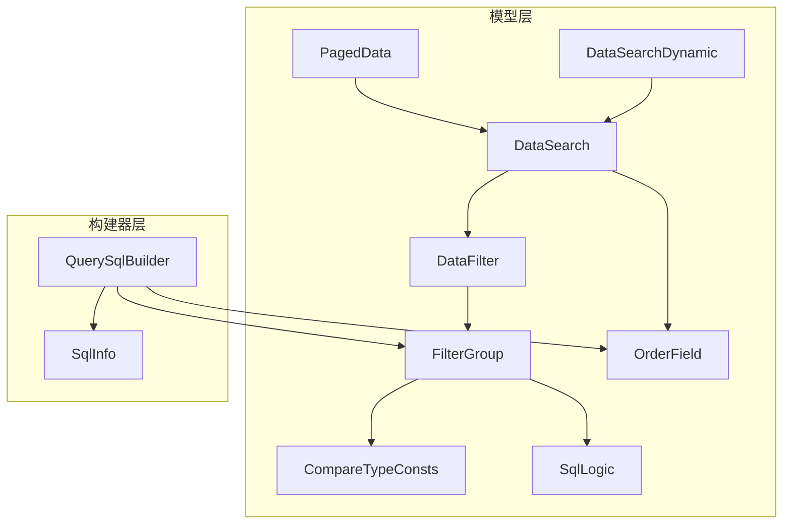
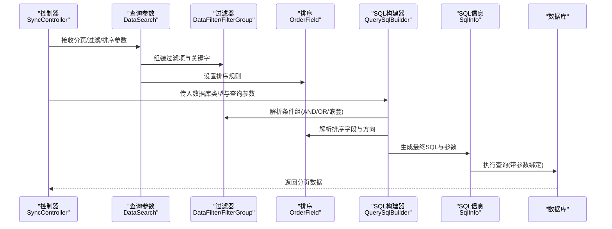
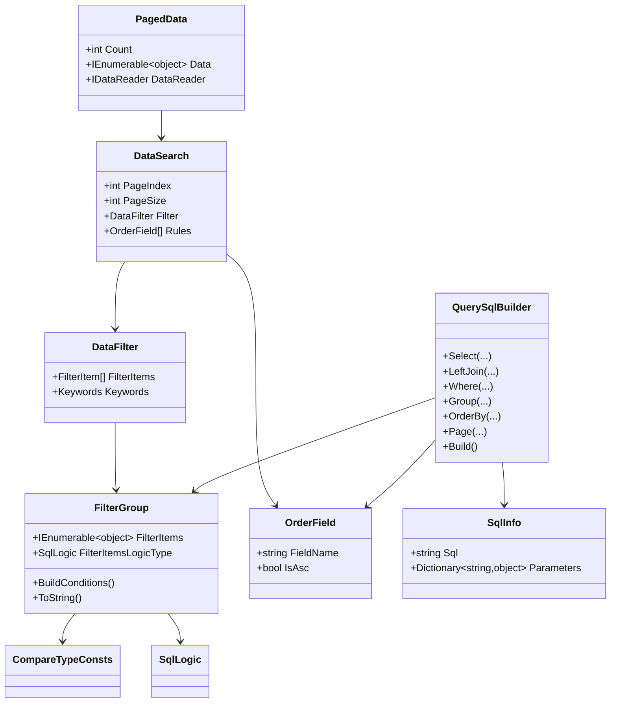
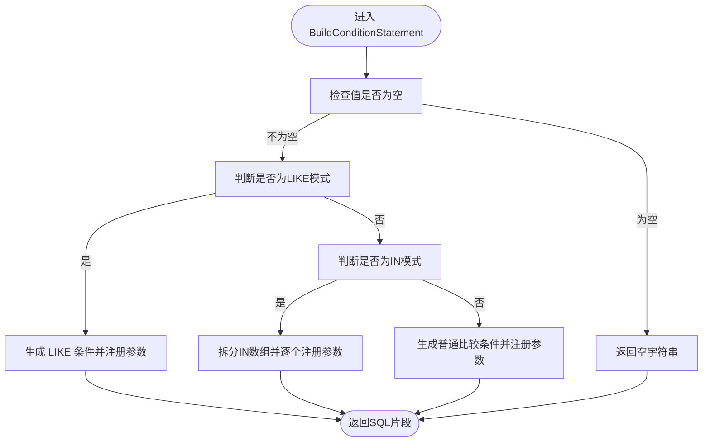
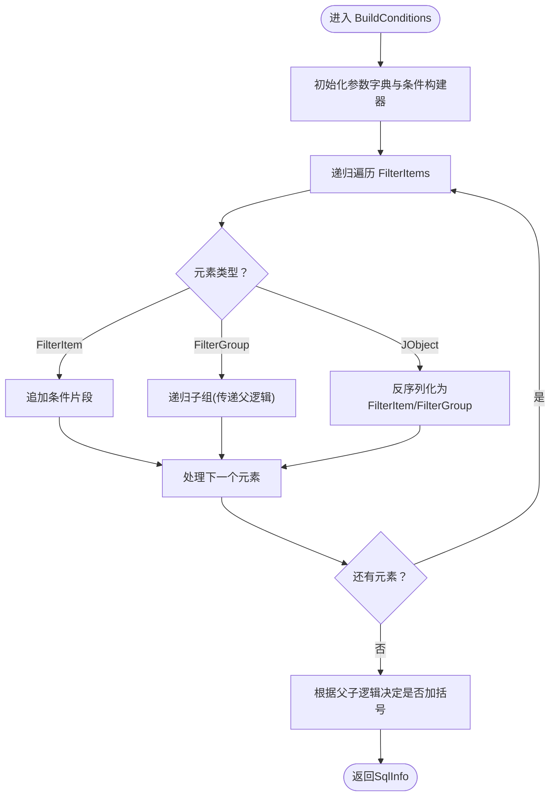
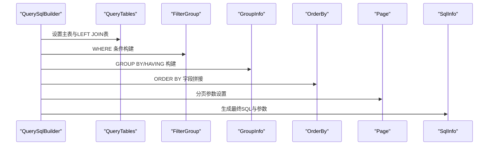

# 数据同步基类

<cite>
**本文引用的文件**
- [DataSearch.cs](file://Sylas.RemoteTasks.Database/SyncBase/DataSearch.cs)
- [DataFilter.cs](file://Sylas.RemoteTasks.Database/SyncBase/DataFilter.cs)
- [FilterGroup.cs](file://Sylas.RemoteTasks.Database/SyncBase/FilterGroup.cs)
- [OrderField.cs](file://Sylas.RemoteTasks.Database/SyncBase/OrderField.cs)
- [PagedData.cs](file://Sylas.RemoteTasks.Database/SyncBase/PagedData.cs)
- [CompareTypeConsts.cs](file://Sylas.RemoteTasks.Database/SyncBase/CompareTypeConsts.cs)
- [SqlLogic.cs](file://Sylas.RemoteTasks.Database/SyncBase/SqlLogic.cs)
- [QuerySqlBuilder.cs](file://Sylas.RemoteTasks.Database/SyncBase/QuerySqlBuilder.cs)
- [SqlInfo.cs](file://Sylas.RemoteTasks.Database/SyncBase/SqlInfo.cs)
- [DataSearchDynamic.cs](file://Sylas.RemoteTasks.Database/SyncBase/DataSearchDynamic.cs)
- [QueryConditionBuilderTest.cs](file://Sylas.RemoteTasks.Test/Database/QueryConditionBuilderTest.cs)
- [SyncController.cs](file://Sylas.RemoteTasks.App/Controllers/SyncController.cs)
</cite>

## 目录
1. [简介](#简介)
2. [项目结构](#项目结构)
3. [核心组件](#核心组件)
4. [架构总览](#架构总览)
5. [详细组件分析](#详细组件分析)
6. [依赖分析](#依赖分析)
7. [性能考虑](#性能考虑)
8. [故障排查指南](#故障排查指南)
9. [结论](#结论)
10. [附录](#附录)

## 简介
本文件围绕“数据同步基类”展开，系统性阐述数据查询、过滤与排序的建模与实现，重点覆盖以下核心类：DataSearch、DataFilter、FilterGroup、OrderField、QuerySqlBuilder、SqlInfo、PagedData、CompareTypeConsts、SqlLogic、DataSearchDynamic。文档通过代码级分析、流程图与时序图，帮助读者理解如何构建复杂查询条件、动态过滤与分页检索，以及在数据同步场景下的查询优化与最佳实践。

## 项目结构
该功能位于数据库同步子模块中，采用“模型+构建器+工具常量”的分层设计：
- 模型层：DataSearch、DataFilter、FilterGroup、OrderField、PagedData、DataSearchDynamic
- 构建器层：QuerySqlBuilder（组合上述模型，输出可执行的SQL与参数）
- 工具层：CompareTypeConsts（比较类型常量）、SqlLogic（逻辑关系枚举）、SqlInfo（SQL与参数载体）

**图表来源**
- [DataSearch.cs](file://Sylas.RemoteTasks.Database/SyncBase/DataSearch.cs#L8-L47)
- [DataFilter.cs](file://Sylas.RemoteTasks.Database/SyncBase/DataFilter.cs#L360-L370)
- [FilterGroup.cs](file://Sylas.RemoteTasks.Database/SyncBase/FilterGroup.cs#L13-L36)
- [OrderField.cs](file://Sylas.RemoteTasks.Database/SyncBase/OrderField.cs#L6-L32)
- [PagedData.cs](file://Sylas.RemoteTasks.Database/SyncBase/PagedData.cs#L10-L44)
- [DataSearchDynamic.cs](file://Sylas.RemoteTasks.Database/SyncBase/DataSearchDynamic.cs#L6-L12)
- [CompareTypeConsts.cs](file://Sylas.RemoteTasks.Database/SyncBase/CompareTypeConsts.cs#L8-L53)
- [SqlLogic.cs](file://Sylas.RemoteTasks.Database/SyncBase/SqlLogic.cs#L6-L20)
- [QuerySqlBuilder.cs](file://Sylas.RemoteTasks.Database/SyncBase/QuerySqlBuilder.cs#L11-L389)
- [SqlInfo.cs](file://Sylas.RemoteTasks.Database/SyncBase/SqlInfo.cs#L8-L37)

**章节来源**
- [DataSearch.cs](file://Sylas.RemoteTasks.Database/SyncBase/DataSearch.cs#L1-L49)
- [DataFilter.cs](file://Sylas.RemoteTasks.Database/SyncBase/DataFilter.cs#L1-L470)
- [FilterGroup.cs](file://Sylas.RemoteTasks.Database/SyncBase/FilterGroup.cs#L1-L202)
- [OrderField.cs](file://Sylas.RemoteTasks.Database/SyncBase/OrderField.cs#L1-L34)
- [PagedData.cs](file://Sylas.RemoteTasks.Database/SyncBase/PagedData.cs#L1-L46)
- [CompareTypeConsts.cs](file://Sylas.RemoteTasks.Database/SyncBase/CompareTypeConsts.cs#L1-L55)
- [SqlLogic.cs](file://Sylas.RemoteTasks.Database/SyncBase/SqlLogic.cs#L1-L22)
- [QuerySqlBuilder.cs](file://Sylas.RemoteTasks.Database/SyncBase/QuerySqlBuilder.cs#L1-L389)
- [SqlInfo.cs](file://Sylas.RemoteTasks.Database/SyncBase/SqlInfo.cs#L1-L38)
- [DataSearchDynamic.cs](file://Sylas.RemoteTasks.Database/SyncBase/DataSearchDynamic.cs#L1-L14)

## 核心组件
- DataSearch：统一承载分页、过滤、排序的查询参数入口，支持默认值与构造注入。
- DataFilter：封装过滤项集合与关键字搜索，支持多种比较类型与动态参数。
- FilterGroup：条件组，支持嵌套、AND/OR逻辑、关键字组合、JSON反序列化。
- OrderField：排序规则，字段名与升降序。
- QuerySqlBuilder：SQL构建器，串联多表、JOIN、WHERE、GROUP BY/HAVING、ORDER BY、分页。
- SqlInfo：SQL与参数的载体，便于跨层传递。
- PagedData：分页结果容器，支持泛型与非泛型版本。
- CompareTypeConsts：比较类型常量集，如大于、小于、等于、IN、包含等。
- SqlLogic：AND/OR/None 三种逻辑关系。
- DataSearchDynamic：动态查询参数扩展，增加目标表名。

**章节来源**
- [DataSearch.cs](file://Sylas.RemoteTasks.Database/SyncBase/DataSearch.cs#L8-L47)
- [DataFilter.cs](file://Sylas.RemoteTasks.Database/SyncBase/DataFilter.cs#L360-L370)
- [FilterGroup.cs](file://Sylas.RemoteTasks.Database/SyncBase/FilterGroup.cs#L13-L36)
- [OrderField.cs](file://Sylas.RemoteTasks.Database/SyncBase/OrderField.cs#L6-L32)
- [QuerySqlBuilder.cs](file://Sylas.RemoteTasks.Database/SyncBase/QuerySqlBuilder.cs#L11-L389)
- [SqlInfo.cs](file://Sylas.RemoteTasks.Database/SyncBase/SqlInfo.cs#L8-L37)
- [PagedData.cs](file://Sylas.RemoteTasks.Database/SyncBase/PagedData.cs#L10-L44)
- [CompareTypeConsts.cs](file://Sylas.RemoteTasks.Database/SyncBase/CompareTypeConsts.cs#L8-L53)
- [SqlLogic.cs](file://Sylas.RemoteTasks.Database/SyncBase/SqlLogic.cs#L6-L20)
- [DataSearchDynamic.cs](file://Sylas.RemoteTasks.Database/SyncBase/DataSearchDynamic.cs#L6-L12)

## 架构总览
下图展示了从控制器接收查询参数，到构建SQL并执行的端到端流程：

**图表来源**
- [SyncController.cs](file://Sylas.RemoteTasks.App/Controllers/SyncController.cs#L44-L49)
- [DataSearch.cs](file://Sylas.RemoteTasks.Database/SyncBase/DataSearch.cs#L24-L30)
- [DataFilter.cs](file://Sylas.RemoteTasks.Database/SyncBase/DataFilter.cs#L360-L370)
- [FilterGroup.cs](file://Sylas.RemoteTasks.Database/SyncBase/FilterGroup.cs#L67-L144)
- [OrderField.cs](file://Sylas.RemoteTasks.Database/SyncBase/OrderField.cs#L6-L32)
- [QuerySqlBuilder.cs](file://Sylas.RemoteTasks.Database/SyncBase/QuerySqlBuilder.cs#L277-L386)
- [SqlInfo.cs](file://Sylas.RemoteTasks.Database/SyncBase/SqlInfo.cs#L8-L37)

## 详细组件分析

### DataSearch：分页与查询参数入口
- 设计要点
  - 支持默认构造与带参构造；自动规范化页码与页大小。
  - 内置DataFilter与排序规则集合，默认排序项保证可用性。
- 使用建议
  - 前端传参时若缺省，构造函数会提供安全默认值，避免空指针。
  - 排序规则建议至少提供一项，防止无序返回。
- 参考路径
  - [DataSearch(int,int,DataFilter,List<OrderField>)](file://Sylas.RemoteTasks.Database/SyncBase/DataSearch.cs#L24-L30)
  - [DataSearch 属性定义](file://Sylas.RemoteTasks.Database/SyncBase/DataSearch.cs#L34-L46)

**章节来源**
- [DataSearch.cs](file://Sylas.RemoteTasks.Database/SyncBase/DataSearch.cs#L8-L47)

### DataFilter：过滤项与关键字
- 设计要点
  - FilterItem：字段名、比较类型、值；支持JsonElement自动解析、动态参数占位符、IN数组拆分、LIKE模糊匹配。
  - Keywords：关键字字段集合与值，用于快速组合OR条件。
  - DataFilter：过滤项集合与关键字组合。
- 关键算法
  - BuildConditionStatement：根据比较类型与值生成SQL片段与参数映射。
  - GetValueList：将字符串或集合转为对象数组，适配IN条件。
- 参考路径
  - [FilterItem.BuildConditionStatement](file://Sylas.RemoteTasks.Database/SyncBase/DataFilter.cs#L118-L232)
  - [FilterItem.GetValueList](file://Sylas.RemoteTasks.Database/SyncBase/DataFilter.cs#L292-L341)
  - [DataFilter 关键成员](file://Sylas.RemoteTasks.Database/SyncBase/DataFilter.cs#L360-L370)

**章节来源**
- [DataFilter.cs](file://Sylas.RemoteTasks.Database/SyncBase/DataFilter.cs#L14-L370)

### FilterGroup：条件组与逻辑
- 设计要点
  - 支持AND/OR/None三种逻辑关系，可嵌套组合。
  - AddKeywordsQuerying：便捷添加关键字OR条件组。
  - BuildConditions：递归构建SQL，自动处理括号与参数命名冲突。
  - ToString：用于LEFT JOIN ON条件的字符串化。
- 参考路径
  - [FilterGroup.BuildConditions](file://Sylas.RemoteTasks.Database/SyncBase/FilterGroup.cs#L67-L144)
  - [FilterGroup.AddKeywordsQuerying](file://Sylas.RemoteTasks.Database/SyncBase/FilterGroup.cs#L44-L60)
  - [FilterGroup.ToString](file://Sylas.RemoteTasks.Database/SyncBase/FilterGroup.cs#L149-L199)

**章节来源**
- [FilterGroup.cs](file://Sylas.RemoteTasks.Database/SyncBase/FilterGroup.cs#L13-L202)

### OrderField：排序规则
- 设计要点
  - 默认字段与默认降序，确保排序可用性。
  - 支持多字段排序，由QuerySqlBuilder拼接。
- 参考路径
  - [OrderField 定义](file://Sylas.RemoteTasks.Database/SyncBase/OrderField.cs#L6-L32)

**章节来源**
- [OrderField.cs](file://Sylas.RemoteTasks.Database/SyncBase/OrderField.cs#L1-L34)

### QuerySqlBuilder：SQL构建器
- 设计要点
  - 支持多表、LEFT JOIN、WHERE、GROUP BY/HAVING、ORDER BY、分页。
  - 参数占位符根据数据库类型切换（Oracle/DM使用冒号，其他使用@）。
  - 分页方言：MySQL/LIMIT、PostgreSQL/limit+offset、SQL Server/OFFSET/FETCH、SQLite/LIMIT/OFFSET、Oracle/ROWNUM。
- 关键流程
  - Select/LeftJoin/Where/Group/OrderBy/Page/Build：链式调用，最终生成SqlInfo。
- 参考路径
  - [QuerySqlBuilder.Build](file://Sylas.RemoteTasks.Database/SyncBase/QuerySqlBuilder.cs#L277-L386)

**章节来源**
- [QuerySqlBuilder.cs](file://Sylas.RemoteTasks.Database/SyncBase/QuerySqlBuilder.cs#L11-L389)

### SqlInfo：SQL与参数载体
- 设计要点
  - 封装最终SQL与参数字典，便于执行层绑定。
- 参考路径
  - [SqlInfo 定义](file://Sylas.RemoteTasks.Database/SyncBase/SqlInfo.cs#L8-L37)

**章节来源**
- [SqlInfo.cs](file://Sylas.RemoteTasks.Database/SyncBase/SqlInfo.cs#L1-L38)

### PagedData：分页结果
- 设计要点
  - 非泛型：Count + Data + DataReader
  - 泛型：Count + TotalPages + Data<T>
- 参考路径
  - [PagedData 定义](file://Sylas.RemoteTasks.Database/SyncBase/PagedData.cs#L10-L44)

**章节来源**
- [PagedData.cs](file://Sylas.RemoteTasks.Database/SyncBase/PagedData.cs#L1-L46)

### CompareTypeConsts 与 SqlLogic：常量与逻辑
- 设计要点
  - CompareTypeConsts：提供比较类型常量与有效性检查。
  - SqlLogic：AND/OR/None。
- 参考路径
  - [CompareTypeConsts](file://Sylas.RemoteTasks.Database/SyncBase/CompareTypeConsts.cs#L8-L53)
  - [SqlLogic](file://Sylas.RemoteTasks.Database/SyncBase/SqlLogic.cs#L6-L20)

**章节来源**
- [CompareTypeConsts.cs](file://Sylas.RemoteTasks.Database/SyncBase/CompareTypeConsts.cs#L1-L55)
- [SqlLogic.cs](file://Sylas.RemoteTasks.Database/SyncBase/SqlLogic.cs#L1-L22)

### DataSearchDynamic：动态查询扩展
- 设计要点
  - 在DataSearch基础上增加TableName，便于动态表查询。
- 参考路径
  - [DataSearchDynamic](file://Sylas.RemoteTasks.Database/SyncBase/DataSearchDynamic.cs#L6-L12)

**章节来源**
- [DataSearchDynamic.cs](file://Sylas.RemoteTasks.Database/SyncBase/DataSearchDynamic.cs#L1-L14)

## 依赖分析
- 组件耦合
  - DataSearch 依赖 DataFilter 与 OrderField。
  - DataFilter 依赖 FilterGroup、CompareTypeConsts、SqlLogic。
  - QuerySqlBuilder 依赖 FilterGroup、OrderField、SqlInfo，并根据数据库类型调整参数占位符与分页方言。
  - PagedData 作为结果容器，被控制器与仓储层消费。
- 外部依赖
  - 数据库访问通过仓储层与数据库工具类完成，构建器仅负责SQL与参数生成。

**图表来源**
- [DataSearch.cs](file://Sylas.RemoteTasks.Database/SyncBase/DataSearch.cs#L8-L47)
- [DataFilter.cs](file://Sylas.RemoteTasks.Database/SyncBase/DataFilter.cs#L360-L370)
- [FilterGroup.cs](file://Sylas.RemoteTasks.Database/SyncBase/FilterGroup.cs#L13-L36)
- [OrderField.cs](file://Sylas.RemoteTasks.Database/SyncBase/OrderField.cs#L6-L32)
- [QuerySqlBuilder.cs](file://Sylas.RemoteTasks.Database/SyncBase/QuerySqlBuilder.cs#L11-L389)
- [SqlInfo.cs](file://Sylas.RemoteTasks.Database/SyncBase/SqlInfo.cs#L8-L37)
- [PagedData.cs](file://Sylas.RemoteTasks.Database/SyncBase/PagedData.cs#L10-L44)
- [CompareTypeConsts.cs](file://Sylas.RemoteTasks.Database/SyncBase/CompareTypeConsts.cs#L8-L53)
- [SqlLogic.cs](file://Sylas.RemoteTasks.Database/SyncBase/SqlLogic.cs#L6-L20)

**章节来源**
- [DataSearch.cs](file://Sylas.RemoteTasks.Database/SyncBase/DataSearch.cs#L8-L47)
- [DataFilter.cs](file://Sylas.RemoteTasks.Database/SyncBase/DataFilter.cs#L360-L370)
- [FilterGroup.cs](file://Sylas.RemoteTasks.Database/SyncBase/FilterGroup.cs#L13-L36)
- [OrderField.cs](file://Sylas.RemoteTasks.Database/SyncBase/OrderField.cs#L6-L32)
- [QuerySqlBuilder.cs](file://Sylas.RemoteTasks.Database/SyncBase/QuerySqlBuilder.cs#L11-L389)
- [SqlInfo.cs](file://Sylas.RemoteTasks.Database/SyncBase/SqlInfo.cs#L8-L37)
- [PagedData.cs](file://Sylas.RemoteTasks.Database/SyncBase/PagedData.cs#L10-L44)
- [CompareTypeConsts.cs](file://Sylas.RemoteTasks.Database/SyncBase/CompareTypeConsts.cs#L8-L53)
- [SqlLogic.cs](file://Sylas.RemoteTasks.Database/SyncBase/SqlLogic.cs#L6-L20)

## 性能考虑
- 参数化查询
  - 所有条件均通过参数化绑定，避免SQL注入并提升缓存命中率。
- IN条件优化
  - IN数组会被拆分为多个参数，避免超长SQL与绑定参数过多导致的性能问题。
- LIKE模糊查询
  - 使用CONCAT与通配符，注意索引策略与前缀匹配优化。
- 分页与排序
  - 分页采用数据库原生分页方言，避免全量加载；排序字段应建立索引。
- 逻辑括号最小化
  - 构建器在AND/AND或顶层情况下减少不必要的括号，降低解析开销。
- 多表LEFT JOIN
  - ON条件尽量使用简单相等或可索引字段，避免复杂表达式导致全表扫描。

[本节为通用性能指导，无需特定文件引用]

## 故障排查指南
- 条件类型异常
  - 当FilterGroup遇到不支持的对象类型时会抛出异常，检查JSON反序列化字段是否正确。
  - 参考：[FilterGroup.BuildConditions 异常分支](file://Sylas.RemoteTasks.Database/SyncBase/FilterGroup.cs#L131-L133)
- 缺少联查表信息
  - LEFT JOIN时若OnConditions为空，构建器会抛出异常，检查QueryTable集合。
  - 参考：[QuerySqlBuilder.LeftJoins 校验](file://Sylas.RemoteTasks.Database/SyncBase/QuerySqlBuilder.cs#L150-L173)
- 未设置数据表
  - Build前未添加任何表会触发异常，确保至少有一个主表。
  - 参考：[QuerySqlBuilder.Build 表校验](file://Sylas.RemoteTasks.Database/SyncBase/QuerySqlBuilder.cs#L279-L282)
- 参数命名冲突
  - GROUP BY/HAVING与WHERE可能共享参数名，构建器会自动重命名避免冲突。
  - 参考：[QuerySqlBuilder.Build 参数重命名](file://Sylas.RemoteTasks.Database/SyncBase/QuerySqlBuilder.cs#L339-L355)
- 比较类型非法
  - 使用CompareTypeConsts.IsCompareType进行合法性检查，避免未知比较符。
  - 参考：[CompareTypeConsts.IsCompareType](file://Sylas.RemoteTasks.Database/SyncBase/CompareTypeConsts.cs#L49-L52)

**章节来源**
- [FilterGroup.cs](file://Sylas.RemoteTasks.Database/SyncBase/FilterGroup.cs#L131-L133)
- [QuerySqlBuilder.cs](file://Sylas.RemoteTasks.Database/SyncBase/QuerySqlBuilder.cs#L150-L173)
- [QuerySqlBuilder.cs](file://Sylas.RemoteTasks.Database/SyncBase/QuerySqlBuilder.cs#L279-L282)
- [QuerySqlBuilder.cs](file://Sylas.RemoteTasks.Database/SyncBase/QuerySqlBuilder.cs#L339-L355)
- [CompareTypeConsts.cs](file://Sylas.RemoteTasks.Database/SyncBase/CompareTypeConsts.cs#L49-L52)

## 结论
数据同步基类通过“模型+构建器+工具常量”的清晰分层，提供了可组合、可扩展、可参数化的查询能力。借助FilterGroup的嵌套逻辑与QuerySqlBuilder的链式构建，开发者可以快速组装复杂查询条件、动态过滤与分页检索。配合完善的异常处理与参数化策略，既保证了安全性也兼顾了性能与可维护性。

[本节为总结性内容，无需特定文件引用]

## 附录

### 实际使用示例与配置方法
- 控制器接收DataSearch并分页查询
  - 示例路径：[SyncController 获取处理器分页](file://Sylas.RemoteTasks.App/Controllers/SyncController.cs#L44-L49)
- 构建复杂多表查询与分页
  - 测试用例展示了多表LEFT JOIN、关键字查询、分组与排序、分页的完整流程。
  - 示例路径：
    - [QuerySqlBuilder 多表查询构建](file://Sylas.RemoteTasks.Test/Database/QueryConditionBuilderTest.cs#L124-L131)
    - [期望SQL与参数断言](file://Sylas.RemoteTasks.Test/Database/QueryConditionBuilderTest.cs#L133-L143)
- 动态查询参数
  - 使用DataSearchDynamic指定目标表名，适用于跨表同步场景。
  - 示例路径：[DataSearchDynamic](file://Sylas.RemoteTasks.Database/SyncBase/DataSearchDynamic.cs#L6-L12)

**章节来源**
- [SyncController.cs](file://Sylas.RemoteTasks.App/Controllers/SyncController.cs#L44-L49)
- [QueryConditionBuilderTest.cs](file://Sylas.RemoteTasks.Test/Database/QueryConditionBuilderTest.cs#L58-L160)
- [DataSearchDynamic.cs](file://Sylas.RemoteTasks.Database/SyncBase/DataSearchDynamic.cs#L6-L12)

### 查询流程与算法可视化
- FilterItem.BuildConditionStatement（IN/动态参数/LIKE/普通比较）

**图表来源**
- [DataFilter.cs](file://Sylas.RemoteTasks.Database/SyncBase/DataFilter.cs#L118-L232)

- FilterGroup.BuildConditions（递归构建AND/OR/嵌套）

**图表来源**
- [FilterGroup.cs](file://Sylas.RemoteTasks.Database/SyncBase/FilterGroup.cs#L67-L144)

- QuerySqlBuilder.Build（多表/JOIN/WHERE/GROUP/ORDER/PAGE）

**图表来源**
- [QuerySqlBuilder.cs](file://Sylas.RemoteTasks.Database/SyncBase/QuerySqlBuilder.cs#L277-L386)