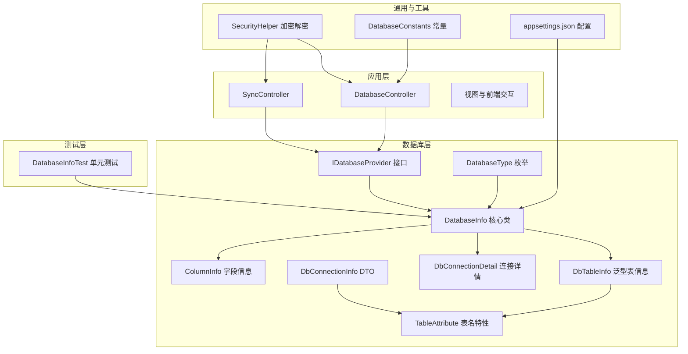
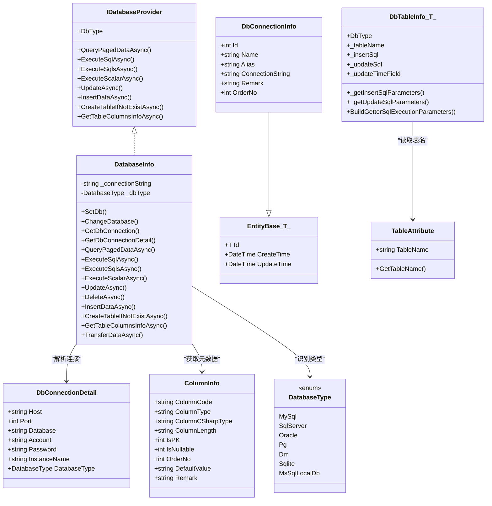
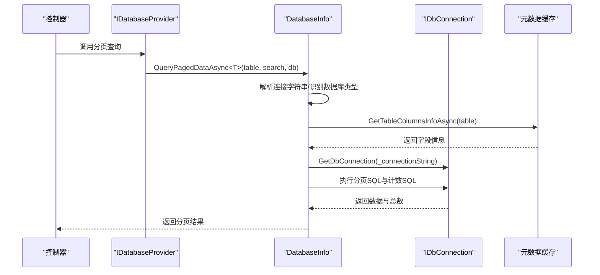
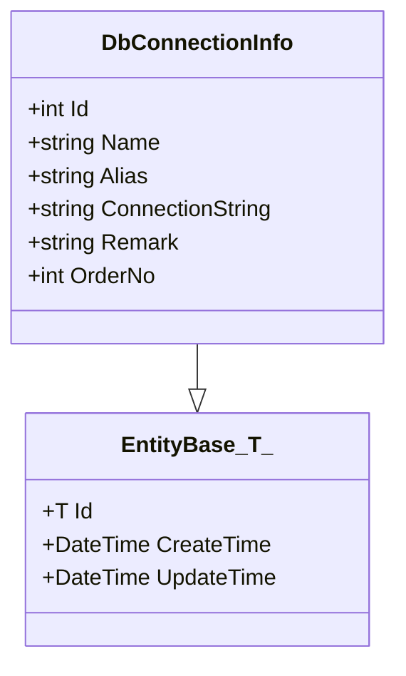
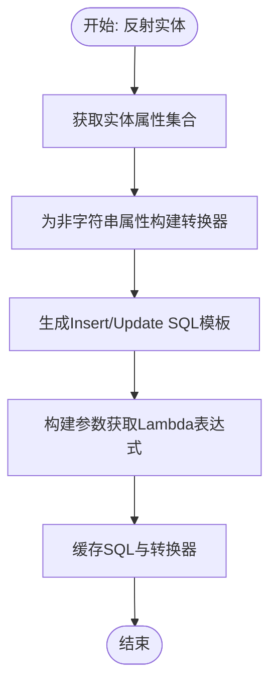
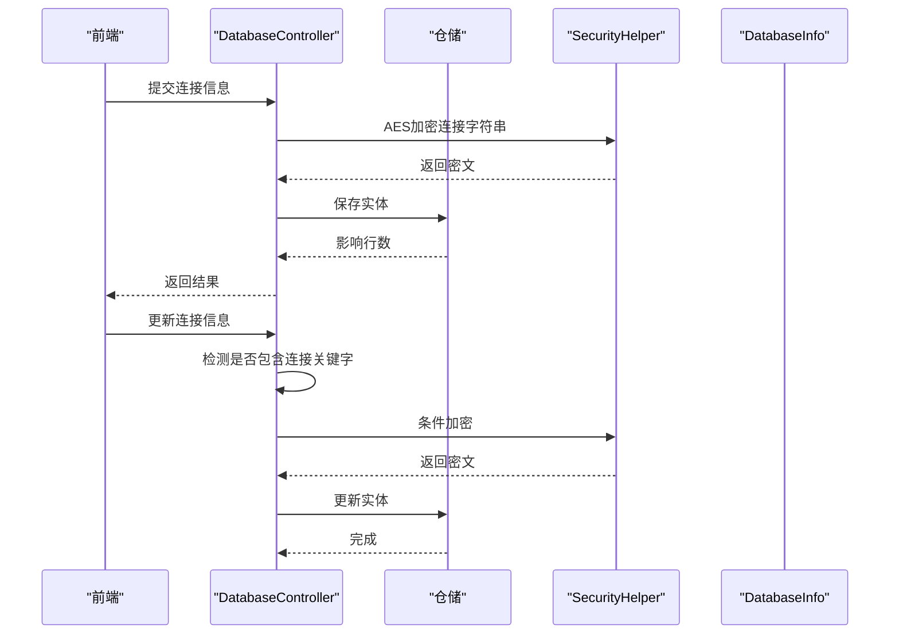
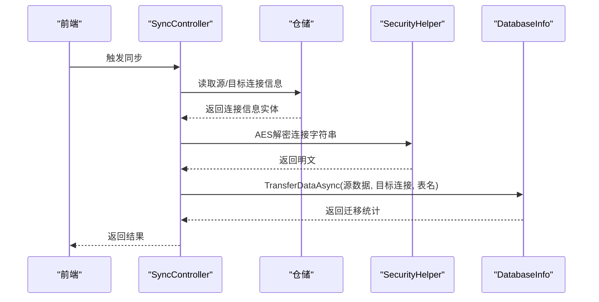
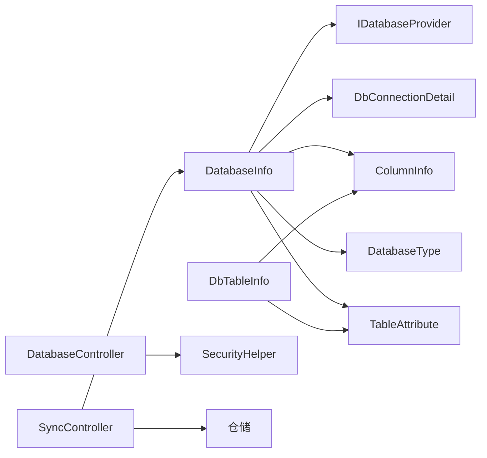

# 数据库信息管理

<cite>
**本文引用的文件**
- [DatabaseInfo.cs](file://Sylas.RemoteTasks.Database/SyncBase/DatabaseInfo.cs)
- [EntityBase.cs](file://Sylas.RemoteTasks.Database/EntityBase.cs)
- [DbConnectionInfo.cs](file://Sylas.RemoteTasks.Database/Dtos/DbConnectionInfo.cs)
- [DbConnectionDetail.cs](file://Sylas.RemoteTasks.Database/SyncBase/DbConnectionDetail.cs)
- [DbTableInfo.cs](file://Sylas.RemoteTasks.Database/SyncBase/DbTableInfo.cs)
- [DatabaseType.cs](file://Sylas.RemoteTasks.Database/SyncBase/DatabaseType.cs)
- [TableAttribute.cs](file://Sylas.RemoteTasks.Database/Attributes/TableAttribute.cs)
- [IDatabaseProvider.cs](file://Sylas.RemoteTasks.Database/IDatabaseProvider.cs)
- [ColumnInfo.cs](file://Sylas.RemoteTasks.Database/Dtos/ColumnInfo.cs)
- [DatabaseInfoTest.cs](file://Sylas.RemoteTasks.Test/Database/DatabaseInfoTest.cs)
- [SecurityHelper.cs](file://Sylas.RemoteTasks.Common/SecurityHelper.cs)
- [DatabaseConstants.cs](file://Sylas.RemoteTasks.Utils/Constants/DatabaseConstants.cs)
- [DatabaseController.cs](file://Sylas.RemoteTasks.App/Controllers/DatabaseController.cs)
- [DbConnectionInfoInDto.cs](file://Sylas.RemoteTasks.App/DatabaseManager/Models/Dtos/DbConnectionInfoInDto.cs)
- [TransferDataDto.cs](file://Sylas.RemoteTasks.Database/Dtos/TransferDataDto.cs)
- [SyncController.cs](file://Sylas.RemoteTasks.App/Controllers/SyncController.cs)
- [appsettings.json](file://Sylas.RemoteTasks.App/appsettings.json)
</cite>

## 目录
1. [简介](#简介)
2. [项目结构](#项目结构)
3. [核心组件](#核心组件)
4. [架构总览](#架构总览)
5. [组件详细分析](#组件详细分析)
6. [依赖关系分析](#依赖关系分析)
7. [性能考量](#性能考量)
8. [故障排查指南](#故障排查指南)
9. [结论](#结论)
10. [附录](#附录)

## 简介
本文件面向数据库信息管理系统，围绕以下主题展开：DatabaseInfo 类的功能职责与实现要点、DbConnectionInfo DTO 的结构与用途、EntityBase 基类的设计思想；同时结合实际代码示例，说明数据库连接信息管理、表结构元数据获取、实体映射与缓存、跨库数据同步、连接池与安全连接处理等。文档还提供最佳实践建议，帮助读者在复杂多数据库场景下高效、安全地管理数据库信息。

## 项目结构
该系统采用分层与模块化组织方式：
- 数据库层（Sylas.RemoteTasks.Database）：核心数据库抽象与工具，包括 DatabaseInfo、DbTableInfo、ColumnInfo、IDatabaseProvider 等。
- 应用层（Sylas.RemoteTasks.App）：控制器、视图、数据处理器等，负责业务编排与用户交互。
- 工具与通用层（Sylas.RemoteTasks.Common、Sylas.RemoteTasks.Utils）：提供安全加密、常量、扩展等通用能力。
- 测试层（Sylas.RemoteTasks.Test）：覆盖数据库连接、安全、数据同步等场景。

图表来源
- [DatabaseInfo.cs](file://Sylas.RemoteTasks.Database/SyncBase/DatabaseInfo.cs#L64-L88)
- [IDatabaseProvider.cs](file://Sylas.RemoteTasks.Database/IDatabaseProvider.cs#L12-L97)
- [DbTableInfo.cs](file://Sylas.RemoteTasks.Database/SyncBase/DbTableInfo.cs#L18-L109)
- [DbConnectionInfo.cs](file://Sylas.RemoteTasks.Database/Dtos/DbConnectionInfo.cs#L10-L32)
- [DbConnectionDetail.cs](file://Sylas.RemoteTasks.Database/SyncBase/DbConnectionDetail.cs#L6-L53)
- [ColumnInfo.cs](file://Sylas.RemoteTasks.Database/Dtos/ColumnInfo.cs#L6-L54)
- [TableAttribute.cs](file://Sylas.RemoteTasks.Database/Attributes/TableAttribute.cs#L14-L31)
- [DatabaseType.cs](file://Sylas.RemoteTasks.Database/SyncBase/DatabaseType.cs#L6-L36)
- [SecurityHelper.cs](file://Sylas.RemoteTasks.Common/SecurityHelper.cs#L36-L60)
- [DatabaseConstants.cs](file://Sylas.RemoteTasks.Utils/Constants/DatabaseConstants.cs#L11-L12)
- [DatabaseController.cs](file://Sylas.RemoteTasks.App/Controllers/DatabaseController.cs#L49-L75)
- [SyncController.cs](file://Sylas.RemoteTasks.App/Controllers/SyncController.cs#L370-L390)
- [DatabaseInfoTest.cs](file://Sylas.RemoteTasks.Test/Database/DatabaseInfoTest.cs#L22-L41)

章节来源
- [DatabaseInfo.cs](file://Sylas.RemoteTasks.Database/SyncBase/DatabaseInfo.cs#L64-L88)
- [IDatabaseProvider.cs](file://Sylas.RemoteTasks.Database/IDatabaseProvider.cs#L12-L97)

## 核心组件
- DatabaseInfo：统一的数据库操作入口，负责连接字符串解析、数据库类型识别、连接对象创建、事务封装、分页查询、动态增删改、表结构元数据缓存、跨库数据同步等。
- DbTableInfo<T>：基于反射与表达式树的实体到SQL映射工具，生成插入/更新SQL及参数构造器，支持类型转换与布尔到bit的适配。
- DbConnectionInfo：持久化存储的数据库连接信息实体，继承 EntityBase，具备标准的创建/更新时间字段。
- EntityBase：实体基类，统一注入创建与更新时间，简化实体设计。
- DbConnectionDetail：连接字符串解析后的结构化连接信息载体。
- ColumnInfo：表字段元数据模型，用于描述字段类型、长度、是否主键/可空、默认值等。
- IDatabaseProvider：数据库操作接口，约束分页查询、执行SQL、动态更新、表结构获取等能力。
- DatabaseType：数据库类型枚举，覆盖主流数据库。
- TableAttribute：自定义特性，用于声明实体对应的表名。
- SecurityHelper：AES加解密工具，用于连接字符串的安全存储与传输。
- DatabaseConstants：数据库连接字符串关键字集合，用于触发加密逻辑。

章节来源
- [DatabaseInfo.cs](file://Sylas.RemoteTasks.Database/SyncBase/DatabaseInfo.cs#L64-L88)
- [DbTableInfo.cs](file://Sylas.RemoteTasks.Database/SyncBase/DbTableInfo.cs#L18-L109)
- [DbConnectionInfo.cs](file://Sylas.RemoteTasks.Database/Dtos/DbConnectionInfo.cs#L10-L32)
- [EntityBase.cs](file://Sylas.RemoteTasks.Database/EntityBase.cs#L9-L31)
- [DbConnectionDetail.cs](file://Sylas.RemoteTasks.Database/SyncBase/DbConnectionDetail.cs#L6-L53)
- [ColumnInfo.cs](file://Sylas.RemoteTasks.Database/Dtos/ColumnInfo.cs#L6-L54)
- [IDatabaseProvider.cs](file://Sylas.RemoteTasks.Database/IDatabaseProvider.cs#L12-L97)
- [DatabaseType.cs](file://Sylas.RemoteTasks.Database/SyncBase/DatabaseType.cs#L6-L36)
- [TableAttribute.cs](file://Sylas.RemoteTasks.Database/Attributes/TableAttribute.cs#L14-L31)
- [SecurityHelper.cs](file://Sylas.RemoteTasks.Common/SecurityHelper.cs#L36-L60)
- [DatabaseConstants.cs](file://Sylas.RemoteTasks.Utils/Constants/DatabaseConstants.cs#L11-L12)

## 架构总览
DatabaseInfo 作为核心协调者，向上通过 IDatabaseProvider 对外暴露统一能力；向下整合连接管理、元数据缓存、SQL生成与执行、事务控制等模块。DbTableInfo<T> 与 TableAttribute 协作完成实体到表的映射；DbConnectionInfo 与 EntityBase 统一实体设计；SecurityHelper 保障连接字符串安全。

图表来源
- [IDatabaseProvider.cs](file://Sylas.RemoteTasks.Database/IDatabaseProvider.cs#L12-L97)
- [DatabaseInfo.cs](file://Sylas.RemoteTasks.Database/SyncBase/DatabaseInfo.cs#L64-L88)
- [DbTableInfo.cs](file://Sylas.RemoteTasks.Database/SyncBase/DbTableInfo.cs#L18-L109)
- [DbConnectionInfo.cs](file://Sylas.RemoteTasks.Database/Dtos/DbConnectionInfo.cs#L10-L32)
- [EntityBase.cs](file://Sylas.RemoteTasks.Database/EntityBase.cs#L9-L31)
- [DbConnectionDetail.cs](file://Sylas.RemoteTasks.Database/SyncBase/DbConnectionDetail.cs#L6-L53)
- [ColumnInfo.cs](file://Sylas.RemoteTasks.Database/Dtos/ColumnInfo.cs#L6-L54)
- [TableAttribute.cs](file://Sylas.RemoteTasks.Database/Attributes/TableAttribute.cs#L14-L31)
- [DatabaseType.cs](file://Sylas.RemoteTasks.Database/SyncBase/DatabaseType.cs#L6-L36)

## 组件详细分析

### DatabaseInfo 类功能与实现
- 连接管理
  - 支持多种数据库类型（MySql、SqlServer、Oracle、Pg、Sqlite、Dm、MsSqlLocalDb），通过连接字符串自动识别类型并创建对应连接对象。
  - 提供 ChangeDatabase 重载，支持按连接字符串或另一个 DatabaseInfo 切换数据库。
  - 内置连接字符串校验与清理逻辑，避免混淆字符影响解析。
- 元数据与缓存
  - 通过 GetTableColumnsInfoAsync 获取表字段信息，并以连接串+表名为键进行并发字典缓存，避免重复查询。
  - 通过 GetTableFieldsConverterAsync 为非字符串字段构建类型转换器缓存，提升动态更新性能。
- SQL 生成与执行
  - 提供分页查询、单/多SQL执行、标量执行、动态更新、批量删除、条件创建表等能力。
  - 统一封装事务，确保执行一致性；对 Oracle/Dm 参数占位符进行兼容替换。
- 跨库同步
  - TransferDataAsync 支持源数据到目标库的批量插入/全量同步，支持忽略异常、仅插入模式等策略。
  - 支持并发任务调度，提高大规模数据迁移效率。

图表来源
- [DatabaseInfo.cs](file://Sylas.RemoteTasks.Database/SyncBase/DatabaseInfo.cs#L309-L351)
- [DatabaseInfo.cs](file://Sylas.RemoteTasks.Database/SyncBase/DatabaseInfo.cs#L3742-L3750)
- [DatabaseInfo.cs](file://Sylas.RemoteTasks.Database/SyncBase/DatabaseInfo.cs#L1448-L1464)

章节来源
- [DatabaseInfo.cs](file://Sylas.RemoteTasks.Database/SyncBase/DatabaseInfo.cs#L64-L88)
- [DatabaseInfo.cs](file://Sylas.RemoteTasks.Database/SyncBase/DatabaseInfo.cs#L309-L351)
- [DatabaseInfo.cs](file://Sylas.RemoteTasks.Database/SyncBase/DatabaseInfo.cs#L3742-L3750)
- [DatabaseInfo.cs](file://Sylas.RemoteTasks.Database/SyncBase/DatabaseInfo.cs#L1448-L1464)

### DbConnectionInfo DTO 结构
- 继承 EntityBase<int>，具备标准主键与时间戳字段。
- 通过 Table 特性标注持久化表名为 DbConnectionInfos，便于 ORM 映射与迁移。
- 字段包含名称、别名、连接字符串、备注、排序等，满足连接信息管理需求。

图表来源
- [DbConnectionInfo.cs](file://Sylas.RemoteTasks.Database/Dtos/DbConnectionInfo.cs#L10-L32)
- [EntityBase.cs](file://Sylas.RemoteTasks.Database/EntityBase.cs#L9-L31)

章节来源
- [DbConnectionInfo.cs](file://Sylas.RemoteTasks.Database/Dtos/DbConnectionInfo.cs#L10-L32)
- [EntityBase.cs](file://Sylas.RemoteTasks.Database/EntityBase.cs#L9-L31)

### EntityBase 基类设计
- 统一注入创建与更新时间，减少重复代码。
- 通过泛型参数支持不同主键类型，增强灵活性。
- 与 Table 特性配合，形成“约定优于配置”的实体设计范式。

章节来源
- [EntityBase.cs](file://Sylas.RemoteTasks.Database/EntityBase.cs#L9-L31)

### 表结构元数据与实体映射
- DbTableInfo<T> 基于反射与表达式树生成插入/更新SQL与参数构造器，支持：
  - 主键推断（默认Id）
  - 非字符串属性的类型转换器缓存
  - 布尔到bit的适配处理
  - 参数化SQL，降低注入风险
- ColumnInfo 描述字段的类型、长度、是否主键/可空、默认值、备注等，用于生成建表语句与参数绑定。

图表来源
- [DbTableInfo.cs](file://Sylas.RemoteTasks.Database/SyncBase/DbTableInfo.cs#L56-L109)
- [DbTableInfo.cs](file://Sylas.RemoteTasks.Database/SyncBase/DbTableInfo.cs#L117-L222)
- [ColumnInfo.cs](file://Sylas.RemoteTasks.Database/Dtos/ColumnInfo.cs#L6-L54)

章节来源
- [DbTableInfo.cs](file://Sylas.RemoteTasks.Database/SyncBase/DbTableInfo.cs#L18-L109)
- [DbTableInfo.cs](file://Sylas.RemoteTasks.Database/SyncBase/DbTableInfo.cs#L117-L222)
- [ColumnInfo.cs](file://Sylas.RemoteTasks.Database/Dtos/ColumnInfo.cs#L6-L54)

### 数据库连接配置与安全
- 连接字符串解析：DatabaseInfo.GetDbConnectionDetail 通过正则匹配解析各类数据库连接字符串，提取主机、端口、数据库、账号、密码、实例名等。
- 安全存储：应用层控制器在新增/更新连接信息时，若检测到连接字符串包含特定关键字，则调用 SecurityHelper.AesEncryptAsync 进行加密存储。
- 配置文件：appsettings.json 提供默认连接字符串与全局关键字白名单，便于集中管理。

图表来源
- [DatabaseController.cs](file://Sylas.RemoteTasks.App/Controllers/DatabaseController.cs#L49-L75)
- [SecurityHelper.cs](file://Sylas.RemoteTasks.Common/SecurityHelper.cs#L36-L60)
- [DatabaseConstants.cs](file://Sylas.RemoteTasks.Utils/Constants/DatabaseConstants.cs#L11-L12)
- [appsettings.json](file://Sylas.RemoteTasks.App/appsettings.json#L25-L27)

章节来源
- [DatabaseController.cs](file://Sylas.RemoteTasks.App/Controllers/DatabaseController.cs#L49-L75)
- [SecurityHelper.cs](file://Sylas.RemoteTasks.Common/SecurityHelper.cs#L36-L60)
- [DatabaseConstants.cs](file://Sylas.RemoteTasks.Utils/Constants/DatabaseConstants.cs#L11-L12)
- [appsettings.json](file://Sylas.RemoteTasks.App/appsettings.json#L25-L27)

### 跨库数据同步与迁移
- 支持从任意源数据库批量迁移到目标数据库，可选择仅插入或全量同步。
- 支持并发任务调度，提高大数据量迁移效率。
- 提供异常忽略策略，保证迁移过程的稳定性。

图表来源
- [SyncController.cs](file://Sylas.RemoteTasks.App/Controllers/SyncController.cs#L370-L390)
- [TransferDataDto.cs](file://Sylas.RemoteTasks.Database/Dtos/TransferDataDto.cs#L6-L28)
- [DatabaseInfo.cs](file://Sylas.RemoteTasks.Database/SyncBase/DatabaseInfo.cs#L1448-L1464)

章节来源
- [SyncController.cs](file://Sylas.RemoteTasks.App/Controllers/SyncController.cs#L370-L390)
- [TransferDataDto.cs](file://Sylas.RemoteTasks.Database/Dtos/TransferDataDto.cs#L6-L28)
- [DatabaseInfo.cs](file://Sylas.RemoteTasks.Database/SyncBase/DatabaseInfo.cs#L1448-L1464)

## 依赖关系分析
- DatabaseInfo 依赖：
  - IDatabaseProvider 接口约束能力边界
  - DbConnectionDetail/ColumnInfo/DatabaseType/TableAttribute 提供元数据与类型识别
  - SecurityHelper 用于连接字符串安全
- DbTableInfo<T> 依赖：
  - TableAttribute 获取表名
  - ExpressionBuilder/Reflection 构建参数与SQL
- 控制器依赖：
  - DatabaseController 依赖 SecurityHelper 与仓储
  - SyncController 依赖仓储与 DatabaseInfo

图表来源
- [DatabaseInfo.cs](file://Sylas.RemoteTasks.Database/SyncBase/DatabaseInfo.cs#L64-L88)
- [DbTableInfo.cs](file://Sylas.RemoteTasks.Database/SyncBase/DbTableInfo.cs#L18-L109)
- [DatabaseController.cs](file://Sylas.RemoteTasks.App/Controllers/DatabaseController.cs#L49-L75)
- [SyncController.cs](file://Sylas.RemoteTasks.App/Controllers/SyncController.cs#L370-L390)

章节来源
- [DatabaseInfo.cs](file://Sylas.RemoteTasks.Database/SyncBase/DatabaseInfo.cs#L64-L88)
- [DbTableInfo.cs](file://Sylas.RemoteTasks.Database/SyncBase/DbTableInfo.cs#L18-L109)
- [DatabaseController.cs](file://Sylas.RemoteTasks.App/Controllers/DatabaseController.cs#L49-L75)
- [SyncController.cs](file://Sylas.RemoteTasks.App/Controllers/SyncController.cs#L370-L390)

## 性能考量
- 元数据缓存：表字段信息与类型转换器均采用并发字典缓存，避免重复反射与字符串转换开销。
- 参数化与事务：统一使用参数化SQL与事务封装，降低注入风险并提升执行效率。
- 并发迁移：跨库同步支持并发任务调度，适合大批量数据迁移场景。
- 连接复用：通过连接字符串识别与连接对象复用，减少频繁创建销毁成本。

章节来源
- [DatabaseInfo.cs](file://Sylas.RemoteTasks.Database/SyncBase/DatabaseInfo.cs#L515-L549)
- [DatabaseInfo.cs](file://Sylas.RemoteTasks.Database/SyncBase/DatabaseInfo.cs#L1307-L1358)

## 故障排查指南
- 连接字符串解析失败：检查连接字符串格式是否符合预期，确认正则匹配分支覆盖范围。
- 表不存在：使用 CreateTableIfNotExistAsync 自动创建表，或手动执行建表语句。
- 异常判断：IsTableNotExistException 通过关键字匹配识别表不存在异常，便于分支处理。
- 安全问题：若连接字符串未加密但包含关键字，控制器会触发加密；解密失败时检查密钥与格式。
- 跨库同步异常：启用忽略异常模式或定位具体批次错误，结合日志与事务回滚机制排查。

章节来源
- [DatabaseInfo.cs](file://Sylas.RemoteTasks.Database/SyncBase/DatabaseInfo.cs#L210-L299)
- [DatabaseInfo.cs](file://Sylas.RemoteTasks.Database/SyncBase/DatabaseInfo.cs#L727-L736)
- [DatabaseInfo.cs](file://Sylas.RemoteTasks.Database/SyncBase/DatabaseInfo.cs#L1366-L1464)
- [DatabaseController.cs](file://Sylas.RemoteTasks.App/Controllers/DatabaseController.cs#L67-L70)
- [SecurityHelper.cs](file://Sylas.RemoteTasks.Common/SecurityHelper.cs#L53-L60)

## 结论
本系统通过 DatabaseInfo 为核心，结合 DbTableInfo<T> 的强类型映射、DbConnectionInfo 的标准化实体设计、以及 SecurityHelper 的安全机制，实现了对多数据库的统一管理与高效操作。配合元数据缓存、事务封装与并发迁移能力，能够在复杂业务场景中稳定、安全地完成数据库信息管理与数据同步任务。

## 附录
- 最佳实践
  - 连接信息管理：统一使用 DTO 存储，敏感字段加密保存；提供关键字白名单以触发加密。
  - 实体设计：优先继承 EntityBase，使用 TableAttribute 指定表名；避免硬编码SQL，尽量参数化。
  - 元数据与缓存：充分利用表字段信息缓存与类型转换器缓存，减少反射与字符串转换成本。
  - 跨库同步：根据数据量选择并发迁移；开启事务与异常忽略策略，确保一致性与稳定性。
  - 配置管理：集中维护连接字符串与关键字白名单，便于运维与审计。

章节来源
- [DbConnectionInfo.cs](file://Sylas.RemoteTasks.Database/Dtos/DbConnectionInfo.cs#L10-L32)
- [EntityBase.cs](file://Sylas.RemoteTasks.Database/EntityBase.cs#L9-L31)
- [TableAttribute.cs](file://Sylas.RemoteTasks.Database/Attributes/TableAttribute.cs#L14-L31)
- [DatabaseInfo.cs](file://Sylas.RemoteTasks.Database/SyncBase/DatabaseInfo.cs#L515-L549)
- [DatabaseInfo.cs](file://Sylas.RemoteTasks.Database/SyncBase/DatabaseInfo.cs#L1307-L1358)
- [appsettings.json](file://Sylas.RemoteTasks.App/appsettings.json#L20-L27)