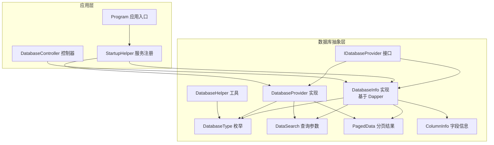
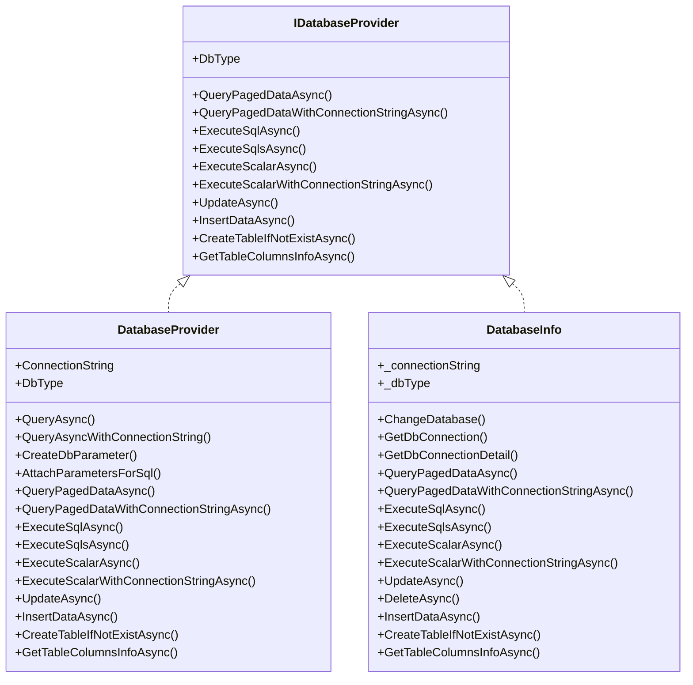
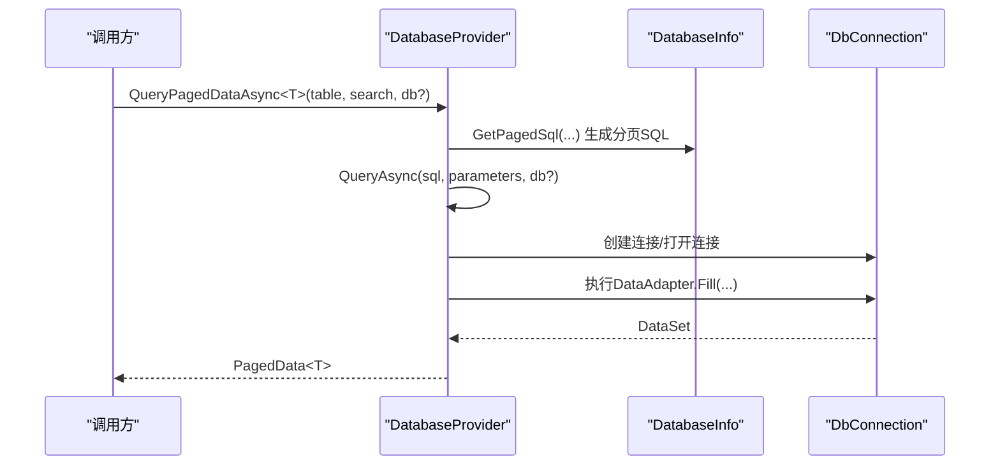
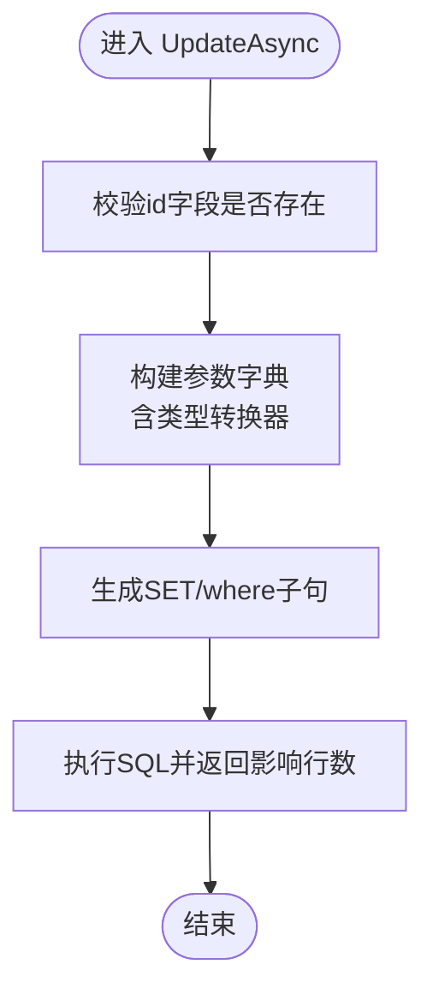
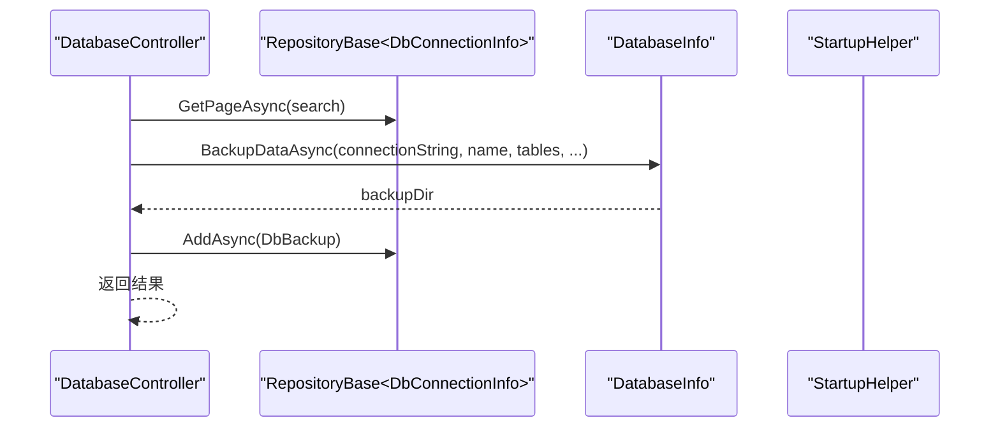
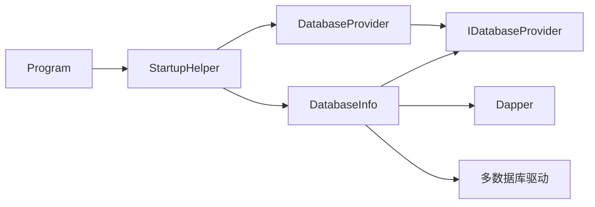

# 数据库抽象层

<cite>
**本文引用的文件**
- [DatabaseProvider.cs](file://Sylas.RemoteTasks.Database/DatabaseProvider.cs)
- [IDatabaseProvider.cs](file://Sylas.RemoteTasks.Database/IDatabaseProvider.cs)
- [DatabaseHelper.cs](file://Sylas.RemoteTasks.Database/DatabaseHelper.cs)
- [DatabaseInfo.cs](file://Sylas.RemoteTasks.Database/SyncBase/DatabaseInfo.cs)
- [DatabaseType.cs](file://Sylas.RemoteTasks.Database/SyncBase/DatabaseType.cs)
- [DataSearch.cs](file://Sylas.RemoteTasks.Database/SyncBase/DataSearch.cs)
- [PagedData.cs](file://Sylas.RemoteTasks.Database/SyncBase/PagedData.cs)
- [ColumnInfo.cs](file://Sylas.RemoteTasks.Database/Dtos/ColumnInfo.cs)
- [DbConnectionInfo.cs](file://Sylas.RemoteTasks.Database/Dtos/DbConnectionInfo.cs)
- [StartupHelper.cs](file://Sylas.RemoteTasks.App/Helpers/StartupHelper.cs)
- [Program.cs](file://Sylas.RemoteTasks.App/Program.cs)
- [DatabaseController.cs](file://Sylas.RemoteTasks.App/Controllers/DatabaseController.cs)
</cite>

## 目录
1. [引言](#引言)
2. [项目结构](#项目结构)
3. [核心组件](#核心组件)
4. [架构总览](#架构总览)
5. [详细组件分析](#详细组件分析)
6. [依赖关系分析](#依赖关系分析)
7. [性能考量](#性能考量)
8. [故障排查指南](#故障排查指南)
9. [结论](#结论)
10. [附录](#附录)

## 引言
本文件系统性梳理数据库抽象层的设计与实现，重点围绕 DatabaseProvider 的接口定义、实现细节、调用关系、领域模型与使用模式展开，并结合实际代码示例说明配置项、参数与返回值，以及与应用其他组件（如控制器、仓储、工厂）的集成方式。目标是帮助初学者快速上手，同时为有经验的开发者提供足够的技术深度。

## 项目结构
数据库抽象层位于 Sylas.RemoteTasks.Database 工程，核心接口与实现如下：
- 接口：IDatabaseProvider
- 实现：DatabaseProvider（基于 System.Data.SqlClient 的轻量封装）
- 抽象增强：DatabaseInfo（基于 Dapper 的多数据库支持与高级能力）
- 工具与类型：DatabaseHelper、DatabaseType、DataSearch、PagedData、ColumnInfo 等
- 应用集成：StartupHelper、Program、Controllers 中的使用示例

图表来源
- [IDatabaseProvider.cs](file://Sylas.RemoteTasks.Database/IDatabaseProvider.cs#L12-L97)
- [DatabaseProvider.cs](file://Sylas.RemoteTasks.Database/DatabaseProvider.cs#L19-L484)
- [DatabaseInfo.cs](file://Sylas.RemoteTasks.Database/SyncBase/DatabaseInfo.cs#L64-L88)
- [DatabaseHelper.cs](file://Sylas.RemoteTasks.Database/DatabaseHelper.cs#L20-L244)
- [DatabaseType.cs](file://Sylas.RemoteTasks.Database/SyncBase/DatabaseType.cs#L6-L36)
- [DataSearch.cs](file://Sylas.RemoteTasks.Database/SyncBase/DataSearch.cs#L8-L47)
- [PagedData.cs](file://Sylas.RemoteTasks.Database/SyncBase/PagedData.cs#L10-L44)
- [ColumnInfo.cs](file://Sylas.RemoteTasks.Database/Dtos/ColumnInfo.cs#L6-L53)
- [StartupHelper.cs](file://Sylas.RemoteTasks.App/Helpers/StartupHelper.cs#L39-L54)
- [Program.cs](file://Sylas.RemoteTasks.App/Program.cs#L56-L58)
- [DatabaseController.cs](file://Sylas.RemoteTasks.App/Controllers/DatabaseController.cs#L18-L234)

章节来源
- [Program.cs](file://Sylas.RemoteTasks.App/Program.cs#L56-L58)
- [StartupHelper.cs](file://Sylas.RemoteTasks.App/Helpers/StartupHelper.cs#L39-L54)

## 核心组件
- IDatabaseProvider：定义数据库抽象能力，包括分页查询、执行 SQL、动态更新/插入、建表、列信息查询等。
- DatabaseProvider：面向 SQL Server 的轻量实现，提供异步查询、参数化执行、分页查询等能力；内部使用 SqlClientFactory。
- DatabaseInfo：多数据库抽象实现，支持 MySQL、Oracle、SqlServer、Pg、Sqlite、Dm 等，基于 Dapper，提供更丰富的数据同步与查询能力。
- DatabaseHelper：辅助工具，包含连接字符串生成、对比同步数据等。
- DatabaseType：数据库类型枚举。
- DataSearch/PagedData：查询参数与分页结果模型。
- ColumnInfo：表字段元数据。
- DbConnectionInfo：数据库连接信息实体（用于应用侧持久化连接配置）。

章节来源
- [IDatabaseProvider.cs](file://Sylas.RemoteTasks.Database/IDatabaseProvider.cs#L12-L97)
- [DatabaseProvider.cs](file://Sylas.RemoteTasks.Database/DatabaseProvider.cs#L19-L484)
- [DatabaseInfo.cs](file://Sylas.RemoteTasks.Database/SyncBase/DatabaseInfo.cs#L64-L88)
- [DatabaseHelper.cs](file://Sylas.RemoteTasks.Database/DatabaseHelper.cs#L20-L244)
- [DatabaseType.cs](file://Sylas.RemoteTasks.Database/SyncBase/DatabaseType.cs#L6-L36)
- [DataSearch.cs](file://Sylas.RemoteTasks.Database/SyncBase/DataSearch.cs#L8-L47)
- [PagedData.cs](file://Sylas.RemoteTasks.Database/SyncBase/PagedData.cs#L10-L44)
- [ColumnInfo.cs](file://Sylas.RemoteTasks.Database/Dtos/ColumnInfo.cs#L6-L53)
- [DbConnectionInfo.cs](file://Sylas.RemoteTasks.Database/Dtos/DbConnectionInfo.cs#L10-L33)

## 架构总览
DatabaseProvider 与 DatabaseInfo 均实现 IDatabaseProvider，分别面向不同场景：
- DatabaseProvider：适合 SQL Server 场景，提供简单易用的异步查询与参数化执行。
- DatabaseInfo：多数据库通用能力，适合复杂查询、事务、批量操作、动态更新等。

图表来源
- [IDatabaseProvider.cs](file://Sylas.RemoteTasks.Database/IDatabaseProvider.cs#L12-L97)
- [DatabaseProvider.cs](file://Sylas.RemoteTasks.Database/DatabaseProvider.cs#L19-L484)
- [DatabaseInfo.cs](file://Sylas.RemoteTasks.Database/SyncBase/DatabaseInfo.cs#L64-L88)

## 详细组件分析

### DatabaseProvider 组件分析
- 角色定位：面向 SQL Server 的轻量数据库访问层，提供异步查询、参数化执行、分页查询等。
- 关键点
  - 连接字符串来源：通过构造函数注入 IConfiguration，优先使用配置项 Default。
  - 类型映射：将 C# 类型映射为 SqlDbType，便于参数化。
  - 参数化：提供 CreateDbParameter 与 AttachParametersForSql，支持字符串与非字符串参数。
  - 分页查询：基于 DatabaseInfo.GetPagedSql 生成分页 SQL，并返回 PagedData<T>。
  - 动态更新/插入/建表/列信息：委托给 DatabaseInfo 完成。

图表来源
- [DatabaseProvider.cs](file://Sylas.RemoteTasks.Database/DatabaseProvider.cs#L337-L370)
- [DatabaseProvider.cs](file://Sylas.RemoteTasks.Database/DatabaseProvider.cs#L177-L192)
- [DatabaseProvider.cs](file://Sylas.RemoteTasks.Database/DatabaseProvider.cs#L218-L258)
- [DatabaseInfo.cs](file://Sylas.RemoteTasks.Database/SyncBase/DatabaseInfo.cs#L309-L351)

章节来源
- [DatabaseProvider.cs](file://Sylas.RemoteTasks.Database/DatabaseProvider.cs#L19-L484)

### DatabaseInfo 组件分析
- 角色定位：多数据库抽象实现，基于 Dapper，支持多种数据库类型与高级功能。
- 关键点
  - 多数据库支持：根据连接字符串自动识别数据库类型，提供统一的连接对象工厂。
  - 事务与批量：ExecuteSqlsAsync 内部开启事务，保证一致性。
  - 动态更新：UpdateAsync 支持按主键动态拼接 SET 条件，并自动写入更新时间。
  - 表存在与建表：CreateTableIfNotExistAsync 在表不存在时自动生成建表语句。
  - 连接细节解析：GetDbConnectionDetail 支持解析多种连接字符串格式。

图表来源
- [DatabaseInfo.cs](file://Sylas.RemoteTasks.Database/SyncBase/DatabaseInfo.cs#L497-L504)
- [DatabaseInfo.cs](file://Sylas.RemoteTasks.Database/SyncBase/DatabaseInfo.cs#L559-L570)
- [DatabaseInfo.cs](file://Sylas.RemoteTasks.Database/SyncBase/DatabaseInfo.cs#L612-L663)

章节来源
- [DatabaseInfo.cs](file://Sylas.RemoteTasks.Database/SyncBase/DatabaseInfo.cs#L64-L88)
- [DatabaseInfo.cs](file://Sylas.RemoteTasks.Database/SyncBase/DatabaseInfo.cs#L309-L351)
- [DatabaseInfo.cs](file://Sylas.RemoteTasks.Database/SyncBase/DatabaseInfo.cs#L408-L433)
- [DatabaseInfo.cs](file://Sylas.RemoteTasks.Database/SyncBase/DatabaseInfo.cs#L497-L504)
- [DatabaseInfo.cs](file://Sylas.RemoteTasks.Database/SyncBase/DatabaseInfo.cs#L559-L570)
- [DatabaseInfo.cs](file://Sylas.RemoteTasks.Database/SyncBase/DatabaseInfo.cs#L612-L663)

### DatabaseHelper 组件分析
- 角色定位：数据库连接字符串生成与数据对比工具。
- 关键点
  - 连接字符串生成：提供 Oracle、MySql、SqlServer 的连接串生成方法。
  - 数据对比：CompareRecordsForSyncDb 对比源数据与目标数据，输出插入/更新/删除集合。

章节来源
- [DatabaseHelper.cs](file://Sylas.RemoteTasks.Database/DatabaseHelper.cs#L20-L244)

### 领域模型与数据结构
- DatabaseType：枚举数据库类型（MySql、SqlServer、Oracle、Pg、Dm、Sqlite、MsSqlLocalDb）。
- DataSearch：分页查询参数（PageIndex、PageSize、Filter、Rules）。
- PagedData：分页结果（Count、TotalPages、Data）。
- ColumnInfo：表字段信息（ColumnCode、ColumnType、ColumnCSharpType、IsPK、IsNullable、OrderNo、DefaultValue）。
- DbConnectionInfo：数据库连接信息实体（Name、Alias、ConnectionString、Remark、OrderNo）。

章节来源
- [DatabaseType.cs](file://Sylas.RemoteTasks.Database/SyncBase/DatabaseType.cs#L6-L36)
- [DataSearch.cs](file://Sylas.RemoteTasks.Database/SyncBase/DataSearch.cs#L8-L47)
- [PagedData.cs](file://Sylas.RemoteTasks.Database/SyncBase/PagedData.cs#L10-L44)
- [ColumnInfo.cs](file://Sylas.RemoteTasks.Database/Dtos/ColumnInfo.cs#L6-L53)
- [DbConnectionInfo.cs](file://Sylas.RemoteTasks.Database/Dtos/DbConnectionInfo.cs#L10-L33)

### 使用模式与集成
- 服务注册：StartupHelper 将 DatabaseInfo 注册为 Scoped，DatabaseProvider 注册为 Scoped 或 Singleton（视需求），并提供 DatabaseInfoFactory 用于创建独立实例。
- 应用入口：Program 中注册 DatabaseProvider 与 AddDatabaseUtils。
- 控制器使用：DatabaseController 展示了连接信息的增删改查、备份与还原流程，其中备份/还原涉及 DatabaseInfo 的备份/恢复能力。

图表来源
- [DatabaseController.cs](file://Sylas.RemoteTasks.App/Controllers/DatabaseController.cs#L115-L137)
- [DatabaseInfo.cs](file://Sylas.RemoteTasks.Database/SyncBase/DatabaseInfo.cs#L64-L88)
- [StartupHelper.cs](file://Sylas.RemoteTasks.App/Helpers/StartupHelper.cs#L39-L54)

章节来源
- [StartupHelper.cs](file://Sylas.RemoteTasks.App/Helpers/StartupHelper.cs#L39-L54)
- [Program.cs](file://Sylas.RemoteTasks.App/Program.cs#L56-L58)
- [DatabaseController.cs](file://Sylas.RemoteTasks.App/Controllers/DatabaseController.cs#L18-L234)

## 依赖关系分析
- DatabaseProvider 依赖 IDatabaseProvider 接口与 DatabaseInfo 的部分能力（如分页 SQL 生成、建表、列信息等）。
- DatabaseInfo 依赖 Dapper、多种数据库驱动（MySql.Data、Oracle.ManagedDataAccess、Npgsql、Microsoft.Data.Sqlite、Dm 等）。
- 应用层通过 StartupHelper 注册 DatabaseInfo 为 Scoped，便于在一次请求内复用；DatabaseProvider 作为轻量实现可按需注册。

图表来源
- [DatabaseProvider.cs](file://Sylas.RemoteTasks.Database/DatabaseProvider.cs#L19-L484)
- [DatabaseInfo.cs](file://Sylas.RemoteTasks.Database/SyncBase/DatabaseInfo.cs#L64-L88)
- [StartupHelper.cs](file://Sylas.RemoteTasks.App/Helpers/StartupHelper.cs#L39-L54)
- [Program.cs](file://Sylas.RemoteTasks.App/Program.cs#L56-L58)

章节来源
- [DatabaseProvider.cs](file://Sylas.RemoteTasks.Database/DatabaseProvider.cs#L19-L484)
- [DatabaseInfo.cs](file://Sylas.RemoteTasks.Database/SyncBase/DatabaseInfo.cs#L64-L88)
- [StartupHelper.cs](file://Sylas.RemoteTasks.App/Helpers/StartupHelper.cs#L39-L54)
- [Program.cs](file://Sylas.RemoteTasks.App/Program.cs#L56-L58)

## 性能考量
- 连接池与并发：DatabaseInfo 使用 Dapper 的连接对象，建议在应用层合理配置连接池大小与超时；DatabaseProvider 使用 SqlClientFactory，注意连接生命周期管理。
- 参数化执行：两种实现均提供参数化能力，避免 SQL 注入并提升执行计划复用率。
- 分页查询：DatabaseInfo 的分页查询先执行 count 再执行分页查询，建议配合索引与合理的过滤条件。
- 动态更新：DatabaseInfo 的 UpdateAsync 自动写入更新时间字段，减少重复逻辑，但需确保字段命名规范。
- 多数据库差异：不同数据库的参数占位符（如 Oracle 使用冒号）已在 DatabaseInfo 中处理，避免跨库差异带来的性能问题。

## 故障排查指南
- 连接字符串为空
  - 现象：抛出“未指定需要连接的数据库”异常。
  - 排查：确认 appsettings 中 Default 连接字符串已正确配置；若使用 DatabaseProvider 的 QueryAsyncWithConnectionString，请确保传入的连接字符串非空。
- 事务回滚
  - 现象：ExecuteSqlsAsync 或 ExecuteScalarAsync 抛出异常后事务回滚。
  - 排查：检查 SQL 语法与参数；确保数据库用户具备相应权限。
- 表不存在
  - 现象：CreateTableIfNotExistAsync 在某些异常消息中被识别为“表不存在”，从而触发建表。
  - 排查：确认目标数据库与表名；检查异常消息关键字匹配。
- 参数类型不匹配
  - 现象：动态更新时字段类型转换失败。
  - 排查：确保参数值与表字段类型一致；必要时在调用前进行显式类型转换。
- 连接字符串加密
  - 现象：DatabaseProvider 会对连接字符串进行 AES 解密后再使用。
  - 排查：确认加密/解密流程一致；避免混淆字符导致解析失败。

章节来源
- [DatabaseProvider.cs](file://Sylas.RemoteTasks.Database/DatabaseProvider.cs#L177-L192)
- [DatabaseProvider.cs](file://Sylas.RemoteTasks.Database/DatabaseProvider.cs#L201-L216)
- [DatabaseInfo.cs](file://Sylas.RemoteTasks.Database/SyncBase/DatabaseInfo.cs#L372-L400)
- [DatabaseInfo.cs](file://Sylas.RemoteTasks.Database/SyncBase/DatabaseInfo.cs#L454-L476)
- [DatabaseInfo.cs](file://Sylas.RemoteTasks.Database/SyncBase/DatabaseInfo.cs#L744-L759)
- [DatabaseInfo.cs](file://Sylas.RemoteTasks.Database/SyncBase/DatabaseInfo.cs#L515-L549)

## 结论
数据库抽象层通过 IDatabaseProvider 提供统一接口，DatabaseProvider 与 DatabaseInfo 分别覆盖 SQL Server 场景与多数据库场景。其设计兼顾易用性与扩展性，配合应用层的服务注册与控制器使用，能够满足从简单查询到复杂数据同步的多种需求。建议在生产环境中结合连接池、参数化执行与索引优化，持续关注跨数据库差异与安全性。

## 附录

### 配置选项与参数说明
- 连接字符串
  - Default：应用启动时注入的默认连接字符串，DatabaseProvider 与 DatabaseInfo 均可使用。
  - 动态连接：DatabaseProvider 支持通过 QueryAsyncWithConnectionString 或 QueryPagedDataWithConnectionStringAsync 指定临时连接字符串。
- 查询参数
  - DataSearch：包含分页参数（PageIndex、PageSize）、过滤条件（Filter）与排序规则（Rules）。
- 返回值
  - 分页查询：PagedData<T>，包含 Count、TotalPages、Data。
  - 动态更新/插入/删除：返回受影响行数或布尔结果。
  - 列信息：返回 ColumnInfo 集合。

章节来源
- [DatabaseProvider.cs](file://Sylas.RemoteTasks.Database/DatabaseProvider.cs#L177-L192)
- [DatabaseProvider.cs](file://Sylas.RemoteTasks.Database/DatabaseProvider.cs#L378-L387)
- [DatabaseInfo.cs](file://Sylas.RemoteTasks.Database/SyncBase/DatabaseInfo.cs#L309-L351)
- [DataSearch.cs](file://Sylas.RemoteTasks.Database/SyncBase/DataSearch.cs#L8-L47)
- [PagedData.cs](file://Sylas.RemoteTasks.Database/SyncBase/PagedData.cs#L30-L44)
- [ColumnInfo.cs](file://Sylas.RemoteTasks.Database/Dtos/ColumnInfo.cs#L6-L53)