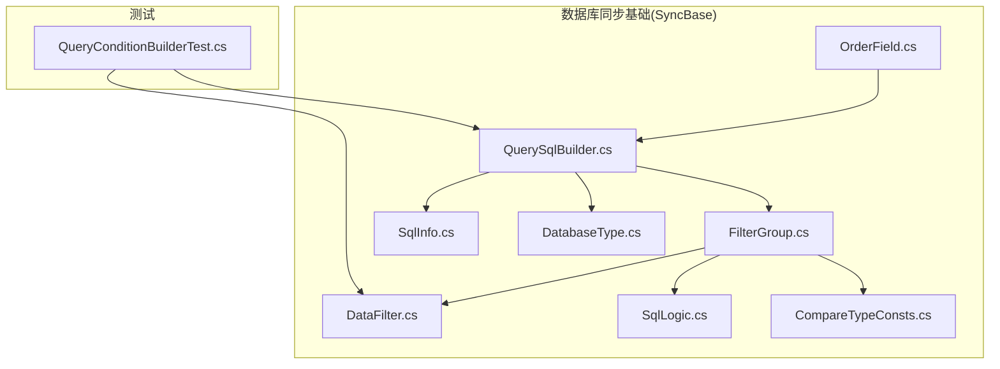
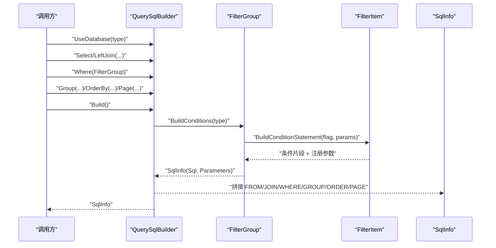
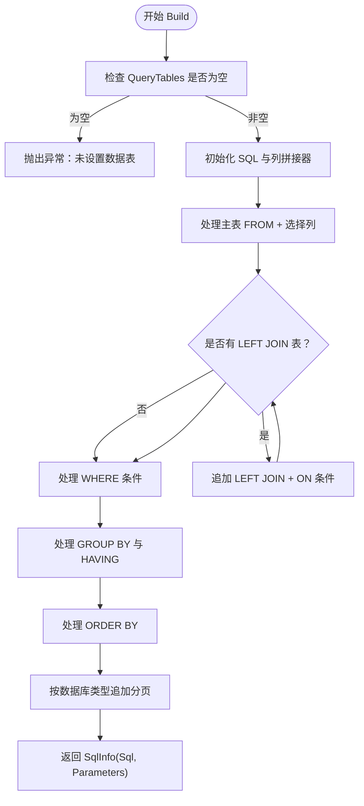
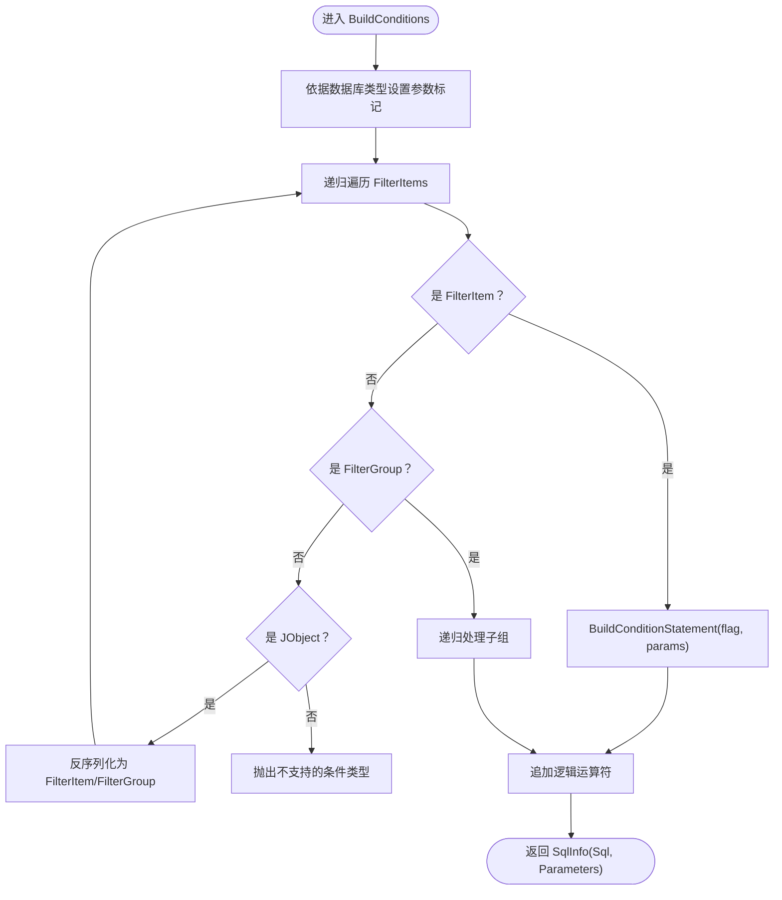
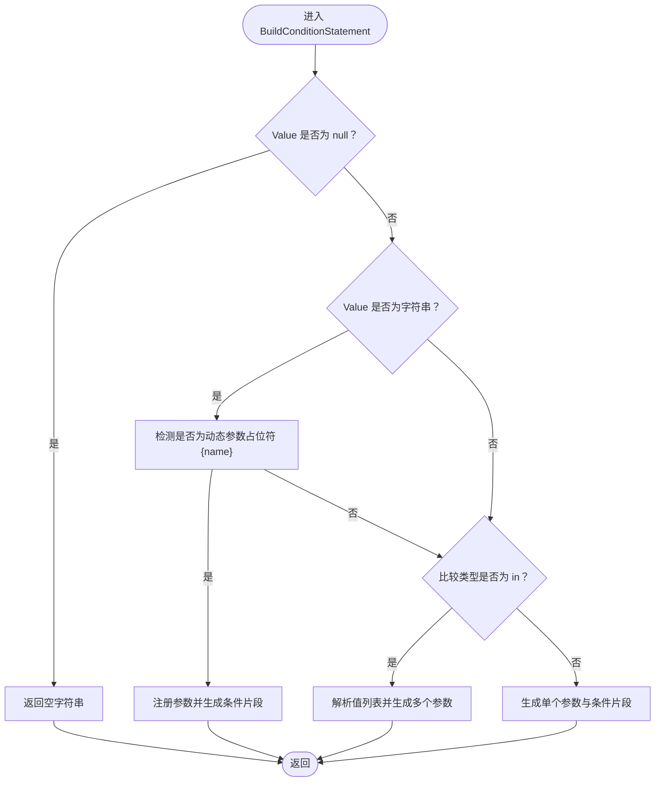
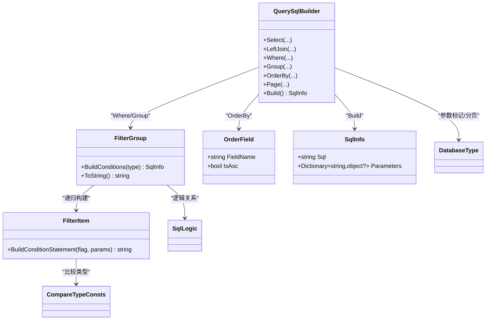

# 查询 SQL 构建器

<cite>
**本文引用的文件**
- [QuerySqlBuilder.cs](file://Sylas.RemoteTasks.Database/SyncBase/QuerySqlBuilder.cs)
- [SqlInfo.cs](file://Sylas.RemoteTasks.Database/SyncBase/SqlInfo.cs)
- [SqlLogic.cs](file://Sylas.RemoteTasks.Database/SyncBase/SqlLogic.cs)
- [FilterGroup.cs](file://Sylas.RemoteTasks.Database/SyncBase/FilterGroup.cs)
- [DataFilter.cs](file://Sylas.RemoteTasks.Database/SyncBase/DataFilter.cs)
- [OrderField.cs](file://Sylas.RemoteTasks.Database/SyncBase/OrderField.cs)
- [DatabaseType.cs](file://Sylas.RemoteTasks.Database/SyncBase/DatabaseType.cs)
- [CompareTypeConsts.cs](file://Sylas.RemoteTasks.Database/SyncBase/CompareTypeConsts.cs)
- [QueryConditionBuilderTest.cs](file://Sylas.RemoteTasks.Test/Database/QueryConditionBuilderTest.cs)
- [DatabaseInfo.cs](file://Sylas.RemoteTasks.Database/SyncBase/DatabaseInfo.cs)
- [DatabaseHelper.cs](file://Sylas.RemoteTasks.Database/DatabaseHelper.cs)
</cite>

## 目录
1. [简介](#简介)
2. [项目结构](#项目结构)
3. [核心组件](#核心组件)
4. [架构总览](#架构总览)
5. [组件详解](#组件详解)
6. [依赖关系分析](#依赖关系分析)
7. [性能考量](#性能考量)
8. [故障排查指南](#故障排查指南)
9. [结论](#结论)
10. [附录：示例与最佳实践](#附录示例与最佳实践)

## 简介
本文件围绕查询 SQL 构建器进行深入解析，重点覆盖以下方面：
- QuerySqlBuilder 的实现细节与调用流程
- SQL 语句生成逻辑（SELECT、FROM、LEFT JOIN、WHERE、GROUP BY/HAVING、ORDER BY、分页）
- 条件构建与参数化查询（FilterGroup、FilterItem、参数命名与冲突处理）
- SqlInfo 与 SqlLogic 的作用与使用
- 不同数据库类型的 SQL 语法差异处理（参数标记、分页语法）
- 实际查询构建示例与最佳实践

## 项目结构
与查询构建器直接相关的核心文件位于数据库同步基础模块中，测试用例展示了复杂 WHERE 条件、多表 JOIN、分组与排序、分页的实际使用场景。

**图表来源**
- [QuerySqlBuilder.cs](file://Sylas.RemoteTasks.Database/SyncBase/QuerySqlBuilder.cs#L1-L389)
- [FilterGroup.cs](file://Sylas.RemoteTasks.Database/SyncBase/FilterGroup.cs#L1-L202)
- [DataFilter.cs](file://Sylas.RemoteTasks.Database/SyncBase/DataFilter.cs#L1-L470)
- [OrderField.cs](file://Sylas.RemoteTasks.Database/SyncBase/OrderField.cs#L1-L34)
- [SqlInfo.cs](file://Sylas.RemoteTasks.Database/SyncBase/SqlInfo.cs#L1-L38)
- [SqlLogic.cs](file://Sylas.RemoteTasks.Database/SyncBase/SqlLogic.cs#L1-L22)
- [DatabaseType.cs](file://Sylas.RemoteTasks.Database/SyncBase/DatabaseType.cs#L1-L38)
- [CompareTypeConsts.cs](file://Sylas.RemoteTasks.Database/SyncBase/CompareTypeConsts.cs#L1-L55)
- [QueryConditionBuilderTest.cs](file://Sylas.RemoteTasks.Test/Database/QueryConditionBuilderTest.cs#L1-L281)

**章节来源**
- [QuerySqlBuilder.cs](file://Sylas.RemoteTasks.Database/SyncBase/QuerySqlBuilder.cs#L1-L389)
- [FilterGroup.cs](file://Sylas.RemoteTasks.Database/SyncBase/FilterGroup.cs#L1-L202)
- [DataFilter.cs](file://Sylas.RemoteTasks.Database/SyncBase/DataFilter.cs#L1-L470)
- [OrderField.cs](file://Sylas.RemoteTasks.Database/SyncBase/OrderField.cs#L1-L34)
- [SqlInfo.cs](file://Sylas.RemoteTasks.Database/SyncBase/SqlInfo.cs#L1-L38)
- [SqlLogic.cs](file://Sylas.RemoteTasks.Database/SyncBase/SqlLogic.cs#L1-L22)
- [DatabaseType.cs](file://Sylas.RemoteTasks.Database/SyncBase/DatabaseType.cs#L1-L38)
- [CompareTypeConsts.cs](file://Sylas.RemoteTasks.Database/SyncBase/CompareTypeConsts.cs#L1-L55)
- [QueryConditionBuilderTest.cs](file://Sylas.RemoteTasks.Test/Database/QueryConditionBuilderTest.cs#L1-L281)

## 核心组件
- QuerySqlBuilder：链式构建 SELECT 查询，支持主表、LEFT JOIN、WHERE 条件、GROUP BY/HAVING、ORDER BY、分页，并输出 SqlInfo。
- FilterGroup：条件组，支持递归组合 AND/OR，生成 WHERE/HAVING 条件与参数。
- FilterItem：单个条件项，负责根据比较类型（=、!=、in、include 等）生成条件片段与参数。
- OrderField：排序字段定义。
- SqlInfo：封装最终 SQL 与参数字典。
- SqlLogic：条件组内/组间的逻辑关系（And、Or、None）。
- DatabaseType：数据库类型枚举，影响参数标记与分页语法。
- CompareTypeConsts：比较类型常量集合。

**章节来源**
- [QuerySqlBuilder.cs](file://Sylas.RemoteTasks.Database/SyncBase/QuerySqlBuilder.cs#L11-L389)
- [FilterGroup.cs](file://Sylas.RemoteTasks.Database/SyncBase/FilterGroup.cs#L13-L202)
- [DataFilter.cs](file://Sylas.RemoteTasks.Database/SyncBase/DataFilter.cs#L14-L342)
- [OrderField.cs](file://Sylas.RemoteTasks.Database/SyncBase/OrderField.cs#L6-L34)
- [SqlInfo.cs](file://Sylas.RemoteTasks.Database/SyncBase/SqlInfo.cs#L8-L38)
- [SqlLogic.cs](file://Sylas.RemoteTasks.Database/SyncBase/SqlLogic.cs#L6-L22)
- [DatabaseType.cs](file://Sylas.RemoteTasks.Database/SyncBase/DatabaseType.cs#L6-L38)
- [CompareTypeConsts.cs](file://Sylas.RemoteTasks.Database/SyncBase/CompareTypeConsts.cs#L8-L55)

## 架构总览
下图展示了从输入 DTO 到最终 SQL 的关键交互：

**图表来源**
- [QuerySqlBuilder.cs](file://Sylas.RemoteTasks.Database/SyncBase/QuerySqlBuilder.cs#L177-L386)
- [FilterGroup.cs](file://Sylas.RemoteTasks.Database/SyncBase/FilterGroup.cs#L67-L144)
- [DataFilter.cs](file://Sylas.RemoteTasks.Database/SyncBase/DataFilter.cs#L118-L232)
- [SqlInfo.cs](file://Sylas.RemoteTasks.Database/SyncBase/SqlInfo.cs#L23-L38)

## 组件详解

### QuerySqlBuilder：查询构建器
- 参数化标记选择：根据数据库类型选择参数前缀（Oracle/Dm 使用冒号，其他使用 at 符号）。
- 表与列选择：
  - 支持主表与别名、指定列或全选（*）。
  - LEFT JOIN 支持 On 条件组与可选列。
- 条件构建：
  - Where(FilterGroup) 设置顶层条件。
  - Group(SqlGroupInfo) 设置分组字段与 HAVING 条件；HAVING 参数与主 WHERE 参数冲突时自动重命名避免重复键。
- 排序与分页：
  - OrderBy 支持多字段升/降序。
  - Page 接收页码与大小，按数据库类型生成分页子句（Oracle/Rownum、MySQL/LIMIT、PostgreSQL/LIMIT/OFFSET、SQLite/LIMIT/OFFSET、SqlServer/OFFSET/FETCH）。
- Build 输出：
  - 生成完整 SELECT 语句与参数字典，供数据库访问层执行。

**图表来源**
- [QuerySqlBuilder.cs](file://Sylas.RemoteTasks.Database/SyncBase/QuerySqlBuilder.cs#L277-L386)

**章节来源**
- [QuerySqlBuilder.cs](file://Sylas.RemoteTasks.Database/SyncBase/QuerySqlBuilder.cs#L17-L389)

### FilterGroup：条件组
- 递归构建 WHERE/HAVING 条件，支持 AND/OR 嵌套。
- ToString 用于 LEFT JOIN 的 ON 条件字符串化。
- BuildConditions 根据数据库类型选择参数标记，收集参数字典。

**图表来源**
- [FilterGroup.cs](file://Sylas.RemoteTasks.Database/SyncBase/FilterGroup.cs#L67-L144)

**章节来源**
- [FilterGroup.cs](file://Sylas.RemoteTasks.Database/SyncBase/FilterGroup.cs#L13-L202)

### FilterItem：条件项
- 支持多种比较类型（>, <, =, >=, <=, !=, in, include）。
- 动态参数占位符（如 {name}）会被识别为参数，参数名规范化并注册到参数字典。
- In 条件支持数组/逗号分隔字符串，自动生成多个参数并处理重复字段的索引后缀。
- Include 条件生成模糊匹配片段。

**图表来源**
- [DataFilter.cs](file://Sylas.RemoteTasks.Database/SyncBase/DataFilter.cs#L118-L232)

**章节来源**
- [DataFilter.cs](file://Sylas.RemoteTasks.Database/SyncBase/DataFilter.cs#L14-L342)
- [CompareTypeConsts.cs](file://Sylas.RemoteTasks.Database/SyncBase/CompareTypeConsts.cs#L8-L55)

### OrderField：排序字段
- 定义排序字段与方向（升序/降序），用于 OrderBy。

**章节来源**
- [OrderField.cs](file://Sylas.RemoteTasks.Database/SyncBase/OrderField.cs#L6-L34)

### SqlInfo：SQL 与参数
- 封装最终 SQL 与参数字典，便于执行层统一处理。

**章节来源**
- [SqlInfo.cs](file://Sylas.RemoteTasks.Database/SyncBase/SqlInfo.cs#L8-L38)

### SqlLogic：逻辑关系
- And/Or/None，决定条件组之间的连接逻辑。

**章节来源**
- [SqlLogic.cs](file://Sylas.RemoteTasks.Database/SyncBase/SqlLogic.cs#L6-L22)

### DatabaseType：数据库类型
- 影响参数标记与分页语法（Oracle/Dm 使用冒号，SqlServer/MySql/Pg/Sqlite 使用 at 符号）。

**章节来源**
- [DatabaseType.cs](file://Sylas.RemoteTasks.Database/SyncBase/DatabaseType.cs#L6-L38)

## 依赖关系分析
- QuerySqlBuilder 依赖 FilterGroup 生成 WHERE/HAVING 条件，依赖 OrderField 生成排序，依赖 DatabaseType 决定参数标记与分页语法。
- FilterGroup 依赖 FilterItem 与 CompareTypeConsts 生成条件片段。
- 测试用例通过 QueryConditionBuilderTest 展示了复杂多表 JOIN、嵌套条件、分组与排序、分页的端到端使用。

**图表来源**
- [QuerySqlBuilder.cs](file://Sylas.RemoteTasks.Database/SyncBase/QuerySqlBuilder.cs#L11-L389)
- [FilterGroup.cs](file://Sylas.RemoteTasks.Database/SyncBase/FilterGroup.cs#L13-L202)
- [DataFilter.cs](file://Sylas.RemoteTasks.Database/SyncBase/DataFilter.cs#L14-L342)
- [OrderField.cs](file://Sylas.RemoteTasks.Database/SyncBase/OrderField.cs#L6-L34)
- [SqlInfo.cs](file://Sylas.RemoteTasks.Database/SyncBase/SqlInfo.cs#L8-L38)
- [SqlLogic.cs](file://Sylas.RemoteTasks.Database/SyncBase/SqlLogic.cs#L6-L22)
- [DatabaseType.cs](file://Sylas.RemoteTasks.Database/SyncBase/DatabaseType.cs#L6-L38)
- [CompareTypeConsts.cs](file://Sylas.RemoteTasks.Database/SyncBase/CompareTypeConsts.cs#L8-L55)

**章节来源**
- [QuerySqlBuilder.cs](file://Sylas.RemoteTasks.Database/SyncBase/QuerySqlBuilder.cs#L11-L389)
- [FilterGroup.cs](file://Sylas.RemoteTasks.Database/SyncBase/FilterGroup.cs#L13-L202)
- [DataFilter.cs](file://Sylas.RemoteTasks.Database/SyncBase/DataFilter.cs#L14-L342)
- [OrderField.cs](file://Sylas.RemoteTasks.Database/SyncBase/OrderField.cs#L6-L34)
- [SqlInfo.cs](file://Sylas.RemoteTasks.Database/SyncBase/SqlInfo.cs#L8-L38)
- [SqlLogic.cs](file://Sylas.RemoteTasks.Database/SyncBase/SqlLogic.cs#L6-L22)
- [DatabaseType.cs](file://Sylas.RemoteTasks.Database/SyncBase/DatabaseType.cs#L6-L38)
- [CompareTypeConsts.cs](file://Sylas.RemoteTasks.Database/SyncBase/CompareTypeConsts.cs#L8-L55)

## 性能考量
- 参数化查询：所有条件值均通过参数传递，避免 SQL 注入并提升缓存命中率。
- 条件复用与合并：FilterGroup 支持 AND/OR 嵌套，合理组织条件可减少不必要的括号与冗余逻辑。
- 分页策略：不同数据库采用最优分页语法，避免全表扫描；建议配合索引与覆盖索引优化。
- 列选择：优先指定必要列而非 *，减少网络与内存开销。
- 动态参数占位符：仅在确需运行时替换时使用，否则直接传值更安全高效。

## 故障排查指南
- 未设置数据表：当 QueryTables 为空时抛出异常，检查是否调用了 Select/LeftJoin。
- 缺少联查条件：LEFT JOIN 表必须提供 OnConditions，否则抛出异常。
- 条件类型不支持：FilterGroup 在遇到未知对象类型时抛出异常，确认 JSON 结构或对象类型正确。
- 参数键冲突：HAVING 与 WHERE 参数键重复时自动重命名，确保参数字典唯一性。
- 数据库类型不匹配：参数标记与分页语法由 DatabaseType 决定，确保传入正确的数据库类型。

**章节来源**
- [QuerySqlBuilder.cs](file://Sylas.RemoteTasks.Database/SyncBase/QuerySqlBuilder.cs#L279-L302)
- [FilterGroup.cs](file://Sylas.RemoteTasks.Database/SyncBase/FilterGroup.cs#L132-L133)

## 结论
QuerySqlBuilder 提供了清晰、可扩展的查询构建能力，结合 FilterGroup/FilterItem 的条件表达与参数化机制，能够高效生成跨数据库兼容的 SQL。通过合理的条件组织、排序与分页策略，可在保证安全性的同时获得良好的性能表现。

## 附录：示例与最佳实践

### 示例一：复杂 WHERE 条件与多表 JOIN
- 场景：主表 users 与 userroles、roles 左联结，嵌套 OR 条件，包含模糊匹配与分组、排序、分页。
- 关键点：
  - 使用 QuerySqlBuilder.UseDatabase 指定数据库类型。
  - Select/LeftJoins/Where/Group/OrderBy/Page 组合。
  - FilterGroup 支持嵌套 AND/OR，Include 生成模糊匹配。
- 参考路径：
  - [QueryConditionBuilderTest.cs](file://Sylas.RemoteTasks.Test/Database/QueryConditionBuilderTest.cs#L200-L278)

**章节来源**
- [QueryConditionBuilderTest.cs](file://Sylas.RemoteTasks.Test/Database/QueryConditionBuilderTest.cs#L200-L278)

### 示例二：不同数据库的分页语法差异
- MySQL：LIMIT offset,length
- PostgreSQL：LIMIT ... OFFSET ...
- SQLite：LIMIT ... OFFSET ...
- SQL Server：OFFSET ... ROWS FETCH NEXT ... ROWS ONLY
- Oracle/Dm：ROWNUM 子查询包裹
- 参考路径：
  - [QuerySqlBuilder.cs](file://Sylas.RemoteTasks.Database/SyncBase/QuerySqlBuilder.cs#L368-L382)

**章节来源**
- [QuerySqlBuilder.cs](file://Sylas.RemoteTasks.Database/SyncBase/QuerySqlBuilder.cs#L368-L382)

### 示例三：参数化与动态参数
- 动态参数占位符 {name} 会被识别为参数，参数名规范化并注册到参数字典。
- In 条件支持数组/逗号分隔字符串，自动生成多个参数并处理重复字段索引后缀。
- 参考路径：
  - [DataFilter.cs](file://Sylas.RemoteTasks.Database/SyncBase/DataFilter.cs#L118-L232)

**章节来源**
- [DataFilter.cs](file://Sylas.RemoteTasks.Database/SyncBase/DataFilter.cs#L118-L232)

### 最佳实践
- 明确数据库类型：始终传入正确的 DatabaseType，确保参数标记与分页语法正确。
- 合理使用条件组：将复杂条件拆分为多个 FilterGroup，明确 AND/OR 逻辑。
- 控制列范围：尽量指定 SelectColumns，避免使用 *。
- 使用参数化：所有用户输入通过参数传递，避免字符串拼接。
- 索引与覆盖索引：对常用过滤、排序字段建立索引，必要时使用覆盖索引。
- 分页优化：大偏移量场景优先考虑基于游标或键集分页策略。