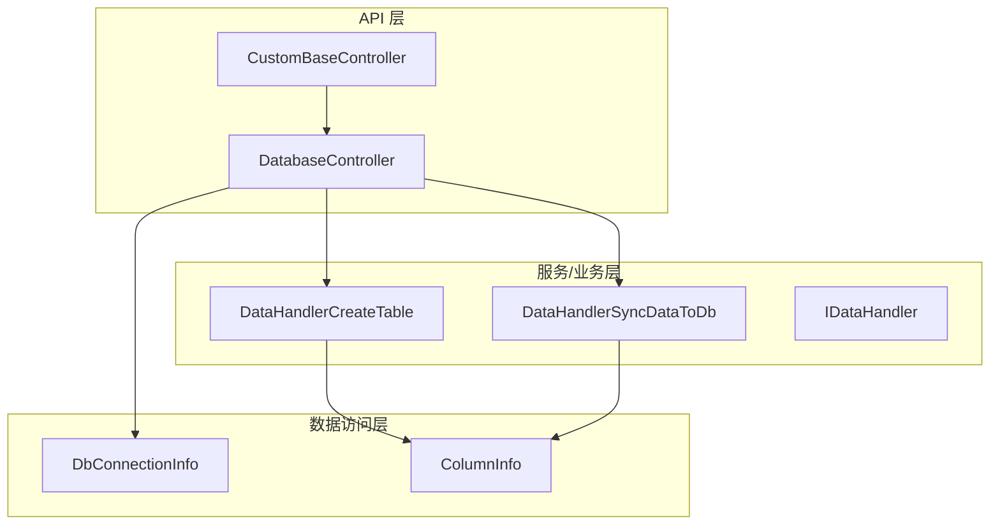
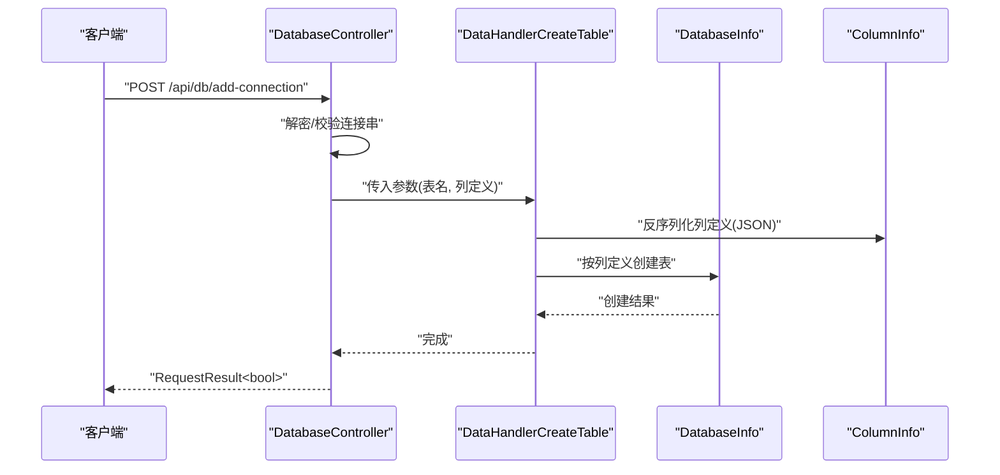
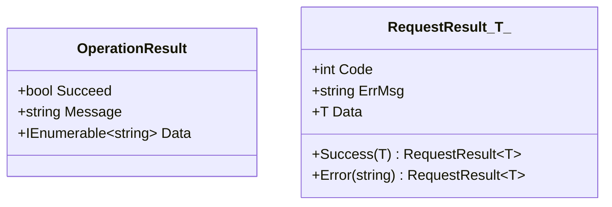
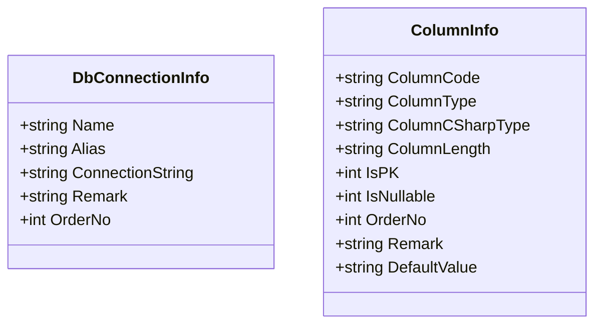
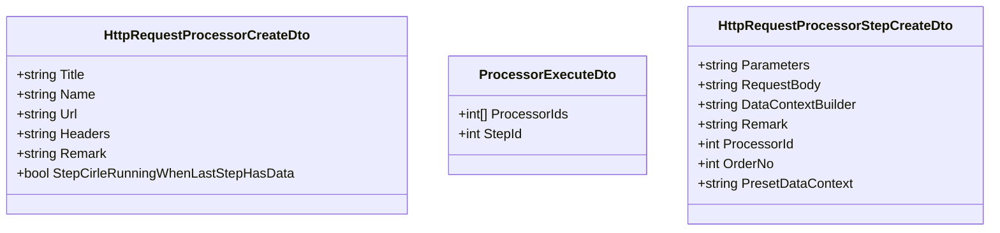
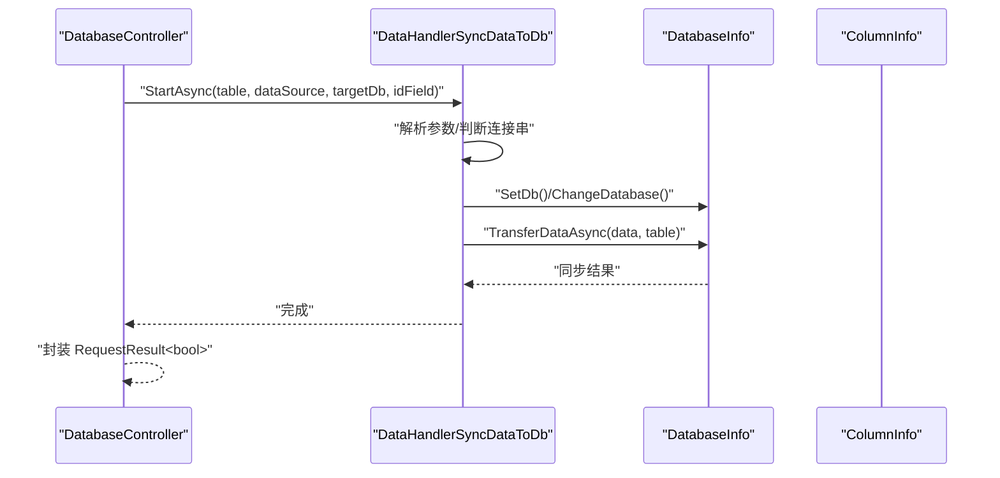
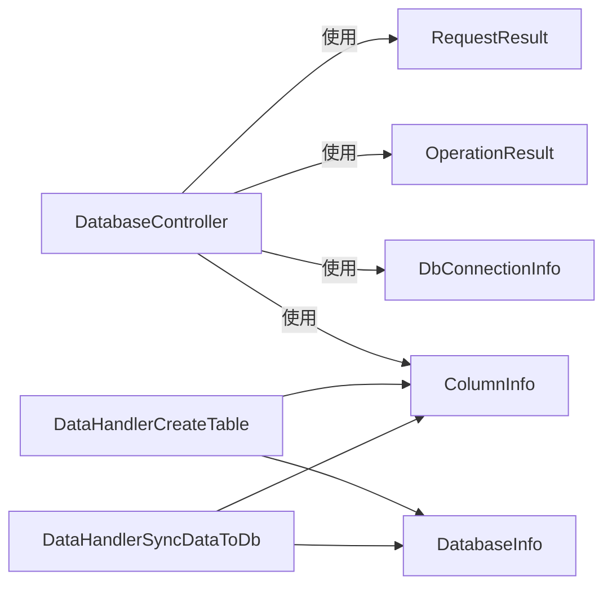

# DTO 对象结构

<cite>
**本文引用的文件**
- [OperationResult.cs](file://Sylas.RemoteTasks.Common/Dtos/OperationResult.cs)
- [RequestResult.cs](file://Sylas.RemoteTasks.Common/Dtos/RequestResult.cs)
- [DbConnectionInfo.cs](file://Sylas.RemoteTasks.Database/Dtos/DbConnectionInfo.cs)
- [ColumnInfo.cs](file://Sylas.RemoteTasks.Database/Dtos/ColumnInfo.cs)
- [DatabaseController.cs](file://Sylas.RemoteTasks.App/Controllers/DatabaseController.cs)
- [CustomBaseController.cs](file://Sylas.RemoteTasks.App/Controllers/CustomBaseController.cs)
- [DataHandlerCreateTable.cs](file://Sylas.RemoteTasks.App/DataHandlers/DataHandlerCreateTable.cs)
- [DataHandlerSyncDataToDb.cs](file://Sylas.RemoteTasks.App/DataHandlers/DataHandlerSyncDataToDb.cs)
- [IDataHandler.cs](file://Sylas.RemoteTasks.App/DataHandlers/IDataHandler.cs)
- [HttpRequestProcessorInDto.cs](file://Sylas.RemoteTasks.App/RequestProcessor/Models/Dtos/HttpRequestProcessorInDto.cs)
- [ProcessorExecuteDto.cs](file://Sylas.RemoteTasks.App/RequestProcessor/Models/Dtos/ProcessorExecuteDto.cs)
- [HttpRequestProcessorStepCreateDto.cs](file://Sylas.RemoteTasks.App/RequestProcessor/Models/Dtos/HttpRequestProcessorStepCreateDto.cs)
</cite>

## 目录
1. [引言](#引言)
2. [项目结构](#项目结构)
3. [核心组件](#核心组件)
4. [架构总览](#架构总览)
5. [详细组件分析](#详细组件分析)
6. [依赖关系分析](#依赖关系分析)
7. [性能考虑](#性能考虑)
8. [故障排查指南](#故障排查指南)
9. [结论](#结论)
10. [附录](#附录)

## 引言
本文件聚焦于 Sylas.RemoteTasks 中的 DTO 对象结构与使用模式，系统性梳理以下主题：
- OperationResult 与 RequestResult 的设计目的、状态语义与典型使用场景（成功/失败、数据承载、错误消息）。
- 数据库相关 DTO（DbConnectionInfo、ColumnInfo）的字段定义、用途与约束。
- DTO 在 API 层、服务层与数据访问层之间的流转路径与职责边界。
- 序列化/反序列化注意事项与性能优化建议。
- 常见 DTO 使用模式、数据验证与错误处理最佳实践。

## 项目结构
围绕 DTO 的分布与交互，项目采用“分层 + 聚合”的组织方式：
- API 层：控制器负责接收请求、封装响应，统一使用 RequestResult<T> 或 OperationResult。
- 业务/服务层：通过仓储或处理器执行具体任务，必要时返回 OperationResult 表达操作成功与否。
- 数据访问层：以实体/DTO 承载数据库元信息与数据模型，如 DbConnectionInfo、ColumnInfo。

**图表来源**
- [DatabaseController.cs](file://Sylas.RemoteTasks.App/Controllers/DatabaseController.cs#L1-L235)
- [CustomBaseController.cs](file://Sylas.RemoteTasks.App/Controllers/CustomBaseController.cs#L1-L145)
- [DataHandlerCreateTable.cs](file://Sylas.RemoteTasks.App/DataHandlers/DataHandlerCreateTable.cs#L1-L34)
- [DataHandlerSyncDataToDb.cs](file://Sylas.RemoteTasks.App/DataHandlers/DataHandlerSyncDataToDb.cs#L1-L65)
- [DbConnectionInfo.cs](file://Sylas.RemoteTasks.Database/Dtos/DbConnectionInfo.cs#L1-L34)
- [ColumnInfo.cs](file://Sylas.RemoteTasks.Database/Dtos/ColumnInfo.cs#L1-L55)

**章节来源**
- [DatabaseController.cs](file://Sylas.RemoteTasks.App/Controllers/DatabaseController.cs#L1-L235)
- [CustomBaseController.cs](file://Sylas.RemoteTasks.App/Controllers/CustomBaseController.cs#L1-L145)

## 核心组件
本节对关键 DTO 进行逐项解析，明确其字段、语义与适用场景。

- OperationResult
  - 设计目的：统一表达“操作是否成功”以及可选的错误消息与数据集合。
  - 关键字段与行为：
    - Succeed：布尔型，表示操作成功与否。
    - Message：字符串，用于承载错误或提示信息。
    - Data：字符串集合，用于返回操作产生的数据列表。
  - 使用场景：
    - 文件上传、删除等操作的结果反馈。
    - 控制器内部流程的中间结果传递。
  - 参考实现位置：[OperationResult.cs](file://Sylas.RemoteTasks.Common/Dtos/OperationResult.cs#L1-L52)

- RequestResult<T>
  - 设计目的：统一 API 响应格式，包含状态码、错误信息与泛型数据体。
  - 关键字段与行为：
    - Code：整数状态码，约定 1 表示成功，0 表示失败。
    - ErrMsg：字符串错误信息。
    - Data：泛型数据体，承载实际业务数据。
    - 静态工厂方法：Success(T)、Error(string)，便于快速构造标准响应。
  - 使用场景：
    - 控制器对外输出的标准响应。
    - 分页查询、增删改查等接口的统一返回。
  - 参考实现位置：[RequestResult.cs](file://Sylas.RemoteTasks.Common/Dtos/RequestResult.cs#L1-L65)

- DbConnectionInfo
  - 设计目的：持久化数据库连接信息，支持排序、别名与备注。
  - 关键字段与用途：
    - Name/Alias：连接名称与别名，便于识别与展示。
    - ConnectionString：连接字符串，可能经过加密存储。
    - Remark：备注说明。
    - OrderNo：排序字段，影响默认检索顺序。
  - 参考实现位置：[DbConnectionInfo.cs](file://Sylas.RemoteTasks.Database/Dtos/DbConnectionInfo.cs#L1-L34)

- ColumnInfo
  - 设计目的：描述数据库表字段的元信息，支撑建表、同步等场景。
  - 关键字段与用途：
    - ColumnCode：字段代码（标识符）。
    - ColumnType/ColumnCSharpType：字段类型与 C# 类型映射。
    - ColumnLength：字段长度。
    - IsPK/IsNullable：是否主键、是否允许空。
    - OrderNo/Remark/DefaultValue：排序、备注与默认值。
  - 参考实现位置：[ColumnInfo.cs](file://Sylas.RemoteTasks.Database/Dtos/ColumnInfo.cs#L1-L55)

**章节来源**
- [OperationResult.cs](file://Sylas.RemoteTasks.Common/Dtos/OperationResult.cs#L1-L52)
- [RequestResult.cs](file://Sylas.RemoteTasks.Common/Dtos/RequestResult.cs#L1-L65)
- [DbConnectionInfo.cs](file://Sylas.RemoteTasks.Database/Dtos/DbConnectionInfo.cs#L1-L34)
- [ColumnInfo.cs](file://Sylas.RemoteTasks.Database/Dtos/ColumnInfo.cs#L1-L55)

## 架构总览
下图展示了 DTO 在三层之间的流转：API 层接收请求参数（如 HttpRequestProcessorInDto），服务层通过处理器（如 DataHandlerCreateTable、DataHandlerSyncDataToDb）消费 DTO 并调用数据库能力；数据访问层以实体/DTO（DbConnectionInfo、ColumnInfo）承载数据与元信息。

**图表来源**
- [DatabaseController.cs](file://Sylas.RemoteTasks.App/Controllers/DatabaseController.cs#L49-L54)
- [DataHandlerCreateTable.cs](file://Sylas.RemoteTasks.App/DataHandlers/DataHandlerCreateTable.cs#L17-L31)
- [ColumnInfo.cs](file://Sylas.RemoteTasks.Database/Dtos/ColumnInfo.cs#L1-L55)

**章节来源**
- [DatabaseController.cs](file://Sylas.RemoteTasks.App/Controllers/DatabaseController.cs#L1-L235)
- [DataHandlerCreateTable.cs](file://Sylas.RemoteTasks.App/DataHandlers/DataHandlerCreateTable.cs#L1-L34)

## 详细组件分析

### OperationResult 与 RequestResult 的设计与使用
- 设计要点
  - OperationResult 适合“操作级”反馈，常用于控制器内部或文件处理等非标准 API 响应。
  - RequestResult<T> 适合“接口级”响应，统一状态码与数据载体，便于前端与 SDK 解析。
- 使用模式
  - 成功场景：RequestResult<T>.Success(T) 或 new RequestResult<T>(data)。
  - 失败场景：RequestResult.Error(string) 或 new RequestResult<T>(...) 携带错误信息。
  - 混合场景：控制器在业务失败时返回 OperationResult，再由上层包装为 RequestResult。
- 参考位置
  - [DatabaseController.cs](file://Sylas.RemoteTasks.App/Controllers/DatabaseController.cs#L65-L66)
  - [CustomBaseController.cs](file://Sylas.RemoteTasks.App/Controllers/CustomBaseController.cs#L21-L45)

**图表来源**
- [OperationResult.cs](file://Sylas.RemoteTasks.Common/Dtos/OperationResult.cs#L1-L52)
- [RequestResult.cs](file://Sylas.RemoteTasks.Common/Dtos/RequestResult.cs#L1-L65)

**章节来源**
- [OperationResult.cs](file://Sylas.RemoteTasks.Common/Dtos/OperationResult.cs#L1-L52)
- [RequestResult.cs](file://Sylas.RemoteTasks.Common/Dtos/RequestResult.cs#L1-L65)
- [DatabaseController.cs](file://Sylas.RemoteTasks.App/Controllers/DatabaseController.cs#L65-L66)
- [CustomBaseController.cs](file://Sylas.RemoteTasks.App/Controllers/CustomBaseController.cs#L21-L45)

### 数据库相关 DTO：DbConnectionInfo 与 ColumnInfo
- DbConnectionInfo
  - 字段语义与用途：名称、别名、连接串、备注、排序，支撑连接管理与检索。
  - 安全注意：连接串可能经加密存储，读取时需解密。
  - 参考位置：[DbConnectionInfo.cs](file://Sylas.RemoteTasks.Database/Dtos/DbConnectionInfo.cs#L1-L34)
- ColumnInfo
  - 字段语义与用途：字段标识、类型、长度、主键/可空、排序、备注、默认值。
  - 参考位置：[ColumnInfo.cs](file://Sylas.RemoteTasks.Database/Dtos/ColumnInfo.cs#L1-L55)

**图表来源**
- [DbConnectionInfo.cs](file://Sylas.RemoteTasks.Database/Dtos/DbConnectionInfo.cs#L1-L34)
- [ColumnInfo.cs](file://Sylas.RemoteTasks.Database/Dtos/ColumnInfo.cs#L1-L55)

**章节来源**
- [DbConnectionInfo.cs](file://Sylas.RemoteTasks.Database/Dtos/DbConnectionInfo.cs#L1-L34)
- [ColumnInfo.cs](file://Sylas.RemoteTasks.Database/Dtos/ColumnInfo.cs#L1-L55)

### 请求处理器 DTO：HttpRequestProcessorInDto、ProcessorExecuteDto、HttpRequestProcessorStepCreateDto
- HttpRequestProcessorInDto
  - 用途：创建请求处理器时的输入参数，包含标题、名称、URL、请求头、备注及循环运行策略。
  - 参考位置：[HttpRequestProcessorInDto.cs](file://Sylas.RemoteTasks.App/RequestProcessor/Models/Dtos/HttpRequestProcessorInDto.cs#L1-L13)
- ProcessorExecuteDto
  - 用途：执行请求处理器的输入参数，包含处理器 ID 数组与步骤 ID。
  - 参考位置：[ProcessorExecuteDto.cs](file://Sylas.RemoteTasks.App/RequestProcessor/Models/Dtos/ProcessorExecuteDto.cs#L1-L9)
- HttpRequestProcessorStepCreateDto
  - 用途：创建请求处理器步骤的输入参数，包含参数、请求体、上下文构建器、备注、处理器 ID、排序与预设上下文。
  - 参考位置：[HttpRequestProcessorStepCreateDto.cs](file://Sylas.RemoteTasks.App/RequestProcessor/Models/Dtos/HttpRequestProcessorStepCreateDto.cs#L1-L15)

**图表来源**
- [HttpRequestProcessorInDto.cs](file://Sylas.RemoteTasks.App/RequestProcessor/Models/Dtos/HttpRequestProcessorInDto.cs#L1-L13)
- [ProcessorExecuteDto.cs](file://Sylas.RemoteTasks.App/RequestProcessor/Models/Dtos/ProcessorExecuteDto.cs#L1-L9)
- [HttpRequestProcessorStepCreateDto.cs](file://Sylas.RemoteTasks.App/RequestProcessor/Models/Dtos/HttpRequestProcessorStepCreateDto.cs#L1-L15)

**章节来源**
- [HttpRequestProcessorInDto.cs](file://Sylas.RemoteTasks.App/RequestProcessor/Models/Dtos/HttpRequestProcessorInDto.cs#L1-L13)
- [ProcessorExecuteDto.cs](file://Sylas.RemoteTasks.App/RequestProcessor/Models/Dtos/ProcessorExecuteDto.cs#L1-L9)
- [HttpRequestProcessorStepCreateDto.cs](file://Sylas.RemoteTasks.App/RequestProcessor/Models/Dtos/HttpRequestProcessorStepCreateDto.cs#L1-L15)

### DTO 在 API 层、服务层与数据访问层的流转
- API 层（控制器）
  - 接收请求参数 DTO（如 HttpRequestProcessorInDto），进行参数校验与安全处理（如连接串加解密）。
  - 统一返回 RequestResult<T> 或 OperationResult，保证响应一致性。
  - 参考位置：[DatabaseController.cs](file://Sylas.RemoteTasks.App/Controllers/DatabaseController.cs#L30-L43)
- 服务层（处理器）
  - 实现 IDataHandler 接口，消费 DTO 并调用数据库能力。
  - 示例：DataHandlerCreateTable 将列定义 JSON 反序列化为 ColumnInfo 列表后创建表；DataHandlerSyncDataToDb 将数据源同步至目标数据库。
  - 参考位置：
    - [IDataHandler.cs](file://Sylas.RemoteTasks.App/DataHandlers/IDataHandler.cs#L1-L8)
    - [DataHandlerCreateTable.cs](file://Sylas.RemoteTasks.App/DataHandlers/DataHandlerCreateTable.cs#L17-L31)
    - [DataHandlerSyncDataToDb.cs](file://Sylas.RemoteTasks.App/DataHandlers/DataHandlerSyncDataToDb.cs#L18-L62)
- 数据访问层
  - 使用 DbConnectionInfo、ColumnInfo 等承载数据库元信息与数据模型。
  - 参考位置：[DbConnectionInfo.cs](file://Sylas.RemoteTasks.Database/Dtos/DbConnectionInfo.cs#L1-L34)，[ColumnInfo.cs](file://Sylas.RemoteTasks.Database/Dtos/ColumnInfo.cs#L1-L55)

**图表来源**
- [DatabaseController.cs](file://Sylas.RemoteTasks.App/Controllers/DatabaseController.cs#L115-L138)
- [DataHandlerSyncDataToDb.cs](file://Sylas.RemoteTasks.App/DataHandlers/DataHandlerSyncDataToDb.cs#L18-L62)

**章节来源**
- [DatabaseController.cs](file://Sylas.RemoteTasks.App/Controllers/DatabaseController.cs#L1-L235)
- [DataHandlerCreateTable.cs](file://Sylas.RemoteTasks.App/DataHandlers/DataHandlerCreateTable.cs#L1-L34)
- [DataHandlerSyncDataToDb.cs](file://Sylas.RemoteTasks.App/DataHandlers/DataHandlerSyncDataToDb.cs#L1-L65)
- [IDataHandler.cs](file://Sylas.RemoteTasks.App/DataHandlers/IDataHandler.cs#L1-L8)

## 依赖关系分析
- 控制器依赖：
  - DatabaseController 依赖 RequestResult<T>、OperationResult、DbConnectionInfo、ColumnInfo 等。
  - CustomBaseController 提供文件上传/删除等通用能力，返回 OperationResult。
- 处理器依赖：
  - DataHandlerCreateTable 依赖 DatabaseInfo 与 ColumnInfo。
  - DataHandlerSyncDataToDb 依赖 DatabaseInfo，处理连接串与数据同步。
- 依赖耦合与内聚：
  - DTO 与控制器/处理器之间通过参数传递，耦合度低、内聚度高。
  - 处理器通过接口 IDataHandler 抽象，便于扩展与替换。

**图表来源**
- [DatabaseController.cs](file://Sylas.RemoteTasks.App/Controllers/DatabaseController.cs#L1-L235)
- [DataHandlerCreateTable.cs](file://Sylas.RemoteTasks.App/DataHandlers/DataHandlerCreateTable.cs#L1-L34)
- [DataHandlerSyncDataToDb.cs](file://Sylas.RemoteTasks.App/DataHandlers/DataHandlerSyncDataToDb.cs#L1-L65)
- [RequestResult.cs](file://Sylas.RemoteTasks.Common/Dtos/RequestResult.cs#L1-L65)
- [OperationResult.cs](file://Sylas.RemoteTasks.Common/Dtos/OperationResult.cs#L1-L52)
- [DbConnectionInfo.cs](file://Sylas.RemoteTasks.Database/Dtos/DbConnectionInfo.cs#L1-L34)
- [ColumnInfo.cs](file://Sylas.RemoteTasks.Database/Dtos/ColumnInfo.cs#L1-L55)

**章节来源**
- [DatabaseController.cs](file://Sylas.RemoteTasks.App/Controllers/DatabaseController.cs#L1-L235)
- [DataHandlerCreateTable.cs](file://Sylas.RemoteTasks.App/DataHandlers/DataHandlerCreateTable.cs#L1-L34)
- [DataHandlerSyncDataToDb.cs](file://Sylas.RemoteTasks.App/DataHandlers/DataHandlerSyncDataToDb.cs#L1-L65)

## 性能考虑
- 序列化/反序列化
  - 列定义 JSON 大量时，建议分批处理，避免一次性反序列化过大数据集。
  - 使用强类型 DTO（如 ColumnInfo）替代动态对象，减少反射与装箱开销。
- 响应体积
  - RequestResult<T> 中 Data 字段仅承载必要数据，避免返回冗余字段。
- I/O 与网络
  - 数据同步时优先批量插入/更新，减少往返次数。
  - 连接串解析与切换（SetDb/ChangeDatabase）应缓存有效连接，避免重复解析。
- 内存与并发
  - 处理器参数使用 params object[] 时，注意参数数量与类型校验，避免不必要的内存拷贝。
  - 文件上传/下载场景，使用流式处理，避免大文件加载到内存。

## 故障排查指南
- 常见问题与定位
  - 参数不足：处理器抛出异常提示参数不足，检查调用方传参是否完整。
    - 参考位置：[DataHandlerCreateTable.cs](file://Sylas.RemoteTasks.App/DataHandlers/DataHandlerCreateTable.cs#L21-L22)
    - 参考位置：[DataHandlerSyncDataToDb.cs](file://Sylas.RemoteTasks.App/DataHandlers/DataHandlerSyncDataToDb.cs#L20-L23)
  - 连接串关键字校验失败：还原数据库前会校验关键字白名单，若不匹配则返回错误。
    - 参考位置：[DatabaseController.cs](file://Sylas.RemoteTasks.App/Controllers/DatabaseController.cs#L224-L228)
  - 记录不存在：更新/克隆/删除等操作前先查询，不存在时返回明确错误。
    - 参考位置：[DatabaseController.cs](file://Sylas.RemoteTasks.App/Controllers/DatabaseController.cs#L87-L90)
- 错误处理最佳实践
  - 统一使用 RequestResult<T>.Error(string) 或 new RequestResult<T>(...) 携带 ErrMsg。
  - 对敏感信息（如连接串）进行加解密处理，避免明文存储与传输。
  - 对外响应保持一致的 Code/ErrMsg/Data 结构，便于前端统一处理。

**章节来源**
- [DataHandlerCreateTable.cs](file://Sylas.RemoteTasks.App/DataHandlers/DataHandlerCreateTable.cs#L1-L34)
- [DataHandlerSyncDataToDb.cs](file://Sylas.RemoteTasks.App/DataHandlers/DataHandlerSyncDataToDb.cs#L1-L65)
- [DatabaseController.cs](file://Sylas.RemoteTasks.App/Controllers/DatabaseController.cs#L213-L232)

## 结论
- OperationResult 与 RequestResult<T> 分别承担“操作级”与“接口级”的统一响应语义，提升系统一致性与可维护性。
- DbConnectionInfo 与 ColumnInfo 作为数据库元信息的核心 DTO，支撑连接管理与建表/同步等关键能力。
- 通过清晰的分层与接口抽象（如 IDataHandler），DTO 在 API、服务与数据访问层之间高效流转，职责边界明确。
- 建议在生产环境中强化参数校验、错误处理与序列化性能优化，确保系统稳定与高性能。

## 附录
- 常用 DTO 使用模式速查
  - 成功响应：RequestResult<T>.Success(data)
  - 失败响应：RequestResult.Error(msg)
  - 操作结果：new OperationResult(true/false[, message/data])
- 数据验证建议
  - 控制器层：使用模型绑定与验证特性，提前拦截非法输入。
  - 业务层：对关键参数（如表名、列定义）进行格式与范围校验。
- 错误处理建议
  - 统一捕获异常并转换为 RequestResult/Error，保留关键上下文信息但避免泄露敏感细节。