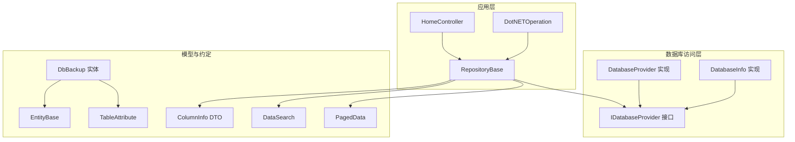
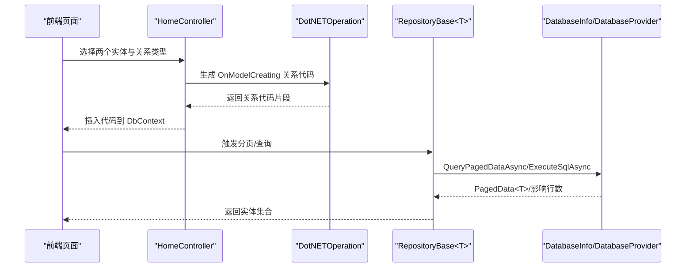
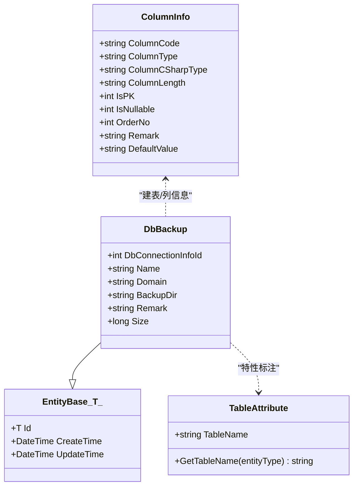
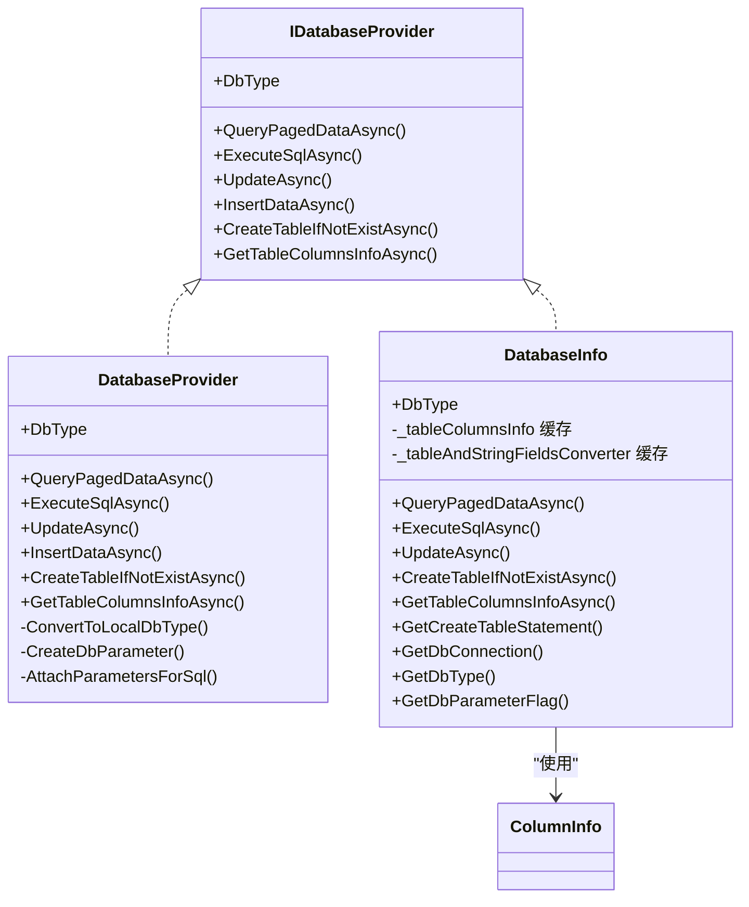
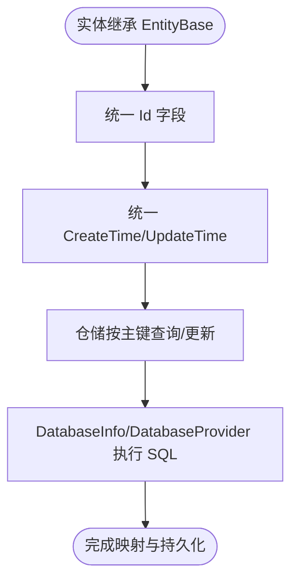
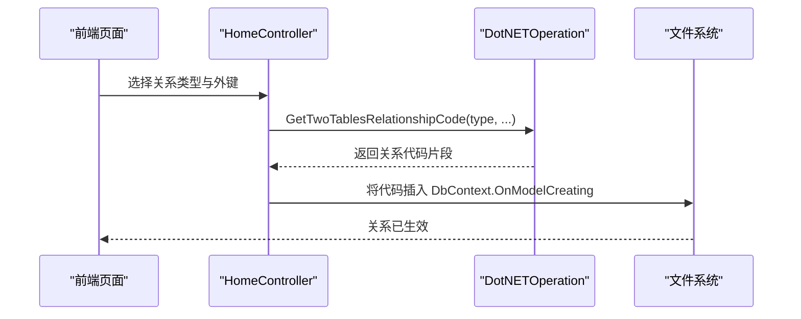
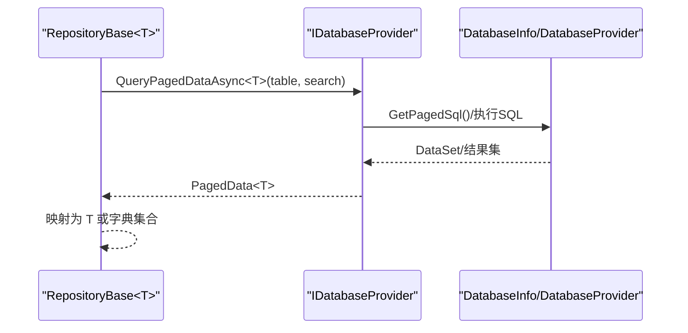
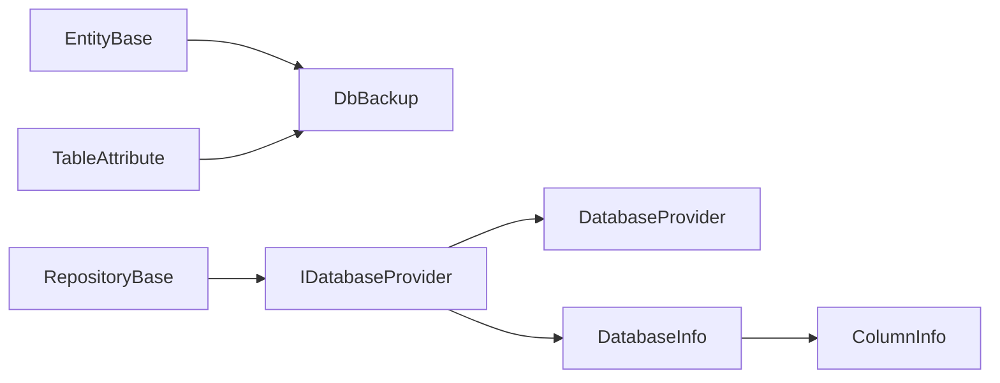

# 关系映射

<cite>
**本文引用的文件**
- [EntityBase.cs](file://Sylas.RemoteTasks.Database/EntityBase.cs)
- [TableAttribute.cs](file://Sylas.RemoteTasks.Database/Attributes/TableAttribute.cs)
- [IDatabaseProvider.cs](file://Sylas.RemoteTasks.Database/IDatabaseProvider.cs)
- [DatabaseProvider.cs](file://Sylas.RemoteTasks.Database/DatabaseProvider.cs)
- [DatabaseInfo.cs](file://Sylas.RemoteTasks.Database/SyncBase/DatabaseInfo.cs)
- [DbBackup.cs](file://Sylas.RemoteTasks.App/DatabaseManager/Models/DbBackup.cs)
- [RepositoryBase.cs](file://Sylas.RemoteTasks.App/Infrastructure/RepositoryBase.cs)
- [DotNETOperation.cs](file://Sylas.RemoteTasks.App/Infrastructure/DotNETOperation.cs)
- [HomeController.cs](file://Sylas.RemoteTasks.App/Controllers/HomeController.cs)
- [ColumnInfo.cs](file://Sylas.RemoteTasks.Database/Dtos/ColumnInfo.cs)
- [DataSearch.cs](file://Sylas.RemoteTasks.Database/SyncBase/DataSearch.cs)
- [PagedData.cs](file://Sylas.RemoteTasks.Database/SyncBase/PagedData.cs)
- [README.md](file://Sylas.RemoteTasks.Database/README.md)
</cite>

## 目录
1. [简介](#简介)
2. [项目结构](#项目结构)
3. [核心组件](#核心组件)
4. [架构总览](#架构总览)
5. [详细组件分析](#详细组件分析)
6. [依赖分析](#依赖分析)
7. [性能考虑](#性能考虑)
8. [故障排查指南](#故障排查指南)
9. [结论](#结论)
10. [附录](#附录)

## 简介
本文件系统化阐述 Sylas.RemoteTasks 中“关系映射”机制的设计与实现，重点覆盖以下方面：
- 实体与数据库表之间的映射规则与约定（含表名约定、主键与时间戳约定）
- DatabaseProvider 与 IDatabaseProvider 在关系映射中的职责边界与协作方式
- 泛型基类 EntityBase 如何统一支撑不同实体类型的通用行为
- 复杂关系映射的实现思路（一对一、一对多、多对多），以及在本项目中的落地方式
- 映射配置的灵活性与扩展性设计
- 性能优化策略与缓存机制
- 常见问题定位与排错建议

## 项目结构
围绕关系映射的关键模块分布如下：
- 数据库访问层：IDatabaseProvider、DatabaseProvider、DatabaseInfo
- 实体与映射约定：EntityBase、TableAttribute
- 应用侧仓储与控制器：RepositoryBase、HomeController、DotNETOperation
- 数据模型与工具：DbBackup、ColumnInfo、DataSearch、PagedData

图表来源
- [RepositoryBase.cs](file://Sylas.RemoteTasks.App/Infrastructure/RepositoryBase.cs#L10-L25)
- [HomeController.cs](file://Sylas.RemoteTasks.App/Controllers/HomeController.cs#L690-L729)
- [DotNETOperation.cs](file://Sylas.RemoteTasks.App/Infrastructure/DotNETOperation.cs#L169-L191)
- [IDatabaseProvider.cs](file://Sylas.RemoteTasks.Database/IDatabaseProvider.cs#L12-L97)
- [DatabaseProvider.cs](file://Sylas.RemoteTasks.Database/DatabaseProvider.cs#L19-L484)
- [DatabaseInfo.cs](file://Sylas.RemoteTasks.Database/SyncBase/DatabaseInfo.cs#L64-L88)
- [EntityBase.cs](file://Sylas.RemoteTasks.Database/EntityBase.cs#L9-L31)
- [TableAttribute.cs](file://Sylas.RemoteTasks.Database/Attributes/TableAttribute.cs#L14-L31)
- [DbBackup.cs](file://Sylas.RemoteTasks.App/DatabaseManager/Models/DbBackup.cs#L9-L46)
- [ColumnInfo.cs](file://Sylas.RemoteTasks.Database/Dtos/ColumnInfo.cs#L6-L54)
- [DataSearch.cs](file://Sylas.RemoteTasks.Database/SyncBase/DataSearch.cs#L8-L48)
- [PagedData.cs](file://Sylas.RemoteTasks.Database/SyncBase/PagedData.cs#L30-L44)

章节来源
- [README.md](file://Sylas.RemoteTasks.Database/README.md#L1-L24)

## 核心组件
- 实体基类与约定
  - EntityBase<T>：统一提供 Id、CreateTime、UpdateTime 等通用字段，便于仓储与业务层统一处理。
  - TableAttribute：通过特性标注实体对应的数据库表名，若未标注则默认使用类型名作为表名。
- 数据库访问接口与实现
  - IDatabaseProvider：定义分页查询、执行 SQL、动态更新、插入、建表、列信息等能力。
  - DatabaseProvider：基于 SqlClient 的具体实现，负责参数化、连接管理、分页 SQL 生成与执行。
  - DatabaseInfo：更通用的数据库信息与操作封装，支持多种数据库类型，内置缓存与高性能批量处理。
- 应用侧仓储与控制器
  - RepositoryBase<T>：基于 IDatabaseProvider 的仓储基类，提供分页、新增、更新、删除等通用能力。
  - HomeController：提供“建立实体间关系”的前端交互与后端处理流程。
  - DotNETOperation：生成 EF Core OnModelCreating 中的 HasOne/WithMany 等关系代码。

章节来源
- [EntityBase.cs](file://Sylas.RemoteTasks.Database/EntityBase.cs#L9-L31)
- [TableAttribute.cs](file://Sylas.RemoteTasks.Database/Attributes/TableAttribute.cs#L14-L31)
- [IDatabaseProvider.cs](file://Sylas.RemoteTasks.Database/IDatabaseProvider.cs#L12-L97)
- [DatabaseProvider.cs](file://Sylas.RemoteTasks.Database/DatabaseProvider.cs#L19-L484)
- [DatabaseInfo.cs](file://Sylas.RemoteTasks.Database/SyncBase/DatabaseInfo.cs#L64-L88)
- [RepositoryBase.cs](file://Sylas.RemoteTasks.App/Infrastructure/RepositoryBase.cs#L10-L25)
- [HomeController.cs](file://Sylas.RemoteTasks.App/Controllers/HomeController.cs#L690-L729)
- [DotNETOperation.cs](file://Sylas.RemoteTasks.App/Infrastructure/DotNETOperation.cs#L169-L191)

## 架构总览
关系映射在本项目中体现为“实体-特性-仓储-数据库访问层”的协同：
- 实体通过 TableAttribute 指定表名；仓储通过 DbTableInfo<T> 获取表名与列信息；数据库访问层负责执行 SQL、参数化与分页。
- 对于复杂关系（如一对一、一对多、多对多），项目提供了“前端勾选实体与外键，后端生成 EF Core OnModelCreating 代码”的能力，便于在应用层显式声明关系。

图表来源
- [HomeController.cs](file://Sylas.RemoteTasks.App/Controllers/HomeController.cs#L690-L729)
- [DotNETOperation.cs](file://Sylas.RemoteTasks.App/Infrastructure/DotNETOperation.cs#L169-L191)
- [RepositoryBase.cs](file://Sylas.RemoteTasks.App/Infrastructure/RepositoryBase.cs#L20-L25)
- [DatabaseInfo.cs](file://Sylas.RemoteTasks.Database/SyncBase/DatabaseInfo.cs#L309-L351)
- [DatabaseProvider.cs](file://Sylas.RemoteTasks.Database/DatabaseProvider.cs#L337-L370)

## 详细组件分析

### 实体与表映射约定
- 表名约定
  - 通过 TableAttribute 指定表名；若未标注，则默认使用实体类型名。
  - 示例：DbBackup 实体标注了表名为 “DbBackups”，符合约定。
- 主键与时间戳
  - EntityBase<T> 统一提供 Id、CreateTime、UpdateTime 字段，便于仓储按主键查询与更新。
- 列信息与类型映射
  - ColumnInfo 描述字段代码、类型、长度、是否主键、是否可空、排序、备注、默认值等，用于建表与参数化。

图表来源
- [EntityBase.cs](file://Sylas.RemoteTasks.Database/EntityBase.cs#L9-L31)
- [TableAttribute.cs](file://Sylas.RemoteTasks.Database/Attributes/TableAttribute.cs#L14-L31)
- [DbBackup.cs](file://Sylas.RemoteTasks.App/DatabaseManager/Models/DbBackup.cs#L9-L46)
- [ColumnInfo.cs](file://Sylas.RemoteTasks.Database/Dtos/ColumnInfo.cs#L6-L54)

章节来源
- [TableAttribute.cs](file://Sylas.RemoteTasks.Database/Attributes/TableAttribute.cs#L25-L30)
- [DbBackup.cs](file://Sylas.RemoteTasks.App/DatabaseManager/Models/DbBackup.cs#L9-L46)
- [EntityBase.cs](file://Sylas.RemoteTasks.Database/EntityBase.cs#L22-L30)
- [ColumnInfo.cs](file://Sylas.RemoteTasks.Database/Dtos/ColumnInfo.cs#L11-L43)

### DatabaseProvider 与 IDatabaseProvider 的角色
- IDatabaseProvider
  - 定义统一的数据库操作契约：分页查询、执行 SQL、动态更新、插入、建表、列信息等。
- DatabaseProvider
  - 基于 SqlClient 的实现，负责参数化、连接管理、分页 SQL 生成与执行。
  - 支持通过 db 或 connectionString 切换数据库，支持字符串与非字符串参数的参数化。
- DatabaseInfo
  - 更通用的数据库信息与操作封装，支持多种数据库类型（MySql、SqlServer、Oracle、Pg、Sqlite、Dm）。
  - 内置缓存（如表列信息缓存、字段转换器缓存）提升性能。
  - 提供分页查询、动态更新、建表、列信息、数据迁移等高级能力。

图表来源
- [IDatabaseProvider.cs](file://Sylas.RemoteTasks.Database/IDatabaseProvider.cs#L12-L97)
- [DatabaseProvider.cs](file://Sylas.RemoteTasks.Database/DatabaseProvider.cs#L19-L484)
- [DatabaseInfo.cs](file://Sylas.RemoteTasks.Database/SyncBase/DatabaseInfo.cs#L64-L88)
- [ColumnInfo.cs](file://Sylas.RemoteTasks.Database/Dtos/ColumnInfo.cs#L6-L54)

章节来源
- [IDatabaseProvider.cs](file://Sylas.RemoteTasks.Database/IDatabaseProvider.cs#L12-L97)
- [DatabaseProvider.cs](file://Sylas.RemoteTasks.Database/DatabaseProvider.cs#L52-L311)
- [DatabaseInfo.cs](file://Sylas.RemoteTasks.Database/SyncBase/DatabaseInfo.cs#L309-L351)

### 泛型基类 EntityBase 的统一处理
- 统一字段：Id、CreateTime、UpdateTime，便于仓储按主键查询与自动更新时间戳。
- 泛型约束：RepositoryBase<T> 约束 T : EntityBase<int>，确保仓储操作面向统一的实体基类。
- 与 TableAttribute 协作：DbBackup 等实体继承 EntityBase<int> 并通过 TableAttribute 指定表名，形成“类型-表”的稳定映射。

图表来源
- [EntityBase.cs](file://Sylas.RemoteTasks.Database/EntityBase.cs#L9-L31)
- [RepositoryBase.cs](file://Sylas.RemoteTasks.App/Infrastructure/RepositoryBase.cs#L10-L25)

章节来源
- [EntityBase.cs](file://Sylas.RemoteTasks.Database/EntityBase.cs#L14-L30)
- [RepositoryBase.cs](file://Sylas.RemoteTasks.App/Infrastructure/RepositoryBase.cs#L10-L25)

### 复杂关系映射的实现示例
- 一对一
  - 通过 DotNETOperation 生成 HasOne(...).HasOne(...) 的关系代码，适用于“双向一对一”场景。
- 一对多
  - 通过 DotNETOperation 生成 HasOne(...).WithMany(...) 的关系代码，适用于“一的一端”与“多的一端”的典型关系。
- 多对多
  - 项目未直接提供多对多的实体生成与关系代码生成逻辑；可通过中间表与一对多组合实现，或在应用层自行扩展。

图表来源
- [HomeController.cs](file://Sylas.RemoteTasks.App/Controllers/HomeController.cs#L690-L729)
- [DotNETOperation.cs](file://Sylas.RemoteTasks.App/Infrastructure/DotNETOperation.cs#L169-L191)

章节来源
- [DotNETOperation.cs](file://Sylas.RemoteTasks.App/Infrastructure/DotNETOperation.cs#L169-L191)
- [HomeController.cs](file://Sylas.RemoteTasks.App/Controllers/HomeController.cs#L690-L729)

### 分页查询与数据映射流程
- 分页查询
  - RepositoryBase<T> 调用 IDatabaseProvider 的 QueryPagedDataAsync<T>，内部由 DatabaseInfo/DatabaseProvider 生成分页 SQL、执行并返回 PagedData<T>。
- 类型映射
  - 若 T 为字典类型，直接返回字典集合；否则通过序列化/反序列化映射到 T。

图表来源
- [RepositoryBase.cs](file://Sylas.RemoteTasks.App/Infrastructure/RepositoryBase.cs#L20-L25)
- [DatabaseInfo.cs](file://Sylas.RemoteTasks.Database/SyncBase/DatabaseInfo.cs#L309-L351)
- [DatabaseProvider.cs](file://Sylas.RemoteTasks.Database/DatabaseProvider.cs#L337-L370)
- [PagedData.cs](file://Sylas.RemoteTasks.Database/SyncBase/PagedData.cs#L30-L44)

章节来源
- [RepositoryBase.cs](file://Sylas.RemoteTasks.App/Infrastructure/RepositoryBase.cs#L20-L25)
- [DatabaseInfo.cs](file://Sylas.RemoteTasks.Database/SyncBase/DatabaseInfo.cs#L309-L351)
- [DatabaseProvider.cs](file://Sylas.RemoteTasks.Database/DatabaseProvider.cs#L337-L370)
- [PagedData.cs](file://Sylas.RemoteTasks.Database/SyncBase/PagedData.cs#L30-L44)

## 依赖分析
- 耦合与内聚
  - RepositoryBase<T> 依赖 IDatabaseProvider，内聚于仓储操作；DbBackup 等实体依赖 EntityBase<T> 与 TableAttribute，内聚于映射约定。
- 外部依赖
  - DatabaseInfo 支持多种数据库类型，通过连接字符串识别数据库类型并生成相应 SQL。
- 循环依赖
  - 未发现循环依赖；各层职责清晰：模型层（实体+特性）、仓储层（RepositoryBase）、数据库访问层（IDatabaseProvider 实现）。

图表来源
- [EntityBase.cs](file://Sylas.RemoteTasks.Database/EntityBase.cs#L9-L31)
- [TableAttribute.cs](file://Sylas.RemoteTasks.Database/Attributes/TableAttribute.cs#L14-L31)
- [DbBackup.cs](file://Sylas.RemoteTasks.App/DatabaseManager/Models/DbBackup.cs#L9-L46)
- [RepositoryBase.cs](file://Sylas.RemoteTasks.App/Infrastructure/RepositoryBase.cs#L10-L12)
- [IDatabaseProvider.cs](file://Sylas.RemoteTasks.Database/IDatabaseProvider.cs#L12-L17)
- [DatabaseProvider.cs](file://Sylas.RemoteTasks.Database/DatabaseProvider.cs#L19-L45)
- [DatabaseInfo.cs](file://Sylas.RemoteTasks.Database/SyncBase/DatabaseInfo.cs#L64-L88)
- [ColumnInfo.cs](file://Sylas.RemoteTasks.Database/Dtos/ColumnInfo.cs#L6-L54)

章节来源
- [RepositoryBase.cs](file://Sylas.RemoteTasks.App/Infrastructure/RepositoryBase.cs#L10-L12)
- [DatabaseInfo.cs](file://Sylas.RemoteTasks.Database/SyncBase/DatabaseInfo.cs#L64-L88)

## 性能考虑
- 连接与参数化
  - DatabaseProvider 支持字符串参数与非字符串参数的参数化，避免 SQL 注入并提高执行计划复用率。
- 缓存机制
  - DatabaseInfo 内置两类缓存：
    - 表列信息缓存：_tableColumnsInfo，键为“连接串_表名”，减少重复查询列元数据。
    - 字段转换器缓存：_tableAndStringFieldsConverter，按表与字段类型生成转换器，避免重复反射与表达式构建。
- 批量与事务
  - DatabaseInfo/DatabaseProvider 在执行多条 SQL 时使用事务，保证一致性与性能。
- 分页与类型映射
  - 分页查询支持字典与强类型两种返回，减少不必要的对象装箱与反序列化成本。

章节来源
- [DatabaseProvider.cs](file://Sylas.RemoteTasks.Database/DatabaseProvider.cs#L266-L311)
- [DatabaseInfo.cs](file://Sylas.RemoteTasks.Database/SyncBase/DatabaseInfo.cs#L515-L549)
- [DatabaseInfo.cs](file://Sylas.RemoteTasks.Database/SyncBase/DatabaseInfo.cs#L3767-L3780)

## 故障排查指南
- 表不存在
  - DatabaseInfo 提供 CreateTableIfNotExistAsync，可在运行时自动创建表。
- 列信息缺失
  - 使用 GetTableColumnsInfoAsync 获取列信息，结合 ColumnInfo 进行诊断。
- 参数化错误
  - 确认参数名与类型匹配；DatabaseProvider 提供 CreateDbParameter 与 AttachParametersForSql。
- 关系代码生成失败
  - 检查 HomeController 的参数校验与 DotNETOperation 的关系代码生成逻辑，确保实体名、外键与关系类型正确。

章节来源
- [DatabaseInfo.cs](file://Sylas.RemoteTasks.Database/SyncBase/DatabaseInfo.cs#L744-L759)
- [DatabaseInfo.cs](file://Sylas.RemoteTasks.Database/SyncBase/DatabaseInfo.cs#L3742-L3750)
- [DatabaseProvider.cs](file://Sylas.RemoteTasks.Database/DatabaseProvider.cs#L266-L311)
- [HomeController.cs](file://Sylas.RemoteTasks.App/Controllers/HomeController.cs#L697-L709)
- [DotNETOperation.cs](file://Sylas.RemoteTasks.App/Infrastructure/DotNETOperation.cs#L169-L191)

## 结论
本项目的“关系映射”机制以“实体-特性-仓储-数据库访问层”为主线，通过 TableAttribute 与 EntityBase<T> 约定表名与通用字段，借助 IDatabaseProvider 的统一接口与 DatabaseProvider/DatabaseInfo 的实现，实现了跨数据库的高效映射与操作。对于复杂关系，项目提供了前端驱动的 EF Core 关系代码生成能力，便于在应用层显式声明关系。同时，通过缓存与参数化等手段，兼顾了灵活性与性能。

## 附录
- 数据库类型支持与分页 SQL 生成：参见 DatabaseInfo 的 GetDbType、GetPagedSql 等方法。
- 查询参数 DataSearch：支持分页、过滤、排序规则，默认值与构造初始化。
- 分页返回 PagedData<T>：包含 Count、TotalPages、Data 等字段。

章节来源
- [README.md](file://Sylas.RemoteTasks.Database/README.md#L2-L24)
- [DataSearch.cs](file://Sylas.RemoteTasks.Database/SyncBase/DataSearch.cs#L8-L48)
- [PagedData.cs](file://Sylas.RemoteTasks.Database/SyncBase/PagedData.cs#L30-L44)