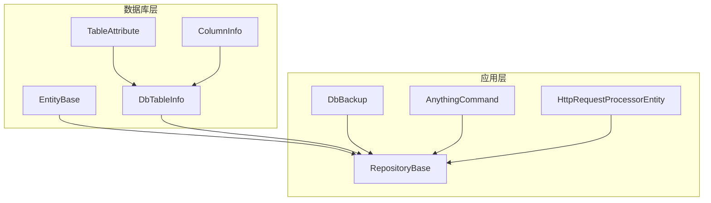
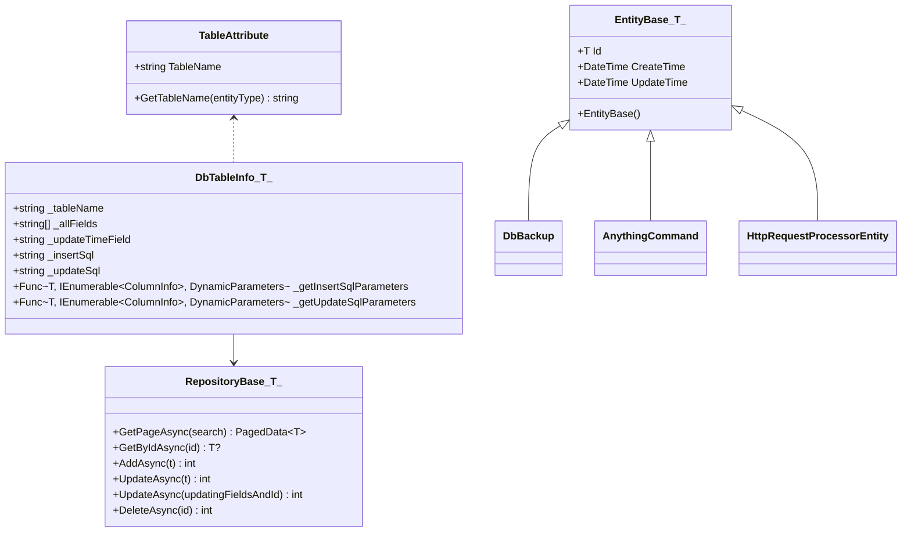
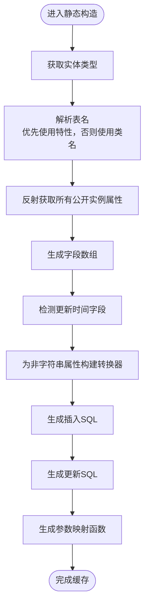
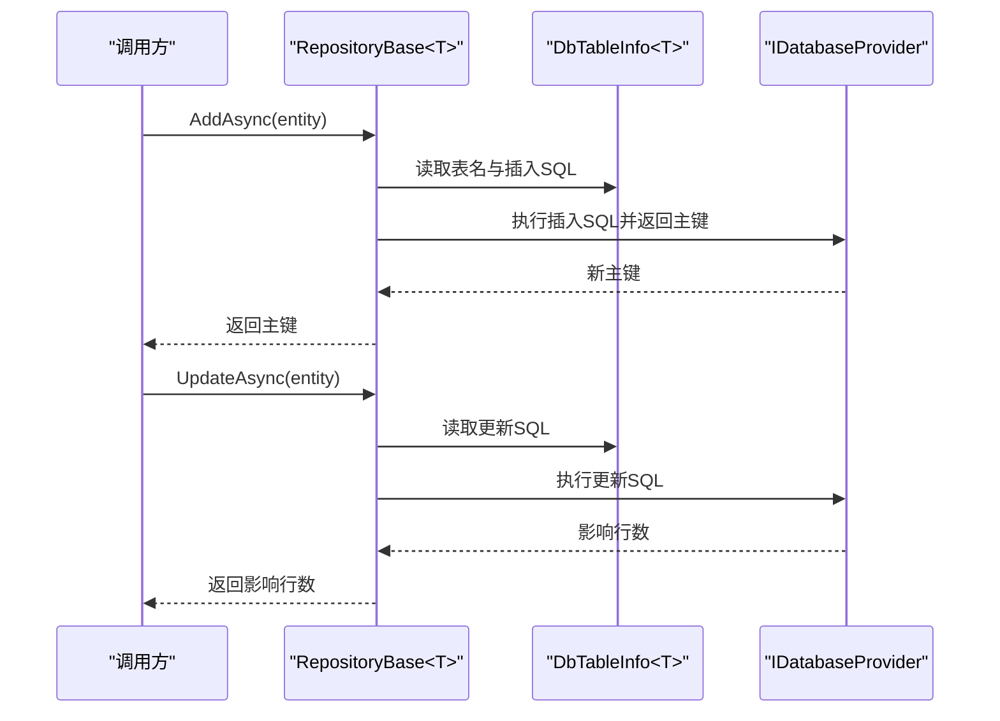
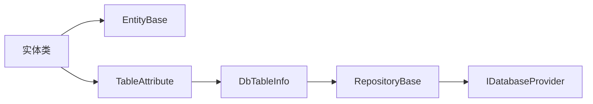

# 实体类设计

<cite>
**本文引用的文件**
- [EntityBase.cs](file://Sylas.RemoteTasks.Database/EntityBase.cs)
- [TableAttribute.cs](file://Sylas.RemoteTasks.Database/Attributes/TableAttribute.cs)
- [DbTableInfo.cs](file://Sylas.RemoteTasks.Database/SyncBase/DbTableInfo.cs)
- [RepositoryBase.cs](file://Sylas.RemoteTasks.App/Infrastructure/RepositoryBase.cs)
- [DbBackup.cs](file://Sylas.RemoteTasks.App/DatabaseManager/Models/DbBackup.cs)
- [AnythingCommand.cs](file://Sylas.RemoteTasks.App/RemoteHostModule/Anything/AnythingCommand.cs)
- [HttpRequestProcessorEntity.cs](file://Sylas.RemoteTasks.App/RequestProcessor/Models/HttpRequestProcessorEntity.cs)
- [ColumnInfo.cs](file://Sylas.RemoteTasks.Database/Dtos/ColumnInfo.cs)
</cite>

## 目录
1. [引言](#引言)
2. [项目结构](#项目结构)
3. [核心组件](#核心组件)
4. [架构总览](#架构总览)
5. [详细组件分析](#详细组件分析)
6. [依赖关系分析](#依赖关系分析)
7. [性能考虑](#性能考虑)
8. [故障排除指南](#故障排除指南)
9. [结论](#结论)

## 引言
本文件系统性阐述 Sylas.RemoteTasks 中的实体类设计，重点围绕以下主题：
- EntityBase 泛型基类的设计理念与实现细节：主键字段约定（默认 Id）、时间戳自动管理（创建时间与更新时间）。
- TableAttribute 特性的使用方式与数据库映射规则：如何通过特性显式声明表名，以及运行时如何解析表名。
- 实体类继承最佳实践：构造函数初始化、属性定义规范、与仓储层的协作。
- 在数据访问层中的作用与生命周期管理：实体如何被仓储层识别、参数化 SQL 构造、插入/更新/删除流程。

## 项目结构
实体类设计涉及三个关键层次：
- 数据库层（Sylas.RemoteTasks.Database）：提供泛型基类与特性，负责实体的基础能力与元数据解析。
- 应用层（Sylas.RemoteTasks.App）：提供具体实体类与仓储基类，负责业务实体与数据持久化。
- 数据访问层（同步与生成工具）：通过反射与特性解析，动态生成 SQL 与参数映射。

图表来源
- [EntityBase.cs](file://Sylas.RemoteTasks.Database/EntityBase.cs#L1-L33)
- [TableAttribute.cs](file://Sylas.RemoteTasks.Database/Attributes/TableAttribute.cs#L1-L33)
- [DbTableInfo.cs](file://Sylas.RemoteTasks.Database/SyncBase/DbTableInfo.cs#L1-L225)
- [RepositoryBase.cs](file://Sylas.RemoteTasks.App/Infrastructure/RepositoryBase.cs#L1-L233)
- [DbBackup.cs](file://Sylas.RemoteTasks.App/DatabaseManager/Models/DbBackup.cs#L1-L48)
- [AnythingCommand.cs](file://Sylas.RemoteTasks.App/RemoteHostModule/Anything/AnythingCommand.cs#L1-L35)
- [HttpRequestProcessorEntity.cs](file://Sylas.RemoteTasks.App/RequestProcessor/Models/HttpRequestProcessorEntity.cs#L1-L21)
- [ColumnInfo.cs](file://Sylas.RemoteTasks.Database/Dtos/ColumnInfo.cs#L1-L54)

章节来源
- [EntityBase.cs](file://Sylas.RemoteTasks.Database/EntityBase.cs#L1-L33)
- [TableAttribute.cs](file://Sylas.RemoteTasks.Database/Attributes/TableAttribute.cs#L1-L33)
- [DbTableInfo.cs](file://Sylas.RemoteTasks.Database/SyncBase/DbTableInfo.cs#L1-L225)
- [RepositoryBase.cs](file://Sylas.RemoteTasks.App/Infrastructure/RepositoryBase.cs#L1-L233)

## 核心组件
- EntityBase<T>：为所有实体提供统一的主键与时间戳能力。默认构造函数初始化创建与更新时间为当前时间；Id 字段作为主键约定。
- TableAttribute：用于为实体类显式声明数据库表名，若未指定则回退到实体类名。
- DbTableInfo<T>：通过反射与特性解析，动态构建实体的表名、字段集合、插入/更新 SQL 与参数映射，并缓存转换器。
- RepositoryBase<T>：面向实体的通用仓储，基于 DbTableInfo<T> 生成 SQL 并执行插入、更新、删除等操作。

章节来源
- [EntityBase.cs](file://Sylas.RemoteTasks.Database/EntityBase.cs#L1-L33)
- [TableAttribute.cs](file://Sylas.RemoteTasks.Database/Attributes/TableAttribute.cs#L1-L33)
- [DbTableInfo.cs](file://Sylas.RemoteTasks.Database/SyncBase/DbTableInfo.cs#L1-L225)
- [RepositoryBase.cs](file://Sylas.RemoteTasks.App/Infrastructure/RepositoryBase.cs#L1-L233)

## 架构总览
实体类设计遵循“基类 + 特性 + 反射 + 仓储”的分层架构：
- 基类提供主键与时间戳约定；
- 特性提供表名映射；
- 反射解析生成 SQL 与参数；
- 仓储封装 CRUD 操作并处理数据库差异。

图表来源
- [EntityBase.cs](file://Sylas.RemoteTasks.Database/EntityBase.cs#L1-L33)
- [TableAttribute.cs](file://Sylas.RemoteTasks.Database/Attributes/TableAttribute.cs#L1-L33)
- [DbTableInfo.cs](file://Sylas.RemoteTasks.Database/SyncBase/DbTableInfo.cs#L1-L225)
- [RepositoryBase.cs](file://Sylas.RemoteTasks.App/Infrastructure/RepositoryBase.cs#L1-L233)
- [DbBackup.cs](file://Sylas.RemoteTasks.App/DatabaseManager/Models/DbBackup.cs#L1-L48)
- [AnythingCommand.cs](file://Sylas.RemoteTasks.App/RemoteHostModule/Anything/AnythingCommand.cs#L1-L35)
- [HttpRequestProcessorEntity.cs](file://Sylas.RemoteTasks.App/RequestProcessor/Models/HttpRequestProcessorEntity.cs#L1-L21)

## 详细组件分析

### EntityBase 泛型基类
- 设计理念
  - 统一主键约定：Id 字段作为默认主键，类型由泛型参数 T 指定，便于不同实体共享同一仓储约束。
  - 时间戳自动管理：默认构造函数初始化创建与更新时间，确保实体实例化即具备审计信息。
- 实现要点
  - 主键字段：Id? 类型，允许空引用以支持新增前的占位。
  - 时间戳：CreateTime 与 UpdateTime 在构造时初始化为当前时间。
- 使用建议
  - 新增实体时优先继承 EntityBase<T>，保持一致的主键与审计字段命名。
  - 若需自定义主键字段名或类型，请结合仓储约束与反射逻辑评估兼容性。

章节来源
- [EntityBase.cs](file://Sylas.RemoteTasks.Database/EntityBase.cs#L1-L33)

### TableAttribute 特性
- 使用方式
  - 在实体类上使用特性声明表名，例如 [Table("DbBackups")]。
  - 若未显式声明，则通过静态方法 GetTableName(Type) 回退到实体类名。
- 数据库映射规则
  - 仓储与反射解析均依赖该特性或类名确定表名，确保 SQL 生成与数据库一致。
- 最佳实践
  - 显式标注表名，避免大小写与保留字冲突。
  - 与 DbTableInfo<T> 的表名解析配合，保证跨数据库的一致行为。

章节来源
- [TableAttribute.cs](file://Sylas.RemoteTasks.Database/Attributes/TableAttribute.cs#L1-L33)
- [DbTableInfo.cs](file://Sylas.RemoteTasks.Database/SyncBase/DbTableInfo.cs#L56-L63)

### DbTableInfo<T> 反射与 SQL 生成
- 表名解析
  - 通过 TableAttribute.GetTableName(entityType) 获取表名，若未设置则使用类名。
- 字段与 SQL 生成
  - 通过反射获取所有公开实例属性，生成插入与更新 SQL。
  - 插入 SQL：若主键为自增整型，则排除主键字段；否则包含全部字段。
  - 更新 SQL：排除 CreateTime 字段，确保创建时间不变；包含所有其他字段。
- 参数映射与类型转换
  - 为非字符串属性构建字符串到目标类型的转换器，用于将输入字符串转换为目标类型。
  - 通过 DynamicParameters 动态添加参数，适配不同数据库的参数占位符。
- 性能优化
  - 静态构造函数一次性完成表名、字段、SQL 与转换器的缓存，避免重复反射与表达式编译。

图表来源
- [DbTableInfo.cs](file://Sylas.RemoteTasks.Database/SyncBase/DbTableInfo.cs#L56-L109)

章节来源
- [DbTableInfo.cs](file://Sylas.RemoteTasks.Database/SyncBase/DbTableInfo.cs#L1-L225)
- [ColumnInfo.cs](file://Sylas.RemoteTasks.Database/Dtos/ColumnInfo.cs#L1-L54)

### RepositoryBase<T> 仓储层
- 角色与职责
  - 提供分页查询、按 Id 查询、新增、更新、局部更新、删除等通用操作。
  - 基于 DbTableInfo<T> 的表名与 SQL，结合数据库类型差异生成最终执行语句。
- 生命周期管理
  - 新增：调用插入 SQL 并根据数据库类型返回新记录主键。
  - 更新：调用更新 SQL，自动忽略 CreateTime 字段，确保创建时间不变。
  - 局部更新：根据传入字段动态裁剪 SQL，自动补充更新时间字段。
  - 删除：按主键删除。
- 错误处理
  - 缺少主键字段或非法数据库类型时抛出异常，便于快速定位问题。

图表来源
- [RepositoryBase.cs](file://Sylas.RemoteTasks.App/Infrastructure/RepositoryBase.cs#L71-L121)
- [DbTableInfo.cs](file://Sylas.RemoteTasks.Database/SyncBase/DbTableInfo.cs#L27-L102)

章节来源
- [RepositoryBase.cs](file://Sylas.RemoteTasks.App/Infrastructure/RepositoryBase.cs#L1-L233)

### 实体类继承最佳实践与示例
- 继承基类
  - 所有实体均继承 EntityBase<int>，确保具备 Id、CreateTime、UpdateTime 字段。
- 构造函数初始化
  - 默认构造函数自动初始化时间戳；带参构造函数用于批量赋值业务字段。
- 属性定义规范
  - 主键字段统一命名为 Id，类型为 int 或 long（自增场景）。
  - 审计字段 CreateTime 与 UpdateTime 由基类提供，无需重复定义。
  - 业务字段使用可空类型（如 long?）以支持可选值。
- 特性标注
  - 使用 [Table("...")] 显式声明表名，避免与类名冲突或保留字冲突。
- 示例实体
  - 数据库备份实体：DbBackup，演示了默认构造与带参构造的使用。
  - 任意模块命令实体：AnythingCommand，演示了业务字段与表名特性。
  - 请求处理器实体：HttpRequestProcessorEntity，演示了常量表名与特性结合使用。

章节来源
- [DbBackup.cs](file://Sylas.RemoteTasks.App/DatabaseManager/Models/DbBackup.cs#L1-L48)
- [AnythingCommand.cs](file://Sylas.RemoteTasks.App/RemoteHostModule/Anything/AnythingCommand.cs#L1-L35)
- [HttpRequestProcessorEntity.cs](file://Sylas.RemoteTasks.App/RequestProcessor/Models/HttpRequestProcessorEntity.cs#L1-L21)

## 依赖关系分析
- 组件耦合
  - 实体类依赖 EntityBase<T> 与 TableAttribute。
  - DbTableInfo<T> 依赖 TableAttribute 与反射 API。
  - RepositoryBase<T> 依赖 DbTableInfo<T> 与 IDatabaseProvider。
- 关键依赖链
  - 实体类 → TableAttribute → DbTableInfo<T> → RepositoryBase<T> → 数据库。
- 潜在风险
  - 若实体未包含 Id 字段或命名不一致，DbTableInfo<T> 将抛出异常。
  - 若未标注表名且类名与数据库保留字冲突，可能导致 SQL 生成失败。

图表来源
- [EntityBase.cs](file://Sylas.RemoteTasks.Database/EntityBase.cs#L1-L33)
- [TableAttribute.cs](file://Sylas.RemoteTasks.Database/Attributes/TableAttribute.cs#L1-L33)
- [DbTableInfo.cs](file://Sylas.RemoteTasks.Database/SyncBase/DbTableInfo.cs#L1-L225)
- [RepositoryBase.cs](file://Sylas.RemoteTasks.App/Infrastructure/RepositoryBase.cs#L1-L233)

章节来源
- [EntityBase.cs](file://Sylas.RemoteTasks.Database/EntityBase.cs#L1-L33)
- [TableAttribute.cs](file://Sylas.RemoteTasks.Database/Attributes/TableAttribute.cs#L1-L33)
- [DbTableInfo.cs](file://Sylas.RemoteTasks.Database/SyncBase/DbTableInfo.cs#L1-L225)
- [RepositoryBase.cs](file://Sylas.RemoteTasks.App/Infrastructure/RepositoryBase.cs#L1-L233)

## 性能考虑
- 反射与表达式缓存
  - DbTableInfo<T> 在静态构造中完成表名、字段、SQL 与参数映射函数的缓存，避免重复反射与表达式编译。
- 参数化执行
  - 使用 DynamicParameters 与参数化 SQL，减少 SQL 注入风险并提升执行效率。
- 数据库差异处理
  - 仓储层针对不同数据库类型（如 PostgreSQL、SQLite、MySQL、SQL Server、Oracle）分别生成返回新主键的语句，确保一致性与性能。

## 故障排除指南
- 新增实体时报错“未找到 Id 字段”
  - 检查实体是否继承 EntityBase<int>，并确保 Id 字段存在且命名正确。
- 更新操作未修改更新时间
  - 确认实体包含 UpdateTime 字段（由基类提供），并在更新逻辑中未显式覆盖该字段。
- 局部更新报错“缺少 Id 字段”
  - 局部更新接口要求提供主键字段，确保传入字典包含 Id 键。
- 数据库类型不受支持
  - 当前仓储对 Oracle/达梦采用参数绑定方式，其他数据库类型不支持时会抛出异常，需扩展支持。

章节来源
- [DbTableInfo.cs](file://Sylas.RemoteTasks.Database/SyncBase/DbTableInfo.cs#L88-L102)
- [RepositoryBase.cs](file://Sylas.RemoteTasks.App/Infrastructure/RepositoryBase.cs#L133-L136)
- [RepositoryBase.cs](file://Sylas.RemoteTasks.App/Infrastructure/RepositoryBase.cs#L102-L103)

## 结论
Sylas.RemoteTasks 的实体类设计通过 EntityBase<T> 提供统一的主键与时间戳约定，借助 TableAttribute 实现灵活的表名映射，再由 DbTableInfo<T> 与 RepositoryBase<T> 完成高效的反射解析与数据持久化。该设计在保证开发一致性的同时，兼顾了跨数据库的兼容性与性能优化，适合在多实体、多表的复杂业务场景中复用与扩展。