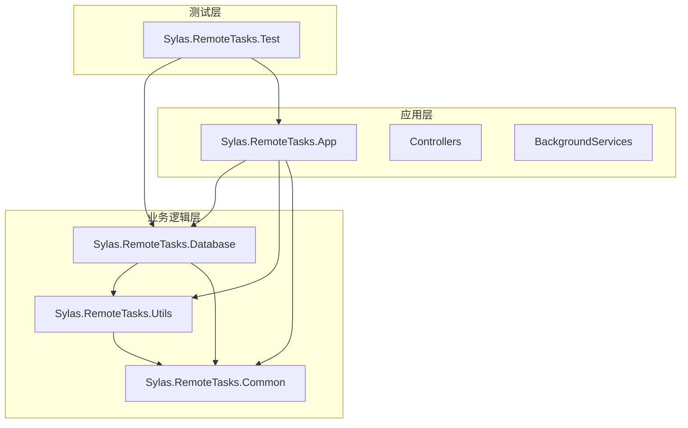
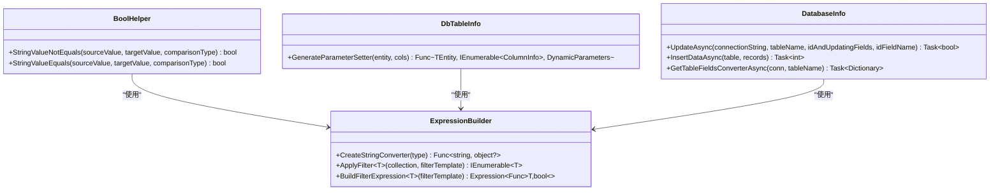
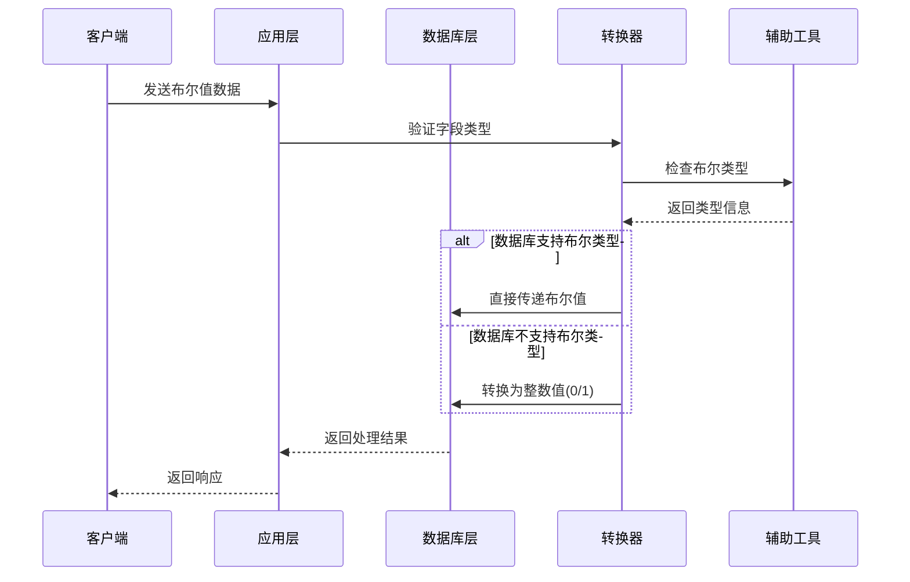
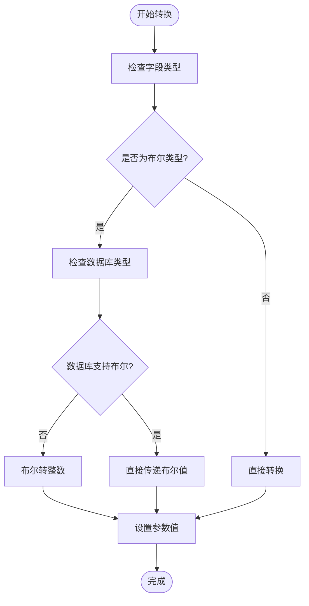
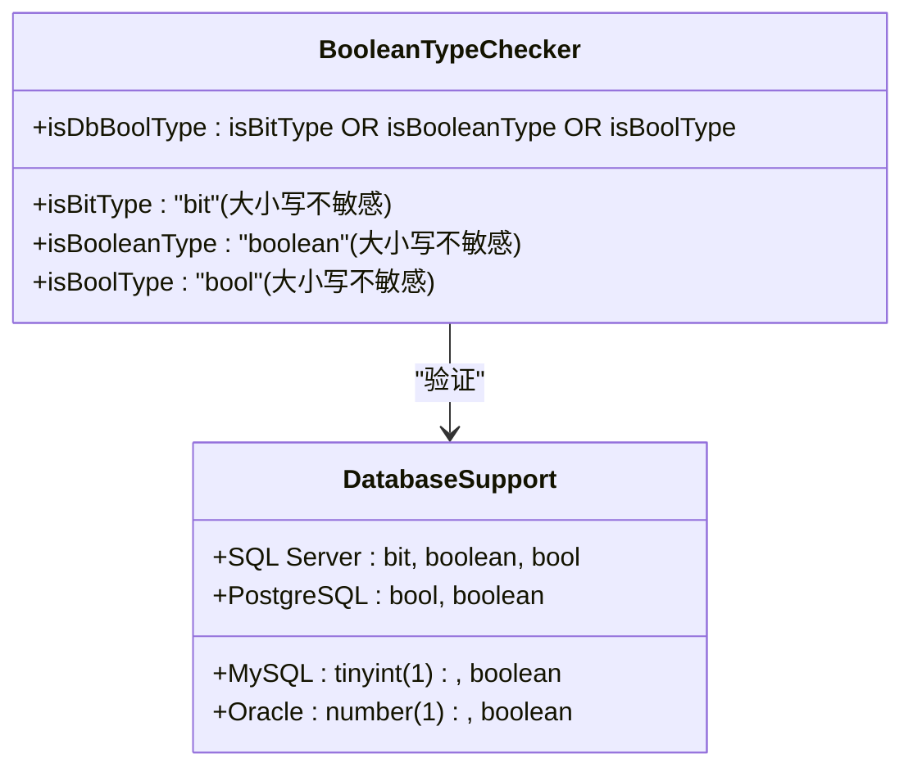
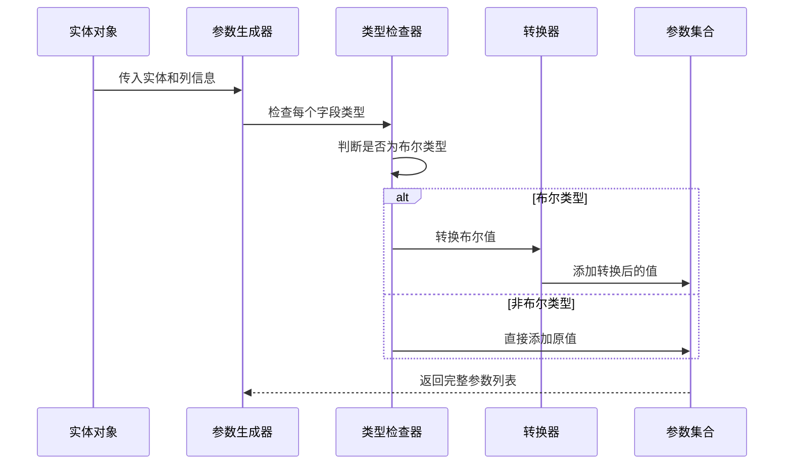
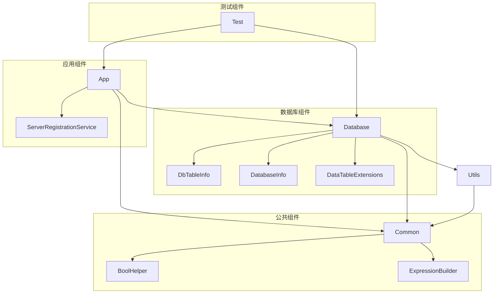

# 数据库布尔值转换增强

<cite>
**本文档引用的文件**
- [BoolHelper.cs](file://Sylas.RemoteTasks.Common/BoolHelper.cs)
- [ExpressionBuilder.cs](file://Sylas.RemoteTasks.Common/ExpressionBuilder.cs)
- [DbTableInfo.cs](file://Sylas.RemoteTasks.Database/SyncBase/DbTableInfo.cs)
- [DatabaseInfo.cs](file://Sylas.RemoteTasks.Database/SyncBase/DatabaseInfo.cs)
- [DataTableExtensions.cs](file://Sylas.RemoteTasks.Utils/Extensions/DataTableExtensions.cs)
- [ServerRegistrationService.cs](file://Sylas.RemoteTasks.App/BackgroundServices/ServerRegistrationService.cs)
</cite>

## 目录
1. [简介](#简介)
2. [项目结构](#项目结构)
3. [核心组件](#核心组件)
4. [架构概览](#架构概览)
5. [详细组件分析](#详细组件分析)
6. [依赖关系分析](#依赖关系分析)
7. [性能考虑](#性能考虑)
8. [故障排除指南](#故障排除指南)
9. [结论](#结论)

## 简介

本文档详细分析了Sylas.RemoteTasks项目中数据库布尔值转换增强功能的实现。该项目是一个.NET跨平台的远程任务管理系统，包含数据库同步、数据处理、远程执行等多个核心功能模块。

本次增强主要针对数据库布尔值在不同数据源之间的转换问题，通过表达式树技术实现了智能的布尔值转换机制，确保在各种数据库系统（SQL Server、MySQL、PostgreSQL等）之间进行数据同步时能够正确处理布尔值类型。

## 项目结构

项目采用多层架构设计，主要包含以下核心模块：

**图表来源**
- [Sylas.RemoteTasks.App.csproj](file://Sylas.RemoteTasks.App/Sylas.RemoteTasks.App.csproj)
- [Sylas.RemoteTasks.Database.csproj](file://Sylas.RemoteTasks.Database/Sylas.RemoteTasks.Database.csproj)
- [Sylas.RemoteTasks.Utils.csproj](file://Sylas.RemoteTasks.Utils/Sylas.RemoteTasks.Utils.csproj)
- [Sylas.RemoteTasks.Common.csproj](file://Sylas.RemoteTasks.Common/Sylas.RemoteTasks.Common.csproj)

**章节来源**
- [Sylas.RemoteTasks.App.csproj](file://Sylas.RemoteTasks.App/Sylas.RemoteTasks.App.csproj)
- [Sylas.RemoteTasks.Database.csproj](file://Sylas.RemoteTasks.Database/Sylas.RemoteTasks.Database.csproj)
- [Sylas.RemoteTasks.Utils.csproj](file://Sylas.RemoteTasks.Utils/Sylas.RemoteTasks.Utils.csproj)
- [Sylas.RemoteTasks.Common.csproj](file://Sylas.RemoteTasks.Common/Sylas.RemoteTasks.Common.csproj)

## 核心组件

### 布尔值辅助工具

项目提供了专门的布尔值处理工具类，用于字符串与布尔值之间的转换：

**图表来源**
- [BoolHelper.cs](file://Sylas.RemoteTasks.Common/BoolHelper.cs#L8-L27)
- [ExpressionBuilder.cs](file://Sylas.RemoteTasks.Common/ExpressionBuilder.cs#L11-L177)
- [DbTableInfo.cs](file://Sylas.RemoteTasks.Database/SyncBase/DbTableInfo.cs#L1-L260)
- [DatabaseInfo.cs](file://Sylas.RemoteTasks.Database/SyncBase/DatabaseInfo.cs#L530-L729)

**章节来源**
- [BoolHelper.cs](file://Sylas.RemoteTasks.Common/BoolHelper.cs#L1-L29)
- [ExpressionBuilder.cs](file://Sylas.RemoteTasks.Common/ExpressionBuilder.cs#L1-L178)
- [DbTableInfo.cs](file://Sylas.RemoteTasks.Database/SyncBase/DbTableInfo.cs#L1-L260)
- [DatabaseInfo.cs](file://Sylas.RemoteTasks.Database/SyncBase/DatabaseInfo.cs#L530-L729)

## 架构概览

系统采用分层架构设计，布尔值转换功能贯穿整个数据处理流程：

**图表来源**
- [DbTableInfo.cs](file://Sylas.RemoteTasks.Database/SyncBase/DbTableInfo.cs#L170-L231)
- [ExpressionBuilder.cs](file://Sylas.RemoteTasks.Common/ExpressionBuilder.cs#L157-L175)
- [DatabaseInfo.cs](file://Sylas.RemoteTasks.Database/SyncBase/DatabaseInfo.cs#L530-L663)

## 详细组件分析

### 布尔值类型检测机制

系统通过表达式树技术实现智能的布尔值类型检测：

**图表来源**
- [DbTableInfo.cs](file://Sylas.RemoteTasks.Database/SyncBase/DbTableInfo.cs#L170-L231)
- [DbTableInfo.cs](file://Sylas.RemoteTasks.Database/SyncBase/DbTableInfo.cs#L197-L224)

#### 字符串到布尔值转换

字符串到布尔值的转换逻辑如下：

| 输入值 | 转换规则 | 输出结果 |
|--------|----------|----------|
| "1" | 非空且不等于"0" | true |
| "0" | 等于"0" | false |
| "true" | 忽略大小写匹配 | true |
| "false" | 忽略大小写匹配 | false |
| "" | 空字符串 | null |
| 其他值 | 非空且不等于"0" | true |

**章节来源**
- [ExpressionBuilder.cs](file://Sylas.RemoteTasks.Common/ExpressionBuilder.cs#L157-L175)

#### 数据库布尔类型识别

系统支持多种数据库的布尔类型识别：

**图表来源**
- [DbTableInfo.cs](file://Sylas.RemoteTasks.Database/SyncBase/DbTableInfo.cs#L197-L224)

**章节来源**
- [DbTableInfo.cs](file://Sylas.RemoteTasks.Database/SyncBase/DbTableInfo.cs#L170-L231)

### 动态参数生成器

系统使用表达式树动态生成参数设置逻辑：

**图表来源**
- [DbTableInfo.cs](file://Sylas.RemoteTasks.Database/SyncBase/DbTableInfo.cs#L151-L256)

**章节来源**
- [DbTableInfo.cs](file://Sylas.RemoteTasks.Database/SyncBase/DbTableInfo.cs#L151-L256)

### 数据库兼容性处理

系统通过统一的接口处理不同数据库的布尔值差异：

| 数据库类型 | 布尔值表示 | 默认值 | 转换策略 |
|------------|------------|--------|----------|
| SQL Server | bit | 0 | 直接存储 |
| MySQL | tinyint(1) | 0 | 转换为0/1 |
| PostgreSQL | bool | false | 直接存储 |
| Oracle | number(1) | 0 | 转换为0/1 |

**章节来源**
- [DatabaseInfo.cs](file://Sylas.RemoteTasks.Database/SyncBase/DatabaseInfo.cs#L3356-L3377)
- [DatabaseInfo.cs](file://Sylas.RemoteTasks.Database/SyncBase/DatabaseInfo.cs#L3793-L3972)

## 依赖关系分析

系统各组件之间的依赖关系如下：

**图表来源**
- [BoolHelper.cs](file://Sylas.RemoteTasks.Common/BoolHelper.cs#L1-L29)
- [ExpressionBuilder.cs](file://Sylas.RemoteTasks.Common/ExpressionBuilder.cs#L1-L178)
- [DbTableInfo.cs](file://Sylas.RemoteTasks.Database/SyncBase/DbTableInfo.cs#L1-L260)
- [DatabaseInfo.cs](file://Sylas.RemoteTasks.Database/SyncBase/DatabaseInfo.cs#L530-L729)
- [DataTableExtensions.cs](file://Sylas.RemoteTasks.Utils/Extensions/DataTableExtensions.cs#L1-L59)
- [ServerRegistrationService.cs](file://Sylas.RemoteTasks.App/BackgroundServices/ServerRegistrationService.cs#L170-L180)

**章节来源**
- [BoolHelper.cs](file://Sylas.RemoteTasks.Common/BoolHelper.cs#L1-L29)
- [ExpressionBuilder.cs](file://Sylas.RemoteTasks.Common/ExpressionBuilder.cs#L1-L178)
- [DbTableInfo.cs](file://Sylas.RemoteTasks.Database/SyncBase/DbTableInfo.cs#L1-L260)
- [DatabaseInfo.cs](file://Sylas.RemoteTasks.Database/SyncBase/DatabaseInfo.cs#L530-L729)
- [DataTableExtensions.cs](file://Sylas.RemoteTasks.Utils/Extensions/DataTableExtensions.cs#L1-L59)
- [ServerRegistrationService.cs](file://Sylas.RemoteTasks.App/BackgroundServices/ServerRegistrationService.cs#L170-L180)

## 性能考虑

### 表达式树优化

系统使用表达式树技术实现高性能的运行时代码生成：

1. **编译缓存**: 表达式树编译后的委托会被缓存，避免重复编译
2. **条件判断优化**: 使用高效的条件表达式进行布尔值判断
3. **内存分配最小化**: 避免不必要的字符串转换和对象分配

### 数据转换性能

| 转换类型 | 性能特点 | 适用场景 |
|----------|----------|----------|
| 直接转换 | O(1) 时间复杂度 | 非布尔类型 |
| 布尔值转换 | O(1) 时间复杂度 | 字符串到布尔值 |
| 类型检查 | O(n) 时间复杂度 | n为列数量 |
| 参数生成 | O(m×n) 时间复杂度 | m为记录数，n为列数 |

## 故障排除指南

### 常见问题及解决方案

#### 1. 布尔值转换异常

**问题描述**: 字符串"0"被错误转换为true

**解决方案**: 
- 检查输入数据格式，确保"0"明确表示false
- 使用显式的布尔值而非字符串

**章节来源**
- [ExpressionBuilder.cs](file://Sylas.RemoteTasks.Common/ExpressionBuilder.cs#L163-L166)

#### 2. 数据库类型不兼容

**问题描述**: 在某些数据库中布尔值存储异常

**解决方案**:
- 检查目标数据库的布尔类型支持情况
- 确保使用正确的数据类型映射

**章节来源**
- [DbTableInfo.cs](file://Sylas.RemoteTasks.Database/SyncBase/DbTableInfo.cs#L220-L231)

#### 3. 性能问题

**问题描述**: 大批量数据转换时性能下降

**解决方案**:
- 利用现有的编译缓存机制
- 批量处理数据而非逐条处理
- 优化表达式树的使用方式

## 结论

数据库布尔值转换增强功能通过以下关键改进提升了系统的健壮性和兼容性：

1. **智能类型检测**: 通过表达式树技术实现精确的布尔类型识别
2. **多数据库支持**: 统一处理不同数据库的布尔值差异
3. **高性能实现**: 使用表达式树和缓存机制确保转换效率
4. **向后兼容**: 保持与现有代码的完全兼容性

该功能的实现展示了现代.NET应用程序中表达式树技术的强大能力，为复杂的类型转换需求提供了优雅的解决方案。通过精心设计的架构和优化的算法，系统能够在保证功能完整性的同时提供优秀的性能表现。