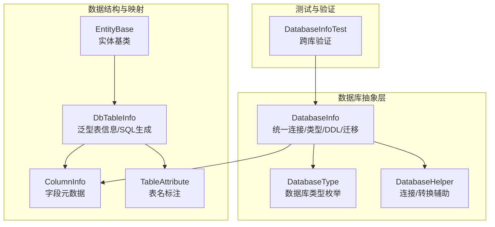
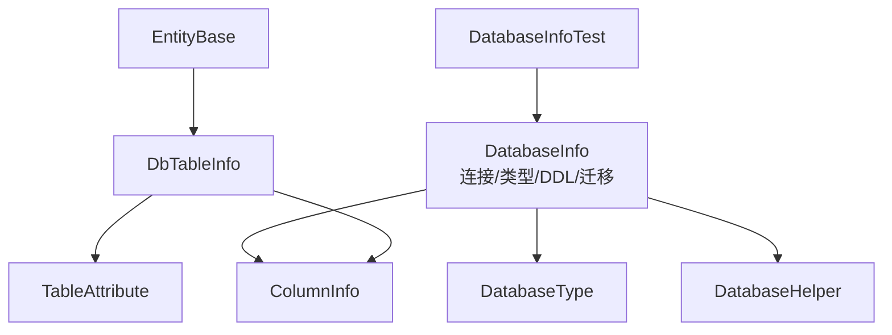
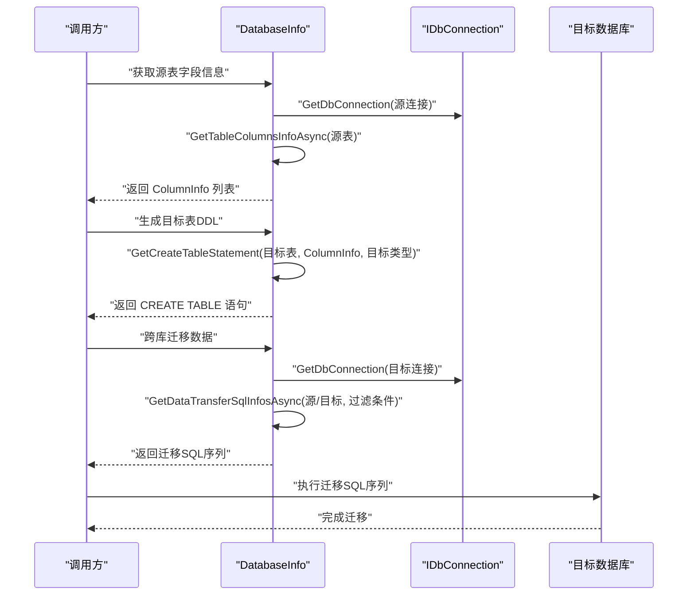
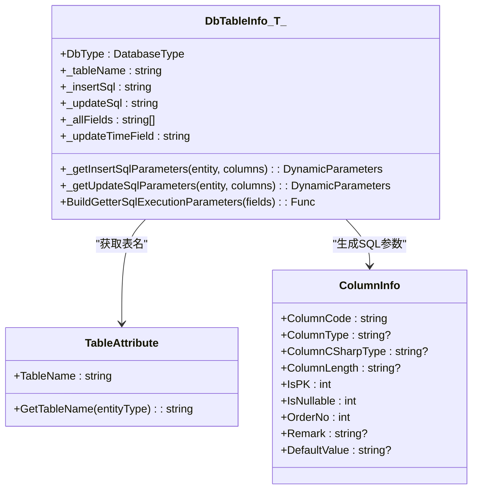
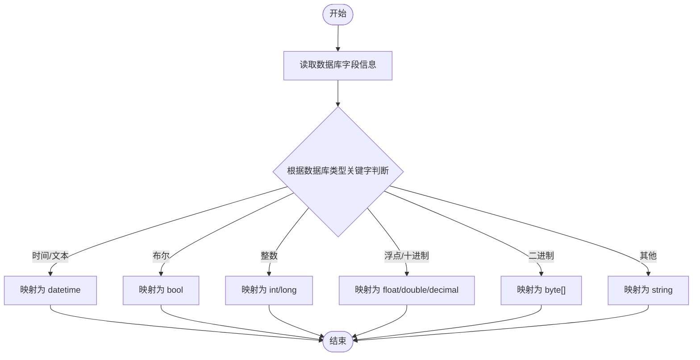
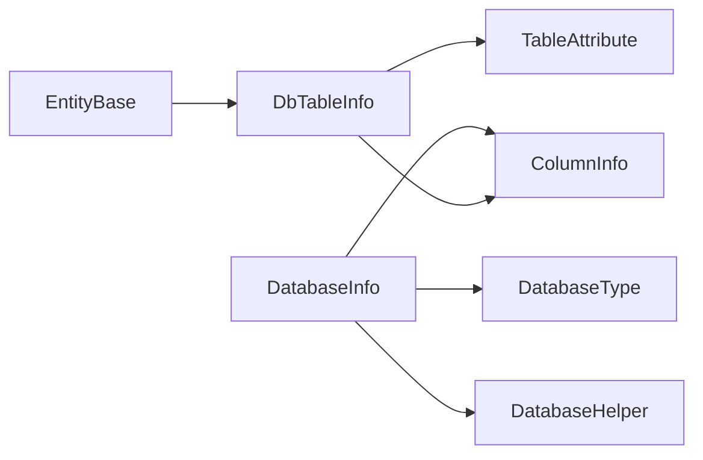
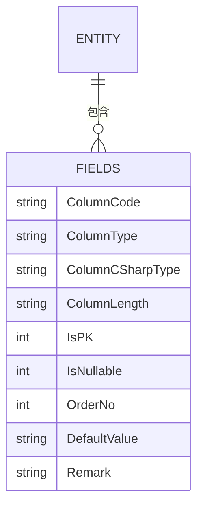

# 数据库表结构

<cite>
**本文引用的文件**
- [DatabaseInfo.cs](file://Sylas.RemoteTasks.Database/Sylas.RemoteTasks.Database/DatabaseInfo.cs)
- [DbTableInfo.cs](file://Sylas.RemoteTasks.Database/Sylas.RemoteTasks.Database/DbTableInfo.cs)
- [ColumnInfo.cs](file://Sylas.RemoteTasks.Database/Sylas.RemoteTasks.Database/Dtos/ColumnInfo.cs)
- [TableAttribute.cs](file://Sylas.RemoteTasks.Database/Sylas.RemoteTasks.Database/Attributes/TableAttribute.cs)
- [DatabaseType.cs](file://Sylas.RemoteTasks.Database/Sylas.RemoteTasks.Database/SyncBase/DatabaseType.cs)
- [DatabaseHelper.cs](file://Sylas.RemoteTasks.Database/Sylas.RemoteTasks.Database/DatabaseHelper.cs)
- [EntityBase.cs](file://Sylas.RemoteTasks.App/Sylas.RemoteTasks.App/EntityBase.cs)
- [DatabaseInfoTest.cs](file://Sylas.RemoteTasks.Test/Sylas.RemoteTasks.Test/Database/DatabaseInfoTest.cs)
- [README.md](file://Sylas.RemoteTasks.Database/Sylas.RemoteTasks.Database/README.md)
</cite>

## 目录
1. [简介](#简介)
2. [项目结构](#项目结构)
3. [核心组件](#核心组件)
4. [架构总览](#架构总览)
5. [详细组件分析](#详细组件分析)
6. [依赖关系分析](#依赖关系分析)
7. [性能考量](#性能考量)
8. [故障排查指南](#故障排查指南)
9. [结论](#结论)
10. [附录](#附录)

## 简介
本文件系统性梳理 Sylas.RemoteTasks 项目中数据库表结构的设计理念与实现细节，重点覆盖以下方面：
- 核心表设计原则：主键、外键、索引与约束的通用策略
- 字段定义与数据类型映射：ColumnInfo 的结构与跨数据库类型转换
- 类与表的映射关系：DatabaseInfo 与 DbTableInfo 的协同工作方式
- 表关系与 ER 图：基于ColumnInfo与DbTableInfo的抽象关系
- 数据类型选择理由与性能影响：针对不同数据库平台的适配
- 平台兼容性：通过DatabaseType与类型映射函数实现跨数据库一致性
- 表结构变更与迁移：从表结构发现、DDL生成到跨库迁移的完整流程

## 项目结构
围绕数据库能力的关键模块分布如下：
- 数据库抽象与工具
  - DatabaseInfo：统一的数据库连接、类型识别、表结构查询、DDL生成、数据迁移与事务执行
  - DatabaseType：数据库类型枚举（MySql、SqlServer、Oracle、Pg、Dm、Sqlite、MsSqlLocalDb）
  - DatabaseHelper：辅助方法（连接字符串构建、跨库DDL转换等）
- 数据结构与映射
  - ColumnInfo：表字段元数据载体（字段名、类型、长度、是否主键、是否可空、默认值、备注、排序）
  - TableAttribute：实体到表名的映射标注
  - DbTableInfo<T>：泛型表信息与SQL生成（Insert/Update语句、参数提取、类型转换器）
  - EntityBase<T>：实体基类（Id、CreateTime、UpdateTime）
- 测试与验证
  - DatabaseInfoTest：跨库表结构导出、DDL生成与迁移验证

**图表来源**
- [DatabaseInfo.cs](file://Sylas.RemoteTasks.Database/Sylas.RemoteTasks.Database/DatabaseInfo.cs#L3511-L3524)
- [DatabaseType.cs](file://Sylas.RemoteTasks.Database/Sylas.RemoteTasks.Database/SyncBase/DatabaseType.cs#L6-L36)
- [DatabaseHelper.cs](file://Sylas.RemoteTasks.Database/Sylas.RemoteTasks.Database/DatabaseHelper.cs#L20-L27)
- [ColumnInfo.cs](file://Sylas.RemoteTasks.Database/Sylas.RemoteTasks.Database/Dtos/ColumnInfo.cs#L6-L54)
- [TableAttribute.cs](file://Sylas.RemoteTasks.Database/Sylas.RemoteTasks.Database/Attributes/TableAttribute.cs#L14-L31)
- [DbTableInfo.cs](file://Sylas.RemoteTasks.Database/Sylas.RemoteTasks.Database/DbTableInfo.cs#L18-L109)
- [EntityBase.cs](file://Sylas.RemoteTasks.App/Sylas.RemoteTasks.App/EntityBase.cs#L9-L31)
- [DatabaseInfoTest.cs](file://Sylas.RemoteTasks.Test/Sylas.RemoteTasks.Test/Database/DatabaseInfoTest.cs#L10-L41)

**章节来源**
- [README.md](file://Sylas.RemoteTasks.Database/Sylas.RemoteTasks.Database/README.md#L1-L24)
- [DatabaseInfo.cs](file://Sylas.RemoteTasks.Database/Sylas.RemoteTasks.Database/DatabaseInfo.cs#L3511-L3524)
- [DatabaseType.cs](file://Sylas.RemoteTasks.Database/Sylas.RemoteTasks.Database/SyncBase/DatabaseType.cs#L6-L36)
- [DatabaseHelper.cs](file://Sylas.RemoteTasks.Database/Sylas.RemoteTasks.Database/DatabaseHelper.cs#L20-L27)
- [ColumnInfo.cs](file://Sylas.RemoteTasks.Database/Sylas.RemoteTasks.Database/Dtos/ColumnInfo.cs#L6-L54)
- [TableAttribute.cs](file://Sylas.RemoteTasks.Database/Sylas.RemoteTasks.Database/Attributes/TableAttribute.cs#L14-L31)
- [DbTableInfo.cs](file://Sylas.RemoteTasks.Database/Sylas.RemoteTasks.Database/DbTableInfo.cs#L18-L109)
- [EntityBase.cs](file://Sylas.RemoteTasks.App/Sylas.RemoteTasks.App/EntityBase.cs#L9-L31)
- [DatabaseInfoTest.cs](file://Sylas.RemoteTasks.Test/Sylas.RemoteTasks.Test/Database/DatabaseInfoTest.cs#L10-L41)

## 核心组件
- DatabaseInfo
  - 统一数据库连接与类型识别，支持多数据库（MySql、SqlServer、Oracle、Pg、Dm、Sqlite、MsSqlLocalDb）
  - 提供表结构查询、DDL生成、跨库数据迁移、分页查询、动态增删改、事务封装等能力
  - 通过参数占位符适配（Oracle/Dm使用“:”，其他使用“@”）与自动参数标志替换
- DbTableInfo<T>
  - 基于反射与特性（TableAttribute）推断表名、主键、字段集合
  - 生成参数化 Insert/Update SQL 与 DynamicParameters 构造器
  - 内置非字符串属性的类型转换器（bool/bit 特殊处理）
- ColumnInfo
  - 字段元数据载体，包含字段名、数据库类型、C#类型、长度、是否主键、是否可空、默认值、备注、排序
- TableAttribute
  - 实体到表名的映射标注，默认回退为类型名
- EntityBase<T>
  - 统一主键、创建时间、更新时间字段，便于实体继承
- DatabaseHelper
  - 提供连接字符串构建、跨库DDL转换等辅助能力

**章节来源**
- [DatabaseInfo.cs](file://Sylas.RemoteTasks.Database/Sylas.RemoteTasks.Database/DatabaseInfo.cs#L64-L88)
- [DbTableInfo.cs](file://Sylas.RemoteTasks.Database/Sylas.RemoteTasks.Database/DbTableInfo.cs#L18-L109)
- [ColumnInfo.cs](file://Sylas.RemoteTasks.Database/Sylas.RemoteTasks.Database/Dtos/ColumnInfo.cs#L6-L54)
- [TableAttribute.cs](file://Sylas.RemoteTasks.Database/Sylas.RemoteTasks.Database/Attributes/TableAttribute.cs#L14-L31)
- [EntityBase.cs](file://Sylas.RemoteTasks.App/Sylas.RemoteTasks.App/EntityBase.cs#L9-L31)
- [DatabaseHelper.cs](file://Sylas.RemoteTasks.Database/Sylas.RemoteTasks.Database/DatabaseHelper.cs#L20-L27)

## 架构总览
下图展示了数据库抽象层、数据结构与映射层以及测试验证层之间的交互关系。

**图表来源**
- [DatabaseInfo.cs](file://Sylas.RemoteTasks.Database/Sylas.RemoteTasks.Database/DatabaseInfo.cs#L3511-L3524)
- [DatabaseType.cs](file://Sylas.RemoteTasks.Database/Sylas.RemoteTasks.Database/SyncBase/DatabaseType.cs#L6-L36)
- [DatabaseHelper.cs](file://Sylas.RemoteTasks.Database/Sylas.RemoteTasks.Database/DatabaseHelper.cs#L20-L27)
- [ColumnInfo.cs](file://Sylas.RemoteTasks.Database/Sylas.RemoteTasks.Database/Dtos/ColumnInfo.cs#L6-L54)
- [TableAttribute.cs](file://Sylas.RemoteTasks.Database/Sylas.RemoteTasks.Database/Attributes/TableAttribute.cs#L14-L31)
- [DbTableInfo.cs](file://Sylas.RemoteTasks.Database/Sylas.RemoteTasks.Database/DbTableInfo.cs#L18-L109)
- [EntityBase.cs](file://Sylas.RemoteTasks.App/Sylas.RemoteTasks.App/EntityBase.cs#L9-L31)
- [DatabaseInfoTest.cs](file://Sylas.RemoteTasks.Test/Sylas.RemoteTasks.Test/Database/DatabaseInfoTest.cs#L10-L41)

## 详细组件分析

### DatabaseInfo：数据库抽象与迁移引擎
- 连接与类型识别
  - 依据连接字符串关键字识别数据库类型（MySql、SqlServer、Oracle、Pg、Dm、Sqlite、MsSqlLocalDb）
  - 参数占位符自动适配（Oracle/Dm 使用“:”，其他使用“@”）
- 表结构查询
  - 针对 SqlServer、Sqlite、MySql、Pg、Oracle 分别构建查询语句，统一返回 ColumnInfo 列表
  - 自动解析 ColumnCSharpType（datetime、bool、int、long、float、double、decimal、byte[]、string）
- DDL生成与表创建
  - 根据 ColumnInfo 与 DatabaseType 生成 CREATE TABLE 语句
  - 主键策略：单列 int 自增主键时采用各数据库自增语法；多主键或非 int 自增时显式声明 PRIMARY KEY
  - 字段约束：NOT NULL、DEFAULT、大小写处理（Oracle/Dm大写、Pg小写）
- 跨库数据迁移
  - 通过 GetDataTransferSqlInfosAsync/GetDataTransferSqlInfosByDataReaderAsync 生成删除旧数据与插入新数据的SQL序列
  - 支持按主键映射与字段映射进行数据对齐与迁移
- 事务与安全
  - 所有写操作均在事务内执行，失败回滚
  - 内置危险SQL关键字过滤（删除、截断、修改、创建、插入、更新等）

**图表来源**
- [DatabaseInfo.cs](file://Sylas.RemoteTasks.Database/Sylas.RemoteTasks.Database/DatabaseInfo.cs#L3214-L3244)
- [DatabaseInfo.cs](file://Sylas.RemoteTasks.Database/Sylas.RemoteTasks.Database/DatabaseInfo.cs#L3251-L3311)
- [DatabaseInfo.cs](file://Sylas.RemoteTasks.Database/Sylas.RemoteTasks.Database/DatabaseInfo.cs#L2062-L2067)
- [DatabaseInfo.cs](file://Sylas.RemoteTasks.Database/Sylas.RemoteTasks.Database/DatabaseInfo.cs#L2195-L2200)

**章节来源**
- [DatabaseInfo.cs](file://Sylas.RemoteTasks.Database/Sylas.RemoteTasks.Database/DatabaseInfo.cs#L3511-L3524)
- [DatabaseInfo.cs](file://Sylas.RemoteTasks.Database/Sylas.RemoteTasks.Database/DatabaseInfo.cs#L3775-L3935)
- [DatabaseInfo.cs](file://Sylas.RemoteTasks.Database/Sylas.RemoteTasks.Database/DatabaseInfo.cs#L3214-L3244)
- [DatabaseInfo.cs](file://Sylas.RemoteTasks.Database/Sylas.RemoteTasks.Database/DatabaseInfo.cs#L3251-L3311)
- [DatabaseInfo.cs](file://Sylas.RemoteTasks.Database/Sylas.RemoteTasks.Database/DatabaseInfo.cs#L2062-L2067)
- [DatabaseInfo.cs](file://Sylas.RemoteTasks.Database/Sylas.RemoteTasks.Database/DatabaseInfo.cs#L2195-L2200)

### DbTableInfo<T>：实体到表的映射与SQL生成
- 表名与字段
  - 通过 TableAttribute 获取表名，若未标注则回退为类型名
  - 自动收集实体属性作为字段集合，区分主键（Id）与其他字段
- Insert/Update 语句
  - Insert：若主键为 int/long 自增类型，则排除主键字段；否则包含全部字段
  - Update：排除 CreateTime，其余字段均可更新；主键作为 WHERE 条件
- 参数与类型转换
  - 构建 DynamicParameters 的表达式树，支持 bool 到 bit/int 的转换
  - 非字符串属性建立字符串到目标类型的转换器，确保参数绑定正确

**图表来源**
- [DbTableInfo.cs](file://Sylas.RemoteTasks.Database/Sylas.RemoteTasks.Database/DbTableInfo.cs#L18-L109)
- [TableAttribute.cs](file://Sylas.RemoteTasks.Database/Sylas.RemoteTasks.Database/Attributes/TableAttribute.cs#L14-L31)
- [ColumnInfo.cs](file://Sylas.RemoteTasks.Database/Sylas.RemoteTasks.Database/Dtos/ColumnInfo.cs#L6-L54)

**章节来源**
- [DbTableInfo.cs](file://Sylas.RemoteTasks.Database/Sylas.RemoteTasks.Database/DbTableInfo.cs#L18-L109)
- [TableAttribute.cs](file://Sylas.RemoteTasks.Database/Sylas.RemoteTasks.Database/Attributes/TableAttribute.cs#L14-L31)
- [ColumnInfo.cs](file://Sylas.RemoteTasks.Database/Sylas.RemoteTasks.Database/Dtos/ColumnInfo.cs#L6-L54)

### ColumnInfo：字段元数据与类型映射
- 字段元数据
  - 字段代码、数据库类型、C#类型、长度、是否主键、是否可空、默认值、备注、排序
- 类型解析
  - AnalysisColumnCSharpType 根据数据库类型关键字与长度信息推断 C# 类型
  - 支持 datetime、bool、int/long、float/double/decimal、byte[]、string 等映射

**图表来源**
- [DatabaseInfo.cs](file://Sylas.RemoteTasks.Database/Sylas.RemoteTasks.Database/DatabaseInfo.cs#L3965-L3990)

**章节来源**
- [ColumnInfo.cs](file://Sylas.RemoteTasks.Database/Sylas.RemoteTasks.Database/Dtos/ColumnInfo.cs#L6-L54)
- [DatabaseInfo.cs](file://Sylas.RemoteTasks.Database/Sylas.RemoteTasks.Database/DatabaseInfo.cs#L3965-L3990)

### EntityBase<T>：实体基类
- 统一主键 Id、创建时间 CreateTime、更新时间 UpdateTime
- 便于所有实体继承，保持一致的时间戳与主键约定

**章节来源**
- [EntityBase.cs](file://Sylas.RemoteTasks.App/Sylas.RemoteTasks.App/EntityBase.cs#L9-L31)

### DatabaseHelper：连接与转换辅助
- 提供不同数据库的连接字符串构建方法
- 跨库DDL转换（如 Oracle 到 MySql 的类型与语法转换）

**章节来源**
- [DatabaseHelper.cs](file://Sylas.RemoteTasks.Database/Sylas.RemoteTasks.Database/DatabaseHelper.cs#L20-L27)
- [DatabaseHelper.cs](file://Sylas.RemoteTasks.Database/Sylas.RemoteTasks.Database/DatabaseHelper.cs#L199-L210)

## 依赖关系分析
- DatabaseInfo 依赖 DatabaseType 与 ColumnInfo，负责类型识别、DDL生成与迁移
- DbTableInfo<T> 依赖 TableAttribute 与 ColumnInfo，负责实体到表的映射与SQL生成
- DatabaseHelper 为 DatabaseInfo 提供连接与转换辅助
- EntityBase<T> 为业务实体提供统一基类

**图表来源**
- [DatabaseInfo.cs](file://Sylas.RemoteTasks.Database/Sylas.RemoteTasks.Database/DatabaseInfo.cs#L3511-L3524)
- [DatabaseType.cs](file://Sylas.RemoteTasks.Database/Sylas.RemoteTasks.Database/SyncBase/DatabaseType.cs#L6-L36)
- [ColumnInfo.cs](file://Sylas.RemoteTasks.Database/Sylas.RemoteTasks.Database/Dtos/ColumnInfo.cs#L6-L54)
- [DatabaseHelper.cs](file://Sylas.RemoteTasks.Database/Sylas.RemoteTasks.Database/DatabaseHelper.cs#L20-L27)
- [DbTableInfo.cs](file://Sylas.RemoteTasks.Database/Sylas.RemoteTasks.Database/DbTableInfo.cs#L18-L109)
- [TableAttribute.cs](file://Sylas.RemoteTasks.Database/Sylas.RemoteTasks.Database/Attributes/TableAttribute.cs#L14-L31)
- [EntityBase.cs](file://Sylas.RemoteTasks.App/Sylas.RemoteTasks.App/EntityBase.cs#L9-L31)

**章节来源**
- [DatabaseInfo.cs](file://Sylas.RemoteTasks.Database/Sylas.RemoteTasks.Database/DatabaseInfo.cs#L3511-L3524)
- [DatabaseType.cs](file://Sylas.RemoteTasks.Database/Sylas.RemoteTasks.Database/SyncBase/DatabaseType.cs#L6-L36)
- [ColumnInfo.cs](file://Sylas.RemoteTasks.Database/Sylas.RemoteTasks.Database/Dtos/ColumnInfo.cs#L6-L54)
- [DatabaseHelper.cs](file://Sylas.RemoteTasks.Database/Sylas.RemoteTasks.Database/DatabaseHelper.cs#L20-L27)
- [DbTableInfo.cs](file://Sylas.RemoteTasks.Database/Sylas.RemoteTasks.Database/DbTableInfo.cs#L18-L109)
- [TableAttribute.cs](file://Sylas.RemoteTasks.Database/Sylas.RemoteTasks.Database/Attributes/TableAttribute.cs#L14-L31)
- [EntityBase.cs](file://Sylas.RemoteTasks.App/Sylas.RemoteTasks.App/EntityBase.cs#L9-L31)

## 性能考量
- 查询与迁移
  - 分页查询与批量迁移采用参数化SQL与事务，减少网络往返与提升吞吐
  - 跨库迁移支持异步迭代器，避免一次性加载大量数据
- 类型转换
  - DbTableInfo<T> 通过表达式树生成参数构造器，减少反射开销
  - DatabaseInfo 对表结构查询结果进行缓存，降低重复查询成本
- 锁与并发
  - 迁移过程在事务内执行，失败回滚，保证一致性
- 数据库差异
  - 各数据库的自增主键、大小写、默认值、时间精度等差异通过类型映射函数统一处理，避免硬编码

**章节来源**
- [DatabaseInfo.cs](file://Sylas.RemoteTasks.Database/Sylas.RemoteTasks.Database/DatabaseInfo.cs#L3545-L3575)
- [DatabaseInfo.cs](file://Sylas.RemoteTasks.Database/Sylas.RemoteTasks.Database/DatabaseInfo.cs#L3742-L3750)
- [DbTableInfo.cs](file://Sylas.RemoteTasks.Database/Sylas.RemoteTasks.Database/DbTableInfo.cs#L117-L222)

## 故障排查指南
- 表不存在
  - DatabaseInfo 提供 IsTableNotExistException 与 CreateTableIfNotExistAsync，可在迁移前自动创建表
- 连接字符串错误
  - GetDbType 依据关键字识别数据库类型，若识别失败抛出异常；建议核对连接字符串格式
- 参数占位符不匹配
  - Oracle/Dm 使用“:”、其他数据库使用“@”，DatabaseInfo 在执行前自动替换
- 类型不匹配
  - AnalysisColumnCSharpType 会根据数据库类型关键字与长度推断 C# 类型；若出现异常，检查 ColumnType/ColumnLength 的解析结果
- 迁移中断
  - 所有写操作在事务内执行，异常时自动回滚；检查异常日志定位具体SQL与参数

**章节来源**
- [DatabaseInfo.cs](file://Sylas.RemoteTasks.Database/Sylas.RemoteTasks.Database/DatabaseInfo.cs#L727-L736)
- [DatabaseInfo.cs](file://Sylas.RemoteTasks.Database/Sylas.RemoteTasks.Database/DatabaseInfo.cs#L744-L759)
- [DatabaseInfo.cs](file://Sylas.RemoteTasks.Database/Sylas.RemoteTasks.Database/DatabaseInfo.cs#L3511-L3524)
- [DatabaseInfo.cs](file://Sylas.RemoteTasks.Database/Sylas.RemoteTasks.Database/DatabaseInfo.cs#L3965-L3990)

## 结论
本项目通过 DatabaseInfo 与 DbTableInfo<T> 的协同，实现了对多数据库的一致化抽象与高效迁移。ColumnInfo 作为字段元数据载体，贯穿类型解析、DDL生成与参数绑定全过程。配合 EntityBase<T> 的统一约定与 DatabaseHelper 的连接/转换辅助，整体架构具备良好的扩展性与跨平台兼容性。建议在实际生产中结合测试用例（DatabaseInfoTest）持续验证跨库迁移与DDL生成的正确性。

## 附录
- 表关系与 ER 图示意（概念性）
  - 基于 DbTableInfo<T> 的实体表与 ColumnInfo 的字段元数据，形成“实体-字段”关系
  - 若存在外键关系，通常由业务实体或迁移脚本在目标库中显式声明（本项目通过 ColumnInfo 与 DDL 生成间接体现）

[本图为概念示意，不直接映射具体源码文件]