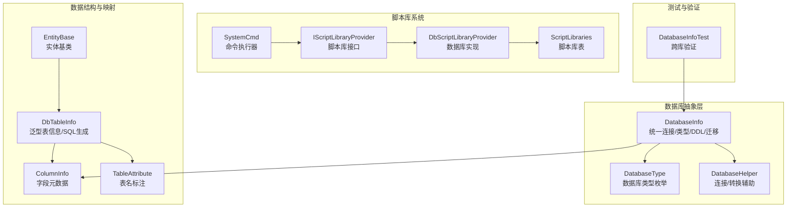
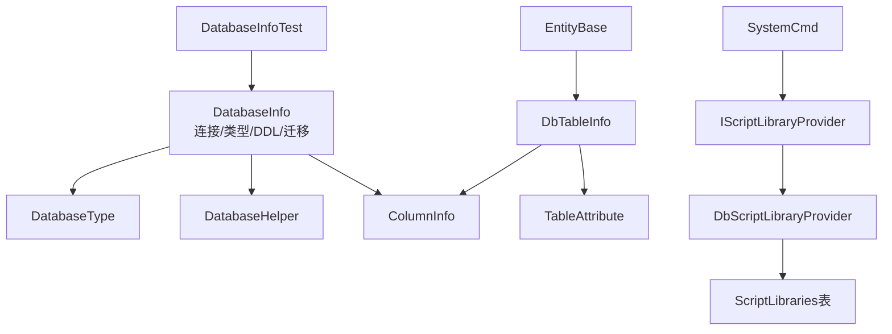
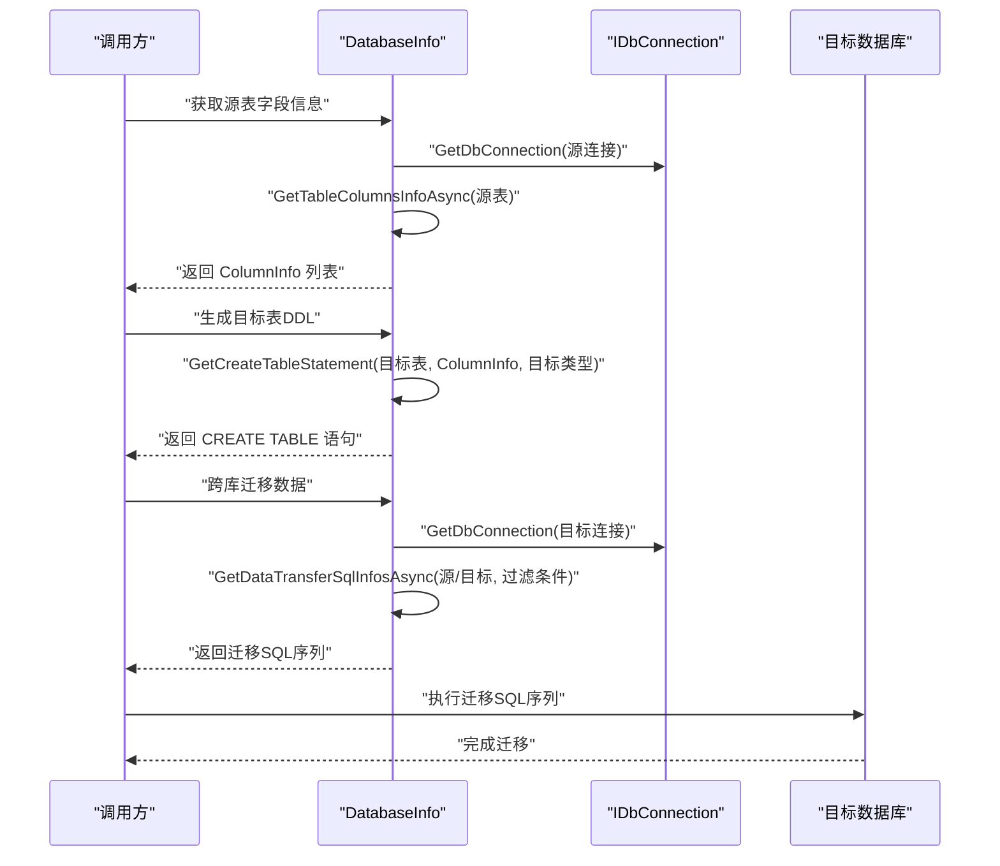
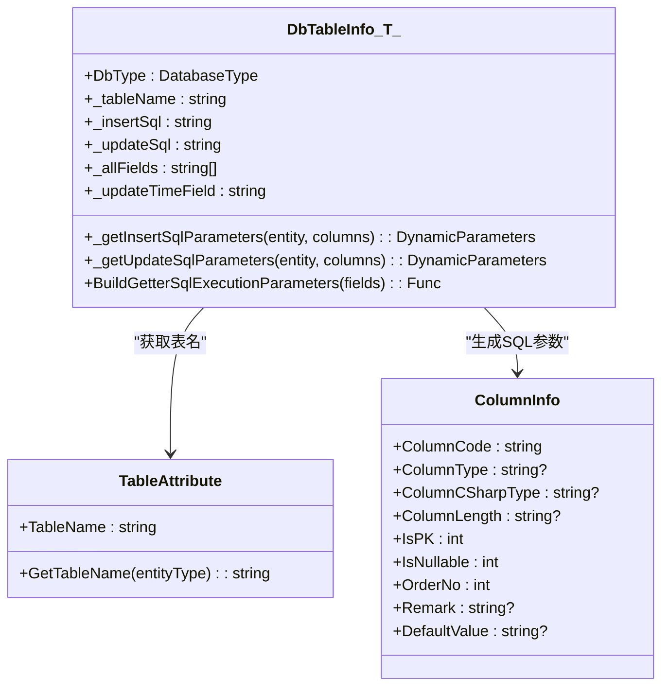
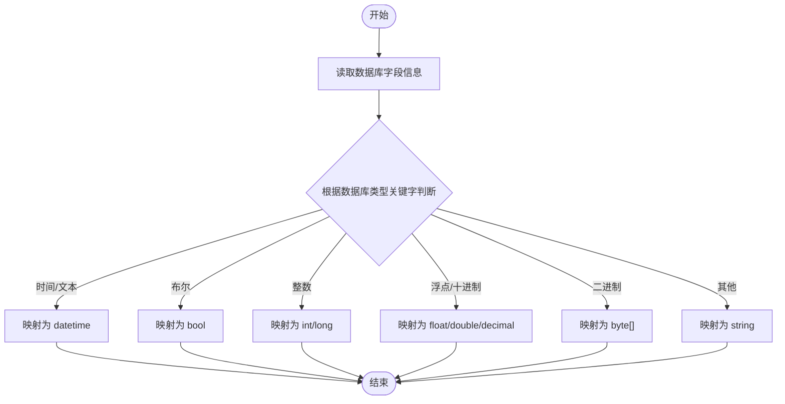
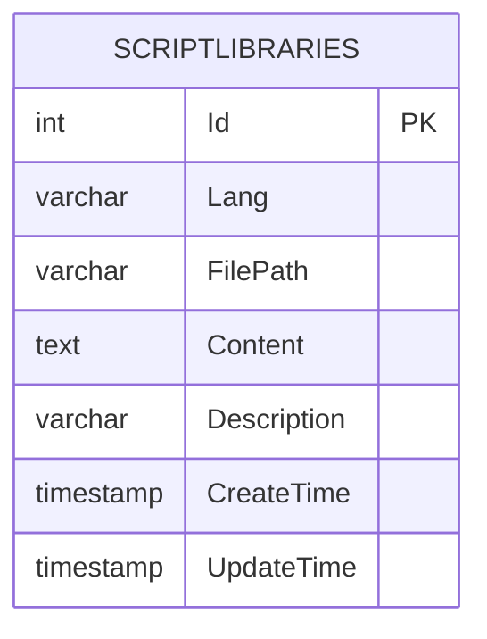
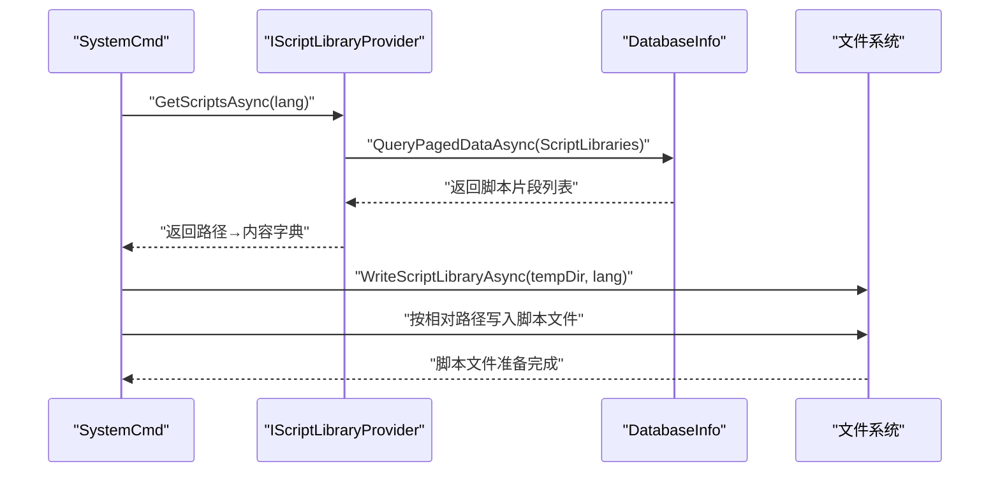
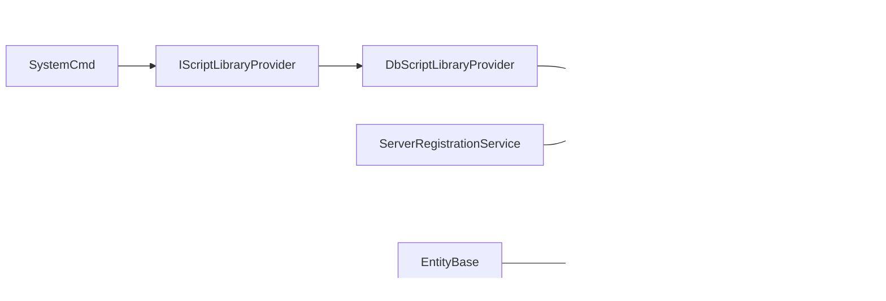
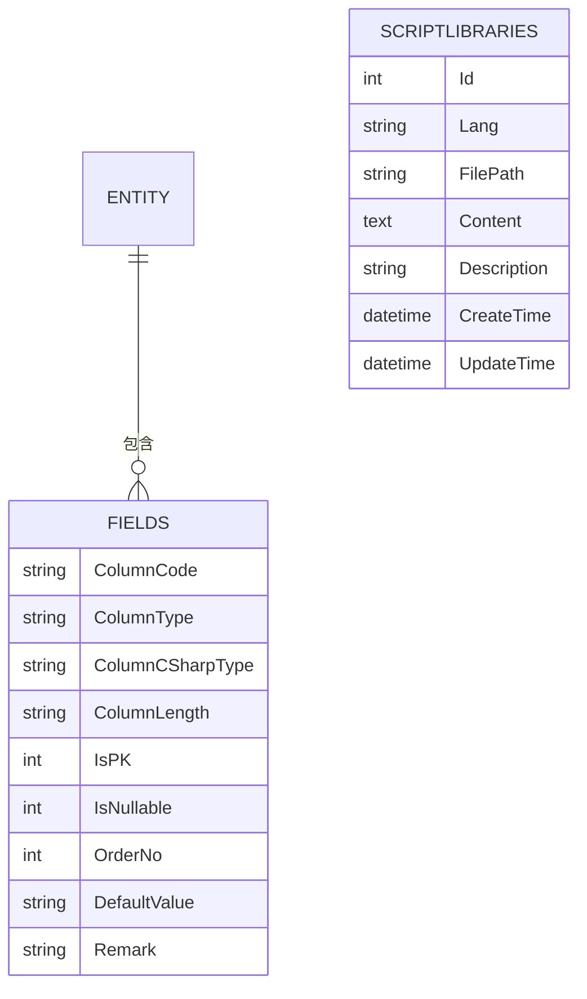

# 数据库表结构

<cite>
**本文引用的文件**
- [DatabaseInfo.cs](file://Sylas.RemoteTasks.Database/Sylas.RemoteTasks.Database/DatabaseInfo.cs)
- [DbTableInfo.cs](file://Sylas.RemoteTasks.Database/Sylas.RemoteTasks.Database/DbTableInfo.cs)
- [ColumnInfo.cs](file://Sylas.RemoteTasks.Database/Sylas.RemoteTasks.Database/Dtos/ColumnInfo.cs)
- [TableAttribute.cs](file://Sylas.RemoteTasks.Database/Sylas.RemoteTasks.Database/Attributes/TableAttribute.cs)
- [DatabaseType.cs](file://Sylas.RemoteTasks.Database/Sylas.RemoteTasks.Database/SyncBase/DatabaseType.cs)
- [DatabaseHelper.cs](file://Sylas.RemoteTasks.Database/Sylas.RemoteTasks.Database/DatabaseHelper.cs)
- [EntityBase.cs](file://Sylas.RemoteTasks.App/Sylas.RemoteTasks.App/EntityBase.cs)
- [DatabaseInfoTest.cs](file://Sylas.RemoteTasks.Test/Sylas.RemoteTasks.Test/Database/DatabaseInfoTest.cs)
- [README.md](file://Sylas.RemoteTasks.Database/Sylas.RemoteTasks.Database/README.md)
- [DbScriptLibraryProvider.cs](file://Sylas.RemoteTasks.Utils/CommandExecutor/DbScriptLibraryProvider.cs)
- [IScriptLibraryProvider.cs](file://Sylas.RemoteTasks.Utils/CommandExecutor/IScriptLibraryProvider.cs)
- [SystemCmd.cs](file://Sylas.RemoteTasks.Utils/CommandExecutor/SystemCmd.cs)
- [ServerRegistrationService.cs](file://Sylas.RemoteTasks.App/BackgroundServices/ServerRegistrationService.cs)
- [StartupHelper.cs](file://Sylas.RemoteTasks.App/Helpers/StartupHelper.cs)
</cite>

## 更新摘要
**所做更改**
- 新增 ScriptLibraries 表结构和详细说明
- 更新核心组件部分以包含脚本库提供者
- 添加新的架构图和ER图展示脚本库系统
- 更新依赖关系分析以反映新的表结构
- 增强故障排查指南以涵盖脚本库相关问题

## 目录
1. [简介](#简介)
2. [项目结构](#项目结构)
3. [核心组件](#核心组件)
4. [架构总览](#架构总览)
5. [详细组件分析](#详细组件分析)
6. [依赖关系分析](#依赖关系分析)
7. [性能考量](#性能考量)
8. [故障排查指南](#故障排查指南)
9. [结论](#结论)
10. [附录](#附录)

## 简介
本文件系统性梳理 Sylas.RemoteTasks 项目中数据库表结构的设计理念与实现细节，重点覆盖以下方面：
- 核心表设计原则：主键、外键、索引与约束的通用策略
- 字段定义与数据类型映射：ColumnInfo 的结构与跨数据库类型转换
- 类与表的映射关系：DatabaseInfo 与 DbTableInfo 的协同工作方式
- **新增**：ScriptLibraries 表用于存储共享脚本库，支持多语言脚本片段管理
- 表关系与 ER 图：基于ColumnInfo与DbTableInfo的抽象关系
- 数据类型选择理由与性能影响：针对不同数据库平台的适配
- 平台兼容性：通过DatabaseType与类型映射函数实现跨数据库一致性
- 表结构变更与迁移：从表结构发现、DDL生成到跨库迁移的完整流程

## 项目结构
围绕数据库能力的关键模块分布如下：
- 数据库抽象与工具
  - DatabaseInfo：统一的数据库连接、类型识别、表结构查询、DDL生成、数据迁移与事务执行
  - DatabaseType：数据库类型枚举（MySql、SqlServer、Oracle、Pg、Dm、Sqlite、MsSqlLocalDb）
  - DatabaseHelper：辅助方法（连接字符串构建、跨库DDL转换等）
- 数据结构与映射
  - ColumnInfo：表字段元数据载体（字段名、类型、长度、是否主键、是否可空、默认值、备注、排序）
  - TableAttribute：实体到表名的映射标注
  - DbTableInfo<T>：泛型表信息与SQL生成（Insert/Update语句、参数提取、类型转换器）
  - EntityBase<T>：实体基类（Id、CreateTime、UpdateTime）
- **新增**：脚本库系统
  - IScriptLibraryProvider：脚本库提供者接口
  - DbScriptLibraryProvider：基于数据库的脚本库实现
  - SystemCmd：命令执行器，集成脚本库功能
- 测试与验证
  - DatabaseInfoTest：跨库表结构导出、DDL生成与迁移验证

```mermaid
graph TB
subgraph "数据库抽象层"
DI["DatabaseInfo<br/>统一连接/类型/DDL/迁移"]
DT["DatabaseType<br/>数据库类型枚举"]
DH["DatabaseHelper<br/>连接/转换辅助"]
end
subgraph "数据结构与映射"
CI["ColumnInfo<br/>字段元数据"]
TA["TableAttribute<br/>表名标注"]
Dti["DbTableInfo<T><br/>泛型表信息/SQL生成"]
EB["EntityBase<T><br/>实体基类"]
end
subgraph "脚本库系统"
ISP["IScriptLibraryProvider<br/>脚本库接口"]
DSP["DbScriptLibraryProvider<br/>数据库实现"]
SC["SystemCmd<br/>命令执行器"]
SLT["ScriptLibraries<br/>脚本库表"]
end
subgraph "测试与验证"
Tst["DatabaseInfoTest<br/>跨库验证"]
end
DI --> DT
DI --> CI
DI --> DH
Dti --> TA
Dti --> CI
EB --> Dti
ISP --> DSP
DSP --> SLT
SC --> ISP
Tst --> DI
```

**图表来源**
- [DatabaseInfo.cs:3511-3524](file://Sylas.RemoteTasks.Database/Sylas.RemoteTasks.Database/DatabaseInfo.cs#L3511-L3524)
- [DatabaseType.cs:6-36](file://Sylas.RemoteTasks.Database/Sylas.RemoteTasks.Database/SyncBase/DatabaseType.cs#L6-L36)
- [DatabaseHelper.cs:20-27](file://Sylas.RemoteTasks.Database/Sylas.RemoteTasks.Database/DatabaseHelper.cs#L20-L27)
- [ColumnInfo.cs:6-54](file://Sylas.RemoteTasks.Database/Sylas.RemoteTasks.Database/Dtos/ColumnInfo.cs#L6-L54)
- [TableAttribute.cs:14-31](file://Sylas.RemoteTasks.Database/Sylas.RemoteTasks.Database/Attributes/TableAttribute.cs#L14-L31)
- [DbTableInfo.cs:18-109](file://Sylas.RemoteTasks.Database/Sylas.RemoteTasks.Database/DbTableInfo.cs#L18-L109)
- [EntityBase.cs:9-31](file://Sylas.RemoteTasks.App/Sylas.RemoteTasks.App/EntityBase.cs#L9-L31)
- [IScriptLibraryProvider.cs:10-18](file://Sylas.RemoteTasks.Utils/CommandExecutor/IScriptLibraryProvider.cs#L10-L18)
- [DbScriptLibraryProvider.cs:15-20](file://Sylas.RemoteTasks.Utils/CommandExecutor/DbScriptLibraryProvider.cs#L15-L20)
- [SystemCmd.cs:30-62](file://Sylas.RemoteTasks.Utils/CommandExecutor/SystemCmd.cs#L30-L62)

**章节来源**
- [README.md:1-24](file://Sylas.RemoteTasks.Database/Sylas.RemoteTasks.Database/README.md#L1-L24)
- [DatabaseInfo.cs:3511-3524](file://Sylas.RemoteTasks.Database/Sylas.RemoteTasks.Database/DatabaseInfo.cs#L3511-L3524)
- [DatabaseType.cs:6-36](file://Sylas.RemoteTasks.Database/Sylas.RemoteTasks.Database/SyncBase/DatabaseType.cs#L6-L36)
- [DatabaseHelper.cs:20-27](file://Sylas.RemoteTasks.Database/Sylas.RemoteTasks.Database/DatabaseHelper.cs#L20-L27)
- [ColumnInfo.cs:6-54](file://Sylas.RemoteTasks.Database/Sylas.RemoteTasks.Database/Dtos/ColumnInfo.cs#L6-L54)
- [TableAttribute.cs:14-31](file://Sylas.RemoteTasks.Database/Sylas.RemoteTasks.Database/Attributes/TableAttribute.cs#L14-L31)
- [DbTableInfo.cs:18-109](file://Sylas.RemoteTasks.Database/Sylas.RemoteTasks.Database/DbTableInfo.cs#L18-L109)
- [EntityBase.cs:9-31](file://Sylas.RemoteTasks.App/Sylas.RemoteTasks.App/EntityBase.cs#L9-L31)
- [DatabaseInfoTest.cs:10-41](file://Sylas.RemoteTasks.Test/Sylas.RemoteTasks.Test/Database/DatabaseInfoTest.cs#L10-L41)

## 核心组件
- DatabaseInfo
  - 统一数据库连接与类型识别，支持多数据库（MySql、SqlServer、Oracle、Pg、Dm、Sqlite、MsSqlLocalDb）
  - 提供表结构查询、DDL生成、跨库数据迁移、分页查询、动态增删改、事务封装等能力
  - 通过参数占位符适配（Oracle/Dm使用"："，其他使用"@"）与自动参数标志替换
- DbTableInfo<T>
  - 基于反射与特性（TableAttribute）推断表名、主键、字段集合
  - 生成参数化 Insert/Update SQL 与 DynamicParameters 构造器
  - 内置非字符串属性的类型转换器（bool/bit 特殊处理）
- ColumnInfo
  - 字段元数据载体，包含字段名、数据库类型、C#类型、长度、是否主键、是否可空、默认值、备注、排序
- TableAttribute
  - 实体到表名的映射标注，默认回退为类型名
- EntityBase<T>
  - 统一主键、创建时间、更新时间字段，便于实体继承
- DatabaseHelper
  - 提供连接字符串构建、跨库DDL转换等辅助能力
- **新增**：脚本库系统组件
  - IScriptLibraryProvider：定义获取指定语言公共脚本的接口
  - DbScriptLibraryProvider：从ScriptLibraries表读取脚本片段，支持分布式部署
  - SystemCmd：命令执行器，在执行前将脚本库片段写入临时目录供脚本引用

**章节来源**
- [DatabaseInfo.cs:64-88](file://Sylas.RemoteTasks.Database/Sylas.RemoteTasks.Database/DatabaseInfo.cs#L64-L88)
- [DbTableInfo.cs:18-109](file://Sylas.RemoteTasks.Database/Sylas.RemoteTasks.Database/DbTableInfo.cs#L18-L109)
- [ColumnInfo.cs:6-54](file://Sylas.RemoteTasks.Database/Sylas.RemoteTasks.Database/Dtos/ColumnInfo.cs#L6-L54)
- [TableAttribute.cs:14-31](file://Sylas.RemoteTasks.Database/Sylas.RemoteTasks.Database/Attributes/TableAttribute.cs#L14-L31)
- [EntityBase.cs:9-31](file://Sylas.RemoteTasks.App/Sylas.RemoteTasks.App/EntityBase.cs#L9-L31)
- [DatabaseHelper.cs:20-27](file://Sylas.RemoteTasks.Database/Sylas.RemoteTasks.Database/DatabaseHelper.cs#L20-L27)
- [IScriptLibraryProvider.cs:10-18](file://Sylas.RemoteTasks.Utils/CommandExecutor/IScriptLibraryProvider.cs#L10-L18)
- [DbScriptLibraryProvider.cs:15-20](file://Sylas.RemoteTasks.Utils/CommandExecutor/DbScriptLibraryProvider.cs#L15-L20)
- [SystemCmd.cs:30-62](file://Sylas.RemoteTasks.Utils/CommandExecutor/SystemCmd.cs#L30-L62)

## 架构总览
下图展示了数据库抽象层、数据结构与映射层、脚本库系统以及测试验证层之间的交互关系。

```mermaid
graph TB
DI["DatabaseInfo<br/>连接/类型/DDL/迁移"]
DT["DatabaseType"]
DH["DatabaseHelper"]
CI["ColumnInfo"]
TA["TableAttribute"]
Dti["DbTableInfo<T>"]
EB["EntityBase<T>"]
ISP["IScriptLibraryProvider"]
DSP["DbScriptLibraryProvider"]
SC["SystemCmd"]
SLT["ScriptLibraries表"]
Tst["DatabaseInfoTest"]
DI --> DT
DI --> CI
DI --> DH
Dti --> TA
Dti --> CI
EB --> Dti
ISP --> DSP
DSP --> SLT
SC --> ISP
Tst --> DI
```

**图表来源**
- [DatabaseInfo.cs:3511-3524](file://Sylas.RemoteTasks.Database/Sylas.RemoteTasks.Database/DatabaseInfo.cs#L3511-L3524)
- [DatabaseType.cs:6-36](file://Sylas.RemoteTasks.Database/Sylas.RemoteTasks.Database/SyncBase/DatabaseType.cs#L6-L36)
- [DatabaseHelper.cs:20-27](file://Sylas.RemoteTasks.Database/Sylas.RemoteTasks.Database/DatabaseHelper.cs#L20-L27)
- [ColumnInfo.cs:6-54](file://Sylas.RemoteTasks.Database/Sylas.RemoteTasks.Database/Dtos/ColumnInfo.cs#L6-L54)
- [TableAttribute.cs:14-31](file://Sylas.RemoteTasks.Database/Sylas.RemoteTasks.Database/Attributes/TableAttribute.cs#L14-L31)
- [DbTableInfo.cs:18-109](file://Sylas.RemoteTasks.Database/Sylas.RemoteTasks.Database/DbTableInfo.cs#L18-L109)
- [EntityBase.cs:9-31](file://Sylas.RemoteTasks.App/Sylas.RemoteTasks.App/EntityBase.cs#L9-L31)
- [IScriptLibraryProvider.cs:10-18](file://Sylas.RemoteTasks.Utils/CommandExecutor/IScriptLibraryProvider.cs#L10-L18)
- [DbScriptLibraryProvider.cs:15-20](file://Sylas.RemoteTasks.Utils/CommandExecutor/DbScriptLibraryProvider.cs#L15-L20)
- [SystemCmd.cs:30-62](file://Sylas.RemoteTasks.Utils/CommandExecutor/SystemCmd.cs#L30-L62)
- [DatabaseInfoTest.cs:10-41](file://Sylas.RemoteTasks.Test/Sylas.RemoteTasks.Test/Database/DatabaseInfoTest.cs#L10-L41)

## 详细组件分析

### DatabaseInfo：数据库抽象与迁移引擎
- 连接与类型识别
  - 依据连接字符串关键字识别数据库类型（MySql、SqlServer、Oracle、Pg、Dm、Sqlite、MsSqlLocalDb）
  - 参数占位符自动适配（Oracle/Dm 使用"："，其他使用"@"）
- 表结构查询
  - 针对 SqlServer、Sqlite、MySql、Pg、Oracle 分别构建查询语句，统一返回 ColumnInfo 列表
  - 自动解析 ColumnCSharpType（datetime、bool、int、long、float、double、decimal、byte[]、string）
- DDL生成与表创建
  - 根据 ColumnInfo 与 DatabaseType 生成 CREATE TABLE 语句
  - 主键策略：单列 int 自增主键时采用各数据库自增语法；多主键或非 int 自增时显式声明 PRIMARY KEY
  - 字段约束：NOT NULL、DEFAULT、大小写处理（Oracle/Dm大写、Pg小写）
- 跨库数据迁移
  - 通过 GetDataTransferSqlInfosAsync/GetDataTransferSqlInfosByDataReaderAsync 生成删除旧数据与插入新数据的SQL序列
  - 支持按主键映射与字段映射进行数据对齐与迁移
- 事务与安全
  - 所有写操作均在事务内执行，失败回滚
  - 内置危险SQL关键字过滤（删除、截断、修改、创建、插入、更新等）

```mermaid
sequenceDiagram
participant Caller as "调用方"
participant DI as "DatabaseInfo"
participant Conn as "IDbConnection"
participant Target as "目标数据库"
Caller->>DI : "获取源表字段信息"
DI->>Conn : "GetDbConnection(源连接)"
DI->>DI : "GetTableColumnsInfoAsync(源表)"
DI-->>Caller : "返回 ColumnInfo 列表"
Caller->>DI : "生成目标表DDL"
DI->>DI : "GetCreateTableStatement(目标表, ColumnInfo, 目标类型)"
DI-->>Caller : "返回 CREATE TABLE 语句"
Caller->>DI : "跨库迁移数据"
DI->>Conn : "GetDbConnection(目标连接)"
DI->>DI : "GetDataTransferSqlInfosAsync(源/目标, 过滤条件)"
DI-->>Caller : "返回迁移SQL序列"
Caller->>Target : "执行迁移SQL序列"
Target-->>Caller : "完成迁移"
```

**图表来源**
- [DatabaseInfo.cs:3214-3244](file://Sylas.RemoteTasks.Database/Sylas.RemoteTasks.Database/DatabaseInfo.cs#L3214-L3244)
- [DatabaseInfo.cs:3251-3311](file://Sylas.RemoteTasks.Database/Sylas.RemoteTasks.Database/DatabaseInfo.cs#L3251-L3311)
- [DatabaseInfo.cs:2062-2067](file://Sylas.RemoteTasks.Database/Sylas.RemoteTasks.Database/DatabaseInfo.cs#L2062-L2067)
- [DatabaseInfo.cs:2195-2200](file://Sylas.RemoteTasks.Database/Sylas.RemoteTasks.Database/DatabaseInfo.cs#L2195-L2200)

**章节来源**
- [DatabaseInfo.cs:3511-3524](file://Sylas.RemoteTasks.Database/Sylas.RemoteTasks.Database/DatabaseInfo.cs#L3511-L3524)
- [DatabaseInfo.cs:3775-3935](file://Sylas.RemoteTasks.Database/Sylas.RemoteTasks.Database/DatabaseInfo.cs#L3775-L3935)
- [DatabaseInfo.cs:3214-3244](file://Sylas.RemoteTasks.Database/Sylas.RemoteTasks.Database/DatabaseInfo.cs#L3214-L3244)
- [DatabaseInfo.cs:3251-3311](file://Sylas.RemoteTasks.Database/Sylas.RemoteTasks.Database/DatabaseInfo.cs#L3251-L3311)
- [DatabaseInfo.cs:2062-2067](file://Sylas.RemoteTasks.Database/Sylas.RemoteTasks.Database/DatabaseInfo.cs#L2062-L2067)
- [DatabaseInfo.cs:2195-2200](file://Sylas.RemoteTasks.Database/Sylas.RemoteTasks.Database/DatabaseInfo.cs#L2195-L2200)

### DbTableInfo<T>：实体到表的映射与SQL生成
- 表名与字段
  - 通过 TableAttribute 获取表名，若未标注则回退为类型名
  - 自动收集实体属性作为字段集合，区分主键（Id）与其他字段
- Insert/Update 语句
  - Insert：若主键为 int/long 自增类型，则排除主键字段；否则包含全部字段
  - Update：排除 CreateTime，其余字段均可更新；主键作为 WHERE 条件
- 参数与类型转换
  - 构建 DynamicParameters 的表达式树，支持 bool 到 bit/int 的转换
  - 非字符串属性建立字符串到目标类型的转换器，确保参数绑定正确

```mermaid
classDiagram
class DbTableInfo_T_ {
+DbType : DatabaseType
+_tableName : string
+_insertSql : string
+_updateSql : string
+_allFields : string[]
+_updateTimeField : string
+_getInsertSqlParameters(entity, columns) : DynamicParameters
+_getUpdateSqlParameters(entity, columns) : DynamicParameters
+BuildGetterSqlExecutionParameters<TEntity>(fields) : Func
}
class TableAttribute {
+TableName : string
+GetTableName(entityType) : string
}
class ColumnInfo {
+ColumnCode : string
+ColumnType : string?
+ColumnCSharpType : string?
+ColumnLength : string?
+IsPK : int
+IsNullable : int
+OrderNo : int
+Remark : string?
+DefaultValue : string?
}
DbTableInfo_T_ --> TableAttribute : "获取表名"
DbTableInfo_T_ --> ColumnInfo : "生成SQL参数"
```

**图表来源**
- [DbTableInfo.cs:18-109](file://Sylas.RemoteTasks.Database/Sylas.RemoteTasks.Database/DbTableInfo.cs#L18-L109)
- [TableAttribute.cs:14-31](file://Sylas.RemoteTasks.Database/Sylas.RemoteTasks.Database/Attributes/TableAttribute.cs#L14-L31)
- [ColumnInfo.cs:6-54](file://Sylas.RemoteTasks.Database/Sylas.RemoteTasks.Database/Dtos/ColumnInfo.cs#L6-L54)

**章节来源**
- [DbTableInfo.cs:18-109](file://Sylas.RemoteTasks.Database/Sylas.RemoteTasks.Database/DbTableInfo.cs#L18-L109)
- [TableAttribute.cs:14-31](file://Sylas.RemoteTasks.Database/Sylas.RemoteTasks.Database/Attributes/TableAttribute.cs#L14-L31)
- [ColumnInfo.cs:6-54](file://Sylas.RemoteTasks.Database/Sylas.RemoteTasks.Database/Dtos/ColumnInfo.cs#L6-L54)

### ColumnInfo：字段元数据与类型映射
- 字段元数据
  - 字段代码、数据库类型、C#类型、长度、是否主键、是否可空、默认值、备注、排序
- 类型解析
  - AnalysisColumnCSharpType 根据数据库类型关键字与长度信息推断 C# 类型
  - 支持 datetime、bool、int/long、float/double/decimal、byte[]、string 等映射

```mermaid
flowchart TD
Start(["开始"]) --> Read["读取数据库字段信息"]
Read --> JudgeType{"根据数据库类型关键字判断"}
JudgeType --> |时间/文本| ToDateTime["映射为 datetime"]
JudgeType --> |布尔| ToBool["映射为 bool"]
JudgeType --> |整数| ToInt["映射为 int/long"]
JudgeType --> |浮点/十进制| ToFloatDoubleDecimal["映射为 float/double/decimal"]
JudgeType --> |二进制| ToBytes["映射为 byte[]"]
JudgeType --> |其他| ToString["映射为 string"]
ToDateTime --> End(["结束"])
ToBool --> End
ToInt --> End
ToFloatDoubleDecimal --> End
ToBytes --> End
ToString --> End
```

**图表来源**
- [DatabaseInfo.cs:3965-3990](file://Sylas.RemoteTasks.Database/Sylas.RemoteTasks.Database/DatabaseInfo.cs#L3965-L3990)

**章节来源**
- [ColumnInfo.cs:6-54](file://Sylas.RemoteTasks.Database/Sylas.RemoteTasks.Database/Dtos/ColumnInfo.cs#L6-L54)
- [DatabaseInfo.cs:3965-3990](file://Sylas.RemoteTasks.Database/Sylas.RemoteTasks.Database/DatabaseInfo.cs#L3965-L3990)

### EntityBase<T>：实体基类
- 统一主键 Id、创建时间 CreateTime、更新时间 UpdateTime
- 便于所有实体继承，保持一致的时间戳与主键约定

**章节来源**
- [EntityBase.cs:9-31](file://Sylas.RemoteTasks.App/Sylas.RemoteTasks.App/EntityBase.cs#L9-L31)

### DatabaseHelper：连接与转换辅助
- 提供不同数据库的连接字符串构建方法
- 跨库DDL转换（如 Oracle 到 MySql 的类型与语法转换）

**章节来源**
- [DatabaseHelper.cs:20-27](file://Sylas.RemoteTasks.Database/Sylas.RemoteTasks.Database/DatabaseHelper.cs#L20-L27)
- [DatabaseHelper.cs:199-210](file://Sylas.RemoteTasks.Database/Sylas.RemoteTasks.Database/DatabaseHelper.cs#L199-L210)

### **新增**：ScriptLibraries 表 - 共享脚本库存储
- 表结构设计
  - Id：主键，整型自增
  - Lang：语言分区（如 python/powershell/bash），varchar(50)，非空
  - FilePath：脚本相对路径，varchar(300)，非空
  - Content：脚本内容，text类型，非空
  - Description：脚本描述，varchar(500)，可空
  - CreateTime：创建时间，timestamp，非空
  - UpdateTime：更新时间，timestamp，非空
- 设计目的
  - 支持分布式部署，多个节点共享同一张脚本库表
  - 脚本片段在数据库中维护，修改后下次执行即生效
  - 按语言分区管理不同类型的脚本片段
- 表创建时机
  - 在服务器注册服务启动时自动创建，如果表不存在则创建
  - 使用 CreateTableIfNotExistAsync 确保幂等性

```mermaid
erDiagram
SCRIPTLIBRARIES {
int Id PK
varchar Lang
varchar FilePath
text Content
varchar Description
timestamp CreateTime
timestamp UpdateTime
}
```

**图表来源**
- [ServerRegistrationService.cs:183-193](file://Sylas.RemoteTasks.App/BackgroundServices/ServerRegistrationService.cs#L183-L193)

**章节来源**
- [ServerRegistrationService.cs:183-193](file://Sylas.RemoteTasks.App/BackgroundServices/ServerRegistrationService.cs#L183-L193)

### **新增**：脚本库提供者系统
- IScriptLibraryProvider 接口
  - GetScriptsAsync(lang)：获取指定语言的全部公共脚本
  - 返回字典：相对路径 → 脚本内容
- DbScriptLibraryProvider 实现
  - 从 ScriptLibraries 表读取指定语言的脚本片段
  - 使用 DataSearch 进行语言过滤查询
  - 支持大小写不敏感的字段名匹配
- SystemCmd 集成
  - 在执行脚本前自动调用 WriteScriptLibraryAsync
  - 将脚本库片段写入临时目录，供脚本原生机制引用
  - 路径安全校验，防止路径穿越攻击

```mermaid
sequenceDiagram
participant SC as "SystemCmd"
participant ISP as "IScriptLibraryProvider"
participant DB as "DatabaseInfo"
participant FS as "文件系统"
SC->>ISP : "GetScriptsAsync(lang)"
ISP->>DB : "QueryPagedDataAsync(ScriptLibraries)"
DB-->>ISP : "返回脚本片段列表"
ISP-->>SC : "返回路径→内容字典"
SC->>FS : "WriteScriptLibraryAsync(tempDir, lang)"
SC->>FS : "按相对路径写入脚本文件"
FS-->>SC : "脚本文件准备完成"
```

**图表来源**
- [SystemCmd.cs:441-478](file://Sylas.RemoteTasks.Utils/CommandExecutor/SystemCmd.cs#L441-L478)
- [DbScriptLibraryProvider.cs:29-47](file://Sylas.RemoteTasks.Utils/CommandExecutor/DbScriptLibraryProvider.cs#L29-L47)

**章节来源**
- [IScriptLibraryProvider.cs:10-18](file://Sylas.RemoteTasks.Utils/CommandExecutor/IScriptLibraryProvider.cs#L10-L18)
- [DbScriptLibraryProvider.cs:15-59](file://Sylas.RemoteTasks.Utils/CommandExecutor/DbScriptLibraryProvider.cs#L15-L59)
- [SystemCmd.cs:441-478](file://Sylas.RemoteTasks.Utils/CommandExecutor/SystemCmd.cs#L441-L478)

## 依赖关系分析
- DatabaseInfo 依赖 DatabaseType 与 ColumnInfo，负责类型识别、DDL生成与迁移
- DbTableInfo<T> 依赖 TableAttribute 与 ColumnInfo，负责实体到表的映射与SQL生成
- DatabaseHelper 为 DatabaseInfo 提供连接与转换辅助
- EntityBase<T> 为业务实体提供统一基类
- **新增**：脚本库系统依赖
  - DbScriptLibraryProvider 依赖 DatabaseInfo 进行数据库查询
  - SystemCmd 依赖 IScriptLibraryProvider 接口获取脚本片段
  - ServerRegistrationService 在启动时创建 ScriptLibraries 表

```mermaid
graph LR
DI["DatabaseInfo"] --> DT["DatabaseType"]
DI --> CI["ColumnInfo"]
DI --> DH["DatabaseHelper"]
Dti["DbTableInfo<T>"] --> TA["TableAttribute"]
Dti --> CI
EB["EntityBase<T>"] --> Dti
ISP["IScriptLibraryProvider"] --> DSP["DbScriptLibraryProvider"]
DSP --> DI
SC["SystemCmd"] --> ISP
SRV["ServerRegistrationService"] --> DI
```

**图表来源**
- [DatabaseInfo.cs:3511-3524](file://Sylas.RemoteTasks.Database/Sylas.RemoteTasks.Database/DatabaseInfo.cs#L3511-L3524)
- [DatabaseType.cs:6-36](file://Sylas.RemoteTasks.Database/Sylas.RemoteTasks.Database/SyncBase/DatabaseType.cs#L6-L36)
- [ColumnInfo.cs:6-54](file://Sylas.RemoteTasks.Database/Sylas.RemoteTasks.Database/Dtos/ColumnInfo.cs#L6-L54)
- [DatabaseHelper.cs:20-27](file://Sylas.RemoteTasks.Database/Sylas.RemoteTasks.Database/DatabaseHelper.cs#L20-L27)
- [DbTableInfo.cs:18-109](file://Sylas.RemoteTasks.Database/Sylas.RemoteTasks.Database/DbTableInfo.cs#L18-L109)
- [TableAttribute.cs:14-31](file://Sylas.RemoteTasks.Database/Sylas.RemoteTasks.Database/Attributes/TableAttribute.cs#L14-L31)
- [EntityBase.cs:9-31](file://Sylas.RemoteTasks.App/Sylas.RemoteTasks.App/EntityBase.cs#L9-L31)
- [DbScriptLibraryProvider.cs:15-22](file://Sylas.RemoteTasks.Utils/CommandExecutor/DbScriptLibraryProvider.cs#L15-L22)
- [SystemCmd.cs:30-62](file://Sylas.RemoteTasks.Utils/CommandExecutor/SystemCmd.cs#L30-L62)
- [ServerRegistrationService.cs:183-193](file://Sylas.RemoteTasks.App/BackgroundServices/ServerRegistrationService.cs#L183-L193)

**章节来源**
- [DatabaseInfo.cs:3511-3524](file://Sylas.RemoteTasks.Database/Sylas.RemoteTasks.Database/DatabaseInfo.cs#L3511-L3524)
- [DatabaseType.cs:6-36](file://Sylas.RemoteTasks.Database/Sylas.RemoteTasks.Database/SyncBase/DatabaseType.cs#L6-L36)
- [ColumnInfo.cs:6-54](file://Sylas.RemoteTasks.Database/Sylas.RemoteTasks.Database/Dtos/ColumnInfo.cs#L6-L54)
- [DatabaseHelper.cs:20-27](file://Sylas.RemoteTasks.Database/Sylas.RemoteTasks.Database/DatabaseHelper.cs#L20-L27)
- [DbTableInfo.cs:18-109](file://Sylas.RemoteTasks.Database/Sylas.RemoteTasks.Database/DbTableInfo.cs#L18-L109)
- [TableAttribute.cs:14-31](file://Sylas.RemoteTasks.Database/Sylas.RemoteTasks.Database/Attributes/TableAttribute.cs#L14-L31)
- [EntityBase.cs:9-31](file://Sylas.RemoteTasks.App/Sylas.RemoteTasks.App/EntityBase.cs#L9-L31)
- [DbScriptLibraryProvider.cs:15-22](file://Sylas.RemoteTasks.Utils/CommandExecutor/DbScriptLibraryProvider.cs#L15-L22)
- [SystemCmd.cs:30-62](file://Sylas.RemoteTasks.Utils/CommandExecutor/SystemCmd.cs#L30-L62)
- [ServerRegistrationService.cs:183-193](file://Sylas.RemoteTasks.App/BackgroundServices/ServerRegistrationService.cs#L183-L193)

## 性能考量
- 查询与迁移
  - 分页查询与批量迁移采用参数化SQL与事务，减少网络往返与提升吞吐
  - 跨库迁移支持异步迭代器，避免一次性加载大量数据
- 类型转换
  - DbTableInfo<T> 通过表达式树生成参数构造器，减少反射开销
  - DatabaseInfo 对表结构查询结果进行缓存，降低重复查询成本
- 锁与并发
  - 迁移过程在事务内执行，失败回滚，保证一致性
- 数据库差异
  - 各数据库的自增主键、大小写、默认值、时间精度等差异通过类型映射函数统一处理，避免硬编码
- **新增**：脚本库性能优化
  - 脚本库查询使用分页查询（PageSize=999），避免一次性加载大量脚本
  - 临时目录清理机制，保留最近100个执行目录，防止磁盘占用过大
  - 路径安全校验在内存中进行，避免不必要的文件操作

**章节来源**
- [DatabaseInfo.cs:3545-3575](file://Sylas.RemoteTasks.Database/Sylas.RemoteTasks.Database/DatabaseInfo.cs#L3545-L3575)
- [DatabaseInfo.cs:3742-3750](file://Sylas.RemoteTasks.Database/Sylas.RemoteTasks.Database/DatabaseInfo.cs#L3742-L3750)
- [DbTableInfo.cs:117-222](file://Sylas.RemoteTasks.Database/Sylas.RemoteTasks.Database/DbTableInfo.cs#L117-L222)
- [DbScriptLibraryProvider.cs:37-39](file://Sylas.RemoteTasks.Utils/CommandExecutor/DbScriptLibraryProvider.cs#L37-L39)
- [SystemCmd.cs:413-434](file://Sylas.RemoteTasks.Utils/CommandExecutor/SystemCmd.cs#L413-L434)

## 故障排查指南
- 表不存在
  - DatabaseInfo 提供 IsTableNotExistException 与 CreateTableIfNotExistAsync，可在迁移前自动创建表
- 连接字符串错误
  - GetDbType 依据关键字识别数据库类型，若识别失败抛出异常；建议核对连接字符串格式
- 参数占位符不匹配
  - Oracle/Dm 使用"："、其他数据库使用"@"，DatabaseInfo 在执行前自动替换
- 类型不匹配
  - AnalysisColumnCSharpType 会根据数据库类型关键字与长度推断 C# 类型；若出现异常，检查 ColumnType/ColumnLength 的解析结果
- 迁移中断
  - 所有写操作在事务内执行，异常时自动回滚；检查异常日志定位具体SQL与参数
- **新增**：脚本库相关故障
  - 脚本库表不存在：SystemCmd 会静默降级，不影响脚本执行，检查 ServerRegistrationService 是否正确初始化
  - 脚本库查询失败：检查数据库连接配置和 ScriptLibraries 表结构
  - 脚本文件写入失败：检查临时目录权限和磁盘空间
  - 路径穿越攻击：系统已内置路径安全校验，确保只允许临时目录内的相对路径

**章节来源**
- [DatabaseInfo.cs:727-736](file://Sylas.RemoteTasks.Database/Sylas.RemoteTasks.Database/DatabaseInfo.cs#L727-L736)
- [DatabaseInfo.cs:744-759](file://Sylas.RemoteTasks.Database/Sylas.RemoteTasks.Database/DatabaseInfo.cs#L744-L759)
- [DatabaseInfo.cs:3511-3524](file://Sylas.RemoteTasks.Database/Sylas.RemoteTasks.Database/DatabaseInfo.cs#L3511-L3524)
- [DatabaseInfo.cs:3965-3990](file://Sylas.RemoteTasks.Database/Sylas.RemoteTasks.Database/DatabaseInfo.cs#L3965-L3990)
- [SystemCmd.cs:448-452](file://Sylas.RemoteTasks.Utils/CommandExecutor/SystemCmd.cs#L448-L452)
- [StartupHelper.cs:91-92](file://Sylas.RemoteTasks.App/Helpers/StartupHelper.cs#L91-L92)

## 结论
本项目通过 DatabaseInfo 与 DbTableInfo<T> 的协同，实现了对多数据库的一致化抽象与高效迁移。ColumnInfo 作为字段元数据载体，贯穿类型解析、DDL生成与参数绑定全过程。配合 EntityBase<T> 的统一约定与 DatabaseHelper 的连接/转换辅助，整体架构具备良好的扩展性与跨平台兼容性。

**新增的脚本库系统**进一步增强了系统的灵活性和可维护性：
- ScriptLibraries 表支持分布式部署下的脚本片段共享
- IScriptLibraryProvider 接口提供了良好的扩展点
- SystemCmd 集成了脚本库功能，提升了脚本执行的便利性

建议在实际生产中结合测试用例（DatabaseInfoTest）持续验证跨库迁移与DDL生成的正确性，同时充分利用脚本库系统来管理和复用常用脚本片段。

## 附录
- 表关系与 ER 图示意（概念性）
  - 基于 DbTableInfo<T> 的实体表与 ColumnInfo 的字段元数据，形成"实体-字段"关系
  - ScriptLibraries 表独立存在，通过 Language 字段进行脚本片段分类
  - 若存在外键关系，通常由业务实体或迁移脚本在目标库中显式声明（本项目通过 ColumnInfo 与 DDL 生成间接体现）

```mermaid
erDiagram
ENTITY ||--o{ FIELDS : "包含"
FIELDS {
string ColumnCode
string ColumnType
string ColumnCSharpType
string ColumnLength
int IsPK
int IsNullable
int OrderNo
string DefaultValue
string Remark
}
SCRIPTLIBRARIES {
int Id
string Lang
string FilePath
text Content
string Description
datetime CreateTime
datetime UpdateTime
}
```

[本图为概念示意，不直接映射具体源码文件]

**章节来源**
- [ColumnInfo.cs:6-54](file://Sylas.RemoteTasks.Database/Sylas.RemoteTasks.Database/Dtos/ColumnInfo.cs#L6-L54)
- [ServerRegistrationService.cs:183-193](file://Sylas.RemoteTasks.App/BackgroundServices/ServerRegistrationService.cs#L183-L193)