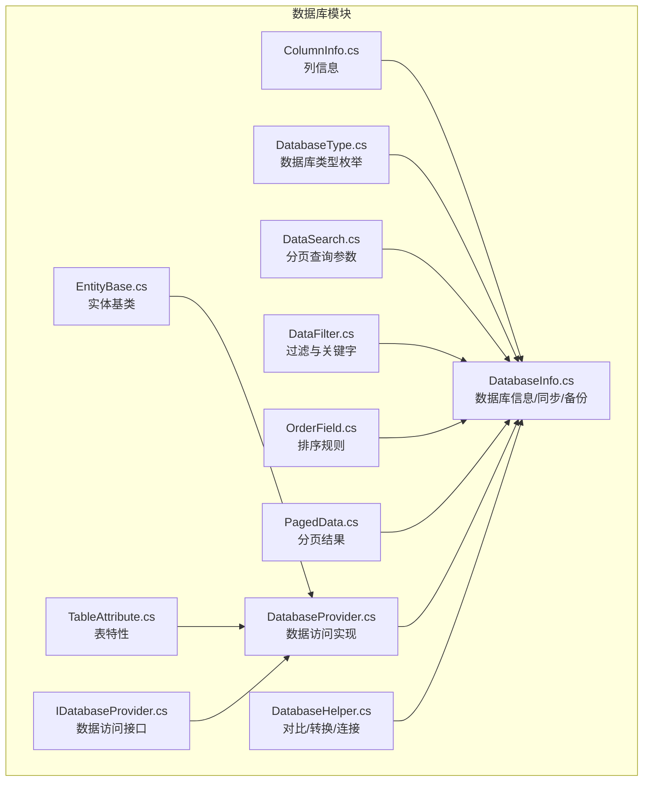
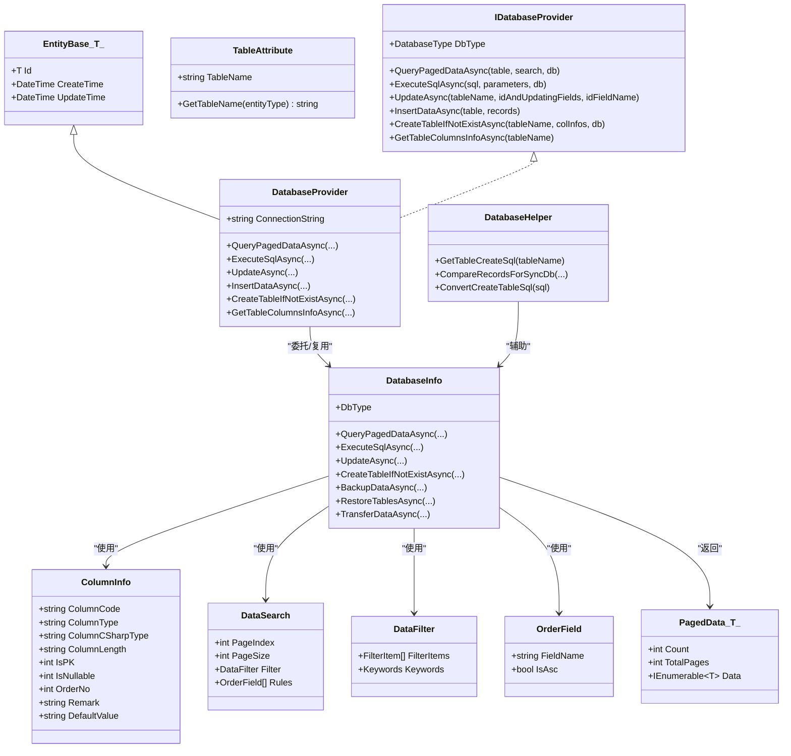
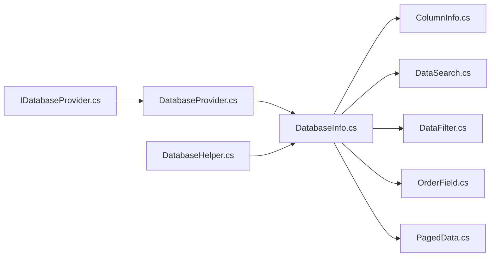
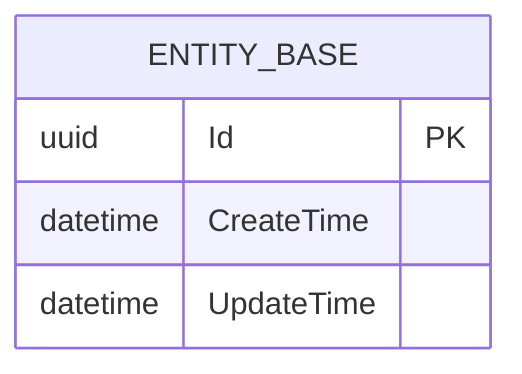

# 数据模型设计

<cite>
**本文引用的文件**
- [EntityBase.cs](file://Sylas.RemoteTasks.Database/EntityBase.cs)
- [TableAttribute.cs](file://Sylas.RemoteTasks.Database/Attributes/TableAttribute.cs)
- [ColumnInfo.cs](file://Sylas.RemoteTasks.Database/Dtos/ColumnInfo.cs)
- [DatabaseType.cs](file://Sylas.RemoteTasks.Database/SyncBase/DatabaseType.cs)
- [DataSearch.cs](file://Sylas.RemoteTasks.Database/SyncBase/DataSearch.cs)
- [DataFilter.cs](file://Sylas.RemoteTasks.Database/SyncBase/DataFilter.cs)
- [OrderField.cs](file://Sylas.RemoteTasks.Database/SyncBase/OrderField.cs)
- [PagedData.cs](file://Sylas.RemoteTasks.Database/SyncBase/PagedData.cs)
- [DatabaseInfo.cs](file://Sylas.RemoteTasks.Database/SyncBase/DatabaseInfo.cs)
- [DatabaseProvider.cs](file://Sylas.RemoteTasks.Database/DatabaseProvider.cs)
- [DatabaseHelper.cs](file://Sylas.RemoteTasks.Database/DatabaseHelper.cs)
- [IDatabaseProvider.cs](file://Sylas.RemoteTasks.Database/IDatabaseProvider.cs)
</cite>

## 目录
1. [简介](#简介)
2. [项目结构](#项目结构)
3. [核心组件](#核心组件)
4. [架构总览](#架构总览)
5. [详细组件分析](#详细组件分析)
6. [依赖关系分析](#依赖关系分析)
7. [性能考量](#性能考量)
8. [故障排查指南](#故障排查指南)
9. [结论](#结论)
10. [附录](#附录)

## 简介
本文件面向 Sylas.RemoteTasks 的数据层，系统性梳理其数据模型设计，覆盖实体关系、字段定义、主键/外键、索引与约束、验证与业务规则、数据库模式图、示例数据、数据访问模式、缓存策略、性能优化、数据生命周期与归档、迁移路径与版本管理、以及数据安全与隐私控制。目标是帮助开发者与运维人员快速理解并正确使用该系统的数据模型。

## 项目结构
数据模型相关代码主要集中在 Sylas.RemoteTasks.Database 模块，围绕以下层次组织：
- 基础设施与工具：实体基类、表特性、数据库类型枚举、分页与过滤模型
- 数据访问接口与实现：IDatabaseProvider 接口与 DatabaseProvider 实现
- 数据库信息与同步：DatabaseInfo（含备份、还原、迁移等）
- 辅助工具：DatabaseHelper（对比同步、SQL 转换）

图表来源
- [EntityBase.cs](file://Sylas.RemoteTasks.Database/EntityBase.cs#L1-L33)
- [TableAttribute.cs](file://Sylas.RemoteTasks.Database/Attributes/TableAttribute.cs#L1-L33)
- [ColumnInfo.cs](file://Sylas.RemoteTasks.Database/Dtos/ColumnInfo.cs#L1-L55)
- [DatabaseType.cs](file://Sylas.RemoteTasks.Database/SyncBase/DatabaseType.cs#L1-L38)
- [DataSearch.cs](file://Sylas.RemoteTasks.Database/SyncBase/DataSearch.cs#L1-L49)
- [DataFilter.cs](file://Sylas.RemoteTasks.Database/SyncBase/DataFilter.cs#L1-L470)
- [OrderField.cs](file://Sylas.RemoteTasks.Database/SyncBase/OrderField.cs#L1-L34)
- [PagedData.cs](file://Sylas.RemoteTasks.Database/SyncBase/PagedData.cs#L1-L46)
- [IDatabaseProvider.cs](file://Sylas.RemoteTasks.Database/IDatabaseProvider.cs#L1-L99)
- [DatabaseProvider.cs](file://Sylas.RemoteTasks.Database/DatabaseProvider.cs#L1-L485)
- [DatabaseInfo.cs](file://Sylas.RemoteTasks.Database/SyncBase/DatabaseInfo.cs#L1-L800)
- [DatabaseHelper.cs](file://Sylas.RemoteTasks.Database/DatabaseHelper.cs#L1-L245)

章节来源
- [EntityBase.cs](file://Sylas.RemoteTasks.Database/EntityBase.cs#L1-L33)
- [TableAttribute.cs](file://Sylas.RemoteTasks.Database/Attributes/TableAttribute.cs#L1-L33)
- [ColumnInfo.cs](file://Sylas.RemoteTasks.Database/Dtos/ColumnInfo.cs#L1-L55)
- [DatabaseType.cs](file://Sylas.RemoteTasks.Database/SyncBase/DatabaseType.cs#L1-L38)
- [DataSearch.cs](file://Sylas.RemoteTasks.Database/SyncBase/DataSearch.cs#L1-L49)
- [DataFilter.cs](file://Sylas.RemoteTasks.Database/SyncBase/DataFilter.cs#L1-L470)
- [OrderField.cs](file://Sylas.RemoteTasks.Database/SyncBase/OrderField.cs#L1-L34)
- [PagedData.cs](file://Sylas.RemoteTasks.Database/SyncBase/PagedData.cs#L1-L46)
- [IDatabaseProvider.cs](file://Sylas.RemoteTasks.Database/IDatabaseProvider.cs#L1-L99)
- [DatabaseProvider.cs](file://Sylas.RemoteTasks.Database/DatabaseProvider.cs#L1-L485)
- [DatabaseInfo.cs](file://Sylas.RemoteTasks.Database/SyncBase/DatabaseInfo.cs#L1-L800)
- [DatabaseHelper.cs](file://Sylas.RemoteTasks.Database/DatabaseHelper.cs#L1-L245)

## 核心组件
- 实体基类与表特性
  - 实体基类提供统一的 Id、CreateTime、UpdateTime 字段，便于审计与追踪
  - 表特性用于显式声明实体对应的物理表名，支持反射解析
- 列信息模型
  - ColumnInfo 描述字段代码、类型、长度、是否主键/可空、排序、备注、默认值等
- 查询与过滤模型
  - DataSearch 定义分页参数（页码、大小）、过滤条件、排序规则
  - DataFilter 支持多字段过滤、关键字匹配、IN/INCLUDE/LIKE 等复杂条件
  - OrderField 定义排序字段与方向
- 数据访问接口与实现
  - IDatabaseProvider 定义分页查询、执行 SQL、动态更新/插入、建表等能力
  - DatabaseProvider 基于配置的连接字符串实现具体操作，并负责参数绑定与事务
- 数据库信息与同步
  - DatabaseInfo 提供多数据库类型支持、连接解析、分页查询、动态更新、建表、备份/还原、数据迁移等
  - DatabaseHelper 提供跨库对比、SQL 转换、连接构造等辅助能力

章节来源
- [EntityBase.cs](file://Sylas.RemoteTasks.Database/EntityBase.cs#L1-L33)
- [TableAttribute.cs](file://Sylas.RemoteTasks.Database/Attributes/TableAttribute.cs#L1-L33)
- [ColumnInfo.cs](file://Sylas.RemoteTasks.Database/Dtos/ColumnInfo.cs#L1-L55)
- [DataSearch.cs](file://Sylas.RemoteTasks.Database/SyncBase/DataSearch.cs#L1-L49)
- [DataFilter.cs](file://Sylas.RemoteTasks.Database/SyncBase/DataFilter.cs#L1-L470)
- [OrderField.cs](file://Sylas.RemoteTasks.Database/SyncBase/OrderField.cs#L1-L34)
- [IDatabaseProvider.cs](file://Sylas.RemoteTasks.Database/IDatabaseProvider.cs#L1-L99)
- [DatabaseProvider.cs](file://Sylas.RemoteTasks.Database/DatabaseProvider.cs#L1-L485)
- [DatabaseInfo.cs](file://Sylas.RemoteTasks.Database/SyncBase/DatabaseInfo.cs#L1-L800)
- [DatabaseHelper.cs](file://Sylas.RemoteTasks.Database/DatabaseHelper.cs#L1-L245)

## 架构总览
数据访问层采用“接口 + 实现 + 工厂/工具”的分层设计，支持多种数据库类型，提供统一的查询、更新、建表、备份与迁移能力。

图表来源
- [EntityBase.cs](file://Sylas.RemoteTasks.Database/EntityBase.cs#L1-L33)
- [TableAttribute.cs](file://Sylas.RemoteTasks.Database/Attributes/TableAttribute.cs#L1-L33)
- [ColumnInfo.cs](file://Sylas.RemoteTasks.Database/Dtos/ColumnInfo.cs#L1-L55)
- [DataSearch.cs](file://Sylas.RemoteTasks.Database/SyncBase/DataSearch.cs#L1-L49)
- [DataFilter.cs](file://Sylas.RemoteTasks.Database/SyncBase/DataFilter.cs#L1-L470)
- [OrderField.cs](file://Sylas.RemoteTasks.Database/SyncBase/OrderField.cs#L1-L34)
- [PagedData.cs](file://Sylas.RemoteTasks.Database/SyncBase/PagedData.cs#L1-L46)
- [IDatabaseProvider.cs](file://Sylas.RemoteTasks.Database/IDatabaseProvider.cs#L1-L99)
- [DatabaseProvider.cs](file://Sylas.RemoteTasks.Database/DatabaseProvider.cs#L1-L485)
- [DatabaseInfo.cs](file://Sylas.RemoteTasks.Database/SyncBase/DatabaseInfo.cs#L1-L800)
- [DatabaseHelper.cs](file://Sylas.RemoteTasks.Database/DatabaseHelper.cs#L1-L245)

## 详细组件分析

### 实体基类与表特性
- 实体基类
  - 默认主键字段为 Id（泛型占位），便于派生实体统一继承
  - CreateTime/UpdateTime 在构造时初始化，支持审计与变更追踪
- 表特性
  - 通过特性声明实体对应的物理表名，反射解析时优先使用特性值，否则回退到类名

章节来源
- [EntityBase.cs](file://Sylas.RemoteTasks.Database/EntityBase.cs#L1-L33)
- [TableAttribute.cs](file://Sylas.RemoteTasks.Database/Attributes/TableAttribute.cs#L1-L33)

### 列信息模型（ColumnInfo）
- 字段定义
  - ColumnCode：字段代码（通常与数据库列一致）
  - ColumnType：数据库列类型（字符串）
  - ColumnCSharpType：C# 对应类型名（用于类型转换）
  - ColumnLength：长度限制
  - IsPK：是否主键（整型标志）
  - IsNullable：是否可空
  - OrderNo：排序序号
  - Remark：备注
  - DefaultValue：默认值
- 复杂度与用途
  - 作为建表、类型转换、动态更新的核心元数据载体
  - 与 DatabaseInfo 的建表、字段转换器缓存机制配合使用

章节来源
- [ColumnInfo.cs](file://Sylas.RemoteTasks.Database/Dtos/ColumnInfo.cs#L1-L55)
- [DatabaseInfo.cs](file://Sylas.RemoteTasks.Database/SyncBase/DatabaseInfo.cs#L515-L549)

### 查询与过滤模型
- DataSearch
  - PageIndex/PageSize：分页参数
  - Filter：DataFilter 过滤器
  - Rules：排序规则列表
- DataFilter
  - FilterItems：FilterItem 列表，支持多字段、多条件组合
  - Keywords：关键字搜索（多字段 LIKE）
- FilterItem
  - FieldName/CompareType/Value：字段、比较类型、值
  - BuildConditionStatement：生成带参数的 WHERE 片段
  - 支持 IN、INCLUDE（LIKE）、动态参数占位符等
- OrderField
  - FieldName/IsAsc：排序字段与方向，默认按 UpdateTime 降序

章节来源
- [DataSearch.cs](file://Sylas.RemoteTasks.Database/SyncBase/DataSearch.cs#L1-L49)
- [DataFilter.cs](file://Sylas.RemoteTasks.Database/SyncBase/DataFilter.cs#L1-L470)
- [OrderField.cs](file://Sylas.RemoteTasks.Database/SyncBase/OrderField.cs#L1-L34)

### 数据访问接口与实现
- IDatabaseProvider
  - 定义分页查询、执行 SQL、动态更新、插入、建表、获取列信息等契约
- DatabaseProvider
  - 基于配置的连接字符串，封装参数绑定、事务、分页 SQL 生成与执行
  - 支持字符串参数的长度指定以提升执行计划复用率
  - 提供 Dataset/DataAdapter 的查询封装（兼容历史场景）

章节来源
- [IDatabaseProvider.cs](file://Sylas.RemoteTasks.Database/IDatabaseProvider.cs#L1-L99)
- [DatabaseProvider.cs](file://Sylas.RemoteTasks.Database/DatabaseProvider.cs#L1-L485)

### 数据库信息与同步（DatabaseInfo）
- 多数据库类型支持：MySql、SqlServer、Oracle、Pg、Sqlite、Dm、MsSqlLocalDb
- 连接解析与切换：支持解析连接字符串、切换数据库、参数占位符替换
- 分页查询：根据数据库类型生成分页 SQL，返回 PagedData<T>
- 动态更新：自动识别主键、排除 CreateTime、注入 UpdateTime
- 建表：根据 ColumnInfo 生成建表语句；支持表存在性检测与创建
- 备份/还原：按表导出 JSON+CSV 格式，支持条件解析与类型转换
- 数据迁移：支持跨库迁移、批量插入、删除已存在数据、并发迁移

章节来源
- [DatabaseInfo.cs](file://Sylas.RemoteTasks.Database/SyncBase/DatabaseInfo.cs#L1-L800)
- [DatabaseInfo.cs](file://Sylas.RemoteTasks.Database/SyncBase/DatabaseInfo.cs#L800-L1599)

### 辅助工具（DatabaseHelper）
- 连接构造：提供不同数据库的连接字符串模板
- 对比同步：基于 Id 字段对比源与目标数据，输出插入/更新/删除集合
- SQL 转换：将 Oracle/SqlServer 建表语法转换为 MySQL 语法
- 数据库类型识别：根据连接字符串判断数据库类型

章节来源
- [DatabaseHelper.cs](file://Sylas.RemoteTasks.Database/DatabaseHelper.cs#L1-L245)

## 依赖关系分析
- 组件耦合
  - DatabaseProvider 依赖 IDatabaseProvider 接口，便于替换实现与测试
  - DatabaseInfo 复用 ColumnInfo、DataSearch、DataFilter、OrderField 等模型
  - DatabaseHelper 与 DatabaseInfo 协作，提供对比与 SQL 转换能力
- 外部依赖
  - 多数据库驱动：MySql.Data、Oracle.ManagedDataAccess、Npgsql、Sqlite、Dm
  - ORM/轻量 ORM：Dapper（用于查询/执行）
  - JSON 序列化：Newtonsoft.Json（用于备份/还原）
- 潜在循环依赖
  - 未发现直接循环依赖；DatabaseInfo 与 DatabaseProvider 通过接口与静态方法协作

图表来源
- [IDatabaseProvider.cs](file://Sylas.RemoteTasks.Database/IDatabaseProvider.cs#L1-L99)
- [DatabaseProvider.cs](file://Sylas.RemoteTasks.Database/DatabaseProvider.cs#L1-L485)
- [DatabaseInfo.cs](file://Sylas.RemoteTasks.Database/SyncBase/DatabaseInfo.cs#L1-L800)
- [ColumnInfo.cs](file://Sylas.RemoteTasks.Database/Dtos/ColumnInfo.cs#L1-L55)
- [DataSearch.cs](file://Sylas.RemoteTasks.Database/SyncBase/DataSearch.cs#L1-L49)
- [DataFilter.cs](file://Sylas.RemoteTasks.Database/SyncBase/DataFilter.cs#L1-L470)
- [OrderField.cs](file://Sylas.RemoteTasks.Database/SyncBase/OrderField.cs#L1-L34)
- [PagedData.cs](file://Sylas.RemoteTasks.Database/SyncBase/PagedData.cs#L1-L46)
- [DatabaseHelper.cs](file://Sylas.RemoteTasks.Database/DatabaseHelper.cs#L1-L245)

## 性能考量
- 参数化与执行计划
  - 字符串参数建议指定 Size，提升 SQL 执行计划复用率（DatabaseProvider）
- 批量与分页
  - 备份/还原与迁移采用批处理（默认 1000/50 行/批），避免内存峰值
  - 分页查询结合 COUNT(*) 与 LIMIT/OFFSET，避免全表扫描
- 连接与事务
  - 统一使用事务包裹写操作，减少锁竞争与一致性问题
- 类型转换与缓存
  - 字段类型转换器缓存（ConcurrentDictionary），避免重复反射与表达式编译
- 数据库类型差异
  - 不同数据库的参数占位符（@/:）在执行前自动替换，确保兼容性

章节来源
- [DatabaseProvider.cs](file://Sylas.RemoteTasks.Database/DatabaseProvider.cs#L286-L311)
- [DatabaseInfo.cs](file://Sylas.RemoteTasks.Database/SyncBase/DatabaseInfo.cs#L1022-L1070)
- [DatabaseInfo.cs](file://Sylas.RemoteTasks.Database/SyncBase/DatabaseInfo.cs#L515-L549)

## 故障排查指南
- 连接字符串问题
  - 检查加密/混淆字符清理与数据库类型识别（DatabaseInfo.CheckConnectionString、GetDbType）
- 参数占位符错误
  - Oracle/Dm 使用冒号占位符，执行前自动替换（DatabaseInfo.ExecuteSqlAsync）
- 更新失败
  - 确保包含主键字段（UpdateAsync 校验），避免遗漏 id 或指定 idFieldName
- 备份/还原异常
  - 备份条件禁止危险 SQL 关键词；还原时按字段类型反序列化并处理特殊字符转义
- 迁移中断
  - 使用事务包裹，异常自动回滚；必要时启用忽略异常模式（TransferDataAsync）

章节来源
- [DatabaseInfo.cs](file://Sylas.RemoteTasks.Database/SyncBase/DatabaseInfo.cs#L68-L108)
- [DatabaseInfo.cs](file://Sylas.RemoteTasks.Database/SyncBase/DatabaseInfo.cs#L374-L399)
- [DatabaseInfo.cs](file://Sylas.RemoteTasks.Database/SyncBase/DatabaseInfo.cs#L497-L514)
- [DatabaseInfo.cs](file://Sylas.RemoteTasks.Database/SyncBase/DatabaseInfo.cs#L958-L961)
- [DatabaseInfo.cs](file://Sylas.RemoteTasks.Database/SyncBase/DatabaseInfo.cs#L1247-L1306)

## 结论
该数据模型以清晰的分层与契约为核心，结合多数据库支持、完善的查询/过滤/分页、动态建表与迁移能力，形成一套可扩展、可维护、可移植的数据访问方案。通过统一的元数据模型（ColumnInfo）与类型转换缓存，兼顾了灵活性与性能。建议在实际落地时，结合业务场景完善主外键约束、索引策略与安全策略。

## 附录

### 数据模型 ER 图

图表来源
- [EntityBase.cs](file://Sylas.RemoteTasks.Database/EntityBase.cs#L1-L33)

### 字段定义与数据类型对照
- ColumnInfo 字段
  - ColumnCode：字符串，表/列标识
  - ColumnType：字符串，数据库列类型
  - ColumnCSharpType：字符串，C# 类型名
  - ColumnLength：字符串，长度
  - IsPK：整型，是否主键
  - IsNullable：整型，是否可空
  - OrderNo：整型，排序
  - Remark：字符串，备注
  - DefaultValue：字符串，默认值

章节来源
- [ColumnInfo.cs](file://Sylas.RemoteTasks.Database/Dtos/ColumnInfo.cs#L1-L55)

### 主键/外键、索引与约束
- 主键
  - 默认约定：实体基类 Id 作为主键；DbTableInfo 通过属性名“id”推断主键
  - DatabaseInfo 建表时依据 ColumnInfo.IsPK 标记生成主键
- 外键
  - 代码层面未内置外键声明；可通过迁移/建表脚本显式添加
- 索引与约束
  - 未内置索引/唯一约束声明；可通过迁移脚本或 CreateTableIfNotExistAsync 生成

章节来源
- [EntityBase.cs](file://Sylas.RemoteTasks.Database/EntityBase.cs#L1-L33)
- [DbTableInfo.cs](file://Sylas.RemoteTasks.Database/SyncBase/DbTableInfo.cs#L88-L102)
- [DatabaseInfo.cs](file://Sylas.RemoteTasks.Database/SyncBase/DatabaseInfo.cs#L744-L797)

### 数据验证与业务规则
- 更新校验
  - 动态更新必须包含主键字段（UpdateAsync 校验）
  - 若未显式指定 idFieldName，则要求参数中包含“id”键
- 过滤与关键字
  - 支持多字段、多条件组合；IN/INCLUDE/LIKE 等复杂条件
  - 关键字搜索支持多字段拼接
- 安全
  - 备份条件禁止危险 SQL 关键词
  - 连接字符串支持解密与清理

章节来源
- [DatabaseInfo.cs](file://Sylas.RemoteTasks.Database/SyncBase/DatabaseInfo.cs#L497-L514)
- [DataFilter.cs](file://Sylas.RemoteTasks.Database/SyncBase/DataFilter.cs#L118-L232)
- [DatabaseInfo.cs](file://Sylas.RemoteTasks.Database/SyncBase/DatabaseInfo.cs#L958-L961)
- [DatabaseInfo.cs](file://Sylas.RemoteTasks.Database/SyncBase/DatabaseInfo.cs#L101-L108)

### 数据访问模式与缓存策略
- 访问模式
  - 分页查询：QueryPagedDataAsync → 生成分页 SQL + COUNT
  - 动态更新：UpdateAsync → 自动注入 UpdateTime，排除 CreateTime
  - 批量迁移：TransferDataAsync → 分批插入/删除已存在数据
- 缓存策略
  - 字段类型转换器缓存（ConcurrentDictionary），按“连接串+表名”键缓存
  - 避免重复反射与表达式编译

章节来源
- [DatabaseInfo.cs](file://Sylas.RemoteTasks.Database/SyncBase/DatabaseInfo.cs#L309-L351)
- [DatabaseInfo.cs](file://Sylas.RemoteTasks.Database/SyncBase/DatabaseInfo.cs#L497-L514)
- [DatabaseInfo.cs](file://Sylas.RemoteTasks.Database/SyncBase/DatabaseInfo.cs#L1433-L1523)
- [DatabaseInfo.cs](file://Sylas.RemoteTasks.Database/SyncBase/DatabaseInfo.cs#L515-L549)

### 性能与并发
- 批处理大小
  - 默认 1000（SqlServer/PG/MySql），Sqlite/SqliteLocalDb 50
- 并发迁移
  - 支持 insertOnly 模式下的并行任务（Task.WhenAll）

章节来源
- [DatabaseInfo.cs](file://Sylas.RemoteTasks.Database/SyncBase/DatabaseInfo.cs#L1065-L1068)
- [DatabaseInfo.cs](file://Sylas.RemoteTasks.Database/SyncBase/DatabaseInfo.cs#L1309-L1329)

### 数据生命周期、保留策略与归档
- 生命周期
  - 通过 CreateTime/UpdateTime 追踪创建与变更
- 保留策略
  - 未内置自动清理策略；可通过迁移/定时任务实现
- 归档
  - 支持按表导出备份（BackupDataAsync），可结合条件筛选

章节来源
- [EntityBase.cs](file://Sylas.RemoteTasks.Database/EntityBase.cs#L1-L33)
- [DatabaseInfo.cs](file://Sylas.RemoteTasks.Database/SyncBase/DatabaseInfo.cs#L863-L941)

### 数据迁移路径与版本管理
- 跨库迁移
  - TransferDataAsync 支持源/目标库分离，按批处理执行
- 版本管理
  - 未内置版本号字段；可通过迁移脚本或表结构演进管理

章节来源
- [DatabaseInfo.cs](file://Sylas.RemoteTasks.Database/SyncBase/DatabaseInfo.cs#L1247-L1306)
- [DatabaseInfo.cs](file://Sylas.RemoteTasks.Database/SyncBase/DatabaseInfo.cs#L1433-L1523)

### 数据安全、隐私与访问控制
- 连接安全
  - 支持连接字符串解密与清理
- 条件安全
  - 备份条件禁止危险关键词
- 访问控制
  - 未内置鉴权/授权；建议在应用层或网关层实现

章节来源
- [DatabaseInfo.cs](file://Sylas.RemoteTasks.Database/SyncBase/DatabaseInfo.cs#L101-L108)
- [DatabaseInfo.cs](file://Sylas.RemoteTasks.Database/SyncBase/DatabaseInfo.cs#L958-L961)