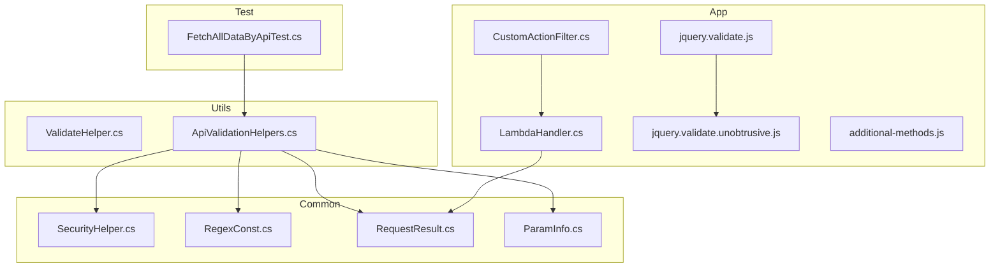
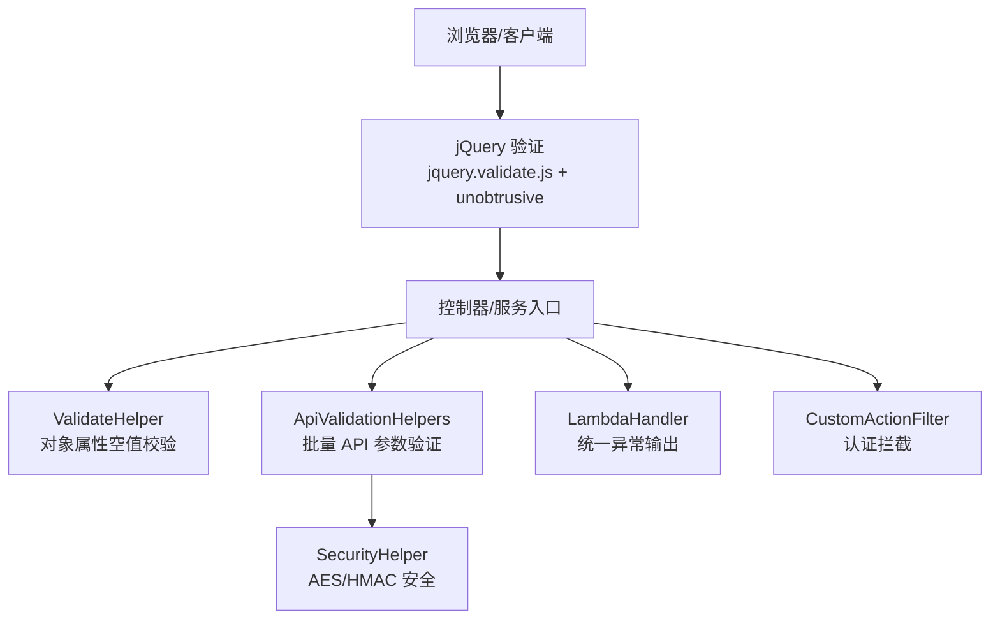
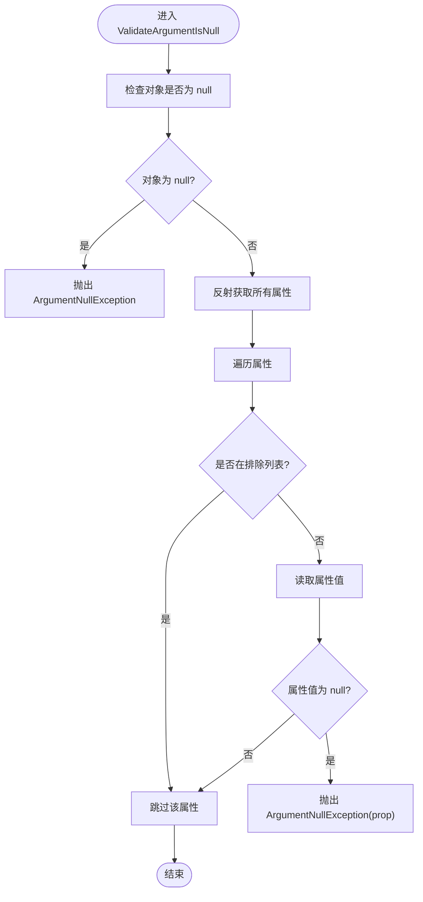
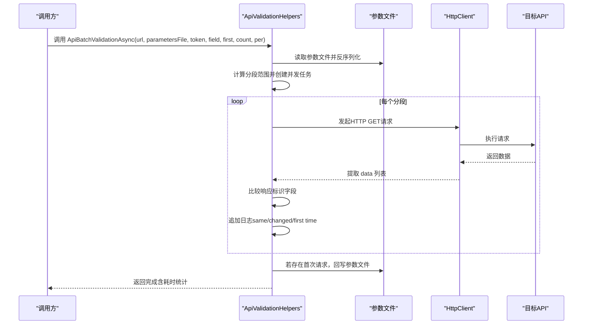
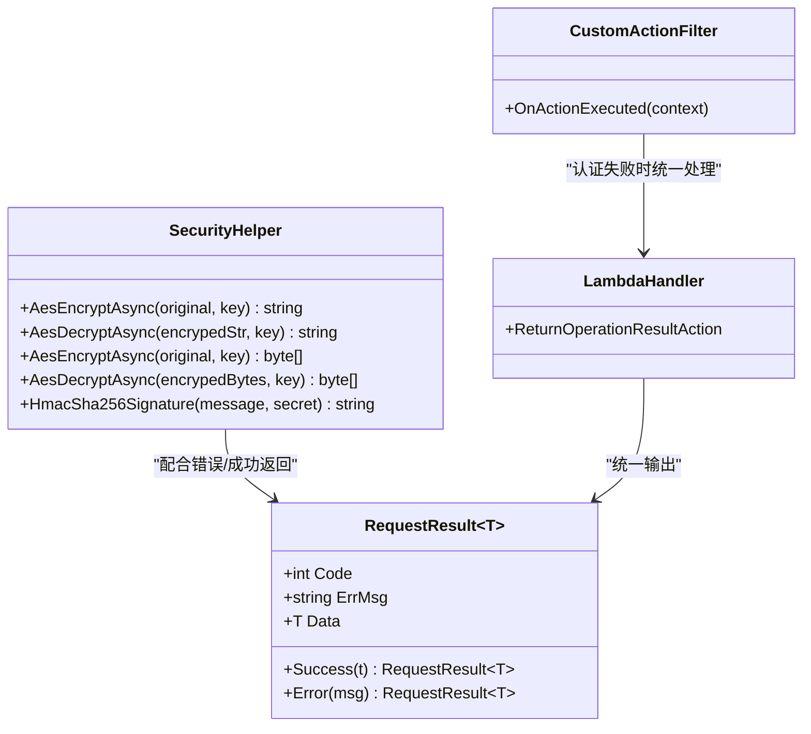
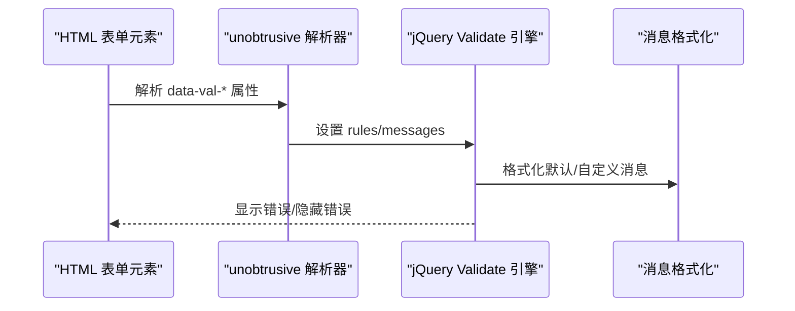
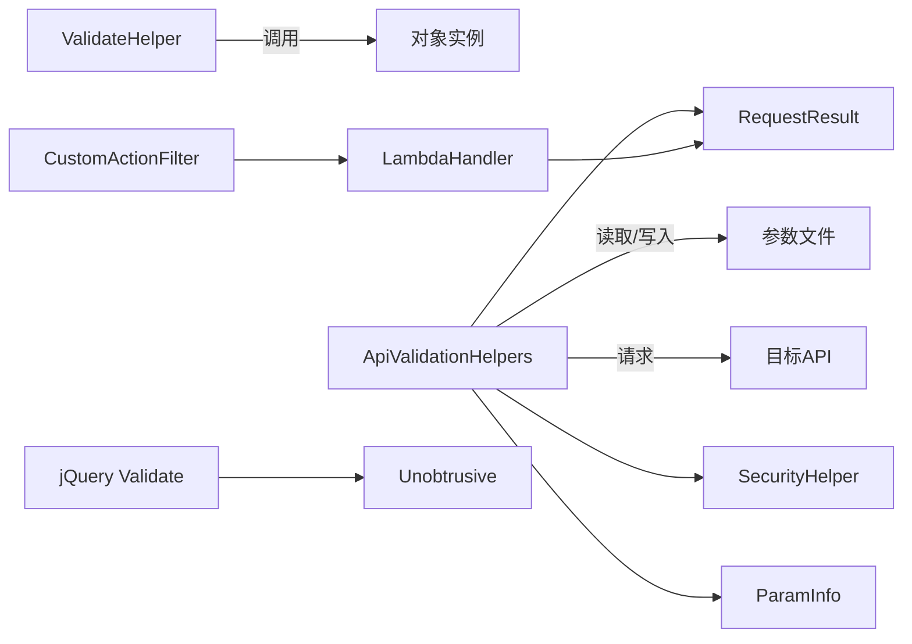

# 数据验证规则

<cite>
**本文档引用的文件**
- [ValidateHelper.cs](file://Sylas.RemoteTasks.Utils/ValidateHelper.cs)
- [ApiValidationHelpers.cs](file://Sylas.RemoteTasks.Utils/ApiValidationHelpers.cs)
- [SecurityHelper.cs](file://Sylas.RemoteTasks.Common/SecurityHelper.cs)
- [RegexConst.cs](file://Sylas.RemoteTasks.Common/RegexConst.cs)
- [RequestResult.cs](file://Sylas.RemoteTasks.Common/Dtos/RequestResult.cs)
- [ParamInfo.cs](file://Sylas.RemoteTasks.Common/Dtos/ParamInfo.cs)
- [LambdaHandler.cs](file://Sylas.RemoteTasks.App/ExceptionHandlers/LambdaHandler.cs)
- [CustomActionFilter.cs](file://Sylas.RemoteTasks.App/Infrastructure/CustomActionFilter.cs)
- [jquery.validate.js](file://Sylas.RemoteTasks.App/wwwroot/lib/jquery-validation/dist/jquery.validate.js)
- [jquery.validate.unobtrusive.js](file://Sylas.RemoteTasks.App/wwwroot/lib/jquery-validation-unobtrusive/jquery.validate.unobtrusive.js)
- [additional-methods.js](file://Sylas.RemoteTasks.App/wwwroot/lib/jquery-validation/dist/additional-methods.js)
- [FetchAllDataByApiTest.cs](file://Sylas.RemoteTasks.Test/Remote/FetchAllDataByApiTest.cs)
</cite>

## 目录
1. [简介](#简介)
2. [项目结构](#项目结构)
3. [核心组件](#核心组件)
4. [架构总览](#架构总览)
5. [详细组件分析](#详细组件分析)
6. [依赖关系分析](#依赖关系分析)
7. [性能考量](#性能考量)
8. [故障排除指南](#故障排除指南)
9. [结论](#结论)
10. [附录](#附录)

## 简介
本文件系统性梳理 Sylas.RemoteTasks 中的数据验证规则与实现，重点覆盖以下方面：
- ValidateHelper：对象属性级空值验证能力与使用方法
- ApiValidationHelpers：批量 API 参数验证与一致性比对机制
- 输入验证、业务规则验证与安全验证的分层应用
- 自定义验证规则的实现指南与最佳实践
- 常见验证场景（字符串长度、数值范围、格式验证）与错误处理
- 数据安全验证与防护措施

## 项目结构
围绕验证与安全的相关模块分布如下：
- Utils 层：ValidateHelper、ApiValidationHelpers
- Common 层：SecurityHelper（加密/解密/签名）、RegexConst（预置正则）
- App 层：异常处理 LambdaHandler、认证过滤器 CustomActionFilter；前端 jQuery 验证库
- Test 层：FetchAllDataByApiTest（批量验证用例）

图表来源
- [ValidateHelper.cs](file://Sylas.RemoteTasks.Utils/ValidateHelper.cs#L1-L36)
- [ApiValidationHelpers.cs](file://Sylas.RemoteTasks.Utils/ApiValidationHelpers.cs#L1-L171)
- [SecurityHelper.cs](file://Sylas.RemoteTasks.Common/SecurityHelper.cs#L1-L228)
- [RegexConst.cs](file://Sylas.RemoteTasks.Common/RegexConst.cs#L1-L161)
- [RequestResult.cs](file://Sylas.RemoteTasks.Common/Dtos/RequestResult.cs#L1-L65)
- [ParamInfo.cs](file://Sylas.RemoteTasks.Common/Dtos/ParamInfo.cs#L1-L32)
- [LambdaHandler.cs](file://Sylas.RemoteTasks.App/ExceptionHandlers/LambdaHandler.cs#L1-L28)
- [CustomActionFilter.cs](file://Sylas.RemoteTasks.App/Infrastructure/CustomActionFilter.cs#L1-L23)
- [jquery.validate.js](file://Sylas.RemoteTasks.App/wwwroot/lib/jquery-validation/dist/jquery.validate.js#L142-L802)
- [jquery.validate.unobtrusive.js](file://Sylas.RemoteTasks.App/wwwroot/lib/jquery-validation-unobtrusive/jquery.validate.unobtrusive.js#L174-L337)
- [additional-methods.js](file://Sylas.RemoteTasks.App/wwwroot/lib/jquery-validation/dist/additional-methods.js#L108-L848)
- [FetchAllDataByApiTest.cs](file://Sylas.RemoteTasks.Test/Remote/FetchAllDataByApiTest.cs#L56-L81)

章节来源
- [ValidateHelper.cs](file://Sylas.RemoteTasks.Utils/ValidateHelper.cs#L1-L36)
- [ApiValidationHelpers.cs](file://Sylas.RemoteTasks.Utils/ApiValidationHelpers.cs#L1-L171)
- [SecurityHelper.cs](file://Sylas.RemoteTasks.Common/SecurityHelper.cs#L1-L228)
- [RegexConst.cs](file://Sylas.RemoteTasks.Common/RegexConst.cs#L1-L161)
- [RequestResult.cs](file://Sylas.RemoteTasks.Common/Dtos/RequestResult.cs#L1-L65)
- [ParamInfo.cs](file://Sylas.RemoteTasks.Common/Dtos/ParamInfo.cs#L1-L32)
- [LambdaHandler.cs](file://Sylas.RemoteTasks.App/ExceptionHandlers/LambdaHandler.cs#L1-L28)
- [CustomActionFilter.cs](file://Sylas.RemoteTasks.App/Infrastructure/CustomActionFilter.cs#L1-L23)
- [jquery.validate.js](file://Sylas.RemoteTasks.App/wwwroot/lib/jquery-validation/dist/jquery.validate.js#L142-L802)
- [jquery.validate.unobtrusive.js](file://Sylas.RemoteTasks.App/wwwroot/lib/jquery-validation-unobtrusive/jquery.validate.unobtrusive.js#L174-L337)
- [additional-methods.js](file://Sylas.RemoteTasks.App/wwwroot/lib/jquery-validation/dist/additional-methods.js#L108-L848)
- [FetchAllDataByApiTest.cs](file://Sylas.RemoteTasks.Test/Remote/FetchAllDataByApiTest.cs#L56-L81)

## 核心组件
- ValidateHelper：提供对象属性级空值验证，支持排除特定属性，抛出 ArgumentNullException 触发上层统一错误处理
- ApiValidationHelpers：面向 API 的批量参数验证，通过 HttpClient 并发请求、对比响应标识字段，记录日志并可回写参数文件
- SecurityHelper：提供 AES 加密/解密与 HMAC-SHA256 签名，支撑数据安全验证与防护
- RegexConst：提供数据库连接串、字段类型、模板变量等常用正则，辅助格式验证
- RequestResult/ParamInfo：统一响应结构与参数解析，配合错误处理与前端验证
- LambdaHandler/CustomActionFilter：统一异常输出与认证拦截，保障安全边界
- 前端 jQuery 验证库：jquery.validate.js 与 jquery.validate.unobtrusive.js 提供客户端验证与消息格式化

章节来源
- [ValidateHelper.cs](file://Sylas.RemoteTasks.Utils/ValidateHelper.cs#L11-L33)
- [ApiValidationHelpers.cs](file://Sylas.RemoteTasks.Utils/ApiValidationHelpers.cs#L25-L95)
- [SecurityHelper.cs](file://Sylas.RemoteTasks.Common/SecurityHelper.cs#L36-L88)
- [RegexConst.cs](file://Sylas.RemoteTasks.Common/RegexConst.cs#L11-L161)
- [RequestResult.cs](file://Sylas.RemoteTasks.Common/Dtos/RequestResult.cs#L40-L50)
- [ParamInfo.cs](file://Sylas.RemoteTasks.Common/Dtos/ParamInfo.cs#L14-L29)
- [LambdaHandler.cs](file://Sylas.RemoteTasks.App/ExceptionHandlers/LambdaHandler.cs#L9-L25)
- [CustomActionFilter.cs](file://Sylas.RemoteTasks.App/Infrastructure/CustomActionFilter.cs#L9-L20)
- [jquery.validate.js](file://Sylas.RemoteTasks.App/wwwroot/lib/jquery-validation/dist/jquery.validate.js#L849-L880)
- [jquery.validate.unobtrusive.js](file://Sylas.RemoteTasks.App/wwwroot/lib/jquery-validation-unobtrusive/jquery.validate.unobtrusive.js#L174-L337)

## 架构总览
验证体系分为三层：
- 输入验证（客户端）：前端 jQuery 验证库负责基础格式校验与消息展示
- 业务规则验证（服务端）：ValidateHelper 进行对象属性空值校验；ApiValidationHelpers 执行批量 API 参数一致性验证
- 安全验证（服务端）：SecurityHelper 提供加密/解密与签名；LambdaHandler/CustomActionFilter 提供统一异常与认证拦截

图表来源
- [jquery.validate.js](file://Sylas.RemoteTasks.App/wwwroot/lib/jquery-validation/dist/jquery.validate.js#L142-L802)
- [jquery.validate.unobtrusive.js](file://Sylas.RemoteTasks.App/wwwroot/lib/jquery-validation-unobtrusive/jquery.validate.unobtrusive.js#L174-L337)
- [ValidateHelper.cs](file://Sylas.RemoteTasks.Utils/ValidateHelper.cs#L11-L33)
- [ApiValidationHelpers.cs](file://Sylas.RemoteTasks.Utils/ApiValidationHelpers.cs#L25-L95)
- [SecurityHelper.cs](file://Sylas.RemoteTasks.Common/SecurityHelper.cs#L36-L88)
- [LambdaHandler.cs](file://Sylas.RemoteTasks.App/ExceptionHandlers/LambdaHandler.cs#L9-L25)
- [CustomActionFilter.cs](file://Sylas.RemoteTasks.App/Infrastructure/CustomActionFilter.cs#L9-L20)

## 详细组件分析

### ValidateHelper 分析
- 功能概述
  - 对泛型对象的所有公开属性执行空值检查，支持排除指定属性列表
  - 当对象或任一非排除属性为 null 时，抛出 ArgumentNullException
- 使用建议
  - 在服务层或控制器入口调用，确保后续业务逻辑不会因空值导致异常
  - 合理设置 excludeProps，避免对可选字段误判
- 错误处理
  - 抛出异常由上层统一捕获（如 LambdaHandler），转换为标准响应结构

图表来源
- [ValidateHelper.cs](file://Sylas.RemoteTasks.Utils/ValidateHelper.cs#L11-L33)

章节来源
- [ValidateHelper.cs](file://Sylas.RemoteTasks.Utils/ValidateHelper.cs#L11-L33)

### ApiValidationHelpers 分析
- 功能概述
  - 支持从参数文件批量加载参数集，按范围并发请求目标 API
  - 对比响应中指定标识字段，识别“相同”“变更”“首次请求”三种状态
  - 记录耗时统计与日志，必要时回写参数文件（缓存上次响应）
- 关键流程
  - 参数文件读取与反序列化
  - 分段并发任务调度（countPerClient 控制每批请求数）
  - 请求执行与结果提取（基于远程数据提取工具）
  - 响应标识字段对比与日志拼接
  - 日志汇总与可选参数文件更新
- 使用建议
  - 合理设置 firstIndex/count/countPerClient，避免单次内存压力过大
  - responseIdentityField 应选择稳定且唯一的标识字段
  - 结合 Authorization 头部进行受控访问

图表来源
- [ApiValidationHelpers.cs](file://Sylas.RemoteTasks.Utils/ApiValidationHelpers.cs#L35-L95)
- [ApiValidationHelpers.cs](file://Sylas.RemoteTasks.Utils/ApiValidationHelpers.cs#L96-L168)

章节来源
- [ApiValidationHelpers.cs](file://Sylas.RemoteTasks.Utils/ApiValidationHelpers.cs#L25-L95)
- [ApiValidationHelpers.cs](file://Sylas.RemoteTasks.Utils/ApiValidationHelpers.cs#L96-L168)
- [FetchAllDataByApiTest.cs](file://Sylas.RemoteTasks.Test/Remote/FetchAllDataByApiTest.cs#L56-L69)

### 安全验证与防护
- 数据加密/解密
  - AES 加密/解密：支持字符串与字节数组，内置密钥与 IV 处理
  - 密钥长度标准化，避免弱密钥
- 数字签名
  - HMAC-SHA256：对消息进行签名，便于服务端校验完整性与来源
- 前端安全
  - 通过 CustomActionFilter 实现未认证重定向登录
  - LambdaHandler 统一异常输出为 JSON，避免敏感堆栈泄露

图表来源
- [SecurityHelper.cs](file://Sylas.RemoteTasks.Common/SecurityHelper.cs#L36-L88)
- [RequestResult.cs](file://Sylas.RemoteTasks.Common/Dtos/RequestResult.cs#L40-L50)
- [LambdaHandler.cs](file://Sylas.RemoteTasks.App/ExceptionHandlers/LambdaHandler.cs#L9-L25)
- [CustomActionFilter.cs](file://Sylas.RemoteTasks.App/Infrastructure/CustomActionFilter.cs#L9-L20)

章节来源
- [SecurityHelper.cs](file://Sylas.RemoteTasks.Common/SecurityHelper.cs#L36-L88)
- [RequestResult.cs](file://Sylas.RemoteTasks.Common/Dtos/RequestResult.cs#L40-L50)
- [LambdaHandler.cs](file://Sylas.RemoteTasks.App/ExceptionHandlers/LambdaHandler.cs#L9-L25)
- [CustomActionFilter.cs](file://Sylas.RemoteTasks.App/Infrastructure/CustomActionFilter.cs#L9-L20)

### 前端验证与消息格式化
- jquery.validate.js
  - 核心验证引擎，支持规则添加、消息格式化、错误收集与显示控制
- jquery.validate.unobtrusive.js
  - 解析 HTML 上的 data-val-* 属性，自动映射到 jQuery Validate 规则与消息
- additional-methods.js
  - 提供额外验证方法（如模式匹配、信用卡号、移动电话等）

图表来源
- [jquery.validate.js](file://Sylas.RemoteTasks.App/wwwroot/lib/jquery-validation/dist/jquery.validate.js#L849-L880)
- [jquery.validate.unobtrusive.js](file://Sylas.RemoteTasks.App/wwwroot/lib/jquery-validation-unobtrusive/jquery.validate.unobtrusive.js#L174-L337)
- [additional-methods.js](file://Sylas.RemoteTasks.App/wwwroot/lib/jquery-validation/dist/additional-methods.js#L828-L836)

章节来源
- [jquery.validate.js](file://Sylas.RemoteTasks.App/wwwroot/lib/jquery-validation/dist/jquery.validate.js#L142-L802)
- [jquery.validate.unobtrusive.js](file://Sylas.RemoteTasks.App/wwwroot/lib/jquery-validation-unobtrusive/jquery.validate.unobtrusive.js#L174-L337)
- [additional-methods.js](file://Sylas.RemoteTasks.App/wwwroot/lib/jquery-validation/dist/additional-methods.js#L108-L848)

## 依赖关系分析
- ValidateHelper 依赖于反射机制，耦合度低但需注意性能开销
- ApiValidationHelpers 依赖 SecurityHelper（间接）、RegexConst（可选）、RequestResult/ParamInfo（数据结构）
- 前端验证库与后端验证规则解耦，通过约定字段与消息格式对接
- 异常处理与认证过滤器贯穿全局，形成统一的安全边界

图表来源
- [ValidateHelper.cs](file://Sylas.RemoteTasks.Utils/ValidateHelper.cs#L11-L33)
- [ApiValidationHelpers.cs](file://Sylas.RemoteTasks.Utils/ApiValidationHelpers.cs#L35-L95)
- [SecurityHelper.cs](file://Sylas.RemoteTasks.Common/SecurityHelper.cs#L36-L88)
- [RequestResult.cs](file://Sylas.RemoteTasks.Common/Dtos/RequestResult.cs#L40-L50)
- [ParamInfo.cs](file://Sylas.RemoteTasks.Common/Dtos/ParamInfo.cs#L14-L29)
- [LambdaHandler.cs](file://Sylas.RemoteTasks.App/ExceptionHandlers/LambdaHandler.cs#L9-L25)
- [CustomActionFilter.cs](file://Sylas.RemoteTasks.App/Infrastructure/CustomActionFilter.cs#L9-L20)
- [jquery.validate.js](file://Sylas.RemoteTasks.App/wwwroot/lib/jquery-validation/dist/jquery.validate.js#L142-L802)
- [jquery.validate.unobtrusive.js](file://Sylas.RemoteTasks.App/wwwroot/lib/jquery-validation-unobtrusive/jquery.validate.unobtrusive.js#L174-L337)

章节来源
- [ValidateHelper.cs](file://Sylas.RemoteTasks.Utils/ValidateHelper.cs#L11-L33)
- [ApiValidationHelpers.cs](file://Sylas.RemoteTasks.Utils/ApiValidationHelpers.cs#L35-L95)
- [SecurityHelper.cs](file://Sylas.RemoteTasks.Common/SecurityHelper.cs#L36-L88)
- [RequestResult.cs](file://Sylas.RemoteTasks.Common/Dtos/RequestResult.cs#L40-L50)
- [ParamInfo.cs](file://Sylas.RemoteTasks.Common/Dtos/ParamInfo.cs#L14-L29)
- [LambdaHandler.cs](file://Sylas.RemoteTasks.App/ExceptionHandlers/LambdaHandler.cs#L9-L25)
- [CustomActionFilter.cs](file://Sylas.RemoteTasks.App/Infrastructure/CustomActionFilter.cs#L9-L20)
- [jquery.validate.js](file://Sylas.RemoteTasks.App/wwwroot/lib/jquery-validation/dist/jquery.validate.js#L142-L802)
- [jquery.validate.unobtrusive.js](file://Sylas.RemoteTasks.App/wwwroot/lib/jquery-validation-unobtrusive/jquery.validate.unobtrusive.js#L174-L337)

## 性能考量
- ValidateHelper
  - 反射遍历属性存在性能成本，建议仅在关键入口调用，避免高频路径重复反射
  - 对大型对象建议分批验证或缓存属性元数据
- ApiValidationHelpers
  - 并发请求数（countPerClient）直接影响吞吐与资源占用，需结合目标 API 限流策略调整
  - 响应标识字段对比为 O(n) 字符串拼接与比较，建议优先选择短而稳定的标识字段
  - 日志写盘为 I/O 瓶颈，建议异步写入并限制日志大小

## 故障排除指南
- 常见问题
  - 参数范围越界：分段计算错误会导致异常，需检查 firstIndex/count/countPerClient
  - 首次请求回写：若存在“首次请求”标记，会覆盖参数文件中的响应缓存，需确认预期行为
  - 前端验证未生效：检查 data-val-* 属性是否正确、unobtrusive 是否已解析
  - 统一异常输出：确保异常处理中间件已注册，避免直接抛出未捕获异常
- 排查步骤
  - 查看验证日志（包含 same/changed/first time 标记）
  - 核对响应标识字段与数据提取逻辑
  - 检查认证头与授权策略
  - 确认 LambdaHandler 已正确配置为异常处理器

章节来源
- [ApiValidationHelpers.cs](file://Sylas.RemoteTasks.Utils/ApiValidationHelpers.cs#L108-L111)
- [ApiValidationHelpers.cs](file://Sylas.RemoteTasks.Utils/ApiValidationHelpers.cs#L91-L94)
- [jquery.validate.unobtrusive.js](file://Sylas.RemoteTasks.App/wwwroot/lib/jquery-validation-unobtrusive/jquery.validate.unobtrusive.js#L174-L337)
- [LambdaHandler.cs](file://Sylas.RemoteTasks.App/ExceptionHandlers/LambdaHandler.cs#L9-L25)

## 结论
本项目在验证层面形成了“前端格式校验 + 服务端对象校验 + 批量 API 一致性校验 + 安全加密/签名”的多层防护体系。ValidateHelper 与 ApiValidationHelpers 分别覆盖了对象级与接口级验证场景，配合 SecurityHelper 与统一异常/认证处理，构建了完整、可扩展的验证与安全框架。

## 附录

### 自定义验证规则实现指南与最佳实践
- 前端自定义规则
  - 使用 jquery.validate.js 的 addMethod 添加规则，配合 additional-methods.js 扩展
  - 使用 unobtrusive 解析 data-val-* 属性映射到规则与消息
- 服务端自定义规则
  - 对象级：在业务入口调用 ValidateHelper，必要时扩展为带业务语义的验证器
  - 接口级：在 ApiValidationHelpers 基础上扩展响应字段对比策略或引入更多一致性约束
- 最佳实践
  - 明确分层职责：前端负责用户体验，服务端负责业务与安全
  - 统一错误消息：使用 RequestResult 统一结构，避免泄露内部细节
  - 安全优先：对敏感数据采用 AES 加密，对关键操作采用 HMAC 签名
  - 可观测性：保留验证日志与耗时统计，便于定位问题与优化性能

章节来源
- [jquery.validate.js](file://Sylas.RemoteTasks.App/wwwroot/lib/jquery-validation/dist/jquery.validate.js#L766-L802)
- [jquery.validate.unobtrusive.js](file://Sylas.RemoteTasks.App/wwwroot/lib/jquery-validation-unobtrusive/jquery.validate.unobtrusive.js#L278-L337)
- [additional-methods.js](file://Sylas.RemoteTasks.App/wwwroot/lib/jquery-validation/dist/additional-methods.js#L828-L836)
- [RequestResult.cs](file://Sylas.RemoteTasks.Common/Dtos/RequestResult.cs#L40-L50)
- [SecurityHelper.cs](file://Sylas.RemoteTasks.Common/SecurityHelper.cs#L216-L225)

### 常见验证场景示例（路径指引）
- 字符串长度验证
  - 前端：使用 data-val-length 与 data-val-length-range
  - 服务端：结合 ValidateHelper 与自定义规则
  - 参考路径：[jquery.validate.unobtrusive.js](file://Sylas.RemoteTasks.App/wwwroot/lib/jquery-validation-unobtrusive/jquery.validate.unobtrusive.js#L291-L322)
- 数值范围检查
  - 前端：使用 data-val-range
  - 服务端：自定义 addMethod 或在业务层判断
  - 参考路径：[jquery.validate.unobtrusive.js](file://Sylas.RemoteTasks.App/wwwroot/lib/jquery-validation-unobtrusive/jquery.validate.unobtrusive.js#L291-L322)
- 格式验证
  - 前端：使用 data-val-pattern 或 additional-methods.js 内置方法
  - 服务端：结合 RegexConst 预置正则
  - 参考路径：[additional-methods.js](file://Sylas.RemoteTasks.App/wwwroot/lib/jquery-validation/dist/additional-methods.js#L828-L836)，[RegexConst.cs](file://Sylas.RemoteTasks.Common/RegexConst.cs#L11-L161)