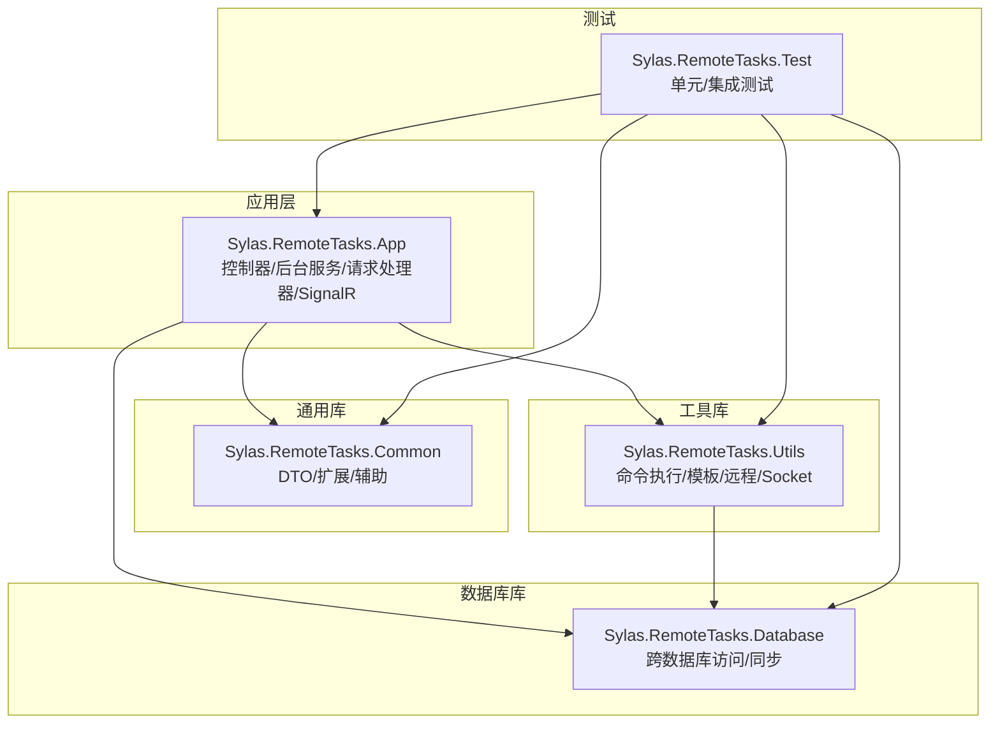
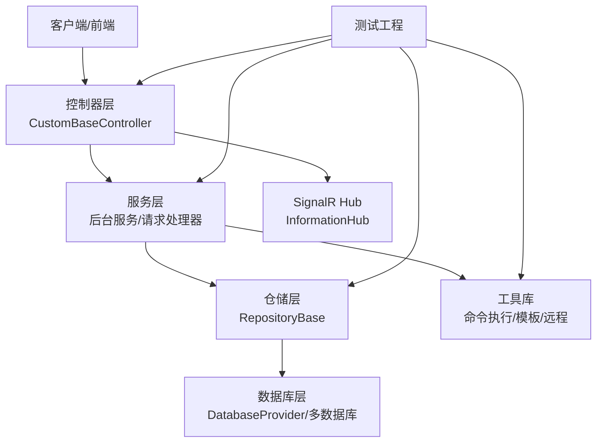
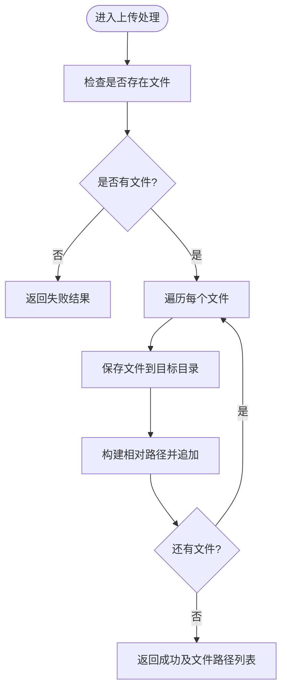
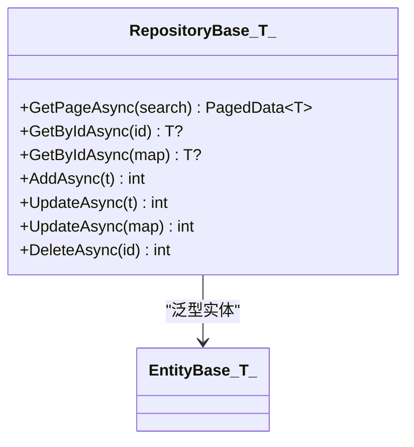
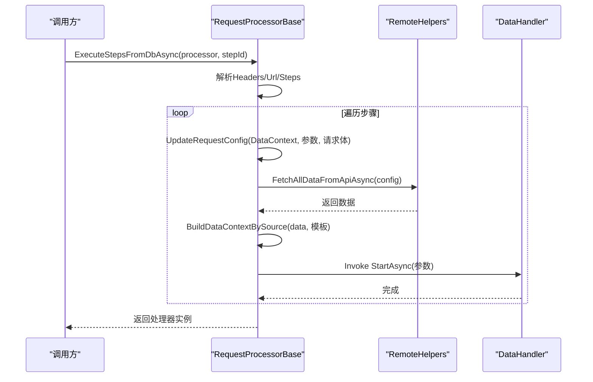
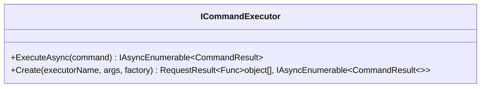
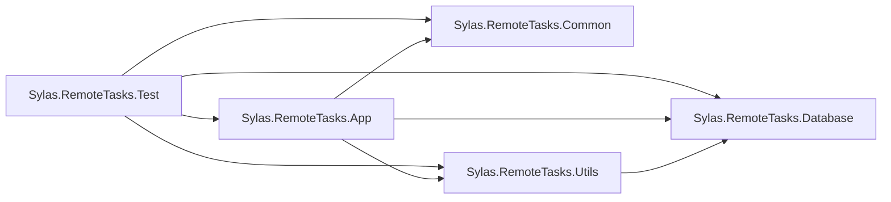

# 代码规范

<cite>
**本文引用的文件**
- [.editorconfig](file://.editorconfig)
- [README.md](file://README.md)
- [Program.cs](file://Sylas.RemoteTasks.App/Program.cs)
- [Sylas.RemoteTasks.App.csproj](file://Sylas.RemoteTasks.App/Sylas.RemoteTasks.App.csproj)
- [Sylas.RemoteTasks.Common.csproj](file://Sylas.RemoteTasks.Common/Sylas.RemoteTasks.Common.csproj)
- [Sylas.RemoteTasks.Database.csproj](file://Sylas.RemoteTasks.Database/Sylas.RemoteTasks.Database.csproj)
- [Sylas.RemoteTasks.Utils.csproj](file://Sylas.RemoteTasks.Utils/Sylas.RemoteTasks.Utils.csproj)
- [Sylas.RemoteTasks.Test.csproj](file://Sylas.RemoteTasks.Test/Sylas.RemoteTasks.Test.csproj)
- [CustomBaseController.cs](file://Sylas.RemoteTasks.App/Controllers/CustomBaseController.cs)
- [RepositoryBase.cs](file://Sylas.RemoteTasks.App/Infrastructure/RepositoryBase.cs)
- [OperationResult.cs](file://Sylas.RemoteTasks.Common/Dtos/OperationResult.cs)
- [EntityBase.cs](file://Sylas.RemoteTasks.App/Database/EntityBase.cs)
- [ICommandExecutor.cs](file://Sylas.RemoteTasks.Utils/CommandExecutor/ICommandExecutor.cs)
- [RequestProcessorBase.cs](file://Sylas.RemoteTasks.App/RequestProcessor/RequestProcessorBase.cs)
- [appsettings.json](file://Sylas.RemoteTasks.App/appsettings.json)
- [LambdaHandler.cs](file://Sylas.RemoteTasks.App/ExceptionHandlers/LambdaHandler.cs)
- [TestBase.cs](file://Sylas.RemoteTasks.Test/TestBase.cs)
- [TestFixture.cs](file://Sylas.RemoteTasks.Test/TestFixture.cs)
</cite>

## 目录
1. [引言](#引言)
2. [项目结构](#项目结构)
3. [核心组件](#核心组件)
4. [架构总览](#架构总览)
5. [详细组件分析](#详细组件分析)
6. [依赖关系分析](#依赖关系分析)
7. [性能考量](#性能考量)
8. [故障排查指南](#故障排查指南)
9. [结论](#结论)
10. [附录](#附录)

## 引言
本文件为 Sylas.RemoteTasks 项目的代码规范文档，面向开发与维护人员，系统性阐述 C# 编码标准、命名约定、文件组织结构、注释规范、项目特定风格与最佳实践，并提供代码审查检查清单与自动化质量工具配置建议。内容基于仓库现有代码与配置文件进行归纳总结，确保一致性与可维护性。

## 项目结构
项目采用多项目解决方案（Solution）组织，按职责划分为应用层、通用库、数据库访问与工具库、测试工程等模块。应用层负责 HTTP 控制器、后台服务、请求处理器、SignalR Hub 等；通用库提供公共 DTO、扩展与辅助能力；数据库库封装跨数据库访问与同步逻辑；工具库提供命令执行、模板解析、远程调用、Socket 辅助等；测试工程覆盖单元测试与集成测试。

图表来源
- [Sylas.RemoteTasks.App.csproj](file://Sylas.RemoteTasks.App/Sylas.RemoteTasks.App.csproj#L1-L61)
- [Sylas.RemoteTasks.Common.csproj](file://Sylas.RemoteTasks.Common/Sylas.RemoteTasks.Common.csproj#L1-L16)
- [Sylas.RemoteTasks.Database.csproj](file://Sylas.RemoteTasks.Database/Sylas.RemoteTasks.Database.csproj#L1-L52)
- [Sylas.RemoteTasks.Utils.csproj](file://Sylas.RemoteTasks.Utils/Sylas.RemoteTasks.Utils.csproj#L1-L47)
- [Sylas.RemoteTasks.Test.csproj](file://Sylas.RemoteTasks.Test/Sylas.RemoteTasks.Test.csproj#L1-L44)

章节来源
- [Sylas.RemoteTasks.App.csproj](file://Sylas.RemoteTasks.App/Sylas.RemoteTasks.App.csproj#L1-L61)
- [Sylas.RemoteTasks.Common.csproj](file://Sylas.RemoteTasks.Common/Sylas.RemoteTasks.Common.csproj#L1-L16)
- [Sylas.RemoteTasks.Database.csproj](file://Sylas.RemoteTasks.Database/Sylas.RemoteTasks.Database.csproj#L1-L52)
- [Sylas.RemoteTasks.Utils.csproj](file://Sylas.RemoteTasks.Utils/Sylas.RemoteTasks.Utils.csproj#L1-L47)
- [Sylas.RemoteTasks.Test.csproj](file://Sylas.RemoteTasks.Test/Sylas.RemoteTasks.Test.csproj#L1-L44)

## 核心组件
- 应用启动与管线：在应用入口集中注册服务、中间件与路由，启用认证、授权、SignalR、静态文件、异常处理等。
- 控制器基类：提供统一的文件上传、删除与处理流程，结合环境变量与路径规则，保证静态资源管理一致。
- 仓储基类：封装分页查询、增删改、以及“局部更新”能力，支持多数据库类型与参数映射转换。
- 请求处理器：基于配置驱动的步骤化请求执行引擎，支持模板解析、数据上下文构建、数据处理器链式处理。
- 命令执行器接口：定义异步命令执行契约与动态实例化机制，便于扩展不同类型的执行器。
- 异常处理：统一异常捕获并返回标准化结果，避免泄露内部细节。
- 日志与配置：集中配置日志级别、控制台格式、IdentityServer 策略、上传与请求管道等。

章节来源
- [Program.cs](file://Sylas.RemoteTasks.App/Program.cs#L1-L122)
- [CustomBaseController.cs](file://Sylas.RemoteTasks.App/Controllers/CustomBaseController.cs#L1-L145)
- [RepositoryBase.cs](file://Sylas.RemoteTasks.App/Infrastructure/RepositoryBase.cs#L1-L233)
- [RequestProcessorBase.cs](file://Sylas.RemoteTasks.App/RequestProcessor/RequestProcessorBase.cs#L1-L279)
- [ICommandExecutor.cs](file://Sylas.RemoteTasks.Utils/CommandExecutor/ICommandExecutor.cs#L1-L74)
- [LambdaHandler.cs](file://Sylas.RemoteTasks.App/ExceptionHandlers/LambdaHandler.cs#L1-L27)
- [appsettings.json](file://Sylas.RemoteTasks.App/appsettings.json#L1-L142)

## 架构总览
应用采用 ASP.NET Core MVC + SignalR + 多库分层架构，围绕“配置驱动的请求处理”与“仓储抽象”两大核心展开。控制器负责业务入口与静态资源管理；仓储提供数据持久化抽象；请求处理器通过 JSON 配置驱动执行多步骤请求与数据处理；工具库提供命令执行、模板解析与远程调用能力；测试工程覆盖各层功能验证。

图表来源
- [Program.cs](file://Sylas.RemoteTasks.App/Program.cs#L1-L122)
- [CustomBaseController.cs](file://Sylas.RemoteTasks.App/Controllers/CustomBaseController.cs#L1-L145)
- [RepositoryBase.cs](file://Sylas.RemoteTasks.App/Infrastructure/RepositoryBase.cs#L1-L233)
- [RequestProcessorBase.cs](file://Sylas.RemoteTasks.App/RequestProcessor/RequestProcessorBase.cs#L1-L279)
- [ICommandExecutor.cs](file://Sylas.RemoteTasks.Utils/CommandExecutor/ICommandExecutor.cs#L1-L74)

## 详细组件分析

### 控制器基类（文件上传与静态资源管理）
- 统一处理多文件上传，生成相对路径并保存至约定目录，返回标准化结果。
- 支持根据原始与当前文件列表计算差异并删除不再使用的静态资源。
- 提供路径信息生成与目录创建逻辑，确保上传目录存在。

图表来源
- [CustomBaseController.cs](file://Sylas.RemoteTasks.App/Controllers/CustomBaseController.cs#L16-L46)

章节来源
- [CustomBaseController.cs](file://Sylas.RemoteTasks.App/Controllers/CustomBaseController.cs#L1-L145)

### 仓储基类（分页、增删改与局部更新）
- 提供分页查询、按主键查询、新增、更新、删除等基础能力。
- 局部更新支持从字典解析字段并动态拼装 SQL，自动处理时间戳字段与字段映射转换。
- 针对不同数据库类型生成合适的“返回最新 ID”的 SQL 片段。

图表来源
- [RepositoryBase.cs](file://Sylas.RemoteTasks.App/Infrastructure/RepositoryBase.cs#L10-L194)
- [EntityBase.cs](file://Sylas.RemoteTasks.App/Database/EntityBase.cs#L9-L31)

章节来源
- [RepositoryBase.cs](file://Sylas.RemoteTasks.App/Infrastructure/RepositoryBase.cs#L1-L233)
- [EntityBase.cs](file://Sylas.RemoteTasks.App/Database/EntityBase.cs#L1-L33)

### 请求处理器（配置驱动的步骤化执行）
- 支持从 JSON 配置加载请求参数、请求头、步骤与数据处理器。
- 步骤间可继承 DataContext，支持循环执行与回溯控制。
- 通过模板解析生成最终请求参数，调用远程接口并构建数据上下文，随后依次执行数据处理器。

图表来源
- [RequestProcessorBase.cs](file://Sylas.RemoteTasks.App/RequestProcessor/RequestProcessorBase.cs#L83-L211)

章节来源
- [RequestProcessorBase.cs](file://Sylas.RemoteTasks.App/RequestProcessor/RequestProcessorBase.cs#L1-L279)

### 命令执行器接口（动态实例化与异步枚举）
- 定义异步命令执行契约，支持通过反射动态创建执行器实例或从 DI 获取带特性标注的执行器。
- 通过方法反射获取 ExecuteAsync 并包装为可异步枚举的委托，便于流式处理执行结果。

图表来源
- [ICommandExecutor.cs](file://Sylas.RemoteTasks.Utils/CommandExecutor/ICommandExecutor.cs#L14-L72)

章节来源
- [ICommandExecutor.cs](file://Sylas.RemoteTasks.Utils/CommandExecutor/ICommandExecutor.cs#L1-L74)

### 异常处理（统一返回标准化结果）
- 使用异常处理中间件捕获异常，设置响应状态与内容类型，返回标准化的错误结果，避免敏感信息泄露。

章节来源
- [LambdaHandler.cs](file://Sylas.RemoteTasks.App/ExceptionHandlers/LambdaHandler.cs#L1-L27)

## 依赖关系分析
- 应用层依赖通用库与数据库库、工具库；工具库进一步依赖数据库库。
- 测试工程引用应用层与各库，确保端到端验证。
- 项目文件中显式声明了包引用与生成文档文件等属性。

图表来源
- [Sylas.RemoteTasks.Test.csproj](file://Sylas.RemoteTasks.Test/Sylas.RemoteTasks.Test.csproj#L27-L28)
- [Sylas.RemoteTasks.App.csproj](file://Sylas.RemoteTasks.App/Sylas.RemoteTasks.App.csproj#L43-L43)
- [Sylas.RemoteTasks.Utils.csproj](file://Sylas.RemoteTasks.Utils/Sylas.RemoteTasks.Utils.csproj#L32-L32)
- [Sylas.RemoteTasks.Database.csproj](file://Sylas.RemoteTasks.Database/Sylas.RemoteTasks.Database.csproj#L35-L35)

章节来源
- [Sylas.RemoteTasks.Test.csproj](file://Sylas.RemoteTasks.Test/Sylas.RemoteTasks.Test.csproj#L1-L44)
- [Sylas.RemoteTasks.App.csproj](file://Sylas.RemoteTasks.App/Sylas.RemoteTasks.App.csproj#L1-L61)
- [Sylas.RemoteTasks.Utils.csproj](file://Sylas.RemoteTasks.Utils/Sylas.RemoteTasks.Utils.csproj#L1-L47)
- [Sylas.RemoteTasks.Database.csproj](file://Sylas.RemoteTasks.Database/Sylas.RemoteTasks.Database.csproj#L1-L52)

## 性能考量
- 仓储新增与更新时，针对不同数据库类型生成返回最新 ID 的 SQL 片段，减少额外查询。
- 局部更新通过正则替换剔除未变更字段，降低 SQL 复杂度与网络传输。
- 请求处理器按步骤顺序执行，支持步骤间 DataContext 继承与循环控制，避免重复请求。
- 控制器上传采用内存流拷贝与分块写入，减少磁盘 IO 开销。
- 日志级别与控制台格式在配置中集中管理，便于生产环境优化输出。

章节来源
- [RepositoryBase.cs](file://Sylas.RemoteTasks.App/Infrastructure/RepositoryBase.cs#L71-L105)
- [RepositoryBase.cs](file://Sylas.RemoteTasks.App/Infrastructure/RepositoryBase.cs#L129-L181)
- [RequestProcessorBase.cs](file://Sylas.RemoteTasks.App/RequestProcessor/RequestProcessorBase.cs#L144-L150)
- [CustomBaseController.cs](file://Sylas.RemoteTasks.App/Controllers/CustomBaseController.cs#L16-L46)
- [appsettings.json](file://Sylas.RemoteTasks.App/appsettings.json#L2-L14)

## 故障排查指南
- 异常处理：统一捕获异常并返回标准化结果，前端可根据状态与消息判断问题。
- 日志配置：在配置文件中设置日志级别与控制台格式，便于定位问题。
- 认证与授权：检查 IdentityServer 策略与作用域，确认管理员角色与 API 名称匹配。
- 上传与静态资源：核对上传目录权限与路径规则，确保相对路径与绝对路径映射正确。
- 请求处理器：核对配置中的 URL、请求头、参数与数据处理器名称，确保模板解析与 DataContext 构建正确。

章节来源
- [LambdaHandler.cs](file://Sylas.RemoteTasks.App/ExceptionHandlers/LambdaHandler.cs#L1-L27)
- [appsettings.json](file://Sylas.RemoteTasks.App/appsettings.json#L109-L121)
- [CustomBaseController.cs](file://Sylas.RemoteTasks.App/Controllers/CustomBaseController.cs#L131-L142)
- [RequestProcessorBase.cs](file://Sylas.RemoteTasks.App/RequestProcessor/RequestProcessorBase.cs#L83-L123)

## 结论
本规范文档基于现有代码与配置，总结了 Sylas.RemoteTasks 的编码风格、命名约定、文件组织与最佳实践。建议在后续开发中严格遵循，配合 .editorconfig 与 IDE 设置，持续提升代码一致性与可维护性。

## 附录

### C# 编码标准与命名约定
- 缩进与空格：缩进大小为 4，使用空格缩进，Tab 宽度为 4。
- 命名风格：接口以大写 I 开头，类型与成员采用 PascalCase；字段与属性遵循 PascalCase。
- 修饰符顺序：修饰符顺序为 public、private、protected、internal、file、static、extern、new、virtual、abstract、sealed、override、readonly、unsafe、required、volatile、async。
- 表达式与语法：优先使用表达式体属性/索引器/构造函数；推荐使用空合并、空传播、简化布尔表达式、简化插值等。
- using 指令：放置于命名空间外部，按系统命名空间优先排序。

章节来源
- [.editorconfig](file://.editorconfig#L10-L12)
- [.editorconfig](file://.editorconfig#L208-L244)
- [.editorconfig](file://.editorconfig#L119-L121)
- [.editorconfig](file://.editorconfig#L96-L103)
- [.editorconfig](file://.editorconfig#L117-L126)

### 文件组织结构与注释规范
- 文件组织：按功能域划分目录（Controllers、Infrastructure、RequestProcessor、DataHandlers 等），保持层次清晰。
- 注释：类与方法使用 XML 注释，描述用途、参数与返回值；复杂逻辑处补充说明与注意事项。
- 配置：应用配置集中于 appsettings.json，区分日志、上传、请求管道、IdentityServer 等模块。

章节来源
- [CustomBaseController.cs](file://Sylas.RemoteTasks.App/Controllers/CustomBaseController.cs#L48-L73)
- [RepositoryBase.cs](file://Sylas.RemoteTasks.App/Infrastructure/RepositoryBase.cs#L14-L25)
- [RequestProcessorBase.cs](file://Sylas.RemoteTasks.App/RequestProcessor/RequestProcessorBase.cs#L44-L74)
- [appsettings.json](file://Sylas.RemoteTasks.App/appsettings.json#L1-L142)

### 代码审查检查清单
- 命名一致性：接口以 I 开头、类型与成员使用 PascalCase、修饰符顺序正确。
- 异常处理：异常被捕获并返回标准化结果，不向客户端暴露内部异常细节。
- 日志使用：合理使用日志级别，避免在生产环境输出过多调试信息。
- 数据库操作：SQL 拼装与参数绑定正确，针对不同数据库类型生成合适的返回最新 ID 的片段。
- 配置管理：敏感配置通过环境变量或用户机密管理，不在代码中硬编码。
- 测试覆盖：关键流程具备单元测试与集成测试，覆盖正常与异常分支。

章节来源
- [LambdaHandler.cs](file://Sylas.RemoteTasks.App/ExceptionHandlers/LambdaHandler.cs#L1-L27)
- [RepositoryBase.cs](file://Sylas.RemoteTasks.App/Infrastructure/RepositoryBase.cs#L71-L105)
- [appsettings.json](file://Sylas.RemoteTasks.App/appsettings.json#L109-L121)
- [Sylas.RemoteTasks.Test.csproj](file://Sylas.RemoteTasks.Test/Sylas.RemoteTasks.Test.csproj#L1-L44)

### 自动化代码质量工具配置建议
- EditorConfig：已提供统一的缩进、命名、表达式偏好与空格规则，建议在 IDE 中启用并作为默认配置。
- IDE 设置：启用“始终使用 var”以外的偏好、表达式体成员、模式匹配、空合并/空传播等建议；关闭不必要的未使用参数警告。
- 项目属性：启用 Nullable、ImplicitUsings；为数据库库与工具库开启生成文档文件；为测试工程启用 IsPackable=false。
- 日志与配置：在 appsettings.json 中集中配置日志级别与控制台格式，便于统一管理。

章节来源
- [.editorconfig](file://.editorconfig#L1-L285)
- [Sylas.RemoteTasks.App.csproj](file://Sylas.RemoteTasks.App/Sylas.RemoteTasks.App.csproj#L3-L9)
- [Sylas.RemoteTasks.Database.csproj](file://Sylas.RemoteTasks.Database/Sylas.RemoteTasks.Database.csproj#L8-L16)
- [Sylas.RemoteTasks.Utils.csproj](file://Sylas.RemoteTasks.Utils/Sylas.RemoteTasks.Utils.csproj#L8-L16)
- [Sylas.RemoteTasks.Test.csproj](file://Sylas.RemoteTasks.Test/Sylas.RemoteTasks.Test.csproj#L3-L9)
- [appsettings.json](file://Sylas.RemoteTasks.App/appsettings.json#L2-L14)

### IDE 设置建议
- 启用 EditorConfig：确保 IDE 遵循 .editorconfig 中的缩进、命名与格式规则。
- 启用“建议”级别的命名与风格提示，避免 silent 级别忽略。
- 使用“快速修复”批量应用 IDE 推荐的代码风格调整。
- 在解决方案中设置默认启动项目为 Sylas.RemoteTasks.App，便于调试与运行。

章节来源
- [.editorconfig](file://.editorconfig#L208-L244)
- [README.md](file://README.md#L1-L43)