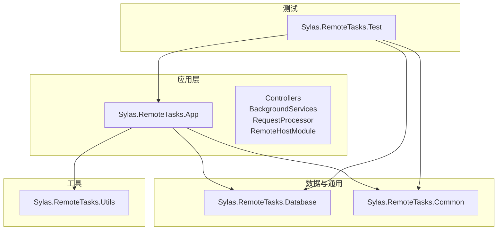
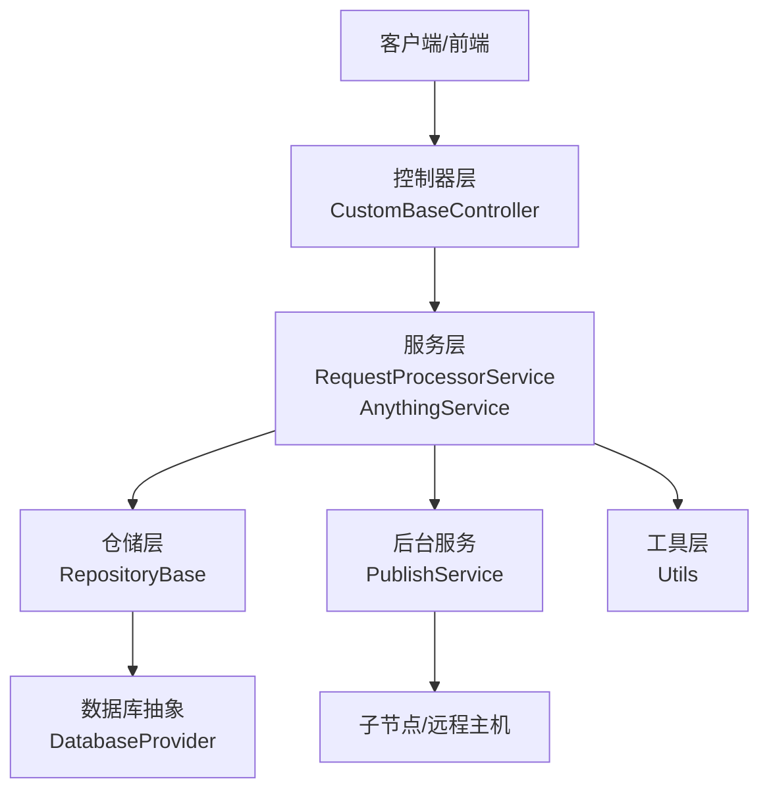
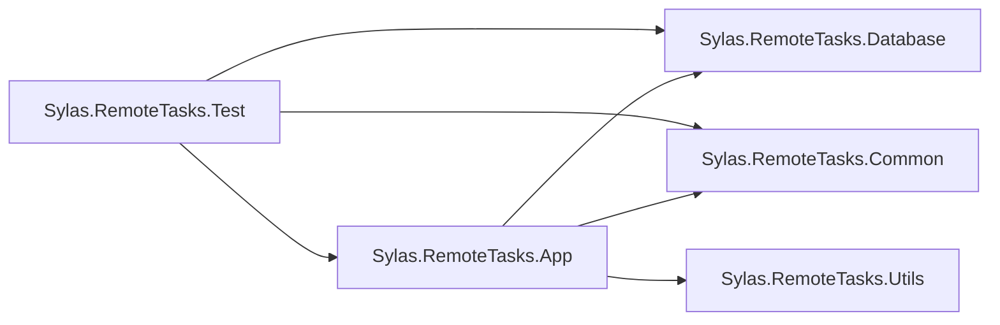

# 团队协作

<cite>
**本文引用的文件**
- [README.md](file://README.md)
- [Program.cs](file://Sylas.RemoteTasks.App/Program.cs)
- [appsettings.json](file://Sylas.RemoteTasks.App/appsettings.json)
- [Dockerfile](file://Sylas.RemoteTasks.App/Dockerfile)
- [.editorconfig](file://.editorconfig)
- [CustomBaseController.cs](file://Sylas.RemoteTasks.App/Controllers/CustomBaseController.cs)
- [RepositoryBase.cs](file://Sylas.RemoteTasks.App/Infrastructure/RepositoryBase.cs)
- [RequestProcessorService.cs](file://Sylas.RemoteTasks.App/RequestProcessor/RequestProcessorService.cs)
- [PublishService.cs](file://Sylas.RemoteTasks.App/BackgroundServices/PublishService.cs)
- [AnythingService.cs](file://Sylas.RemoteTasks.App/RemoteHostModule/Anything/AnythingService.cs)
- [README.md（数据库）](file://Sylas.RemoteTasks.Database/README.md)
- [README.md（工具）](file://Sylas.RemoteTasks.Utils/README.md)
- [TestBase.cs](file://Sylas.RemoteTasks.Test/TestBase.cs)
- [TestFixture.cs](file://Sylas.RemoteTasks.Test/TestFixture.cs)
- [IEnumerableExtensions.cs](file://Sylas.RemoteTasks.Common/Extensions/IEnumerableExtensions.cs)
</cite>

## 目录
1. [引言](#引言)
2. [项目结构](#项目结构)
3. [核心组件](#核心组件)
4. [架构总览](#架构总览)
5. [详细组件分析](#详细组件分析)
6. [依赖关系分析](#依赖关系分析)
7. [性能考量](#性能考量)
8. [故障排查指南](#故障排查指南)
9. [结论](#结论)
10. [附录](#附录)

## 引言
本文件面向 Sylas.RemoteTasks 项目团队，系统性梳理并制定团队协作最佳实践，覆盖代码审查流程、分支管理策略、冲突解决机制、知识分享制度、敏捷开发实践（含 Scrum 会议）、需求与任务管理、任务分配、文档编写标准、技术分享会组织、导师制度、跨部门协作、外部依赖管理与外包合作等。目标是统一协作口径、提升交付质量与效率，并确保项目长期可持续演进。

## 项目结构
Sylas.RemoteTasks 采用多项目解决方案（Solution）组织，核心模块包括：
- 应用层：Sylas.RemoteTasks.App（ASP.NET Core Web 应用，包含控制器、后台服务、请求处理器、远程主机模块等）
- 数据访问与通用能力：Sylas.RemoteTasks.Database（数据库抽象与同步基类）、Sylas.RemoteTasks.Common（通用 DTO、扩展与工具）
- 工具与命令执行：Sylas.RemoteTasks.Utils（命令执行器、模板解析、消息与常量等）
- 测试：Sylas.RemoteTasks.Test（基于 xUnit 的测试工程）

图表来源
- [Program.cs](file://Sylas.RemoteTasks.App/Program.cs#L1-L122)
- [Sylas.RemoteTasks.App.csproj](file://Sylas.RemoteTasks.App/Sylas.RemoteTasks.App.csproj#L1-L61)

章节来源
- [Program.cs](file://Sylas.RemoteTasks.App/Program.cs#L1-L122)
- [Sylas.RemoteTasks.App.csproj](file://Sylas.RemoteTasks.App/Sylas.RemoteTasks.App.csproj#L1-L61)
- [README.md](file://README.md#L1-L43)

## 核心组件
- 应用入口与配置：Program.cs 负责构建 WebApplicationBuilder、注册服务、中间件管线、认证与授权策略、SignalR、后台服务等。
- 配置中心：appsettings.json 提供日志、热键、连接串白名单、上传、AI、Kestrel、请求流水线、身份服务、进程监控、邮件等配置。
- 部署与运行：Dockerfile 定义容器镜像基础、时区、端口暴露与入口命令。
- 控制器基类：CustomBaseController 提供统一的文件上传、删除与路径管理能力，并集成授权策略与参数过滤。
- 仓储层：RepositoryBase 抽象通用增删改查、分页、局部更新、SQL 参数构建与数据库类型适配。
- 请求处理器：RequestProcessorService 负责按配置执行步骤与数据处理器。
- 远程发布与节点通信：PublishService 实现 TCP 服务、心跳、子节点连接、命令下发与结果回传。
- 远程主机模块：AnythingService 提供命令配置、模板解析、执行器映射、跨节点命令转发与结果聚合。
- 工具与数据库：Utils 与 Database 提供命令执行、模板解析、数据库迁移与查询等能力；Common 提供通用扩展与 DTO。

章节来源
- [Program.cs](file://Sylas.RemoteTasks.App/Program.cs#L1-L122)
- [appsettings.json](file://Sylas.RemoteTasks.App/appsettings.json#L1-L142)
- [Dockerfile](file://Sylas.RemoteTasks.App/Dockerfile#L1-L21)
- [CustomBaseController.cs](file://Sylas.RemoteTasks.App/Controllers/CustomBaseController.cs#L1-L145)
- [RepositoryBase.cs](file://Sylas.RemoteTasks.App/Infrastructure/RepositoryBase.cs#L1-L233)
- [RequestProcessorService.cs](file://Sylas.RemoteTasks.App/RequestProcessor/RequestProcessorService.cs#L1-L72)
- [PublishService.cs](file://Sylas.RemoteTasks.App/BackgroundServices/PublishService.cs#L1-L645)
- [AnythingService.cs](file://Sylas.RemoteTasks.App/RemoteHostModule/Anything/AnythingService.cs#L1-L680)
- [README.md（数据库）](file://Sylas.RemoteTasks.Database/README.md#L1-L24)
- [README.md（工具）](file://Sylas.RemoteTasks.Utils/README.md#L1-L3)

## 架构总览
整体采用“应用层 + 数据与通用 + 工具 + 测试”的分层结构，应用层通过依赖注入装配各模块，利用仓储与请求处理器实现数据与流程编排，后台服务负责远程节点通信与任务调度，远程主机模块支撑跨节点命令执行与模板解析。

图表来源
- [Program.cs](file://Sylas.RemoteTasks.App/Program.cs#L1-L122)
- [CustomBaseController.cs](file://Sylas.RemoteTasks.App/Controllers/CustomBaseController.cs#L1-L145)
- [RepositoryBase.cs](file://Sylas.RemoteTasks.App/Infrastructure/RepositoryBase.cs#L1-L233)
- [RequestProcessorService.cs](file://Sylas.RemoteTasks.App/RequestProcessor/RequestProcessorService.cs#L1-L72)
- [PublishService.cs](file://Sylas.RemoteTasks.App/BackgroundServices/PublishService.cs#L1-L645)
- [AnythingService.cs](file://Sylas.RemoteTasks.App/RemoteHostModule/Anything/AnythingService.cs#L1-L680)

## 详细组件分析

### 代码审查流程
- 触发条件：任何涉及核心模块（控制器、仓储、请求处理器、后台服务、远程主机模块、数据库/工具扩展）的变更均需走评审。
- 评审范围：功能正确性、安全性（鉴权/授权策略）、性能影响（批量/分页/并发）、可维护性（命名/复杂度/注释）、兼容性（配置/部署）。
- 评审工具：建议使用 Pull/Merge Request 并强制关联任务单；CI 通过后再合并。
- 评审要点清单：
  - 配置与安全：鉴权策略、连接串白名单、敏感信息处理。
  - 数据一致性：仓储更新/删除/分页逻辑、事务边界、异常处理。
  - 流程稳定性：后台服务的心跳/重连/日志、远程节点通信协议。
  - 可观测性：日志级别、关键路径埋点、错误返回结构。
  - 文档与注释：README 更新、接口注释、配置说明。

章节来源
- [Program.cs](file://Sylas.RemoteTasks.App/Program.cs#L74-L87)
- [appsettings.json](file://Sylas.RemoteTasks.App/appsettings.json#L1-L142)
- [CustomBaseController.cs](file://Sylas.RemoteTasks.App/Controllers/CustomBaseController.cs#L1-L145)
- [RepositoryBase.cs](file://Sylas.RemoteTasks.App/Infrastructure/RepositoryBase.cs#L1-L233)
- [RequestProcessorService.cs](file://Sylas.RemoteTasks.App/RequestProcessor/RequestProcessorService.cs#L1-L72)
- [PublishService.cs](file://Sylas.RemoteTasks.App/BackgroundServices/PublishService.cs#L1-L645)
- [AnythingService.cs](file://Sylas.RemoteTasks.App/RemoteHostModule/Anything/AnythingService.cs#L1-L680)

### 分支管理策略
- 主干分支：main（受保护），仅允许通过评审合并。
- 功能分支：feature/<issue-id>-短描述，限定命名与主题。
- 修复分支：fix/<issue-id>-简述，聚焦单一问题。
- 预发布分支：release/<版本号>，冻结变更，准备发布。
- 热修复分支：hotfix/<issue-id>-简述，快速修复生产问题。
- 合并要求：每次合并必须包含关联任务单、测试通过、文档更新。

章节来源
- [README.md](file://README.md#L1-L43)

### 冲突解决机制
- 冲突预防：小步提交、及时同步主干、避免大范围并行改动。
- 冲突识别：PR 合并前自动检查冲突；若出现冲突，要求作者在本地解决并重新推送。
- 冲突仲裁：若双方无法达成一致，由技术负责人组织讨论并形成决策记录。
- 回滚策略：严格遵循发布分支与标签管理，必要时回滚到上一个稳定版本。

章节来源
- [README.md](file://README.md#L1-L43)

### 知识分享制度
- 周例会：技术复盘、风险预警、任务进展同步。
- 技术分享：每月一次专题分享（架构演进、性能优化、安全加固、测试策略）。
- 文档沉淀：每个模块 README 与关键流程文档同步更新，纳入知识库。
- 导师制度：新成员配备导师，明确学习路径与阶段性目标。

章节来源
- [README.md（数据库）](file://Sylas.RemoteTasks.Database/README.md#L1-L24)
- [README.md（工具）](file://Sylas.RemoteTasks.Utils/README.md#L1-L3)

### 敏捷开发实践与 Scrum 会议
- 角色分工：产品负责人（PRD/需求优先级）、Scrum Master（过程协调）、开发团队（迭代交付）。
- 计划会：明确迭代目标、验收标准、风险识别。
- 每日站会：同步阻塞问题、当日计划、风险升级。
- 评审会：演示可工作的增量、收集反馈、调整计划。
- 回顾会：总结经验教训、改进流程。
- 任务管理：Jira/Trello 等工具跟踪任务状态（待办/进行/评审/完成），与代码分支关联。

章节来源
- [Program.cs](file://Sylas.RemoteTasks.App/Program.cs#L1-L122)
- [appsettings.json](file://Sylas.RemoteTasks.App/appsettings.json#L1-L142)

### 需求管理与任务分配
- 需求来源：用户反馈、业务方提出、技术债务、安全与合规。
- 需求评审：明确背景、范围、收益、风险与依赖。
- 任务拆解：将需求拆分为可验证的用户故事，定义验收标准。
- 任务分配：按能力与负载均衡分配，避免热点与瓶颈。
- 跟踪与可视化：看板实时更新，关键路径与阻塞问题公开透明。

章节来源
- [RequestProcessorService.cs](file://Sylas.RemoteTasks.App/RequestProcessor/RequestProcessorService.cs#L1-L72)
- [AnythingService.cs](file://Sylas.RemoteTasks.App/RemoteHostModule/Anything/AnythingService.cs#L1-L680)

### 文档编写标准
- 结构化：标题层级清晰、目录完整、章节内引用准确。
- 一致性：术语统一、风格一致、格式遵循 .editorconfig。
- 可追溯：所有代码变更均需更新相关文档，文档与代码版本保持一致。
- 可发现性：README 与模块文档同步更新，重要变更在变更日志中标注。

章节来源
- [.editorconfig](file://.editorconfig#L1-L285)
- [README.md](file://README.md#L1-L43)

### 技术分享会组织
- 主题规划：围绕核心模块（应用、数据库、工具、测试）与热点技术展开。
- 形式多样：内部分享、外部专家讲座、代码漫步（Code Walkthrough）。
- 成果沉淀：录制视频、整理讲义、形成最佳实践文档。

章节来源
- [README.md（数据库）](file://Sylas.RemoteTasks.Database/README.md#L1-L24)
- [README.md（工具）](file://Sylas.RemoteTasks.Utils/README.md#L1-L3)

### 导师制度建立
- 导师职责：技术指导、任务带教、职业发展建议、沟通与反馈。
- 新人培养：制定学习计划、阶段性目标、里程碑评估。
- 激励机制：导师评价与激励挂钩，营造互助氛围。

章节来源
- [Program.cs](file://Sylas.RemoteTasks.App/Program.cs#L1-L122)

### 跨部门协作
- 接口契约：明确 API/配置/协议，版本化管理，变更提前沟通。
- 联合评审：涉及多方的变更需组织联合评审，统一风险与责任。
- 问题升级：建立跨部门问题升级通道，明确时限与责任人。

章节来源
- [appsettings.json](file://Sylas.RemoteTasks.App/appsettings.json#L1-L142)
- [PublishService.cs](file://Sylas.RemoteTasks.App/BackgroundServices/PublishService.cs#L1-L645)

### 外部依赖管理与外包合作
- 依赖治理：定期审计第三方包，关注安全漏洞与许可证合规。
- 合同与保密：与外包方签署保密协议与知识产权条款。
- 质量门禁：对外包交付物设置质量门禁与验收标准。

章节来源
- [Sylas.RemoteTasks.App.csproj](file://Sylas.RemoteTasks.App/Sylas.RemoteTasks.App.csproj#L1-L61)

## 依赖关系分析
- 应用层依赖工具与数据库模块，通过项目引用与 NuGet 包管理。
- 测试工程依赖应用、数据库与通用模块，使用 DI 容器与配置模拟真实环境。
- 配置贯穿各层，集中管理日志、身份、连接串、请求流水线等。

图表来源
- [Sylas.RemoteTasks.Test/TestFixture.cs](file://Sylas.RemoteTasks.Test/TestFixture.cs#L1-L53)
- [Sylas.RemoteTasks.App.csproj](file://Sylas.RemoteTasks.App/Sylas.RemoteTasks.App.csproj#L1-L61)

章节来源
- [Sylas.RemoteTasks.Test/TestFixture.cs](file://Sylas.RemoteTasks.Test/TestFixture.cs#L1-L53)
- [Sylas.RemoteTasks.App.csproj](file://Sylas.RemoteTasks.App/Sylas.RemoteTasks.App.csproj#L1-L61)

## 性能考量
- 仓储与分页：RepositoryBase 使用分页查询与参数化 SQL，避免全表扫描；对大数据量场景建议结合索引与分区。
- 请求处理器：RequestProcessorService 按步骤执行并持久化上下文，减少重复计算；建议对长链路增加超时与重试策略。
- 后台服务：PublishService 的心跳与重连机制保障节点通信稳定；注意缓冲区大小与日志落盘对 IO 的影响。
- 模板与命令：AnythingService 的模板解析与执行器映射需避免重复解析，合理使用缓存。
- 部署与伸缩：Dockerfile 指定端口与时区，结合容器编排实现弹性伸缩与健康检查。

章节来源
- [RepositoryBase.cs](file://Sylas.RemoteTasks.App/Infrastructure/RepositoryBase.cs#L1-L233)
- [RequestProcessorService.cs](file://Sylas.RemoteTasks.App/RequestProcessor/RequestProcessorService.cs#L1-L72)
- [PublishService.cs](file://Sylas.RemoteTasks.App/BackgroundServices/PublishService.cs#L1-L645)
- [AnythingService.cs](file://Sylas.RemoteTasks.App/RemoteHostModule/Anything/AnythingService.cs#L1-L680)
- [Dockerfile](file://Sylas.RemoteTasks.App/Dockerfile#L1-L21)

## 故障排查指南
- 配置问题：核对 appsettings.json 中的身份、连接串、端口、请求流水线与日志级别；敏感信息通过密钥管理工具注入。
- 鉴权与授权：确认授权策略与角色声明、作用域匹配；检查控制器上的授权特性与过滤器。
- 文件上传：检查 CustomBaseController 的文件路径与权限、上传目录配置与磁盘空间。
- 数据库访问：核对仓储层 SQL 构建与数据库类型适配，关注分页与参数化。
- 请求处理：校验 RequestProcessorService 的步骤与数据处理器配置，确认上下文传递。
- 节点通信：检查 PublishService 的心跳、重连与日志目录，定位网络与协议问题。
- 命令执行：核对 AnythingService 的命令解析、执行器映射与跨节点转发逻辑。

章节来源
- [appsettings.json](file://Sylas.RemoteTasks.App/appsettings.json#L1-L142)
- [Program.cs](file://Sylas.RemoteTasks.App/Program.cs#L74-L87)
- [CustomBaseController.cs](file://Sylas.RemoteTasks.App/Controllers/CustomBaseController.cs#L1-L145)
- [RepositoryBase.cs](file://Sylas.RemoteTasks.App/Infrastructure/RepositoryBase.cs#L1-L233)
- [RequestProcessorService.cs](file://Sylas.RemoteTasks.App/RequestProcessor/RequestProcessorService.cs#L1-L72)
- [PublishService.cs](file://Sylas.RemoteTasks.App/BackgroundServices/PublishService.cs#L1-L645)
- [AnythingService.cs](file://Sylas.RemoteTasks.App/RemoteHostModule/Anything/AnythingService.cs#L1-L680)

## 结论
通过统一的协作规范与流程设计，Sylas.RemoteTasks 项目可在保证质量与安全的前提下高效交付。建议持续完善评审与文档体系，强化测试与可观测性，推进知识共享与导师制度，以实现团队能力与项目价值的双提升。

## 附录
- 代码风格与命名：遵循 .editorconfig 的缩进、空格、命名与表达式偏好。
- 测试策略：基于 TestFixture 与 TestBase 的 DI 注入与配置加载，覆盖核心流程与边界条件。
- 数据分块：IEnumerableExtensions 提供数据分块能力，便于批处理与内存控制。

章节来源
- [.editorconfig](file://.editorconfig#L1-L285)
- [TestBase.cs](file://Sylas.RemoteTasks.Test/TestBase.cs#L1-L15)
- [TestFixture.cs](file://Sylas.RemoteTasks.Test/TestFixture.cs#L1-L53)
- [IEnumerableExtensions.cs](file://Sylas.RemoteTasks.Common/Extensions/IEnumerableExtensions.cs#L1-L69)