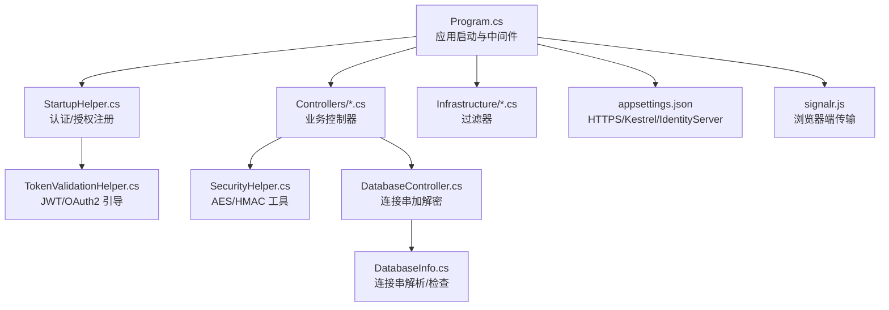
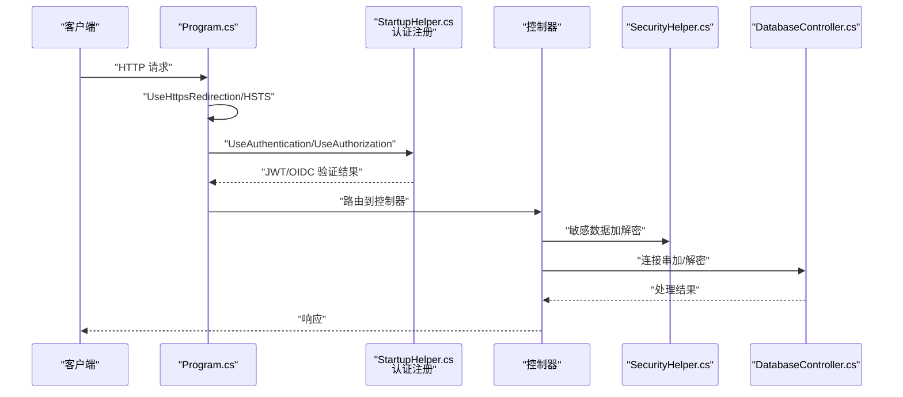
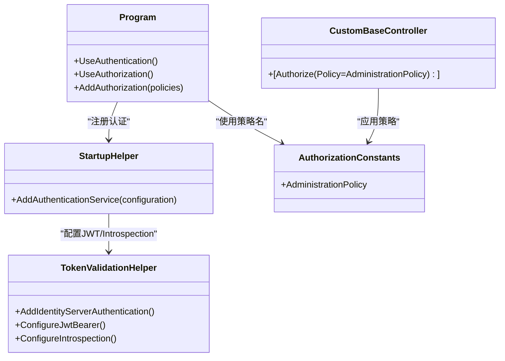
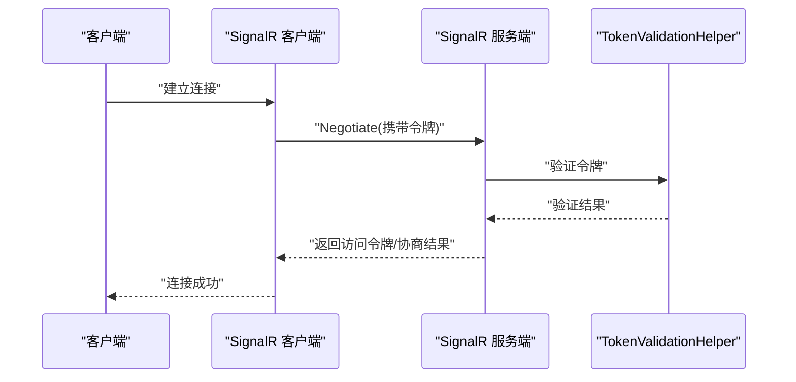
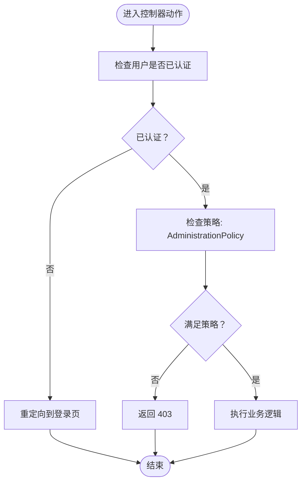
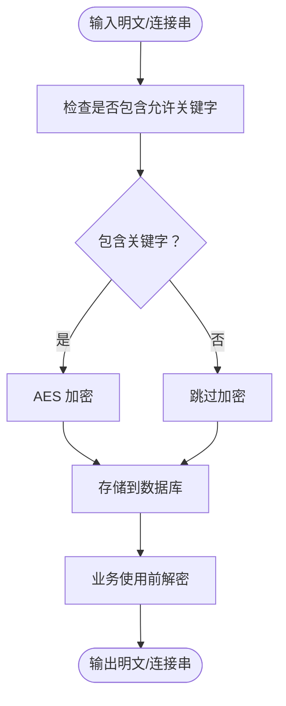
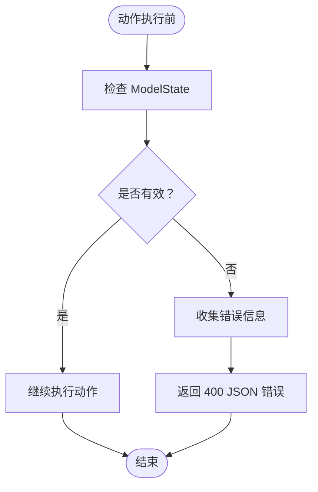
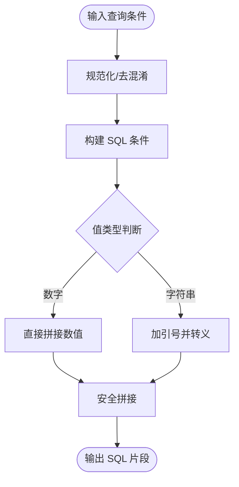
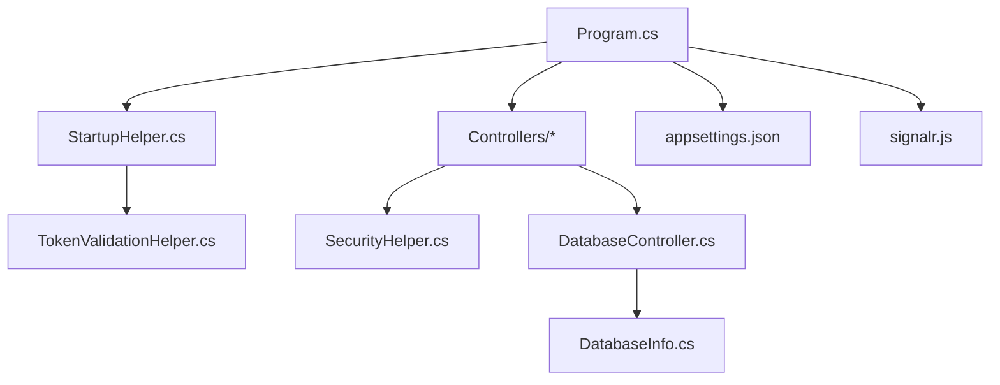

# 安全实践

<cite>
**本文引用的文件**
- [Program.cs](file://Sylas.RemoteTasks.App/Program.cs)
- [appsettings.json](file://Sylas.RemoteTasks.App/appsettings.json)
- [StartupHelper.cs](file://Sylas.RemoteTasks.App/Helpers/StartupHelper.cs)
- [TokenValidationHelper.cs](file://Sylas.RemoteTasks.App/Helpers/TokenValidationHelper.cs)
- [AuthorizationConstants.cs](file://Sylas.RemoteTasks.Utils/Constants/AuthorizationConstants.cs)
- [CustomBaseController.cs](file://Sylas.RemoteTasks.App/Controllers/CustomBaseController.cs)
- [OAuthController.cs](file://Sylas.RemoteTasks.App/Controllers/OAuthController.cs)
- [CustomActionFilter.cs](file://Sylas.RemoteTasks.App/Infrastructure/CustomActionFilter.cs)
- [MvcParameterFilter.cs](file://Sylas.RemoteTasks.App/Infrastructure/MvcParameterFilter.cs)
- [SecurityHelper.cs](file://Sylas.RemoteTasks.Common/SecurityHelper.cs)
- [DatabaseController.cs](file://Sylas.RemoteTasks.App/Controllers/DatabaseController.cs)
- [DatabaseInfo.cs](file://Sylas.RemoteTasks.Database/SyncBase/DatabaseInfo.cs)
- [RegexConst.cs](file://Sylas.RemoteTasks.Common/RegexConst.cs)
- [HeaderConstants.cs](file://Sylas.RemoteTasks.Utils/Constants/HeaderConstants.cs)
- [signalr.js](file://Sylas.RemoteTasks.App/wwwroot/lib/signalr/dist/browser/signalr.js)
</cite>

## 目录
1. [简介](#简介)
2. [项目结构](#项目结构)
3. [核心组件](#核心组件)
4. [架构总览](#架构总览)
5. [详细组件分析](#详细组件分析)
6. [依赖关系分析](#依赖关系分析)
7. [性能考量](#性能考量)
8. [故障排查指南](#故障排查指南)
9. [结论](#结论)
10. [附录](#附录)

## 简介
本指南面向 Sylas.RemoteTasks 项目的安全实践，围绕身份认证、授权机制、数据加密、输入验证、SQL 注入防护、HTTPS/CORS/CSRF 等网络安全实践，以及安全审计与漏洞扫描最佳实践展开。文档结合代码实现，提供可操作的安全配置示例与常见漏洞的防范建议，帮助开发者在不牺牲功能的前提下提升系统整体安全性。

## 项目结构
Sylas.RemoteTasks 采用典型的分层架构：应用层（Controllers、Infrastructure、Helpers）、通用工具层（Common、Utils）、数据库访问层（Database）。与安全相关的关键位置包括：
- 应用启动与中间件管线（Program.cs）
- 身份认证与授权配置（StartupHelper.cs、TokenValidationHelper.cs、appsettings.json）
- 控制器与动作过滤器（CustomBaseController.cs、OAuthController.cs、CustomActionFilter.cs、MvcParameterFilter.cs）
- 数据安全与加密（SecurityHelper.cs、DatabaseController.cs、DatabaseInfo.cs、RegexConst.cs）
- 网络与传输安全（appsettings.json、signalr.js）

图表来源
- [Program.cs](file://Sylas.RemoteTasks.App/Program.cs#L1-L122)
- [StartupHelper.cs](file://Sylas.RemoteTasks.App/Helpers/StartupHelper.cs#L123-L275)
- [TokenValidationHelper.cs](file://Sylas.RemoteTasks.App/Helpers/TokenValidationHelper.cs#L1-L575)
- [CustomBaseController.cs](file://Sylas.RemoteTasks.App/Controllers/CustomBaseController.cs#L1-L145)
- [OAuthController.cs](file://Sylas.RemoteTasks.App/Controllers/OAuthController.cs#L1-L49)
- [SecurityHelper.cs](file://Sylas.RemoteTasks.Common/SecurityHelper.cs#L1-L228)
- [DatabaseController.cs](file://Sylas.RemoteTasks.App/Controllers/DatabaseController.cs#L46-L75)
- [DatabaseInfo.cs](file://Sylas.RemoteTasks.Database/SyncBase/DatabaseInfo.cs#L89-L296)
- [appsettings.json](file://Sylas.RemoteTasks.App/appsettings.json#L1-L142)
- [signalr.js](file://Sylas.RemoteTasks.App/wwwroot/lib/signalr/dist/browser/signalr.js#L641-L2910)

章节来源
- [Program.cs](file://Sylas.RemoteTasks.App/Program.cs#L1-L122)
- [appsettings.json](file://Sylas.RemoteTasks.App/appsettings.json#L1-L142)

## 核心组件
- 身份认证与授权
  - 通过 IdentityServer 集成 OIDC/JWT，支持 Bearer Token 与可选的 Cookie 方案。
  - 在 Program.cs 中注册认证与授权策略，并在控制器上应用策略。
- 数据加密与敏感信息保护
  - 使用 AES 对数据库连接串进行加解密；提供 HMAC-SHA256 签名能力。
- 输入验证与模型绑定
  - 使用 MVC 参数过滤器统一返回模型验证错误，避免泄露内部细节。
- SQL 注入防护
  - 通过规范化的查询构建与参数化处理，避免直接拼接 SQL。
- 网络安全
  - Kestrel HTTPS 配置、HSTS、CORS、CSRF 防护与 SignalR 传输安全。

章节来源
- [StartupHelper.cs](file://Sylas.RemoteTasks.App/Helpers/StartupHelper.cs#L123-L275)
- [Program.cs](file://Sylas.RemoteTasks.App/Program.cs#L74-L116)
- [SecurityHelper.cs](file://Sylas.RemoteTasks.Common/SecurityHelper.cs#L1-L228)
- [MvcParameterFilter.cs](file://Sylas.RemoteTasks.App/Infrastructure/MvcParameterFilter.cs#L1-L37)
- [DatabaseInfo.cs](file://Sylas.RemoteTasks.Database/SyncBase/DatabaseInfo.cs#L89-L296)
- [appsettings.json](file://Sylas.RemoteTasks.App/appsettings.json#L51-L64)

## 架构总览
下图展示从请求进入应用到完成授权与数据处理的整体流程，重点标注安全相关环节。

图表来源
- [Program.cs](file://Sylas.RemoteTasks.App/Program.cs#L99-L121)
- [StartupHelper.cs](file://Sylas.RemoteTasks.App/Helpers/StartupHelper.cs#L123-L275)
- [SecurityHelper.cs](file://Sylas.RemoteTasks.Common/SecurityHelper.cs#L1-L228)
- [DatabaseController.cs](file://Sylas.RemoteTasks.App/Controllers/DatabaseController.cs#L46-L75)

## 详细组件分析

### 身份认证与授权策略
- OIDC 与 JWT 集成
  - 在 StartupHelper 中注册 IdentityServer 认证，配置 Authority、ClientId、ClientSecret、ApiName、ApiSecret、Scopes、RequireHttpsMetadata 等。
  - 在 Program.cs 中启用认证与授权中间件，并定义基于角色与作用域的授权策略。
- 策略与控制器应用
  - 自定义授权策略“RequireAdministratorRole”在 AuthorizationConstants 中定义，控制器通过特性应用该策略。
- Token 处理
  - TokenValidationHelper 提供 JWT 与 OAuth2 引导的配置与事件钩子，支持缓存、时钟偏移、声明映射等。

图表来源
- [StartupHelper.cs](file://Sylas.RemoteTasks.App/Helpers/StartupHelper.cs#L123-L275)
- [Program.cs](file://Sylas.RemoteTasks.App/Program.cs#L74-L87)
- [TokenValidationHelper.cs](file://Sylas.RemoteTasks.App/Helpers/TokenValidationHelper.cs#L121-L200)
- [AuthorizationConstants.cs](file://Sylas.RemoteTasks.Utils/Constants/AuthorizationConstants.cs#L1-L14)
- [CustomBaseController.cs](file://Sylas.RemoteTasks.App/Controllers/CustomBaseController.cs#L10-L14)

章节来源
- [StartupHelper.cs](file://Sylas.RemoteTasks.App/Helpers/StartupHelper.cs#L123-L275)
- [Program.cs](file://Sylas.RemoteTasks.App/Program.cs#L74-L116)
- [AuthorizationConstants.cs](file://Sylas.RemoteTasks.Utils/Constants/AuthorizationConstants.cs#L1-L14)
- [CustomBaseController.cs](file://Sylas.RemoteTasks.App/Controllers/CustomBaseController.cs#L10-L14)
- [TokenValidationHelper.cs](file://Sylas.RemoteTasks.App/Helpers/TokenValidationHelper.cs#L121-L200)

### JWT 令牌处理与 OIDC 集成
- 令牌检索与验证
  - TokenRetriever 从 Authorization 头部提取 Bearer 令牌；支持 JWT 与引用令牌两种类型。
  - 配置 Authority、RequireHttpsMetadata、ApiName、ApiSecret 等参数，确保与 IdentityServer 一致。
- 事件与缓存
  - 通过 JwtBearerEvents 和 OAuth2IntrospectionEvents 捕获消息接收、令牌验证、认证失败等事件。
  - 支持发现文档缓存与缓存时长配置，降低外部依赖抖动影响。

图表来源
- [TokenValidationHelper.cs](file://Sylas.RemoteTasks.App/Helpers/TokenValidationHelper.cs#L225-L315)
- [signalr.js](file://Sylas.RemoteTasks.App/wwwroot/lib/signalr/dist/browser/signalr.js#L2893-L2910)

章节来源
- [TokenValidationHelper.cs](file://Sylas.RemoteTasks.App/Helpers/TokenValidationHelper.cs#L318-L575)
- [signalr.js](file://Sylas.RemoteTasks.App/wwwroot/lib/signalr/dist/browser/signalr.js#L641-L2910)

### 权限控制策略
- 策略定义
  - 在 Program.cs 中定义 AdministrationPolicy，要求用户具备特定角色与作用域声明。
- 控制器应用
  - CustomBaseController 通过特性应用 AdministrationPolicy，确保关键操作仅限管理员访问。
- 过滤器辅助
  - CustomActionFilter 在动作执行后检查用户是否已认证，未认证则重定向登录页。

图表来源
- [CustomActionFilter.cs](file://Sylas.RemoteTasks.App/Infrastructure/CustomActionFilter.cs#L1-L23)
- [Program.cs](file://Sylas.RemoteTasks.App/Program.cs#L77-L87)
- [CustomBaseController.cs](file://Sylas.RemoteTasks.App/Controllers/CustomBaseController.cs#L10-L14)

章节来源
- [Program.cs](file://Sylas.RemoteTasks.App/Program.cs#L77-L87)
- [CustomActionFilter.cs](file://Sylas.RemoteTasks.App/Infrastructure/CustomActionFilter.cs#L1-L23)
- [CustomBaseController.cs](file://Sylas.RemoteTasks.App/Controllers/CustomBaseController.cs#L10-L14)

### 数据加密与敏感信息保护
- AES 加密/解密
  - SecurityHelper 提供 AES 字符串与字节数组的加解密方法，默认密钥与固定 IV，适用于非高安全场景或内部数据保护。
- 数据库连接串加解密
  - DatabaseController 在新增/更新连接串时，若包含允许关键字，则进行 AES 加密后再入库。
  - DatabaseInfo 在使用前对连接串进行规范化与关键字检查，避免混淆字符与非法内容。
- HMAC-SHA256 签名
  - 提供 HmacSha256Signature 方法，可用于接口签名与防篡改。

图表来源
- [SecurityHelper.cs](file://Sylas.RemoteTasks.Common/SecurityHelper.cs#L36-L88)
- [DatabaseController.cs](file://Sylas.RemoteTasks.App/Controllers/DatabaseController.cs#L49-L75)
- [DatabaseInfo.cs](file://Sylas.RemoteTasks.Database/SyncBase/DatabaseInfo.cs#L101-L108)

章节来源
- [SecurityHelper.cs](file://Sylas.RemoteTasks.Common/SecurityHelper.cs#L1-L228)
- [DatabaseController.cs](file://Sylas.RemoteTasks.App/Controllers/DatabaseController.cs#L46-L75)
- [DatabaseInfo.cs](file://Sylas.RemoteTasks.Database/SyncBase/DatabaseInfo.cs#L89-L108)
- [RegexConst.cs](file://Sylas.RemoteTasks.Common/RegexConst.cs#L70-L95)

### 输入验证与模型绑定
- 统一验证错误处理
  - MvcParameterFilter 在动作执行前检查 ModelState，若存在验证错误，统一返回包含错误详情的 JSON 结果与 400 状态码。
- 控制器层约束
  - CustomBaseController 作为基类，集中处理文件上传、删除与路径生成，减少重复逻辑与潜在风险。

图表来源
- [MvcParameterFilter.cs](file://Sylas.RemoteTasks.App/Infrastructure/MvcParameterFilter.cs#L14-L35)
- [CustomBaseController.cs](file://Sylas.RemoteTasks.App/Controllers/CustomBaseController.cs#L16-L46)

章节来源
- [MvcParameterFilter.cs](file://Sylas.RemoteTasks.App/Infrastructure/MvcParameterFilter.cs#L1-L37)
- [CustomBaseController.cs](file://Sylas.RemoteTasks.App/Controllers/CustomBaseController.cs#L1-L145)

### SQL 注入防护
- 规范化查询构建
  - DatabaseInfo 对连接串进行解析与规范化，避免注入风险。
  - DataFilter 在生成 IN/LIKE 等条件时，对数值与字符串进行区分处理，防止 SQL 注入。
- 正则表达式与关键字检查
  - RegexConst 提供多种数据库连接串的正则匹配，配合 AllowList 关键词白名单，降低危险连接串进入系统。

图表来源
- [DatabaseInfo.cs](file://Sylas.RemoteTasks.Database/SyncBase/DatabaseInfo.cs#L210-L296)
- [RegexConst.cs](file://Sylas.RemoteTasks.Common/RegexConst.cs#L70-L95)
- [DataFilter.cs](file://Sylas.RemoteTasks.Database/SyncBase/DataFilter.cs#L263-L290)

章节来源
- [DatabaseInfo.cs](file://Sylas.RemoteTasks.Database/SyncBase/DatabaseInfo.cs#L89-L296)
- [RegexConst.cs](file://Sylas.RemoteTasks.Common/RegexConst.cs#L70-L95)
- [DataFilter.cs](file://Sylas.RemoteTasks.Database/SyncBase/DataFilter.cs#L263-L290)

### HTTPS、CORS 与 CSRF 防护
- HTTPS 配置
  - appsettings.json 中提供 Kestrel HTTPS 端点示例（注释），建议生产环境启用 HTTPS 并配置 TLS1.2/1.3 与证书。
  - Program.cs 启用 UseHttpsRedirection 与 HSTS（非开发环境）。
- CORS 设置
  - 当前仓库未见显式 CORS 配置注册，建议在 StartupHelper 或 Program 中按需添加并限定来源。
- CSRF 防护
  - MVC 默认启用 Antiforgery，建议在前端表单提交时使用 @Html.AntiForgeryToken 并确保 SameSite Cookie 策略合理。

章节来源
- [appsettings.json](file://Sylas.RemoteTasks.App/appsettings.json#L51-L64)
- [Program.cs](file://Sylas.RemoteTasks.App/Program.cs#L102-L107)

### OAuth 与用户信息获取
- OAuthController 提供密码模式视图与受保护的用户信息接口，通过 IHttpClientFactory 与 Bearer Token 调用身份提供商的用户信息端点。
- 注意：在生产环境中，应避免在前端直接暴露或持久化 access_token，建议使用短期令牌与刷新令牌策略。

章节来源
- [OAuthController.cs](file://Sylas.RemoteTasks.App/Controllers/OAuthController.cs#L1-L49)

## 依赖关系分析
- 组件耦合
  - Program.cs 作为入口，集中注册认证、授权与异常处理；StartupHelper 抽象出认证配置，降低 Program 的复杂度。
  - 控制器通过策略特性与过滤器实现横切关注点，保持控制器职责单一。
- 外部依赖
  - IdentityServer 作为认证中心，要求 HTTPS 与正确的 Issuer/Scope/Client 配置。
  - SignalR 传输层依赖浏览器端与服务端的协商与令牌传递。

图表来源
- [Program.cs](file://Sylas.RemoteTasks.App/Program.cs#L1-L122)
- [StartupHelper.cs](file://Sylas.RemoteTasks.App/Helpers/StartupHelper.cs#L123-L275)
- [TokenValidationHelper.cs](file://Sylas.RemoteTasks.App/Helpers/TokenValidationHelper.cs#L1-L575)
- [SecurityHelper.cs](file://Sylas.RemoteTasks.Common/SecurityHelper.cs#L1-L228)
- [DatabaseController.cs](file://Sylas.RemoteTasks.App/Controllers/DatabaseController.cs#L46-L75)
- [DatabaseInfo.cs](file://Sylas.RemoteTasks.Database/SyncBase/DatabaseInfo.cs#L89-L296)
- [appsettings.json](file://Sylas.RemoteTasks.App/appsettings.json#L1-L142)
- [signalr.js](file://Sylas.RemoteTasks.App/wwwroot/lib/signalr/dist/browser/signalr.js#L641-L2910)

章节来源
- [Program.cs](file://Sylas.RemoteTasks.App/Program.cs#L1-L122)
- [StartupHelper.cs](file://Sylas.RemoteTasks.App/Helpers/StartupHelper.cs#L123-L275)

## 性能考量
- 令牌验证性能
  - 启用发现文档缓存与合理的缓存时长，减少对外部 IdentityServer 的频繁请求。
- 数据库连接串处理
  - 加解密操作应避免在高频路径重复执行；可考虑缓存解密后的连接串或在进程内复用。
- SignalR 连接
  - 合理设置协商超时与重连策略，避免过多并发连接导致资源耗尽。

## 故障排查指南
- 认证失败
  - 检查 IdentityServer 配置（Authority、RequireHttpsMetadata、ApiName、ApiSecret）是否正确。
  - 查看 JwtBearerEvents 与 OAuth2IntrospectionEvents 的认证失败事件日志。
- 授权拒绝
  - 确认用户声明中包含所需角色与作用域；检查 AdministrationPolicy 的策略定义。
- 数据解密异常
  - 确认连接串确实经过 AES 加密；核对密钥与 IV 是否一致；检查关键字白名单是否匹配。
- 模型验证错误
  - 使用 MvcParameterFilter 的统一错误响应定位具体字段与错误信息。

章节来源
- [TokenValidationHelper.cs](file://Sylas.RemoteTasks.App/Helpers/TokenValidationHelper.cs#L445-L522)
- [Program.cs](file://Sylas.RemoteTasks.App/Program.cs#L77-L87)
- [SecurityHelper.cs](file://Sylas.RemoteTasks.Common/SecurityHelper.cs#L36-L88)
- [MvcParameterFilter.cs](file://Sylas.RemoteTasks.App/Infrastructure/MvcParameterFilter.cs#L14-L35)

## 结论
Sylas.RemoteTasks 在身份认证与授权方面已具备较为完善的 OIDC/JWT 基础设施；在数据保护方面提供了 AES 与 HMAC 能力；在输入验证与 SQL 注入防护方面也采取了必要的工程化手段。建议在生产环境中进一步完善 HTTPS、CORS、CSRF 防护与安全审计流程，持续进行漏洞扫描与渗透测试，确保系统在运行期的安全性与稳定性。

## 附录
- 安全配置清单（摘自现有配置）
  - IdentityServer 配置项：Authority、RequireHttpsMetadata、EnableCaching、CacheDuration、AdministrationRole、ApiName、ApiSecret、ClientId、ClientSecret、OidcResponseType、Scopes。
  - Kestrel HTTPS 端点：示例位于 appsettings.json 的 Kestrel 节点，建议启用并配置证书与 TLS 版本。
  - 请求管道与数据处理器：RequestPipeline 节点包含示例配置，注意敏感数据处理与权限控制。
- 建议的安全实践
  - 强制 HTTPS：启用 UseHttpsRedirection 与 HSTS（非开发环境）。
  - 最小权限原则：为不同角色分配最小必要作用域与资源访问权限。
  - 令牌生命周期：使用短期访问令牌与刷新令牌，避免长期持有敏感令牌。
  - 日志与监控：记录认证/授权事件与异常，结合外部 SIEM 进行告警。
  - 定期扫描：集成自动化漏洞扫描与依赖项安全检查。

章节来源
- [appsettings.json](file://Sylas.RemoteTasks.App/appsettings.json#L109-L121)
- [appsettings.json](file://Sylas.RemoteTasks.App/appsettings.json#L51-L64)
- [Program.cs](file://Sylas.RemoteTasks.App/Program.cs#L102-L107)