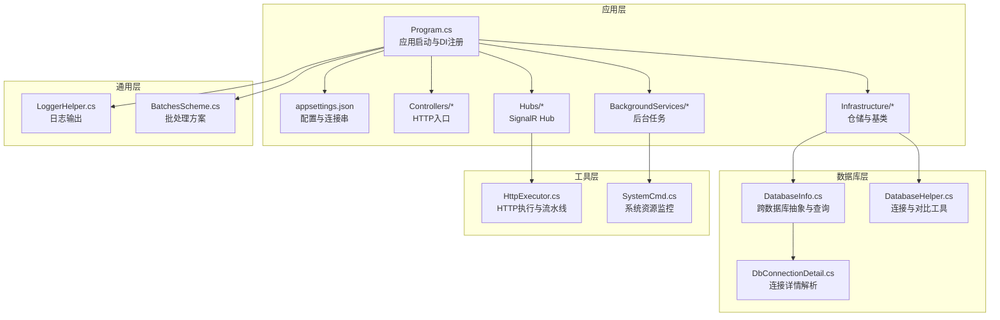
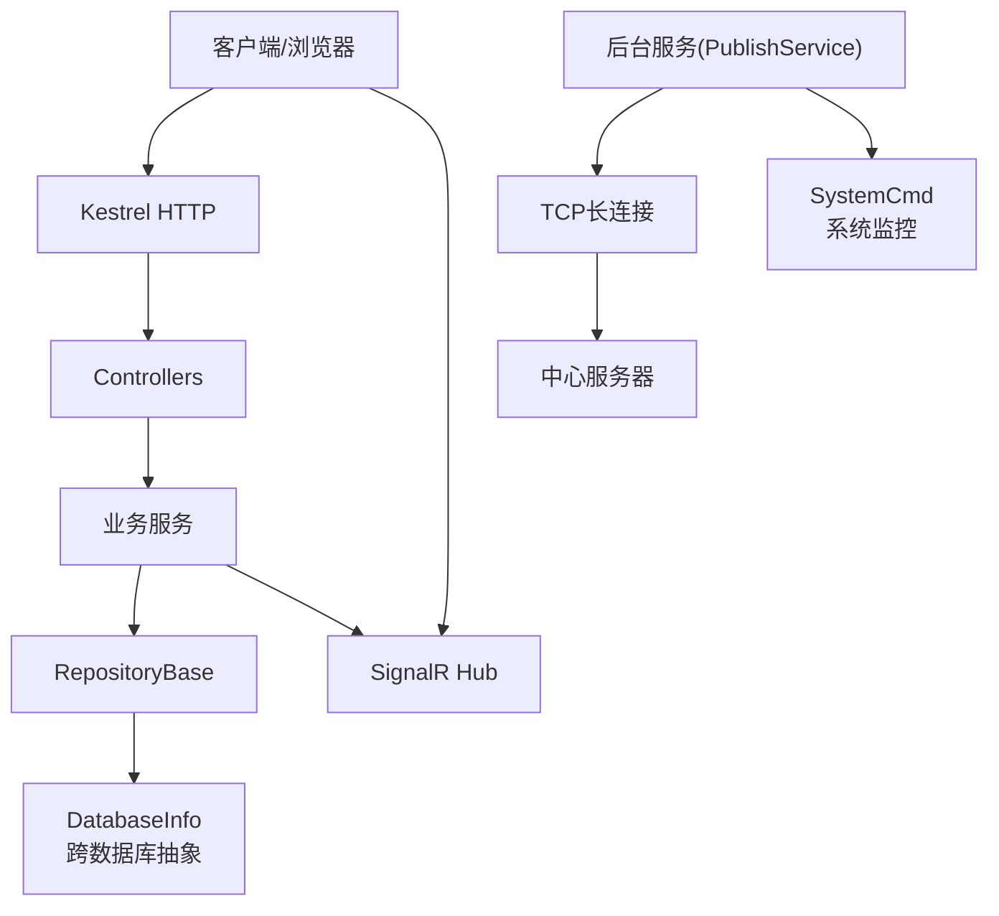
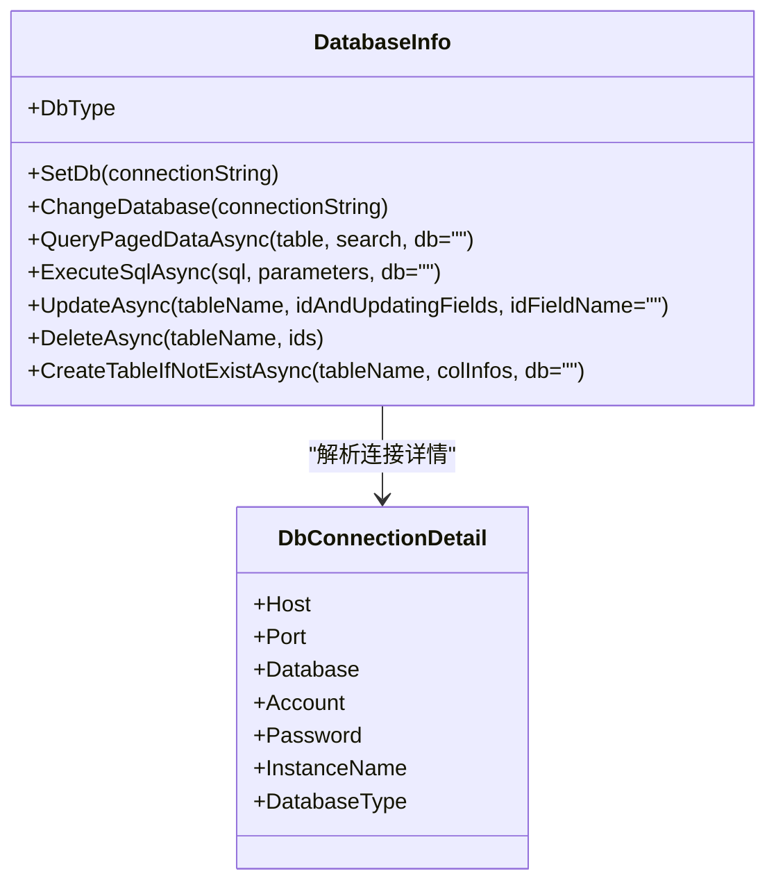
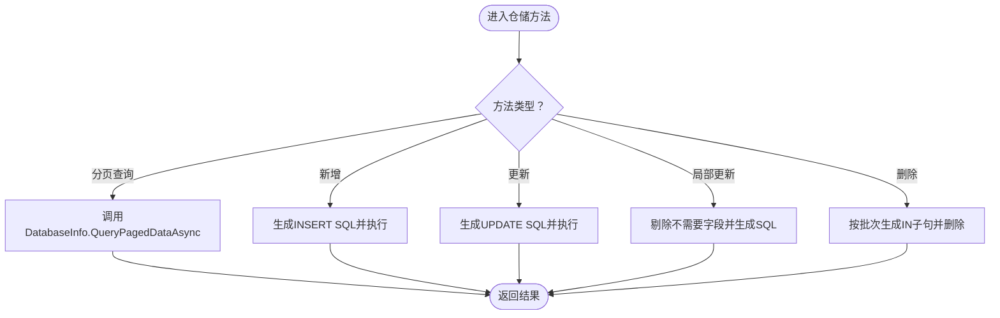
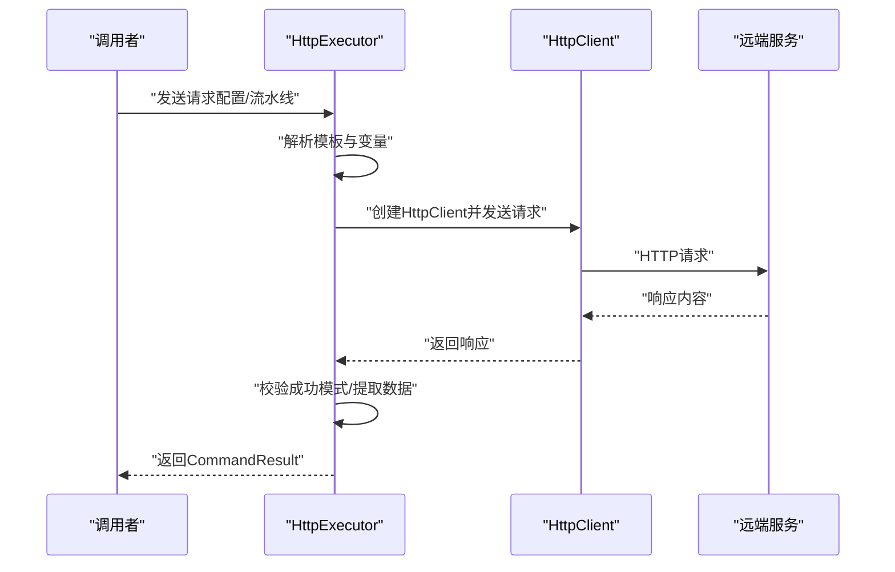
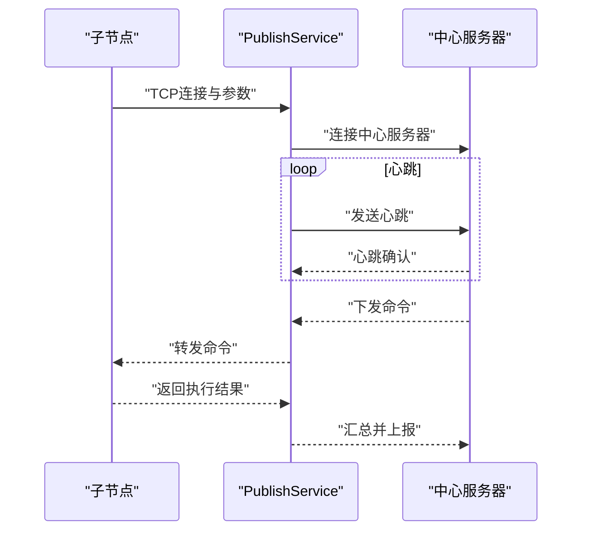
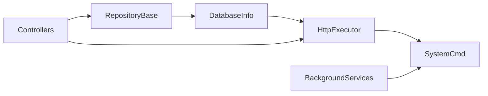

# 性能最佳实践

<cite>
**本文引用的文件**   
- [Program.cs](file://Sylas.RemoteTasks.App/Program.cs)
- [appsettings.json](file://Sylas.RemoteTasks.App/appsettings.json)
- [StartupHelper.cs](file://Sylas.RemoteTasks.App/Helpers/StartupHelper.cs)
- [DatabaseInfo.cs](file://Sylas.RemoteTasks.Database/SyncBase/DatabaseInfo.cs)
- [DatabaseHelper.cs](file://Sylas.RemoteTasks.Database/DatabaseHelper.cs)
- [RepositoryBase.cs](file://Sylas.RemoteTasks.App/Infrastructure/RepositoryBase.cs)
- [LoggerHelper.cs](file://Sylas.RemoteTasks.Common/LoggerHelper.cs)
- [HttpExecutor.cs](file://Sylas.RemoteTasks.Utils/CommandExecutor/HttpExecutor.cs)
- [SystemCmd.cs](file://Sylas.RemoteTasks.Utils/SystemHelper.cs)
- [PublishService.cs](file://Sylas.RemoteTasks.App/BackgroundServices/PublishService.cs)
- [ServerRegistrationService.cs](file://Sylas.RemoteTasks.App/BackgroundServices/ServerRegistrationService.cs)
- [HostsController.cs](file://Sylas.RemoteTasks.App/Controllers/HostsController.cs)
- [DatabaseConstants.cs](file://Sylas.RemoteTasks.Utils/Constants/DatabaseConstants.cs)
- [DbConnectionDetail.cs](file://Sylas.RemoteTasks.Database/SyncBase/DbConnectionDetail.cs)
- [BatchesScheme.cs](file://Sylas.RemoteTasks.Common/BatchesScheme.cs)
</cite>

## 目录
1. [简介](#简介)
2. [项目结构](#项目结构)
3. [核心组件](#核心组件)
4. [架构总览](#架构总览)
5. [详细组件分析](#详细组件分析)
6. [依赖关系分析](#依赖关系分析)
7. [性能考量](#性能考量)
8. [故障排查指南](#故障排查指南)
9. [结论](#结论)
10. [附录](#附录)

## 简介
本文件面向 Sylas.RemoteTasks 项目的性能优化，覆盖数据库查询优化、缓存策略、并发处理、内存管理、日志与异常处理、网络请求优化以及性能监控与测试方法。文档基于仓库现有实现进行提炼，并给出可落地的最佳实践与改进方向。

## 项目结构
项目采用多项目分层组织：应用层负责控制器、后台服务、SignalR、缓存与认证；数据库层提供跨数据库抽象与同步能力；通用层提供日志、批处理与辅助工具；工具层提供HTTP执行、模板解析与系统命令封装。

**图表来源**
- [Program.cs](file://Sylas.RemoteTasks.App/Program.cs#L1-L122)
- [appsettings.json](file://Sylas.RemoteTasks.App/appsettings.json#L1-L142)
- [DatabaseInfo.cs](file://Sylas.RemoteTasks.Database/SyncBase/DatabaseInfo.cs#L1-L800)
- [DatabaseHelper.cs](file://Sylas.RemoteTasks.Database/DatabaseHelper.cs#L1-L245)
- [RepositoryBase.cs](file://Sylas.RemoteTasks.App/Infrastructure/RepositoryBase.cs#L1-L233)
- [LoggerHelper.cs](file://Sylas.RemoteTasks.Common/LoggerHelper.cs#L1-L115)
- [HttpExecutor.cs](file://Sylas.RemoteTasks.Utils/CommandExecutor/HttpExecutor.cs#L1-L258)
- [SystemCmd.cs](file://Sylas.RemoteTasks.Utils/SystemHelper.cs#L381-L639)

**章节来源**
- [Program.cs](file://Sylas.RemoteTasks.App/Program.cs#L1-L122)
- [appsettings.json](file://Sylas.RemoteTasks.App/appsettings.json#L1-L142)

## 核心组件
- 应用启动与配置：在启动时注册缓存、SignalR、HTTP客户端、仓储与后台服务，启用认证与授权策略。
- 数据库抽象：DatabaseInfo 提供统一的跨数据库连接、分页查询、动态更新、批量删除、表存在性检查与创建等能力。
- 仓储基类：RepositoryBase 封装分页查询、按ID查询、新增、更新、局部更新与删除，结合数据库元信息生成SQL。
- 日志与监控：LoggerHelper 提供控制台与文件日志；SystemCmd 提供进程CPU/内存采集；后台服务记录心跳日志。
- 网络执行：HttpExecutor 支持单请求、流水线请求、多线程压力测试场景，支持模板解析与响应提取。
- 并发与批处理：BatchesScheme 提供基于CPU核数的批处理方案，提升CPU密集型任务吞吐。

**章节来源**
- [StartupHelper.cs](file://Sylas.RemoteTasks.App/Helpers/StartupHelper.cs#L28-L47)
- [DatabaseInfo.cs](file://Sylas.RemoteTasks.Database/SyncBase/DatabaseInfo.cs#L64-L800)
- [RepositoryBase.cs](file://Sylas.RemoteTasks.App/Infrastructure/RepositoryBase.cs#L1-L233)
- [LoggerHelper.cs](file://Sylas.RemoteTasks.Common/LoggerHelper.cs#L1-L115)
- [HttpExecutor.cs](file://Sylas.RemoteTasks.Utils/CommandExecutor/HttpExecutor.cs#L1-L258)
- [BatchesScheme.cs](file://Sylas.RemoteTasks.Common/BatchesScheme.cs#L1-L36)

## 架构总览
应用通过 Kestrel 提供HTTP服务，使用 SignalR 实现实时通信，后台服务负责TCP长连接与命令下发/回传，数据库层通过 DatabaseInfo 抽象实现跨数据库访问，工具层提供HTTP执行与系统监控。

**图表来源**
- [Program.cs](file://Sylas.RemoteTasks.App/Program.cs#L1-L122)
- [PublishService.cs](file://Sylas.RemoteTasks.App/BackgroundServices/PublishService.cs#L1-L645)
- [DatabaseInfo.cs](file://Sylas.RemoteTasks.Database/SyncBase/DatabaseInfo.cs#L1-L800)
- [SystemCmd.cs](file://Sylas.RemoteTasks.Utils/SystemHelper.cs#L381-L639)

## 详细组件分析

### 数据库查询与连接优化（DatabaseInfo）
- 连接管理
  - 支持多种数据库类型，按连接字符串自动识别类型并创建连接对象。
  - 提供连接字符串解析与校验，确保安全与可用性。
- 查询与分页
  - 提供分页查询方法，内部统计总数并执行分页SQL，便于前端分页展示。
  - 支持按连接字符串或目标数据库切换执行上下文。
- 动态更新与批量删除
  - 动态更新根据表字段类型转换器生成参数，避免类型不匹配。
  - 批量删除按固定批次大小（如每批最多若干ID）生成IN子句，减少参数膨胀。
- 表管理
  - 自动判断表是否存在，不存在则按列定义生成建表SQL并创建。

**图表来源**
- [DatabaseInfo.cs](file://Sylas.RemoteTasks.Database/SyncBase/DatabaseInfo.cs#L64-L800)
- [DbConnectionDetail.cs](file://Sylas.RemoteTasks.Database/SyncBase/DbConnectionDetail.cs#L1-L54)

**章节来源**
- [DatabaseInfo.cs](file://Sylas.RemoteTasks.Database/SyncBase/DatabaseInfo.cs#L302-L433)
- [DatabaseInfo.cs](file://Sylas.RemoteTasks.Database/SyncBase/DatabaseInfo.cs#L496-L713)
- [DatabaseInfo.cs](file://Sylas.RemoteTasks.Database/SyncBase/DatabaseInfo.cs#L744-L797)
- [DbConnectionDetail.cs](file://Sylas.RemoteTasks.Database/SyncBase/DbConnectionDetail.cs#L1-L54)

### 仓储与SQL生成（RepositoryBase）
- 分页查询与按ID查询：基于 DatabaseInfo 的分页查询，支持排序与过滤。
- 新增与更新：根据表元信息生成INSERT/UPDATE SQL，并处理不同数据库的返回值获取方式。
- 局部更新：通过正则剔除不需要更新的字段，动态拼接SET子句，减少冗余写入。
- 删除：按主键集合分批删除，避免参数过多。

**图表来源**
- [RepositoryBase.cs](file://Sylas.RemoteTasks.App/Infrastructure/RepositoryBase.cs#L20-L192)

**章节来源**
- [RepositoryBase.cs](file://Sylas.RemoteTasks.App/Infrastructure/RepositoryBase.cs#L14-L192)

### 缓存与会话（StartupHelper）
- 注册分布式内存缓存与Session，设置空闲超时与Cookie策略，便于跨请求共享轻量数据。
- 建议：对热点查询结果与配置项启用分布式缓存，避免重复计算与数据库压力。

**章节来源**
- [StartupHelper.cs](file://Sylas.RemoteTasks.App/Helpers/StartupHelper.cs#L28-L47)

### 日志与异常处理（LoggerHelper）
- 控制台与文件日志：提供Info/Error/Critical输出与异步追加写入。
- 异常处理：在数据库与网络执行中捕获异常并记录，避免异常泄露至调用方。

**章节来源**
- [LoggerHelper.cs](file://Sylas.RemoteTasks.Common/LoggerHelper.cs#L1-L115)

### 网络请求与并发（HttpExecutor）
- 单请求与流水线：支持按配置顺序执行多个请求，模板解析URL/Headers/Body，提取响应并传递给后续步骤。
- 多线程压力测试：支持从CSV加载线程变量，批量并发发送请求，适合性能压测。
- 建议：合理设置并发上限，避免对目标服务造成过大冲击；对响应内容进行必要校验与超时控制。

**图表来源**
- [HttpExecutor.cs](file://Sylas.RemoteTasks.Utils/CommandExecutor/HttpExecutor.cs#L29-L140)
- [HttpExecutor.cs](file://Sylas.RemoteTasks.Utils/CommandExecutor/HttpExecutor.cs#L148-L255)

**章节来源**
- [HttpExecutor.cs](file://Sylas.RemoteTasks.Utils/CommandExecutor/HttpExecutor.cs#L29-L140)
- [HttpExecutor.cs](file://Sylas.RemoteTasks.Utils/CommandExecutor/HttpExecutor.cs#L148-L255)

### 并发与批处理（BatchesScheme）
- CPU密集型任务：按CPU核数动态拆分批次，提升并行度与吞吐。
- 建议：结合任务特性选择合适的批次大小，避免过度切分导致调度开销增大。

**章节来源**
- [BatchesScheme.cs](file://Sylas.RemoteTasks.Common/BatchesScheme.cs#L19-L36)

### TCP后台服务与心跳（PublishService）
- 长连接：监听本地端口，接受子节点连接；与中心服务器建立长连接，定时发送心跳并接收命令。
- 心跳日志：将心跳记录到独立日志目录，便于监控连接健康。
- 建议：对异常断连进行指数退避重连；对粘包/半包进行严格边界处理。

**图表来源**
- [PublishService.cs](file://Sylas.RemoteTasks.App/BackgroundServices/PublishService.cs#L88-L340)
- [PublishService.cs](file://Sylas.RemoteTasks.App/BackgroundServices/PublishService.cs#L443-L624)

**章节来源**
- [PublishService.cs](file://Sylas.RemoteTasks.App/BackgroundServices/PublishService.cs#L88-L340)
- [PublishService.cs](file://Sylas.RemoteTasks.App/BackgroundServices/PublishService.cs#L443-L624)

### 服务注册与后台任务（ServerRegistrationService）
- 启动时将当前服务信息注册到服务列表，支持服务发现与调度。
- 建议：注册信息包含版本、实例标识与健康状态，便于运维治理。

**章节来源**
- [ServerRegistrationService.cs](file://Sylas.RemoteTasks.App/BackgroundServices/ServerRegistrationService.cs#L1-L34)

## 依赖关系分析
- 应用层依赖数据库层与工具层，通过仓储与HTTP执行器间接使用数据库与网络能力。
- 数据库层依赖通用层的日志与扩展工具，提供跨数据库抽象。
- 工具层依赖通用层的模板解析与日志，支撑HTTP执行与系统监控。

**图表来源**
- [RepositoryBase.cs](file://Sylas.RemoteTasks.App/Infrastructure/RepositoryBase.cs#L1-L233)
- [DatabaseInfo.cs](file://Sylas.RemoteTasks.Database/SyncBase/DatabaseInfo.cs#L1-L800)
- [LoggerHelper.cs](file://Sylas.RemoteTasks.Common/LoggerHelper.cs#L1-L115)
- [HttpExecutor.cs](file://Sylas.RemoteTasks.Utils/CommandExecutor/HttpExecutor.cs#L1-L258)
- [SystemCmd.cs](file://Sylas.RemoteTasks.Utils/SystemHelper.cs#L381-L639)
- [PublishService.cs](file://Sylas.RemoteTasks.App/BackgroundServices/PublishService.cs#L1-L645)

**章节来源**
- [Program.cs](file://Sylas.RemoteTasks.App/Program.cs#L1-L122)

## 性能考量

### 数据库查询优化
- 分页查询
  - 使用 DatabaseInfo 的分页查询方法，先执行计数SQL再执行分页查询，避免全表扫描。
  - 建议：为高频查询字段建立合适索引，确保WHERE与ORDER BY使用到索引。
- 动态更新
  - 仅更新变化字段，减少IO与锁竞争；利用字段类型转换器避免隐式类型转换。
- 批量删除
  - 按固定批次大小生成IN子句，避免参数过多导致执行计划不稳定。

**章节来源**
- [DatabaseInfo.cs](file://Sylas.RemoteTasks.Database/SyncBase/DatabaseInfo.cs#L302-L351)
- [DatabaseInfo.cs](file://Sylas.RemoteTasks.Database/SyncBase/DatabaseInfo.cs#L496-L663)
- [DatabaseInfo.cs](file://Sylas.RemoteTasks.Database/SyncBase/DatabaseInfo.cs#L665-L713)

### 缓存策略
- Session与分布式缓存
  - 对热点配置与查询结果进行缓存，降低数据库压力。
  - 建议：为缓存项设置合理的过期时间与失效策略，避免脏读。

**章节来源**
- [StartupHelper.cs](file://Sylas.RemoteTasks.App/Helpers/StartupHelper.cs#L28-L47)

### 并发处理
- CPU密集型任务
  - 使用 BatchesScheme 按CPU核数拆分批次，提升吞吐。
- 网络请求
  - HttpExecutor 支持并发流水线请求，建议限制并发度并设置超时与重试。

**章节来源**
- [BatchesScheme.cs](file://Sylas.RemoteTasks.Common/BatchesScheme.cs#L19-L36)
- [HttpExecutor.cs](file://Sylas.RemoteTasks.Utils/CommandExecutor/HttpExecutor.cs#L63-L73)

### 内存管理
- 日志与文件写入
  - LoggerHelper 提供异步文件写入，避免阻塞主线程。
- 系统资源监控
  - SystemCmd 提供进程CPU/内存采集，可用于性能瓶颈定位。

**章节来源**
- [LoggerHelper.cs](file://Sylas.RemoteTasks.Common/LoggerHelper.cs#L48-L112)
- [SystemCmd.cs](file://Sylas.RemoteTasks.Utils/SystemHelper.cs#L381-L639)

### 连接池与连接字符串
- 连接字符串关键字
  - DatabaseConstants 定义了连接字符串关键字，便于安全校验与脱敏。
- 连接细节解析
  - DbConnectionDetail 支持解析多种数据库连接串，提取主机、端口、账号、库名等信息。

**章节来源**
- [DatabaseConstants.cs](file://Sylas.RemoteTasks.Utils/Constants/DatabaseConstants.cs#L1-L13)
- [DbConnectionDetail.cs](file://Sylas.RemoteTasks.Database/SyncBase/DbConnectionDetail.cs#L210-L299)

### 日志记录优化
- 控制台与文件分离：Info/Error/Critical分别输出，便于生产环境分级处理。
- 异步写入：避免阻塞请求处理线程。

**章节来源**
- [LoggerHelper.cs](file://Sylas.RemoteTasks.Common/LoggerHelper.cs#L16-L39)
- [LoggerHelper.cs](file://Sylas.RemoteTasks.Common/LoggerHelper.cs#L48-L112)

### 异常处理性能
- 数据库事务：在执行SQL时使用事务包裹，失败回滚，避免部分写入。
- 网络异常：对HTTP请求设置超时与重试，异常时快速失败并记录。

**章节来源**
- [DatabaseInfo.cs](file://Sylas.RemoteTasks.Database/SyncBase/DatabaseInfo.cs#L372-L400)
- [HttpExecutor.cs](file://Sylas.RemoteTasks.Utils/CommandExecutor/HttpExecutor.cs#L110-L140)

### 网络请求优化
- 请求流水线：按顺序执行多个请求，模板解析变量，减少重复代码。
- 多线程压测：支持从CSV加载变量，批量并发请求，便于评估服务承载能力。

**章节来源**
- [HttpExecutor.cs](file://Sylas.RemoteTasks.Utils/CommandExecutor/HttpExecutor.cs#L148-L255)

### 性能监控指标与测试
- 监控指标
  - 连接数、活跃事务数、慢查询数、缓存命中率、CPU/内存使用率。
- 测试方法
  - 使用 HttpExecutor 的多线程压测场景模拟高并发；结合 SystemCmd 采集系统资源。
- 建议
  - 基准测试前清理缓存与预热；使用稳定流量与逐步加压策略；关注P95/P99延迟与错误率。

**章节来源**
- [HttpExecutor.cs](file://Sylas.RemoteTasks.Utils/CommandExecutor/HttpExecutor.cs#L31-L82)
- [SystemCmd.cs](file://Sylas.RemoteTasks.Utils/SystemHelper.cs#L381-L639)

## 故障排查指南
- 数据库连接问题
  - 检查连接字符串格式与关键字，确认解析后的主机、端口、库名正确。
- 查询性能问题
  - 使用分页查询统计总数，定位慢查询；为常用字段建立索引。
- 网络请求失败
  - 校验请求模板与变量解析，检查成功模式匹配与响应提取。
- 心跳与长连接
  - 检查心跳日志与断连重连策略，确认粘包/半包处理逻辑。

**章节来源**
- [DbConnectionDetail.cs](file://Sylas.RemoteTasks.Database/SyncBase/DbConnectionDetail.cs#L210-L299)
- [DatabaseInfo.cs](file://Sylas.RemoteTasks.Database/SyncBase/DatabaseInfo.cs#L302-L351)
- [HttpExecutor.cs](file://Sylas.RemoteTasks.Utils/CommandExecutor/HttpExecutor.cs#L148-L255)
- [PublishService.cs](file://Sylas.RemoteTasks.App/BackgroundServices/PublishService.cs#L482-L543)

## 结论
通过对数据库抽象、仓储基类、缓存与会话、日志与异常处理、网络执行与并发批处理的系统化梳理，Sylas.RemoteTasks 在性能方面具备良好的基础。建议在实际部署中进一步完善索引策略、连接池配置、缓存策略与监控告警体系，并结合压测工具持续优化关键路径。

## 附录
- 配置文件位置与用途
  - appsettings.json：应用配置、连接串、Kestrel端口、请求流水线配置等。
- 关键类与职责
  - Program.cs：应用启动与服务注册。
  - DatabaseInfo：跨数据库抽象与查询执行。
  - RepositoryBase：仓储通用操作。
  - LoggerHelper：日志输出与文件写入。
  - HttpExecutor：HTTP请求执行与流水线。
  - SystemCmd：系统资源采集。
  - PublishService：TCP长连接与心跳。
  - ServerRegistrationService：服务注册。

**章节来源**
- [appsettings.json](file://Sylas.RemoteTasks.App/appsettings.json#L1-L142)
- [Program.cs](file://Sylas.RemoteTasks.App/Program.cs#L1-L122)
- [DatabaseInfo.cs](file://Sylas.RemoteTasks.Database/SyncBase/DatabaseInfo.cs#L1-L800)
- [RepositoryBase.cs](file://Sylas.RemoteTasks.App/Infrastructure/RepositoryBase.cs#L1-L233)
- [LoggerHelper.cs](file://Sylas.RemoteTasks.Common/LoggerHelper.cs#L1-L115)
- [HttpExecutor.cs](file://Sylas.RemoteTasks.Utils/CommandExecutor/HttpExecutor.cs#L1-L258)
- [SystemCmd.cs](file://Sylas.RemoteTasks.Utils/SystemHelper.cs#L381-L639)
- [PublishService.cs](file://Sylas.RemoteTasks.App/BackgroundServices/PublishService.cs#L1-L645)
- [ServerRegistrationService.cs](file://Sylas.RemoteTasks.App/BackgroundServices/ServerRegistrationService.cs#L1-L34)