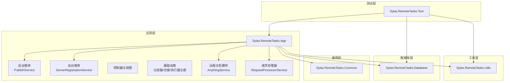
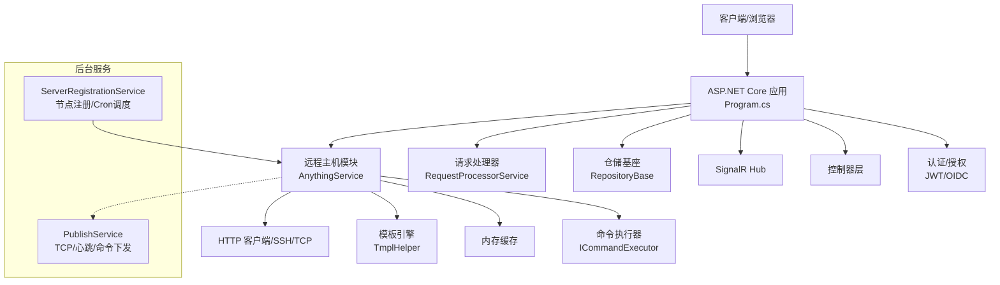
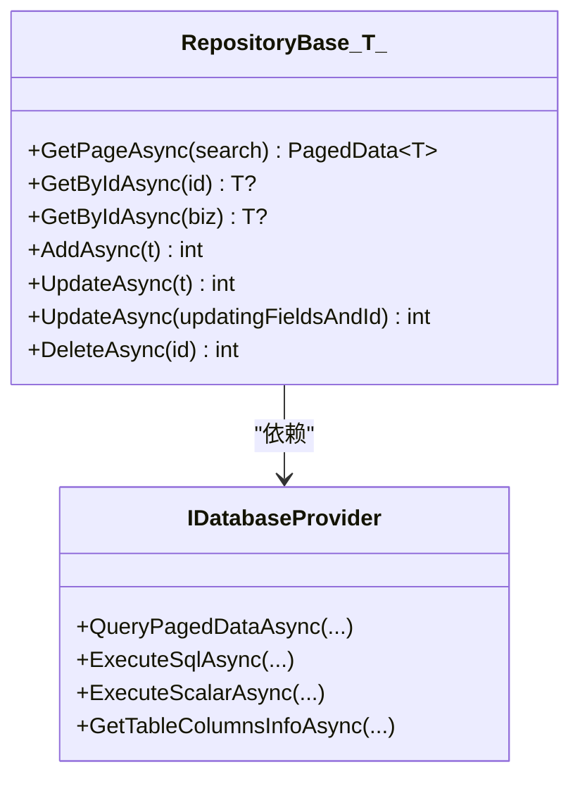
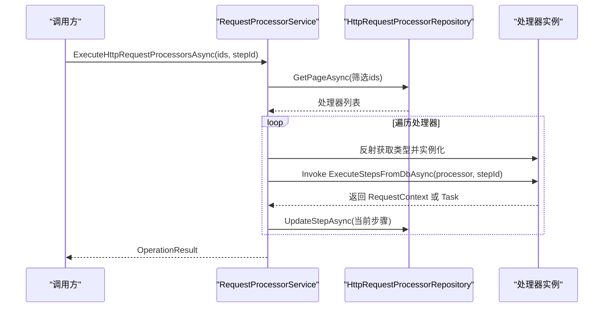
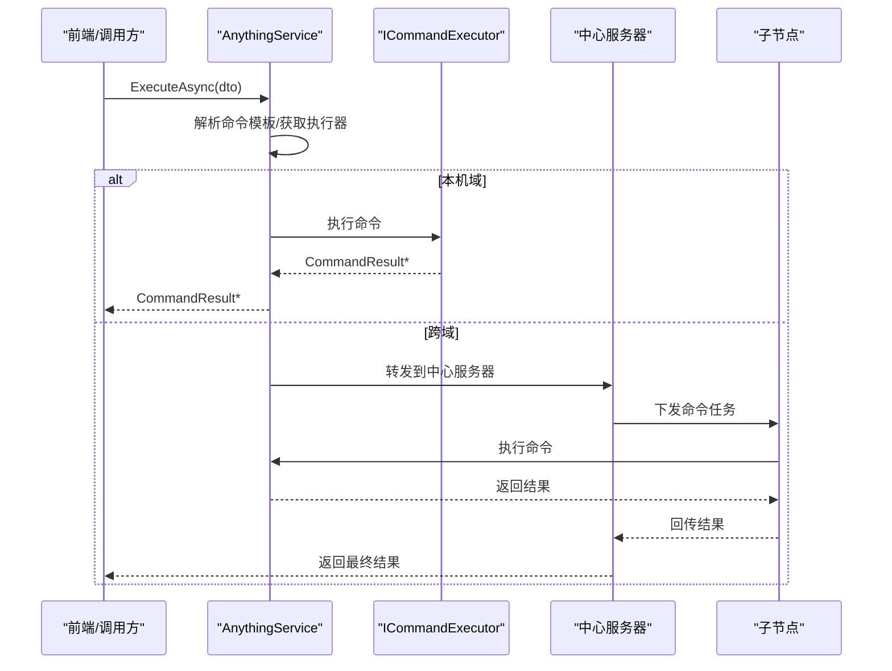
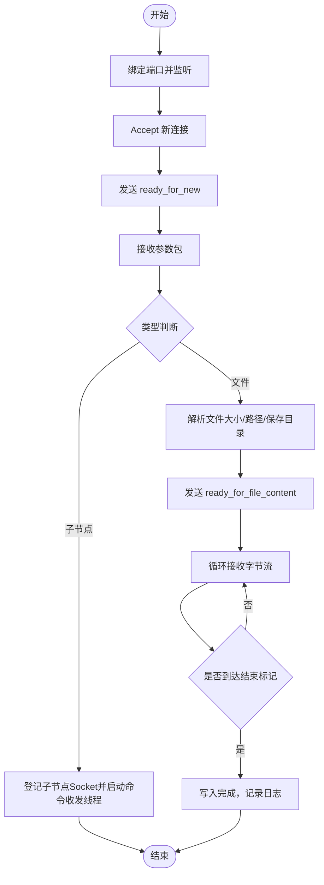
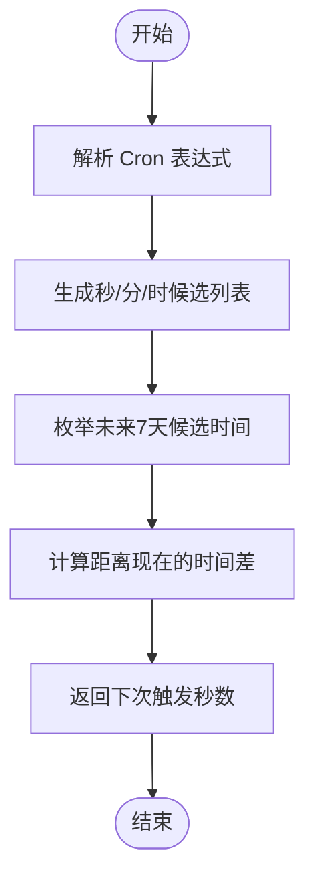
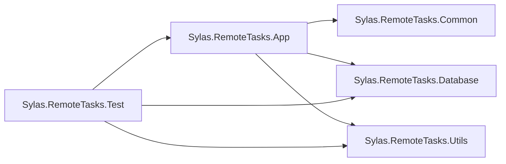

# 最佳实践

<cite>
**本文引用的文件**
- [README.md](file://README.md)
- [Program.cs](file://Sylas.RemoteTasks.App/Program.cs)
- [appsettings.json](file://Sylas.RemoteTasks.App/appsettings.json)
- [Sylas.RemoteTasks.App.csproj](file://Sylas.RemoteTasks.App/Sylas.RemoteTasks.App.csproj)
- [Sylas.RemoteTasks.Common.csproj](file://Sylas.RemoteTasks.Common/Sylas.RemoteTasks.Common.csproj)
- [Sylas.RemoteTasks.Database.csproj](file://Sylas.RemoteTasks.Database/Sylas.RemoteTasks.Database.csproj)
- [Sylas.RemoteTasks.Utils.csproj](file://Sylas.RemoteTasks.Utils/Sylas.RemoteTasks.Utils.csproj)
- [Sylas.RemoteTasks.Test.csproj](file://Sylas.RemoteTasks.Test/Sylas.RemoteTasks.Test.csproj)
- [RepositoryBase.cs](file://Sylas.RemoteTasks.App/Infrastructure/RepositoryBase.cs)
- [DataHandler.cs](file://Sylas.RemoteTasks.App/DataHandlers/DataHandler.cs)
- [RequestProcessorService.cs](file://Sylas.RemoteTasks.App/RequestProcessor/RequestProcessorService.cs)
- [AnythingService.cs](file://Sylas.RemoteTasks.App/RemoteHostModule/Anything/AnythingService.cs)
- [PublishService.cs](file://Sylas.RemoteTasks.App/BackgroundServices/PublishService.cs)
- [ServerRegistrationService.cs](file://Sylas.RemoteTasks.App/BackgroundServices/ServerRegistrationService.cs)
- [CustomActionFilter.cs](file://Sylas.RemoteTasks.App/Infrastructure/CustomActionFilter.cs)
- [MvcParameterFilter.cs](file://Sylas.RemoteTasks.App/Infrastructure/MvcParameterFilter.cs)
</cite>

## 目录
1. [简介](#简介)
2. [项目结构](#项目结构)
3. [核心组件](#核心组件)
4. [架构总览](#架构总览)
5. [详细组件分析](#详细组件分析)
6. [依赖关系分析](#依赖关系分析)
7. [性能考量](#性能考量)
8. [故障排查指南](#故障排查指南)
9. [结论](#结论)
10. [附录](#附录)

## 简介
本最佳实践文档面向 Sylas.RemoteTasks 的开发者与运维人员，系统性阐述代码规范、安全考虑、性能建议、维护策略与团队协作实践。文档结合项目实际代码结构与实现细节，提供可落地的实施指南与图示说明，帮助团队在持续演进中保持高质量交付。

## 项目结构
项目采用多项目解决方案组织，按职责分层：
- 应用层：Sylas.RemoteTasks.App（ASP.NET Core Web 应用，控制器、后台服务、基础设施、远程主机模块、请求处理管线等）
- 通用工具层：Sylas.RemoteTasks.Common（通用 DTO、扩展、辅助类）
- 数据访问层：Sylas.RemoteTasks.Database（数据库抽象、同步基座、SQL 构建、实体基类等）
- 工具与执行层：Sylas.RemoteTasks.Utils（命令执行器、模板引擎、网络、系统操作、验证等）
- 测试层：Sylas.RemoteTasks.Test（单元测试与集成测试）

图表来源
- [Sylas.RemoteTasks.App.csproj](file://Sylas.RemoteTasks.App/Sylas.RemoteTasks.App.csproj#L1-L61)
- [Sylas.RemoteTasks.Common.csproj](file://Sylas.RemoteTasks.Common/Sylas.RemoteTasks.Common.csproj#L1-L16)
- [Sylas.RemoteTasks.Database.csproj](file://Sylas.RemoteTasks.Database/Sylas.RemoteTasks.Database.csproj#L1-L52)
- [Sylas.RemoteTasks.Utils.csproj](file://Sylas.RemoteTasks.Utils/Sylas.RemoteTasks.Utils.csproj#L1-L47)
- [Sylas.RemoteTasks.Test.csproj](file://Sylas.RemoteTasks.Test/Sylas.RemoteTasks.Test.csproj#L1-L44)

章节来源
- [Sylas.RemoteTasks.App.csproj](file://Sylas.RemoteTasks.App/Sylas.RemoteTasks.App.csproj#L1-L61)
- [Sylas.RemoteTasks.Common.csproj](file://Sylas.RemoteTasks.Common/Sylas.RemoteTasks.Common.csproj#L1-L16)
- [Sylas.RemoteTasks.Database.csproj](file://Sylas.RemoteTasks.Database/Sylas.RemoteTasks.Database.csproj#L1-L52)
- [Sylas.RemoteTasks.Utils.csproj](file://Sylas.RemoteTasks.Utils/Sylas.RemoteTasks.Utils.csproj#L1-L47)
- [Sylas.RemoteTasks.Test.csproj](file://Sylas.RemoteTasks.Test/Sylas.RemoteTasks.Test.csproj#L1-L44)

## 核心组件
- 程序入口与服务注册：Program.cs 负责配置 Kestrel、注册缓存、SignalR、HTTP 客户端、仓储、数据处理器、后台服务、认证与授权策略等。
- 配置中心：appsettings.json 提供日志、全局热键、连接串白名单、上传配置、AI 配置、Kestrel 端口、请求管线配置、身份服务配置、进程监控、邮件配置等。
- 仓储基座：RepositoryBase<T> 提供统一的分页查询、新增、更新（含局部更新）、删除能力，并针对不同数据库类型生成返回最新插入 ID 的 SQL。
- 请求处理器：RequestProcessorService 负责从仓储加载处理器与步骤，反射实例化并执行步骤，维护 DataContext 上下文，持久化步骤进度。
- 远程主机模块：AnythingService 提供 Anything 配置、命令、执行器的管理与解析，支持跨节点命令转发、缓存优化、模板解析与命令执行。
- 后台服务：
  - PublishService：TCP 服务端/客户端，负责文件上传、子节点命令下发与结果回传、心跳与重连。
  - ServerRegistrationService：服务节点注册/注销、定时任务调度（基于 Cron）与执行后钩子。
- MVC 过滤器：CustomActionFilter 与 MvcParameterFilter 实现基础认证拦截与参数校验返回统一错误格式。

章节来源
- [Program.cs](file://Sylas.RemoteTasks.App/Program.cs#L1-L122)
- [appsettings.json](file://Sylas.RemoteTasks.App/appsettings.json#L1-L142)
- [RepositoryBase.cs](file://Sylas.RemoteTasks.App/Infrastructure/RepositoryBase.cs#L1-L233)
- [RequestProcessorService.cs](file://Sylas.RemoteTasks.App/RequestProcessor/RequestProcessorService.cs#L1-L72)
- [AnythingService.cs](file://Sylas.RemoteTasks.App/RemoteHostModule/Anything/AnythingService.cs#L1-L680)
- [PublishService.cs](file://Sylas.RemoteTasks.App/BackgroundServices/PublishService.cs#L1-L645)
- [ServerRegistrationService.cs](file://Sylas.RemoteTasks.App/BackgroundServices/ServerRegistrationService.cs#L1-L493)
- [CustomActionFilter.cs](file://Sylas.RemoteTasks.App/Infrastructure/CustomActionFilter.cs#L1-L23)
- [MvcParameterFilter.cs](file://Sylas.RemoteTasks.App/Infrastructure/MvcParameterFilter.cs#L1-L37)

## 架构总览
系统采用“应用层 + 多领域子模块”的分层架构，结合后台服务与远程节点通信，形成集中控制与分布式执行的混合模式。

图表来源
- [Program.cs](file://Sylas.RemoteTasks.App/Program.cs#L1-L122)
- [AnythingService.cs](file://Sylas.RemoteTasks.App/RemoteHostModule/Anything/AnythingService.cs#L1-L680)
- [PublishService.cs](file://Sylas.RemoteTasks.App/BackgroundServices/PublishService.cs#L1-L645)
- [ServerRegistrationService.cs](file://Sylas.RemoteTasks.App/BackgroundServices/ServerRegistrationService.cs#L1-L493)

## 详细组件分析

### 仓储基座 RepositoryBase<T>
- 设计要点
  - 统一 CRUD：分页查询、按主键查询、新增、更新（含局部更新）、删除。
  - 局部更新：通过正则剔除未变更字段，动态拼装 SQL，自动追加更新时间字段。
  - 多数据库适配：针对 PostgreSQL、SQLite、MySQL、SQL Server、Oracle、达梦等生成返回最新 ID 的 SQL。
  - 性能观测：在关键路径输出耗时日志，便于定位瓶颈。
- 错误处理
  - 缺少主键或 Id 字段缺失时抛出异常；不支持的数据库类型抛出异常。
- 复杂度
  - 局部更新涉及正则替换与参数构建，时间复杂度与字段数量线性相关；其余操作为单表查询/更新，复杂度与分页大小相关。

图表来源
- [RepositoryBase.cs](file://Sylas.RemoteTasks.App/Infrastructure/RepositoryBase.cs#L1-L233)

章节来源
- [RepositoryBase.cs](file://Sylas.RemoteTasks.App/Infrastructure/RepositoryBase.cs#L1-L233)

### 请求处理器 RequestProcessorService
- 设计要点
  - 从仓储加载处理器与步骤，反射获取类型与方法，动态调用 ExecuteStepsFromDbAsync。
  - 维护 DataContext 上下文并在步骤间传递，支持断点续跑与步骤持久化。
- 控制流
  - 加载处理器列表 → 实例化 → 逐步骤执行 → 更新步骤状态 → 返回结果。

图表来源
- [RequestProcessorService.cs](file://Sylas.RemoteTasks.App/RequestProcessor/RequestProcessorService.cs#L1-L72)

章节来源
- [RequestProcessorService.cs](file://Sylas.RemoteTasks.App/RequestProcessor/RequestProcessorService.cs#L1-L72)

### 远程主机模块 AnythingService
- 设计要点
  - Anything 配置与命令管理：增删改查、详情聚合、缓存优化。
  - 命令执行：解析模板、构建执行器参数、跨节点转发、结果收集与超时控制。
  - 缓存策略：对执行器映射、执行器对象、AnythingInfo 进行缓存，降低重复解析成本。
- 关键流程
  - 解析命令设置 → 构建执行器 → 执行命令 → 结果回传 → 超时/取消处理。

图表来源
- [AnythingService.cs](file://Sylas.RemoteTasks.App/RemoteHostModule/Anything/AnythingService.cs#L1-L680)

章节来源
- [AnythingService.cs](file://Sylas.RemoteTasks.App/RemoteHostModule/Anything/AnythingService.cs#L1-L680)

### 后台服务 PublishService（TCP/心跳/命令下发）
- 设计要点
  - 作为 TCP 服务端：监听端口、接收文件流、解析参数、写入文件、结束标志校验。
  - 作为 TCP 客户端：连接中心服务器、心跳维持、接收命令、执行并回传结果。
  - 子节点管理：维护子节点 Socket 映射，命令队列分发，结果聚合。
- 流程图（文件上传）

图表来源
- [PublishService.cs](file://Sylas.RemoteTasks.App/BackgroundServices/PublishService.cs#L1-L645)

章节来源
- [PublishService.cs](file://Sylas.RemoteTasks.App/BackgroundServices/PublishService.cs#L1-L645)

### 后台服务 ServerRegistrationService（节点注册/Cron 调度）
- 设计要点
  - 启动时注册节点（主机名、IP 列表、状态），停止时注销。
  - 基于 Cron 的任务调度：解析表达式、计算下次执行时间、按任务并发执行、执行后钩子。
- 流程图（Cron 解析）

图表来源
- [ServerRegistrationService.cs](file://Sylas.RemoteTasks.App/BackgroundServices/ServerRegistrationService.cs#L362-L490)

章节来源
- [ServerRegistrationService.cs](file://Sylas.RemoteTasks.App/BackgroundServices/ServerRegistrationService.cs#L1-L493)

### MVC 过滤器与统一错误处理
- CustomActionFilter：未认证用户重定向至登录页。
- MvcParameterFilter：参数校验失败时返回统一 RequestResult<List<string>> 错误格式与 400 状态码。

章节来源
- [CustomActionFilter.cs](file://Sylas.RemoteTasks.App/Infrastructure/CustomActionFilter.cs#L1-L23)
- [MvcParameterFilter.cs](file://Sylas.RemoteTasks.App/Infrastructure/MvcParameterFilter.cs#L1-L37)

## 依赖关系分析
- 应用层依赖通用层与数据库层，同时引入工具层以获得命令执行、模板、网络等能力。
- 请求处理器与远程主机模块通过仓储与数据库抽象解耦具体实现。
- 后台服务通过 DI 获取服务实例，避免直接依赖外部容器。

图表来源
- [Sylas.RemoteTasks.App.csproj](file://Sylas.RemoteTasks.App/Sylas.RemoteTasks.App.csproj#L43-L44)
- [Sylas.RemoteTasks.Database.csproj](file://Sylas.RemoteTasks.Database/Sylas.RemoteTasks.Database.csproj#L35-L36)
- [Sylas.RemoteTasks.Utils.csproj](file://Sylas.RemoteTasks.Utils/Sylas.RemoteTasks.Utils.csproj#L32-L33)
- [Sylas.RemoteTasks.Test.csproj](file://Sylas.RemoteTasks.Test/Sylas.RemoteTasks.Test.csproj#L27-L28)

章节来源
- [Sylas.RemoteTasks.App.csproj](file://Sylas.RemoteTasks.App/Sylas.RemoteTasks.App.csproj#L1-L61)
- [Sylas.RemoteTasks.Database.csproj](file://Sylas.RemoteTasks.Database/Sylas.RemoteTasks.Database.csproj#L1-L52)
- [Sylas.RemoteTasks.Utils.csproj](file://Sylas.RemoteTasks.Utils/Sylas.RemoteTasks.Utils.csproj#L1-L47)
- [Sylas.RemoteTasks.Test.csproj](file://Sylas.RemoteTasks.Test/Sylas.RemoteTasks.Test.csproj#L1-L44)

## 性能考量
- 仓储与 SQL
  - 局部更新通过正则剔除未变更字段，减少写放大；注意正则替换的性能与可读性平衡。
  - 针对不同数据库类型生成返回最新 ID 的 SQL，避免额外查询。
- 缓存
  - AnythingService 对执行器映射、执行器对象、AnythingInfo 进行缓存，显著降低模板解析与对象创建成本。
  - ServerRegistrationService 对 Cron 解析结果进行缓存，减少重复计算。
- 网络与 I/O
  - PublishService 使用大缓冲区与分块接收，避免频繁系统调用；结束标志校验确保粘包处理正确。
  - SignalR 与 HTTP 客户端复用，减少连接开销。
- 并发与线程
  - 后台服务使用独立线程/任务处理命令下发与结果接收，避免阻塞主线程。
  - 使用并发集合与取消令牌管理任务生命周期，防止资源泄露。

## 故障排查指南
- 认证与授权
  - 若出现未认证跳转登录页，检查 CustomActionFilter 与认证中间件顺序，确认用户是否具备所需角色与作用域。
- 参数校验
  - 参数校验失败会返回统一错误格式与 400 状态码，检查 MvcParameterFilter 的错误集合。
- 请求处理器
  - 若处理器未找到或步骤为空，检查配置与仓储加载逻辑；关注 DataContext 传递与步骤持久化。
- 远程主机模块
  - 命令执行失败或超时：检查模板解析、执行器参数、跨节点转发链路与结果聚合。
  - 缓存异常：清理缓存键或调整过期策略。
- TCP/心跳
  - 心跳超时：检查 PublishService 的心跳频率与重连逻辑；确认子节点 Socket 映射正确。
  - 文件上传失败：核对参数包格式、保存目录权限与结束标志。
- 节点注册
  - 启停状态异常：检查 ServerRegistrationService 的注册/注销流程与数据库表结构。

章节来源
- [CustomActionFilter.cs](file://Sylas.RemoteTasks.App/Infrastructure/CustomActionFilter.cs#L1-L23)
- [MvcParameterFilter.cs](file://Sylas.RemoteTasks.App/Infrastructure/MvcParameterFilter.cs#L1-L37)
- [RequestProcessorService.cs](file://Sylas.RemoteTasks.App/RequestProcessor/RequestProcessorService.cs#L1-L72)
- [AnythingService.cs](file://Sylas.RemoteTasks.App/RemoteHostModule/Anything/AnythingService.cs#L1-L680)
- [PublishService.cs](file://Sylas.RemoteTasks.App/BackgroundServices/PublishService.cs#L1-L645)
- [ServerRegistrationService.cs](file://Sylas.RemoteTasks.App/BackgroundServices/ServerRegistrationService.cs#L1-L493)

## 结论
Sylas.RemoteTasks 通过清晰的分层与模块化设计，实现了远程任务编排、跨节点执行与统一的后台服务管理。遵循本文的代码规范、安全与性能建议、维护策略与团队协作实践，可在保障稳定性的同时提升开发效率与可维护性。

## 附录

### 代码规范与最佳实践清单
- 命名与结构
  - 类型与成员命名清晰，遵循领域驱动设计；仓储泛型约束明确实体基类。
  - 控制器与后台服务职责单一，避免在控制器中直接进行复杂业务编排。
- 异常与日志
  - 明确异常边界，避免吞异常；使用统一 OperationResult/RequestResult 包裹结果。
  - 在关键路径输出性能日志，便于后续优化。
- 配置与安全
  - 连接串关键字白名单与敏感信息保护；启用 HTTPS 与 HSTS。
  - 身份认证与授权策略集中配置，最小权限原则。
- 测试与质量
  - 单元测试覆盖关键分支与边界条件；集成测试覆盖请求处理器与远程执行链路。
  - 使用覆盖率工具评估测试充分性。
- 文档与知识分享
  - 为公共接口与复杂流程补充注释与示例；定期进行技术分享与评审。

### 开发流程与质量保证
- 分支策略
  - 主干保护与 Pull Request 审查；功能分支短周期合并。
- 持续集成
  - 自动化构建、测试与静态分析；失败即阻断。
- 部署与运维
  - Docker 化部署与健康检查；日志分级与告警；备份与回滚策略。

### 团队协作与知识分享
- 规范制定
  - 统一代码风格与提交信息规范；建立共享知识库。
- 技术评审
  - 重大变更必须评审；引入外部依赖前进行风险评估。
- 培训与传承
  - 新人入职培训与导师制度；定期组织专题分享与复盘。