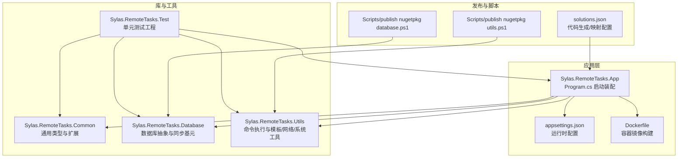
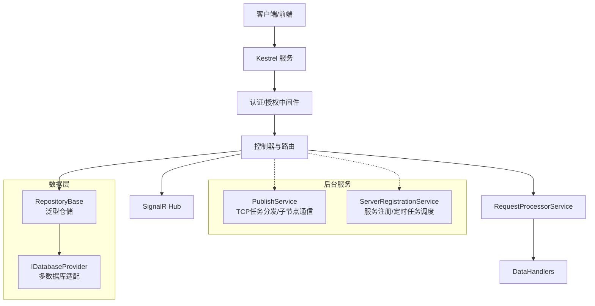
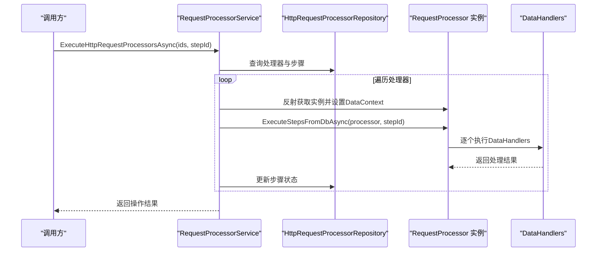
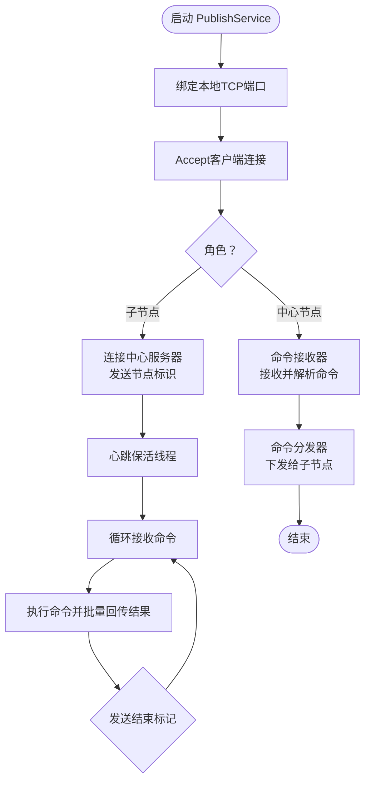
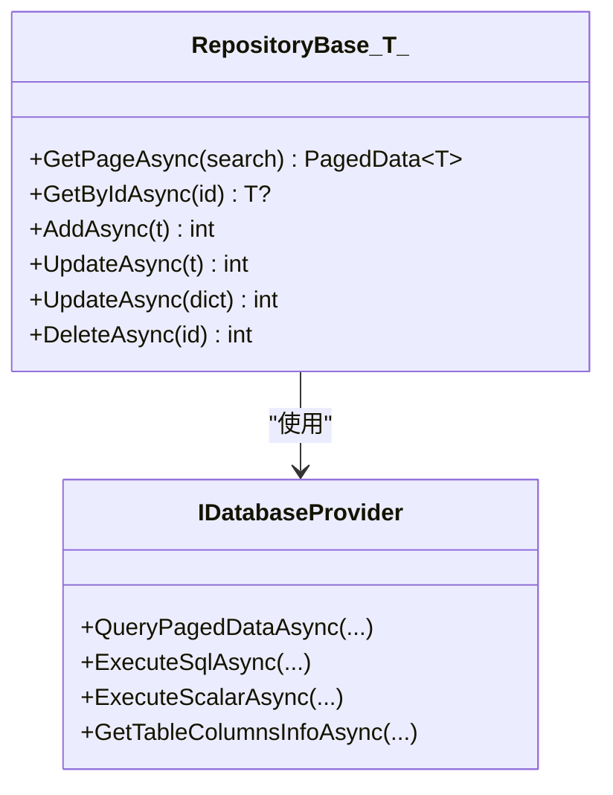
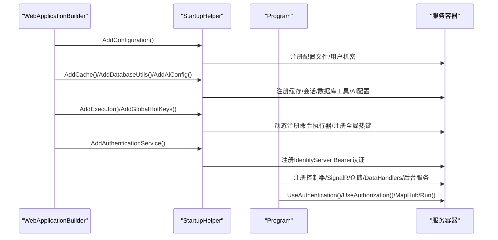
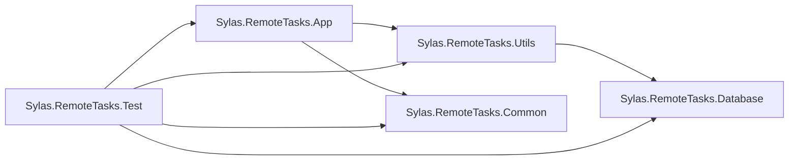

# 维护策略

<cite>
**本文引用的文件**   
- [README.md](file://README.md)
- [Sylas.RemoteTasks.App.csproj](file://Sylas.RemoteTasks.App/Sylas.RemoteTasks.App.csproj)
- [Sylas.RemoteTasks.Common.csproj](file://Sylas.RemoteTasks.Common/Sylas.RemoteTasks.Common.csproj)
- [Sylas.RemoteTasks.Database.csproj](file://Sylas.RemoteTasks.Database/Sylas.RemoteTasks.Database.csproj)
- [Sylas.RemoteTasks.Utils.csproj](file://Sylas.RemoteTasks.Utils/Sylas.RemoteTasks.Utils.csproj)
- [Sylas.RemoteTasks.Test.csproj](file://Sylas.RemoteTasks.Test/Sylas.RemoteTasks.Test.csproj)
- [appsettings.json](file://Sylas.RemoteTasks.App/appsettings.json)
- [Dockerfile](file://Sylas.RemoteTasks.App/Dockerfile)
- [Program.cs](file://Sylas.RemoteTasks.App/Program.cs)
- [solutions.json](file://Sylas.RemoteTasks.App/solutions.json)
- [publish nugetpkg database.ps1](file://Scripts/publish%20nugetpkg%20database.ps1)
- [publish nugetpkg utils.ps1](file://Scripts/publish%20nugetpkg%20utils.ps1)
- [PublishService.cs](file://Sylas.RemoteTasks.App/BackgroundServices/PublishService.cs)
- [ServerRegistrationService.cs](file://Sylas.RemoteTasks.App/BackgroundServices/ServerRegistrationService.cs)
- [RepositoryBase.cs](file://Sylas.RemoteTasks.App/Infrastructure/RepositoryBase.cs)
- [StartupHelper.cs](file://Sylas.RemoteTasks.App/Helpers/StartupHelper.cs)
- [RequestProcessorService.cs](file://Sylas.RemoteTasks.App/RequestProcessor/RequestProcessorService.cs)
</cite>

## 目录
1. [简介](#简介)
2. [项目结构](#项目结构)
3. [核心组件](#核心组件)
4. [架构总览](#架构总览)
5. [详细组件分析](#详细组件分析)
6. [依赖关系分析](#依赖关系分析)
7. [性能考量](#性能考量)
8. [故障排查指南](#故障排查指南)
9. [结论](#结论)
10. [附录](#附录)

## 简介
本维护策略文档面向 Sylas.RemoteTasks 项目，围绕代码重构、版本升级、依赖管理、配置更新、CI/CD、自动化测试、发布管理、热修复与回滚、灰度发布、代码健康度与技术债务、文档维护、故障预防与快速恢复等方面，提供系统化的最佳实践与运维建议。文档同时结合项目现有结构与脚本，给出可落地的实施路径。

## 项目结构
项目采用多项目解决方案，包含应用层、通用库、数据库抽象与工具库，并辅以测试工程与发布脚本。应用层通过 Program.cs 进行启动装配，配置由 appsettings.json 提供，Dockerfile 用于容器化部署；Scripts 目录包含 NuGet 包发布的 PowerShell 脚本。

**图表来源**
- [Program.cs](file://Sylas.RemoteTasks.App/Program.cs#L1-L122)
- [appsettings.json](file://Sylas.RemoteTasks.App/appsettings.json#L1-L142)
- [Dockerfile](file://Sylas.RemoteTasks.App/Dockerfile#L1-L21)
- [Sylas.RemoteTasks.App.csproj](file://Sylas.RemoteTasks.App/Sylas.RemoteTasks.App.csproj#L1-L61)
- [Sylas.RemoteTasks.Common.csproj](file://Sylas.RemoteTasks.Common/Sylas.RemoteTasks.Common.csproj#L1-L16)
- [Sylas.RemoteTasks.Database.csproj](file://Sylas.RemoteTasks.Database/Sylas.RemoteTasks.Database.csproj#L1-L52)
- [Sylas.RemoteTasks.Utils.csproj](file://Sylas.RemoteTasks.Utils/Sylas.RemoteTasks.Utils.csproj#L1-L47)
- [Sylas.RemoteTasks.Test.csproj](file://Sylas.RemoteTasks.Test/Sylas.RemoteTasks.Test.csproj#L1-L44)
- [publish nugetpkg database.ps1](file://Scripts/publish%20nugetpkg%20database.ps1#L1-L29)
- [publish nugetpkg utils.ps1](file://Scripts/publish%20nugetpkg%20utils.ps1#L1-L29)
- [solutions.json](file://Sylas.RemoteTasks.App/solutions.json#L1-L132)

**章节来源**
- [README.md](file://README.md#L1-L43)
- [Program.cs](file://Sylas.RemoteTasks.App/Program.cs#L1-L122)
- [appsettings.json](file://Sylas.RemoteTasks.App/appsettings.json#L1-L142)
- [Dockerfile](file://Sylas.RemoteTasks.App/Dockerfile#L1-L21)
- [Sylas.RemoteTasks.App.csproj](file://Sylas.RemoteTasks.App/Sylas.RemoteTasks.App.csproj#L1-L61)
- [Sylas.RemoteTasks.Common.csproj](file://Sylas.RemoteTasks.Common/Sylas.RemoteTasks.Common.csproj#L1-L16)
- [Sylas.RemoteTasks.Database.csproj](file://Sylas.RemoteTasks.Database/Sylas.RemoteTasks.Database.csproj#L1-L52)
- [Sylas.RemoteTasks.Utils.csproj](file://Sylas.RemoteTasks.Utils/Sylas.RemoteTasks.Utils.csproj#L1-L47)
- [Sylas.RemoteTasks.Test.csproj](file://Sylas.RemoteTasks.Test/Sylas.RemoteTasks.Test.csproj#L1-L44)
- [publish nugetpkg database.ps1](file://Scripts/publish%20nugetpkg%20database.ps1#L1-L29)
- [publish nugetpkg utils.ps1](file://Scripts/publish%20nugetpkg%20utils.ps1#L1-L29)
- [solutions.json](file://Sylas.RemoteTasks.App/solutions.json#L1-L132)

## 核心组件
- 应用启动与装配：Program.cs 负责读取配置、注册服务、启用认证/授权、路由与 SignalR 映射。
- 配置体系：appsettings.json 提供日志、连接串、Kestrel 端口、请求流水线、身份服务、邮件等配置。
- 数据访问与仓储：RepositoryBase<T> 提供泛型增删改查与局部更新能力，适配多种数据库类型。
- 请求处理流水线：RequestProcessorService 通过反射加载处理器实例，按步骤执行 DataHandlers。
- 节点与任务：PublishService 负责 TCP 任务分发与子节点通信；ServerRegistrationService 负责服务注册/注销与定时任务调度。
- 工具与库：Common/Database/Utils 提供通用类型、数据库抽象、命令执行、模板解析、网络与系统工具。
- 测试工程：Sylas.RemoteTasks.Test 覆盖数据库、安全、模板、系统辅助等模块。
- 容器化与发布：Dockerfile 定义运行时镜像与环境变量；PowerShell 脚本用于 NuGet 包发布。

**章节来源**
- [Program.cs](file://Sylas.RemoteTasks.App/Program.cs#L1-L122)
- [appsettings.json](file://Sylas.RemoteTasks.App/appsettings.json#L1-L142)
- [RepositoryBase.cs](file://Sylas.RemoteTasks.App/Infrastructure/RepositoryBase.cs#L1-L233)
- [RequestProcessorService.cs](file://Sylas.RemoteTasks.App/RequestProcessor/RequestProcessorService.cs#L1-L72)
- [PublishService.cs](file://Sylas.RemoteTasks.App/BackgroundServices/PublishService.cs#L1-L645)
- [ServerRegistrationService.cs](file://Sylas.RemoteTasks.App/BackgroundServices/ServerRegistrationService.cs#L1-L493)
- [Sylas.RemoteTasks.Common.csproj](file://Sylas.RemoteTasks.Common/Sylas.RemoteTasks.Common.csproj#L1-L16)
- [Sylas.RemoteTasks.Database.csproj](file://Sylas.RemoteTasks.Database/Sylas.RemoteTasks.Database.csproj#L1-L52)
- [Sylas.RemoteTasks.Utils.csproj](file://Sylas.RemoteTasks.Utils/Sylas.RemoteTasks.Utils.csproj#L1-L47)
- [Sylas.RemoteTasks.Test.csproj](file://Sylas.RemoteTasks.Test/Sylas.RemoteTasks.Test.csproj#L1-L44)

## 架构总览
应用采用 ASP.NET Core Web 主框架，结合后台服务、SignalR、认证授权与多数据库支持。请求处理通过“处理器 + 步骤 + DataHandlers”的可配置流水线实现，节点间通过 TCP 长连接进行任务下发与结果回传。

**图表来源**
- [Program.cs](file://Sylas.RemoteTasks.App/Program.cs#L1-L122)
- [RequestProcessorService.cs](file://Sylas.RemoteTasks.App/RequestProcessor/RequestProcessorService.cs#L1-L72)
- [RepositoryBase.cs](file://Sylas.RemoteTasks.App/Infrastructure/RepositoryBase.cs#L1-L233)
- [PublishService.cs](file://Sylas.RemoteTasks.App/BackgroundServices/PublishService.cs#L1-L645)
- [ServerRegistrationService.cs](file://Sylas.RemoteTasks.App/BackgroundServices/ServerRegistrationService.cs#L1-L493)

## 详细组件分析

### 组件A：请求处理流水线（RequestProcessorService）
- 职责：按配置加载处理器实例，遍历步骤并执行 DataHandlers，支持跨步骤 DataContext 传递与步骤级持久化。
- 关键点：通过反射获取实现类型与 ExecuteStepsFromDbAsync 方法，动态设置 DataContext，支持 stepId 选择性执行。
- 复杂度：O(N) 步骤遍历，每次步骤执行受 DataHandlers 数量影响；建议对大数据量场景分批执行与异步化。

**图表来源**
- [RequestProcessorService.cs](file://Sylas.RemoteTasks.App/RequestProcessor/RequestProcessorService.cs#L1-L72)

**章节来源**
- [RequestProcessorService.cs](file://Sylas.RemoteTasks.App/RequestProcessor/RequestProcessorService.cs#L1-L72)

### 组件B：节点与任务（PublishService 与 ServerRegistrationService）
- PublishService：监听本地 TCP 端口，接收文件/命令任务；作为子节点与中心服务器建立长连接，心跳保活与断线重连；负责命令下发与结果回传。
- ServerRegistrationService：服务启动/停止时注册/注销节点；定时扫描 AnythingFlow，按 Cron 表达式调度执行系统命令并记录日志。
- 关键点：心跳频率与超时阈值、并发子线程管理、取消令牌控制、粘包处理与结束标记校验。

**图表来源**
- [PublishService.cs](file://Sylas.RemoteTasks.App/BackgroundServices/PublishService.cs#L1-L645)
- [ServerRegistrationService.cs](file://Sylas.RemoteTasks.App/BackgroundServices/ServerRegistrationService.cs#L1-L493)

**章节来源**
- [PublishService.cs](file://Sylas.RemoteTasks.App/BackgroundServices/PublishService.cs#L1-L645)
- [ServerRegistrationService.cs](file://Sylas.RemoteTasks.App/BackgroundServices/ServerRegistrationService.cs#L1-L493)

### 组件C：数据访问与仓储（RepositoryBase<T>）
- 职责：提供泛型分页查询、按 Id 查询、新增、更新、删除；支持局部更新（仅更新传入字段）与自动时间戳更新。
- 数据库适配：根据数据库类型拼接返回最新 ID 的 SQL（PostgreSQL/SQLite/MySQL/SQL Server/Oracle 等）。
- 复杂度：新增/更新/删除为单 SQL 执行；局部更新通过正则剔除未变更字段，减少写入。

**图表来源**
- [RepositoryBase.cs](file://Sylas.RemoteTasks.App/Infrastructure/RepositoryBase.cs#L1-L233)

**章节来源**
- [RepositoryBase.cs](file://Sylas.RemoteTasks.App/Infrastructure/RepositoryBase.cs#L1-L233)

### 组件D：启动与配置（StartupHelper 与 Program.cs）
- StartupHelper：集中注册配置文件、缓存、会话、数据库工具、AI 配置、全局热键、认证服务（IdentityServer Bearer）。
- Program.cs：装配 Kestrel、注册控制器、SignalR、HTTP 客户端、仓储、DataHandlers、后台服务、认证/授权、路由与 Hub 映射。

**图表来源**
- [StartupHelper.cs](file://Sylas.RemoteTasks.App/Helpers/StartupHelper.cs#L1-L275)
- [Program.cs](file://Sylas.RemoteTasks.App/Program.cs#L1-L122)

**章节来源**
- [StartupHelper.cs](file://Sylas.RemoteTasks.App/Helpers/StartupHelper.cs#L1-L275)
- [Program.cs](file://Sylas.RemoteTasks.App/Program.cs#L1-L122)

## 依赖关系分析
- 项目依赖关系：App 引用 Utils 与 Common；Utils 引用 Database；Test 引用 App；Database 与 Utils 各自声明版本号并打包为 NuGet。
- 外部依赖：IdentityModel、Microsoft.AspNetCore.Authentication.*、Dapper、Newtonsoft.Json、System.Text.Json、MailKit、SSH.NET、Microsoft.CodeAnalysis.CSharp 等。
- Docker 运行时镜像：基于 .NET 10 运行时，暴露 80/443 端口，设置 Asia/Shanghai 时区。

**图表来源**
- [Sylas.RemoteTasks.App.csproj](file://Sylas.RemoteTasks.App/Sylas.RemoteTasks.App.csproj#L43-L44)
- [Sylas.RemoteTasks.Utils.csproj](file://Sylas.RemoteTasks.Utils/Sylas.RemoteTasks.Utils.csproj#L32-L33)
- [Sylas.RemoteTasks.Database.csproj](file://Sylas.RemoteTasks.Database/Sylas.RemoteTasks.Database.csproj#L1-L52)
- [Sylas.RemoteTasks.Test.csproj](file://Sylas.RemoteTasks.Test/Sylas.RemoteTasks.Test.csproj#L27-L28)

**章节来源**
- [Sylas.RemoteTasks.App.csproj](file://Sylas.RemoteTasks.App/Sylas.RemoteTasks.App.csproj#L1-L61)
- [Sylas.RemoteTasks.Common.csproj](file://Sylas.RemoteTasks.Common/Sylas.RemoteTasks.Common.csproj#L1-L16)
- [Sylas.RemoteTasks.Database.csproj](file://Sylas.RemoteTasks.Database/Sylas.RemoteTasks.Database.csproj#L1-L52)
- [Sylas.RemoteTasks.Utils.csproj](file://Sylas.RemoteTasks.Utils/Sylas.RemoteTasks.Utils.csproj#L1-L47)
- [Sylas.RemoteTasks.Test.csproj](file://Sylas.RemoteTasks.Test/Sylas.RemoteTasks.Test.csproj#L1-L44)

## 性能考量
- 线程与并发：PublishService 使用多线程处理子连接与命令收发，注意线程池与资源释放；ServerRegistrationService 对每个定时任务独立 CancellationTokenSource，避免长时间持有大对象。
- 数据库访问：RepositoryBase<T> 在新增/更新时根据数据库类型拼接返回最新 ID 的 SQL，减少额外查询；局部更新通过正则剔除未变更字段，降低写放大。
- 缓存与会话：StartupHelper 注册分布式内存缓存与 Session，合理设置 IdleTimeout，避免内存占用过高。
- 日志与监控：appsettings.json 设置 Console 简单格式化器与时间戳，便于容器日志采集；建议引入结构化日志与指标导出。

[本节为通用指导，不直接分析具体文件]

## 故障排查指南
- TCP 任务与节点通信
  - 现象：子节点无法接收命令或结果丢失。
  - 排查：检查 PublishService 心跳频率与超时阈值、结束标记“000000”校验、粘包处理；确认中心服务器地址与端口配置。
- 定时任务调度
  - 现象：AnythingFlow 未按预期执行。
  - 排查：核对 Cron 表达式解析逻辑、执行时间计算、取消令牌状态；检查 OnExecuted 脚本执行权限与输出。
- 数据访问
  - 现象：更新失败或返回 ID 错误。
  - 排查：确认数据库类型分支、返回最新 ID 的 SQL 拼接、参数绑定；局部更新时字段剔除与时间戳更新逻辑。
- 认证与授权
  - 现象：Bearer Token 验证失败。
  - 排查：核对 IdentityServer 配置项、ApiName/ApiSecret、RequireHttpsMetadata、Claims 映射；检查 OnTokenValidated 事件。

**章节来源**
- [PublishService.cs](file://Sylas.RemoteTasks.App/BackgroundServices/PublishService.cs#L1-L645)
- [ServerRegistrationService.cs](file://Sylas.RemoteTasks.App/BackgroundServices/ServerRegistrationService.cs#L1-L493)
- [RepositoryBase.cs](file://Sylas.RemoteTasks.App/Infrastructure/RepositoryBase.cs#L1-L233)
- [StartupHelper.cs](file://Sylas.RemoteTasks.App/Helpers/StartupHelper.cs#L124-L271)

## 结论
本维护策略以项目现有结构为基础，提出覆盖重构、升级、依赖管理、配置更新、CI/CD、测试、发布、热修复与回滚、灰度发布、健康度与技术债务、文档与故障恢复的全生命周期维护方案。建议在后续迭代中逐步引入自动化流水线与可观测性工具，持续优化性能与稳定性。

[本节为总结，不直接分析具体文件]

## 附录

### A. 代码重构与版本升级最佳实践
- 重构策略
  - 保持单一职责：将复杂后台服务拆分为更小的服务单元，明确输入输出契约。
  - 抽象与接口：对数据库访问、命令执行器、模板解析等进行接口抽象，便于替换与测试。
  - 配置驱动：将可变参数（如端口、超时、Cron 表达式）统一收敛到配置文件，避免硬编码。
- 版本升级
  - .NET 版本：当前目标框架为 net10.0，建议在 LTS 版本之间平滑迁移；升级前确保第三方包兼容。
  - NuGet 包：Database/Utils 项目显式声明版本号并打包，升级时遵循语义化版本与最小改动原则。

**章节来源**
- [Sylas.RemoteTasks.App.csproj](file://Sylas.RemoteTasks.App/Sylas.RemoteTasks.App.csproj#L1-L61)
- [Sylas.RemoteTasks.Database.csproj](file://Sylas.RemoteTasks.Database/Sylas.RemoteTasks.Database.csproj#L8-L11)
- [Sylas.RemoteTasks.Utils.csproj](file://Sylas.RemoteTasks.Utils/Sylas.RemoteTasks.Utils.csproj#L8-L11)

### B. 依赖管理与安全
- 依赖清单
  - 认证授权：IdentityModel、Microsoft.AspNetCore.Authentication.JwtBearer、Microsoft.AspNetCore.Authentication.OpenIdConnect。
  - 数据库：Dapper、System.Text.Json、Newtonsoft.Json、多数据库 Provider（MySql、Npgsql、System.Data.SqlClient、Oracle、Sqlite）。
  - 工具：MailKit、SSH.NET、Microsoft.CodeAnalysis.CSharp、RazorEngine.NetCore。
- 安全建议
  - 使用用户机密与外部配置文件覆盖敏感信息；避免将密钥提交到版本库。
  - 启用 HTTPS 与 HSTS；严格校验客户端证书与 TLS 版本。

**章节来源**
- [Sylas.RemoteTasks.App.csproj](file://Sylas.RemoteTasks.App/Sylas.RemoteTasks.App.csproj#L33-L40)
- [Sylas.RemoteTasks.Common.csproj](file://Sylas.RemoteTasks.Common/Sylas.RemoteTasks.Common.csproj#L9-L13)
- [Sylas.RemoteTasks.Database.csproj](file://Sylas.RemoteTasks.Database/Sylas.RemoteTasks.Database.csproj#L18-L32)
- [Sylas.RemoteTasks.Utils.csproj](file://Sylas.RemoteTasks.Utils/Sylas.RemoteTasks.Utils.csproj#L18-L29)

### C. 配置更新与容器化
- 配置更新
  - appsettings.json 提供日志、连接串、Kestrel 端口、请求流水线、身份服务、邮件等配置；建议通过用户机密与 TaskImportantSettings.json 进行差异化覆盖。
- 容器化
  - Dockerfile 基于 ASP.NET 10 运行时，设置时区与端口；建议在生产环境使用 HTTPS 与证书配置。

**章节来源**
- [appsettings.json](file://Sylas.RemoteTasks.App/appsettings.json#L1-L142)
- [Dockerfile](file://Sylas.RemoteTasks.App/Dockerfile#L1-L21)

### D. CI/CD 与自动化测试
- CI/CD 建议
  - 构建：在 CI 中执行 dotnet restore/build/test/publish，针对不同环境生成产物。
  - 容器：在流水线中构建 Docker 镜像并推送至镜像仓库，支持多环境部署。
  - 发布：使用 PowerShell 脚本发布 NuGet 包，脚本从项目文件提取版本号并推送至 NuGet 源。
- 自动化测试
  - 使用 Sylas.RemoteTasks.Test 工程，覆盖数据库、安全、模板、系统辅助等模块；建议引入覆盖率工具与静态分析。

**章节来源**
- [publish nugetpkg database.ps1](file://Scripts/publish%20nugetpkg%20database.ps1#L1-L29)
- [publish nugetpkg utils.ps1](file://Scripts/publish%20nugetpkg%20utils.ps1#L1-L29)
- [Sylas.RemoteTasks.Test.csproj](file://Sylas.RemoteTasks.Test/Sylas.RemoteTasks.Test.csproj#L1-L44)

### E. 发布管理与灰度发布
- 发布管理
  - 版本号：Database/Utils 项目在 csproj 中显式声明版本号，发布前统一升级并同步。
  - 包发布：通过 PowerShell 脚本读取版本号并推送 NuGet 包，支持跳过重复包。
- 灰度发布
  - 建议采用蓝绿/金丝雀策略：先在小部分节点启用新版本，观察日志与指标，再逐步扩大流量。

**章节来源**
- [Sylas.RemoteTasks.Database.csproj](file://Sylas.RemoteTasks.Database/Sylas.RemoteTasks.Database.csproj#L8-L11)
- [Sylas.RemoteTasks.Utils.csproj](file://Sylas.RemoteTasks.Utils/Sylas.RemoteTasks.Utils.csproj#L8-L11)
- [publish nugetpkg database.ps1](file://Scripts/publish%20nugetpkg%20database.ps1#L1-L29)
- [publish nugetpkg utils.ps1](file://Scripts/publish%20nugetpkg%20utils.ps1#L1-L29)

### F. 热修复与回滚策略
- 热修复
  - 快速定位：通过日志与 SignalR Hub 实时观测；优先修复认证、数据库连接与 TCP 通信问题。
  - 回滚：若涉及配置变更，优先回滚 appsettings.json；若涉及 NuGet 包，回滚到上一个稳定版本。
- 回滚流程
  - 应用层：回滚镜像或二进制；恢复配置文件。
  - 数据层：必要时回滚数据库迁移或执行逆向迁移脚本。

**章节来源**
- [appsettings.json](file://Sylas.RemoteTasks.App/appsettings.json#L1-L142)
- [Dockerfile](file://Sylas.RemoteTasks.App/Dockerfile#L1-L21)

### G. 代码健康度与技术债务
- 健康度评估
  - 代码覆盖率：使用 Coverlet 收集测试覆盖率，设定阈值并持续提升。
  - 静态分析：引入 Roslyn 分析器与 SonarQube，识别重复、复杂度高与潜在风险。
- 技术债务管理
  - 清单化：记录待重构模块（如 PublishService 的线程模型、Cron 解析缓存）。
  - 分批偿还：将大重构拆分为小迭代，配合自动化测试保障质量。

**章节来源**
- [Sylas.RemoteTasks.Test.csproj](file://Sylas.RemoteTasks.Test/Sylas.RemoteTasks.Test.csproj#L19-L23)

### H. 文档维护与知识沉淀
- 文档清单
  - 架构图、部署手册、API 参考、运维手册、故障排查手册。
- 维护建议
  - 与代码同步更新；使用 Markdown 统一格式；在 README 中提供快速入门与部署指引。

**章节来源**
- [README.md](file://README.md#L1-L43)