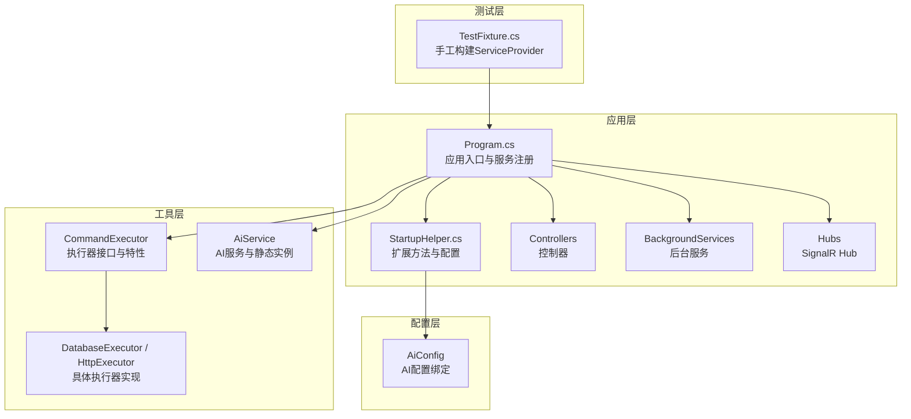
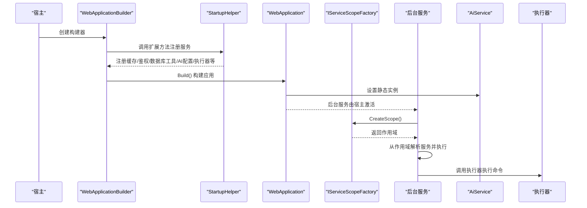
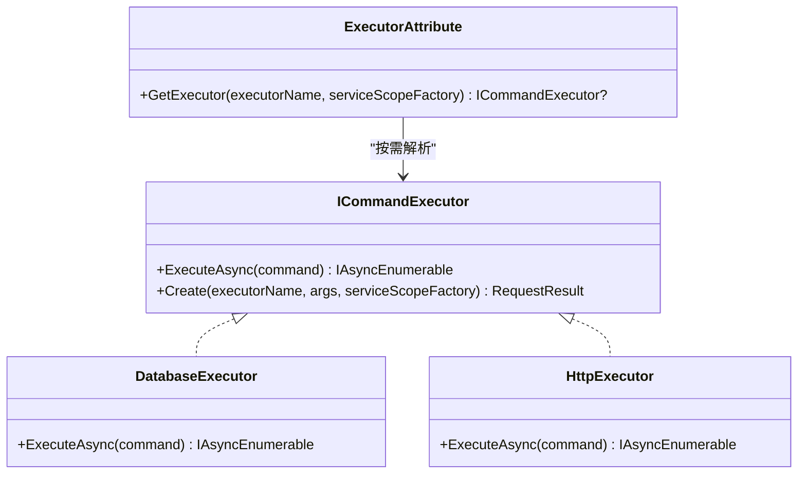
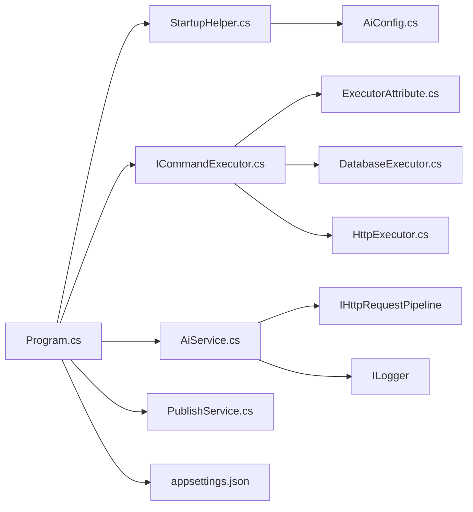

# 依赖注入容器

<cite>
**本文引用的文件**
- [Program.cs](file://Sylas.RemoteTasks.App/Program.cs)
- [StartupHelper.cs](file://Sylas.RemoteTasks.App/Helpers/StartupHelper.cs)
- [appsettings.json](file://Sylas.RemoteTasks.App/appsettings.json)
- [AiService.cs](file://Sylas.RemoteTasks.Utils/AiService.cs)
- [AiConfig.cs](file://Sylas.RemoteTasks.Utils/Dtos/AiConfig.cs)
- [ICommandExecutor.cs](file://Sylas.RemoteTasks.Utils/CommandExecutor/ICommandExecutor.cs)
- [ExecutorAttribute.cs](file://Sylas.RemoteTasks.Utils/CommandExecutor/ExecutorAttribute.cs)
- [DatabaseExecutor.cs](file://Sylas.RemoteTasks.Utils/CommandExecutor/DatabaseExecutor.cs)
- [HttpExecutor.cs](file://Sylas.RemoteTasks.Utils/CommandExecutor/HttpExecutor.cs)
- [PublishService.cs](file://Sylas.RemoteTasks.App/BackgroundServices/PublishService.cs)
- [TestFixture.cs](file://Sylas.RemoteTasks.Test/TestFixture.cs)
- [GeneratorContext.cs](file://Sylas.RemoteTasks.App/Infrastructure/GeneratorContext.cs)
</cite>

## 更新摘要
**变更内容**
- 新增 AiService 依赖注入配置章节，详细说明 AI 服务的注册与使用
- 更新服务注册与生命周期策略，包含 AiService 的 Singleton 注册
- 新增 AI 配置绑定与静态实例访问模式
- 更新架构总览图，包含 AI 服务集成

## 目录
1. [简介](#简介)
2. [项目结构](#项目结构)
3. [核心组件](#核心组件)
4. [架构总览](#架构总览)
5. [详细组件分析](#详细组件分析)
6. [AI 服务集成](#ai-服务集成)
7. [依赖关系分析](#依赖关系分析)
8. [性能考量](#性能考量)
9. [故障排查指南](#故障排查指南)
10. [结论](#结论)
11. [附录](#附录)

## 简介
本文件系统性梳理 Sylas.RemoteTasks 的 ASP.NET Core 依赖注入（DI）容器配置与使用，涵盖服务注册方式、生命周期管理与作用域控制、不同生命周期选择原则、最佳实践与常见陷阱、自定义服务提供者与扩展思路、服务解析与循环依赖规避等内容。文档面向不同技术背景读者，既提供高层概览也给出可落地的实施建议。

**更新** 新增 AI 服务集成章节，说明 AiService 的依赖注入配置和静态实例访问模式。

## 项目结构
- 应用入口与容器配置集中在应用层 Program.cs，通过 WebApplicationBuilder 构建并注册各类服务。
- 辅助配置集中在 Helpers/StartupHelper.cs，封装 AddXxx 扩展方法，统一注册缓存、鉴权、数据库工具、AI 配置、全局热键等。
- 测试层通过 ServiceCollection 手工构建 ServiceProvider，模拟真实 DI 场景。
- 执行器体系通过自定义特性与反射扫描实现动态注册，体现"约定优于配置"的扩展机制。
- 后台服务通过 IServiceScopeFactory 在运行期按需创建作用域，解析服务并执行任务，展示作用域控制与服务解析的正确用法。
- **新增** AI 服务通过 StartupHelper.AddAiConfig 方法注册，支持静态实例访问模式。

**图示来源**
- [Program.cs:12-135](file://Sylas.RemoteTasks.App/Program.cs#L12-L135)
- [StartupHelper.cs:77-85](file://Sylas.RemoteTasks.App/Helpers/StartupHelper.cs#L77-L85)
- [AiService.cs:16-25](file://Sylas.RemoteTasks.Utils/AiService.cs#L16-L25)
- [AiConfig.cs:6-20](file://Sylas.RemoteTasks.Utils/Dtos/AiConfig.cs#L6-L20)

**章节来源**
- [Program.cs:12-135](file://Sylas.RemoteTasks.App/Program.cs#L12-L135)
- [StartupHelper.cs:77-85](file://Sylas.RemoteTasks.App/Helpers/StartupHelper.cs#L77-L85)
- [AiService.cs:16-25](file://Sylas.RemoteTasks.Utils/AiService.cs#L16-L25)
- [AiConfig.cs:6-20](file://Sylas.RemoteTasks.Utils/Dtos/AiConfig.cs#L6-L20)
- [TestFixture.cs:16-51](file://Sylas.RemoteTasks.Test/TestFixture.cs#L16-L51)

## 核心组件
- 容器构建与注册
  - 使用 WebApplicationBuilder 构建应用，集中注册 MVC、SignalR、HttpClient、HttpContextAccessor、缓存、认证授权、仓储、执行器、后台服务等。
  - 通过扩展方法 StartupHelper.AddXxx 将重复逻辑封装，提升可维护性。
  - **新增** AI 服务注册：通过 AddAiConfig 方法注册 AiConfig 单例和 AiService 单例。
- 生命周期与作用域
  - 单例：适合无状态、跨请求共享的配置对象、工厂类、只读工具类、AI 服务。
  - 作用域：适合与 HTTP 请求生命周期绑定的仓储、上下文、临时状态对象。
  - 瞬态：适合轻量、无状态、每次使用都需要全新实例的短生命周期对象。
- 执行器体系
  - 通过自定义特性 ExecutorAttribute 与反射扫描，按约定自动注册实现类，结合作用域工厂按需解析。
- 后台服务作用域解析
  - 后台服务通过 IServiceScopeFactory 创建作用域，解析服务执行任务，避免直接持有长生命周期容器根。
- **新增** AI 服务静态访问
  - AiService.Instance 提供静态访问入口，支持无法通过 DI 注入的场景（如静态方法）。

**章节来源**
- [Program.cs:27-102](file://Sylas.RemoteTasks.App/Program.cs#L27-L102)
- [StartupHelper.cs:77-85](file://Sylas.RemoteTasks.App/Helpers/StartupHelper.cs#L77-L85)
- [AiService.cs:25-25](file://Sylas.RemoteTasks.Utils/AiService.cs#L25-L25)

## 架构总览
下图展示应用启动阶段的服务注册与运行阶段的作用域解析流程，体现"注册—构建—解析—执行"的闭环，包含新增的 AI 服务集成。

**图示来源**
- [Program.cs:27-102](file://Sylas.RemoteTasks.App/Program.cs#L27-L102)
- [StartupHelper.cs:77-85](file://Sylas.RemoteTasks.App/Helpers/StartupHelper.cs#L77-L85)

## 详细组件分析

### 服务注册与生命周期策略
- 注册清单与策略
  - 控制器与 SignalR：默认注册 MVC 与 SignalR。
  - 缓存与会话：注册分布式内存缓存与 Session。
  - HTTP 客户端与上下文：注册 HttpClient 与 HttpContextAccessor。
  - 仓储：泛型仓储与具体仓储注册为作用域。
  - 执行器：通过反射扫描并按作用域注册，便于按需解析。
  - 数据库工具：DatabaseInfo 作用域注册；DatabaseInfoFactory 单例注册。
  - **新增** AI 配置：从配置绑定为单例，AiService 注册为单例。
  - 全局热键：从配置读取并注册。
  - 后台服务：发布服务与服务器注册服务注册为托管服务。
  - 鉴权与授权：注册认证服务与授权策略。
- 生命周期选择原则
  - 单例（Singleton）
    - 无状态、跨请求共享：如配置对象、工厂类、只读工具类、AI 服务。
    - 注意线程安全与可变状态。
    - **新增** AI 服务适合单例，因为其内部状态主要是配置和依赖注入的只读服务。
  - 作用域（Scoped）
    - 与 HTTP 请求生命周期一致：仓储、上下文、临时状态。
    - 适合需要跨组件协作但不希望泄漏到其他请求的状态。
  - 瞬态（Transient）
    - 轻量、无状态、每次使用都需要全新实例：轻量工具、DTO、临时对象。
- 作用域控制
  - 后台服务通过 IServiceScopeFactory.CreateScope() 创建作用域，解析所需服务，执行完成后释放作用域，避免资源泄漏与状态污染。

**章节来源**
- [Program.cs:27-102](file://Sylas.RemoteTasks.App/Program.cs#L27-L102)
- [StartupHelper.cs:77-85](file://Sylas.RemoteTasks.App/Helpers/StartupHelper.cs#L77-L85)
- [AiService.cs:16-25](file://Sylas.RemoteTasks.Utils/AiService.cs#L16-L25)

### 执行器体系与自定义特性
- 设计要点
  - 接口 ICommandExecutor 抽象命令执行能力。
  - ExecutorAttribute 作为标记，配合 StartupHelper.AddExecutor 通过反射扫描注册。
  - 具体执行器（如 DatabaseExecutor、HttpExecutor）通过构造函数注入所需依赖。
- 服务解析与作用域
  - 执行器若带有 ExecutorAttribute，则通过 IServiceScopeFactory.CreateScope() 与 GetKeyedService 获取实例，确保作用域隔离。
  - 若无特性或无法通过 DI 解析，则回退到反射创建实例。
- 类关系图

**图示来源**
- [ICommandExecutor.cs:14-74](file://Sylas.RemoteTasks.Utils/CommandExecutor/ICommandExecutor.cs#L14-L74)
- [ExecutorAttribute.cs:18-24](file://Sylas.RemoteTasks.Utils/CommandExecutor/ExecutorAttribute.cs#L18-L24)
- [DatabaseExecutor.cs:18-84](file://Sylas.RemoteTasks.Utils/CommandExecutor/DatabaseExecutor.cs#L18-L84)
- [HttpExecutor.cs:20-258](file://Sylas.RemoteTasks.Utils/CommandExecutor/HttpExecutor.cs#L20-L258)

**章节来源**
- [StartupHelper.cs:87-101](file://Sylas.RemoteTasks.App/Helpers/StartupHelper.cs#L87-L101)
- [ICommandExecutor.cs:31-71](file://Sylas.RemoteTasks.Utils/CommandExecutor/ICommandExecutor.cs#L31-L71)
- [ExecutorAttribute.cs:18-24](file://Sylas.RemoteTasks.Utils/CommandExecutor/ExecutorAttribute.cs#L18-L24)
- [DatabaseExecutor.cs:18-84](file://Sylas.RemoteTasks.Utils/CommandExecutor/DatabaseExecutor.cs#L18-L84)
- [HttpExecutor.cs:20-258](file://Sylas.RemoteTasks.Utils/CommandExecutor/HttpExecutor.cs#L20-L258)

### 后台服务中的作用域解析
- 背景
  - 后台服务非 HTTP 请求生命周期，需要手动创建作用域以解析 Scoped 服务。
- 实现
  - 构造函数注入 IServiceScopeFactory。
  - 在执行周期内调用 CreateScope()，从作用域的 ServiceProvider 解析所需服务。
  - 执行完成后释放作用域，避免资源泄漏。
- 流程图

**图示来源**
- [PublishService.cs:582-594](file://Sylas.RemoteTasks.App/BackgroundServices/PublishService.cs#L582-L594)

**章节来源**
- [PublishService.cs:582-594](file://Sylas.RemoteTasks.App/BackgroundServices/PublishService.cs#L582-L594)

### 配置驱动的服务注册与扩展
- 配置文件
  - appsettings.json 提供全局配置（如连接串、端口、鉴权配置、请求管道、AI 配置等），StartupHelper 从配置中读取并注册相关服务。
  - **新增** AI 配置：AiConfig 节点包含 Server、ApiKey、Model 等配置项。
- 动态注册
  - StartupHelper.AddExecutor 通过反射扫描带 ExecutorAttribute 的实现类，按作用域注册，体现约定优于配置。
- 自定义扩展
  - GeneratorContext 提供在运行时向启动文件追加服务注册代码的能力，可用于自动化扩展。

**章节来源**
- [appsettings.json:44-49](file://Sylas.RemoteTasks.App/appsettings.json#L44-L49)
- [StartupHelper.cs:77-101](file://Sylas.RemoteTasks.App/Helpers/StartupHelper.cs#L77-L101)
- [GeneratorContext.cs:160-179](file://Sylas.RemoteTasks.App/Infrastructure/GeneratorContext.cs#L160-L179)

## AI 服务集成

### AI 服务注册与配置绑定
- **新增** AI 服务注册流程
  - 通过 StartupHelper.AddAiConfig 方法注册 AI 相关服务：
    1. 从 IConfiguration 绑定 AiConfig 到单例服务
    2. 注册 AiService 为单例服务
  - 在应用构建完成后，通过 Program.cs 设置 AiService.Instance 静态实例
- **新增** 配置结构
  - appsettings.json 中的 AiConfig 节点包含：
    - Server：AI 服务器地址
    - ApiKey：API 认证密钥
    - Model：使用的 AI 模型名称
- **新增** 依赖注入
  - AiService 构造函数注入 IHttpRequestPipeline、AiConfig、ILogger<AiService>
  - 通过构造函数参数注入实现依赖注入

### 静态实例访问模式
- **新增** 静态实例设计
  - AiService.Instance 提供静态访问入口，支持无法通过 DI 注入的场景
  - 设计理念：在保持 DI 模式的同时，为静态方法提供便捷访问
- **新增** 安全考虑
  - 虽然 AiService 是单例且无可变状态，但仍存在线程安全风险
  - 建议谨慎使用静态实例，优先通过 DI 注入获取服务

### AI 服务使用场景
- **新增** 主要功能
  - AskAsync 方法：向 AI 模型提问并获取回答
  - 内置 HTTP 请求管道：通过 IHttpRequestPipeline 发送请求
  - 日志记录：使用 ILogger 记录 AI 调用状态
- **新增** 错误处理
  - 配置验证：检查 Server 和 Model 是否配置完整
  - 请求错误：捕获 HTTP 请求错误并抛出异常
  - 响应格式：解析 JSON 响应并提取答案内容

**章节来源**
- [Program.cs:27-102](file://Sylas.RemoteTasks.App/Program.cs#L27-L102)
- [StartupHelper.cs:77-85](file://Sylas.RemoteTasks.App/Helpers/StartupHelper.cs#L77-L85)
- [AiService.cs:16-66](file://Sylas.RemoteTasks.Utils/AiService.cs#L16-L66)
- [AiConfig.cs:6-20](file://Sylas.RemoteTasks.Utils/Dtos/AiConfig.cs#L6-L20)

## 依赖关系分析
- 组件耦合
  - Program.cs 作为入口，依赖 StartupHelper 的扩展方法；同时依赖各模块（执行器、后台服务、仓储、AI 服务等）的注册。
  - 执行器体系通过特性与反射解耦，降低硬编码依赖。
  - 后台服务通过作用域工厂解耦，避免直接持有容器根。
  - **新增** AI 服务通过 StartupHelper 集中注册，与主程序解耦。
- 外部依赖
  - 配置来源于 appsettings.json，StartupHelper 负责绑定与注册。
  - 执行器依赖 HttpClientFactory、数据库上下文等外部服务，均通过构造函数注入。
  - **新增** AI 服务依赖 IHttpRequestPipeline 进行 HTTP 请求。

**图示来源**
- [Program.cs:27-102](file://Sylas.RemoteTasks.App/Program.cs#L27-L102)
- [StartupHelper.cs:77-85](file://Sylas.RemoteTasks.App/Helpers/StartupHelper.cs#L77-L85)
- [AiService.cs:16-25](file://Sylas.RemoteTasks.Utils/AiService.cs#L16-L25)
- [AiConfig.cs:6-20](file://Sylas.RemoteTasks.Utils/Dtos/AiConfig.cs#L6-L20)

**章节来源**
- [Program.cs:27-102](file://Sylas.RemoteTasks.App/Program.cs#L27-L102)
- [StartupHelper.cs:77-85](file://Sylas.RemoteTasks.App/Helpers/StartupHelper.cs#L77-L85)
- [AiService.cs:16-25](file://Sylas.RemoteTasks.Utils/AiService.cs#L16-L25)
- [AiConfig.cs:6-20](file://Sylas.RemoteTasks.Utils/Dtos/AiConfig.cs#L6-L20)
- [ICommandExecutor.cs:14-74](file://Sylas.RemoteTasks.Utils/CommandExecutor/ICommandExecutor.cs#L14-L74)
- [ExecutorAttribute.cs:18-24](file://Sylas.RemoteTasks.Utils/CommandExecutor/ExecutorAttribute.cs#L18-L24)
- [DatabaseExecutor.cs:18-84](file://Sylas.RemoteTasks.Utils/CommandExecutor/DatabaseExecutor.cs#L18-L84)
- [HttpExecutor.cs:20-258](file://Sylas.RemoteTasks.Utils/CommandExecutor/HttpExecutor.cs#L20-L258)
- [PublishService.cs:52-86](file://Sylas.RemoteTasks.App/BackgroundServices/PublishService.cs#L52-L86)
- [appsettings.json:44-49](file://Sylas.RemoteTasks.App/appsettings.json#L44-L49)

## 性能考量
- 生命周期选择
  - 单例适合无状态、跨请求共享的组件，减少对象创建开销。
  - **新增** AI 服务作为单例，避免重复初始化 HTTP 管道和配置对象。
  - 作用域组件在请求结束时释放，避免内存泄漏；注意避免在作用域内缓存大对象。
  - 瞬态组件轻量，但频繁创建可能带来 GC 压力，应避免过度使用。
- 作用域解析
  - 后台服务与异步任务中，按需创建作用域，避免长时间持有作用域导致资源占用。
- 执行器解析
  - 通过特性与反射解析执行器时，建议缓存类型映射，减少反射开销。
- 配置与绑定
  - 将配置绑定为单例，避免每次解析产生额外开销。
  - **新增** AI 配置作为单例，减少配置对象创建开销。

## 故障排查指南
- 服务未注册或解析失败
  - 检查 StartupHelper 扩展方法是否被调用，确认注册顺序与条件分支。
  - 确认执行器是否带有 ExecutorAttribute，否则将回退到反射创建。
  - **新增** 检查 AiService 是否正确注册为单例，以及 AiService.Instance 是否在应用构建后设置。
- 循环依赖
  - 避免在构造函数中互相依赖；可通过延迟解析（如工厂或 Func<T>）或引入中间层接口拆分。
- 作用域误用
  - 在后台服务或静态上下文中解析 Scoped 服务会导致异常；必须通过 IServiceScopeFactory 创建作用域。
- 配置缺失
  - appsettings.json 中缺少必要键值会导致注册失败或运行时异常；检查配置项是否存在且格式正确。
  - **新增** 检查 AiConfig 节点的 Server、ApiKey、Model 配置是否完整。
- 测试环境
  - 测试中通过 ServiceCollection 手工构建 ServiceProvider，确保与生产注册一致。
- **新增** AI 服务相关问题
  - 检查 AI 服务器连通性和认证配置
  - 验证 AI 模型名称是否正确
  - 确认 HTTP 请求管道正常工作

**章节来源**
- [StartupHelper.cs:77-85](file://Sylas.RemoteTasks.App/Helpers/StartupHelper.cs#L77-L85)
- [ICommandExecutor.cs:31-71](file://Sylas.RemoteTasks.Utils/CommandExecutor/ICommandExecutor.cs#L31-L71)
- [PublishService.cs:582-594](file://Sylas.RemoteTasks.App/BackgroundServices/PublishService.cs#L582-L594)
- [appsettings.json:44-49](file://Sylas.RemoteTasks.App/appsettings.json#L44-L49)
- [AiService.cs:33-66](file://Sylas.RemoteTasks.Utils/AiService.cs#L33-L66)
- [TestFixture.cs:16-51](file://Sylas.RemoteTasks.Test/TestFixture.cs#L16-L51)

## 结论
Sylas.RemoteTasks 的 DI 容器配置遵循"约定优于配置"与"按需作用域"的设计原则：通过扩展方法集中注册、通过特性与反射实现动态注册、通过作用域工厂在后台服务中正确解析服务。**新增的 AI 服务集成展示了配置驱动的服务注册模式，通过 StartupHelper.AddAiConfig 方法实现了 AI 配置的自动绑定和服务注册。** 合理选择生命周期、避免循环依赖与配置缺失，是保证系统稳定性与性能的关键。

## 附录
- 最佳实践清单
  - 使用扩展方法封装重复注册逻辑，保持入口清晰。
  - 优先使用作用域注册与按需解析，避免在静态上下文使用 Scoped 服务。
  - 将配置绑定为单例，减少解析成本。
  - 通过工厂或延迟解析解决潜在循环依赖。
  - 在测试中手工构建 ServiceProvider，确保注册一致性。
  - **新增** AI 服务设计：在保持 DI 模式的同时，为静态方法提供便捷访问。
- 常见陷阱
  - 在后台服务中直接使用容器根解析 Scoped 服务。
  - 将可变状态放入单例，引发并发问题。
  - 忽视配置缺失导致的注册失败。
  - 过度使用瞬态导致 GC 压力过大。
  - **新增** AI 服务滥用：过度依赖静态实例，影响测试和依赖注入的灵活性。
  - **新增** 配置错误：AI 服务器地址或模型配置不正确导致服务不可用。