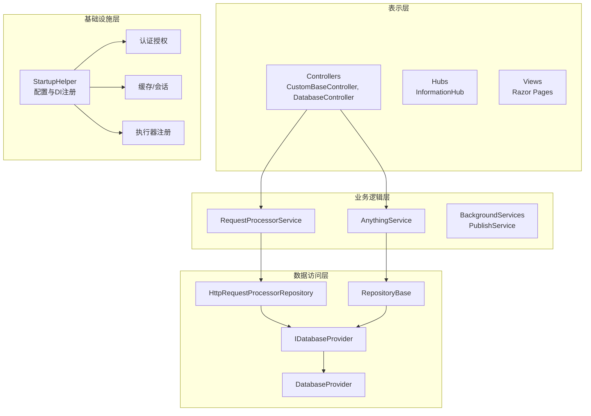
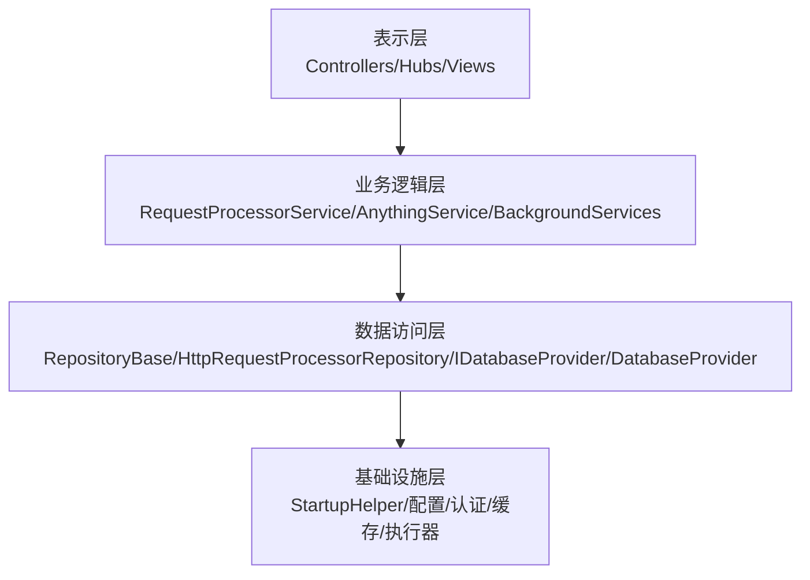
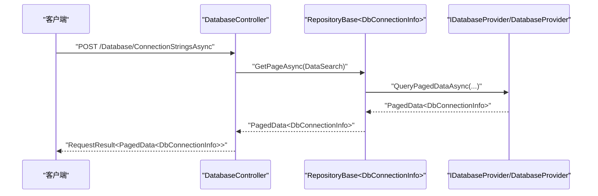
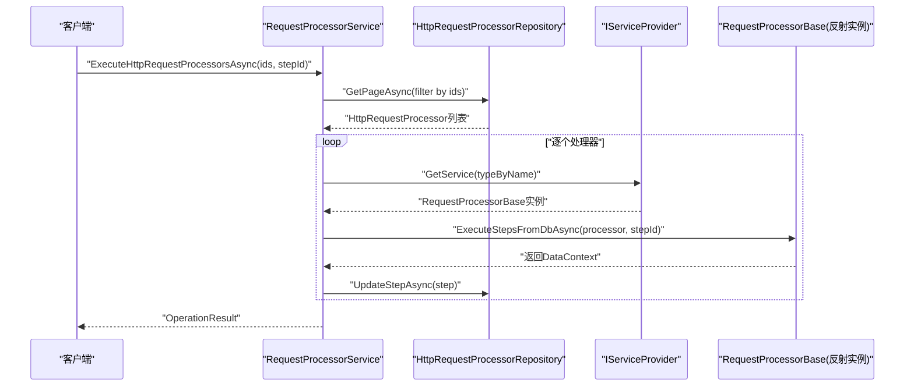
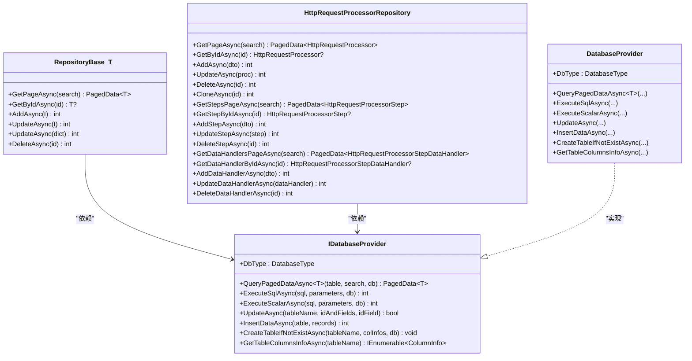
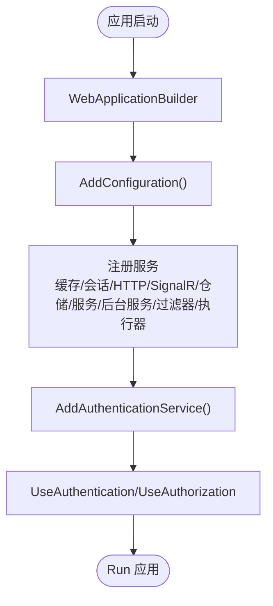
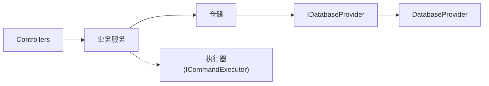

# 分层架构设计

<cite>
**本文档引用的文件**
- [Program.cs](file://Sylas.RemoteTasks.App/Program.cs)
- [StartupHelper.cs](file://Sylas.RemoteTasks.App/Helpers/StartupHelper.cs)
- [CustomBaseController.cs](file://Sylas.RemoteTasks.App/Controllers/CustomBaseController.cs)
- [DatabaseController.cs](file://Sylas.RemoteTasks.App/Controllers/DatabaseController.cs)
- [RepositoryBase.cs](file://Sylas.RemoteTasks.App/Infrastructure/RepositoryBase.cs)
- [HttpRequestProcessorRepository.cs](file://Sylas.RemoteTasks.App/RequestProcessor/HttpRequestProcessorRepository.cs)
- [RequestProcessorService.cs](file://Sylas.RemoteTasks.App/RequestProcessor/RequestProcessorService.cs)
- [AnythingService.cs](file://Sylas.RemoteTasks.App/RemoteHostModule/Anything/AnythingService.cs)
- [PublishService.cs](file://Sylas.RemoteTasks.App/BackgroundServices/PublishService.cs)
- [IDatabaseProvider.cs](file://Sylas.RemoteTasks.Database/IDatabaseProvider.cs)
- [DatabaseProvider.cs](file://Sylas.RemoteTasks.Database/DatabaseProvider.cs)
- [OperationResult.cs](file://Sylas.RemoteTasks.Common/Dtos/OperationResult.cs)
- [appsettings.json](file://Sylas.RemoteTasks.App/appsettings.json)
</cite>

## 目录
1. [引言](#引言)
2. [项目结构](#项目结构)
3. [核心组件](#核心组件)
4. [架构总览](#架构总览)
5. [详细组件分析](#详细组件分析)
6. [依赖分析](#依赖分析)
7. [性能考量](#性能考量)
8. [故障排查指南](#故障排查指南)
9. [结论](#结论)
10. [附录](#附录)

## 引言
本设计文档面向 Sylas.RemoteTasks 的分层架构，系统性阐述表示层、业务逻辑层、数据访问层与基础设施层的职责划分、接口定义、依赖关系与交互机制。重点覆盖依赖注入配置、层间通信方式、数据传递规范、以及保持层独立性与可测试性的最佳实践。

## 项目结构
项目采用多项目解决方案，按领域与关注点分层组织：
- 表示层：ASP.NET Core MVC 控制器、视图与 SignalR Hub
- 业务逻辑层：请求处理器服务、远程主机模块服务、后台服务
- 数据访问层：通用仓储基类、数据库提供者接口与实现
- 基础设施层：配置、认证授权、缓存、执行器注册、工具类

图表来源
- [Program.cs](file://Sylas.RemoteTasks.App/Program.cs#L12-L89)
- [StartupHelper.cs](file://Sylas.RemoteTasks.App/Helpers/StartupHelper.cs#L18-L54)
- [RepositoryBase.cs](file://Sylas.RemoteTasks.App/Infrastructure/RepositoryBase.cs#L10-L12)
- [HttpRequestProcessorRepository.cs](file://Sylas.RemoteTasks.App/RequestProcessor/HttpRequestProcessorRepository.cs#L11-L13)
- [RequestProcessorService.cs](file://Sylas.RemoteTasks.App/RequestProcessor/RequestProcessorService.cs#L7-L9)
- [AnythingService.cs](file://Sylas.RemoteTasks.App/RemoteHostModule/Anything/AnythingService.cs#L30-L38)
- [PublishService.cs](file://Sylas.RemoteTasks.App/BackgroundServices/PublishService.cs#L16-L60)
- [IDatabaseProvider.cs](file://Sylas.RemoteTasks.Database/IDatabaseProvider.cs#L12-L17)
- [DatabaseProvider.cs](file://Sylas.RemoteTasks.Database/DatabaseProvider.cs#L19-L45)

章节来源
- [Program.cs](file://Sylas.RemoteTasks.App/Program.cs#L12-L89)
- [StartupHelper.cs](file://Sylas.RemoteTasks.App/Helpers/StartupHelper.cs#L18-L54)

## 核心组件
- 表示层组件
  - 控制器：封装HTTP请求入口，负责参数校验、调用业务服务、返回统一结果模型
  - Hub：SignalR 实时通信端点
- 业务逻辑层组件
  - 请求处理器服务：动态加载并执行请求处理器步骤，串联数据处理器
  - 任何服务：远程主机模块的业务编排，命令解析与执行
  - 后台服务：发布服务（TCP长连接、心跳、命令下发与结果回传）
- 数据访问层组件
  - 通用仓储：提供分页查询、增删改、动态更新等通用能力
  - 请求处理器仓储：聚合处理器、步骤、数据处理器的CRUD
  - 数据库提供者接口与实现：抽象数据库操作，屏蔽底层差异
- 基础设施层组件
  - 启动辅助：注册配置、缓存、会话、认证授权、执行器、全局热键
  - 配置文件：集中管理运行时参数与策略

章节来源
- [CustomBaseController.cs](file://Sylas.RemoteTasks.App/Controllers/CustomBaseController.cs#L14-L144)
- [DatabaseController.cs](file://Sylas.RemoteTasks.App/Controllers/DatabaseController.cs#L18-L234)
- [RequestProcessorService.cs](file://Sylas.RemoteTasks.App/RequestProcessor/RequestProcessorService.cs#L7-L71)
- [AnythingService.cs](file://Sylas.RemoteTasks.App/RemoteHostModule/Anything/AnythingService.cs#L30-L679)
- [PublishService.cs](file://Sylas.RemoteTasks.App/BackgroundServices/PublishService.cs#L16-L644)
- [RepositoryBase.cs](file://Sylas.RemoteTasks.App/Infrastructure/RepositoryBase.cs#L10-L232)
- [HttpRequestProcessorRepository.cs](file://Sylas.RemoteTasks.App/RequestProcessor/HttpRequestProcessorRepository.cs#L11-L411)
- [IDatabaseProvider.cs](file://Sylas.RemoteTasks.Database/IDatabaseProvider.cs#L12-L98)
- [DatabaseProvider.cs](file://Sylas.RemoteTasks.Database/DatabaseProvider.cs#L19-L484)
- [StartupHelper.cs](file://Sylas.RemoteTasks.App/Helpers/StartupHelper.cs#L18-L274)
- [appsettings.json](file://Sylas.RemoteTasks.App/appsettings.json#L1-L142)

## 架构总览
分层架构遵循“关注点分离”原则，各层职责清晰、边界明确：
- 表示层：仅负责输入输出与路由转发，不承载业务规则
- 业务逻辑层：封装业务流程与编排，协调数据访问与外部集成
- 数据访问层：抽象数据持久化细节，提供统一的CRUD与查询能力
- 基础设施层：提供通用能力（认证、缓存、配置、执行器注册）与运行时环境

图表来源
- [Program.cs](file://Sylas.RemoteTasks.App/Program.cs#L12-L89)
- [StartupHelper.cs](file://Sylas.RemoteTasks.App/Helpers/StartupHelper.cs#L18-L54)
- [RepositoryBase.cs](file://Sylas.RemoteTasks.App/Infrastructure/RepositoryBase.cs#L10-L12)
- [IDatabaseProvider.cs](file://Sylas.RemoteTasks.Database/IDatabaseProvider.cs#L12-L17)
- [DatabaseProvider.cs](file://Sylas.RemoteTasks.Database/DatabaseProvider.cs#L19-L45)

## 详细组件分析

### 表示层：控制器与基础控制器
- 职责
  - 提供HTTP端点，封装业务调用，返回统一结果模型
  - 继承基础控制器，提供文件上传、删除、路径计算等通用能力
- 关键接口
  - 分页查询、新增、更新、删除、备份与还原等API
- 数据传递
  - 输入DTO映射到实体或仓储查询参数
  - 输出统一包装为请求结果模型

图表来源
- [DatabaseController.cs](file://Sylas.RemoteTasks.App/Controllers/DatabaseController.cs#L30-L43)
- [RepositoryBase.cs](file://Sylas.RemoteTasks.App/Infrastructure/RepositoryBase.cs#L20-L25)
- [IDatabaseProvider.cs](file://Sylas.RemoteTasks.Database/IDatabaseProvider.cs#L25-L25)
- [DatabaseProvider.cs](file://Sylas.RemoteTasks.Database/DatabaseProvider.cs#L337-L370)

章节来源
- [CustomBaseController.cs](file://Sylas.RemoteTasks.App/Controllers/CustomBaseController.cs#L14-L144)
- [DatabaseController.cs](file://Sylas.RemoteTasks.App/Controllers/DatabaseController.cs#L18-L234)

### 业务逻辑层：请求处理器与远程主机模块
- 请求处理器服务
  - 职责：按ID批量加载处理器，反射获取实例，按步骤执行，维护DataContext，持久化步骤进度
  - 关键流程：动态反射、步骤执行、上下文传递、步骤更新
- 任何服务（远程主机模块）
  - 职责：Anything配置与命令管理、命令解析、执行器构建、跨节点命令转发、结果收集
  - 关键流程：命令队列、结果异步流、缓存与模板解析、跨节点HTTP转发

图表来源
- [RequestProcessorService.cs](file://Sylas.RemoteTasks.App/RequestProcessor/RequestProcessorService.cs#L11-L69)
- [HttpRequestProcessorRepository.cs](file://Sylas.RemoteTasks.App/RequestProcessor/HttpRequestProcessorRepository.cs#L23-L47)

章节来源
- [RequestProcessorService.cs](file://Sylas.RemoteTasks.App/RequestProcessor/RequestProcessorService.cs#L7-L71)
- [AnythingService.cs](file://Sylas.RemoteTasks.App/RemoteHostModule/Anything/AnythingService.cs#L294-L389)

### 数据访问层：仓储与数据库提供者
- 通用仓储
  - 职责：提供分页查询、按ID查询、新增、更新、动态更新、删除等通用能力
  - 特性：支持多种数据库类型，自动拼接SQL与参数，支持最后插入ID查询
- 请求处理器仓储
  - 职责：聚合处理器、步骤、数据处理器的CRUD，支持级联删除与克隆
- 数据库提供者接口与实现
  - 职责：抽象数据库操作（查询、执行、分页、列信息），实现中屏蔽数据库差异

图表来源
- [RepositoryBase.cs](file://Sylas.RemoteTasks.App/Infrastructure/RepositoryBase.cs#L10-L194)
- [HttpRequestProcessorRepository.cs](file://Sylas.RemoteTasks.App/RequestProcessor/HttpRequestProcessorRepository.cs#L11-L411)
- [IDatabaseProvider.cs](file://Sylas.RemoteTasks.Database/IDatabaseProvider.cs#L12-L98)
- [DatabaseProvider.cs](file://Sylas.RemoteTasks.Database/DatabaseProvider.cs#L19-L484)

章节来源
- [RepositoryBase.cs](file://Sylas.RemoteTasks.App/Infrastructure/RepositoryBase.cs#L10-L232)
- [HttpRequestProcessorRepository.cs](file://Sylas.RemoteTasks.App/RequestProcessor/HttpRequestProcessorRepository.cs#L11-L411)
- [IDatabaseProvider.cs](file://Sylas.RemoteTasks.Database/IDatabaseProvider.cs#L12-L98)
- [DatabaseProvider.cs](file://Sylas.RemoteTasks.Database/DatabaseProvider.cs#L19-L484)

### 基础设施层：依赖注入与配置
- 依赖注入
  - 控制器与服务注册：控制器、SignalR、缓存、HTTP客户端、仓储、服务、后台服务、过滤器、执行器
  - 启动辅助：注册配置文件、缓存、会话、数据库工具、认证授权、执行器扫描、全局热键
- 配置
  - appsettings.json：日志、上传、AI配置、Kestrel、请求流水线、身份认证、邮件等

图表来源
- [Program.cs](file://Sylas.RemoteTasks.App/Program.cs#L12-L89)
- [StartupHelper.cs](file://Sylas.RemoteTasks.App/Helpers/StartupHelper.cs#L20-L99)
- [appsettings.json](file://Sylas.RemoteTasks.App/appsettings.json#L1-L142)

章节来源
- [Program.cs](file://Sylas.RemoteTasks.App/Program.cs#L12-L89)
- [StartupHelper.cs](file://Sylas.RemoteTasks.App/Helpers/StartupHelper.cs#L18-L274)
- [appsettings.json](file://Sylas.RemoteTasks.App/appsettings.json#L1-L142)

## 依赖分析
- 层内依赖
  - 表示层仅依赖业务逻辑层；业务逻辑层依赖数据访问层；数据访问层依赖基础设施层
- 层间依赖
  - 控制器 → 业务服务：通过构造函数注入
  - 业务服务 → 仓储/数据库提供者：通过构造函数注入
  - 仓储 → 数据库提供者：通过构造函数注入
- 循环依赖
  - 未发现直接循环依赖；业务服务通过反射获取处理器实例，避免强耦合

图表来源
- [Program.cs](file://Sylas.RemoteTasks.App/Program.cs#L44-L68)
- [StartupHelper.cs](file://Sylas.RemoteTasks.App/Helpers/StartupHelper.cs#L88-L99)
- [RepositoryBase.cs](file://Sylas.RemoteTasks.App/Infrastructure/RepositoryBase.cs#L10-L12)
- [IDatabaseProvider.cs](file://Sylas.RemoteTasks.Database/IDatabaseProvider.cs#L12-L17)
- [DatabaseProvider.cs](file://Sylas.RemoteTasks.Database/DatabaseProvider.cs#L19-L45)

章节来源
- [Program.cs](file://Sylas.RemoteTasks.App/Program.cs#L44-L68)
- [StartupHelper.cs](file://Sylas.RemoteTasks.App/Helpers/StartupHelper.cs#L88-L99)

## 性能考量
- 仓储与数据库
  - 通用仓储针对不同数据库类型分别拼接最后插入ID查询语句，减少额外查询
  - 分页查询与条件参数化，降低SQL注入风险并提升查询效率
- 缓存与会话
  - 内存缓存用于Anything信息与执行器元数据，降低重复解析成本
  - Session用于用户状态管理，合理设置超时时间
- 异步与流式
  - 业务服务返回异步可枚举结果，支持流式命令执行与实时反馈
- 线程与并发
  - 后台服务使用并发字典管理子节点连接，注意线程安全与资源释放

## 故障排查指南
- 统一结果模型
  - 使用操作结果模型封装成功/失败与消息，便于前端统一处理
- 异常处理
  - 全局异常中间件返回标准操作结果，避免敏感信息泄露
- 日志与监控
  - 控制器与服务中记录关键事件与错误，结合配置文件调整日志级别
- 配置校验
  - 启动时读取应用状态与配置，缺失关键配置（如中心服务器地址）立即抛出异常

章节来源
- [OperationResult.cs](file://Sylas.RemoteTasks.Common/Dtos/OperationResult.cs#L8-L50)
- [Program.cs](file://Sylas.RemoteTasks.App/Program.cs#L99-L99)
- [StartupHelper.cs](file://Sylas.RemoteTasks.App/Helpers/StartupHelper.cs#L56-L75)

## 结论
该分层架构通过清晰的职责划分与依赖注入，实现了表示层、业务逻辑层、数据访问层与基础设施层的解耦。统一的结果模型、异步流式处理与缓存策略提升了系统的可扩展性与可维护性。建议持续优化数据库访问性能、完善单元测试覆盖，并加强跨节点通信的可观测性与容错能力。

## 附录
- 依赖注入最佳实践
  - 优先使用构造函数注入，避免使用全局服务定位器
  - 服务生命周期选择：控制器与中间件使用瞬时，仓储使用作用域，提供者与工具类使用单例
- 层独立性与可测试性
  - 通过接口隔离（如IDatabaseProvider）与依赖注入，便于替换实现与编写单元测试
  - 控制器尽量薄化，业务逻辑集中在服务层，提高可测试性