# 布局导航系统更新

<cite>
**本文档引用的文件**
- [Program.cs](file://Sylas.RemoteTasks.App/Program.cs)
- [_Layout.cshtml](file://Sylas.RemoteTasks.App/Views/Shared/_Layout.cshtml)
- [site.css](file://Sylas.RemoteTasks.App/wwwroot/css/site.css)
- [HomeController.cs](file://Sylas.RemoteTasks.App/Controllers/HomeController.cs)
- [HostsController.cs](file://Sylas.RemoteTasks.App/Controllers/HostsController.cs)
- [DatabaseController.cs](file://Sylas.RemoteTasks.App/Controllers/DatabaseController.cs)
- [Index.cshtml](file://Sylas.RemoteTasks.App/Views/Home/Index.cshtml)
- [Index.cshtml](file://Sylas.RemoteTasks.App/Views/Hosts/Index.cshtml)
- [Index.cshtml](file://Sylas.RemoteTasks.App/Views/Database/Index.cshtml)
- [appsettings.json](file://Sylas.RemoteTasks.App/appsettings.json)
</cite>

## 目录
1. [简介](#简介)
2. [项目结构](#项目结构)
3. [核心组件](#核心组件)
4. [架构概览](#架构概览)
5. [详细组件分析](#详细组件分析)
6. [依赖关系分析](#依赖关系分析)
7. [性能考虑](#性能考虑)
8. [故障排除指南](#故障排除指南)
9. [结论](#结论)

## 简介

本文档详细分析了Sylas.RemoteTasks应用程序的布局导航系统更新。该项目是一个基于ASP.NET Core的远程任务管理系统，具有现代化的前端界面和丰富的功能模块。本次更新重点改进了布局导航系统，包括响应式设计、主题切换、菜单折叠功能和用户体验优化。

系统采用MVC架构模式，结合Bootstrap框架实现响应式布局，支持暗黑模式和亮色模式两种主题切换。导航系统包含顶部主导航菜单和左侧侧边栏菜单，支持动态加载内容和实时状态更新。

## 项目结构

项目采用标准的ASP.NET Core MVC项目结构，主要分为以下几个核心部分：

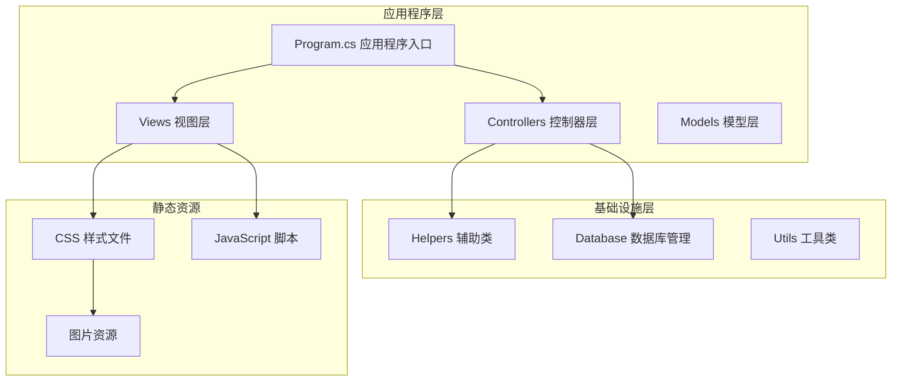

**图表来源**
- [Program.cs](file://Sylas.RemoteTasks.App/Program.cs#L1-L122)
- [_Layout.cshtml](file://Sylas.RemoteTasks.App/Views/Shared/_Layout.cshtml#L1-L842)

**章节来源**
- [Program.cs](file://Sylas.RemoteTasks.App/Program.cs#L1-L122)
- [appsettings.json](file://Sylas.RemoteTasks.App/appsettings.json#L1-L142)

## 核心组件

### 布局系统架构

布局系统采用双层结构设计，包含顶部主导航和左侧侧边栏导航：

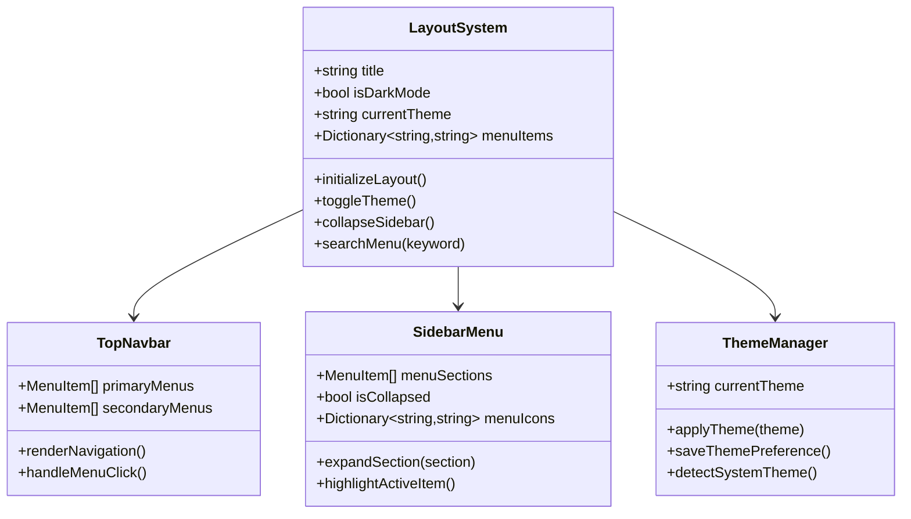

**图表来源**
- [_Layout.cshtml](file://Sylas.RemoteTasks.App/Views/Shared/_Layout.cshtml#L196-L821)
- [site.css](file://Sylas.RemoteTasks.App/wwwroot/css/site.css#L52-L95)

### 导航菜单系统

系统提供多层次的导航菜单结构，支持动态内容加载和状态管理：

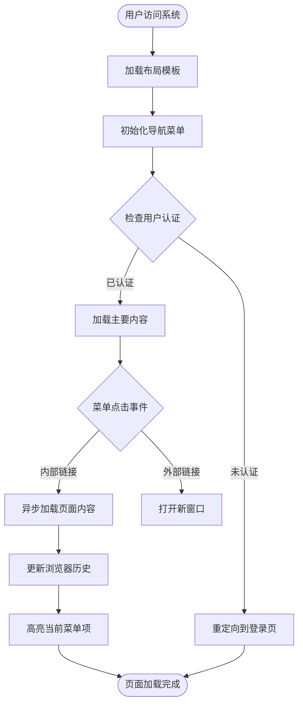

**图表来源**
- [_Layout.cshtml](file://Sylas.RemoteTasks.App/Views/Shared/_Layout.cshtml#L669-L750)

**章节来源**
- [_Layout.cshtml](file://Sylas.RemoteTasks.App/Views/Shared/_Layout.cshtml#L1-L842)
- [site.css](file://Sylas.RemoteTasks.App/wwwroot/css/site.css#L1-L178)

## 架构概览

### 整体架构设计

系统采用分层架构设计，确保各层职责清晰分离：

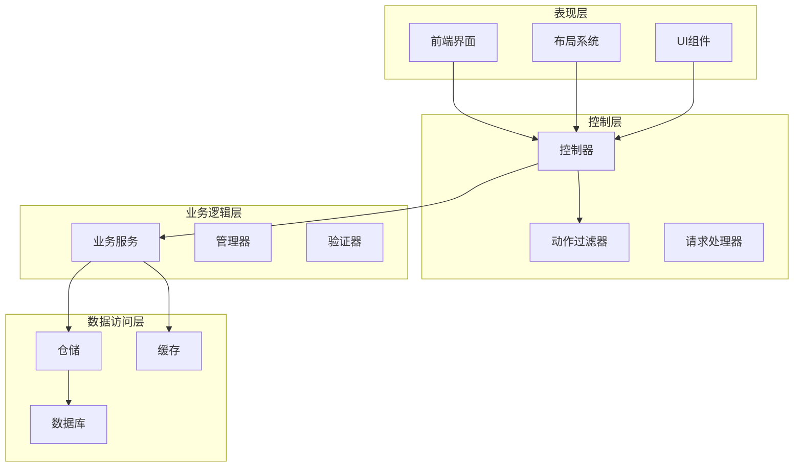

**图表来源**
- [Program.cs](file://Sylas.RemoteTasks.App/Program.cs#L74-L87)

### 响应式设计实现

系统采用Bootstrap框架实现响应式设计，支持多种设备屏幕：

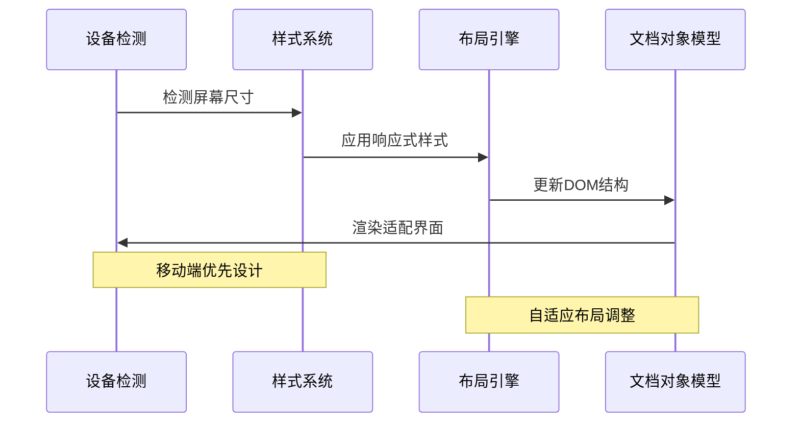

**图表来源**
- [site.css](file://Sylas.RemoteTasks.App/wwwroot/css/site.css#L19-L23)

**章节来源**
- [Program.cs](file://Sylas.RemoteTasks.App/Program.cs#L1-L122)
- [site.css](file://Sylas.RemoteTasks.App/wwwroot/css/site.css#L1-L178)

## 详细组件分析

### 布局模板系统

布局模板系统是整个导航系统的核心，负责整体页面结构和样式管理：

#### 主布局结构

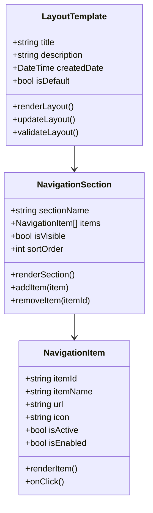

**图表来源**
- [_Layout.cshtml](file://Sylas.RemoteTasks.App/Views/Shared/_Layout.cshtml#L210-L408)

#### 主题管理系统

系统支持两种主题模式的无缝切换：

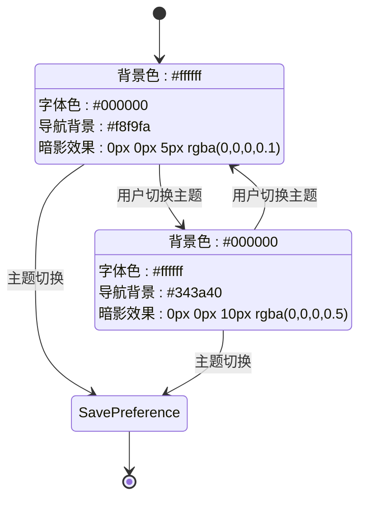

**图表来源**
- [_Layout.cshtml](file://Sylas.RemoteTasks.App/Views/Shared/_Layout.cshtml#L822-L821)

**章节来源**
- [_Layout.cshtml](file://Sylas.RemoteTasks.App/Views/Shared/_Layout.cshtml#L1-L842)

### 导航菜单系统

#### 顶级导航菜单

系统提供多层次的导航菜单结构，支持动态内容加载：

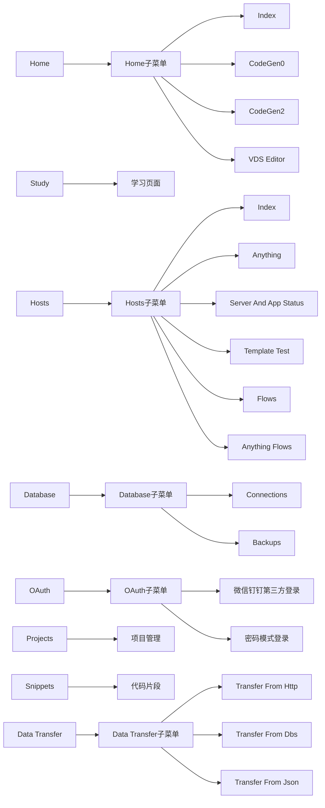

**图表来源**
- [_Layout.cshtml](file://Sylas.RemoteTasks.App/Views/Shared/_Layout.cshtml#L112-L171)

#### 侧边栏菜单系统

侧边栏菜单支持折叠展开功能，提供更好的空间利用：

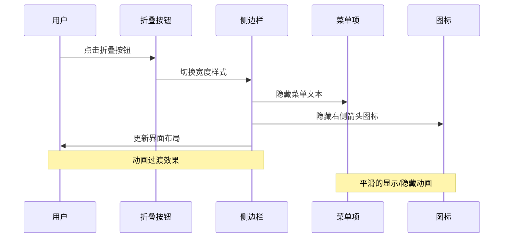

**图表来源**
- [_Layout.cshtml](file://Sylas.RemoteTasks.App/Views/Shared/_Layout.cshtml#L806-L821)

**章节来源**
- [_Layout.cshtml](file://Sylas.RemoteTasks.App/Views/Shared/_Layout.cshtml#L196-L821)

### JavaScript交互系统

#### 页面加载和内容管理

系统采用异步加载机制，提升用户体验：

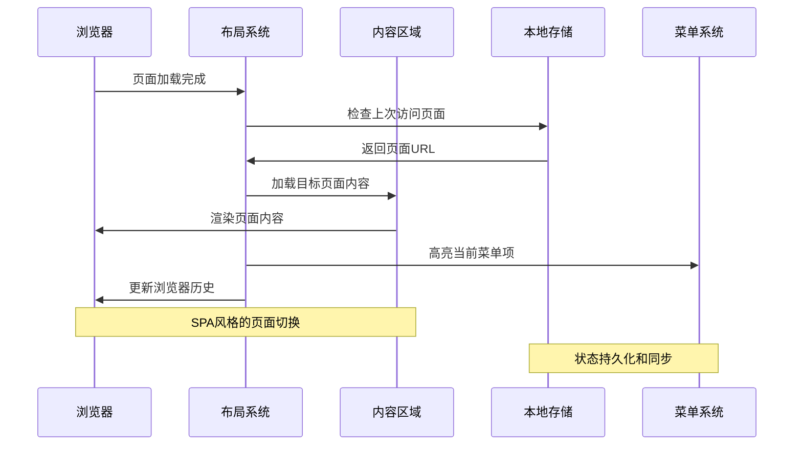

**图表来源**
- [_Layout.cshtml](file://Sylas.RemoteTasks.App/Views/Shared/_Layout.cshtml#L666-L750)

#### 搜索和过滤功能

系统提供强大的菜单搜索功能：

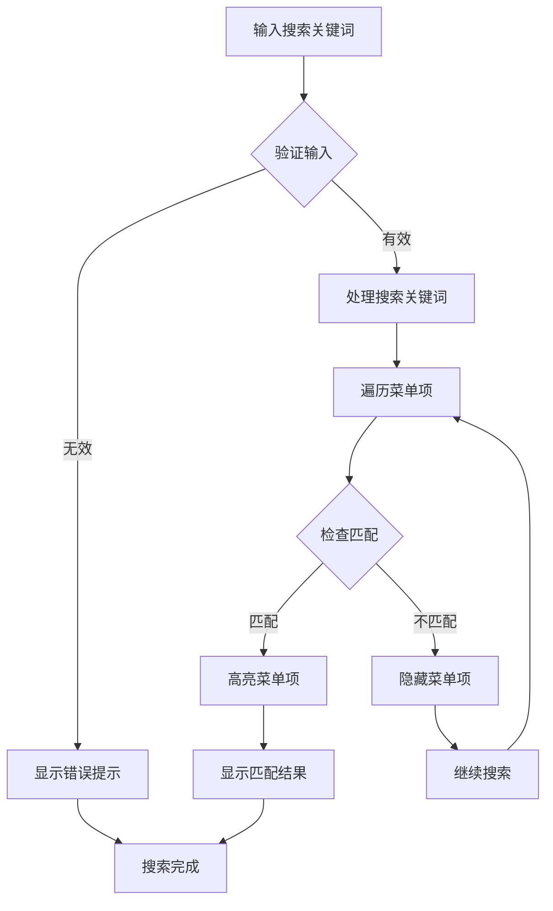

**图表来源**
- [_Layout.cshtml](file://Sylas.RemoteTasks.App/Views/Shared/_Layout.cshtml#L767-L804)

**章节来源**
- [_Layout.cshtml](file://Sylas.RemoteTasks.App/Views/Shared/_Layout.cshtml#L626-L804)

### 控制器集成

#### 主控制器架构

系统控制器采用统一的基类设计，提供一致的接口：

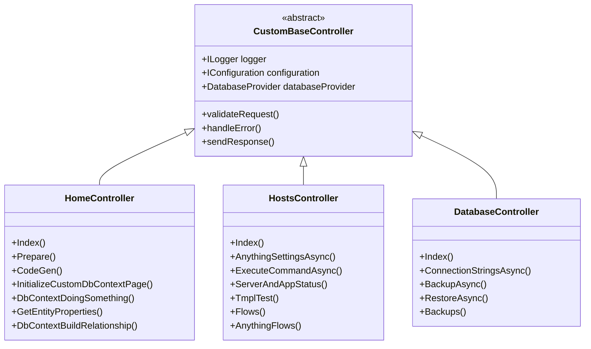

**图表来源**
- [HomeController.cs](file://Sylas.RemoteTasks.App/Controllers/HomeController.cs#L24-L51)
- [HostsController.cs](file://Sylas.RemoteTasks.App/Controllers/HostsController.cs#L17-L22)
- [DatabaseController.cs](file://Sylas.RemoteTasks.App/Controllers/DatabaseController.cs#L14-L19)

**章节来源**
- [HomeController.cs](file://Sylas.RemoteTasks.App/Controllers/HomeController.cs#L1-L975)
- [HostsController.cs](file://Sylas.RemoteTasks.App/Controllers/HostsController.cs#L1-L468)
- [DatabaseController.cs](file://Sylas.RemoteTasks.App/Controllers/DatabaseController.cs#L1-L235)

## 依赖关系分析

### 服务依赖图

系统采用依赖注入模式，确保松耦合设计：

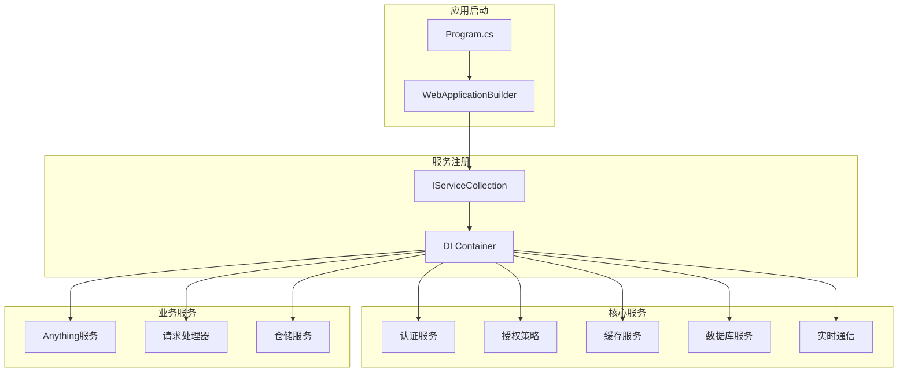

**图表来源**
- [Program.cs](file://Sylas.RemoteTasks.App/Program.cs#L25-L68)

### 配置依赖关系

系统配置采用层次化管理模式：

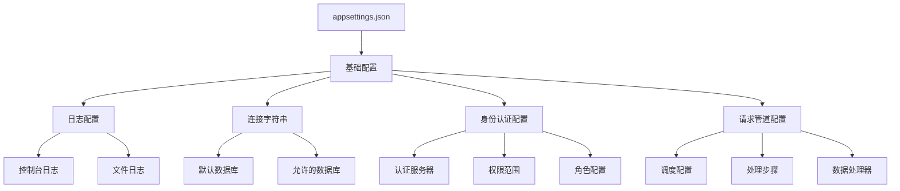

**图表来源**
- [appsettings.json](file://Sylas.RemoteTasks.App/appsettings.json#L1-L142)

**章节来源**
- [Program.cs](file://Sylas.RemoteTasks.App/Program.cs#L1-L122)
- [appsettings.json](file://Sylas.RemoteTasks.App/appsettings.json#L1-L142)

## 性能考虑

### 响应式性能优化

系统在性能方面采用了多项优化措施：

1. **懒加载机制**：菜单项采用延迟加载，减少初始页面大小
2. **缓存策略**：使用内存缓存存储常用数据，减少数据库查询
3. **异步处理**：所有页面内容采用异步加载，提升用户体验
4. **资源压缩**：CSS和JavaScript文件经过压缩优化

### 内存管理

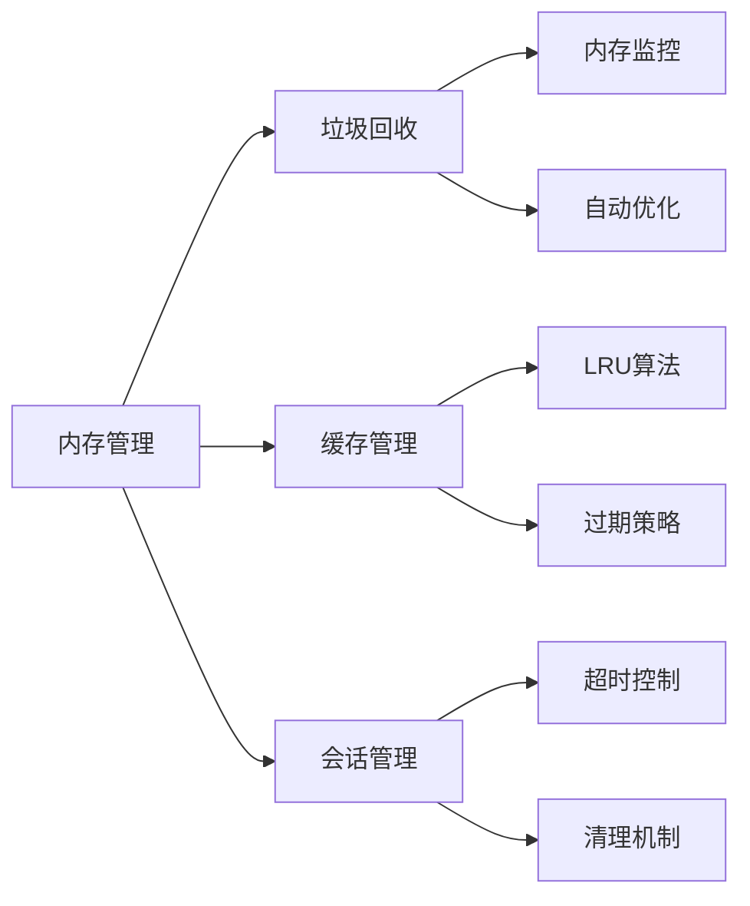

## 故障排除指南

### 常见问题诊断

#### 布局加载问题

**症状**：页面布局错乱或样式丢失

**解决方案**：
1. 检查CSS文件加载状态
2. 验证Bootstrap框架版本兼容性
3. 确认响应式断点设置正确

#### 菜单交互问题

**症状**：菜单无法展开或折叠

**解决方案**：
1. 检查JavaScript文件加载
2. 验证事件监听器绑定
3. 确认CSS过渡动画正常

#### 主题切换问题

**症状**：主题切换后样式不生效

**解决方案**：
1. 检查localStorage存储状态
2. 验证CSS类名切换逻辑
3. 确认主题样式文件完整性

**章节来源**
- [_Layout.cshtml](file://Sylas.RemoteTasks.App/Views/Shared/_Layout.cshtml#L1-L842)

## 结论

Sylas.RemoteTasks的布局导航系统更新展现了现代Web应用开发的最佳实践。系统通过精心设计的架构、响应式布局和丰富的交互功能，为用户提供了优秀的使用体验。

主要成就包括：
- **完整的响应式设计**：支持多种设备和屏幕尺寸
- **灵活的主题系统**：暗黑模式和亮色模式无缝切换
- **高效的导航系统**：多层次菜单和智能搜索功能
- **现代化的技术栈**：基于ASP.NET Core和Bootstrap框架
- **良好的性能表现**：异步加载和缓存优化

未来可以考虑的功能增强：
- 更丰富的主题选项
- 更精细的权限控制
- 更完善的移动端体验
- 更强大的搜索和过滤功能