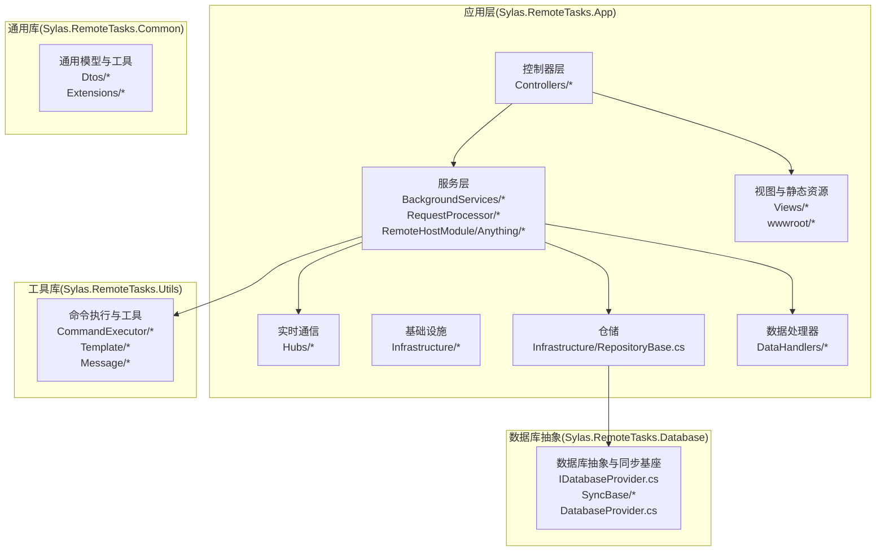
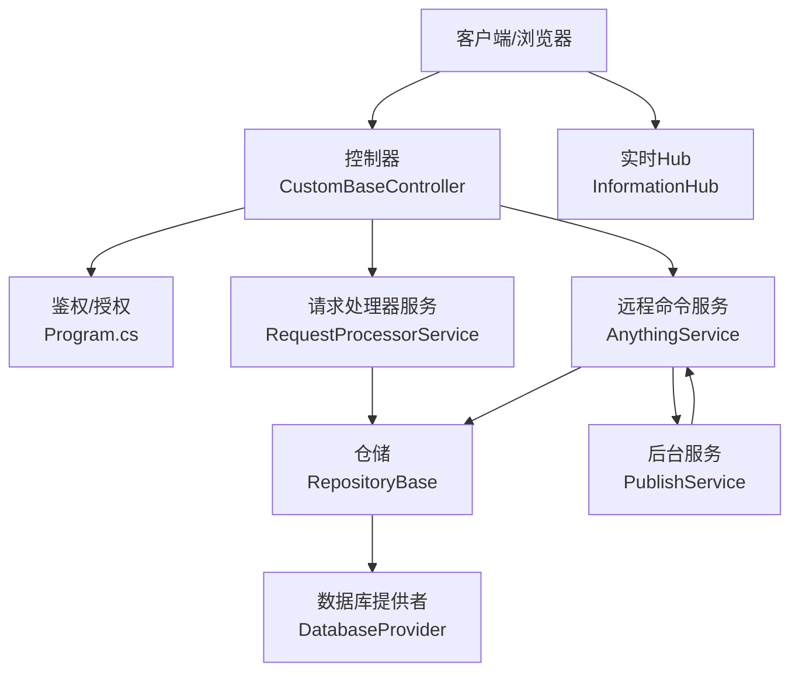
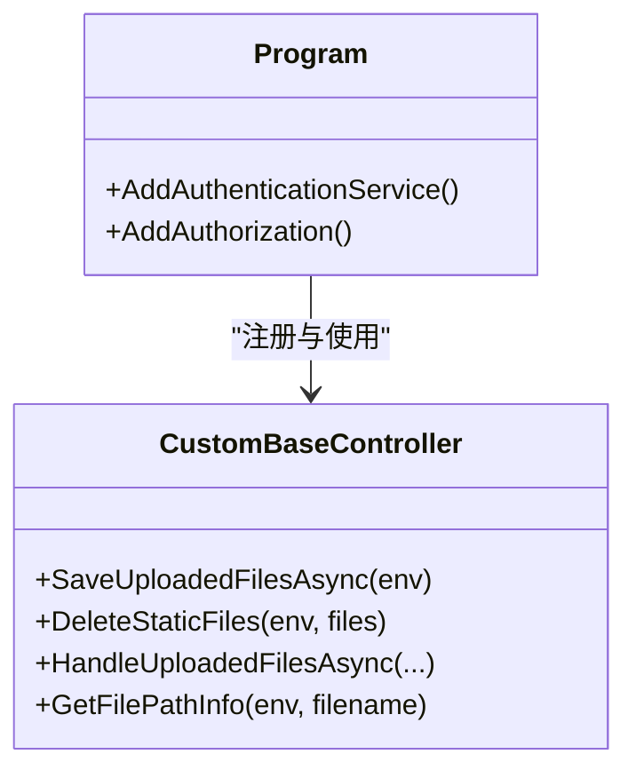
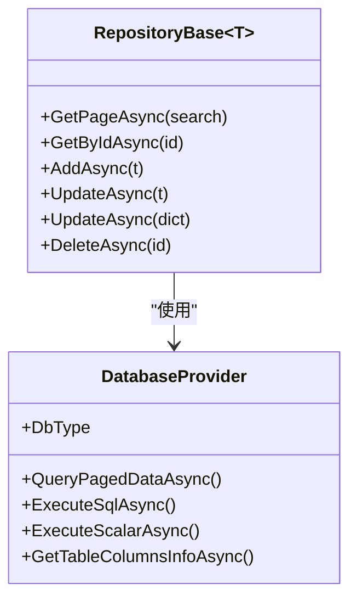
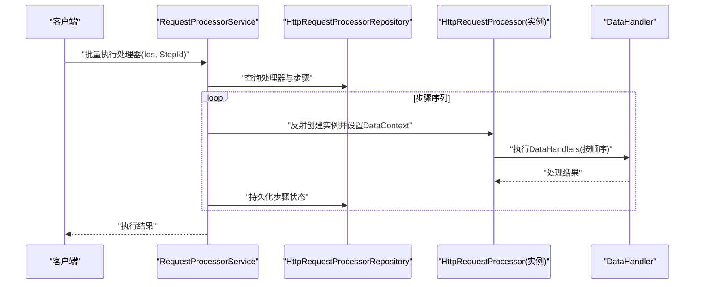
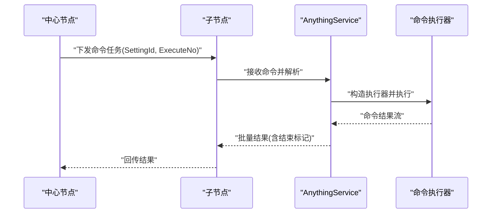
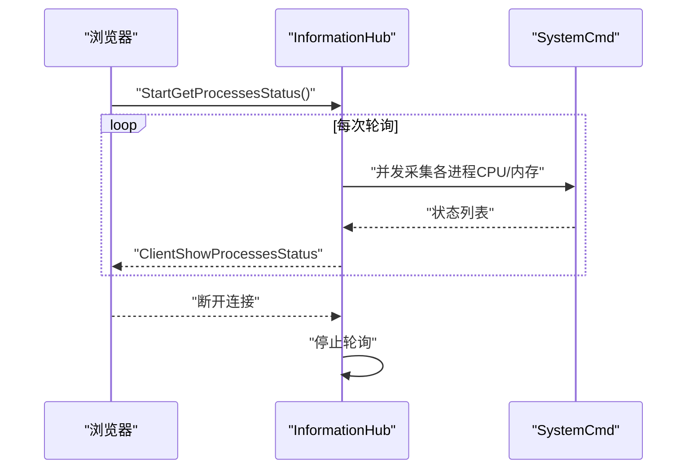
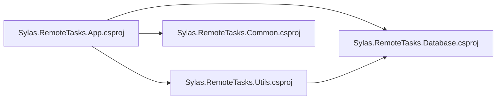

# 整体架构设计

<cite>
**本文引用的文件**
- [Program.cs](file://Sylas.RemoteTasks.App/Program.cs)
- [appsettings.json](file://Sylas.RemoteTasks.App/appsettings.json)
- [Sylas.RemoteTasks.App.csproj](file://Sylas.RemoteTasks.App/Sylas.RemoteTasks.App.csproj)
- [README.md](file://README.md)
- [Sylas.RemoteTasks.Common.csproj](file://Sylas.RemoteTasks.Common/Sylas.RemoteTasks.Common.csproj)
- [Sylas.RemoteTasks.Database.csproj](file://Sylas.RemoteTasks.Database/Sylas.RemoteTasks.Database.csproj)
- [Sylas.RemoteTasks.Utils.csproj](file://Sylas.RemoteTasks.Utils/Sylas.RemoteTasks.Utils.csproj)
- [CustomBaseController.cs](file://Sylas.RemoteTasks.App/Controllers/CustomBaseController.cs)
- [RepositoryBase.cs](file://Sylas.RemoteTasks.App/Infrastructure/RepositoryBase.cs)
- [RequestProcessorService.cs](file://Sylas.RemoteTasks.App/RequestProcessor/RequestProcessorService.cs)
- [DataHandler.cs](file://Sylas.RemoteTasks.App/DataHandlers/DataHandler.cs)
- [AnythingService.cs](file://Sylas.RemoteTasks.App/RemoteHostModule/Anything/AnythingService.cs)
- [DatabaseProvider.cs](file://Sylas.RemoteTasks.Database/DatabaseProvider.cs)
- [DotNETOperation.cs](file://Sylas.RemoteTasks.App/Infrastructure/DotNETOperation.cs)
- [PublishService.cs](file://Sylas.RemoteTasks.App/BackgroundServices/PublishService.cs)
- [InformationHub.cs](file://Sylas.RemoteTasks.App/Hubs/InformationHub.cs)
- [HttpRequestProcessor.cs](file://Sylas.RemoteTasks.App/RequestProcessor/Models/HttpRequestProcessor.cs)
- [HttpRequestProcessorStep.cs](file://Sylas.RemoteTasks.App/RequestProcessor/Models/HttpRequestProcessorStep.cs)
</cite>

## 目录
1. [引言](#引言)
2. [项目结构](#项目结构)
3. [核心组件](#核心组件)
4. [架构总览](#架构总览)
5. [详细组件分析](#详细组件分析)
6. [依赖分析](#依赖分析)
7. [性能考虑](#性能考虑)
8. [故障排查指南](#故障排查指南)
9. [结论](#结论)
10. [附录](#附录)

## 引言
本文件面向 Sylas.RemoteTasks 的整体架构设计，系统采用 ASP.NET Core 技术栈构建，围绕“远程任务编排 + 数据同步 + 命令执行 + 实时通信”的目标，形成以控制器（Controller）为入口、以服务（Service）为核心、以仓储（Repository）为数据访问抽象、以后台服务（BackgroundService）为分布式任务调度的分层架构。系统同时具备微服务化的节点发现与任务下发能力，通过 TCP 长连接与 SignalR 实现实时通信，并通过配置驱动的请求处理器（RequestProcessor）实现可扩展的数据处理流水线。

## 项目结构
项目采用多项目解决方案组织，按职责划分为应用层、通用库、数据库抽象层与工具库四层，配合后台服务与实时 Hub，形成清晰的分层与模块边界。

**图表来源**
- [Program.cs](file://Sylas.RemoteTasks.App/Program.cs#L1-L122)
- [Sylas.RemoteTasks.App.csproj](file://Sylas.RemoteTasks.App/Sylas.RemoteTasks.App.csproj#L1-L61)
- [Sylas.RemoteTasks.Common.csproj](file://Sylas.RemoteTasks.Common/Sylas.RemoteTasks.Common.csproj#L1-L16)
- [Sylas.RemoteTasks.Database.csproj](file://Sylas.RemoteTasks.Database/Sylas.RemoteTasks.Database.csproj#L1-L52)
- [Sylas.RemoteTasks.Utils.csproj](file://Sylas.RemoteTasks.Utils/Sylas.RemoteTasks.Utils.csproj#L1-L47)

**章节来源**
- [Program.cs](file://Sylas.RemoteTasks.App/Program.cs#L1-L122)
- [Sylas.RemoteTasks.App.csproj](file://Sylas.RemoteTasks.App/Sylas.RemoteTasks.App.csproj#L1-L61)
- [Sylas.RemoteTasks.Common.csproj](file://Sylas.RemoteTasks.Common/Sylas.RemoteTasks.Common.csproj#L1-L16)
- [Sylas.RemoteTasks.Database.csproj](file://Sylas.RemoteTasks.Database/Sylas.RemoteTasks.Database.csproj#L1-L52)
- [Sylas.RemoteTasks.Utils.csproj](file://Sylas.RemoteTasks.Utils/Sylas.RemoteTasks.Utils.csproj#L1-L47)

## 核心组件
- 控制器层：统一鉴权策略与参数过滤，负责对外接口与视图渲染。
- 服务层：封装业务流程，包括请求处理器执行、远程命令执行、后台任务调度与实时监控。
- 仓储层：基于泛型仓储抽象数据库访问，屏蔽具体数据库差异。
- 数据处理器：面向请求处理器步骤的数据处理插件化组件。
- 数据库抽象层：统一数据库提供者与同步基座，支持多数据库类型。
- 工具库：命令执行器、模板解析、HTTP/SSH/邮件等工具。
- 实时通信：SignalR Hub 提供进程状态推送。
- 后台服务：TCP 长连接与心跳机制，实现中心节点与子节点的任务编排与结果回传。

**章节来源**
- [CustomBaseController.cs](file://Sylas.RemoteTasks.App/Controllers/CustomBaseController.cs#L1-L145)
- [RepositoryBase.cs](file://Sylas.RemoteTasks.App/Infrastructure/RepositoryBase.cs#L1-L233)
- [RequestProcessorService.cs](file://Sylas.RemoteTasks.App/RequestProcessor/RequestProcessorService.cs#L1-L72)
- [AnythingService.cs](file://Sylas.RemoteTasks.App/RemoteHostModule/Anything/AnythingService.cs#L1-L680)
- [DatabaseProvider.cs](file://Sylas.RemoteTasks.Database/DatabaseProvider.cs#L1-L485)
- [InformationHub.cs](file://Sylas.RemoteTasks.App/Hubs/InformationHub.cs#L1-L59)
- [PublishService.cs](file://Sylas.RemoteTasks.App/BackgroundServices/PublishService.cs#L1-L645)

## 架构总览
系统采用“MVC + 分层 + 微服务节点”混合架构：
- MVC：控制器负责路由与视图，配合全局过滤器与鉴权策略。
- 分层：应用层（控制器/服务）、数据访问层（仓储/数据库抽象）、工具层（命令执行/模板/消息）。
- 微服务：通过后台服务建立 TCP 长连接，中心节点与子节点通过队列与心跳协作，实现任务编排与结果回传。

**图表来源**
- [Program.cs](file://Sylas.RemoteTasks.App/Program.cs#L74-L87)
- [RequestProcessorService.cs](file://Sylas.RemoteTasks.App/RequestProcessor/RequestProcessorService.cs#L1-L72)
- [AnythingService.cs](file://Sylas.RemoteTasks.App/RemoteHostModule/Anything/AnythingService.cs#L1-L680)
- [RepositoryBase.cs](file://Sylas.RemoteTasks.App/Infrastructure/RepositoryBase.cs#L1-L233)
- [DatabaseProvider.cs](file://Sylas.RemoteTasks.Database/DatabaseProvider.cs#L1-L485)
- [PublishService.cs](file://Sylas.RemoteTasks.App/BackgroundServices/PublishService.cs#L1-L645)
- [InformationHub.cs](file://Sylas.RemoteTasks.App/Hubs/InformationHub.cs#L1-L59)

## 详细组件分析

### 控制器与鉴权
- 控制器继承统一基类，应用管理端策略与参数过滤，支持文件上传与删除。
- 鉴权策略通过 OIDC/JWT 与角色范围校验，授权策略限定管理员角色与 API 范围。

**图表来源**
- [CustomBaseController.cs](file://Sylas.RemoteTasks.App/Controllers/CustomBaseController.cs#L1-L145)
- [Program.cs](file://Sylas.RemoteTasks.App/Program.cs#L74-L87)

**章节来源**
- [CustomBaseController.cs](file://Sylas.RemoteTasks.App/Controllers/CustomBaseController.cs#L1-L145)
- [Program.cs](file://Sylas.RemoteTasks.App/Program.cs#L74-L87)

### 仓储与数据库抽象
- 泛型仓储提供分页查询、增删改、局部更新等能力，自动适配不同数据库类型的自增/返回值语法。
- 数据库提供者封装连接字符串、参数绑定、分页 SQL 生成与执行，支持多数据库类型。

**图表来源**
- [RepositoryBase.cs](file://Sylas.RemoteTasks.App/Infrastructure/RepositoryBase.cs#L1-L233)
- [DatabaseProvider.cs](file://Sylas.RemoteTasks.Database/DatabaseProvider.cs#L1-L485)

**章节来源**
- [RepositoryBase.cs](file://Sylas.RemoteTasks.App/Infrastructure/RepositoryBase.cs#L1-L233)
- [DatabaseProvider.cs](file://Sylas.RemoteTasks.Database/DatabaseProvider.cs#L1-L485)

### 请求处理器与数据处理器
- 请求处理器定义可配置的步骤序列，每步可配置参数、请求体、上下文构建器与数据处理器。
- 请求处理器服务按顺序执行处理器实例，支持步骤断点与上下文持久化。

**图表来源**
- [RequestProcessorService.cs](file://Sylas.RemoteTasks.App/RequestProcessor/RequestProcessorService.cs#L1-L72)
- [HttpRequestProcessor.cs](file://Sylas.RemoteTasks.App/RequestProcessor/Models/HttpRequestProcessor.cs#L1-L22)
- [HttpRequestProcessorStep.cs](file://Sylas.RemoteTasks.App/RequestProcessor/Models/HttpRequestProcessorStep.cs#L1-L19)
- [DataHandler.cs](file://Sylas.RemoteTasks.App/DataHandlers/DataHandler.cs#L1-L16)

**章节来源**
- [RequestProcessorService.cs](file://Sylas.RemoteTasks.App/RequestProcessor/RequestProcessorService.cs#L1-L72)
- [HttpRequestProcessor.cs](file://Sylas.RemoteTasks.App/RequestProcessor/Models/HttpRequestProcessor.cs#L1-L22)
- [HttpRequestProcessorStep.cs](file://Sylas.RemoteTasks.App/RequestProcessor/Models/HttpRequestProcessorStep.cs#L1-L19)
- [DataHandler.cs](file://Sylas.RemoteTasks.App/DataHandlers/DataHandler.cs#L1-L16)

### 远程命令执行与微服务节点
- 任何服务封装命令配置、执行器解析与模板变量替换，支持跨域/跨节点执行。
- 中心节点通过 TCP 队列下发命令，子节点通过长连接接收并回传结果；支持心跳保活与断线重连。

**图表来源**
- [PublishService.cs](file://Sylas.RemoteTasks.App/BackgroundServices/PublishService.cs#L1-L645)
- [AnythingService.cs](file://Sylas.RemoteTasks.App/RemoteHostModule/Anything/AnythingService.cs#L1-L680)

**章节来源**
- [PublishService.cs](file://Sylas.RemoteTasks.App/BackgroundServices/PublishService.cs#L1-L645)
- [AnythingService.cs](file://Sylas.RemoteTasks.App/RemoteHostModule/Anything/AnythingService.cs#L1-L680)

### 实时通信与进程监控
- 通过 SignalR Hub 推送进程状态，支持多进程并发采集与去重排序。
- 配置项控制监控进程列表，断开连接自动停止轮询。

**图表来源**
- [InformationHub.cs](file://Sylas.RemoteTasks.App/Hubs/InformationHub.cs#L1-L59)

**章节来源**
- [InformationHub.cs](file://Sylas.RemoteTasks.App/Hubs/InformationHub.cs#L1-L59)

### 基础设施与代码生成
- 基础设施提供命名复数/单数转换、DbContext 代码生成与 EF 关系映射注入辅助。
- 与工具库结合，支持模板解析与命令执行器动态创建。

**章节来源**
- [DotNETOperation.cs](file://Sylas.RemoteTasks.App/Infrastructure/DotNETOperation.cs#L1-L237)

## 依赖分析
- 应用层依赖工具库与数据库抽象层，通过仓储与数据库提供者解耦具体实现。
- 服务层依赖仓储、配置与工具库，后台服务依赖系统 Socket 与命令执行器。
- 控制器依赖服务层与视图层，统一受鉴权策略约束。

**图表来源**
- [Sylas.RemoteTasks.App.csproj](file://Sylas.RemoteTasks.App/Sylas.RemoteTasks.App.csproj#L43-L44)
- [Sylas.RemoteTasks.Utils.csproj](file://Sylas.RemoteTasks.Utils/Sylas.RemoteTasks.Utils.csproj#L32-L33)
- [Sylas.RemoteTasks.Database.csproj](file://Sylas.RemoteTasks.Database/Sylas.RemoteTasks.Database.csproj#L35-L36)
- [Sylas.RemoteTasks.Common.csproj](file://Sylas.RemoteTasks.Common/Sylas.RemoteTasks.Common.csproj#L9-L13)

**章节来源**
- [Sylas.RemoteTasks.App.csproj](file://Sylas.RemoteTasks.App/Sylas.RemoteTasks.App.csproj#L1-L61)
- [Sylas.RemoteTasks.Utils.csproj](file://Sylas.RemoteTasks.Utils/Sylas.RemoteTasks.Utils.csproj#L1-L47)
- [Sylas.RemoteTasks.Database.csproj](file://Sylas.RemoteTasks.Database/Sylas.RemoteTasks.Database.csproj#L1-L52)
- [Sylas.RemoteTasks.Common.csproj](file://Sylas.RemoteTasks.Common/Sylas.RemoteTasks.Common.csproj#L1-L16)

## 性能考虑
- 数据访问：仓储层对不同数据库类型采用差异化 SQL 生成与返回值处理，减少分支判断成本；分页查询与条件参数化降低查询开销。
- 网络与并发：后台服务使用并发队列与异步 I/O，避免阻塞；SignalR 并发采集进程状态，使用去重集合保证结果一致性。
- 缓存：远程命令服务对执行器与配置项使用内存缓存，降低重复解析与创建成本。
- 配置驱动：请求处理器通过配置定义步骤与数据处理器，避免硬编码带来的维护与性能问题。

[本节为通用指导，无需特定文件引用]

## 故障排查指南
- 鉴权失败：确认 OIDC 配置与角色/作用域匹配；检查中间件顺序与策略名称。
- 数据库连接：检查默认连接字符串与加密解密逻辑；核对数据库类型与分页 SQL 生成。
- 请求处理器：核对处理器名称、步骤参数与数据处理器配置；关注 DataContext 构建与持久化。
- 微服务节点：检查中心服务器地址与端口、心跳日志、断线重连与队列状态；确认命令执行器可用。
- 实时通信：确认 Hub 路由与浏览器连接状态；检查进程监控配置与并发采集异常。

**章节来源**
- [Program.cs](file://Sylas.RemoteTasks.App/Program.cs#L74-L87)
- [appsettings.json](file://Sylas.RemoteTasks.App/appsettings.json#L109-L121)
- [DatabaseProvider.cs](file://Sylas.RemoteTasks.Database/DatabaseProvider.cs#L234-L257)
- [RequestProcessorService.cs](file://Sylas.RemoteTasks.App/RequestProcessor/RequestProcessorService.cs#L11-L69)
- [PublishService.cs](file://Sylas.RemoteTasks.App/BackgroundServices/PublishService.cs#L443-L624)
- [InformationHub.cs](file://Sylas.RemoteTasks.App/Hubs/InformationHub.cs#L14-L49)

## 结论
Sylas.RemoteTasks 采用清晰的分层与模块化设计，结合配置驱动的请求处理器与微服务节点编排，实现了可扩展、可维护且具备良好性能的远程任务系统。通过仓储抽象与数据库提供者隔离底层差异，通过后台服务与 SignalR 提升系统实时性与可观测性，满足复杂场景下的任务编排与数据同步需求。

[本节为总结性内容，无需特定文件引用]

## 附录
- 部署与前端交互参考：部署脚本与前端 execute 方法使用说明。
- 项目边界：应用层负责对外接口与视图；数据库抽象层负责多数据库支持；工具库负责命令执行与模板解析；后台服务与 Hub 提供分布式与实时能力。

**章节来源**
- [README.md](file://README.md#L1-L43)