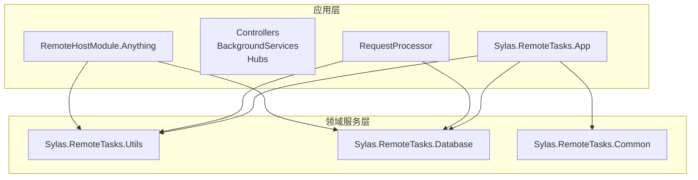
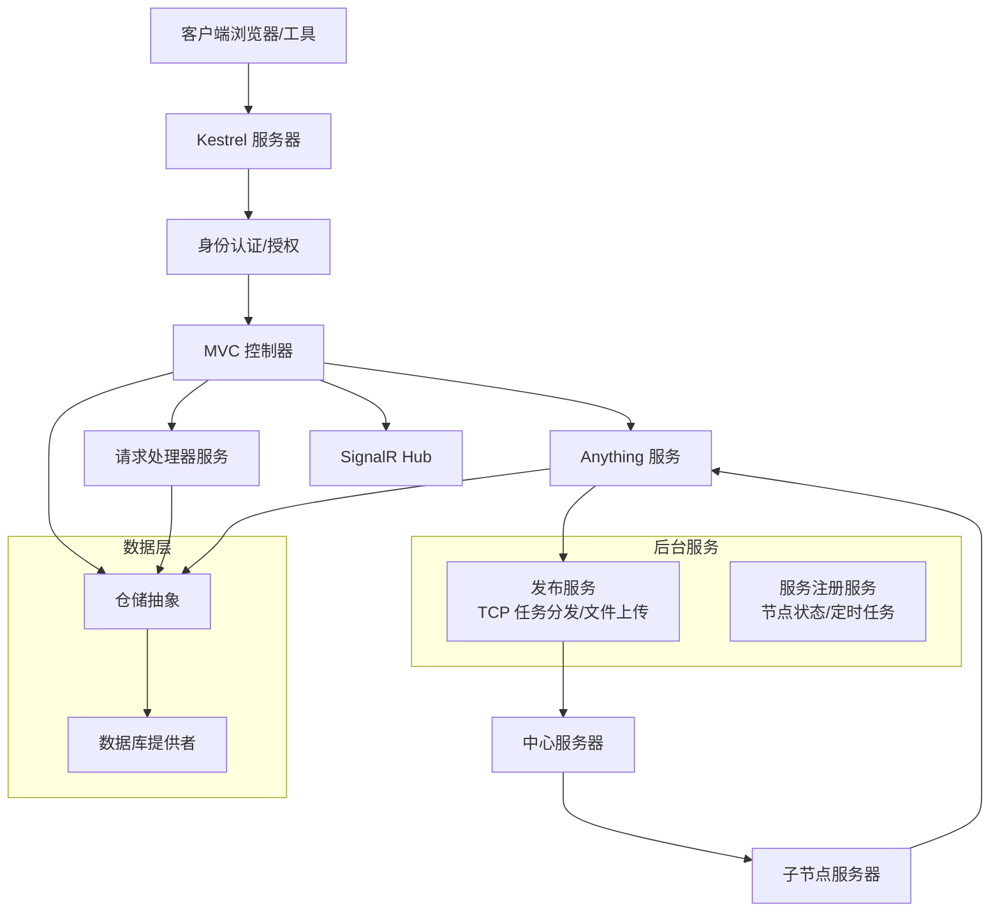
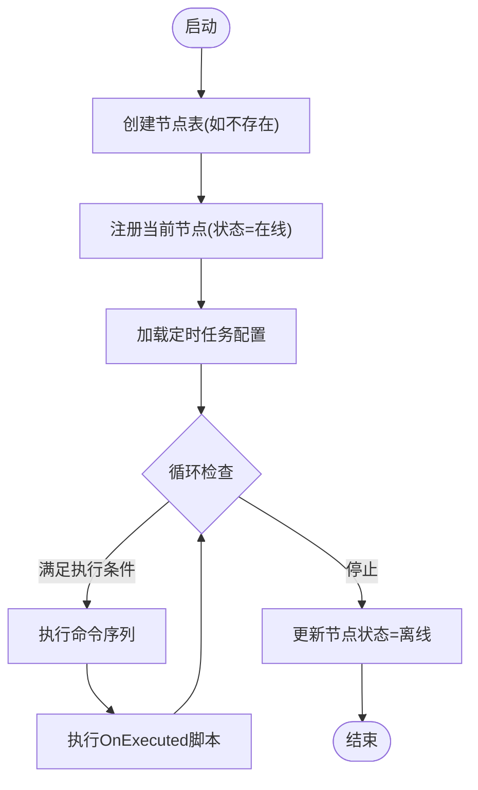
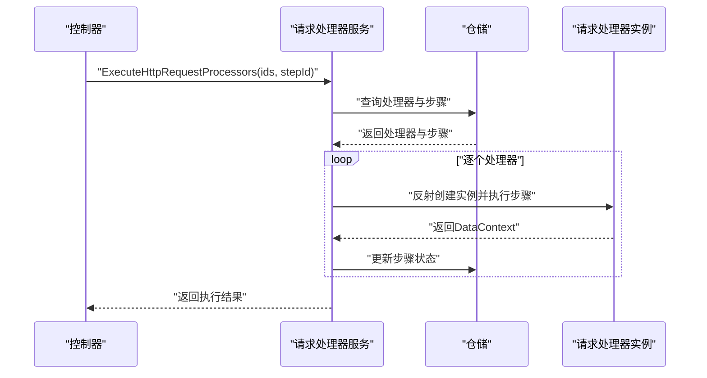
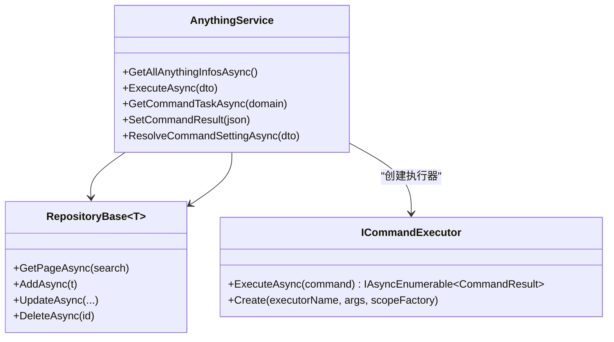
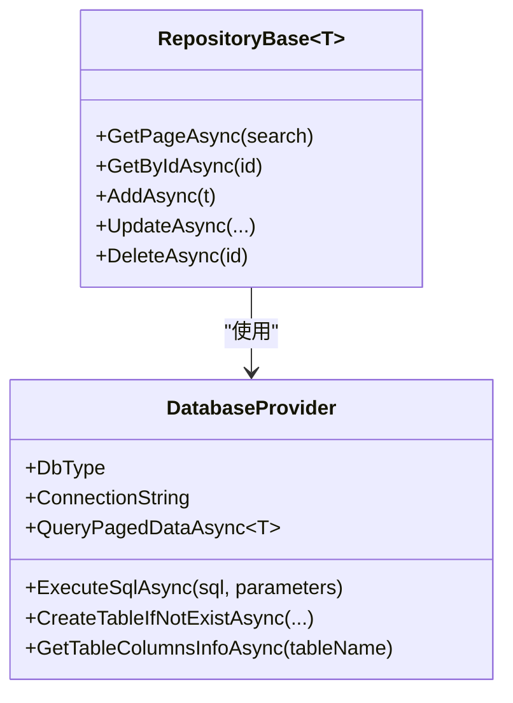
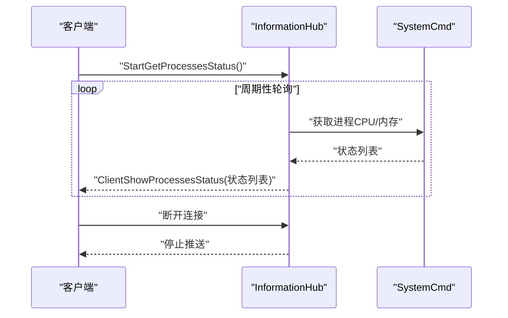
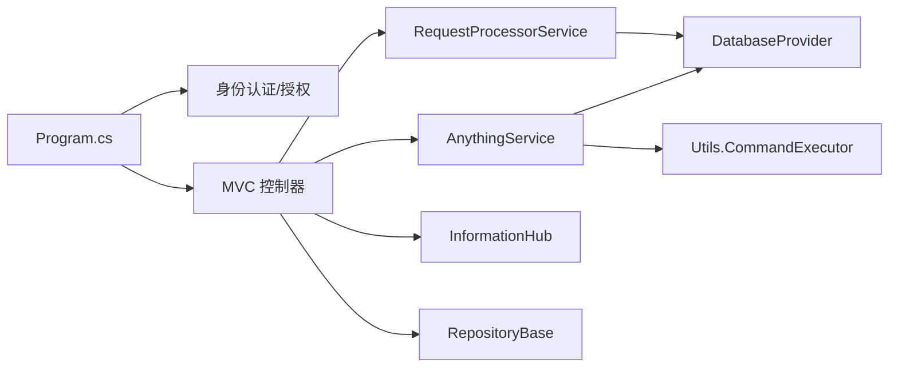
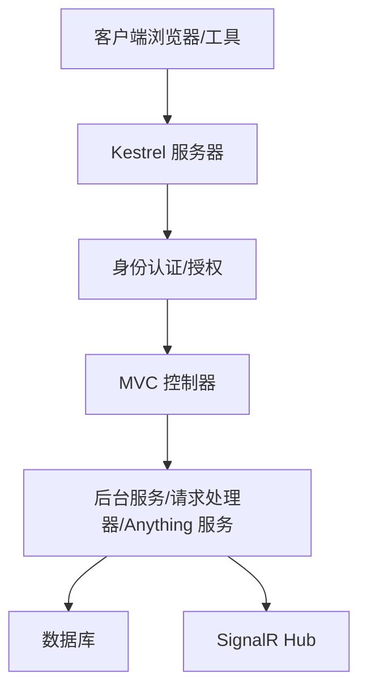

# 核心架构设计

<cite>
**本文档引用的文件**
- [Program.cs](file://Sylas.RemoteTasks.App/Program.cs)
- [appsettings.json](file://Sylas.RemoteTasks.App/appsettings.json)
- [Sylas.RemoteTasks.App.csproj](file://Sylas.RemoteTasks.App/Sylas.RemoteTasks.App.csproj)
- [PublishService.cs](file://Sylas.RemoteTasks.App/BackgroundServices/PublishService.cs)
- [ServerRegistrationService.cs](file://Sylas.RemoteTasks.App/BackgroundServices/ServerRegistrationService.cs)
- [RequestProcessorService.cs](file://Sylas.RemoteTasks.App/RequestProcessor/RequestProcessorService.cs)
- [AnythingService.cs](file://Sylas.RemoteTasks.App/RemoteHostModule/Anything/AnythingService.cs)
- [InformationHub.cs](file://Sylas.RemoteTasks.App/Hubs/InformationHub.cs)
- [Dockerfile](file://Sylas.RemoteTasks.App/Dockerfile)
- [RepositoryBase.cs](file://Sylas.RemoteTasks.App/Infrastructure/RepositoryBase.cs)
- [DatabaseProvider.cs](file://Sylas.RemoteTasks.Database/DatabaseProvider.cs)
- [ICommandExecutor.cs](file://Sylas.RemoteTasks.Utils/CommandExecutor/ICommandExecutor.cs)
- [README.md](file://README.md)
</cite>

## 目录
1. [引言](#引言)
2. [项目结构](#项目结构)
3. [核心组件](#核心组件)
4. [架构总览](#架构总览)
5. [详细组件分析](#详细组件分析)
6. [依赖关系分析](#依赖关系分析)
7. [性能考量](#性能考量)
8. [故障排查指南](#故障排查指南)
9. [结论](#结论)
10. [附录](#附录)

## 引言
本架构文档面向 Sylas.RemoteTasks 的核心设计与实现，目标是帮助开发者与运维人员快速理解系统的高层设计、架构模式、系统边界、组件交互、数据流与集成方式，并对技术决策、权衡与约束进行说明。文档同时覆盖基础设施需求、可扩展性考虑、部署拓扑、安全、监控与灾难恢复等横切关注点，并列出技术栈、第三方依赖与版本兼容性。

## 项目结构
Sylas.RemoteTasks 采用多项目分层组织，核心应用位于 Sylas.RemoteTasks.App，数据库访问与通用工具分别位于 Sylas.RemoteTasks.Database 与 Sylas.RemoteTasks.Utils，公共能力位于 Sylas.RemoteTasks.Common。项目遵循“按功能域划分”的模块化组织方式，便于职责分离与独立演进。



**图表来源**
- [Sylas.RemoteTasks.App.csproj](file://Sylas.RemoteTasks.App/Sylas.RemoteTasks.App.csproj#L1-L61)
- [Program.cs](file://Sylas.RemoteTasks.App/Program.cs#L1-L122)

**章节来源**
- [Sylas.RemoteTasks.App.csproj](file://Sylas.RemoteTasks.App/Sylas.RemoteTasks.App.csproj#L1-L61)
- [Program.cs](file://Sylas.RemoteTasks.App/Program.cs#L1-L122)

## 核心组件
- 应用入口与配置：Program.cs 负责构建 WebApplicationBuilder、注册服务、中间件管线与路由映射。
- 身份认证与授权：通过 IdentityModel 与 OpenId Connect/JWT Bearer 实现 OIDC 身份认证与 API 授权策略。
- 后台服务：发布服务（TCP 任务分发与文件上传）、服务注册服务（节点状态管理与定时任务调度）。
- 请求处理流水线：RequestProcessorService 基于数据库配置动态执行多步骤请求处理器与数据处理器。
- 远程主机模块：AnythingService 提供命令解析、执行器装配、跨节点命令转发与结果收集。
- 数据访问：RepositoryBase 抽象仓储，DatabaseProvider 提供多数据库类型支持与安全连接字符串处理。
- 实时通信：SignalR Hub 提供进程监控状态推送。
- 基础设施：Dockerfile 定义容器镜像与运行环境。

**章节来源**
- [Program.cs](file://Sylas.RemoteTasks.App/Program.cs#L1-L122)
- [appsettings.json](file://Sylas.RemoteTasks.App/appsettings.json#L1-L142)
- [PublishService.cs](file://Sylas.RemoteTasks.App/BackgroundServices/PublishService.cs#L1-L645)
- [ServerRegistrationService.cs](file://Sylas.RemoteTasks.App/BackgroundServices/ServerRegistrationService.cs#L1-L493)
- [RequestProcessorService.cs](file://Sylas.RemoteTasks.App/RequestProcessor/RequestProcessorService.cs#L1-L72)
- [AnythingService.cs](file://Sylas.RemoteTasks.App/RemoteHostModule/Anything/AnythingService.cs#L1-L680)
- [RepositoryBase.cs](file://Sylas.RemoteTasks.App/Infrastructure/RepositoryBase.cs#L1-L233)
- [DatabaseProvider.cs](file://Sylas.RemoteTasks.Database/DatabaseProvider.cs#L1-L485)
- [InformationHub.cs](file://Sylas.RemoteTasks.App/Hubs/InformationHub.cs#L1-L59)
- [Dockerfile](file://Sylas.RemoteTasks.App/Dockerfile#L1-L21)

## 架构总览
系统采用“中心-子节点”拓扑，中心服务器负责任务编排与结果汇聚，子节点负责具体命令执行与文件上传。请求处理通过数据库配置驱动的流水线实现，远程主机模块提供跨节点命令转发与执行器抽象。实时通信通过 SignalR Hub 提供进程监控推送。



**图表来源**
- [Program.cs](file://Sylas.RemoteTasks.App/Program.cs#L74-L121)
- [PublishService.cs](file://Sylas.RemoteTasks.App/BackgroundServices/PublishService.cs#L88-L340)
- [ServerRegistrationService.cs](file://Sylas.RemoteTasks.App/BackgroundServices/ServerRegistrationService.cs#L55-L110)
- [RequestProcessorService.cs](file://Sylas.RemoteTasks.App/RequestProcessor/RequestProcessorService.cs#L11-L72)
- [AnythingService.cs](file://Sylas.RemoteTasks.App/RemoteHostModule/Anything/AnythingService.cs#L294-L389)
- [RepositoryBase.cs](file://Sylas.RemoteTasks.App/Infrastructure/RepositoryBase.cs#L10-L233)
- [DatabaseProvider.cs](file://Sylas.RemoteTasks.Database/DatabaseProvider.cs#L19-L485)

## 详细组件分析

### 发布服务（TCP 任务分发与文件上传）
发布服务负责：
- 监听本地 TCP 端口，接受来自子节点的连接与任务。
- 处理文件上传流程（含结束标志校验与粘包处理）。
- 作为中心服务器时，维护子节点连接并分发命令；作为子节点时，与中心服务器保持长连接并执行命令。
- 心跳机制与断线重连策略，确保链路稳定性。

```mermaid
sequenceDiagram
participant Center as "中心服务器"
participant Child as "子节点"
participant Pub as "发布服务"
Center->>Pub : "启动监听并接受连接"
Child->>Pub : "连接建立(参数 : 2;;;;domain;;;;socketNo)"
Pub->>Center : "记录子节点连接"
loop "命令分发循环"
Center->>Pub : "获取待执行命令"
Pub->>Child : "发送命令ID与执行号"
Child->>Pub : "执行结果(带结束标记)"
Pub->>Center : "聚合并返回结果"
end
```

**图表来源**
- [PublishService.cs](file://Sylas.RemoteTasks.App/BackgroundServices/PublishService.cs#L346-L434)
- [PublishService.cs](file://Sylas.RemoteTasks.App/BackgroundServices/PublishService.cs#L443-L624)

**章节来源**
- [PublishService.cs](file://Sylas.RemoteTasks.App/BackgroundServices/PublishService.cs#L1-L645)

### 服务注册服务（节点状态与定时任务）
服务注册服务负责：
- 启动时创建并维护节点状态表，更新/新增当前节点记录。
- 停止时将节点状态置为离线。
- 基于数据库配置的定时任务表达式解析与调度，支持跨节点执行与结果回调。



**图表来源**
- [ServerRegistrationService.cs](file://Sylas.RemoteTasks.App/BackgroundServices/ServerRegistrationService.cs#L55-L110)
- [ServerRegistrationService.cs](file://Sylas.RemoteTasks.App/BackgroundServices/ServerRegistrationService.cs#L187-L341)

**章节来源**
- [ServerRegistrationService.cs](file://Sylas.RemoteTasks.App/BackgroundServices/ServerRegistrationService.cs#L1-L493)

### 请求处理器服务（数据库驱动的流水线）
请求处理器服务根据数据库配置动态执行请求处理器与数据处理器，支持上下文传递与步骤持久化。



**图表来源**
- [RequestProcessorService.cs](file://Sylas.RemoteTasks.App/RequestProcessor/RequestProcessorService.cs#L11-L72)

**章节来源**
- [RequestProcessorService.cs](file://Sylas.RemoteTasks.App/RequestProcessor/RequestProcessorService.cs#L1-L72)

### 远程主机模块（Anything 服务）
Anything 服务提供：
- 命令解析与执行器装配（支持模板变量解析与类型转换）。
- 跨节点命令转发与结果收集（中心服务器队列与子节点结果回传）。
- 本地命令执行（通过 HTTP 客户端转发至中心服务器）。



**图表来源**
- [AnythingService.cs](file://Sylas.RemoteTasks.App/RemoteHostModule/Anything/AnythingService.cs#L30-L680)
- [ICommandExecutor.cs](file://Sylas.RemoteTasks.Utils/CommandExecutor/ICommandExecutor.cs#L14-L74)
- [RepositoryBase.cs](file://Sylas.RemoteTasks.App/Infrastructure/RepositoryBase.cs#L10-L233)

**章节来源**
- [AnythingService.cs](file://Sylas.RemoteTasks.App/RemoteHostModule/Anything/AnythingService.cs#L1-L680)
- [ICommandExecutor.cs](file://Sylas.RemoteTasks.Utils/CommandExecutor/ICommandExecutor.cs#L1-L74)

### 数据访问层（仓储与数据库提供者）
- 仓储抽象 RepositoryBase<T> 提供统一的 CRUD 与分页查询接口，自动适配不同数据库类型的主键返回语句。
- DatabaseProvider 实现多数据库类型支持（SQL Server、MySQL、SQLite、PostgreSQL、Oracle、达梦），并处理连接字符串安全解密与参数绑定。



**图表来源**
- [RepositoryBase.cs](file://Sylas.RemoteTasks.App/Infrastructure/RepositoryBase.cs#L10-L233)
- [DatabaseProvider.cs](file://Sylas.RemoteTasks.Database/DatabaseProvider.cs#L19-L485)

**章节来源**
- [RepositoryBase.cs](file://Sylas.RemoteTasks.App/Infrastructure/RepositoryBase.cs#L1-L233)
- [DatabaseProvider.cs](file://Sylas.RemoteTasks.Database/DatabaseProvider.cs#L1-L485)

### 实时通信（SignalR Hub）
InformationHub 提供进程监控状态的实时推送，支持多进程并发采集与客户端广播。



**图表来源**
- [InformationHub.cs](file://Sylas.RemoteTasks.App/Hubs/InformationHub.cs#L14-L56)

**章节来源**
- [InformationHub.cs](file://Sylas.RemoteTasks.App/Hubs/InformationHub.cs#L1-L59)

## 依赖关系分析
- 应用层依赖工具与数据库层，通过仓储与数据库提供者解耦具体实现。
- 身份认证与授权通过 IdentityModel 与 OpenId Connect/JWT Bearer 集成，支持多种令牌方案。
- 请求处理与远程主机模块依赖模板引擎与命令执行器抽象，支持动态扩展。



**图表来源**
- [Program.cs](file://Sylas.RemoteTasks.App/Program.cs#L74-L121)
- [RequestProcessorService.cs](file://Sylas.RemoteTasks.App/RequestProcessor/RequestProcessorService.cs#L7-L28)
- [AnythingService.cs](file://Sylas.RemoteTasks.App/RemoteHostModule/Anything/AnythingService.cs#L30-L680)
- [RepositoryBase.cs](file://Sylas.RemoteTasks.App/Infrastructure/RepositoryBase.cs#L10-L233)
- [DatabaseProvider.cs](file://Sylas.RemoteTasks.Database/DatabaseProvider.cs#L19-L485)

**章节来源**
- [Program.cs](file://Sylas.RemoteTasks.App/Program.cs#L1-L122)
- [Sylas.RemoteTasks.App.csproj](file://Sylas.RemoteTasks.App/Sylas.RemoteTasks.App.csproj#L33-L40)

## 性能考量
- 线程模型：发布服务在每个客户端连接上使用独立线程处理，适合高并发短连接场景；注意线程数量与系统资源的平衡。
- 数据库访问：仓储层针对不同数据库类型生成合适的主键返回语句，减少额外查询；建议在高频更新场景启用连接池与参数化查询。
- 模板解析与命令执行：Anything 服务对命令模板进行缓存与类型转换，避免重复解析；执行器通过反射创建，建议在稳定场景预热。
- 心跳与断线重连：发布服务的心跳频率与超时阈值可调，建议结合网络质量调整，避免频繁重连。
- 缓存策略：内存缓存用于 Anything 信息与执行器映射，建议设置合理的滑动过期时间，防止内存膨胀。

[本节为通用性能指导，无需特定文件引用]

## 故障排查指南
- 身份认证失败：检查 IdentityServer 配置项（Authority、ApiName、ClientId、ClientSecret 等），确认令牌颁发与作用域匹配。
- 文件上传异常：确认服务端 SaveDir 配置有效，客户端结束标志“000000”正确发送，缓冲区大小与粘包处理逻辑。
- 命令执行超时：检查 Anything 服务的命令队列与结果收集逻辑，确认中心服务器与子节点之间的 TCP 连接与心跳状态。
- 数据库连接问题：确认连接字符串解密与数据库类型识别正确，参数绑定与 SQL 生成符合目标数据库规范。
- 定时任务未执行：检查 Cron 表达式解析与节点域名匹配，确认任务状态与 OnExecuted 脚本执行日志。

**章节来源**
- [appsettings.json](file://Sylas.RemoteTasks.App/appsettings.json#L109-L141)
- [PublishService.cs](file://Sylas.RemoteTasks.App/BackgroundServices/PublishService.cs#L148-L262)
- [AnythingService.cs](file://Sylas.RemoteTasks.App/RemoteHostModule/Anything/AnythingService.cs#L399-L491)
- [DatabaseProvider.cs](file://Sylas.RemoteTasks.Database/DatabaseProvider.cs#L234-L258)
- [ServerRegistrationService.cs](file://Sylas.RemoteTasks.App/BackgroundServices/ServerRegistrationService.cs#L362-L490)

## 结论
Sylas.RemoteTasks 通过“中心-子节点”拓扑与数据库驱动的请求处理流水线，实现了灵活的任务编排与跨节点命令执行。系统在身份认证、实时通信、数据访问与执行器抽象方面具备良好的扩展性与可维护性。建议在生产环境中完善监控告警、灾备与容量规划，并持续优化模板解析与数据库访问性能。

[本节为总结性内容，无需特定文件引用]

## 附录

### 系统上下文图


**图表来源**
- [Program.cs](file://Sylas.RemoteTasks.App/Program.cs#L97-L121)
- [InformationHub.cs](file://Sylas.RemoteTasks.App/Hubs/InformationHub.cs#L11-L56)

### 部署拓扑与基础设施
- 容器镜像：基于 ASP.NET 10.0 运行时，暴露 80/443 端口，支持通过环境变量覆盖 URL。
- 端口映射：开发环境可参考 README 中的示例，生产环境建议通过反向代理与证书管理。
- 依赖安装：容器内安装 vim，便于运维排障。

**章节来源**
- [Dockerfile](file://Sylas.RemoteTasks.App/Dockerfile#L1-L21)
- [README.md](file://README.md#L4-L17)

### 技术栈与版本兼容性
- 运行时与框架：.NET 10.0（应用），.NET Standard 2.1（公共库）
- 身份认证：IdentityModel、OpenId Connect、JWT Bearer、OAuth2 Introspection
- 数据库访问：Dapper、System.Text.Json、Newtonsoft.Json
- 命令执行：反射与特性驱动的执行器抽象
- 实时通信：SignalR

**章节来源**
- [Sylas.RemoteTasks.App.csproj](file://Sylas.RemoteTasks.App/Sylas.RemoteTasks.App.csproj#L3-L9)
- [Sylas.RemoteTasks.Common.csproj](file://Sylas.RemoteTasks.Common/Sylas.RemoteTasks.Common.csproj#L1-L16)