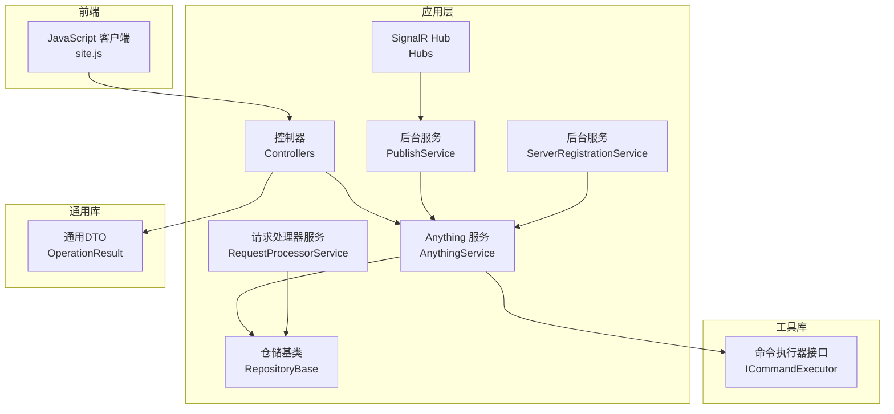
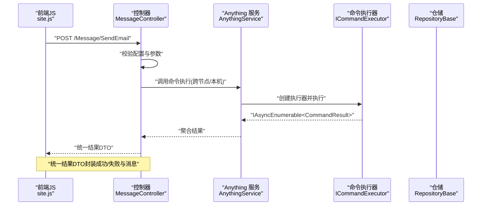
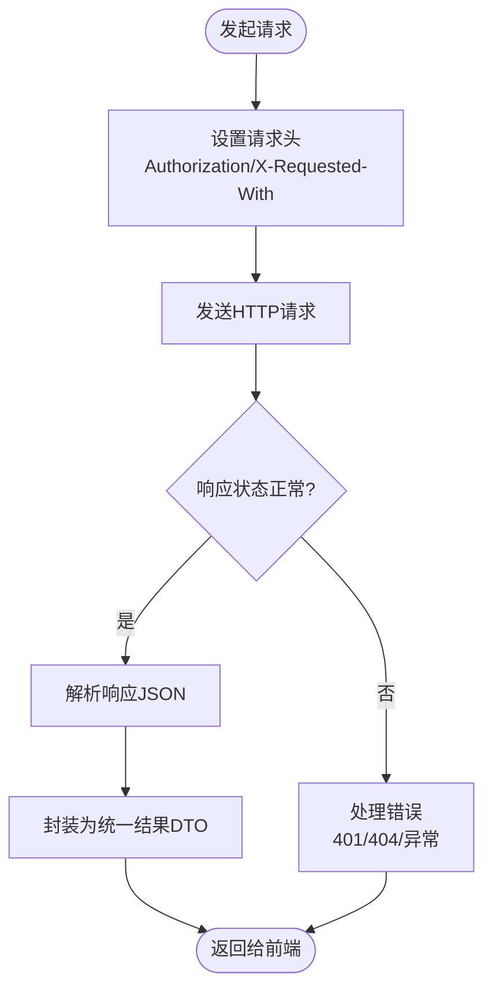
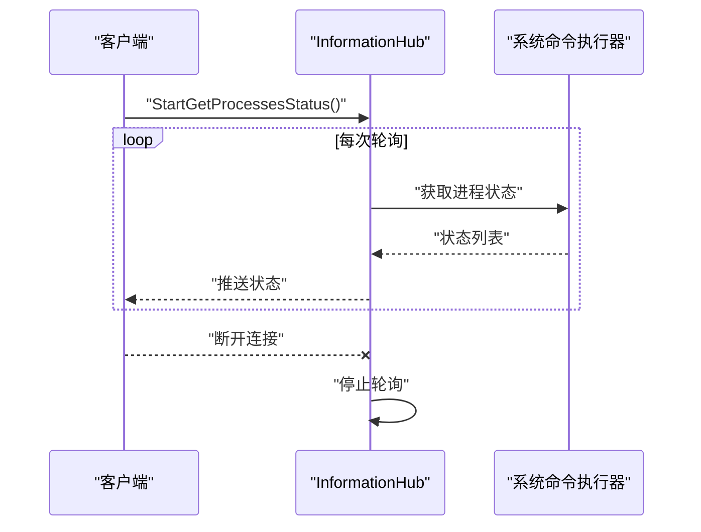
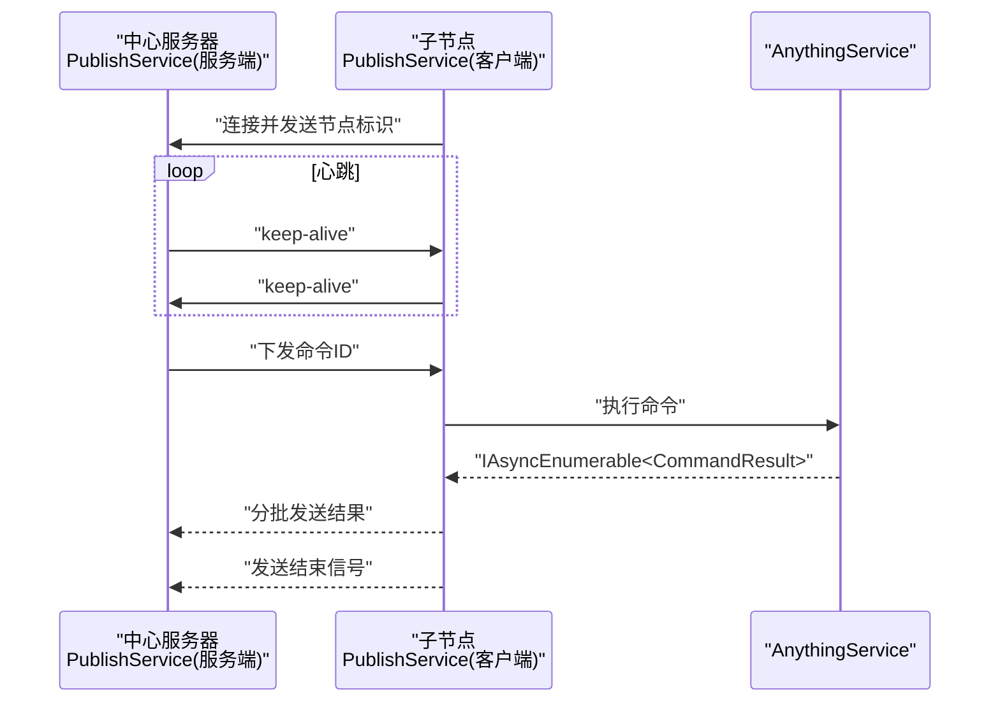
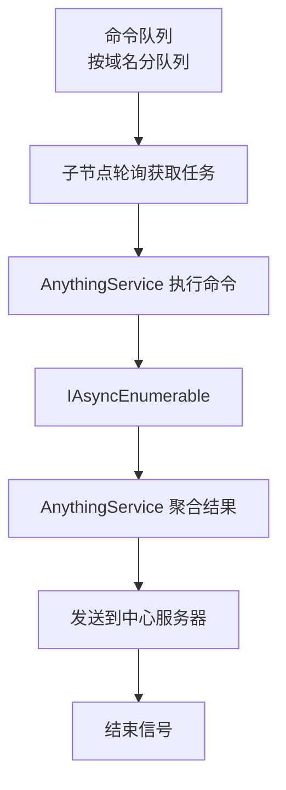
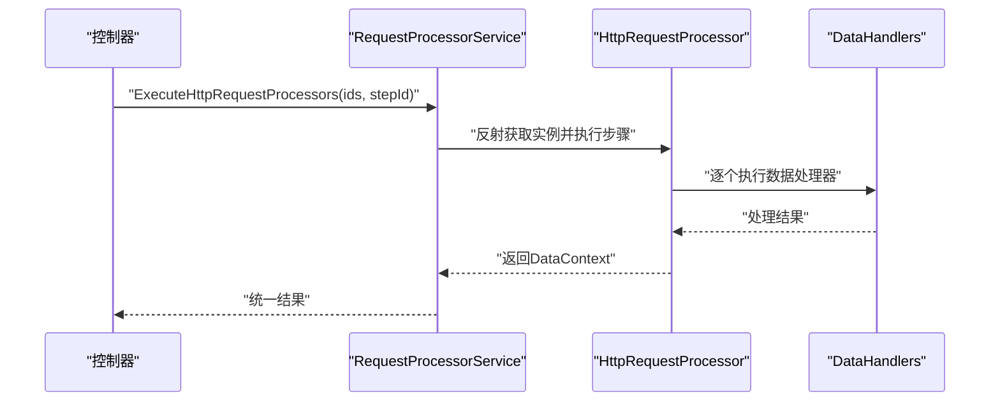
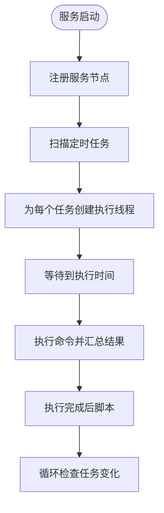
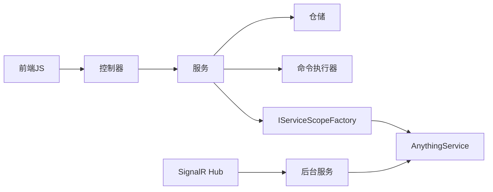

# 组件交互机制

<cite>
**本文档引用的文件**
- [Program.cs](file://Sylas.RemoteTasks.App/Program.cs)
- [appsettings.json](file://Sylas.RemoteTasks.App/appsettings.json)
- [InformationHub.cs](file://Sylas.RemoteTasks.App/Hubs/InformationHub.cs)
- [PublishService.cs](file://Sylas.RemoteTasks.App/BackgroundServices/PublishService.cs)
- [ServerRegistrationService.cs](file://Sylas.RemoteTasks.App/BackgroundServices/ServerRegistrationService.cs)
- [AnythingService.cs](file://Sylas.RemoteTasks.App/RemoteHostModule/Anything/AnythingService.cs)
- [RequestProcessorService.cs](file://Sylas.RemoteTasks.App/RequestProcessor/RequestProcessorService.cs)
- [RepositoryBase.cs](file://Sylas.RemoteTasks.App/Infrastructure/RepositoryBase.cs)
- [ICommandExecutor.cs](file://Sylas.RemoteTasks.Utils/CommandExecutor/ICommandExecutor.cs)
- [MessageController.cs](file://Sylas.RemoteTasks.App/Controllers/MessageController.cs)
- [CustomBaseController.cs](file://Sylas.RemoteTasks.App/Controllers/CustomBaseController.cs)
- [OperationResult.cs](file://Sylas.RemoteTasks.Common/Dtos/OperationResult.cs)
- [site.js](file://Sylas.RemoteTasks.App/wwwroot/js/site.js)
</cite>

## 目录
1. [引言](#引言)
2. [项目结构](#项目结构)
3. [核心组件](#核心组件)
4. [架构总览](#架构总览)
5. [详细组件分析](#详细组件分析)
6. [依赖关系分析](#依赖关系分析)
7. [性能考量](#性能考量)
8. [故障排查指南](#故障排查指南)
9. [结论](#结论)

## 引言
本文件面向 Sylas.RemoteTasks 的组件交互机制，系统性梳理系统内各组件之间的通信方式与协作关系，覆盖以下方面：
- HTTP 请求与响应：控制器层、前端 JS 与后端 API 的交互协议与错误处理
- SignalR 实时通信：服务端推送与客户端订阅流程
- 后台服务通信：TCP 长连接、心跳与命令下发/回传机制
- 事件驱动与消息传递：基于队列与异步枚举的命令执行模型
- 组件依赖与调用链：从控制器到服务、仓储、执行器的完整链路
- 异步处理与并发控制：并发容器、任务调度与取消令牌
- 错误传播与异常处理策略：统一结果包装与异常捕获

## 项目结构
系统采用典型的 ASP.NET Core 分层架构，主要模块如下：
- 应用层（Sylas.RemoteTasks.App）：控制器、Hubs、后台服务、基础设施、远程主机模块、请求处理器
- 工具库（Sylas.RemoteTasks.Utils）：命令执行器、模板解析、网络与系统辅助
- 通用库（Sylas.RemoteTasks.Common）：通用 DTO、扩展与常量
- 数据库访问（Sylas.RemoteTasks.Database）：数据库提供者与同步基类

**图表来源**
- [Program.cs](file://Sylas.RemoteTasks.App/Program.cs#L1-L122)
- [InformationHub.cs](file://Sylas.RemoteTasks.App/Hubs/InformationHub.cs#L1-L59)
- [PublishService.cs](file://Sylas.RemoteTasks.App/BackgroundServices/PublishService.cs#L1-L645)
- [ServerRegistrationService.cs](file://Sylas.RemoteTasks.App/BackgroundServices/ServerRegistrationService.cs#L1-L493)
- [AnythingService.cs](file://Sylas.RemoteTasks.App/RemoteHostModule/Anything/AnythingService.cs#L1-L680)
- [RequestProcessorService.cs](file://Sylas.RemoteTasks.App/RequestProcessor/RequestProcessorService.cs#L1-L72)
- [RepositoryBase.cs](file://Sylas.RemoteTasks.App/Infrastructure/RepositoryBase.cs#L1-L233)
- [ICommandExecutor.cs](file://Sylas.RemoteTasks.Utils/CommandExecutor/ICommandExecutor.cs#L1-L74)
- [OperationResult.cs](file://Sylas.RemoteTasks.Common/Dtos/OperationResult.cs#L1-L52)
- [site.js](file://Sylas.RemoteTasks.App/wwwroot/js/site.js#L1-L800)

**章节来源**
- [Program.cs](file://Sylas.RemoteTasks.App/Program.cs#L1-L122)
- [appsettings.json](file://Sylas.RemoteTasks.App/appsettings.json#L1-L142)

## 核心组件
- 控制器层：负责 HTTP 请求入口与响应封装，典型如消息发送控制器与基础控制器
- SignalR Hub：提供服务端推送能力，如进程状态轮询
- 后台服务：
  - 发布服务：TCP 服务端与客户端长连接、命令下发/结果回传、心跳与重连
  - 服务注册服务：服务节点登记/注销、定时任务调度与执行
- Anything 服务：命令解析、执行器创建、跨节点命令转发、结果聚合
- 请求处理器服务：按配置动态执行 HTTP 步骤与数据处理器
- 仓储基类：统一的 CRUD 与分页查询
- 命令执行器接口：抽象命令执行器工厂与异步枚举执行模型
- 前端 JS：HTTP 请求封装、分页与表单交互

**章节来源**
- [MessageController.cs](file://Sylas.RemoteTasks.App/Controllers/MessageController.cs#L1-L18)
- [CustomBaseController.cs](file://Sylas.RemoteTasks.App/Controllers/CustomBaseController.cs#L1-L145)
- [InformationHub.cs](file://Sylas.RemoteTasks.App/Hubs/InformationHub.cs#L1-L59)
- [PublishService.cs](file://Sylas.RemoteTasks.App/BackgroundServices/PublishService.cs#L1-L645)
- [ServerRegistrationService.cs](file://Sylas.RemoteTasks.App/BackgroundServices/ServerRegistrationService.cs#L1-L493)
- [AnythingService.cs](file://Sylas.RemoteTasks.App/RemoteHostModule/Anything/AnythingService.cs#L1-L680)
- [RequestProcessorService.cs](file://Sylas.RemoteTasks.App/RequestProcessor/RequestProcessorService.cs#L1-L72)
- [RepositoryBase.cs](file://Sylas.RemoteTasks.App/Infrastructure/RepositoryBase.cs#L1-L233)
- [ICommandExecutor.cs](file://Sylas.RemoteTasks.Utils/CommandExecutor/ICommandExecutor.cs#L1-L74)
- [site.js](file://Sylas.RemoteTasks.App/wwwroot/js/site.js#L1-L800)

## 架构总览
系统采用“控制器-服务-仓储-执行器”的分层设计，结合后台服务与 SignalR 实现实时推送。核心交互路径包括：
- HTTP：前端 JS 通过 fetch 发送带 Bearer Token 的请求，控制器返回统一结果 DTO
- SignalR：客户端连接 Hub，服务端按需推送实时状态
- TCP：后台服务作为服务端监听，或作为客户端连接中心服务器，进行命令下发与结果回传
- 异步执行：命令执行器返回 IAsyncEnumerable，Anything 服务以异步枚举消费

**图表来源**
- [site.js](file://Sylas.RemoteTasks.App/wwwroot/js/site.js#L720-L774)
- [MessageController.cs](file://Sylas.RemoteTasks.App/Controllers/MessageController.cs#L1-L18)
- [AnythingService.cs](file://Sylas.RemoteTasks.App/RemoteHostModule/Anything/AnythingService.cs#L294-L389)
- [ICommandExecutor.cs](file://Sylas.RemoteTasks.Utils/CommandExecutor/ICommandExecutor.cs#L31-L71)
- [RepositoryBase.cs](file://Sylas.RemoteTasks.App/Infrastructure/RepositoryBase.cs#L1-L233)

## 详细组件分析

### HTTP 请求与响应机制
- 前端 JS 封装请求：统一设置 X-Requested-With、Authorization 头，对 401、404 等状态进行处理
- 控制器返回统一结果：消息控制器返回 RequestResult<bool>，内部由 OperationResult 包装
- 基础控制器：提供文件上传、删除与路径生成等通用能力

**图表来源**
- [site.js](file://Sylas.RemoteTasks.App/wwwroot/js/site.js#L720-L774)
- [MessageController.cs](file://Sylas.RemoteTasks.App/Controllers/MessageController.cs#L9-L15)
- [OperationResult.cs](file://Sylas.RemoteTasks.Common/Dtos/OperationResult.cs#L8-L50)

**章节来源**
- [site.js](file://Sylas.RemoteTasks.App/wwwroot/js/site.js#L720-L774)
- [MessageController.cs](file://Sylas.RemoteTasks.App/Controllers/MessageController.cs#L1-L18)
- [CustomBaseController.cs](file://Sylas.RemoteTasks.App/Controllers/CustomBaseController.cs#L1-L145)
- [OperationResult.cs](file://Sylas.RemoteTasks.Common/Dtos/OperationResult.cs#L1-L52)

### SignalR 实时通信
- Hub：InformationHub 提供 StartGetProcessesStatus，周期性收集进程 CPU/内存并推送给当前连接的客户端
- 断开处理：OnDisconnectedAsync 中设置停止标志，避免后续轮询
- 客户端：通过浏览器内置 SignalR 客户端连接 Hub，订阅事件

**图表来源**
- [InformationHub.cs](file://Sylas.RemoteTasks.App/Hubs/InformationHub.cs#L14-L56)

**章节来源**
- [InformationHub.cs](file://Sylas.RemoteTasks.App/Hubs/InformationHub.cs#L1-L59)

### 后台服务通信（TCP/心跳/命令）
- 发布服务（服务端）：
  - 监听本地 TCP 端口，接受子节点连接
  - 解析参数协议，支持文件传输与命令下发
  - 维护子节点 Socket 映射，心跳检测与重连
- 发布服务（客户端）：
  - 连接中心服务器，保持心跳
  - 接收命令 -> 执行命令 -> 分批回传结果 -> 发送结束信号
  - 异常时自动重连，取消令牌控制生命周期

**图表来源**
- [PublishService.cs](file://Sylas.RemoteTasks.App/BackgroundServices/PublishService.cs#L346-L434)
- [PublishService.cs](file://Sylas.RemoteTasks.App/BackgroundServices/PublishService.cs#L443-L624)
- [AnythingService.cs](file://Sylas.RemoteTasks.App/RemoteHostModule/Anything/AnythingService.cs#L399-L491)

**章节来源**
- [PublishService.cs](file://Sylas.RemoteTasks.App/BackgroundServices/PublishService.cs#L1-L645)
- [appsettings.json](file://Sylas.RemoteTasks.App/appsettings.json#L28-L35)

### 事件驱动与消息传递（Anything 服务）
- 命令队列：中心服务器按域名维护命令队列，子节点轮询获取任务
- 结果聚合：子节点将命令结果写入共享容器，Anything 服务异步枚举并返回
- 执行器工厂：根据配置动态创建执行器，支持静态类与依赖注入构造

**图表来源**
- [AnythingService.cs](file://Sylas.RemoteTasks.App/RemoteHostModule/Anything/AnythingService.cs#L399-L491)
- [ICommandExecutor.cs](file://Sylas.RemoteTasks.Utils/CommandExecutor/ICommandExecutor.cs#L31-L71)

**章节来源**
- [AnythingService.cs](file://Sylas.RemoteTasks.App/RemoteHostModule/Anything/AnythingService.cs#L294-L389)
- [ICommandExecutor.cs](file://Sylas.RemoteTasks.Utils/CommandExecutor/ICommandExecutor.cs#L1-L74)

### 请求处理器与数据处理器
- RequestProcessorService：按配置加载处理器与步骤，执行步骤并将 DataContext 传递给后续步骤
- DataHandlers：通过配置驱动数据处理链路，支持多处理器串联

**图表来源**
- [RequestProcessorService.cs](file://Sylas.RemoteTasks.App/RequestProcessor/RequestProcessorService.cs#L11-L69)

**章节来源**
- [RequestProcessorService.cs](file://Sylas.RemoteTasks.App/RequestProcessor/RequestProcessorService.cs#L1-L72)
- [appsettings.json](file://Sylas.RemoteTasks.App/appsettings.json#L65-L106)

### 服务注册与定时任务
- ServerRegistrationService：启动时注册服务节点，停止时注销；定时扫描 AnythingFlow 并按 Cron 执行
- 任务调度：为每个 Flow 创建独立线程与取消令牌，支持任务变更检测与重启

**图表来源**
- [ServerRegistrationService.cs](file://Sylas.RemoteTasks.App/BackgroundServices/ServerRegistrationService.cs#L55-L110)
- [ServerRegistrationService.cs](file://Sylas.RemoteTasks.App/BackgroundServices/ServerRegistrationService.cs#L187-L341)

**章节来源**
- [ServerRegistrationService.cs](file://Sylas.RemoteTasks.App/BackgroundServices/ServerRegistrationService.cs#L1-L493)

## 依赖关系分析
- 控制器依赖服务：MessageController 依赖 AnythingService 或其他业务服务
- 服务依赖仓储与执行器：AnythingService 依赖 RepositoryBase、ICommandExecutor、缓存与 HTTP 客户端
- 后台服务依赖服务定位：通过 IServiceScopeFactory 获取 AnythingService 与数据库提供者
- 前端依赖后端 API：site.js 统一封装请求与错误处理

**图表来源**
- [Program.cs](file://Sylas.RemoteTasks.App/Program.cs#L60-L68)
- [AnythingService.cs](file://Sylas.RemoteTasks.App/RemoteHostModule/Anything/AnythingService.cs#L30-L38)
- [PublishService.cs](file://Sylas.RemoteTasks.App/BackgroundServices/PublishService.cs#L582-L585)
- [InformationHub.cs](file://Sylas.RemoteTasks.App/Hubs/InformationHub.cs#L11-L11)

**章节来源**
- [Program.cs](file://Sylas.RemoteTasks.App/Program.cs#L1-L122)

## 性能考量
- 异步与流式处理：命令执行器返回 IAsyncEnumerable，减少内存峰值与等待时间
- 并发容器：后台服务使用 ConcurrentDictionary 管理子节点连接与命令队列
- 心跳与重连：TCP 心跳检测与指数退避重连，降低网络抖动影响
- 缓存：AnythingService 使用内存缓存 AnythingInfo，减少重复解析与查询
- 分页与批量：仓储基类提供分页查询，避免一次性加载大量数据

## 故障排查指南
- HTTP 401：检查前端本地存储的 access_token 与过期时间，必要时重新登录
- SignalR 连接失败：确认 Hub 路由映射与网络可达性
- TCP 心跳中断：检查中心服务器配置与防火墙，关注日志中的 keep-alive 记录
- 命令执行超时：AnythingService 内置超时控制，检查命令执行器耗时与资源占用
- 统一结果错误：通过 OperationResult/RequestResult 的 Message 字段定位具体原因

**章节来源**
- [site.js](file://Sylas.RemoteTasks.App/wwwroot/js/site.js#L703-L774)
- [PublishService.cs](file://Sylas.RemoteTasks.App/BackgroundServices/PublishService.cs#L482-L543)
- [AnythingService.cs](file://Sylas.RemoteTasks.App/RemoteHostModule/Anything/AnythingService.cs#L440-L491)

## 结论
Sylas.RemoteTasks 通过清晰的分层与多种通信机制实现了灵活的组件交互：
- HTTP 与 SignalR 提供用户侧与实时侧的交互通道
- 后台服务以 TCP 为基础，构建中心-子节点的分布式命令执行体系
- 事件驱动与异步枚举贯穿命令执行，提升吞吐与响应性
- 统一的结果封装与错误处理策略确保系统可观测与可维护