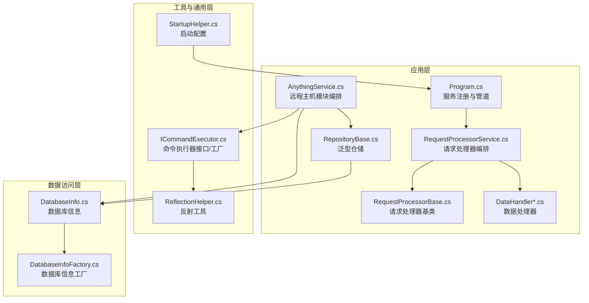
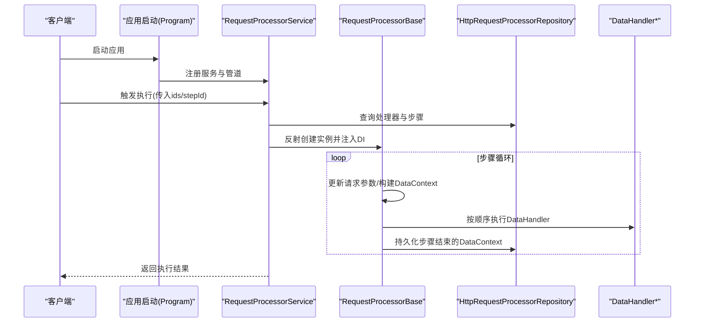
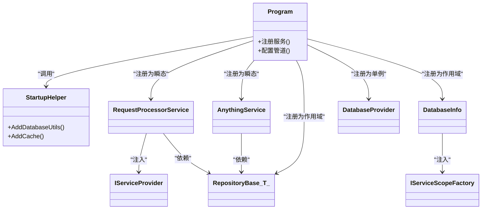
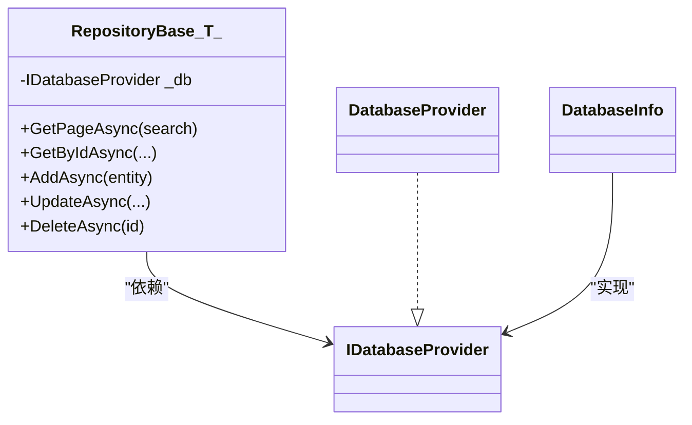
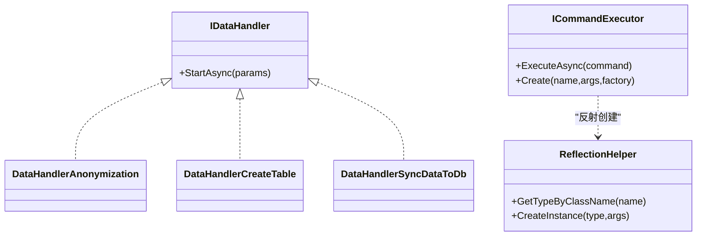
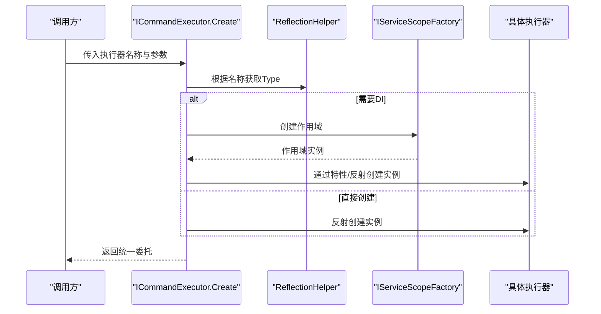
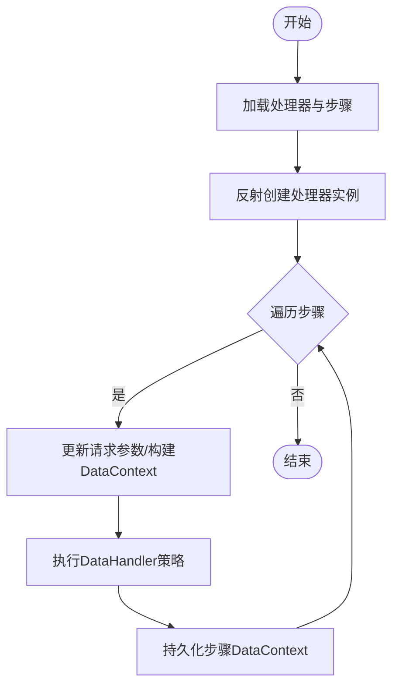
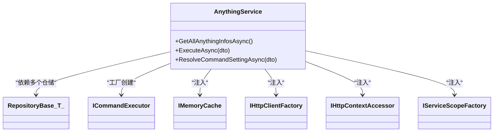
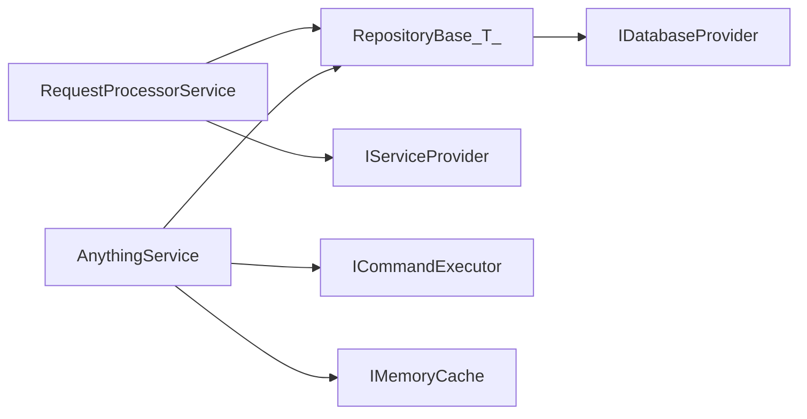

# 设计模式应用

<cite>
**本文引用的文件**
- [Program.cs](file://Sylas.RemoteTasks.App/Program.cs)
- [RepositoryBase.cs](file://Sylas.RemoteTasks.App/Infrastructure/RepositoryBase.cs)
- [IDataHandler.cs](file://Sylas.RemoteTasks.App/DataHandlers/IDataHandler.cs)
- [DataHandler.cs](file://Sylas.RemoteTasks.App/DataHandlers/DataHandler.cs)
- [DataHandlerAnonymization.cs](file://Sylas.RemoteTasks.App/DataHandlers/DataHandlerAnonymization.cs)
- [DataHandlerCreateTable.cs](file://Sylas.RemoteTasks.App/DataHandlers/DataHandlerCreateTable.cs)
- [DataHandlerSyncDataToDb.cs](file://Sylas.RemoteTasks.App/DataHandlers/DataHandlerSyncDataToDb.cs)
- [IRequestConfigTasks.cs](file://Sylas.RemoteTasks.App/RequestProcessor/IRequestConfigTasks.cs)
- [RequestProcessorBase.cs](file://Sylas.RemoteTasks.App/RequestProcessor/RequestProcessorBase.cs)
- [RequestProcessorService.cs](file://Sylas.RemoteTasks.App/RequestProcessor/RequestProcessorService.cs)
- [AnythingService.cs](file://Sylas.RemoteTasks.App/RemoteHostModule/Anything/AnythingService.cs)
- [ICommandExecutor.cs](file://Sylas.RemoteTasks.Utils/CommandExecutor/ICommandExecutor.cs)
- [ReflectionHelper.cs](file://Sylas.RemoteTasks.Utils/ReflectionHelper.cs)
- [DatabaseInfo.cs](file://Sylas.RemoteTasks.Database/SyncBase/DatabaseInfo.cs)
- [DatabaseInfoFactory.cs](file://Sylas.RemoteTasks.Database/SyncBase/DatabaseInfoFactory.cs)
- [StartupHelper.cs](file://Sylas.RemoteTasks.App/Helpers/StartupHelper.cs)
</cite>

## 目录
1. [引言](#引言)
2. [项目结构](#项目结构)
3. [核心组件](#核心组件)
4. [架构总览](#架构总览)
5. [详细组件分析](#详细组件分析)
6. [依赖关系分析](#依赖关系分析)
7. [性能考量](#性能考量)
8. [故障排查指南](#故障排查指南)
9. [结论](#结论)
10. [附录](#附录)

## 引言
本文件系统性梳理 Sylas.RemoteTasks 中的设计模式实践，重点覆盖依赖注入（DI）、仓储（Repository）、策略（Strategy）、工厂（Factory）等模式，并解释其应用场景、实现方式与带来的收益。文档同时给出关键流程的时序图与类图，帮助读者快速把握模块间的协作关系与扩展点。

## 项目结构
项目采用分层与功能域混合的组织方式：
- 应用层（Sylas.RemoteTasks.App）：控制器、后台服务、请求处理器、远程主机模块、基础设施与数据处理器
- 工具与通用层（Sylas.RemoteTasks.Utils）：命令执行器、模板解析、反射工具、常量与扩展
- 数据访问层（Sylas.RemoteTasks.Database）：数据库提供者、同步基类、实体基类与DTO
- 测试层（Sylas.RemoteTasks.Test）：单元测试与集成测试

图表来源
- [Program.cs](file://Sylas.RemoteTasks.App/Program.cs#L39-L78)
- [RequestProcessorService.cs](file://Sylas.RemoteTasks.App/RequestProcessor/RequestProcessorService.cs#L1-L72)
- [RequestProcessorBase.cs](file://Sylas.RemoteTasks.App/RequestProcessor/RequestProcessorBase.cs#L1-L279)
- [AnythingService.cs](file://Sylas.RemoteTasks.App/RemoteHostModule/Anything/AnythingService.cs#L1-L680)
- [RepositoryBase.cs](file://Sylas.RemoteTasks.App/Infrastructure/RepositoryBase.cs#L1-L233)
- [ICommandExecutor.cs](file://Sylas.RemoteTasks.Utils/CommandExecutor/ICommandExecutor.cs#L1-L74)
- [ReflectionHelper.cs](file://Sylas.RemoteTasks.Utils/ReflectionHelper.cs#L38-L79)
- [StartupHelper.cs](file://Sylas.RemoteTasks.App/Helpers/StartupHelper.cs#L28-L75)
- [DatabaseInfo.cs](file://Sylas.RemoteTasks.Database/SyncBase/DatabaseInfo.cs#L29-L59)

章节来源
- [Program.cs](file://Sylas.RemoteTasks.App/Program.cs#L1-L122)

## 核心组件
- 依赖注入与服务注册：在应用启动阶段集中注册服务、仓储、后台服务、认证与授权策略等
- 泛型仓储：统一的数据访问抽象，屏蔽数据库差异
- 请求处理器：基于配置驱动的流水线执行引擎，支持步骤级数据上下文传递
- 数据处理器：面向具体业务的数据处理策略，按顺序执行
- 命令执行器：动态创建与执行不同类型的命令执行器，支持DI作用域与反射
- 数据库信息工厂：按需创建或复用数据库上下文，支持连接切换

章节来源
- [Program.cs](file://Sylas.RemoteTasks.App/Program.cs#L39-L78)
- [RepositoryBase.cs](file://Sylas.RemoteTasks.App/Infrastructure/RepositoryBase.cs#L1-L233)
- [RequestProcessorBase.cs](file://Sylas.RemoteTasks.App/RequestProcessor/RequestProcessorBase.cs#L1-L279)
- [RequestProcessorService.cs](file://Sylas.RemoteTasks.App/RequestProcessor/RequestProcessorService.cs#L1-L72)
- [ICommandExecutor.cs](file://Sylas.RemoteTasks.Utils/CommandExecutor/ICommandExecutor.cs#L1-L74)
- [DatabaseInfoFactory.cs](file://Sylas.RemoteTasks.Database/SyncBase/DatabaseInfoFactory.cs#L36-L59)

## 架构总览
整体采用“配置驱动 + 策略执行 + 工厂创建 + 仓储持久化”的架构风格：
- 配置驱动：请求处理器与步骤由数据库配置驱动，支持跨步骤数据上下文传递
- 策略执行：数据处理器作为策略，按顺序执行；命令执行器作为策略，按名称动态创建
- 工厂创建：命令执行器工厂与数据库信息工厂负责按需实例化
- 仓储持久化：统一的泛型仓储封装数据库操作

图表来源
- [Program.cs](file://Sylas.RemoteTasks.App/Program.cs#L39-L78)
- [RequestProcessorService.cs](file://Sylas.RemoteTasks.App/RequestProcessor/RequestProcessorService.cs#L1-L72)
- [RequestProcessorBase.cs](file://Sylas.RemoteTasks.App/RequestProcessor/RequestProcessorBase.cs#L83-L211)

## 详细组件分析

### 依赖注入模式（Dependency Injection）
- 应用入口集中注册服务与作用域：
  - 单例：请求处理器基类
  - 作用域：泛型仓储、数据库信息、数据库提供者、HTTP客户端、上下文访问器、服务作用域工厂
  - 瞬态：数据处理器、AnythingService、RequestProcessorService
- 优势：
  - 松耦合、便于替换与测试
  - 生命周期控制合理，避免资源泄漏
- 关键注册点：
  - 服务注册与作用域声明
  - 数据库工具与缓存注册
  - 认证与授权策略

图表来源
- [Program.cs](file://Sylas.RemoteTasks.App/Program.cs#L39-L78)
- [StartupHelper.cs](file://Sylas.RemoteTasks.App/Helpers/StartupHelper.cs#L28-L75)
- [RequestProcessorService.cs](file://Sylas.RemoteTasks.App/RequestProcessor/RequestProcessorService.cs#L7-L10)
- [AnythingService.cs](file://Sylas.RemoteTasks.App/RemoteHostModule/Anything/AnythingService.cs#L30-L38)
- [RepositoryBase.cs](file://Sylas.RemoteTasks.App/Infrastructure/RepositoryBase.cs#L10-L12)
- [DatabaseInfo.cs](file://Sylas.RemoteTasks.Database/SyncBase/DatabaseInfo.cs#L29-L59)

章节来源
- [Program.cs](file://Sylas.RemoteTasks.App/Program.cs#L39-L78)
- [StartupHelper.cs](file://Sylas.RemoteTasks.App/Helpers/StartupHelper.cs#L28-L75)

### 仓储模式（Repository）
- 抽象与实现：
  - 泛型仓储封装分页查询、增删改查、SQL参数构建与数据库类型适配
  - 通过数据库提供者与表元信息生成SQL，隐藏数据库差异
- 使用场景：
  - 任何需要统一数据访问的实体（如AnythingSetting、AnythingCommand等）
- 优点：
  - 统一CRUD与分页逻辑
  - 易于替换底层数据源
- 关键点：
  - 依赖注入注册为作用域
  - 支持按字典进行局部更新与主键映射

图表来源
- [RepositoryBase.cs](file://Sylas.RemoteTasks.App/Infrastructure/RepositoryBase.cs#L10-L194)
- [DatabaseInfo.cs](file://Sylas.RemoteTasks.Database/SyncBase/DatabaseInfo.cs#L29-L59)

章节来源
- [RepositoryBase.cs](file://Sylas.RemoteTasks.App/Infrastructure/RepositoryBase.cs#L1-L233)

### 策略模式（Strategy）
- 定义：
  - 数据处理器接口与多种实现，按顺序执行
  - 命令执行器接口与工厂，按名称动态创建不同执行器
- 应用：
  - 数据处理器：脱敏、建表、同步到数据库
  - 命令执行器：根据执行器名称与参数创建实例，异步枚举输出结果
- 优点：
  - 易于扩展新策略
  - 运行时按配置选择策略
- 关键点：
  - 通过反射与服务提供者获取实例
  - 支持作用域内创建与参数解析

图表来源
- [IDataHandler.cs](file://Sylas.RemoteTasks.App/DataHandlers/IDataHandler.cs#L1-L8)
- [DataHandlerAnonymization.cs](file://Sylas.RemoteTasks.App/DataHandlers/DataHandlerAnonymization.cs#L1-L42)
- [DataHandlerCreateTable.cs](file://Sylas.RemoteTasks.App/DataHandlers/DataHandlerCreateTable.cs#L1-L34)
- [DataHandlerSyncDataToDb.cs](file://Sylas.RemoteTasks.App/DataHandlers/DataHandlerSyncDataToDb.cs#L1-L65)
- [ICommandExecutor.cs](file://Sylas.RemoteTasks.Utils/CommandExecutor/ICommandExecutor.cs#L1-L74)
- [ReflectionHelper.cs](file://Sylas.RemoteTasks.Utils/ReflectionHelper.cs#L46-L79)

章节来源
- [IDataHandler.cs](file://Sylas.RemoteTasks.App/DataHandlers/IDataHandler.cs#L1-L8)
- [DataHandlerAnonymization.cs](file://Sylas.RemoteTasks.App/DataHandlers/DataHandlerAnonymization.cs#L1-L42)
- [DataHandlerCreateTable.cs](file://Sylas.RemoteTasks.App/DataHandlers/DataHandlerCreateTable.cs#L1-L34)
- [DataHandlerSyncDataToDb.cs](file://Sylas.RemoteTasks.App/DataHandlers/DataHandlerSyncDataToDb.cs#L1-L65)
- [ICommandExecutor.cs](file://Sylas.RemoteTasks.Utils/CommandExecutor/ICommandExecutor.cs#L1-L74)
- [ReflectionHelper.cs](file://Sylas.RemoteTasks.Utils/ReflectionHelper.cs#L46-L79)

### 工厂模式（Factory）
- 命令执行器工厂：
  - 通过名称与参数创建执行器实例，支持静态类与带依赖注入的执行器
  - 通过反射获取ExecuteAsync方法并包装为统一委托
- 数据库信息工厂：
  - 基于服务作用域工厂创建DatabaseInfo实例，支持连接字符串或继承现有实例
- 优点：
  - 解耦实例创建与使用
  - 支持复杂对象的按需创建与生命周期管理

图表来源
- [ICommandExecutor.cs](file://Sylas.RemoteTasks.Utils/CommandExecutor/ICommandExecutor.cs#L31-L71)
- [ReflectionHelper.cs](file://Sylas.RemoteTasks.Utils/ReflectionHelper.cs#L46-L79)
- [DatabaseInfoFactory.cs](file://Sylas.RemoteTasks.Database/SyncBase/DatabaseInfoFactory.cs#L36-L59)

章节来源
- [ICommandExecutor.cs](file://Sylas.RemoteTasks.Utils/CommandExecutor/ICommandExecutor.cs#L1-L74)
- [DatabaseInfoFactory.cs](file://Sylas.RemoteTasks.Database/SyncBase/DatabaseInfoFactory.cs#L36-L59)

### 请求处理器流水线（配置驱动的策略编排）
- 流程要点：
  - 通过服务提供者按名称反射创建处理器实例
  - 从仓储加载处理器与步骤，按顺序执行
  - 每步结束后持久化DataContext，支持断点续跑与步骤跳转
  - 支持步骤循环与数据上下文继承
- 关键点：
  - 通过反射调用ExecuteStepsFromDbAsync
  - 通过服务提供者获取DataHandler实例并执行StartAsync

图表来源
- [RequestProcessorService.cs](file://Sylas.RemoteTasks.App/RequestProcessor/RequestProcessorService.cs#L11-L69)
- [RequestProcessorBase.cs](file://Sylas.RemoteTasks.App/RequestProcessor/RequestProcessorBase.cs#L83-L211)

章节来源
- [RequestProcessorService.cs](file://Sylas.RemoteTasks.App/RequestProcessor/RequestProcessorService.cs#L1-L72)
- [RequestProcessorBase.cs](file://Sylas.RemoteTasks.App/RequestProcessor/RequestProcessorBase.cs#L1-L279)

### 远程主机模块（AnythingService）
- 职责：
  - 统一管理Anything配置、命令与执行器
  - 通过缓存与模板解析构建AnythingInfo
  - 调用命令执行器执行命令，支持本地与跨节点
- 设计要点：
  - 多仓储协作（配置、命令、执行器）
  - 命令执行器通过工厂创建
  - 缓存优化频繁查询

图表来源
- [AnythingService.cs](file://Sylas.RemoteTasks.App/RemoteHostModule/Anything/AnythingService.cs#L30-L38)
- [ICommandExecutor.cs](file://Sylas.RemoteTasks.Utils/CommandExecutor/ICommandExecutor.cs#L31-L71)

章节来源
- [AnythingService.cs](file://Sylas.RemoteTasks.App/RemoteHostModule/Anything/AnythingService.cs#L1-L680)

## 依赖关系分析
- 组件耦合：
  - RequestProcessorService 依赖仓储与服务提供者，解耦处理器实现
  - AnythingService 依赖多个仓储与命令执行器工厂，职责清晰
  - RepositoryBase 依赖数据库提供者，隔离数据库差异
- 循环依赖：
  - 未见直接循环依赖；各模块通过接口与服务提供者间接交互
- 外部依赖：
  - ASP.NET Core DI、Dapper、Newtonsoft.Json、SignalR、内存缓存

图表来源
- [RequestProcessorService.cs](file://Sylas.RemoteTasks.App/RequestProcessor/RequestProcessorService.cs#L7-L10)
- [AnythingService.cs](file://Sylas.RemoteTasks.App/RemoteHostModule/Anything/AnythingService.cs#L30-L38)
- [RepositoryBase.cs](file://Sylas.RemoteTasks.App/Infrastructure/RepositoryBase.cs#L10-L12)

章节来源
- [RequestProcessorService.cs](file://Sylas.RemoteTasks.App/RequestProcessor/RequestProcessorService.cs#L1-L72)
- [AnythingService.cs](file://Sylas.RemoteTasks.App/RemoteHostModule/Anything/AnythingService.cs#L1-L680)
- [RepositoryBase.cs](file://Sylas.RemoteTasks.App/Infrastructure/RepositoryBase.cs#L1-L233)

## 性能考量
- 仓储层：
  - 按数据库类型拼接返回最新ID的SQL，减少额外查询
  - 分页查询与参数化SQL，降低注入风险与提升性能
- 请求处理器：
  - DataContext仅持久化必要字段，避免大对象传输
  - 支持步骤循环与断点续跑，减少重复工作
- 命令执行器：
  - 异步枚举输出，边执行边消费
  - 工厂按需创建，避免不必要的实例化
- 缓存：
  - AnythingService 使用内存缓存优化频繁查询
  - 启动阶段注册分布式缓存与会话

章节来源
- [RepositoryBase.cs](file://Sylas.RemoteTasks.App/Infrastructure/RepositoryBase.cs#L73-L104)
- [RequestProcessorBase.cs](file://Sylas.RemoteTasks.App/RequestProcessor/RequestProcessorBase.cs#L196-L207)
- [ICommandExecutor.cs](file://Sylas.RemoteTasks.Utils/CommandExecutor/ICommandExecutor.cs#L58-L71)
- [AnythingService.cs](file://Sylas.RemoteTasks.App/RemoteHostModule/Anything/AnythingService.cs#L255-L277)
- [StartupHelper.cs](file://Sylas.RemoteTasks.App/Helpers/StartupHelper.cs#L28-L37)

## 故障排查指南
- 依赖注入相关：
  - 确认服务注册顺序与作用域匹配
  - 检查服务提供者是否能解析到所需类型
- 请求处理器：
  - 若步骤未执行或DataContext为空，检查配置与模板解析
  - 断点续跑时确认步骤顺序与上一步EndDataContext
- 数据处理器：
  - 参数校验与数据类型转换错误会导致执行失败
- 命令执行器：
  - 名称拼写错误或参数类型不匹配会导致创建失败
- 仓储：
  - 主键缺失或数据库类型不支持会抛出异常

章节来源
- [RequestProcessorService.cs](file://Sylas.RemoteTasks.App/RequestProcessor/RequestProcessorService.cs#L26-L28)
- [RequestProcessorBase.cs](file://Sylas.RemoteTasks.App/RequestProcessor/RequestProcessorBase.cs#L134-L136)
- [DataHandlerSyncDataToDb.cs](file://Sylas.RemoteTasks.App/DataHandlers/DataHandlerSyncDataToDb.cs#L18-L22)
- [ICommandExecutor.cs](file://Sylas.RemoteTasks.Utils/CommandExecutor/ICommandExecutor.cs#L34-L51)
- [RepositoryBase.cs](file://Sylas.RemoteTasks.App/Infrastructure/RepositoryBase.cs#L48-L52)

## 结论
本项目通过依赖注入、仓储、策略与工厂等设计模式，实现了配置驱动的请求处理流水线与远程主机模块的可扩展架构。模式之间协同良好：DI提供解耦基础，仓储统一数据访问，策略与工厂负责行为与实例化，形成高内聚、低耦合、易扩展的系统骨架。建议在新增功能时遵循现有模式边界，优先使用接口与工厂，保持扩展点清晰。

## 附录
- 模式选择原则：
  - 优先使用接口与抽象，便于替换与测试
  - 将变化点（策略/工厂）独立封装，稳定不变的部分（仓储/基类）保持稳定
  - 控制生命周期，避免长生命周期持有短生命周期对象
- 替代方案：
  - 仓储：可选ORM（如EF Core），但需权衡灵活性与SQL控制
  - 策略：可使用策略枚举+switch，但反射+工厂更利于运行时扩展
  - 工厂：可手写简单工厂，但反射工厂更通用