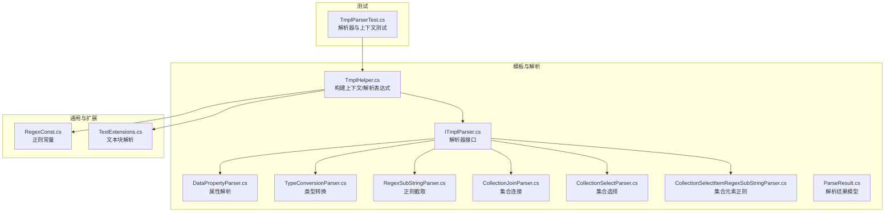
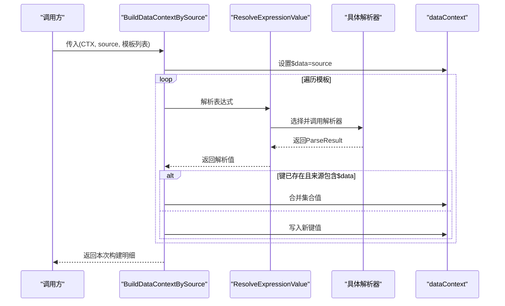
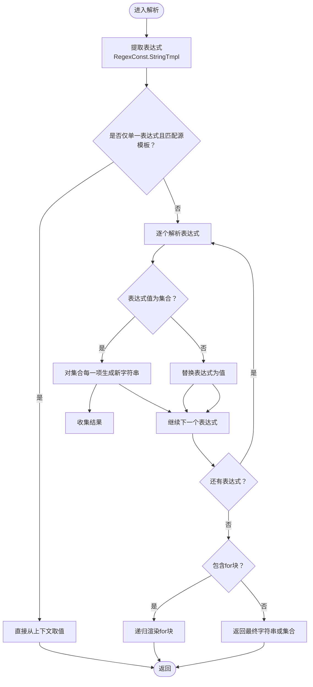
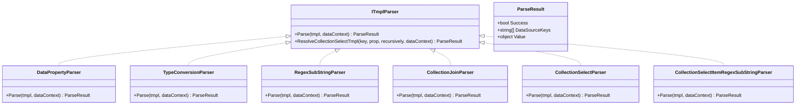
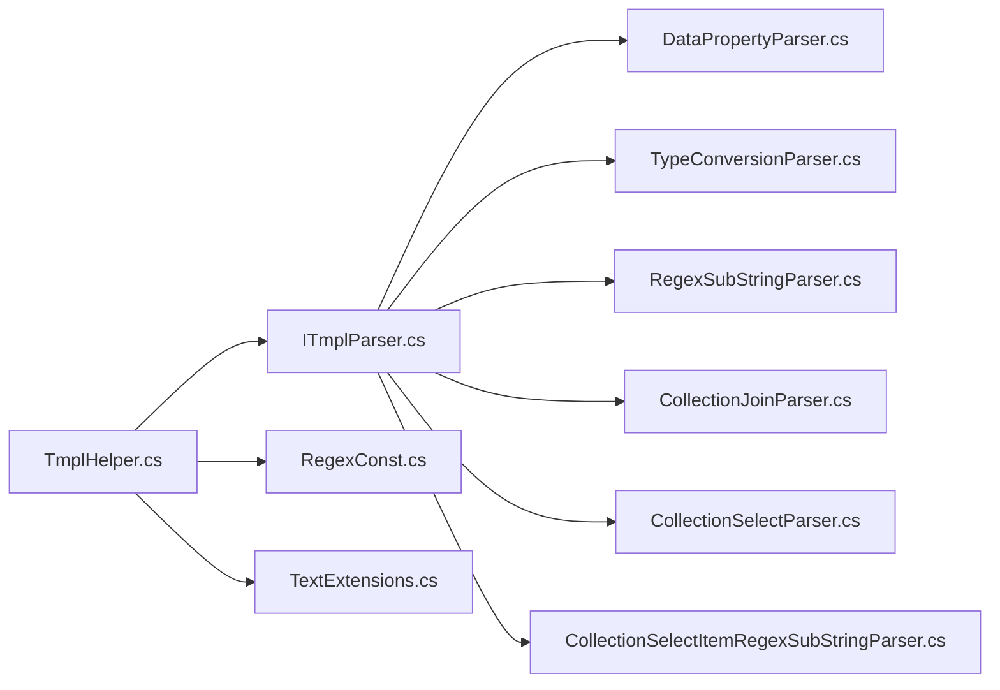

# 数据上下文绑定

<cite>
**本文引用的文件**
- [TmplHelper.cs](file://Sylas.RemoteTasks.Utils/Template/TmplHelper.cs)
- [ITmplParser.cs](file://Sylas.RemoteTasks.Utils/Template/Parser/ITmplParser.cs)
- [DataPropertyParser.cs](file://Sylas.RemoteTasks.Utils/Template/Parser/DataPropertyParser.cs)
- [TypeConversionParser.cs](file://Sylas.RemoteTasks.Utils/Template/Parser/TypeConversionParser.cs)
- [RegexSubStringParser.cs](file://Sylas.RemoteTasks.Utils/Template/Parser/RegexSubStringParser.cs)
- [CollectionJoinParser.cs](file://Sylas.RemoteTasks.Utils/Template/Parser/CollectionJoinParser.cs)
- [CollectionSelectParser.cs](file://Sylas.RemoteTasks.Utils/Template/Parser/CollectionSelectParser.cs)
- [CollectionSelectItemRegexSubStringParser.cs](file://Sylas.RemoteTasks.Utils/Template/Parser/CollectionSelectItemRegexSubStringParser.cs)
- [ParseResult.cs](file://Sylas.RemoteTasks.Utils/Template/Parser/ParseResult.cs)
- [RegexConst.cs](file://Sylas.RemoteTasks.Common/RegexConst.cs)
- [TextExtensions.cs](file://Sylas.RemoteTasks.Utils/Extensions/Text/TextExtensions.cs)
- [TmplParserTest.cs](file://Sylas.RemoteTasks.Test/Tmpl/TmplParserTest.cs)
</cite>

## 目录
1. [简介](#简介)
2. [项目结构](#项目结构)
3. [核心组件](#核心组件)
4. [架构总览](#架构总览)
5. [详细组件分析](#详细组件分析)
6. [依赖关系分析](#依赖关系分析)
7. [性能考量](#性能考量)
8. [故障排查指南](#故障排查指南)
9. [结论](#结论)
10. [附录](#附录)

## 简介
本文件围绕“数据上下文绑定”系统，系统性阐述 BuildDataContextBySource 方法的实现原理、数据上下文构建流程、变量解析机制、模板表达式提取、数据类型转换、集合处理策略等核心能力，并结合测试用例展示如何构建复杂数据上下文、处理嵌套数据结构、实现变量间依赖关系。文档同时说明与模板解析器的协作关系、配置选项、参数与返回值、常见问题及解决方案，兼顾初学者易懂与资深开发者所需的技术深度。

## 项目结构
数据上下文绑定系统主要位于 Utils 模块的 Template 子模块，核心入口为 TmplHelper，解析器接口为 ITmplParser，具体解析器包括属性解析、类型转换、正则截取、集合连接、集合选择等；正则常量定义在 RegexConst 中，文本块解析辅助在 TextExtensions 中；测试用例集中在 TmplParserTest。

图表来源
- [TmplHelper.cs](file://Sylas.RemoteTasks.Utils/Template/TmplHelper.cs#L195-L271)
- [ITmplParser.cs](file://Sylas.RemoteTasks.Utils/Template/Parser/ITmplParser.cs#L14-L103)
- [DataPropertyParser.cs](file://Sylas.RemoteTasks.Utils/Template/Parser/DataPropertyParser.cs#L16-L144)
- [TypeConversionParser.cs](file://Sylas.RemoteTasks.Utils/Template/Parser/TypeConversionParser.cs#L15-L101)
- [RegexSubStringParser.cs](file://Sylas.RemoteTasks.Utils/Template/Parser/RegexSubStringParser.cs#L11-L38)
- [CollectionJoinParser.cs](file://Sylas.RemoteTasks.Utils/Template/Parser/CollectionJoinParser.cs#L13-L71)
- [CollectionSelectParser.cs](file://Sylas.RemoteTasks.Utils/Template/Parser/CollectionSelectParser.cs#L9-L31)
- [CollectionSelectItemRegexSubStringParser.cs](file://Sylas.RemoteTasks.Utils/Template/Parser/CollectionSelectItemRegexSubStringParser.cs#L13-L36)
- [ParseResult.cs](file://Sylas.RemoteTasks.Utils/Template/Parser/ParseResult.cs#L6-L41)
- [RegexConst.cs](file://Sylas.RemoteTasks.Common/RegexConst.cs#L129-L131)
- [TextExtensions.cs](file://Sylas.RemoteTasks.Utils/Extensions/Text/TextExtensions.cs#L18-L85)
- [TmplParserTest.cs](file://Sylas.RemoteTasks.Test/Tmpl/TmplParserTest.cs#L37-L242)

章节来源
- [TmplHelper.cs](file://Sylas.RemoteTasks.Utils/Template/TmplHelper.cs#L195-L271)
- [RegexConst.cs](file://Sylas.RemoteTasks.Common/RegexConst.cs#L129-L131)

## 核心组件
- 数据上下文构建器：BuildDataContextBySource，负责将 source（通常为 $data）与一组模板表达式组合，生成新的上下文键值对，并写入原始 dataContext。
- 模板表达式解析器：ResolveExpressionValue，负责解析字符串模板中的表达式占位符、集合展开、for 循环块渲染、调用具体解析器等。
- 解析器接口与实现：ITmplParser 定义统一解析协议，具体解析器如 DataPropertyParser、TypeConversionParser、RegexSubStringParser、CollectionJoinParser、CollectionSelectParser、CollectionSelectItemRegexSubStringParser 分别承担不同数据处理职责。
- 结果模型：ParseResult，承载解析成功标志、所依赖的数据源键、解析结果值。
- 正则常量：RegexConst.StringTmpl 定义模板表达式匹配规则，支撑表达式提取与解析。
- 文本块解析：TextExtensions 提供 for 循环块的层级识别与递归渲染支持。
- 测试用例：TmplParserTest 展示了属性解析、类型转换、正则截取、集合连接、集合选择等典型场景。

章节来源
- [TmplHelper.cs](file://Sylas.RemoteTasks.Utils/Template/TmplHelper.cs#L461-L634)
- [ITmplParser.cs](file://Sylas.RemoteTasks.Utils/Template/Parser/ITmplParser.cs#L20-L103)
- [ParseResult.cs](file://Sylas.RemoteTasks.Utils/Template/Parser/ParseResult.cs#L6-L41)
- [RegexConst.cs](file://Sylas.RemoteTasks.Common/RegexConst.cs#L129-L131)
- [TextExtensions.cs](file://Sylas.RemoteTasks.Utils/Extensions/Text/TextExtensions.cs#L18-L85)
- [TmplParserTest.cs](file://Sylas.RemoteTasks.Test/Tmpl/TmplParserTest.cs#L37-L242)

## 架构总览
下图展示了 BuildDataContextBySource 的整体工作流：接收 source 与模板列表，将 source 写入 $data，遍历模板表达式，调用解析器提取值，按键覆盖或合并写回 dataContext，并返回本次构建明细。

图表来源
- [TmplHelper.cs](file://Sylas.RemoteTasks.Utils/Template/TmplHelper.cs#L213-L271)
- [TmplHelper.cs](file://Sylas.RemoteTasks.Utils/Template/TmplHelper.cs#L461-L634)
- [ITmplParser.cs](file://Sylas.RemoteTasks.Utils/Template/Parser/ITmplParser.cs#L20-L29)

## 详细组件分析

### BuildDataContextBySource 方法详解
- 功能概述：将 source 作为 $data 缓存到 dataContext，然后逐条解析模板表达式，将解析结果写入 dataContext，并返回本次构建明细。
- 关键行为：
  - 将 source 写入 $data，确保后续解析器可直接访问原始数据源。
  - 对每个模板表达式，先提取目标键与表达式主体，再调用解析器获取值。
  - 若目标键已存在且来源包含 $data，则尝试合并集合（JArray/JToken/普通对象），否则直接覆盖。
  - 记录调试日志，便于追踪解析过程。
- 参数与返回：
  - 参数：dataContext（字典）、source（任意对象）、dataContextBuilderTmpls（模板表达式列表）、logger（可选）。
  - 返回：本次构建明细（键到解析值的映射）。
- 典型用途：基于同一数据源批量派生多个上下文变量，支持多步解析与变量依赖。

章节来源
- [TmplHelper.cs](file://Sylas.RemoteTasks.Utils/Template/TmplHelper.cs#L195-L271)

### 模板表达式解析与变量依赖
- 表达式提取：使用 RegexConst.StringTmpl 提取字符串中的模板占位符（如 $var、${var}、{{var}}、XxxParser[...]）。
- 解析流程：
  - 若模板仅包含单一表达式且与源模板一致，直接从 dataContext 取值。
  - 否则，逐个解析表达式，支持：
    - 字符串替换：将表达式替换为其值。
    - 集合展开：当表达式值为集合时，对集合每一项生成一个新字符串，最终返回字符串集合。
    - for 循环块：通过 TextExtensions 识别 $for ... $forend 块，递归渲染并注入临时上下文变量。
  - 解析器调用：若表达式形如 XxxParser[...]，则反射实例化对应解析器并执行 Parse。
- 自依赖解析：ResolveSelfTmplValues 支持对 dataContext 中的字符串再次解析，使其引用前面已解析的变量。

图表来源
- [TmplHelper.cs](file://Sylas.RemoteTasks.Utils/Template/TmplHelper.cs#L461-L634)
- [RegexConst.cs](file://Sylas.RemoteTasks.Common/RegexConst.cs#L129-L131)
- [TextExtensions.cs](file://Sylas.RemoteTasks.Utils/Extensions/Text/TextExtensions.cs#L18-L85)

章节来源
- [TmplHelper.cs](file://Sylas.RemoteTasks.Utils/Template/TmplHelper.cs#L461-L634)
- [RegexConst.cs](file://Sylas.RemoteTasks.Common/RegexConst.cs#L129-L131)
- [TextExtensions.cs](file://Sylas.RemoteTasks.Utils/Extensions/Text/TextExtensions.cs#L18-L85)

### 解析器体系与职责
- 接口 ITmplParser：定义 Parse(tmpl, dataContext) 与集合选择辅助 ResolveCollectionSelectTmpl。
- DataPropertyParser：从 $data 或任意键中按路径取值，支持索引、属性链、JsonElement/对象/JToken 多形态。
- TypeConversionParser：将字符串/JsonElement/JArray 等转换为 List/Dictionary 等目标类型。
- RegexSubStringParser：基于正则分组从字符串中提取子串。
- CollectionJoinParser：将集合元素以指定分隔符连接为字符串。
- CollectionSelectParser：从集合中选取指定属性组成新集合。
- CollectionSelectItemRegexSubStringParser：对集合元素逐一应用正则分组提取。

图表来源
- [ITmplParser.cs](file://Sylas.RemoteTasks.Utils/Template/Parser/ITmplParser.cs#L20-L103)
- [DataPropertyParser.cs](file://Sylas.RemoteTasks.Utils/Template/Parser/DataPropertyParser.cs#L16-L144)
- [TypeConversionParser.cs](file://Sylas.RemoteTasks.Utils/Template/Parser/TypeConversionParser.cs#L15-L101)
- [RegexSubStringParser.cs](file://Sylas.RemoteTasks.Utils/Template/Parser/RegexSubStringParser.cs#L11-L38)
- [CollectionJoinParser.cs](file://Sylas.RemoteTasks.Utils/Template/Parser/CollectionJoinParser.cs#L13-L71)
- [CollectionSelectParser.cs](file://Sylas.RemoteTasks.Utils/Template/Parser/CollectionSelectParser.cs#L9-L31)
- [CollectionSelectItemRegexSubStringParser.cs](file://Sylas.RemoteTasks.Utils/Template/Parser/CollectionSelectItemRegexSubStringParser.cs#L13-L36)
- [ParseResult.cs](file://Sylas.RemoteTasks.Utils/Template/Parser/ParseResult.cs#L6-L41)

章节来源
- [ITmplParser.cs](file://Sylas.RemoteTasks.Utils/Template/Parser/ITmplParser.cs#L20-L103)
- [DataPropertyParser.cs](file://Sylas.RemoteTasks.Utils/Template/Parser/DataPropertyParser.cs#L16-L144)
- [TypeConversionParser.cs](file://Sylas.RemoteTasks.Utils/Template/Parser/TypeConversionParser.cs#L15-L101)
- [RegexSubStringParser.cs](file://Sylas.RemoteTasks.Utils/Template/Parser/RegexSubStringParser.cs#L11-L38)
- [CollectionJoinParser.cs](file://Sylas.RemoteTasks.Utils/Template/Parser/CollectionJoinParser.cs#L13-L71)
- [CollectionSelectParser.cs](file://Sylas.RemoteTasks.Utils/Template/Parser/CollectionSelectParser.cs#L9-L31)
- [CollectionSelectItemRegexSubStringParser.cs](file://Sylas.RemoteTasks.Utils/Template/Parser/CollectionSelectItemRegexSubStringParser.cs#L13-L36)
- [ParseResult.cs](file://Sylas.RemoteTasks.Utils/Template/Parser/ParseResult.cs#L6-L41)

### 数据类型转换与集合处理策略
- 类型转换：
  - 字符串转 List/Dictionary：支持 JSON 字符串与 JsonElement/JArray 形态。
  - 集合形态：优先识别 JsonElement(Array)、JArray、IEnumerable 等，保证解析器对不同集合形态的兼容。
- 集合处理：
  - CollectionJoinParser：将集合元素 ToString() 后按分隔符连接。
  - CollectionSelectParser：对集合元素按属性路径抽取，支持递归展开。
  - CollectionSelectItemRegexSubStringParser：对集合元素应用正则分组提取，形成新集合。
- 合并策略：
  - 当目标键已存在且来源包含 $data 时，尝试将新值合并到现有集合（JArray/JToken/普通对象），避免覆盖。

章节来源
- [TypeConversionParser.cs](file://Sylas.RemoteTasks.Utils/Template/Parser/TypeConversionParser.cs#L25-L99)
- [CollectionJoinParser.cs](file://Sylas.RemoteTasks.Utils/Template/Parser/CollectionJoinParser.cs#L22-L69)
- [ITmplParser.cs](file://Sylas.RemoteTasks.Utils/Template/Parser/ITmplParser.cs#L39-L102)
- [TmplHelper.cs](file://Sylas.RemoteTasks.Utils/Template/TmplHelper.cs#L240-L268)

### 变量解析机制与模板表达式提取
- 表达式提取：RegexConst.StringTmpl 统一匹配 $var、${var}、{{var}}、XxxParser[...] 等格式。
- 解析顺序：先从 dataContext 取值，再根据值类型决定是直接替换还是集合展开。
- for 循环块：TextExtensions 识别 $for ... $forend，RenderTemplateWithForLoopBlocks 递归渲染，每次循环生成独立上下文，避免变量污染。
- 自依赖解析：ResolveSelfTmplValues 支持对字符串中的表达式二次解析，实现变量间的后向依赖。

章节来源
- [RegexConst.cs](file://Sylas.RemoteTasks.Common/RegexConst.cs#L129-L131)
- [TmplHelper.cs](file://Sylas.RemoteTasks.Utils/Template/TmplHelper.cs#L461-L719)
- [TextExtensions.cs](file://Sylas.RemoteTasks.Utils/Extensions/Text/TextExtensions.cs#L18-L85)

### 与模板解析器的协作关系
- BuildDataContextBySource 通过 ResolveExpressionValue 调用具体解析器，解析器返回 ParseResult，其中包含 DataSourceKeys 与 Value。
- 解析器内部通过反射缓存实例，减少重复创建开销。
- 解析器之间可组合使用，例如先用 DataPropertyParser 取值，再用 RegexSubStringParser 截取，最后用 TypeConversionParser 转换类型。

章节来源
- [TmplHelper.cs](file://Sylas.RemoteTasks.Utils/Template/TmplHelper.cs#L588-L634)
- [ITmplParser.cs](file://Sylas.RemoteTasks.Utils/Template/Parser/ITmplParser.cs#L20-L29)

### 复杂数据上下文构建示例（来自测试）
- 属性解析：从 $data[0].IDPATH 获取路径，再用 RegexSubStringParser 提取 appid。
- 类型转换：将字符串数组转换为 List/Dictionary，再进一步取某元素属性。
- 集合处理：将菜单 ID 列表连接为字符串；对集合元素应用正则分组提取。
- 变量依赖：先解析中间变量（如 idpath），再在后续模板中引用该变量。

章节来源
- [TmplParserTest.cs](file://Sylas.RemoteTasks.Test/Tmpl/TmplParserTest.cs#L37-L242)

## 依赖关系分析
- 组件耦合：
  - TmplHelper 依赖 ITmplParser 及其具体实现，通过反射实例化解析器，降低编译期耦合。
  - 解析器之间无直接依赖，职责清晰，便于扩展与维护。
- 外部依赖：
  - 正则表达式：RegexConst.StringTmpl、AssignmentRulesTmpl 等。
  - 文本块解析：TextExtensions 提供 for 循环块的层级识别。
  - 日志：TmplHelper 内部使用 LoggerHelper 写入调试日志。
- 潜在循环依赖：
  - 通过接口与反射解耦，未见直接循环依赖。

图表来源
- [TmplHelper.cs](file://Sylas.RemoteTasks.Utils/Template/TmplHelper.cs#L1-L20)
- [ITmplParser.cs](file://Sylas.RemoteTasks.Utils/Template/Parser/ITmplParser.cs#L11-L21)
- [RegexConst.cs](file://Sylas.RemoteTasks.Common/RegexConst.cs#L129-L131)
- [TextExtensions.cs](file://Sylas.RemoteTasks.Utils/Extensions/Text/TextExtensions.cs#L18-L85)

章节来源
- [TmplHelper.cs](file://Sylas.RemoteTasks.Utils/Template/TmplHelper.cs#L1-L20)
- [ITmplParser.cs](file://Sylas.RemoteTasks.Utils/Template/Parser/ITmplParser.cs#L11-L21)
- [RegexConst.cs](file://Sylas.RemoteTasks.Common/RegexConst.cs#L129-L131)
- [TextExtensions.cs](file://Sylas.RemoteTasks.Utils/Extensions/Text/TextExtensions.cs#L18-L85)

## 性能考量
- 解析器实例缓存：TmplHelper 内部以字典缓存解析器实例，避免重复反射创建，提升性能。
- 集合展开成本：当表达式值为集合时，会生成多个字符串或对象，注意控制集合规模。
- 正则匹配：RegexConst.StringTmpl 与各解析器内部正则匹配需避免过度复杂模式，必要时预编译正则。
- 日志开销：调试日志在开发阶段非常有用，生产环境建议关闭或降低日志级别。

## 故障排查指南
- 未找到解析器：当 XxxParser 不存在或无法实例化时，抛出异常。请确认命名正确且实现了 ITmplParser。
- 表达式不匹配：RegexSubStringParser/TypeConversionParser 等要求特定语法，若不满足将返回失败。请核对模板格式。
- 集合类型不匹配：CollectionJoinParser/CollectionSelectParser 要求集合类型，非集合会抛异常。请先用 TypeConversionParser 转换。
- 属性路径错误：DataPropertyParser 在属性链中任一节点缺失会抛异常。请检查键名大小写与路径正确性。
- for 循环块异常：RenderTemplateWithForLoopBlocks 会在集合不可迭代或语法错误时抛异常。请检查 $for 语法与集合来源。
- 变量未定义：解析器在 dataContext 中找不到键时会返回失败或抛异常。请先用 BuildDataContextBySource 填充所需变量。

章节来源
- [TmplHelper.cs](file://Sylas.RemoteTasks.Utils/Template/TmplHelper.cs#L588-L634)
- [DataPropertyParser.cs](file://Sylas.RemoteTasks.Utils/Template/Parser/DataPropertyParser.cs#L32-L142)
- [TypeConversionParser.cs](file://Sylas.RemoteTasks.Utils/Template/Parser/TypeConversionParser.cs#L25-L99)
- [RegexSubStringParser.cs](file://Sylas.RemoteTasks.Utils/Template/Parser/RegexSubStringParser.cs#L20-L36)
- [CollectionJoinParser.cs](file://Sylas.RemoteTasks.Utils/Template/Parser/CollectionJoinParser.cs#L22-L69)

## 结论
数据上下文绑定系统通过 BuildDataContextBySource 与解析器生态，实现了从原始数据源到丰富上下文变量的自动化构建。其设计强调可扩展（解析器接口）、可组合（解析器链式调用）、可维护（正则与文本块解析分离）。配合测试用例，用户可以快速掌握属性解析、类型转换、集合处理与变量依赖等核心能力，并在复杂业务场景中灵活运用。

## 附录
- 配置选项与参数
  - BuildDataContextBySource
    - dataContext：字典，作为上下文容器。
    - source：任意对象，通常为 $data。
    - dataContextBuilderTmpls：模板表达式列表，形如 "$key=...Parser[...]"。
    - logger：可选，用于记录调试信息。
  - ResolveExpressionValue
    - tmplWithParser：包含模板占位符或解析器调用的字符串。
    - dataContextObject：上下文对象（字典/对象/空）。
- 返回值
  - BuildDataContextBySource：返回本次构建明细（键到解析值的映射）。
  - ResolveExpressionValue：返回解析后的值（字符串/集合/对象等）。
- 常见模板表达式
  - 属性解析：DataPropertyParser[$data[0].IDPATH]
  - 正则截取：RegexSubStringParser[$idpath reg `(?<appid>\w+)/` appid]
  - 类型转换：TypeConversionParser[$appItems as List]
  - 集合连接：CollectionJoinParser[menuIds join ,]
  - 集合选择：CollectionSelectParser[$deployIds=$data select DeployId]
  - 集合元素正则：CollectionSelectItemRegexSubStringParser[${key} select prop -r reg \`pattern\` group]

章节来源
- [TmplHelper.cs](file://Sylas.RemoteTasks.Utils/Template/TmplHelper.cs#L195-L271)
- [TmplHelper.cs](file://Sylas.RemoteTasks.Utils/Template/TmplHelper.cs#L461-L634)
- [TmplParserTest.cs](file://Sylas.RemoteTasks.Test/Tmpl/TmplParserTest.cs#L37-L242)