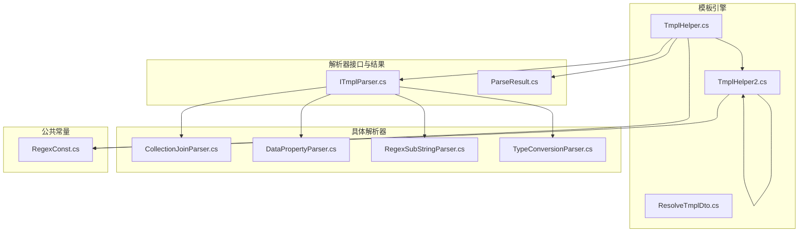
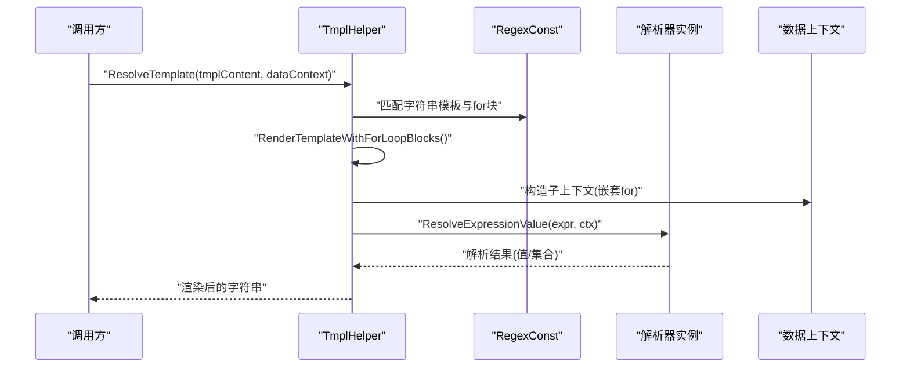
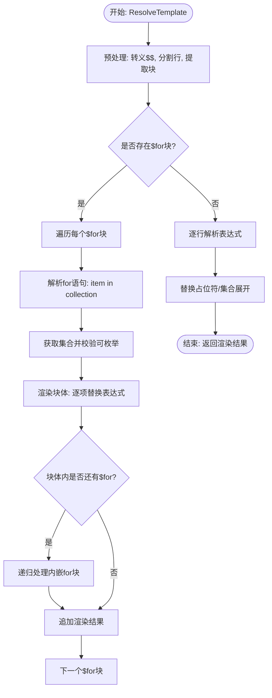
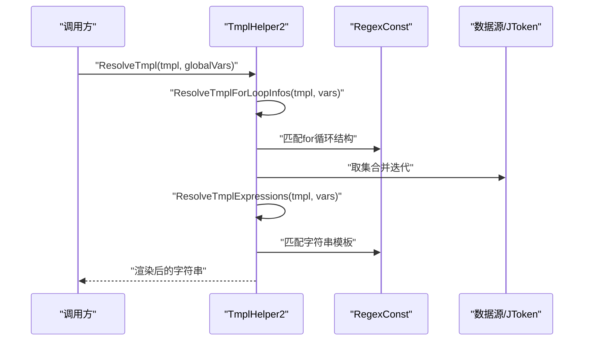
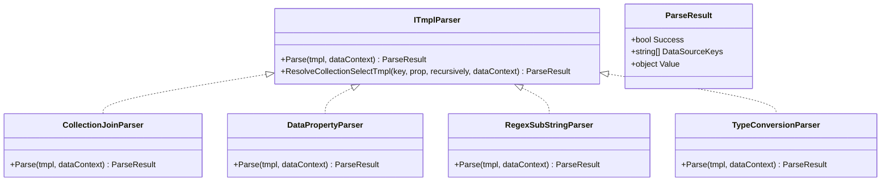
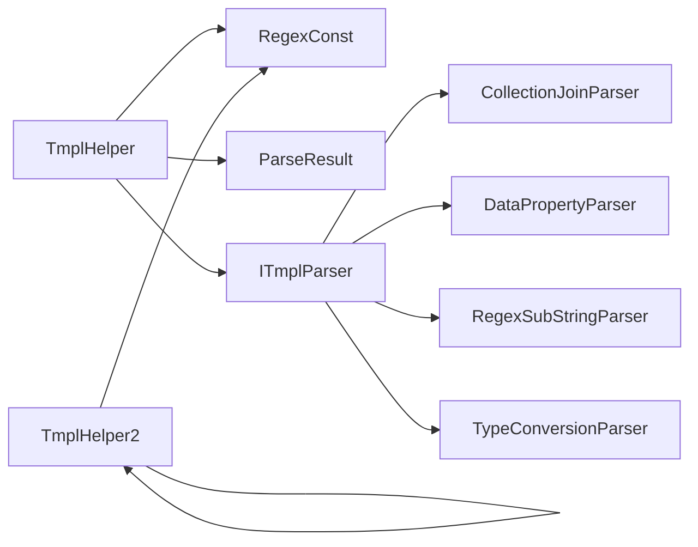

# 模板处理引擎

<cite>
**本文引用的文件**
- [TmplHelper.cs](file://Sylas.RemoteTasks.Utils/Template/TmplHelper.cs)
- [TmplHelper2.cs](file://Sylas.RemoteTasks.Utils/Template/TmplHelper2.cs)
- [ITmplParser.cs](file://Sylas.RemoteTasks.Utils/Template/Parser/ITmplParser.cs)
- [ParseResult.cs](file://Sylas.RemoteTasks.Utils/Template/Parser/ParseResult.cs)
- [CollectionJoinParser.cs](file://Sylas.RemoteTasks.Utils/Template/Parser/CollectionJoinParser.cs)
- [DataPropertyParser.cs](file://Sylas.RemoteTasks.Utils/Template/Parser/DataPropertyParser.cs)
- [RegexSubStringParser.cs](file://Sylas.RemoteTasks.Utils/Template/Parser/RegexSubStringParser.cs)
- [TypeConversionParser.cs](file://Sylas.RemoteTasks.Utils/Template/Parser/TypeConversionParser.cs)
- [RegexConst.cs](file://Sylas.RemoteTasks.Common/RegexConst.cs)
- [ResolveTmplDto.cs](file://Sylas.RemoteTasks.Utils/Template/Dtos/ResolveTmplDto.cs)
</cite>

## 目录
1. [简介](#简介)
2. [项目结构](#项目结构)
3. [核心组件](#核心组件)
4. [架构总览](#架构总览)
5. [详细组件分析](#详细组件分析)
6. [依赖分析](#依赖分析)
7. [性能考虑](#性能考虑)
8. [故障排查指南](#故障排查指南)
9. [结论](#结论)
10. [附录](#附录)

## 简介
本模板处理引擎提供两类模板解析能力：
- TmplHelper：面向复杂文本模板，支持 $for 循环块、表达式解析、多解析器链路（Parser）与数据上下文联动，适合复杂渲染场景。
- TmplHelper2：面向简洁字符串模板，支持 for 循环语法与表达式替换，适合快速变量替换与简单渲染。

两者均通过统一的数据上下文（Dictionary<string, object>）与正则表达式驱动，具备良好的扩展性与可维护性。

## 项目结构
模板引擎相关代码主要位于 Utils 工程下的 Template 与 Template/Parser 子目录，配合公共正则常量与 DTO 定义，形成清晰的层次化结构。

图表来源
- [TmplHelper.cs](file://Sylas.RemoteTasks.Utils/Template/TmplHelper.cs#L1-L740)
- [TmplHelper2.cs](file://Sylas.RemoteTasks.Utils/Template/TmplHelper2.cs#L1-L416)
- [ITmplParser.cs](file://Sylas.RemoteTasks.Utils/Template/Parser/ITmplParser.cs#L1-L105)
- [ParseResult.cs](file://Sylas.RemoteTasks.Utils/Template/Parser/ParseResult.cs#L1-L42)
- [CollectionJoinParser.cs](file://Sylas.RemoteTasks.Utils/Template/Parser/CollectionJoinParser.cs#L1-L72)
- [DataPropertyParser.cs](file://Sylas.RemoteTasks.Utils/Template/Parser/DataPropertyParser.cs#L1-L145)
- [RegexSubStringParser.cs](file://Sylas.RemoteTasks.Utils/Template/Parser/RegexSubStringParser.cs#L1-L39)
- [TypeConversionParser.cs](file://Sylas.RemoteTasks.Utils/Template/Parser/TypeConversionParser.cs#L1-L102)
- [RegexConst.cs](file://Sylas.RemoteTasks.Common/RegexConst.cs#L1-L161)
- [ResolveTmplDto.cs](file://Sylas.RemoteTasks.Utils/Template/Dtos/ResolveTmplDto.cs#L1-L18)

章节来源
- [TmplHelper.cs](file://Sylas.RemoteTasks.Utils/Template/TmplHelper.cs#L1-L740)
- [TmplHelper2.cs](file://Sylas.RemoteTasks.Utils/Template/TmplHelper2.cs#L1-L416)
- [RegexConst.cs](file://Sylas.RemoteTasks.Common/RegexConst.cs#L1-L161)

## 核心组件
- TmplHelper：负责模板解析、$for 循环块处理、表达式解析与解析器选择、文本块处理与渲染。
- TmplHelper2：负责 for 循环语法解析与表达式替换，适合轻量字符串模板。
- ITmplParser/ParseResult：定义解析器接口与解析结果结构，支撑多种解析器扩展。
- 具体解析器：CollectionJoinParser、DataPropertyParser、RegexSubStringParser、TypeConversionParser。
- RegexConst：提供字符串模板、正则表达式等通用正则常量。
- ResolveTmplDto：模板解析输入 DTO（模板文本与数据模型 JSON 字符串）。

章节来源
- [TmplHelper.cs](file://Sylas.RemoteTasks.Utils/Template/TmplHelper.cs#L195-L271)
- [TmplHelper2.cs](file://Sylas.RemoteTasks.Utils/Template/TmplHelper2.cs#L27-L31)
- [ITmplParser.cs](file://Sylas.RemoteTasks.Utils/Template/Parser/ITmplParser.cs#L20-L29)
- [ParseResult.cs](file://Sylas.RemoteTasks.Utils/Template/Parser/ParseResult.cs#L6-L39)
- [RegexConst.cs](file://Sylas.RemoteTasks.Common/RegexConst.cs#L128-L131)
- [ResolveTmplDto.cs](file://Sylas.RemoteTasks.Utils/Template/Dtos/ResolveTmplDto.cs#L6-L16)

## 架构总览
模板引擎采用“表达式解析 + 解析器链 + 数据上下文”的架构模式：
- 表达式解析：识别模板中的占位符（如 $var、${var}、{{var}}、XxxParser[...]），并按规则替换。
- 解析器链：根据表达式前缀选择对应解析器（如 DataPropertyParser、RegexSubStringParser 等），完成复杂取值、过滤、转换。
- 数据上下文：统一的 Dictionary<string, object>，既承载原始数据（如 $data），也承载解析中间结果与临时变量。
- 文本块与循环：对包含 $for/$forend 的块进行识别与渲染，支持嵌套循环与上下文隔离。

图表来源
- [TmplHelper.cs](file://Sylas.RemoteTasks.Utils/Template/TmplHelper.cs#L339-L449)
- [TmplHelper.cs](file://Sylas.RemoteTasks.Utils/Template/TmplHelper.cs#L641-L719)
- [RegexConst.cs](file://Sylas.RemoteTasks.Common/RegexConst.cs#L128-L131)

## 详细组件分析

### 组件一：TmplHelper（复杂模板解析）
- 功能职责
  - 将任意对象转为数据上下文字典，统一处理。
  - 分割模板为行，识别 $for/$forend 块，支持嵌套循环。
  - 对非循环行进行表达式解析与替换。
  - 支持解析器链：根据表达式前缀选择解析器，返回解析结果。
- 关键流程
  - 模板预处理：转义 $$，分割行，提取块与行信息。
  - $for 循环块：解析 for 语句、获取集合、逐项渲染块体，递归处理内嵌循环。
  - 表达式解析：提取模板占位符，按规则替换；当表达式为集合时，生成字符串集合。
  - 解析器选择：反射创建解析器实例，调用 Parse 返回 ParseResult。
- 数据结构与复杂度
  - 表达式匹配使用正则，时间复杂度近似 O(n)（n 为模板长度）。
  - 集合渲染为 O(k*m)，k 为集合大小，m 为块体行数。
  - 解析器调用按需创建，避免重复实例化。
- 错误处理
  - 缺少 for 块结束、集合不可迭代、解析器未找到、解析结果缺失数据源键等均抛出异常。
- 性能建议
  - 大集合渲染时优先使用解析器链一次性输出，减少多次字符串替换。
  - 避免在循环体内频繁创建大对象，尽量复用上下文。

图表来源
- [TmplHelper.cs](file://Sylas.RemoteTasks.Utils/Template/TmplHelper.cs#L339-L449)
- [TmplHelper.cs](file://Sylas.RemoteTasks.Utils/Template/TmplHelper.cs#L641-L719)

章节来源
- [TmplHelper.cs](file://Sylas.RemoteTasks.Utils/Template/TmplHelper.cs#L339-L449)
- [TmplHelper.cs](file://Sylas.RemoteTasks.Utils/Template/TmplHelper.cs#L461-L634)
- [TmplHelper.cs](file://Sylas.RemoteTasks.Utils/Template/TmplHelper.cs#L641-L719)

### 组件二：TmplHelper2（字符串模板解析）
- 功能职责
  - 解析 for 循环语法 for (item in $collection) { ... }，支持集合迭代与上下文注入。
  - 解析表达式占位符，支持数组拼接为字符串等简单操作。
  - 支持表达式提取器（Extractor）链式管道，将结果写回存储容器。
- 关键流程
  - for 循环解析：正则匹配 for(...) 结构，获取集合与迭代变量，逐项替换后拼接。
  - 表达式解析：基于 RegexConst.StringTmpl 提取占位符，按上下文取值并替换。
  - 提取器：支持 key=value 或 key.add(value) 形式，支持管道链式调用。
- 适用场景
  - 快速变量替换、简单数组拼接、轻量模板渲染。

图表来源
- [TmplHelper2.cs](file://Sylas.RemoteTasks.Utils/Template/TmplHelper2.cs#L27-L31)
- [TmplHelper2.cs](file://Sylas.RemoteTasks.Utils/Template/TmplHelper2.cs#L369-L396)
- [TmplHelper2.cs](file://Sylas.RemoteTasks.Utils/Template/TmplHelper2.cs#L39-L81)

章节来源
- [TmplHelper2.cs](file://Sylas.RemoteTasks.Utils/Template/TmplHelper2.cs#L27-L31)
- [TmplHelper2.cs](file://Sylas.RemoteTasks.Utils/Template/TmplHelper2.cs#L369-L396)
- [TmplHelper2.cs](file://Sylas.RemoteTasks.Utils/Template/TmplHelper2.cs#L39-L81)

### 组件三：解析器体系（ITmplParser 与具体实现）
- 接口与结果
  - ITmplParser：定义 Parse(tmpl, dataContext) 与静态集合选择辅助方法。
  - ParseResult：封装 Success、DataSourceKeys、Value。
- 具体解析器
  - CollectionJoinParser：将集合按分隔符拼接为字符串。
  - DataPropertyParser：从对象/集合中按路径取值，支持索引与属性链。
  - RegexSubStringParser：基于正则分组截取子串。
  - TypeConversionParser：将字符串或集合转换为 List/Object 等目标类型。
- 设计要点
  - 解析器通过反射按名称创建实例，避免硬编码耦合。
  - 解析器内部使用正则匹配表达式，解析失败返回 ParseResult(false)。

图表来源
- [ITmplParser.cs](file://Sylas.RemoteTasks.Utils/Template/Parser/ITmplParser.cs#L20-L29)
- [ParseResult.cs](file://Sylas.RemoteTasks.Utils/Template/Parser/ParseResult.cs#L6-L39)
- [CollectionJoinParser.cs](file://Sylas.RemoteTasks.Utils/Template/Parser/CollectionJoinParser.cs#L22-L69)
- [DataPropertyParser.cs](file://Sylas.RemoteTasks.Utils/Template/Parser/DataPropertyParser.cs#L25-L142)
- [RegexSubStringParser.cs](file://Sylas.RemoteTasks.Utils/Template/Parser/RegexSubStringParser.cs#L20-L36)
- [TypeConversionParser.cs](file://Sylas.RemoteTasks.Utils/Template/Parser/TypeConversionParser.cs#L25-L99)

章节来源
- [ITmplParser.cs](file://Sylas.RemoteTasks.Utils/Template/Parser/ITmplParser.cs#L20-L103)
- [ParseResult.cs](file://Sylas.RemoteTasks.Utils/Template/Parser/ParseResult.cs#L6-L39)
- [CollectionJoinParser.cs](file://Sylas.RemoteTasks.Utils/Template/Parser/CollectionJoinParser.cs#L22-L69)
- [DataPropertyParser.cs](file://Sylas.RemoteTasks.Utils/Template/Parser/DataPropertyParser.cs#L25-L142)
- [RegexSubStringParser.cs](file://Sylas.RemoteTasks.Utils/Template/Parser/RegexSubStringParser.cs#L20-L36)
- [TypeConversionParser.cs](file://Sylas.RemoteTasks.Utils/Template/Parser/TypeConversionParser.cs#L25-L99)

### 组件四：正则表达式与文本块处理
- 正则常量
  - StringTmpl：匹配字符串模板（包括 {{...}}、${...}、$var、XxxParser[...]）。
  - AssignmentRulesTmpl：用于复杂赋值规则的正则（历史注释功能）。
- 文本块处理
  - TmplHelper：将模板按行分割，识别 $for/$forend 块，支持跨行块体与嵌套。
  - TmplHelper2：使用正则匹配 for (item in $collection) {...} 结构。

章节来源
- [RegexConst.cs](file://Sylas.RemoteTasks.Common/RegexConst.cs#L128-L131)
- [TmplHelper.cs](file://Sylas.RemoteTasks.Utils/Template/TmplHelper.cs#L357-L359)
- [TmplHelper.cs](file://Sylas.RemoteTasks.Utils/Template/TmplHelper.cs#L426-L442)
- [TmplHelper2.cs](file://Sylas.RemoteTasks.Utils/Template/TmplHelper2.cs#L371-L376)

### 组件五：数据上下文与绑定协作
- 上下文构建
  - BuildDataContextBySource：将 source ($data) 与 builder 模板列表解析为 dataContext。
  - 支持解析器链：CollectionJoinParser、CollectionPlusParser、CollectionSelectParser、CollectionSelectItemRegexSubStringParser、DataPropertyParser、RegexSubStringParser、TypeConversionParser。
- 自引用解析
  - ResolveSelfTmplValues：对 dataContext 中的字符串再次解析其中的模板表达式，支持变量互相引用。
- 绑定关系
  - $for 循环中，每项都会生成新的上下文副本，避免污染父级上下文。
  - 表达式解析时，先从 dataContext 取值，再交由解析器处理。

章节来源
- [TmplHelper.cs](file://Sylas.RemoteTasks.Utils/Template/TmplHelper.cs#L213-L271)
- [TmplHelper.cs](file://Sylas.RemoteTasks.Utils/Template/TmplHelper.cs#L314-L328)
- [TmplHelper.cs](file://Sylas.RemoteTasks.Utils/Template/TmplHelper.cs#L689-L693)

## 依赖分析
- 模块内聚与耦合
  - TmplHelper 与 TmplHelper2 分别承担不同场景，职责清晰，耦合度低。
  - 解析器通过接口解耦，新增解析器只需实现 ITmplParser。
- 外部依赖
  - 正则表达式来自 RegexConst。
  - JSON 序列化/反序列化用于上下文转换与结果输出。
- 潜在循环依赖
  - 无直接循环依赖；解析器通过反射创建，避免编译期耦合。

图表来源
- [TmplHelper.cs](file://Sylas.RemoteTasks.Utils/Template/TmplHelper.cs#L1-L740)
- [TmplHelper2.cs](file://Sylas.RemoteTasks.Utils/Template/TmplHelper2.cs#L1-L416)
- [ITmplParser.cs](file://Sylas.RemoteTasks.Utils/Template/Parser/ITmplParser.cs#L1-L105)
- [RegexConst.cs](file://Sylas.RemoteTasks.Common/RegexConst.cs#L1-L161)

章节来源
- [TmplHelper.cs](file://Sylas.RemoteTasks.Utils/Template/TmplHelper.cs#L1-L740)
- [TmplHelper2.cs](file://Sylas.RemoteTasks.Utils/Template/TmplHelper2.cs#L1-L416)
- [ITmplParser.cs](file://Sylas.RemoteTasks.Utils/Template/Parser/ITmplParser.cs#L1-L105)
- [RegexConst.cs](file://Sylas.RemoteTasks.Common/RegexConst.cs#L1-L161)

## 性能考虑
- 正则匹配：字符串模板与 for 循环匹配均为线性扫描，注意模板规模与嵌套深度。
- 集合渲染：集合大小与块体行数决定渲染成本，建议在解析器层一次性输出。
- 上下文复制：嵌套循环每次复制上下文，注意内存占用；可优化为增量覆盖策略。
- 解析器缓存：TmplHelper 对解析器实例进行缓存，避免重复反射创建。

## 故障排查指南
- 常见错误与定位
  - for 循环块不完整：缺少 $forend 或行数不足，抛出异常。
  - 表达式不可迭代：集合对象不可枚举，抛出异常。
  - 解析器未找到：解析器名称错误或未注册，抛出异常。
  - 解析结果缺失数据源键：解析成功但未返回 DataSourceKeys，抛出异常。
  - 表达式提取器异常：.add 表达式格式错误或目标键不是集合，抛出异常。
- 排查步骤
  - 检查模板中 $for/$forend 匹配与嵌套层级。
  - 校验数据上下文中集合类型与键名大小写。
  - 在解析器调用前后打印中间结果，确认 DataSourceKeys。
  - 使用日志记录模板解析过程，定位替换失败点。

章节来源
- [TmplHelper.cs](file://Sylas.RemoteTasks.Utils/Template/TmplHelper.cs#L381-L390)
- [TmplHelper.cs](file://Sylas.RemoteTasks.Utils/Template/TmplHelper.cs#L394-L396)
- [TmplHelper.cs](file://Sylas.RemoteTasks.Utils/Template/TmplHelper.cs#L612-L616)
- [TmplHelper.cs](file://Sylas.RemoteTasks.Utils/Template/TmplHelper.cs#L632-L633)
- [TmplHelper2.cs](file://Sylas.RemoteTasks.Utils/Template/TmplHelper2.cs#L107-L123)

## 结论
该模板处理引擎通过“表达式解析 + 解析器链 + 数据上下文 + 文本块处理”的组合，实现了从简单字符串替换到复杂循环渲染的全栈能力。TmplHelper 适合复杂场景，TmplHelper2 适合轻量场景。解析器体系通过接口抽象与反射机制，提供了良好的扩展性。建议在生产环境中结合日志与单元测试，确保模板与数据上下文的稳定性与性能。

## 附录
- 配置选项与参数
  - TmplHelper.ResolveTemplate(tmplContent, dataContextObject)
    - tmplContent：模板文本
    - dataContextObject：数据上下文（Dictionary<string, object> 或任意对象）
    - 返回：渲染后的字符串
  - TmplHelper2.ResolveTmpl(tmpl, globalVars, ignoreNotExistExpressions=false)
    - tmpl：模板文本
    - globalVars：全局变量（对象或字典）
    - ignoreNotExistExpressions：是否忽略不存在的表达式
    - 返回：渲染后的字符串
  - TmplHelper.BuildDataContextBySource(source, dataContextBuilderTmpls, dataContext, logger)
    - source：数据源
    - dataContextBuilderTmpls：builder 模板列表（形如 $key=...）
    - dataContext：输出数据上下文
    - 返回：构建详情字典
  - ResolveTmplDto
    - TmplTxt：模板文本
    - DatamodelJson：数据模型 JSON 字符串
- 示例参考
  - 复杂模板渲染与嵌套循环：参见 TmplHelper.ResolveTemplate 与 RenderTemplateWithForLoopBlocks 的实现。
  - 表达式解析与解析器链：参见 TmplHelper.ResolveExpressionValue 与 ITmplParser.Parse 的调用链。
  - 字符串模板与 for 循环：参见 TmplHelper2.ResolveTmpl 与 ResolveTmplForLoopInfos 的实现。

章节来源
- [TmplHelper.cs](file://Sylas.RemoteTasks.Utils/Template/TmplHelper.cs#L339-L353)
- [TmplHelper2.cs](file://Sylas.RemoteTasks.Utils/Template/TmplHelper2.cs#L27-L31)
- [TmplHelper.cs](file://Sylas.RemoteTasks.Utils/Template/TmplHelper.cs#L213-L271)
- [ResolveTmplDto.cs](file://Sylas.RemoteTasks.Utils/Template/Dtos/ResolveTmplDto.cs#L6-L16)