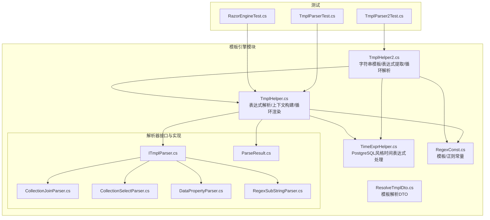
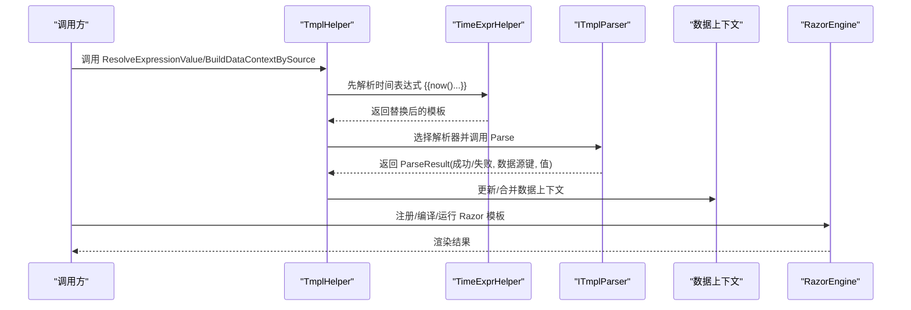
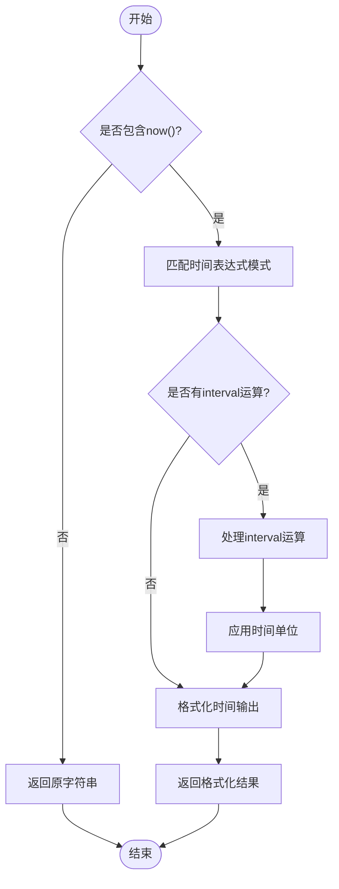
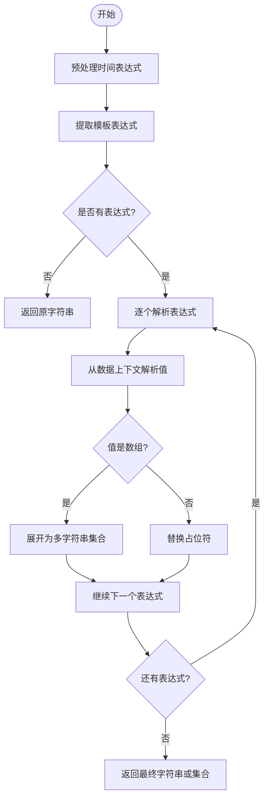
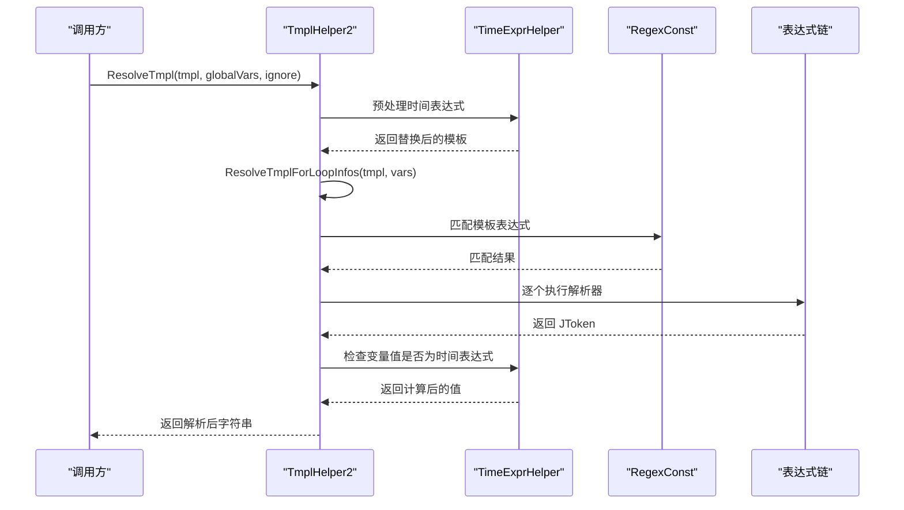
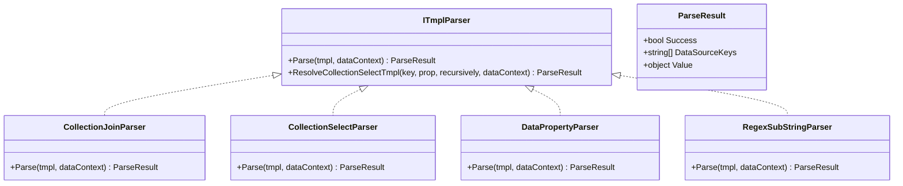
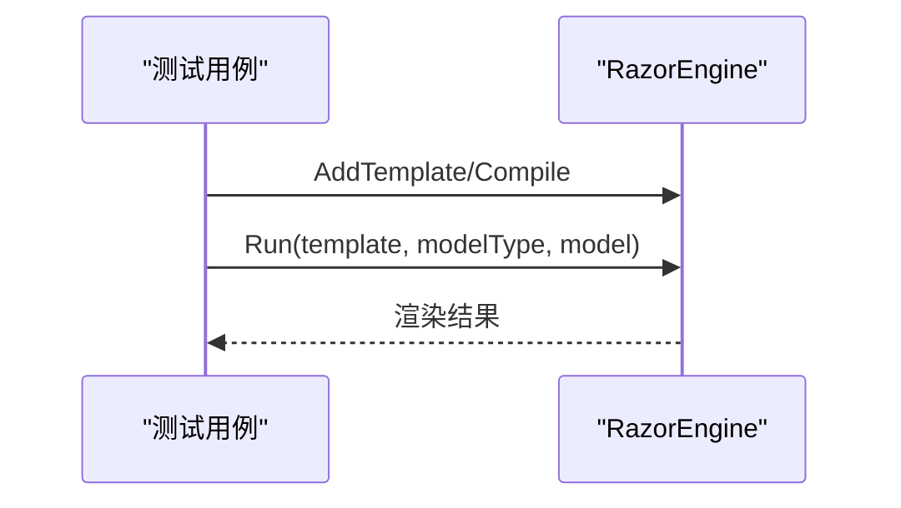
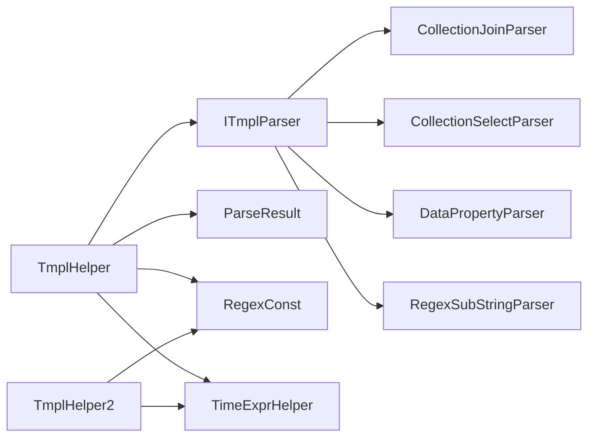

# 模板引擎系统

<cite>
**本文档引用的文件**
- [TmplHelper.cs](file://Sylas.RemoteTasks.Utils/Template/TmplHelper.cs)
- [TmplHelper2.cs](file://Sylas.RemoteTasks.Utils/Template/TmplHelper2.cs)
- [TimeExprHelper.cs](file://Sylas.RemoteTasks.Utils/Template/TimeExprHelper.cs)
- [ITmplParser.cs](file://Sylas.RemoteTasks.Utils/Template/Parser/ITmplParser.cs)
- [ParseResult.cs](file://Sylas.RemoteTasks.Utils/Template/Parser/ParseResult.cs)
- [CollectionJoinParser.cs](file://Sylas.RemoteTasks.Utils/Template/Parser/CollectionJoinParser.cs)
- [CollectionSelectParser.cs](file://Sylas.RemoteTasks.Utils/Template/Parser/CollectionSelectParser.cs)
- [DataPropertyParser.cs](file://Sylas.RemoteTasks.Utils/Template/Parser/DataPropertyParser.cs)
- [RegexSubStringParser.cs](file://Sylas.RemoteTasks.Utils/Template/Parser/RegexSubStringParser.cs)
- [ResolveTmplDto.cs](file://Sylas.RemoteTasks.Utils/Template/Dtos/ResolveTmplDto.cs)
- [RegexConst.cs](file://Sylas.RemoteTasks.Common/RegexConst.cs)
- [RazorEngineTest.cs](file://Sylas.RemoteTasks.Test/Tmpl/RazorEngineTest.cs)
- [TmplParserTest.cs](file://Sylas.RemoteTasks.Test/Tmpl/TmplParserTest.cs)
- [TmplParser2Test.cs](file://Sylas.RemoteTasks.Test/Tmpl/TmplParser2Test.cs)
</cite>

## 更新摘要
**变更内容**
- 新增 TimeExprHelper 类，支持 PostgreSQL 风格的时间表达式处理
- 在 TmplHelper 和 TmplHelper2 中集成时间表达式解析功能
- 扩展模板引擎的时间处理能力，支持 now() 函数、interval 语法、多种时间单位支持和格式输出选项

## 目录
1. [简介](#简介)
2. [项目结构](#项目结构)
3. [核心组件](#核心组件)
4. [架构总览](#架构总览)
5. [详细组件分析](#详细组件分析)
6. [依赖关系分析](#依赖关系分析)
7. [性能考虑](#性能考虑)
8. [故障排除指南](#故障排除指南)
9. [结论](#结论)
10. [附录](#附录)

## 简介
本模板引擎系统由三套互补的模板解析能力构成：一套基于自定义解析器（XxxParser）的表达式解析与数据上下文构建；另一套基于 RazorEngine 的视图模板渲染；第三套为新增的 PostgreSQL 风格时间表达式处理。系统通过统一的模板表达式语法与解析器接口，实现了对集合、属性、正则、类型转换、时间计算等多种场景的灵活处理，并支持嵌套循环与上下文变量自解析。

## 项目结构
模板引擎相关代码主要位于 Utils 工程的 Template 与 Template/Parser 目录下，配合公共常量与测试用例形成完整的功能闭环。新增的 TimeExprHelper 类提供了强大的时间表达式处理能力。

```mermaid
graph TB
subgraph "模板引擎模块"
TH["TmplHelper.cs<br/>表达式解析/上下文构建/循环渲染"]
TH2["TmplHelper2.cs<br/>字符串模板/表达式提取/循环解析"]
TEH["TimeExprHelper.cs<br/>PostgreSQL风格时间表达式处理"]
DTO["ResolveTmplDto.cs<br/>模板解析DTO"]
subgraph "解析器接口与实现"
IF["ITmplParser.cs"]
PR["ParseResult.cs"]
CJ["CollectionJoinParser.cs"]
CS["CollectionSelectParser.cs"]
DP["DataPropertyParser.cs"]
RS["RegexSubStringParser.cs"]
end
RC["RegexConst.cs<br/>模板/正则常量"]
end
subgraph "测试"
RT["RazorEngineTest.cs"]
TP1["TmplParserTest.cs"]
TP2["TmplParser2Test.cs"]
end
TH --> IF
TH2 --> RC
TH --> RC
TH --> PR
TH --> TEH
TH2 --> TEH
IF --> CJ
IF --> CS
IF --> DP
IF --> RS
TH2 --> TH
RT --> TH
TP1 --> TH
TP2 --> TH2
```

**图表来源**
- [TmplHelper.cs:1-742](file://Sylas.RemoteTasks.Utils/Template/TmplHelper.cs#L1-L742)
- [TmplHelper2.cs:1-419](file://Sylas.RemoteTasks.Utils/Template/TmplHelper2.cs#L1-L419)
- [TimeExprHelper.cs:1-106](file://Sylas.RemoteTasks.Utils/Template/TimeExprHelper.cs#L1-L106)
- [ITmplParser.cs:1-105](file://Sylas.RemoteTasks.Utils/Template/Parser/ITmplParser.cs#L1-L105)
- [ParseResult.cs:1-42](file://Sylas.RemoteTasks.Utils/Template/Parser/ParseResult.cs#L1-L42)
- [CollectionJoinParser.cs:1-72](file://Sylas.RemoteTasks.Utils/Template/Parser/CollectionJoinParser.cs#L1-L72)
- [CollectionSelectParser.cs:1-33](file://Sylas.RemoteTasks.Utils/Template/Parser/CollectionSelectParser.cs#L1-L33)
- [DataPropertyParser.cs:1-145](file://Sylas.RemoteTasks.Utils/Template/Parser/DataPropertyParser.cs#L1-L145)
- [RegexSubStringParser.cs:1-39](file://Sylas.RemoteTasks.Utils/Template/Parser/RegexSubStringParser.cs#L1-L39)
- [RegexConst.cs:1-161](file://Sylas.RemoteTasks.Common/RegexConst.cs#L1-L161)
- [RazorEngineTest.cs:1-90](file://Sylas.RemoteTasks.Test/Tmpl/RazorEngineTest.cs#L1-L90)
- [TmplParserTest.cs:1-425](file://Sylas.RemoteTasks.Test/Tmpl/TmplParserTest.cs#L1-L425)
- [TmplParser2Test.cs:1-312](file://Sylas.RemoteTasks.Test/Tmpl/TmplParser2Test.cs#L1-L312)

**章节来源**
- [TmplHelper.cs:1-742](file://Sylas.RemoteTasks.Utils/Template/TmplHelper.cs#L1-L742)
- [TmplHelper2.cs:1-419](file://Sylas.RemoteTasks.Utils/Template/TmplHelper2.cs#L1-L419)
- [TimeExprHelper.cs:1-106](file://Sylas.RemoteTasks.Utils/Template/TimeExprHelper.cs#L1-L106)
- [RegexConst.cs:1-161](file://Sylas.RemoteTasks.Common/RegexConst.cs#L1-L161)

## 核心组件
- 表达式解析与上下文构建：TmplHelper 提供 BuildDataContextBySource、ResolveExpressionValue、ResolveTemplate、RenderTemplateWithForLoopBlocks 等能力，支持多解析器组合、数组/集合处理、嵌套循环与上下文自解析。
- 字符串模板与表达式提取：TmplHelper2 提供 ResolveTmpl、ResolveExtractors、ResolveExpression 等能力，支持 for 循环语法、select/selectr/正则提取等表达式。
- **新增** 时间表达式处理：TimeExprHelper 提供 PostgreSQL 风格的 now() 函数和 interval 语法支持，包括多种时间单位、格式输出选项。
- 解析器体系：ITmplParser 定义统一接口，ParseResult 统一返回结构；内置 CollectionJoinParser、CollectionSelectParser、DataPropertyParser、RegexSubStringParser 等解析器。
- 正则常量：RegexConst 提供模板匹配、变量提取、规则匹配等正则集合，贯穿两个模板系统。
- RazorEngine 集成：测试用例展示如何向 RazorEngine 注册模板、编译与运行，支持匿名对象/字典/静态方法等模型。

**章节来源**
- [TmplHelper.cs:213-742](file://Sylas.RemoteTasks.Utils/Template/TmplHelper.cs#L213-L742)
- [TmplHelper2.cs:27-419](file://Sylas.RemoteTasks.Utils/Template/TmplHelper2.cs#L27-L419)
- [TimeExprHelper.cs:17-106](file://Sylas.RemoteTasks.Utils/Template/TimeExprHelper.cs#L17-L106)
- [ITmplParser.cs:20-105](file://Sylas.RemoteTasks.Utils/Template/Parser/ITmplParser.cs#L20-L105)
- [ParseResult.cs:6-42](file://Sylas.RemoteTasks.Utils/Template/Parser/ParseResult.cs#L6-L42)
- [RegexConst.cs:129-131](file://Sylas.RemoteTasks.Common/RegexConst.cs#L129-L131)
- [RazorEngineTest.cs:11-87](file://Sylas.RemoteTasks.Test/Tmpl/RazorEngineTest.cs#L11-L87)

## 架构总览
模板引擎采用"表达式解析器 + 上下文构建 + 视图渲染 + 时间表达式处理"的分层架构。时间表达式处理作为独立模块，在模板解析前进行预处理，确保 now() 函数和 interval 语法能够正确解析。

```mermaid
sequenceDiagram
participant Caller as "调用方"
participant TH as "TmplHelper"
participant TEH as "TimeExprHelper"
participant IF as "ITmplParser"
participant DC as "数据上下文"
participant RE as "RazorEngine"
Caller->>TH : 调用 ResolveExpressionValue/BuildDataContextBySource
TH->>TEH : 先解析时间表达式 {{now()...}}
TEH-->>TH : 返回替换后的模板
TH->>IF : 选择解析器并调用 Parse
IF-->>TH : 返回 ParseResult(成功/失败, 数据源键, 值)
TH->>DC : 更新/合并数据上下文
Caller->>RE : 注册/编译/运行 Razor 模板
RE-->>Caller : 渲染结果
```

**图表来源**
- [TmplHelper.cs:470-472](file://Sylas.RemoteTasks.Utils/Template/TmplHelper.cs#L470-L472)
- [TimeExprHelper.cs:34-41](file://Sylas.RemoteTasks.Utils/Template/TimeExprHelper.cs#L34-L41)
- [ITmplParser.cs:29-39](file://Sylas.RemoteTasks.Utils/Template/Parser/ITmplParser.cs#L29-L39)
- [RazorEngineTest.cs:20-81](file://Sylas.RemoteTasks.Test/Tmpl/RazorEngineTest.cs#L20-L81)

## 详细组件分析

### 时间表达式处理（TimeExprHelper）
**新增** TimeExprHelper 类实现了 PostgreSQL 风格的时间表达式处理，支持以下功能：

- **now() 函数**：获取当前时间，支持自定义格式参数
- **interval 语法**：支持加减运算，如 `now() - interval '5 minutes'`
- **多种时间单位**：year(s)/y, month(s)/mon, week(s)/w, day(s)/d, hour(s)/h, minute(s)/min, second(s)/sec/s, millisecond(s)/ms
- **格式输出选项**：timestamp（秒级时间戳）、timestamp_ms（毫秒级时间戳）、iso（ISO 8601格式）

```mermaid
flowchart TD
Start(["开始"]) --> Check{"是否包含now()?"}
Check --> |否| ReturnOriginal["返回原字符串"]
Check --> |是| MatchPattern["匹配时间表达式模式"]
MatchPattern --> HasOps{"是否有interval运算?"}
HasOps --> |否| FormatTime["格式化时间输出"]
HasOps --> |是| ProcessInterval["处理interval运算"]
ProcessInterval --> ApplyUnits["应用时间单位"]
ApplyUnits --> FormatTime
FormatTime --> Result["返回格式化结果"]
ReturnOriginal --> End(["结束"])
Result --> End
```

**图表来源**
- [TimeExprHelper.cs:34-54](file://Sylas.RemoteTasks.Utils/Template/TimeExprHelper.cs#L34-L54)

**章节来源**
- [TimeExprHelper.cs:17-106](file://Sylas.RemoteTasks.Utils/Template/TimeExprHelper.cs#L17-L106)

### 表达式解析与上下文构建（TmplHelper）
- 功能要点
  - BuildDataContextBySource：将源数据写入 $data，按模板表达式构建/合并数据上下文，支持同名键追加（集合）与自解析。
  - ResolveExpressionValue：解析字符串中的模板表达式，支持多表达式、数组展开、占位符转义、解析器链式调用。**已集成时间表达式预处理**。
  - RenderTemplateWithForLoopBlocks：解析并渲染 $for/$forend 块，支持嵌套循环与上下文隔离。
  - ResolveTemplate：提供基础模板渲染入口，当前实现偏向占位符替换与 for 块处理。
- 关键流程
  - 时间表达式预处理：在解析普通表达式前先处理 {{now()...}} 时间表达式。
  - 表达式提取：使用 RegexConst.StringTmpl 匹配模板片段。
  - 解析器选择：根据表达式前缀识别 XxxParser，反射实例化并缓存解析器。
  - 结果回填：将解析值写入数据上下文或直接返回。

```mermaid
flowchart TD
Start(["开始"]) --> TimeExpr["预处理时间表达式"]
TimeExpr --> Extract["提取模板表达式"]
Extract --> HasExpr{"是否有表达式?"}
HasExpr --> |否| ReturnStr["返回原字符串"]
HasExpr --> |是| ForEach["逐个解析表达式"]
ForEach --> Resolve["从数据上下文解析值"]
Resolve --> IsArray{"值是数组?"}
IsArray --> |是| Expand["展开为多字符串集合"]
IsArray --> |否| Replace["替换占位符"]
Expand --> Next["继续下一个表达式"]
Replace --> Next
Next --> Done{"还有表达式?"}
Done --> |是| ForEach
Done --> |否| Final["返回最终字符串或集合"]
```

**图表来源**
- [TmplHelper.cs:470-586](file://Sylas.RemoteTasks.Utils/Template/TmplHelper.cs#L470-L586)
- [RegexConst.cs:129-131](file://Sylas.RemoteTasks.Common/RegexConst.cs#L129-L131)

**章节来源**
- [TmplHelper.cs:213-742](file://Sylas.RemoteTasks.Utils/Template/TmplHelper.cs#L213-L742)
- [RegexConst.cs:129-131](file://Sylas.RemoteTasks.Common/RegexConst.cs#L129-L131)

### 字符串模板与表达式提取（TmplHelper2）
- 功能要点
  - ResolveTmpl：**已集成时间表达式预处理**，先解析 for 循环，再解析变量表达式，支持忽略不存在变量。
  - ResolveExtractors：支持"赋值"与".add"两种语法，管道式表达式链，将结果写入上下文。
  - ResolveExpression：支持点路径、数组索引、r()/select()/selectr() 等扩展语法，返回 (code, JToken, msg)。
  - **新增** 变量值时间表达式处理：变量的值本身可以是时间表达式，替换前动态计算。
- 关键流程
  - 时间表达式预处理：在模板解析前处理 {{now()...}} 时间表达式。
  - for 循环：使用正则匹配 for(...) {...}，按集合项迭代渲染。
  - 表达式链：从左到右执行多个提取器，逐步缩小结果范围。
  - 变量值时间表达式：在替换变量值时检查是否为时间表达式并动态计算。

```mermaid
sequenceDiagram
participant C as "调用方"
participant TH2 as "TmplHelper2"
participant TEH as "TimeExprHelper"
participant RX as "RegexConst"
participant EX as "表达式链"
C->>TH2 : ResolveTmpl(tmpl, globalVars, ignore)
TH2->>TEH : 预处理时间表达式
TEH-->>TH2 : 返回替换后的模板
TH2->>TH2 : ResolveTmplForLoopInfos(tmpl, vars)
TH2->>RX : 匹配模板表达式
RX-->>TH2 : 匹配结果
TH2->>EX : 逐个执行解析器
EX-->>TH2 : 返回 JToken
TH2->>TEH : 检查变量值是否为时间表达式
TEH-->>TH2 : 返回计算后的值
TH2-->>C : 返回解析后字符串
```

**图表来源**
- [TmplHelper2.cs:27-84](file://Sylas.RemoteTasks.Utils/Template/TmplHelper2.cs#L27-L84)
- [TimeExprHelper.cs:46-54](file://Sylas.RemoteTasks.Utils/Template/TimeExprHelper.cs#L46-L54)
- [RegexConst.cs:129-131](file://Sylas.RemoteTasks.Common/RegexConst.cs#L129-L131)

**章节来源**
- [TmplHelper2.cs:27-419](file://Sylas.RemoteTasks.Utils/Template/TmplHelper2.cs#L27-L419)

### 解析器接口与实现（ITmplParser 与 ParseResult）
- ITmplParser
  - Parse：解析模板表达式，返回 ParseResult。
  - ResolveCollectionSelectTmpl：集合属性选择通用逻辑，支持递归遍历。
- ParseResult
  - Success：是否成功。
  - DataSourceKeys：依赖的数据源键集合。
  - Value：解析结果。
- 典型解析器
  - CollectionJoinParser：将集合按分隔符连接为字符串。
  - CollectionSelectParser：从集合中选取指定属性组成新集合。
  - DataPropertyParser：从对象/集合中按路径取值，支持索引与类型转换。
  - RegexSubStringParser：基于正则分组提取子串。

```mermaid
classDiagram
class ITmplParser {
+Parse(tmpl, dataContext) ParseResult
+ResolveCollectionSelectTmpl(key, prop, recursively, dataContext) ParseResult
}
class ParseResult {
+bool Success
+string[] DataSourceKeys
+object Value
}
class CollectionJoinParser {
+Parse(tmpl, dataContext) ParseResult
}
class CollectionSelectParser {
+Parse(tmpl, dataContext) ParseResult
}
class DataPropertyParser {
+Parse(tmpl, dataContext) ParseResult
}
class RegexSubStringParser {
+Parse(tmpl, dataContext) ParseResult
}
ITmplParser <|.. CollectionJoinParser
ITmplParser <|.. CollectionSelectParser
ITmplParser <|.. DataPropertyParser
ITmplParser <|.. RegexSubStringParser
```

**图表来源**
- [ITmplParser.cs:20-105](file://Sylas.RemoteTasks.Utils/Template/Parser/ITmplParser.cs#L20-L105)
- [ParseResult.cs:6-42](file://Sylas.RemoteTasks.Utils/Template/Parser/ParseResult.cs#L6-L42)
- [CollectionJoinParser.cs:22-69](file://Sylas.RemoteTasks.Utils/Template/Parser/CollectionJoinParser.cs#L22-L69)
- [CollectionSelectParser.cs:17-30](file://Sylas.RemoteTasks.Utils/Template/Parser/CollectionSelectParser.cs#L17-L30)
- [DataPropertyParser.cs:25-142](file://Sylas.RemoteTasks.Utils/Template/Parser/DataPropertyParser.cs#L25-L142)
- [RegexSubStringParser.cs:20-36](file://Sylas.RemoteTasks.Utils/Template/Parser/RegexSubStringParser.cs#L20-L36)

**章节来源**
- [ITmplParser.cs:20-105](file://Sylas.RemoteTasks.Utils/Template/Parser/ITmplParser.cs#L20-L105)
- [ParseResult.cs:6-42](file://Sylas.RemoteTasks.Utils/Template/Parser/ParseResult.cs#L6-L42)
- [CollectionJoinParser.cs:22-69](file://Sylas.RemoteTasks.Utils/Template/Parser/CollectionJoinParser.cs#L22-L69)
- [CollectionSelectParser.cs:17-30](file://Sylas.RemoteTasks.Utils/Template/Parser/CollectionSelectParser.cs#L17-L30)
- [DataPropertyParser.cs:25-142](file://Sylas.RemoteTasks.Utils/Template/Parser/DataPropertyParser.cs#L25-L142)
- [RegexSubStringParser.cs:20-36](file://Sylas.RemoteTasks.Utils/Template/Parser/RegexSubStringParser.cs#L20-L36)

### RazorEngine 集成
- 测试用例展示了如何注册模板、编译与运行，支持匿名对象、字典与静态方法调用。
- 注意：TmplHelper 未直接使用 RazorEngine，RazorEngineTest 仅演示基础用法。

```mermaid
sequenceDiagram
participant Test as "测试用例"
participant RE as "RazorEngine"
Test->>RE : AddTemplate/Compile
Test->>RE : Run(template, modelType, model)
RE-->>Test : 渲染结果
```

**图表来源**
- [RazorEngineTest.cs:20-81](file://Sylas.RemoteTasks.Test/Tmpl/RazorEngineTest.cs#L20-L81)

**章节来源**
- [RazorEngineTest.cs:11-87](file://Sylas.RemoteTasks.Test/Tmpl/RazorEngineTest.cs#L11-L87)

### 数据绑定与上下文管理
- TmplHelper
  - 将源对象写入 $data，支持后续模板引用。
  - 对同名键追加集合值，避免覆盖。
  - 支持上下文自解析（字符串中再次解析模板表达式）。
- TmplHelper2
  - 支持"赋值"与".add"语法，将表达式链结果写入上下文。
  - 忽略不存在变量模式，便于渐进式构建上下文。
  - **新增** 变量值时间表达式支持：变量的值本身可以是时间表达式。

**章节来源**
- [TmplHelper.cs:213-271](file://Sylas.RemoteTasks.Utils/Template/TmplHelper.cs#L213-L271)
- [TmplHelper2.cs:89-176](file://Sylas.RemoteTasks.Utils/Template/TmplHelper2.cs#L89-L176)

### 模板扩展功能
- 集合处理：CollectionJoinParser、CollectionSelectParser、ResolveCollectionSelectTmpl。
- 属性访问：DataPropertyParser 支持索引、路径、JsonElement。
- 正则提取：RegexSubStringParser、selectr、r()。
- 字符串模板：TmplHelper2 的 for 循环语法与表达式链。
- **新增** 时间表达式：TimeExprHelper 的 now() 函数和 interval 语法。

**章节来源**
- [CollectionJoinParser.cs:22-69](file://Sylas.RemoteTasks.Utils/Template/Parser/CollectionJoinParser.cs#L22-L69)
- [CollectionSelectParser.cs:17-30](file://Sylas.RemoteTasks.Utils/Template/Parser/CollectionSelectParser.cs#L17-L30)
- [DataPropertyParser.cs:25-142](file://Sylas.RemoteTasks.Utils/Template/Parser/DataPropertyParser.cs#L25-L142)
- [RegexSubStringParser.cs:20-36](file://Sylas.RemoteTasks.Utils/Template/Parser/RegexSubStringParser.cs#L20-L36)
- [TmplHelper2.cs:369-396](file://Sylas.RemoteTasks.Utils/Template/TmplHelper2.cs#L369-L396)
- [TimeExprHelper.cs:17-106](file://Sylas.RemoteTasks.Utils/Template/TimeExprHelper.cs#L17-L106)

## 依赖关系分析
- 模块耦合
  - TmplHelper 依赖 ITmplParser 接口与 ParseResult，通过反射实例化解析器并缓存，降低耦合度。**新增** 依赖 TimeExprHelper 进行时间表达式预处理。
  - TmplHelper2 依赖 RegexConst 进行表达式与循环匹配，内部实现更贴近 JSON/JToken。**新增** 依赖 TimeExprHelper 进行时间表达式预处理。
- 外部依赖
  - Newtonsoft.Json 用于 JObject/JArray/JsonElement 的处理。
  - System.Text.RegularExpressions 用于模板与规则匹配。
  - RazorEngine（测试用例）用于视图渲染验证。

```mermaid
graph LR
TH["TmplHelper"] --> IF["ITmplParser"]
TH --> PR["ParseResult"]
TH --> RC["RegexConst"]
TH --> TEH["TimeExprHelper"]
TH2["TmplHelper2"] --> RC
TH2 --> TEH
IF --> CJ["CollectionJoinParser"]
IF --> CS["CollectionSelectParser"]
IF --> DP["DataPropertyParser"]
IF --> RS["RegexSubStringParser"]
```

**图表来源**
- [TmplHelper.cs:470-472](file://Sylas.RemoteTasks.Utils/Template/TmplHelper.cs#L470-L472)
- [TmplHelper2.cs:29-30](file://Sylas.RemoteTasks.Utils/Template/TmplHelper2.cs#L29-L30)
- [TimeExprHelper.cs:17-106](file://Sylas.RemoteTasks.Utils/Template/TimeExprHelper.cs#L17-L106)
- [ITmplParser.cs:20-105](file://Sylas.RemoteTasks.Utils/Template/Parser/ITmplParser.cs#L20-L105)
- [RegexConst.cs:129-131](file://Sylas.RemoteTasks.Common/RegexConst.cs#L129-L131)

**章节来源**
- [TmplHelper.cs:470-472](file://Sylas.RemoteTasks.Utils/Template/TmplHelper.cs#L470-L472)
- [TmplHelper2.cs:29-30](file://Sylas.RemoteTasks.Utils/Template/TmplHelper2.cs#L29-L30)
- [TimeExprHelper.cs:17-106](file://Sylas.RemoteTasks.Utils/Template/TimeExprHelper.cs#L17-L106)
- [ITmplParser.cs:20-105](file://Sylas.RemoteTasks.Utils/Template/Parser/ITmplParser.cs#L20-L105)
- [RegexConst.cs:129-131](file://Sylas.RemoteTasks.Common/RegexConst.cs#L129-L131)

## 性能考虑
- 解析器缓存：TmplHelper 对解析器实例进行内存缓存，避免重复反射创建，提升批量解析性能。
- 集合处理优化：优先使用 JsonElement/JsonDocument 的枚举器，减少装箱与类型转换开销。
- 正则复用：RegexConst 中预编译常用正则，避免重复编译。
- 字符串模板：TmplHelper2 的 for 循环与表达式链采用一次性匹配与迭代，减少多次正则扫描。
- **新增** 时间表达式优化：TimeExprHelper 使用预编译的正则表达式，避免重复编译开销。
- 建议
  - 在高频场景中复用数据上下文字典，避免频繁深拷贝。
  - 对大型集合优先使用 JsonElement/JsonDocument，减少中间对象创建。
  - 控制嵌套循环层级，避免指数级输出膨胀。
  - 合理使用时间表达式，避免频繁的 DateTime.Now 调用。

[本节为通用建议，无需特定文件引用]

## 故障排除指南
- 表达式解析失败
  - 现象：抛出"未找到解析器/未返回数据源键"等异常。
  - 排查：确认解析器名称与模板语法一致；检查数据上下文键是否存在。
  - 参考
    - [TmplHelper.cs:610-633](file://Sylas.RemoteTasks.Utils/Template/TmplHelper.cs#L610-L633)
- for 循环异常
  - 现象：for 语法不合法或迭代对象不可枚举。
  - 排查：检查 $for 语法与集合变量；确保集合非空且可枚举。
  - 参考
    - [TmplHelper.cs:384-400](file://Sylas.RemoteTasks.Utils/Template/TmplHelper.cs#L384-L400)
    - [TmplHelper2.cs:369-396](file://Sylas.RemoteTasks.Utils/Template/TmplHelper2.cs#L369-L396)
- 正则提取失败
  - 现象：r()/selectr() 无匹配或类型不符。
  - 排查：确认正则分组名与目标类型为字符串；检查 selectr 参数格式。
  - 参考
    - [RegexSubStringParser.cs:22-36](file://Sylas.RemoteTasks.Utils/Template/Parser/RegexSubStringParser.cs#L22-L36)
    - [TmplHelper2.cs:233-272](file://Sylas.RemoteTasks.Utils/Template/TmplHelper2.cs#L233-L272)
- 上下文键覆盖/追加
  - 现象：同名键值被覆盖而非追加。
  - 排查：确认是否为集合类型追加；检查 BuildDataContextBySource 的键名与源键。
  - 参考
    - [TmplHelper.cs:244-267](file://Sylas.RemoteTasks.Utils/Template/TmplHelper.cs#L244-L267)
- **新增** 时间表达式解析失败
  - 现象：now() 函数或 interval 语法解析失败。
  - 排查：确认时间表达式格式正确；检查时间单位是否支持；验证格式参数是否有效。
  - 参考
    - [TimeExprHelper.cs:59-103](file://Sylas.RemoteTasks.Utils/Template/TimeExprHelper.cs#L59-L103)

**章节来源**
- [TmplHelper.cs:384-400](file://Sylas.RemoteTasks.Utils/Template/TmplHelper.cs#L384-L400)
- [TmplHelper2.cs:233-272](file://Sylas.RemoteTasks.Utils/Template/TmplHelper2.cs#L233-L272)
- [RegexSubStringParser.cs:22-36](file://Sylas.RemoteTasks.Utils/Template/Parser/RegexSubStringParser.cs#L22-L36)
- [TimeExprHelper.cs:59-103](file://Sylas.RemoteTasks.Utils/Template/TimeExprHelper.cs#L59-L103)

## 结论
该模板引擎系统通过"表达式解析器 + 上下文构建 + 视图渲染 + 时间表达式处理"的分层设计，提供了灵活、可扩展的模板处理能力。TmplHelper 侧重于复杂表达式与集合处理，TmplHelper2 专注于字符串模板与表达式提取，TimeExprHelper 新增了 PostgreSQL 风格的时间表达式处理能力，三者配合可满足多样化的数据绑定与渲染需求。RazorEngine 的集成为视图渲染提供了强大支撑。通过合理的性能优化与完善的错误处理，系统在易用性与扩展性之间取得了良好平衡。

[本节为总结，无需特定文件引用]

## 附录

### 配置选项与参数说明
- BuildDataContextBySource
  - 参数
    - source：任意对象，作为 $data 写入上下文。
    - dataContextBuilderTmpls：模板表达式列表，形如 "$key=XxxParser[...]" 或 "$key=$other"。
    - dataContext：字典，作为数据上下文容器。
    - logger：可选日志记录器。
  - 返回：构建详情字典（键为上下文键，值为解析结果）。
  - 参考
    - [TmplHelper.cs:213-271](file://Sylas.RemoteTasks.Utils/Template/TmplHelper.cs#L213-L271)
- ResolveExpressionValue
  - 参数
    - tmplWithParser：包含模板表达式的字符串。
    - dataContextObject：数据上下文（字典/对象/JToken）。
  - 返回：解析后的值（字符串/集合/对象）。
  - 参考
    - [TmplHelper.cs:461-634](file://Sylas.RemoteTasks.Utils/Template/TmplHelper.cs#L461-L634)
- ResolveTmpl
  - 参数
    - tmpl：模板字符串。
    - globalVars：全局变量（字典/对象/JToken）。
    - ignoreNotExistExpressions：是否忽略不存在的变量。
  - 返回：解析后的字符串。
  - 参考
    - [TmplHelper2.cs:27-81](file://Sylas.RemoteTasks.Utils/Template/TmplHelper2.cs#L27-L81)
- ResolveExtractors
  - 参数
    - extractorStatement：表达式语句，支持“key=value”与“key.add(value)”。
    - storeResultVars：存储结果的目标对象（字典/JToken）。
  - 返回：无（直接写入 storeResultVars）。
  - 参考
    - [TmplHelper2.cs:89-176](file://Sylas.RemoteTasks.Utils/Template/TmplHelper2.cs#L89-L176)
- ResolveExpression
  - 参数
    - expression：去掉 $ 的表达式，支持点路径、索引、r()/select()/selectr()。
    - datasourceObj：数据源对象（字典/JToken）。
  - 返回：(code, JToken?, msg)，code=1 表示成功。
  - 参考
    - [TmplHelper2.cs:185-362](file://Sylas.RemoteTasks.Utils/Template/TmplHelper2.cs#L185-L362)
- **新增** TimeExprHelper 方法
  - ResolveTimeExpressions
    - 参数：tmpl - 包含时间表达式的模板字符串
    - 返回：替换时间表达式后的字符串
    - 参考：[TimeExprHelper.cs:34-41](file://Sylas.RemoteTasks.Utils/Template/TimeExprHelper.cs#L34-L41)
  - ResolveValueIfTimeExpression
    - 参数：value - 可能包含时间表达式的值
    - 返回：计算后的时间值或原值
    - 参考：[TimeExprHelper.cs:46-54](file://Sylas.RemoteTasks.Utils/Template/TimeExprHelper.cs#L46-L54)

**章节来源**
- [TmplHelper.cs:213-634](file://Sylas.RemoteTasks.Utils/Template/TmplHelper.cs#L213-L634)
- [TmplHelper2.cs:27-362](file://Sylas.RemoteTasks.Utils/Template/TmplHelper2.cs#L27-L362)
- [TimeExprHelper.cs:34-54](file://Sylas.RemoteTasks.Utils/Template/TimeExprHelper.cs#L34-L54)

### 示例与用法指引
- 使用解析器构建上下文
  - 示例路径：[TmplParserTest.cs:42-58](file://Sylas.RemoteTasks.Test/Tmpl/TmplParserTest.cs#L42-L58)
- 集合属性选择与连接
  - 示例路径：[TmplParserTest.cs:263-301](file://Sylas.RemoteTasks.Test/Tmpl/TmplParserTest.cs#L263-L301)
- 字符串模板与 for 循环
  - 示例路径：[TmplParser2Test.cs:197-213](file://Sylas.RemoteTasks.Test/Tmpl/TmplParser2Test.cs#L197-L213)
- 正则提取与 selectr
  - 示例路径：[TmplParser2Test.cs:285-309](file://Sylas.RemoteTasks.Test/Tmpl/TmplParser2Test.cs#L285-L309)
- **新增** 时间表达式使用示例
  - now() 函数：{{now()}} → 2026-06-25 14:30:52
  - 自定义格式：{{now('yyyyMMddHHmmss')}} → 20260625143052
  - 时间戳格式：{{now('timestamp')}} → Unix秒级时间戳
  - 时间运算：{{now() - interval '5 minutes'}} → 5分钟前
  - 复合单位：{{now('yyyy-MM-dd') + interval '1 day 2 hours'}} → 明天

**章节来源**
- [TmplParserTest.cs:42-301](file://Sylas.RemoteTasks.Test/Tmpl/TmplParserTest.cs#L42-L301)
- [TmplParser2Test.cs:197-309](file://Sylas.RemoteTasks.Test/Tmpl/TmplParser2Test.cs#L197-L309)
- [TimeExprHelper.cs:7-15](file://Sylas.RemoteTasks.Utils/Template/TimeExprHelper.cs#L7-L15)