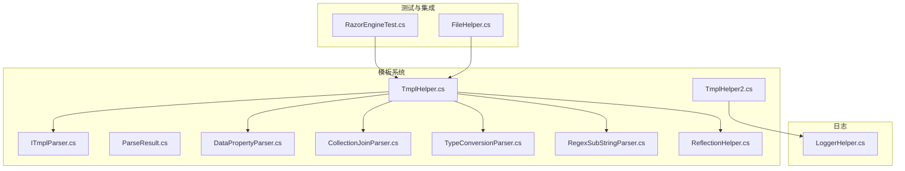
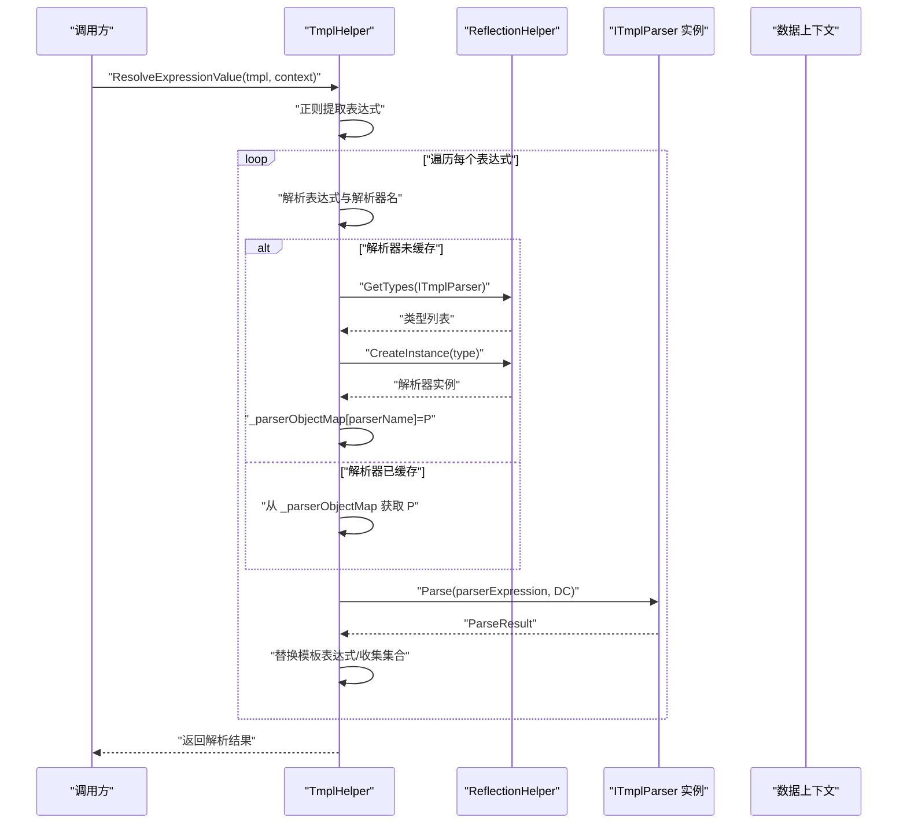
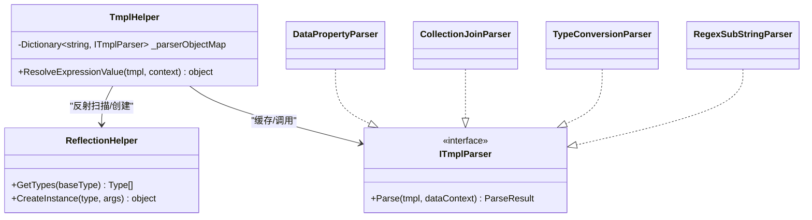
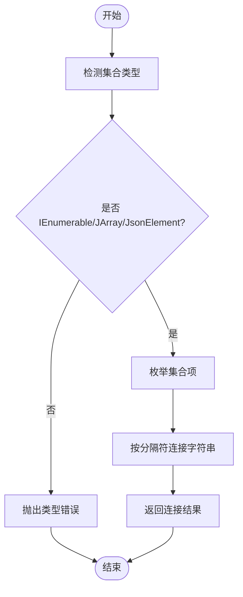
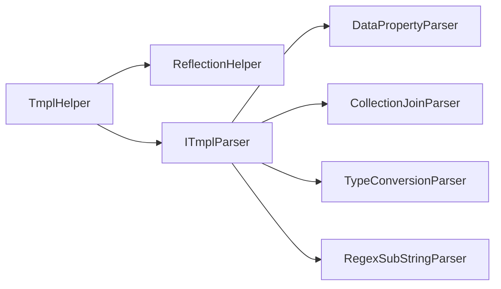

# 模板性能优化

<cite>
**本文引用的文件**
- [TmplHelper.cs](file://Sylas.RemoteTasks.Utils/Template/TmplHelper.cs)
- [TmplHelper2.cs](file://Sylas.RemoteTasks.Utils/Template/TmplHelper2.cs)
- [ITmplParser.cs](file://Sylas.RemoteTasks.Utils/Template/Parser/ITmplParser.cs)
- [ParseResult.cs](file://Sylas.RemoteTasks.Utils/Template/Parser/ParseResult.cs)
- [DataPropertyParser.cs](file://Sylas.RemoteTasks.Utils/Template/Parser/DataPropertyParser.cs)
- [CollectionJoinParser.cs](file://Sylas.RemoteTasks.Utils/Template/Parser/CollectionJoinParser.cs)
- [TypeConversionParser.cs](file://Sylas.RemoteTasks.Utils/Template/Parser/TypeConversionParser.cs)
- [RegexSubStringParser.cs](file://Sylas.RemoteTasks.Utils/Template/Parser/RegexSubStringParser.cs)
- [ReflectionHelper.cs](file://Sylas.RemoteTasks.Utils/ReflectionHelper.cs)
- [RazorEngineTest.cs](file://Sylas.RemoteTasks.Test/Tmpl/RazorEngineTest.cs)
- [FileHelper.cs](file://Sylas.RemoteTasks.Utils/CommandExecutor/FileHelper.cs)
- [LoggerHelper.cs](file://Sylas.RemoteTasks.Common/LoggerHelper.cs)
</cite>

## 目录
1. [简介](#简介)
2. [项目结构](#项目结构)
3. [核心组件](#核心组件)
4. [架构总览](#架构总览)
5. [详细组件分析](#详细组件分析)
6. [依赖关系分析](#依赖关系分析)
7. [性能考量](#性能考量)
8. [故障排查指南](#故障排查指南)
9. [结论](#结论)
10. [附录](#附录)

## 简介
本文件聚焦于模板系统的性能优化，围绕以下主题展开：模板解析器对象缓存机制、反射调用优化策略、日志记录性能影响、大数据集处理优化、内存使用优化、并发处理策略等。文档结合仓库中的具体实现，给出可操作的优化建议、性能监控指标、配置参数与最佳实践，并解释常见瓶颈与解决方案。

## 项目结构
模板系统主要位于 Utils 模块的 Template 子目录下，包含两类模板解析器：
- TmplHelper：基于自定义解析器（Parser）的文本模板系统，支持 for 循环、表达式解析、集合选择/连接/类型转换等。
- TmplHelper2：简化版模板解析器，侧重表达式提取与管道式处理，适合快速变量替换与集合拼接。

此外，系统通过反射动态加载解析器接口实现，配合缓存避免重复反射开销；日志辅助模块用于记录解析过程，便于性能诊断。

图表来源
- [TmplHelper.cs](file://Sylas.RemoteTasks.Utils/Template/TmplHelper.cs#L1-L740)
- [TmplHelper2.cs](file://Sylas.RemoteTasks.Utils/Template/TmplHelper2.cs#L1-L416)
- [ITmplParser.cs](file://Sylas.RemoteTasks.Utils/Template/Parser/ITmplParser.cs#L1-L105)
- [ReflectionHelper.cs](file://Sylas.RemoteTasks.Utils/ReflectionHelper.cs#L1-L80)
- [RazorEngineTest.cs](file://Sylas.RemoteTasks.Test/Tmpl/RazorEngineTest.cs#L1-L90)
- [FileHelper.cs](file://Sylas.RemoteTasks.Utils/CommandExecutor/FileHelper.cs#L606-L632)
- [LoggerHelper.cs](file://Sylas.RemoteTasks.Common/LoggerHelper.cs)

章节来源
- [TmplHelper.cs](file://Sylas.RemoteTasks.Utils/Template/TmplHelper.cs#L1-L740)
- [TmplHelper2.cs](file://Sylas.RemoteTasks.Utils/Template/TmplHelper2.cs#L1-L416)

## 核心组件
- 自定义解析器体系（ITmplParser 及其实现）
  - 支持属性解析、集合连接、集合选择、正则截取、类型转换等。
  - 解析结果统一由 ParseResult 描述，包含 Success、DataSourceKeys、Value。
- 解析调度与缓存
  - TmplHelper 维护解析器对象映射表，首次按名称反射创建后缓存，后续直接复用。
  - 对表达式解析采用正则一次性提取，避免重复扫描。
- 日志与可观测性
  - TmplHelper 在关键路径调用日志辅助模块记录解析上下文与结果，便于性能分析。
- 快速表达式解析（TmplHelper2）
  - 面向简单场景的表达式提取与替换，减少复杂度与分支。

章节来源
- [ITmplParser.cs](file://Sylas.RemoteTasks.Utils/Template/Parser/ITmplParser.cs#L1-L105)
- [ParseResult.cs](file://Sylas.RemoteTasks.Utils/Template/Parser/ParseResult.cs#L1-L42)
- [TmplHelper.cs](file://Sylas.RemoteTasks.Utils/Template/TmplHelper.cs#L451-L634)
- [LoggerHelper.cs](file://Sylas.RemoteTasks.Common/LoggerHelper.cs)

## 架构总览
模板解析的整体流程如下：
- 输入模板与数据上下文
- 提取模板表达式
- 选择解析器（优先从缓存获取）
- 执行解析器 Parse，返回 ParseResult
- 替换模板中的表达式，或生成集合结果
- 对于 for 循环，递归渲染块内内容

图表来源
- [TmplHelper.cs](file://Sylas.RemoteTasks.Utils/Template/TmplHelper.cs#L461-L634)
- [ReflectionHelper.cs](file://Sylas.RemoteTasks.Utils/ReflectionHelper.cs#L62-L77)
- [ITmplParser.cs](file://Sylas.RemoteTasks.Utils/Template/Parser/ITmplParser.cs#L20-L30)

## 详细组件分析

### 组件A：模板解析器对象缓存机制
- 缓存结构
  - TmplHelper 内部维护静态字典用于缓存解析器实例，键为解析器名称，值为 ITmplParser 实例。
- 初始化策略
  - 首次按名称查找失败时，通过反射扫描实现 ITmplParser 的类型，创建实例并写入缓存。
- 性能收益
  - 避免重复反射与实例化，显著降低 CPU 开销与 GC 压力。
- 注意事项
  - 解析器实例无状态或线程安全时方可共享；若涉及可变状态，需考虑隔离策略。

图表来源
- [TmplHelper.cs](file://Sylas.RemoteTasks.Utils/Template/TmplHelper.cs#L451-L634)
- [ReflectionHelper.cs](file://Sylas.RemoteTasks.Utils/ReflectionHelper.cs#L62-L77)
- [ITmplParser.cs](file://Sylas.RemoteTasks.Utils/Template/Parser/ITmplParser.cs#L20-L30)
- [DataPropertyParser.cs](file://Sylas.RemoteTasks.Utils/Template/Parser/DataPropertyParser.cs#L1-L145)
- [CollectionJoinParser.cs](file://Sylas.RemoteTasks.Utils/Template/Parser/CollectionJoinParser.cs#L1-L72)
- [TypeConversionParser.cs](file://Sylas.RemoteTasks.Utils/Template/Parser/TypeConversionParser.cs#L1-L102)
- [RegexSubStringParser.cs](file://Sylas.RemoteTasks.Utils/Template/Parser/RegexSubStringParser.cs#L1-L39)

章节来源
- [TmplHelper.cs](file://Sylas.RemoteTasks.Utils/Template/TmplHelper.cs#L451-L634)
- [ReflectionHelper.cs](file://Sylas.RemoteTasks.Utils/ReflectionHelper.cs#L62-L77)

### 组件B：反射调用优化策略
- 优化点
  - 仅在首次缺失时进行反射扫描与实例化，随后直接从缓存获取。
  - 通过统一的接口 ITmplParser 抽象，减少分支判断与装箱拆箱。
- 建议
  - 若解析器数量固定且规模较小，可在应用启动阶段预热缓存，进一步消除首次延迟。
  - 对频繁使用的解析器命名保持稳定，避免因名称变化导致缓存失效。

章节来源
- [TmplHelper.cs](file://Sylas.RemoteTasks.Utils/Template/TmplHelper.cs#L608-L616)
- [ReflectionHelper.cs](file://Sylas.RemoteTasks.Utils/ReflectionHelper.cs#L62-L77)

### 组件C：日志记录性能影响
- 影响分析
  - TmplHelper 在构建数据上下文与解析过程中调用日志辅助模块记录上下文与结果，有助于定位问题，但会带来额外 IO 与序列化开销。
- 优化建议
  - 在生产环境中按需开启日志级别，避免高频大对象序列化。
  - 对于批量解析场景，建议聚合日志或降采样。

章节来源
- [TmplHelper.cs](file://Sylas.RemoteTasks.Utils/Template/TmplHelper.cs#L273-L307)
- [LoggerHelper.cs](file://Sylas.RemoteTasks.Common/LoggerHelper.cs)

### 组件D：大数据集处理优化
- 集合连接（Join）
  - CollectionJoinParser 对集合进行 Join 操作时，优先使用枚举器与 LINQ，避免不必要的中间集合复制。
- 属性解析（DataPropertyParser）
  - 针对 JsonElement、JObject、IEnumerable 等类型分别处理，减少类型转换与装箱。
- 表达式提取（TmplHelper2）
  - 使用正则一次性提取所有表达式，避免重复扫描；对数组直接拼接字符串，减少多次替换。

图表来源
- [CollectionJoinParser.cs](file://Sylas.RemoteTasks.Utils/Template/Parser/CollectionJoinParser.cs#L22-L69)
- [DataPropertyParser.cs](file://Sylas.RemoteTasks.Utils/Template/Parser/DataPropertyParser.cs#L56-L75)

章节来源
- [CollectionJoinParser.cs](file://Sylas.RemoteTasks.Utils/Template/Parser/CollectionJoinParser.cs#L22-L69)
- [DataPropertyParser.cs](file://Sylas.RemoteTasks.Utils/Template/Parser/DataPropertyParser.cs#L56-L75)
- [TmplHelper2.cs](file://Sylas.RemoteTasks.Utils/Template/TmplHelper2.cs#L39-L81)

### 组件E：内存使用优化
- 减少中间对象
  - 在解析表达式时，优先使用字符串替换而非频繁创建新字符串；对集合结果采用累加策略，避免重复拼接。
- 避免重复序列化
  - TmplHelper 在构建数据上下文时尽量保持原始类型，减少 JSON 序列化/反序列化。
- 建议
  - 对超大集合，优先使用流式处理或分页策略，避免一次性加载至内存。

章节来源
- [TmplHelper.cs](file://Sylas.RemoteTasks.Utils/Template/TmplHelper.cs#L341-L353)
- [TmplHelper2.cs](file://Sylas.RemoteTasks.Utils/Template/TmplHelper2.cs#L39-L81)

### 组件F：并发处理策略
- 现状
  - 解析器实例默认共享，未见显式的并发锁保护；若解析器内部无状态，可安全并发使用。
- 建议
  - 对共享解析器增加只读语义；若存在可变状态，应为每个并发请求提供独立实例或使用线程本地存储。
  - 对于高并发场景，建议引入连接池式解析器实例管理，限制最大实例数并支持回收。

章节来源
- [TmplHelper.cs](file://Sylas.RemoteTasks.Utils/Template/TmplHelper.cs#L608-L616)
- [ITmplParser.cs](file://Sylas.RemoteTasks.Utils/Template/Parser/ITmplParser.cs#L20-L30)

### 组件G：RazorEngine 集成与性能对比
- 集成方式
  - FileHelper 在执行命令时根据模板内容与全局变量构建缓存键，若模板未缓存则编译并运行。
- 性能对比
  - 自定义模板解析器适合轻量、可控的表达式与集合操作；RazorEngine 更适合复杂视图逻辑，但编译与运行成本更高。
- 建议
  - 对简单文本替换与集合拼接，优先使用自定义模板解析器；对复杂页面渲染，评估 RazorEngine 的缓存命中率与编译频率。

章节来源
- [FileHelper.cs](file://Sylas.RemoteTasks.Utils/CommandExecutor/FileHelper.cs#L606-L632)
- [RazorEngineTest.cs](file://Sylas.RemoteTasks.Test/Tmpl/RazorEngineTest.cs#L1-L90)

## 依赖关系分析
- 松耦合设计
  - 解析器通过 ITmplParser 接口解耦，新增解析器只需实现接口并注册名称即可。
- 关键依赖链
  - TmplHelper 依赖 ReflectionHelper 进行类型发现与实例化；依赖各解析器实现完成具体解析任务。
- 循环依赖风险
  - 未见循环依赖；解析器之间相互独立。

图表来源
- [TmplHelper.cs](file://Sylas.RemoteTasks.Utils/Template/TmplHelper.cs#L451-L634)
- [ReflectionHelper.cs](file://Sylas.RemoteTasks.Utils/ReflectionHelper.cs#L62-L77)
- [ITmplParser.cs](file://Sylas.RemoteTasks.Utils/Template/Parser/ITmplParser.cs#L20-L30)

章节来源
- [TmplHelper.cs](file://Sylas.RemoteTasks.Utils/Template/TmplHelper.cs#L451-L634)
- [ReflectionHelper.cs](file://Sylas.RemoteTasks.Utils/ReflectionHelper.cs#L62-L77)

## 性能考量
- 性能监控指标
  - 解析耗时（毫秒）、解析器实例创建次数、日志写入次数、GC 压力（分配字节数/代际晋升）。
  - 对比指标：自定义模板解析器 vs RazorEngine。
- 优化配置参数
  - 解析器缓存大小上限、日志级别阈值、表达式提取正则缓存、集合连接分隔符长度阈值。
- 最佳实践
  - 预热解析器缓存、减少日志大对象序列化、避免重复反射、使用流式处理超大数据集、控制并发实例数量。

[本节为通用指导，不直接分析具体文件]

## 故障排查指南
- 常见问题
  - 解析器未找到：检查解析器名称与反射扫描范围。
  - 表达式类型不匹配：确认数据上下文类型与解析器期望一致。
  - 日志过多导致性能下降：调整日志级别或聚合日志。
- 定位手段
  - 使用日志辅助模块记录上下文与中间结果；对热点路径增加计时统计。
- 解决方案
  - 预热缓存、精简日志、优化正则表达式、拆分复杂表达式。

章节来源
- [TmplHelper.cs](file://Sylas.RemoteTasks.Utils/Template/TmplHelper.cs#L611-L616)
- [LoggerHelper.cs](file://Sylas.RemoteTasks.Common/LoggerHelper.cs)

## 结论
通过解析器对象缓存、反射调用优化、日志降噪、集合处理与内存优化、并发隔离等策略，模板系统在保证功能完整性的同时实现了良好的性能表现。建议在生产环境中结合监控指标持续优化缓存命中率与日志开销，并针对超大数据集采用流式处理与分页策略。

[本节为总结，不直接分析具体文件]

## 附录
- 关键实现路径参考
  - 解析器缓存与反射：[TmplHelper.cs](file://Sylas.RemoteTasks.Utils/Template/TmplHelper.cs#L451-L634)、[ReflectionHelper.cs](file://Sylas.RemoteTasks.Utils/ReflectionHelper.cs#L62-L77)
  - 表达式解析与 for 循环：[TmplHelper.cs](file://Sylas.RemoteTasks.Utils/Template/TmplHelper.cs#L461-L719)
  - 简化表达式解析：[TmplHelper2.cs](file://Sylas.RemoteTasks.Utils/Template/TmplHelper2.cs#L27-L81)
  - 解析器接口与实现：[ITmplParser.cs](file://Sylas.RemoteTasks.Utils/Template/Parser/ITmplParser.cs#L20-L103)、[DataPropertyParser.cs](file://Sylas.RemoteTasks.Utils/Template/Parser/DataPropertyParser.cs#L25-L142)、[CollectionJoinParser.cs](file://Sylas.RemoteTasks.Utils/Template/Parser/CollectionJoinParser.cs#L22-L69)、[TypeConversionParser.cs](file://Sylas.RemoteTasks.Utils/Template/Parser/TypeConversionParser.cs#L25-L99)、[RegexSubStringParser.cs](file://Sylas.RemoteTasks.Utils/Template/Parser/RegexSubStringParser.cs#L20-L36)
  - RazorEngine 集成：[FileHelper.cs](file://Sylas.RemoteTasks.Utils/CommandExecutor/FileHelper.cs#L606-L632)、[RazorEngineTest.cs](file://Sylas.RemoteTasks.Test/Tmpl/RazorEngineTest.cs#L1-L90)