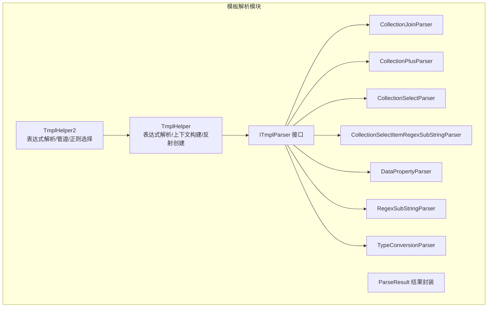
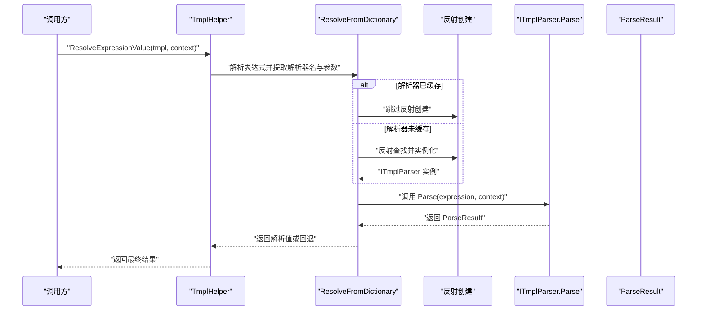
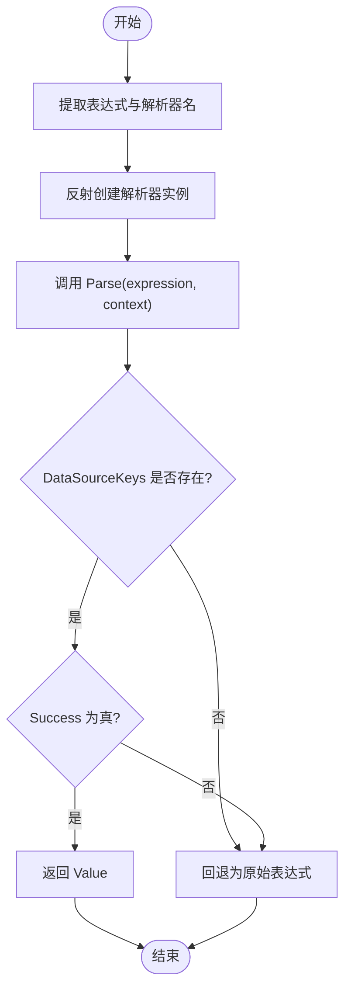
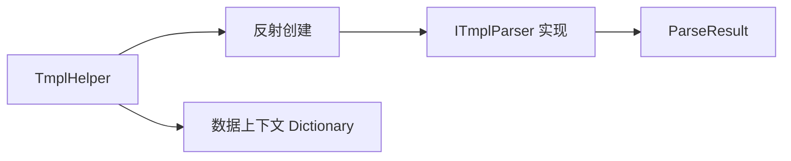

# 模板解析器架构

<cite>
**本文档引用的文件**
- [ITmplParser.cs](file://Sylas.RemoteTasks.Utils/Template/Parser/ITmplParser.cs)
- [ParseResult.cs](file://Sylas.RemoteTasks.Utils/Template/Parser/ParseResult.cs)
- [TmplHelper.cs](file://Sylas.RemoteTasks.Utils/Template/TmplHelper.cs)
- [TmplHelper2.cs](file://Sylas.RemoteTasks.Utils/Template/TmplHelper2.cs)
- [CollectionJoinParser.cs](file://Sylas.RemoteTasks.Utils/Template/Parser/CollectionJoinParser.cs)
- [CollectionPlusParser.cs](file://Sylas.RemoteTasks.Utils/Template/Parser/CollectionPlusParser.cs)
- [CollectionSelectParser.cs](file://Sylas.RemoteTasks.Utils/Template/Parser/CollectionSelectParser.cs)
- [CollectionSelectItemRegexSubStringParser.cs](file://Sylas.RemoteTasks.Utils/Template/Parser/CollectionSelectItemRegexSubStringParser.cs)
- [DataPropertyParser.cs](file://Sylas.RemoteTasks.Utils/Template/Parser/DataPropertyParser.cs)
- [RegexSubStringParser.cs](file://Sylas.RemoteTasks.Utils/Template/Parser/RegexSubStringParser.cs)
- [TypeConversionParser.cs](file://Sylas.RemoteTasks.Utils/Template/Parser/TypeConversionParser.cs)
</cite>

## 目录
1. [简介](#简介)
2. [项目结构](#项目结构)
3. [核心组件](#核心组件)
4. [架构总览](#架构总览)
5. [详细组件分析](#详细组件分析)
6. [依赖分析](#依赖分析)
7. [性能考虑](#性能考虑)
8. [故障排查指南](#故障排查指南)
9. [结论](#结论)
10. [附录：解析器使用示例与配置](#附录解析器使用示例与配置)

## 简介
本文件系统性阐述模板解析器架构的设计与实现，重点覆盖以下方面：
- ITmplParser 接口设计与职责边界
- ParseResult 结果封装与返回约定
- 各解析器实现原理（CollectionJoinParser、CollectionPlusParser、CollectionSelectParser、DataPropertyParser、RegexSubStringParser、TypeConversionParser）
- 解析器注册与反射创建机制
- 解析器之间的协作关系与扩展机制
- 常见问题与解决方案
- 面向初学者的入门路径与面向资深开发者的深度细节

## 项目结构
模板解析器位于 Utils 模块下的 Template/Parser 目录，配合 TmplHelper 与 TmplHelper2 提供表达式解析、上下文构建、模板渲染与 for 循环等能力。

图表来源
- [ITmplParser.cs](file://Sylas.RemoteTasks.Utils/Template/Parser/ITmplParser.cs#L20-L29)
- [ParseResult.cs](file://Sylas.RemoteTasks.Utils/Template/Parser/ParseResult.cs#L6-L39)
- [TmplHelper.cs](file://Sylas.RemoteTasks.Utils/Template/TmplHelper.cs#L451-L634)
- [CollectionJoinParser.cs](file://Sylas.RemoteTasks.Utils/Template/Parser/CollectionJoinParser.cs#L13-L22)
- [CollectionPlusParser.cs](file://Sylas.RemoteTasks.Utils/Template/Parser/CollectionPlusParser.cs)
- [CollectionSelectParser.cs](file://Sylas.RemoteTasks.Utils/Template/Parser/CollectionSelectParser.cs#L9-L17)
- [CollectionSelectItemRegexSubStringParser.cs](file://Sylas.RemoteTasks.Utils/Template/Parser/CollectionSelectItemRegexSubStringParser.cs#L13-L22)
- [DataPropertyParser.cs](file://Sylas.RemoteTasks.Utils/Template/Parser/DataPropertyParser.cs#L16-L25)
- [RegexSubStringParser.cs](file://Sylas.RemoteTasks.Utils/Template/Parser/RegexSubStringParser.cs#L11-L20)
- [TypeConversionParser.cs](file://Sylas.RemoteTasks.Utils/Template/Parser/TypeConversionParser.cs#L15-L25)

章节来源
- [TmplHelper.cs](file://Sylas.RemoteTasks.Utils/Template/TmplHelper.cs#L195-L271)
- [ITmplParser.cs](file://Sylas.RemoteTasks.Utils/Template/Parser/ITmplParser.cs#L20-L103)

## 核心组件
- ITmplParser：统一的解析器接口，定义 Parse 方法，接收模板表达式与数据上下文，返回 ParseResult。
- ParseResult：结果封装，包含 Success、DataSourceKeys、Value 三个关键字段，用于指示解析是否成功、数据来源键以及解析结果。
- TmplHelper：解析器工厂与调度中心，负责：
  - 从模板表达式中提取解析器名称与参数
  - 通过反射创建解析器实例并缓存
  - 统一调用解析器 Parse，并按结果返回值或回退
  - 构建数据上下文、解析表达式、处理 for 循环块
- 各具体解析器：实现 ITmplParser，针对特定场景（集合连接、集合拼接、集合属性选择、属性读取、正则截取、类型转换）进行解析。

章节来源
- [ITmplParser.cs](file://Sylas.RemoteTasks.Utils/Template/Parser/ITmplParser.cs#L20-L29)
- [ParseResult.cs](file://Sylas.RemoteTasks.Utils/Template/Parser/ParseResult.cs#L6-L39)
- [TmplHelper.cs](file://Sylas.RemoteTasks.Utils/Template/TmplHelper.cs#L451-L634)

## 架构总览
下图展示了模板解析的整体流程：从模板表达式到解析器实例，再到结果返回与上下文构建。

图表来源
- [TmplHelper.cs](file://Sylas.RemoteTasks.Utils/Template/TmplHelper.cs#L588-L634)
- [ITmplParser.cs](file://Sylas.RemoteTasks.Utils/Template/Parser/ITmplParser.cs#L20-L29)

## 详细组件分析

### ITmplParser 接口与静态工具
- 设计要点
  - Parse(string tmpl, Dictionary<string, object> dataContext)：统一入口，解析器仅关注自身语法。
  - 静态工具 ResolveCollectionSelectTmpl：提供集合 Select 的通用逻辑，支持 SELF 与递归展开。
- 参数与返回
  - 参数：tmpl 为解析器内部语法；dataContext 为键值对上下文。
  - 返回：ParseResult，包含 Success、DataSourceKeys、Value。
- 适用场景
  - 集合属性选择、集合连接、属性读取、正则截取、类型转换等。

章节来源
- [ITmplParser.cs](file://Sylas.RemoteTasks.Utils/Template/Parser/ITmplParser.cs#L20-L29)
- [ITmplParser.cs](file://Sylas.RemoteTasks.Utils/Template/Parser/ITmplParser.cs#L39-L102)

### ParseResult 结果封装
- 字段说明
  - Success：解析是否成功
  - DataSourceKeys：本次解析所引用的数据源键（用于回填或合并）
  - Value：解析结果，可为任意类型
- 使用约定
  - 若 DataSourceKeys 为 null，则解析器未识别为“带数据源”的解析器
  - 若 DataSourceKeys 非空且 Success 为真，返回 Value
  - 若 DataSourceKeys 非空但 Success 为假，回退为原始表达式

章节来源
- [ParseResult.cs](file://Sylas.RemoteTasks.Utils/Template/Parser/ParseResult.cs#L6-L39)

### TmplHelper：解析器工厂与调度
- 关键职责
  - 从模板表达式中提取解析器名与参数
  - 反射创建解析器实例并缓存至 _parserObjectMap
  - 统一调用解析器 Parse，并处理返回值与回退
  - 构建数据上下文 BuildDataContextBySource
  - 解析表达式 ResolveExpressionValue
  - 处理 for 循环块 RenderTemplateWithForLoopBlocks
- 反射创建流程
  - 通过 ReflectionHelper.GetTypes(typeof(ITmplParser)) 获取所有实现
  - 通过 ReflectionHelper.CreateInstance 创建实例
  - 缓存以避免重复反射开销

章节来源
- [TmplHelper.cs](file://Sylas.RemoteTasks.Utils/Template/TmplHelper.cs#L451-L634)
- [TmplHelper.cs](file://Sylas.RemoteTasks.Utils/Template/TmplHelper.cs#L195-L271)

### 解析器注册机制与扩展
- 注册方式
  - 自动注册：首次使用某解析器时，通过反射扫描 ITmplParser 的实现并实例化
  - 缓存策略：_parserObjectMap 按解析器名缓存实例，后续复用
- 扩展步骤
  - 新增实现类并实现 ITmplParser
  - 保持类名与模板语法一致（如 XxxParser）
  - 在模板中以“XxxParser[...]”形式使用

章节来源
- [TmplHelper.cs](file://Sylas.RemoteTasks.Utils/Template/TmplHelper.cs#L609-L616)

### 各解析器实现原理与协作

#### CollectionJoinParser：集合连接
- 语法：$key join separator
- 行为：将集合元素以指定分隔符连接为字符串
- 特殊处理：空集合返回空字符串；非集合直接返回原值
- 返回：ParseResult.Success=true，DataSourceKeys=[key]

章节来源
- [CollectionJoinParser.cs](file://Sylas.RemoteTasks.Utils/Template/Parser/CollectionJoinParser.cs#L22-L69)

#### CollectionPlusParser：集合拼接
- 语法：$left + $right
- 行为：将两个集合拼接为一个集合
- 返回：ParseResult.Success=true，DataSourceKeys=[left,right]
- 注意：该解析器在当前仓库中文件名为带空格的异常命名，建议修正为标准 PascalCase 文件名与类名

章节来源
- [CollectionPlusParser.cs](file://Sylas.RemoteTasks.Utils/Template/Parser/CollectionPlusParser.cs)

#### CollectionSelectParser：集合属性选择
- 语法：$key select prop [-r]
- 行为：从集合中抽取每个元素的指定属性；支持递归展开
- 协作：委托 ITmplParser.ResolveCollectionSelectTmpl 完成 Select 逻辑
- 返回：ParseResult.Success=true，DataSourceKeys=[key]

章节来源
- [CollectionSelectParser.cs](file://Sylas.RemoteTasks.Utils/Template/Parser/CollectionSelectParser.cs#L17-L30)
- [ITmplParser.cs](file://Sylas.RemoteTasks.Utils/Template/Parser/ITmplParser.cs#L39-L102)

#### CollectionSelectItemRegexSubStringParser：集合属性选择后正则截取
- 语法：$key select prop [-r] reg `pattern` group
- 行为：先执行集合属性选择，再对每个字符串项应用正则分组截取
- 返回：ParseResult.Success=true，DataSourceKeys=[key]，Value 为字符串列表

章节来源
- [CollectionSelectItemRegexSubStringParser.cs](file://Sylas.RemoteTasks.Utils/Template/Parser/CollectionSelectItemRegexSubStringParser.cs#L22-L61)

#### DataPropertyParser：数据属性解析
- 语法：$key[.index][.prop...]
- 行为：从数据上下文中读取对象或集合的属性值，支持索引访问与多级属性
- 返回：ParseResult.Success=true，DataSourceKeys=[key]

章节来源
- [DataPropertyParser.cs](file://Sylas.RemoteTasks.Utils/Template/Parser/DataPropertyParser.cs#L25-L142)

#### RegexSubStringParser：正则子串截取
- 语法：$key reg `pattern` group
- 行为：对字符串类型的值应用正则表达式，提取指定分组
- 返回：ParseResult.Success=true，DataSourceKeys=[key]

章节来源
- [RegexSubStringParser.cs](file://Sylas.RemoteTasks.Utils/Template/Parser/RegexSubStringParser.cs#L20-L36)

#### TypeConversionParser：类型转换
- 语法：$key as Type
- 行为：将字符串或集合转换为指定类型（如 List、Object）
- 返回：ParseResult.Success=true，DataSourceKeys=[key]

章节来源
- [TypeConversionParser.cs](file://Sylas.RemoteTasks.Utils/Template/Parser/TypeConversionParser.cs#L25-L99)

### 解析器协作关系与控制流
- 控制流
  - TmplHelper.ResolveExpressionValue 逐个提取模板表达式
  - ResolveFromDictionary 提取解析器名与参数，反射创建实例
  - 调用 ITmplParser.Parse，依据 ParseResult 的 DataSourceKeys 决定返回值或回退
- 协作点
  - CollectionSelectParser 与 CollectionSelectItemRegexSubStringParser 共享 ITmplParser.ResolveCollectionSelectTmpl
  - 多解析器可串联使用（例如先 Select 再 Regex）

图表来源
- [TmplHelper.cs](file://Sylas.RemoteTasks.Utils/Template/TmplHelper.cs#L588-L634)
- [ITmplParser.cs](file://Sylas.RemoteTasks.Utils/Template/Parser/ITmplParser.cs#L20-L29)

## 依赖分析
- 组件耦合
  - TmplHelper 对 ITmplParser 的实现完全解耦，通过反射与接口绑定
  - 各解析器之间无直接依赖，仅通过公共工具（如 ITmplParser.ResolveCollectionSelectTmpl）协作
- 外部依赖
  - System.Text.RegularExpressions：用于解析器内部的正则匹配
  - System.Text.Json / Newtonsoft.Json：用于 JSON 解析与类型转换
- 潜在风险
  - 反射创建成本：首次使用解析器时有反射开销，但通过 _parserObjectMap 缓存避免重复
  - 异常传播：解析器内部异常需在 TmplHelper 中捕获并合理回退

图表来源
- [TmplHelper.cs](file://Sylas.RemoteTasks.Utils/Template/TmplHelper.cs#L609-L616)
- [ITmplParser.cs](file://Sylas.RemoteTasks.Utils/Template/Parser/ITmplParser.cs#L20-L29)
- [ParseResult.cs](file://Sylas.RemoteTasks.Utils/Template/Parser/ParseResult.cs#L6-L39)

## 性能考虑
- 反射缓存：_parserObjectMap 避免重复反射，建议在高并发场景下预热常用解析器
- 集合处理：优先使用 JsonElement/JsonArray 以减少装箱拆箱
- 正则匹配：正则表达式应尽量简洁，避免回溯；对高频场景可缓存 Regex 对象
- 上下文构建：BuildDataContextBySource 支持增量合并，注意避免不必要的深拷贝

## 故障排查指南
- “未找到解析器”
  - 现象：抛出“未找到Parser: XxxParser”异常
  - 排查：确认类名与模板语法一致；检查反射扫描范围
- “解析成功但未返回数据源键”
  - 现象：抛出“未返回解析模板中的数据源的Key”异常
  - 排查：确保解析器在成功时设置 ParseResult.DataSourceKeys
- “集合无法执行 Select 操作”
  - 现象：抛出“不是集合无法执行Select操作”异常
  - 排查：确认数据上下文中的键对应集合类型；必要时使用 TypeConversionParser 转换
- “正则截取失败”
  - 现象：RegexSubStringParser 抛出异常
  - 排查：确认目标值为字符串；验证正则与分组名正确
- “集合拼接文件名异常”
  - 现象：文件名包含多余空格导致编译或反射失败
  - 排查：修正文件名与类名为标准 PascalCase（如 CollectionPlusParser）

章节来源
- [TmplHelper.cs](file://Sylas.RemoteTasks.Utils/Template/TmplHelper.cs#L609-L616)
- [ITmplParser.cs](file://Sylas.RemoteTasks.Utils/Template/Parser/ITmplParser.cs#L101-L102)
- [RegexSubStringParser.cs](file://Sylas.RemoteTasks.Utils/Template/Parser/RegexSubStringParser.cs#L27-L35)
- [CollectionPlusParser.cs](file://Sylas.RemoteTasks.Utils/Template/Parser/CollectionPlusParser.cs)

## 结论
模板解析器架构通过 ITmplParser 接口与 ParseResult 统一封装，结合 TmplHelper 的反射工厂与调度，实现了高度可扩展的解析体系。各解析器专注于单一职责，通过共享工具（如集合 Select）实现协作。建议在生产环境中：
- 规范解析器命名与文件命名
- 预热常用解析器以降低首次反射开销
- 对高频正则表达式进行优化与缓存
- 明确异常处理与回退策略，提升鲁棒性

## 附录：解析器使用示例与配置
以下示例展示如何在模板中使用各类解析器（以路径代替具体代码片段）：

- 集合连接
  - 示例路径：[示例：集合连接](file://Sylas.RemoteTasks.Utils/Template/Parser/CollectionJoinParser.cs#L22-L69)
  - 语法：XxxParser[$key join separator]
- 集合拼接
  - 示例路径：[示例：集合拼接](file://Sylas.RemoteTasks.Utils/Template/Parser/CollectionPlusParser.cs)
  - 语法：XxxParser[$left + $right]
- 集合属性选择
  - 示例路径：[示例：集合属性选择](file://Sylas.RemoteTasks.Utils/Template/Parser/CollectionSelectParser.cs#L17-L30)
  - 语法：XxxParser[$key select prop [-r]]
- 集合属性选择后正则截取
  - 示例路径：[示例：集合属性选择后正则截取](file://Sylas.RemoteTasks.Utils/Template/Parser/CollectionSelectItemRegexSubStringParser.cs#L22-L61)
  - 语法：XxxParser[$key select prop [-r] reg `pattern` group]
- 数据属性解析
  - 示例路径：[示例：数据属性解析](file://Sylas.RemoteTasks.Utils/Template/Parser/DataPropertyParser.cs#L25-L142)
  - 语法：XxxParser[$key[.index][.prop...]]
- 正则子串截取
  - 示例路径：[示例：正则子串截取](file://Sylas.RemoteTasks.Utils/Template/Parser/RegexSubStringParser.cs#L20-L36)
  - 语法：XxxParser[$key reg `pattern` group]
- 类型转换
  - 示例路径：[示例：类型转换](file://Sylas.RemoteTasks.Utils/Template/Parser/TypeConversionParser.cs#L25-L99)
  - 语法：XxxParser[$key as Type]

章节来源
- [CollectionJoinParser.cs](file://Sylas.RemoteTasks.Utils/Template/Parser/CollectionJoinParser.cs#L22-L69)
- [CollectionPlusParser.cs](file://Sylas.RemoteTasks.Utils/Template/Parser/CollectionPlusParser.cs)
- [CollectionSelectParser.cs](file://Sylas.RemoteTasks.Utils/Template/Parser/CollectionSelectParser.cs#L17-L30)
- [CollectionSelectItemRegexSubStringParser.cs](file://Sylas.RemoteTasks.Utils/Template/Parser/CollectionSelectItemRegexSubStringParser.cs#L22-L61)
- [DataPropertyParser.cs](file://Sylas.RemoteTasks.Utils/Template/Parser/DataPropertyParser.cs#L25-L142)
- [RegexSubStringParser.cs](file://Sylas.RemoteTasks.Utils/Template/Parser/RegexSubStringParser.cs#L20-L36)
- [TypeConversionParser.cs](file://Sylas.RemoteTasks.Utils/Template/Parser/TypeConversionParser.cs#L25-L99)