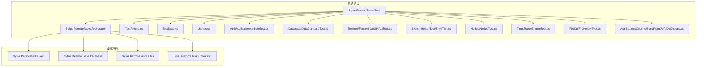
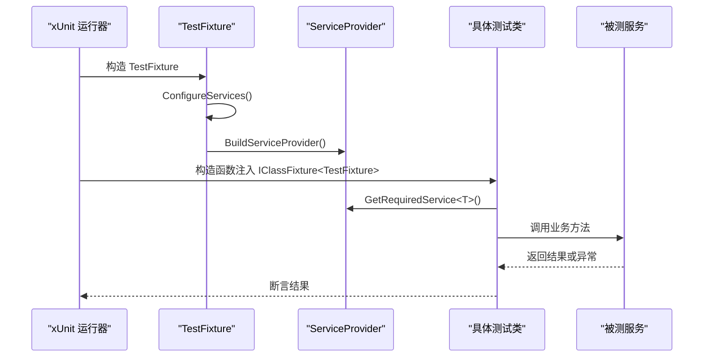
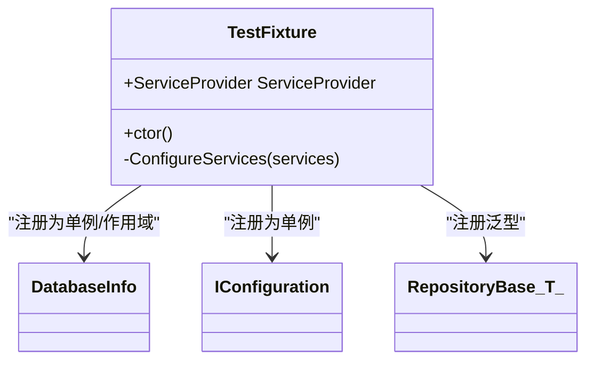
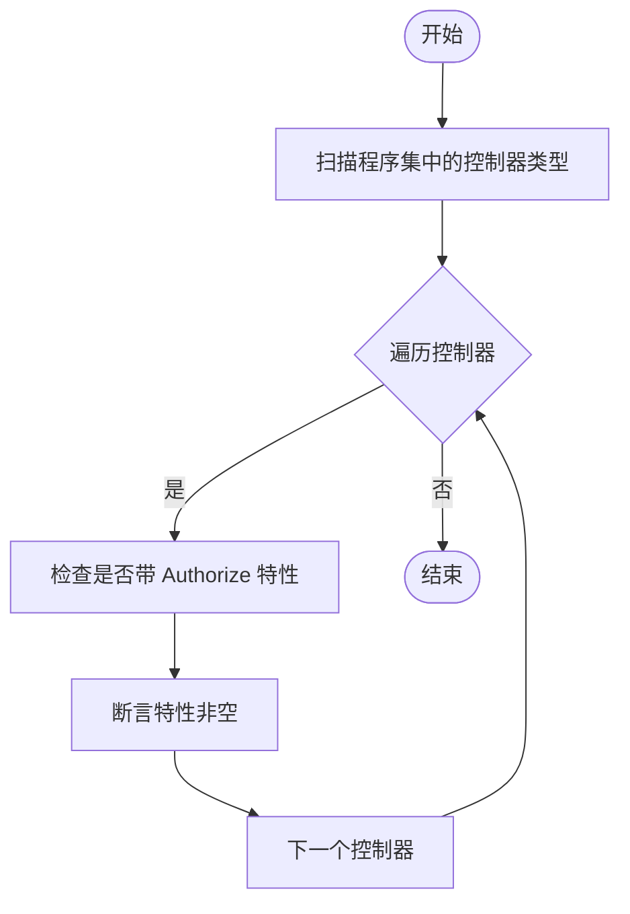
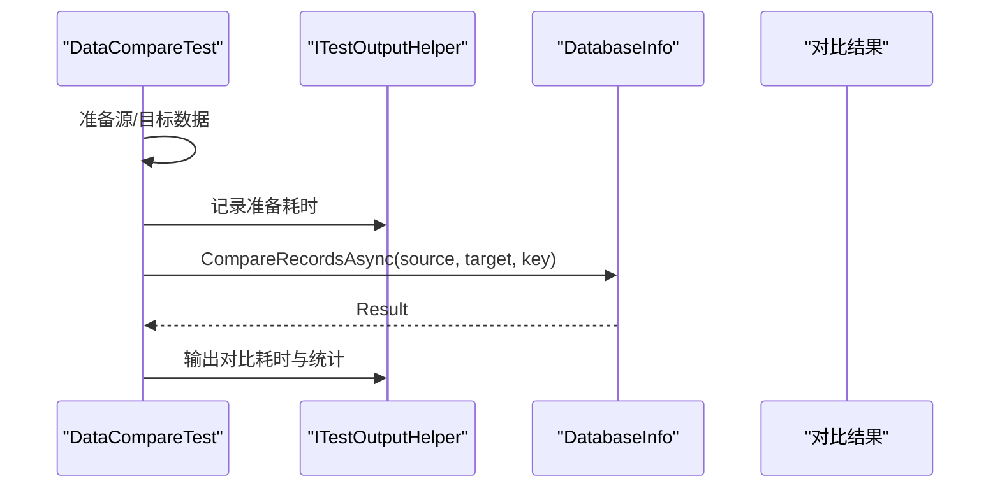
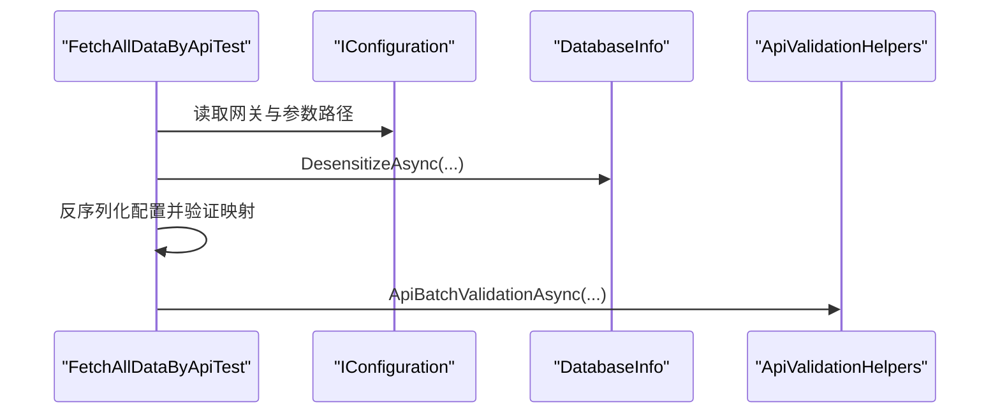
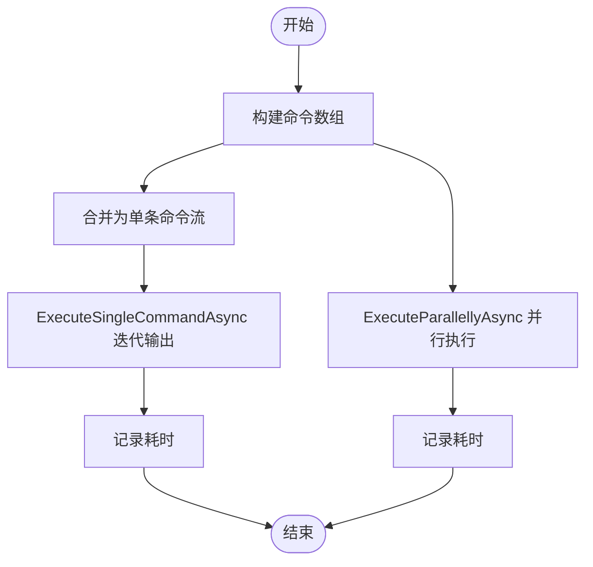
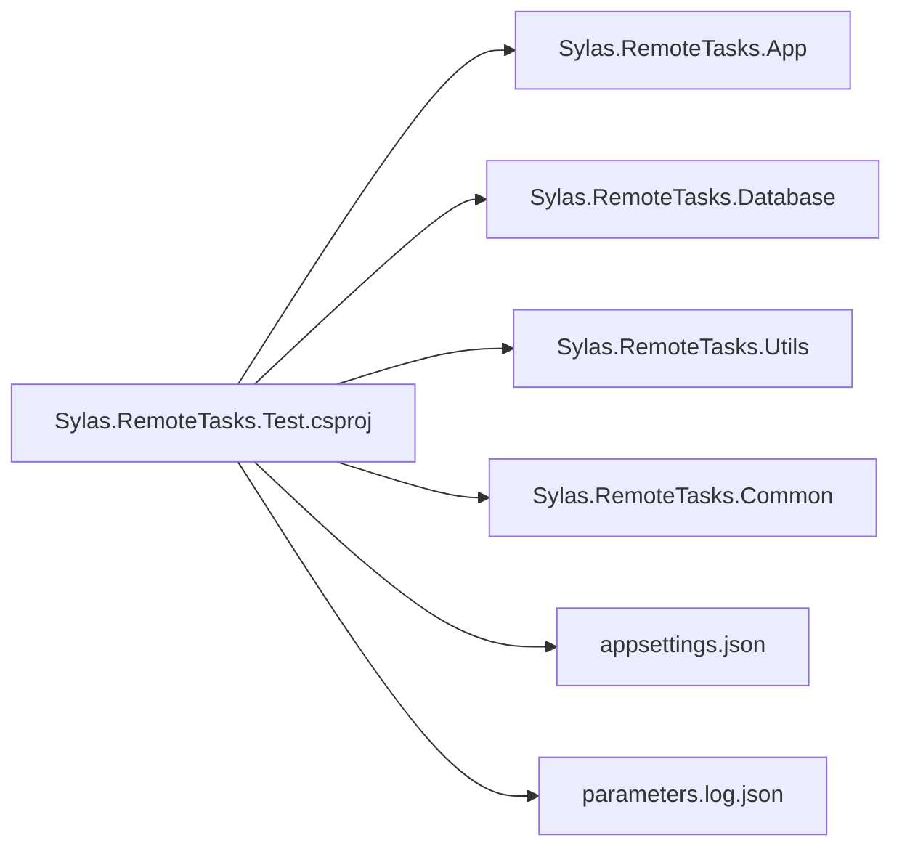

# 单元测试框架

<cite>
**本文档引用的文件**
- [Sylas.RemoteTasks.Test.csproj](file://Sylas.RemoteTasks.Test/Sylas.RemoteTasks.Test.csproj)
- [TestFixture.cs](file://Sylas.RemoteTasks.Test/TestFixture.cs)
- [TestBase.cs](file://Sylas.RemoteTasks.Test/TestBase.cs)
- [Usings.cs](file://Sylas.RemoteTasks.Test/Usings.cs)
- [AuthorizeAttributeTest.cs](file://Sylas.RemoteTasks.Test/Auth/AuthorizeAttributeTest.cs)
- [DataCompareTest.cs](file://Sylas.RemoteTasks.Test/Database/DataCompareTest.cs)
- [FetchAllDataByApiTest.cs](file://Sylas.RemoteTasks.Test/Remote/FetchAllDataByApiTest.cs)
- [ShellTest.cs](file://Sylas.RemoteTasks.Test/SystemHelperTest/ShellTest.cs)
- [NodesTest.cs](file://Sylas.RemoteTasks.Test/Nodes/NodesTest.cs)
- [RazorEngineTest.cs](file://Sylas.RemoteTasks.Test/Tmpl/RazorEngineTest.cs)
- [FileHelperTest.cs](file://Sylas.RemoteTasks.Test/FileOp/FileHelperTest.cs)
- [SyncFromDbToDbOptions.cs](file://Sylas.RemoteTasks.Test/AppSettingsOptions/SyncFromDbToDbOptions.cs)
- [appsettings.json](file://Sylas.RemoteTasks.App/appsettings.json)
- [parameters.log.json](file://Sylas.RemoteTasks.Test/parameters.log.json)
</cite>

## 目录
1. [简介](#简介)
2. [项目结构](#项目结构)
3. [核心组件](#核心组件)
4. [架构总览](#架构总览)
5. [详细组件分析](#详细组件分析)
6. [依赖关系分析](#依赖关系分析)
7. [性能考虑](#性能考虑)
8. [故障排除指南](#故障排除指南)
9. [结论](#结论)
10. [附录](#附录)

## 简介
本文件面向 Sylas.RemoteTasks 的单元测试框架，系统性阐述基于 xUnit 的测试项目配置、测试基类设计、测试生命周期管理、断言与数据准备方法，并提供测试组织方式、NuGet 包管理与测试运行器设置的最佳实践。文档同时给出多个真实测试示例的路径与要点，帮助开发者快速上手并编写高质量的单元测试。

## 项目结构
Sylas.RemoteTasks.Test 是独立的测试项目，采用 xUnit 作为测试框架，通过依赖注入（DI）在测试夹具（TestClassFixture）中构建服务提供者，统一管理日志、配置与业务服务实例。测试项目引用了应用层与数据库层项目，便于对真实业务逻辑进行单元测试。

图表来源
- [Sylas.RemoteTasks.Test.csproj](file://Sylas.RemoteTasks.Test/Sylas.RemoteTasks.Test.csproj#L1-L44)
- [TestFixture.cs](file://Sylas.RemoteTasks.Test/TestFixture.cs#L1-L53)
- [AuthorizeAttributeTest.cs](file://Sylas.RemoteTasks.Test/Auth/AuthorizeAttributeTest.cs#L1-L26)
- [DataCompareTest.cs](file://Sylas.RemoteTasks.Test/Database/DataCompareTest.cs#L1-L191)
- [FetchAllDataByApiTest.cs](file://Sylas.RemoteTasks.Test/Remote/FetchAllDataByApiTest.cs#L1-L82)
- [ShellTest.cs](file://Sylas.RemoteTasks.Test/SystemHelperTest/ShellTest.cs#L1-L101)
- [NodesTest.cs](file://Sylas.RemoteTasks.Test/Nodes/NodesTest.cs#L1-L164)
- [RazorEngineTest.cs](file://Sylas.RemoteTasks.Test/Tmpl/RazorEngineTest.cs#L1-L90)
- [FileHelperTest.cs](file://Sylas.RemoteTasks.Test/FileOp/FileHelperTest.cs#L1-L21)

章节来源
- [Sylas.RemoteTasks.Test.csproj](file://Sylas.RemoteTasks.Test/Sylas.RemoteTasks.Test.csproj#L1-L44)

## 核心组件
- 测试夹具（TestClassFixture）
  - 作用：集中初始化 DI 容器、注册日志与配置、提供服务实例给测试类。
  - 关键点：在构造函数中构建 ServiceCollection 并 Build ServiceProvider；在 ConfigureServices 中注册 IConfiguration、日志、仓储与数据库信息等服务。
- 测试基类（TestBase）
  - 作用：为需要访问配置的测试类提供基类，通过 IClassFixture 注入 TestFixture 并持有 IConfiguration 实例。
- 全局 using
  - 作用：统一引入 Xunit 断言命名空间，简化测试类中的 using 语句。

章节来源
- [TestFixture.cs](file://Sylas.RemoteTasks.Test/TestFixture.cs#L1-L53)
- [TestBase.cs](file://Sylas.RemoteTasks.Test/TestBase.cs#L1-L15)
- [Usings.cs](file://Sylas.RemoteTasks.Test/Usings.cs#L1-L1)

## 架构总览
测试运行时，xUnit 通过 TestFixture 提供共享的 ServiceProvider，测试类通过 IClassFixture 或构造函数注入获取所需服务。测试项目引用应用层与数据库层，以便对控制器、数据处理、远程调用、模板引擎、系统命令执行等模块进行单元测试。

图表来源
- [TestFixture.cs](file://Sylas.RemoteTasks.Test/TestFixture.cs#L16-L50)
- [DataCompareTest.cs](file://Sylas.RemoteTasks.Test/Database/DataCompareTest.cs#L8-L12)
- [FetchAllDataByApiTest.cs](file://Sylas.RemoteTasks.Test/Remote/FetchAllDataByApiTest.cs#L17-L22)

## 详细组件分析

### 测试夹具（TestFixture）
- 初始化策略
  - 使用 ConfigurationBuilder 加载 appsettings.json 与 parameters.log.json，支持日志配置与测试参数。
  - 注册日志提供程序（控制台与调试），便于输出测试过程与结果。
  - 注册 IConfiguration、RepositoryBase 泛型仓储、DatabaseInfo 与 IDatabaseProvider 等服务。
- 生命周期
  - TestFixture 作为 IClassFixture，在整个测试类生命周期内共享同一 ServiceProvider，避免重复初始化带来的开销。

图表来源
- [TestFixture.cs](file://Sylas.RemoteTasks.Test/TestFixture.cs#L12-L50)

章节来源
- [TestFixture.cs](file://Sylas.RemoteTasks.Test/TestFixture.cs#L1-L53)

### 测试基类（TestBase）
- 设计目的：为需要访问 IConfiguration 的测试类提供统一基类，减少重复代码。
- 使用方式：测试类继承 TestBase，即可通过受保护字段访问配置。

章节来源
- [TestBase.cs](file://Sylas.RemoteTasks.Test/TestBase.cs#L1-L15)

### 授权特性测试（AuthorizeAttributeTest）
- 目标：验证所有 MVC 控制器均带有 Authorize 特性。
- 方法：反射扫描 HomeController 所在程序集中的 ControllerBase 子类，逐个检查 AuthorizeAttribute 是否存在。
- 断言：使用 Xunit 断言确保每个控制器都具备该特性。

图表来源
- [AuthorizeAttributeTest.cs](file://Sylas.RemoteTasks.Test/Auth/AuthorizeAttributeTest.cs#L8-L17)

章节来源
- [AuthorizeAttributeTest.cs](file://Sylas.RemoteTasks.Test/Auth/AuthorizeAttributeTest.cs#L1-L26)

### 数据对比测试（DataCompareTest）
- 目标：测试数据库记录对比功能，验证大数据量场景下的性能与准确性。
- 数据准备：随机生成大量源数据与目标数据，构造首尾差异项，模拟真实业务场景。
- 输出与断言：使用 ITestOutputHelper 输出耗时与统计信息；调用 DatabaseInfo 对比方法并输出结果摘要。

图表来源
- [DataCompareTest.cs](file://Sylas.RemoteTasks.Test/Database/DataCompareTest.cs#L18-L188)

章节来源
- [DataCompareTest.cs](file://Sylas.RemoteTasks.Test/Database/DataCompareTest.cs#L1-L191)

### 远程接口与脱敏测试（FetchAllDataByApiTest）
- 脱敏测试：调用 DatabaseInfo.DesensitizeAsync 对指定连接串与表字段进行脱敏，输出影响行数。
- 表达式映射测试：读取配置文件，反序列化为 RequestConfig，验证 MapHelper 的深拷贝行为。
- 批量校验测试：调用 ApiValidationHelpers.ApiBatchValidationAsync 对一组参数进行批量验证。

图表来源
- [FetchAllDataByApiTest.cs](file://Sylas.RemoteTasks.Test/Remote/FetchAllDataByApiTest.cs#L28-L69)

章节来源
- [FetchAllDataByApiTest.cs](file://Sylas.RemoteTasks.Test/Remote/FetchAllDataByApiTest.cs#L1-L82)

### 系统命令执行测试（ShellTest）
- 多命令串行执行：将多条命令合并为单条命令流，异步迭代输出结果并记录耗时。
- 并行执行对比：分别测试顺序执行与并行执行的性能差异。
- 服务器与应用信息采集：调用 SystemCmd 获取进程 CPU/内存等指标，并输出 JSON 结果。

图表来源
- [ShellTest.cs](file://Sylas.RemoteTasks.Test/SystemHelperTest/ShellTest.cs#L12-L65)

章节来源
- [ShellTest.cs](file://Sylas.RemoteTasks.Test/SystemHelperTest/ShellTest.cs#L1-L101)

### 节点树处理测试（NodesTest）
- 目标：验证 NodesHelper 对不同数据模型（Node、JArray/JObject、JsonElement 列表）的递归展开能力。
- 断言：确保扁平化后的元素数量与特定子项 ID 一致，验证懒加载迭代器行为。

章节来源
- [NodesTest.cs](file://Sylas.RemoteTasks.Test/Nodes/NodesTest.cs#L1-L164)

### 模板引擎测试（RazorEngineTest）
- 目标：验证 RazorEngine 在不同模型类型（匿名对象、字典、静态方法）下的渲染效果。
- 方法：动态添加模板、编译并运行，输出渲染结果。

章节来源
- [RazorEngineTest.cs](file://Sylas.RemoteTasks.Test/Tmpl/RazorEngineTest.cs#L1-L90)

### 文件操作占位测试（FileHelperTest）
- 目标：演示如何在测试类中注入 IConfiguration 与 DatabaseInfo，并预留后续扩展。

章节来源
- [FileHelperTest.cs](file://Sylas.RemoteTasks.Test/FileOp/FileHelperTest.cs#L1-L21)

## 依赖关系分析
- 测试项目依赖
  - 应用层：Sylas.RemoteTasks.App（控制器、后台服务、基础设施等）
  - 数据库层：Sylas.RemoteTasks.Database（数据库信息、同步基类等）
  - 工具层：Sylas.RemoteTasks.Utils（命令执行、模板解析等）
  - 公共层：Sylas.RemoteTasks.Common（通用扩展与 DTO）
- 配置与资源
  - appsettings.json：全局日志与应用配置
  - parameters.log.json：测试参数与连接串等

图表来源
- [Sylas.RemoteTasks.Test.csproj](file://Sylas.RemoteTasks.Test/Sylas.RemoteTasks.Test.csproj#L26-L37)
- [appsettings.json](file://Sylas.RemoteTasks.App/appsettings.json#L1-L142)
- [parameters.log.json](file://Sylas.RemoteTasks.Test/parameters.log.json)

章节来源
- [Sylas.RemoteTasks.Test.csproj](file://Sylas.RemoteTasks.Test/Sylas.RemoteTasks.Test.csproj#L1-L44)

## 性能考虑
- 大数据量测试
  - 使用随机生成的大型集合进行对比，关注内存占用与执行时间，建议在 CI 中隔离此类测试。
- 并行执行
  - 对系统命令与远程接口调用，优先采用并行执行以缩短总耗时，但需注意资源竞争与并发限制。
- 日志输出
  - 使用 ITestOutputHelper 输出关键指标，便于定位性能瓶颈。

## 故障排除指南
- 配置加载失败
  - 确认 parameters.log.json 位于输出目录且可访问；检查 TestFixture 中的 ConfigurationBuilder 路径与文件名。
- 服务解析失败
  - 确保在 TestFixture 的 ConfigureServices 中正确注册所需服务（如 IConfiguration、DatabaseInfo、RepositoryBase）。
- 远程接口超时
  - 检查网关地址与 Token 配置，必要时增加超时时间或降级为小规模参数集测试。
- 模板编译错误
  - 确保模板缓存未命中时先 AddTemplate 与 Compile，再 Run。

章节来源
- [TestFixture.cs](file://Sylas.RemoteTasks.Test/TestFixture.cs#L26-L50)
- [FetchAllDataByApiTest.cs](file://Sylas.RemoteTasks.Test/Remote/FetchAllDataByApiTest.cs#L44-L68)
- [RazorEngineTest.cs](file://Sylas.RemoteTasks.Test/Tmpl/RazorEngineTest.cs#L20-L24)

## 结论
Sylas.RemoteTasks 的单元测试框架以 xUnit 为核心，结合 TestFixture 的共享 DI 容器与 TestBase 的配置访问能力，实现了对控制器、数据库、远程接口、模板引擎与系统命令等模块的全面覆盖。通过合理的测试组织与断言策略，能够在保证质量的同时兼顾性能与可维护性。

## 附录

### xUnit 配置与包管理
- SDK 与目标框架
  - 使用 Microsoft.NET.Sdk，目标框架为 net10.0。
- NuGet 包
  - Microsoft.NET.Test.Sdk：测试 SDK
  - xunit 与 xunit.runner.visualstudio：xUnit 运行器
  - coverlet.collector：覆盖率收集
  - Dapper、Oracle.ManagedDataAccess.Core：数据库相关依赖
- 项目引用
  - 引用 Sylas.RemoteTasks.App，便于测试控制器与后台服务。

章节来源
- [Sylas.RemoteTasks.Test.csproj](file://Sylas.RemoteTasks.Test/Sylas.RemoteTasks.Test.csproj#L1-L44)

### 测试生命周期与运行器设置
- 生命周期
  - TestFixture 作为 IClassFixture，在测试类之间共享 ServiceProvider。
  - 测试类通过构造函数注入 IClassFixture<TestFixture> 与 ITestOutputHelper。
- 运行器
  - 使用 xUnit runner.visualstudio 在 IDE 与 CI 中运行测试。

章节来源
- [TestFixture.cs](file://Sylas.RemoteTasks.Test/TestFixture.cs#L12-L22)
- [DataCompareTest.cs](file://Sylas.RemoteTasks.Test/Database/DataCompareTest.cs#L8-L12)
- [Sylas.RemoteTasks.Test.csproj](file://Sylas.RemoteTasks.Test/Sylas.RemoteTasks.Test.csproj#L13-L19)

### 测试断言与数据准备
- 断言
  - 使用 Xunit 断言（如 NotNull、True、Equal 等）验证结果。
- 数据准备
  - 随机生成大样本数据，构造边界值与异常场景。
  - 通过 IConfiguration 读取配置文件，反序列化为测试模型。

章节来源
- [NodesTest.cs](file://Sylas.RemoteTasks.Test/Nodes/NodesTest.cs#L74-L88)
- [DataCompareTest.cs](file://Sylas.RemoteTasks.Test/Database/DataCompareTest.cs#L21-L179)
- [FetchAllDataByApiTest.cs](file://Sylas.RemoteTasks.Test/Remote/FetchAllDataByApiTest.cs#L44-L49)

### 配置选项示例
- SyncFromDbToDbOptions
  - 包含源/目标连接串与表名等键值，便于数据库同步测试。

章节来源
- [SyncFromDbToDbOptions.cs](file://Sylas.RemoteTasks.Test/AppSettingsOptions/SyncFromDbToDbOptions.cs#L1-L13)