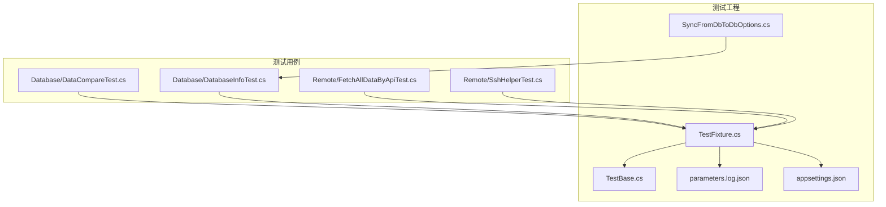
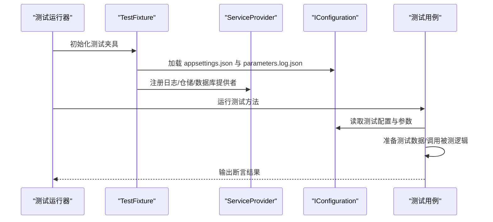
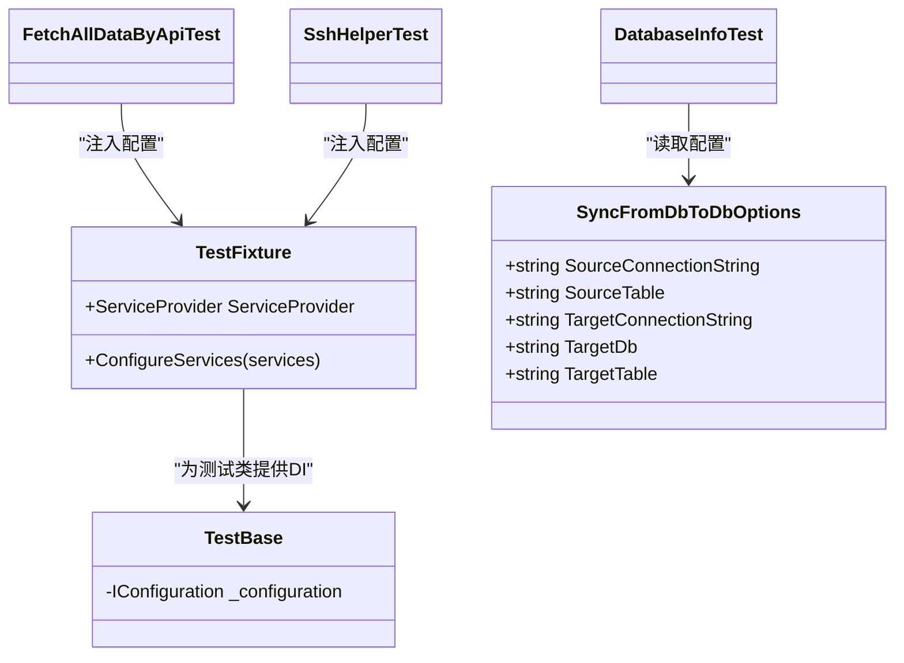

# 测试数据管理

<cite>
**本文引用的文件**
- [TestBase.cs](file://Sylas.RemoteTasks.Test/TestBase.cs)
- [TestFixture.cs](file://Sylas.RemoteTasks.Test/TestFixture.cs)
- [parameters.log.json](file://Sylas.RemoteTasks.Test/parameters.log.json)
- [appsettings.json](file://Sylas.RemoteTasks.App/appsettings.json)
- [SyncFromDbToDbOptions.cs](file://Sylas.RemoteTasks.Test/AppSettingsOptions/SyncFromDbToDbOptions.cs)
- [DataCompareTest.cs](file://Sylas.RemoteTasks.Test/Database/DataCompareTest.cs)
- [DatabaseInfoTest.cs](file://Sylas.RemoteTasks.Test/Database/DatabaseInfoTest.cs)
- [FetchAllDataByApiTest.cs](file://Sylas.RemoteTasks.Test/Remote/FetchAllDataByApiTest.cs)
- [SshHelperTest.cs](file://Sylas.RemoteTasks.Test/Remote/SshHelperTest.cs)
</cite>

## 目录
1. [简介](#简介)
2. [项目结构](#项目结构)
3. [核心组件](#核心组件)
4. [架构总览](#架构总览)
5. [详细组件分析](#详细组件分析)
6. [依赖关系分析](#依赖关系分析)
7. [性能考量](#性能考量)
8. [故障排查指南](#故障排查指南)
9. [结论](#结论)
10. [附录](#附录)

## 简介
本文件面向 Sylas.RemoteTasks 的测试数据管理，系统性说明测试数据的准备、存储与管理方法；解释测试配置文件、测试参数与测试数据集的组织方式；给出版本控制、数据隔离与数据清理策略；并提供最佳实践与常见问题解决方案，帮助开发者高效、安全地维护测试数据。

## 项目结构
测试数据与配置主要分布在以下位置：
- 测试基础框架：TestFixture、TestBase 提供 DI 容器与配置加载能力
- 测试配置文件：parameters.log.json（运行时参数）、appsettings.json（应用默认配置）
- 测试选项模型：SyncFromDbToDbOptions（映射配置节）
- 具体测试用例：Database、Remote 等命名空间下的测试类，演示测试数据准备与使用

图表来源
- [TestFixture.cs](file://Sylas.RemoteTasks.Test/TestFixture.cs#L1-L53)
- [TestBase.cs](file://Sylas.RemoteTasks.Test/TestBase.cs#L1-L15)
- [SyncFromDbToDbOptions.cs](file://Sylas.RemoteTasks.Test/AppSettingsOptions/SyncFromDbToDbOptions.cs#L1-L13)
- [parameters.log.json](file://Sylas.RemoteTasks.Test/parameters.log.json#L1-L102)
- [appsettings.json](file://Sylas.RemoteTasks.App/appsettings.json#L1-L142)
- [DataCompareTest.cs](file://Sylas.RemoteTasks.Test/Database/DataCompareTest.cs#L1-L191)
- [DatabaseInfoTest.cs](file://Sylas.RemoteTasks.Test/Database/DatabaseInfoTest.cs#L1-L174)
- [FetchAllDataByApiTest.cs](file://Sylas.RemoteTasks.Test/Remote/FetchAllDataByApiTest.cs#L1-L82)
- [SshHelperTest.cs](file://Sylas.RemoteTasks.Test/Remote/SshHelperTest.cs#L1-L59)

章节来源
- [TestFixture.cs](file://Sylas.RemoteTasks.Test/TestFixture.cs#L1-L53)
- [parameters.log.json](file://Sylas.RemoteTasks.Test/parameters.log.json#L1-L102)
- [appsettings.json](file://Sylas.RemoteTasks.App/appsettings.json#L1-L142)

## 核心组件
- 测试基类 TestBase：为每个测试类注入 IConfiguration，便于访问配置与参数
- 测试夹具 TestFixture：集中初始化 DI 容器，加载 appsettings.json 与 parameters.log.json，注册日志、仓储与数据库提供者
- 配置选项模型 SyncFromDbToDbOptions：将 parameters.log.json 中的同步配置映射为强类型对象
- 测试用例：通过 DI 获取 DatabaseInfo、IConfiguration 等，完成测试数据准备与验证

章节来源
- [TestBase.cs](file://Sylas.RemoteTasks.Test/TestBase.cs#L1-L15)
- [TestFixture.cs](file://Sylas.RemoteTasks.Test/TestFixture.cs#L1-L53)
- [SyncFromDbToDbOptions.cs](file://Sylas.RemoteTasks.Test/AppSettingsOptions/SyncFromDbToDbOptions.cs#L1-L13)

## 架构总览
测试数据管理的总体流程：
- 启动测试时，TestFixture 加载配置并构建 ServiceProvider
- 测试类通过 TestBase 注入 IConfiguration，按需读取 parameters.log.json 或 appsettings.json
- 测试用例根据业务场景准备测试数据（内存数据、文件参数、远程接口参数），并通过 DatabaseInfo 等组件进行验证或迁移

图表来源
- [TestFixture.cs](file://Sylas.RemoteTasks.Test/TestFixture.cs#L24-L50)
- [parameters.log.json](file://Sylas.RemoteTasks.Test/parameters.log.json#L1-L102)
- [appsettings.json](file://Sylas.RemoteTasks.App/appsettings.json#L1-L142)

## 详细组件分析

### 测试配置与参数管理
- 配置加载顺序：先加载 appsettings.json，再加载 parameters.log.json（后者优先覆盖前者相同键）
- 关键配置项：
  - ConnectionStrings：多数据库连接串（MySql/Pg/Oracle/SqlServer/Sqlite/Dm）
  - SyncFromDbToDbOptions：跨库同步的源库、目标库、表名与连接串
  - SyncFromApiToDbOptions：API 到数据库同步的目标连接串与请求参数配置文件路径
  - ValidationApi：批量校验接口的网关、URL、参数文件路径与令牌
  - SshHelperTest：远端主机连接与命令执行所需参数

章节来源
- [TestFixture.cs](file://Sylas.RemoteTasks.Test/TestFixture.cs#L26-L30)
- [parameters.log.json](file://Sylas.RemoteTasks.Test/parameters.log.json#L1-L102)
- [appsettings.json](file://Sylas.RemoteTasks.App/appsettings.json#L1-L142)

### 测试数据准备与使用

#### 内存测试数据
- DataCompareTest 展示了在测试中动态构造大规模集合作为源/目标数据，用于对比算法性能与正确性
- 特点：无需外部依赖，可快速迭代；注意内存占用与随机数据一致性

章节来源
- [DataCompareTest.cs](file://Sylas.RemoteTasks.Test/Database/DataCompareTest.cs#L18-L188)

#### 文件参数与远程接口参数
- FetchAllDataByApiTest 读取 ValidationApi 的参数文件路径，结合令牌批量调用接口，将结果写入文件
- 优点：参数与执行分离，便于复现与回归
- 注意：参数文件路径需与运行环境一致，避免相对路径解析错误

章节来源
- [FetchAllDataByApiTest.cs](file://Sylas.RemoteTasks.Test/Remote/FetchAllDataByApiTest.cs#L58-L69)

#### SSH 远端命令与文件传输
- SshHelperTest 通过配置中的主机、端口、用户名、私钥与命令模板，执行远端命令并输出结果
- 建议：命令模板支持变量替换，确保敏感信息不硬编码在配置中

章节来源
- [SshHelperTest.cs](file://Sylas.RemoteTasks.Test/Remote/SshHelperTest.cs#L16-L56)

#### 跨库同步与表复制
- DatabaseInfoTest 使用 SyncFromDbToDbOptions 读取配置，执行单表或全库数据迁移
- 支持不同数据库类型之间的表结构生成与数据插入，适合验证兼容性与性能

章节来源
- [DatabaseInfoTest.cs](file://Sylas.RemoteTasks.Test/Database/DatabaseInfoTest.cs#L48-L91)
- [SyncFromDbToDbOptions.cs](file://Sylas.RemoteTasks.Test/AppSettingsOptions/SyncFromDbToDbOptions.cs#L1-L13)

### 测试数据版本控制策略
- parameters.log.json 作为“运行时参数”应纳入版本控制，但建议将敏感字段（如密码）移出仓库或使用密钥管理工具
- 对于大体量测试数据文件（如参数文件），建议仅提交样例与生成脚本，避免提交真实数据
- 使用 Git LFS 管理二进制大文件，或采用“文件哈希+外部存储”的方式追踪数据

### 数据隔离策略
- 为测试单独建立独立的数据库实例或模式，避免与开发/生产数据冲突
- 使用随机化的表名或前缀，降低并发测试的相互影响
- 对于 SSH 远端测试，限定命令作用范围与目标路径，避免误操作

### 数据清理策略
- 单元测试结束后删除临时表或清空测试数据，防止状态污染
- 对于文件型参数，测试完成后清理生成的中间文件
- 远端测试执行后恢复配置或回滚变更

## 依赖关系分析
- TestFixture 依赖 IConfiguration、日志、仓储与数据库提供者
- 测试类通过 TestBase 注入 IConfiguration，按需读取 parameters.log.json 与 appsettings.json
- DatabaseInfoTest 依赖 SyncFromDbToDbOptions 强类型配置
- FetchAllDataByApiTest 依赖 ValidationApi 配置与参数文件
- SshHelperTest 依赖 SshHelper 与模板解析工具

图表来源
- [TestFixture.cs](file://Sylas.RemoteTasks.Test/TestFixture.cs#L12-L50)
- [TestBase.cs](file://Sylas.RemoteTasks.Test/TestBase.cs#L10-L13)
- [SyncFromDbToDbOptions.cs](file://Sylas.RemoteTasks.Test/AppSettingsOptions/SyncFromDbToDbOptions.cs#L3-L11)
- [DatabaseInfoTest.cs](file://Sylas.RemoteTasks.Test/Database/DatabaseInfoTest.cs#L10-L41)
- [FetchAllDataByApiTest.cs](file://Sylas.RemoteTasks.Test/Remote/FetchAllDataByApiTest.cs#L11-L22)
- [SshHelperTest.cs](file://Sylas.RemoteTasks.Test/Remote/SshHelperTest.cs#L10-L14)

## 性能考量
- 内存测试数据：DataCompareTest 构造大量对象，注意避免频繁 GC 与内存峰值过高
- 数据库迁移：批量插入与跨库同步建议分批处理、设置合适的连接池大小与超时时间
- 远端命令：SSH 批量命令建议异步并发执行并限制并发度，避免对远端造成压力

## 故障排查指南
- 配置读取失败
  - 现象：抛出“请在配置文件中添加...”异常
  - 排查：确认 parameters.log.json 与 appsettings.json 中键名拼写与层级正确
- 连接串无效
  - 现象：数据库连接失败或超时
  - 排查：核对 ConnectionStrings 下各数据库连接串；检查网络连通性与权限
- 远端命令执行失败
  - 现象：SshHelperTest 输出“操作失败”
  - 排查：确认主机、端口、用户名、私钥路径；检查命令模板变量是否正确解析
- 大数据量测试卡顿
  - 现象：内存占用高、执行缓慢
  - 排查：减少单次构造的数据规模；优化数据结构；必要时拆分为多个小用例

章节来源
- [DatabaseInfoTest.cs](file://Sylas.RemoteTasks.Test/Database/DatabaseInfoTest.cs#L48-L91)
- [FetchAllDataByApiTest.cs](file://Sylas.RemoteTasks.Test/Remote/FetchAllDataByApiTest.cs#L58-L69)
- [SshHelperTest.cs](file://Sylas.RemoteTasks.Test/Remote/SshHelperTest.cs#L16-L56)

## 结论
通过统一的配置加载机制与强类型选项模型，Sylas.RemoteTasks 的测试数据管理实现了“配置即数据”的理念。配合内存数据、文件参数与远端命令等手段，既能满足多样化的测试场景，又能保证可维护性与可扩展性。建议在团队内规范配置文件的版本控制策略、数据隔离与清理流程，持续提升测试效率与稳定性。

## 附录

### 测试配置文件使用与维护要点
- parameters.log.json 用于存放运行时参数与敏感信息，建议：
  - 仅提交示例文件，真实参数由 CI/CD 注入或本地生成
  - 对敏感字段使用环境变量或密钥管理工具
- appsettings.json 用于应用默认配置，建议：
  - 保持最小可用配置，复杂参数尽量放入 parameters.log.json
  - 对外公开的仓库中避免提交真实连接串与令牌

章节来源
- [parameters.log.json](file://Sylas.RemoteTasks.Test/parameters.log.json#L1-L102)
- [appsettings.json](file://Sylas.RemoteTasks.App/appsettings.json#L1-L142)