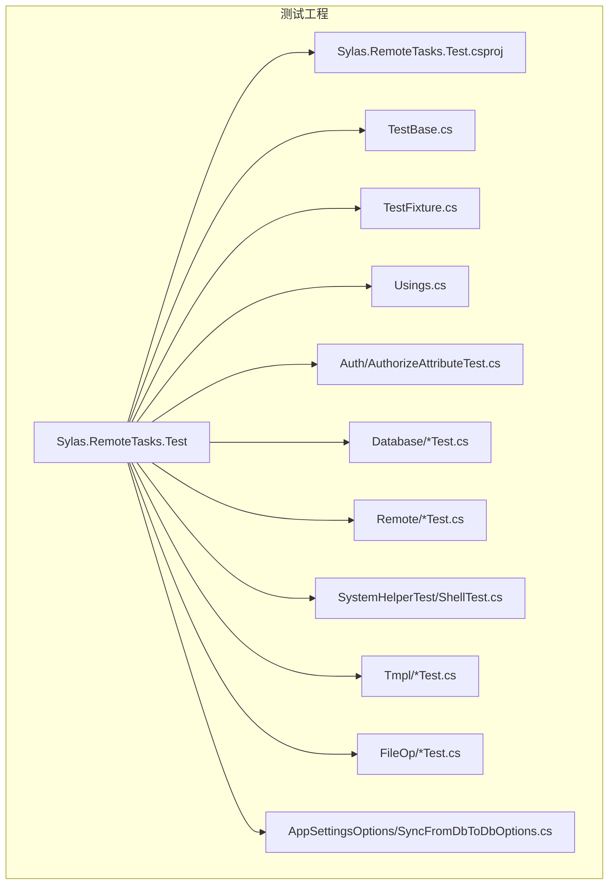
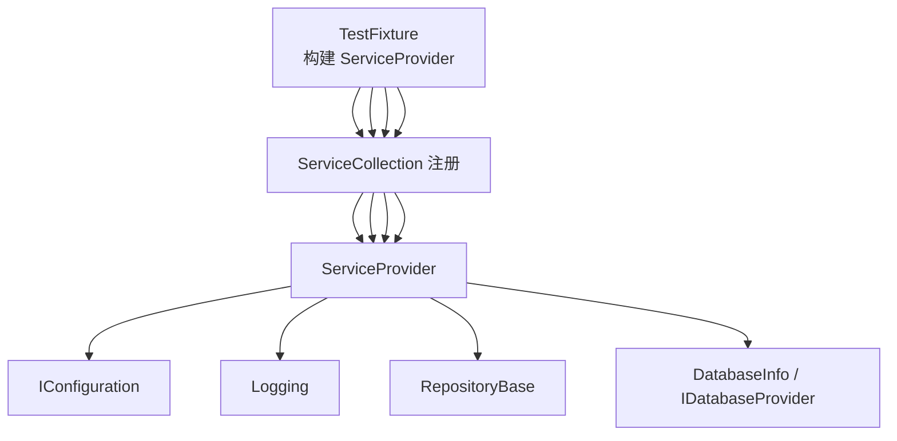
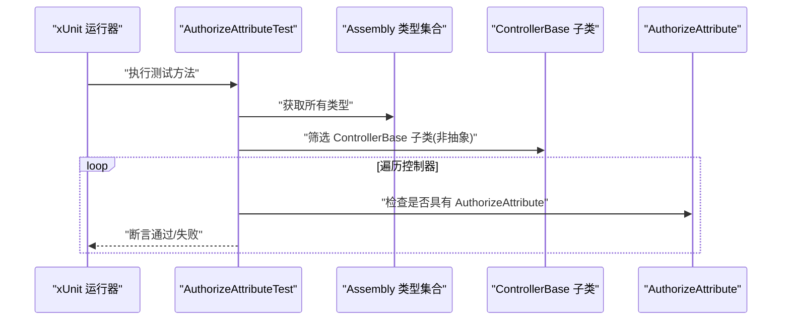
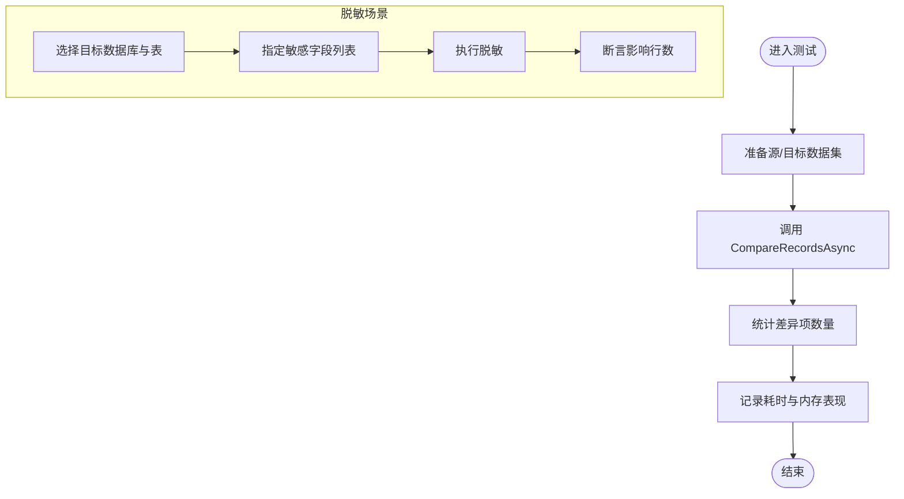
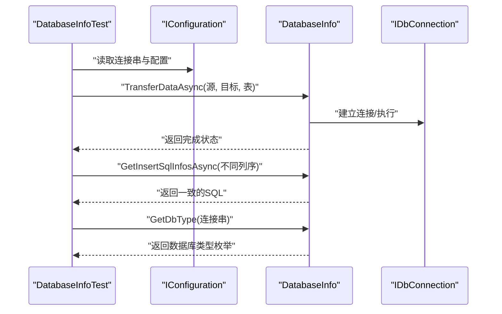
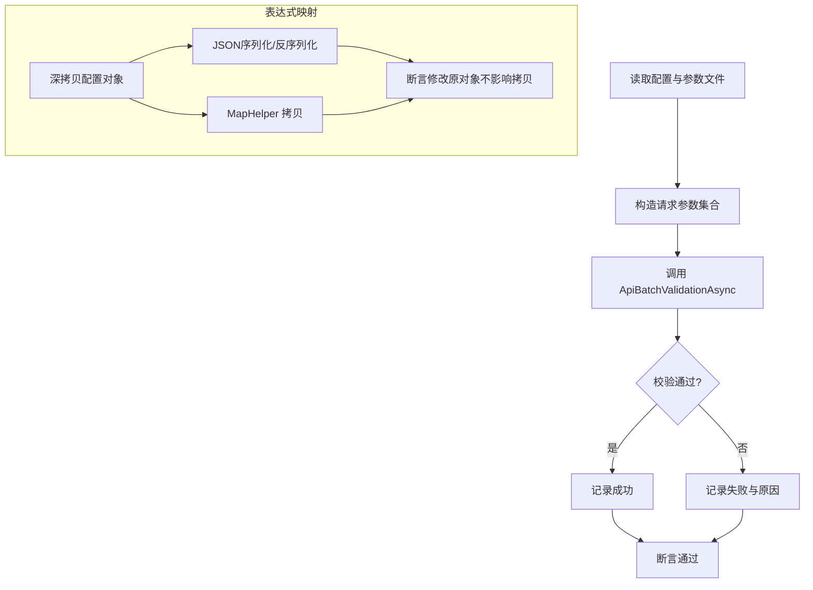
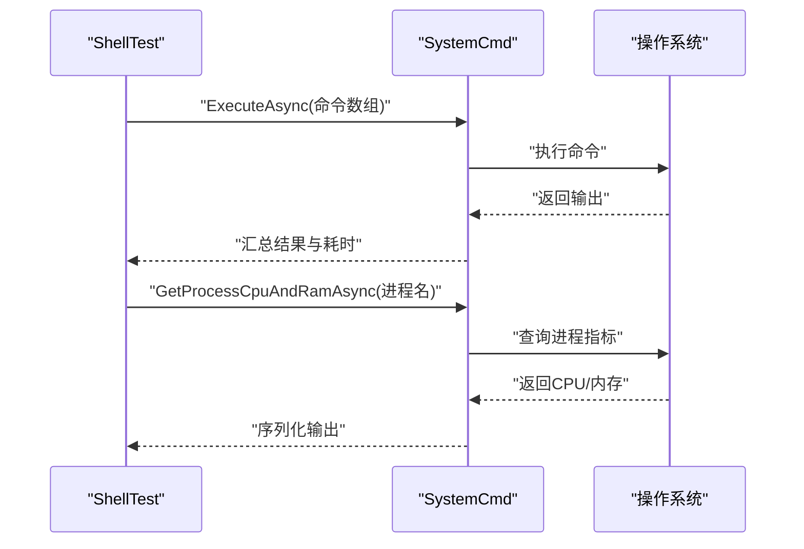
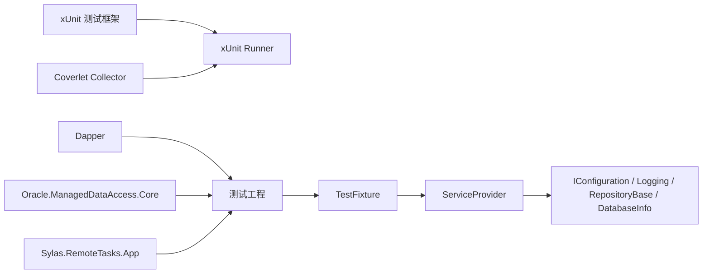

# 测试策略

<cite>
**本文引用的文件**
- [Sylas.RemoteTasks.Test.csproj](file://Sylas.RemoteTasks.Test/Sylas.RemoteTasks.Test.csproj)
- [TestBase.cs](file://Sylas.RemoteTasks.Test/TestBase.cs)
- [TestFixture.cs](file://Sylas.RemoteTasks.Test/TestFixture.cs)
- [Usings.cs](file://Sylas.RemoteTasks.Test/Usings.cs)
- [AuthorizeAttributeTest.cs](file://Sylas.RemoteTasks.Test/Auth/AuthorizeAttributeTest.cs)
- [DataCompareTest.cs](file://Sylas.RemoteTasks.Test/Database/DataCompareTest.cs)
- [DatabaseInfoTest.cs](file://Sylas.RemoteTasks.Test/Database/DatabaseInfoTest.cs)
- [FetchAllDataByApiTest.cs](file://Sylas.RemoteTasks.Test/Remote/FetchAllDataByApiTest.cs)
- [ShellTest.cs](file://Sylas.RemoteTasks.Test/SystemHelperTest/ShellTest.cs)
- [FileHelperTest.cs](file://Sylas.RemoteTasks.Test/FileOp/FileHelperTest.cs)
- [RazorEngineTest.cs](file://Sylas.RemoteTasks.Test/Tmpl/RazorEngineTest.cs)
- [SyncFromDbToDbOptions.cs](file://Sylas.RemoteTasks.Test/AppSettingsOptions/SyncFromDbToDbOptions.cs)
- [appsettings.json](file://Sylas.RemoteTasks.App/appsettings.json)
- [README.md](file://README.md)
</cite>

## 目录
1. [简介](#简介)
2. [项目结构](#项目结构)
3. [核心组件](#核心组件)
4. [架构总览](#架构总览)
5. [详细组件分析](#详细组件分析)
6. [依赖关系分析](#依赖关系分析)
7. [性能考量](#性能考量)
8. [故障排查指南](#故障排查指南)
9. [结论](#结论)
10. [附录](#附录)

## 简介
本测试策略文档面向 Sylas.RemoteTasks 的测试体系，涵盖单元测试、集成测试、测试数据管理、测试最佳实践、持续集成建议、覆盖率与质量标准、测试环境搭建与工具使用、常见问题与调试技巧。文档基于现有测试工程与测试用例进行系统化梳理，并提供可操作的落地建议。

## 项目结构
测试工程位于 Sylas.RemoteTasks.Test，采用 xUnit 作为测试框架，通过依赖注入容器（IServiceCollection/ServiceProvider）在 TestFixture 中统一注册服务，TestBase 提供对 IConfiguration 的访问能力；测试用例按功能域划分在不同命名空间下，如 Database、Remote、SystemHelperTest、Tmpl、FileOp、Auth 等。

图表来源
- [Sylas.RemoteTasks.Test.csproj](file://Sylas.RemoteTasks.Test/Sylas.RemoteTasks.Test.csproj#L1-L44)
- [TestBase.cs](file://Sylas.RemoteTasks.Test/TestBase.cs#L1-L15)
- [TestFixture.cs](file://Sylas.RemoteTasks.Test/TestFixture.cs#L1-L53)
- [Usings.cs](file://Sylas.RemoteTasks.Test/Usings.cs#L1-L1)
- [AuthorizeAttributeTest.cs](file://Sylas.RemoteTasks.Test/Auth/AuthorizeAttributeTest.cs#L1-L26)
- [DataCompareTest.cs](file://Sylas.RemoteTasks.Test/Database/DataCompareTest.cs#L1-L191)
- [DatabaseInfoTest.cs](file://Sylas.RemoteTasks.Test/Database/DatabaseInfoTest.cs#L1-L174)
- [FetchAllDataByApiTest.cs](file://Sylas.RemoteTasks.Test/Remote/FetchAllDataByApiTest.cs#L1-L82)
- [ShellTest.cs](file://Sylas.RemoteTasks.Test/SystemHelperTest/ShellTest.cs#L1-L101)
- [RazorEngineTest.cs](file://Sylas.RemoteTasks.Test/Tmpl/RazorEngineTest.cs#L1-L90)
- [FileHelperTest.cs](file://Sylas.RemoteTasks.Test/FileOp/FileHelperTest.cs#L1-L21)
- [SyncFromDbToDbOptions.cs](file://Sylas.RemoteTasks.Test/AppSettingsOptions/SyncFromDbToDbOptions.cs#L1-L13)

章节来源
- [Sylas.RemoteTasks.Test.csproj](file://Sylas.RemoteTasks.Test/Sylas.RemoteTasks.Test.csproj#L1-L44)
- [TestFixture.cs](file://Sylas.RemoteTasks.Test/TestFixture.cs#L1-L53)
- [TestBase.cs](file://Sylas.RemoteTasks.Test/TestBase.cs#L1-L15)
- [Usings.cs](file://Sylas.RemoteTasks.Test/Usings.cs#L1-L1)

## 核心组件
- 测试框架与运行器
  - 使用 xUnit 作为测试框架，Microsoft.NET.Test.Sdk 提供测试 SDK 支持，xunit.runner.visualstudio 用于 IDE/CI 集成。
  - 覆盖率收集由 coverlet.collector 提供。
- 依赖注入与测试基座
  - TestFixture 构建 ServiceProvider，注册 IConfiguration、日志、RepositoryBase 泛型仓储、DatabaseInfo 及其接口等，确保测试用例可复用相同的服务图。
  - TestBase 通过 IClassFixture<TestFixture> 注入 IConfiguration，便于读取配置与日志输出。
- 测试配置与资源
  - 通过 appsettings.json 加载日志、连接串、请求管道等配置；parameters.log.json 作为测试参数文件随项目复制到输出目录。
  - 部分测试配置项在测试类内部读取或构造，如 SyncFromDbToDbOptions。

章节来源
- [Sylas.RemoteTasks.Test.csproj](file://Sylas.RemoteTasks.Test/Sylas.RemoteTasks.Test.csproj#L11-L24)
- [TestFixture.cs](file://Sylas.RemoteTasks.Test/TestFixture.cs#L24-L50)
- [TestBase.cs](file://Sylas.RemoteTasks.Test/TestBase.cs#L10-L13)
- [appsettings.json](file://Sylas.RemoteTasks.App/appsettings.json#L1-L142)

## 架构总览
测试架构围绕 TestFixture 的服务注册展开，测试用例通过 IClassFixture 注入 ServiceProvider 获取所需服务，典型包括：
- 配置服务：IConfiguration
- 日志服务：ILogger 系列
- 数据库服务：DatabaseInfo、IDatabaseProvider、RepositoryBase<T>
- 工具与远程能力：SystemCmd、ApiValidationHelpers、DateTimeHelper 等

图表来源
- [TestFixture.cs](file://Sylas.RemoteTasks.Test/TestFixture.cs#L16-L50)

章节来源
- [TestFixture.cs](file://Sylas.RemoteTasks.Test/TestFixture.cs#L12-L50)

## 详细组件分析

### 授权属性一致性测试
- 目标：验证 MVC/ApiController 是否均带有 Authorize 特性，确保安全边界一致。
- 方法：反射扫描控制器类型，断言每个具体控制器均继承自 ControllerBase 并具备 AuthorizeAttribute。
- 关键点：遍历 Assembly 类型集合，过滤抽象类与具体控制器，逐个断言特性存在。

图表来源
- [AuthorizeAttributeTest.cs](file://Sylas.RemoteTasks.Test/Auth/AuthorizeAttributeTest.cs#L8-L17)

章节来源
- [AuthorizeAttributeTest.cs](file://Sylas.RemoteTasks.Test/Auth/AuthorizeAttributeTest.cs#L1-L26)

### 数据库对比与脱敏测试
- 数据对比
  - 场景：构造大规模源/目标数据集，调用 CompareRecordsAsync 对比差异，统计仅在源存在、仅在目标存在、变更项数量。
  - 性能观察：通过 ITestOutputHelper 输出耗时，对比不同数据结构（JObject vs IDictionary）的性能与内存占用。
- 数据脱敏
  - 场景：对指定数据库表的敏感字段执行脱敏，统计影响行数。

图表来源
- [DataCompareTest.cs](file://Sylas.RemoteTasks.Test/Database/DataCompareTest.cs#L18-L188)
- [FetchAllDataByApiTest.cs](file://Sylas.RemoteTasks.Test/Remote/FetchAllDataByApiTest.cs#L28-L35)

章节来源
- [DataCompareTest.cs](file://Sylas.RemoteTasks.Test/Database/DataCompareTest.cs#L1-L191)
- [FetchAllDataByApiTest.cs](file://Sylas.RemoteTasks.Test/Remote/FetchAllDataByApiTest.cs#L1-L82)

### 跨库同步与建表测试
- 单表同步：根据配置项读取源/目标连接串与表名，执行 TransferDataAsync。
- 插入 SQL 顺序一致性：对同一组数据以不同列顺序构造，验证生成的 INSERT SQL 一致。
- 全库同步：遍历多种数据库类型连接串，复制表结构与数据，记录日志。
- 数据库类型识别：根据连接串断言识别结果与键一致。

图表来源
- [DatabaseInfoTest.cs](file://Sylas.RemoteTasks.Test/Database/DatabaseInfoTest.cs#L48-L102)

章节来源
- [DatabaseInfoTest.cs](file://Sylas.RemoteTasks.Test/Database/DatabaseInfoTest.cs#L1-L174)
- [SyncFromDbToDbOptions.cs](file://Sylas.RemoteTasks.Test/AppSettingsOptions/SyncFromDbToDbOptions.cs#L1-L13)

### 远程 API 批量校验与表达式映射测试
- API 批量校验：读取参数文件，对网关 API 进行批量请求校验，支持指定起始索引与批量大小。
- 表达式映射：对比 MapHelper 深拷贝与 JSON 序列化反序列化的结果，断言修改原对象不会影响拷贝对象。
- 时间格式化：验证 DateTimeHelper.FormatSeconds 的格式化输出。

图表来源
- [FetchAllDataByApiTest.cs](file://Sylas.RemoteTasks.Test/Remote/FetchAllDataByApiTest.cs#L58-L79)

章节来源
- [FetchAllDataByApiTest.cs](file://Sylas.RemoteTasks.Test/Remote/FetchAllDataByApiTest.cs#L1-L82)

### 系统命令与进程监控测试
- 并行执行：对多条命令进行串行与并行执行对比，输出耗时。
- 进程信息：获取服务器与应用信息、进程 CPU/内存指标，支持并发查询多个进程。

图表来源
- [ShellTest.cs](file://Sylas.RemoteTasks.Test/SystemHelperTest/ShellTest.cs#L11-L98)

章节来源
- [ShellTest.cs](file://Sylas.RemoteTasks.Test/SystemHelperTest/ShellTest.cs#L1-L101)

### 模板引擎与文件操作测试
- RazorEngine 基础：验证模板变量、字典模型、静态方法、多行代码块渲染。
- 文件操作：当前为空壳测试，后续可扩展为文件读写、路径解析、权限校验等。

章节来源
- [RazorEngineTest.cs](file://Sylas.RemoteTasks.Test/Tmpl/RazorEngineTest.cs#L1-L90)
- [FileHelperTest.cs](file://Sylas.RemoteTasks.Test/FileOp/FileHelperTest.cs#L1-L21)

## 依赖关系分析
- 测试工程依赖
  - Microsoft.NET.Test.Sdk、xunit、xunit.runner.visualstudio、coverlet.collector
  - Dapper、Oracle.ManagedDataAccess.Core（数据库相关）
  - 对 Sylas.RemoteTasks.App 的项目引用，以便测试应用层逻辑
- 服务注册与耦合
  - TestFixture 统一注册 IConfiguration、日志、RepositoryBase<T>、DatabaseInfo 及其接口，降低测试用例重复配置成本。
  - 测试用例通过 ServiceProvider 获取服务，避免直接实例化外部依赖，提升可测性与隔离度。

图表来源
- [Sylas.RemoteTasks.Test.csproj](file://Sylas.RemoteTasks.Test/Sylas.RemoteTasks.Test.csproj#L11-L28)
- [TestFixture.cs](file://Sylas.RemoteTasks.Test/TestFixture.cs#L16-L50)

章节来源
- [Sylas.RemoteTasks.Test.csproj](file://Sylas.RemoteTasks.Test/Sylas.RemoteTasks.Test.csproj#L1-L44)
- [TestFixture.cs](file://Sylas.RemoteTasks.Test/TestFixture.cs#L12-L50)

## 性能考量
- 大规模数据对比：DataCompareTest 展示了在 5 万/1 千级数据规模下的对比流程与耗时记录，建议在 CI 中保留基准用例，避免回归性能退化。
- SQL 生成一致性：DatabaseInfoTest 验证不同列顺序的数据生成一致的 INSERT SQL，有助于保证跨库同步稳定性。
- 命令执行效率：ShellTest 对比串行与并行执行，建议在真实环境中结合并发度与系统负载评估最优策略。
- 覆盖率收集：通过 coverlet.collector 自动采集覆盖率，建议在 PR/合并前设置覆盖率阈值门禁。

章节来源
- [DataCompareTest.cs](file://Sylas.RemoteTasks.Test/Database/DataCompareTest.cs#L18-L188)
- [DatabaseInfoTest.cs](file://Sylas.RemoteTasks.Test/Database/DatabaseInfoTest.cs#L60-L74)
- [ShellTest.cs](file://Sylas.RemoteTasks.Test/SystemHelperTest/ShellTest.cs#L32-L64)

## 故障排查指南
- 配置缺失
  - 现象：读取连接串或配置节时报错。
  - 处理：确认 parameters.log.json 与 appsettings.json 的路径与内容；确保项目文件中包含 CopyToOutputDirectory 规则。
- 数据库连接失败
  - 现象：TransferDataAsync 或 GetDbConnection 抛异常。
  - 处理：核对连接串关键字与数据库驱动；在 DatabaseInfoTest 中逐一验证 GetDbType 与表存在性。
- 跨库同步失败
  - 现象：目标库建表或插入报错。
  - 处理：检查目标库权限、字符集/排序规则兼容性；参考 DatabaseInfoTest 的建表与插入流程逐步定位。
- API 批量校验异常
  - 现象：参数文件格式错误或网关不可达。
  - 处理：先验证参数文件 JSON 格式，再检查 ValidationApi 配置项与 Token。
- 日志与输出
  - 建议：利用 ITestOutputHelper 输出中间结果，便于定位问题；在 TestFixture 中启用 Console/Debug 日志提供程序。

章节来源
- [DatabaseInfoTest.cs](file://Sylas.RemoteTasks.Test/Database/DatabaseInfoTest.cs#L27-L41)
- [FetchAllDataByApiTest.cs](file://Sylas.RemoteTasks.Test/Remote/FetchAllDataByApiTest.cs#L44-L68)
- [TestFixture.cs](file://Sylas.RemoteTasks.Test/TestFixture.cs#L32-L40)

## 结论
本测试策略以 TestFixture 为核心，统一注册服务与配置，结合 xUnit 测试用例覆盖授权、数据库对比与同步、远程 API 校验、系统命令与进程监控、模板引擎与文件操作等关键领域。建议在 CI 中引入覆盖率门禁、性能回归基线与数据库多类型验证，持续提升代码质量与交付稳定性。

## 附录

### 测试框架与工具
- 测试框架：xUnit
- 运行器：xunit.runner.visualstudio
- 覆盖率：coverlet.collector
- 数据库驱动：Dapper、Oracle.ManagedDataAccess.Core
- 项目引用：Sylas.RemoteTasks.App

章节来源
- [Sylas.RemoteTasks.Test.csproj](file://Sylas.RemoteTasks.Test/Sylas.RemoteTasks.Test.csproj#L11-L28)

### 测试数据管理
- 配置文件
  - appsettings.json：日志、连接串、请求管道、邮件等全局配置
  - parameters.log.json：测试参数文件，随项目复制到输出目录
- 测试配置对象
  - SyncFromDbToDbOptions：跨库同步的源/目标连接串与表名配置

章节来源
- [appsettings.json](file://Sylas.RemoteTasks.App/appsettings.json#L1-L142)
- [SyncFromDbToDbOptions.cs](file://Sylas.RemoteTasks.Test/AppSettingsOptions/SyncFromDbToDbOptions.cs#L1-L13)

### 测试最佳实践
- 使用 IClassFixture 注入 ServiceProvider，避免重复初始化
- 利用 ITestOutputHelper 输出中间结果，便于调试
- 对大规模数据处理用例，记录耗时与内存占用，形成性能基线
- 对跨库同步用例，逐一验证数据库类型识别与建表/插入流程
- 对 API 校验用例，先验证参数文件格式，再进行批量校验

章节来源
- [TestBase.cs](file://Sylas.RemoteTasks.Test/TestBase.cs#L10-L13)
- [DataCompareTest.cs](file://Sylas.RemoteTasks.Test/Database/DataCompareTest.cs#L177-L187)
- [DatabaseInfoTest.cs](file://Sylas.RemoteTasks.Test/Database/DatabaseInfoTest.cs#L96-L102)

### 持续集成建议
- 触发条件：PR/Merge 请求触发完整测试套件
- 步骤建议：
  - 恢复/安装依赖
  - 编译测试工程
  - 运行 xUnit 测试并生成覆盖率报告
  - 覆盖率门禁：设定最小覆盖率阈值
  - 性能回归：对比 DataCompareTest/ShellTest 的耗时基线
- 容器化部署：README 中提供了 Docker 部署示例，可在 CI 中拉起后端服务进行端到端验证（如需）

章节来源
- [README.md](file://README.md#L4-L17)