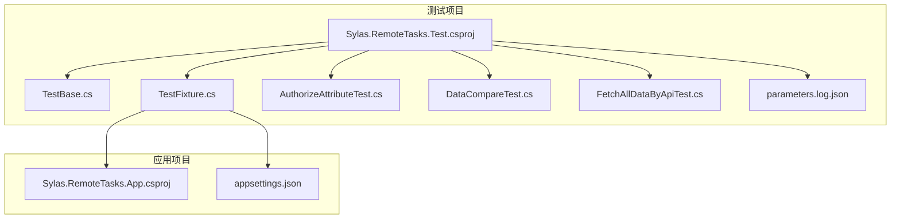
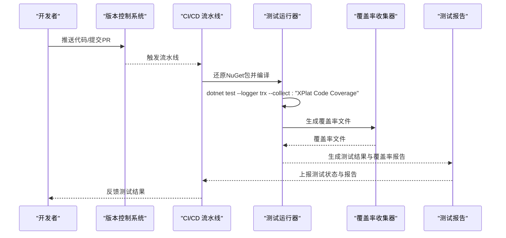
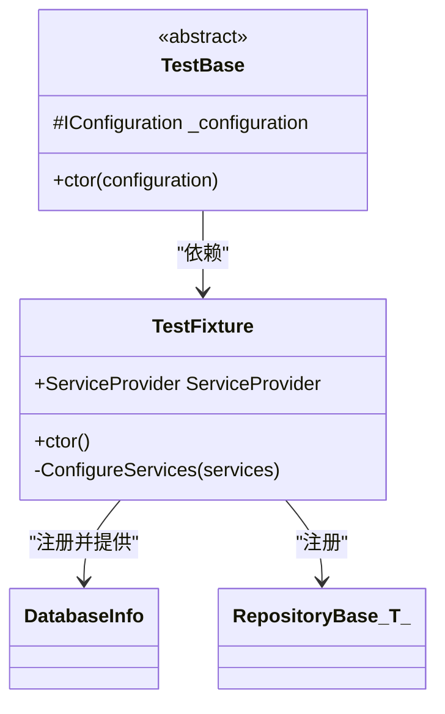
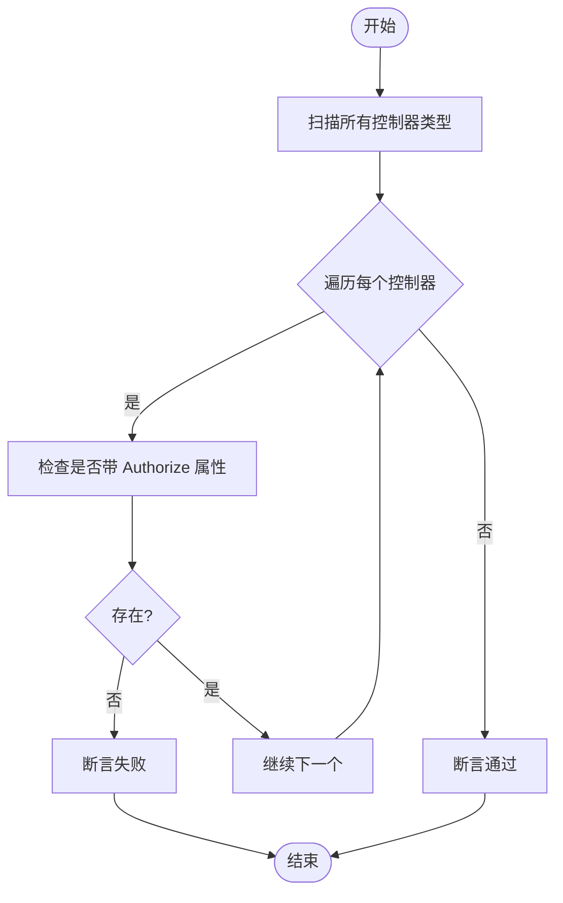
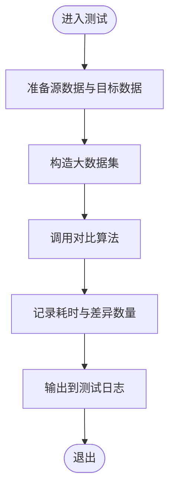
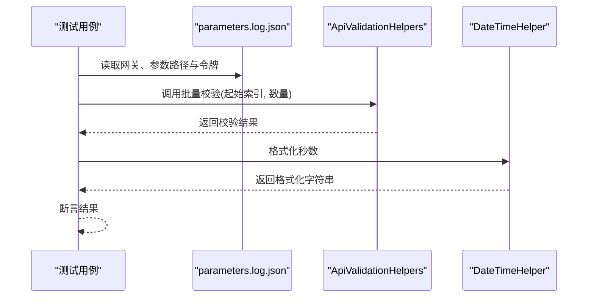
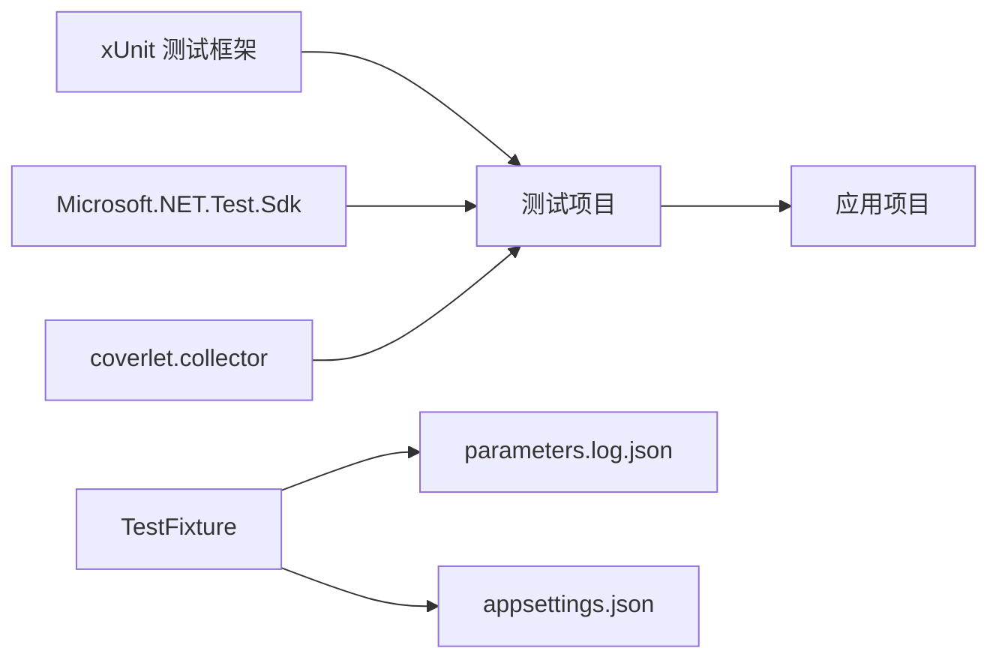

# 测试自动化

<cite>
**本文引用的文件**
- [Sylas.RemoteTasks.Test.csproj](file://Sylas.RemoteTasks.Test/Sylas.RemoteTasks.Test.csproj)
- [TestBase.cs](file://Sylas.RemoteTasks.Test/TestBase.cs)
- [TestFixture.cs](file://Sylas.RemoteTasks.Test/TestFixture.cs)
- [AuthorizeAttributeTest.cs](file://Sylas.RemoteTasks.Test/Auth/AuthorizeAttributeTest.cs)
- [DataCompareTest.cs](file://Sylas.RemoteTasks.Test/Database/DataCompareTest.cs)
- [FetchAllDataByApiTest.cs](file://Sylas.RemoteTasks.Test/Remote/FetchAllDataByApiTest.cs)
- [parameters.log.json](file://Sylas.RemoteTasks.Test/parameters.log.json)
- [appsettings.json](file://Sylas.RemoteTasks.App/appsettings.json)
- [SyncFromDbToDbOptions.cs](file://Sylas.RemoteTasks.Test/AppSettingsOptions/SyncFromDbToDbOptions.cs)
- [README.md](file://README.md)
</cite>

## 目录
1. [简介](#简介)
2. [项目结构](#项目结构)
3. [核心组件](#核心组件)
4. [架构总览](#架构总览)
5. [详细组件分析](#详细组件分析)
6. [依赖关系分析](#依赖关系分析)
7. [性能考量](#性能考量)
8. [故障排除指南](#故障排除指南)
9. [结论](#结论)
10. [附录](#附录)

## 简介
本文件面向 Sylas.RemoteTasks 的测试自动化，聚焦于持续集成（CI）环境下的测试配置与执行流程，涵盖以下主题：
- 如何在 CI/CD 流水线中运行测试、收集测试报告与分析测试覆盖率
- 测试环境的自动配置与测试数据的自动准备
- 测试结果的自动报告与最佳实践
- 常见问题排查与建议

本项目采用 .NET 10、xUnit 测试框架，并通过覆盖收集器（coverlet.collector）实现覆盖率统计；测试项目对应用层与数据库模块进行单元与集成测试。

## 项目结构
Sylas.RemoteTasks 采用多项目解决方案组织，测试相关的关键位置如下：
- 测试项目：Sylas.RemoteTasks.Test
  - 使用 xUnit 作为测试框架，依赖 Microsoft.NET.Test.Sdk
  - 引入 coverlet.collector 以支持覆盖率收集
  - 通过 TestFixture 注入依赖并加载配置文件
- 应用项目：Sylas.RemoteTasks.App
  - 提供默认配置 appsettings.json，定义日志、连接串、Kestrel 端点等
- 配置与参数
  - parameters.log.json：集中存放数据库连接串、API 网关、验证接口等测试参数
  - appsettings.json：开发环境配置，便于本地调试与 CI 环境映射

图表来源
- [Sylas.RemoteTasks.Test.csproj](file://Sylas.RemoteTasks.Test/Sylas.RemoteTasks.Test.csproj#L1-L44)
- [TestBase.cs](file://Sylas.RemoteTasks.Test/TestBase.cs#L1-L15)
- [TestFixture.cs](file://Sylas.RemoteTasks.Test/TestFixture.cs#L1-L53)
- [AuthorizeAttributeTest.cs](file://Sylas.RemoteTasks.Test/Auth/AuthorizeAttributeTest.cs#L1-L26)
- [DataCompareTest.cs](file://Sylas.RemoteTasks.Test/Database/DataCompareTest.cs#L1-L191)
- [FetchAllDataByApiTest.cs](file://Sylas.RemoteTasks.Test/Remote/FetchAllDataByApiTest.cs#L1-L82)
- [parameters.log.json](file://Sylas.RemoteTasks.Test/parameters.log.json#L1-L110)
- [appsettings.json](file://Sylas.RemoteTasks.App/appsettings.json#L1-L142)

章节来源
- [Sylas.RemoteTasks.Test.csproj](file://Sylas.RemoteTasks.Test/Sylas.RemoteTasks.Test.csproj#L1-L44)
- [parameters.log.json](file://Sylas.RemoteTasks.Test/parameters.log.json#L1-L110)
- [appsettings.json](file://Sylas.RemoteTasks.App/appsettings.json#L1-L142)

## 核心组件
- 测试项目配置与依赖
  - 使用 xUnit 与 Microsoft.NET.Test.Sdk，启用 coverlet.collector 收集覆盖率
  - 通过 ProjectReference 引用应用项目，确保测试可访问应用层逻辑
- 测试基类与固定装置
  - TestBase 提供对 IConfiguration 的注入，便于各测试共享配置
  - TestFixture 构建 ServiceProvider，注册日志、配置与数据库相关服务，统一测试上下文
- 配置与参数
  - parameters.log.json 集中管理数据库连接串、API 网关、验证接口等关键参数
  - appsettings.json 提供默认日志与 Kestrel 等配置，便于本地与 CI 环境复用

章节来源
- [Sylas.RemoteTasks.Test.csproj](file://Sylas.RemoteTasks.Test/Sylas.RemoteTasks.Test.csproj#L11-L28)
- [TestBase.cs](file://Sylas.RemoteTasks.Test/TestBase.cs#L10-L13)
- [TestFixture.cs](file://Sylas.RemoteTasks.Test/TestFixture.cs#L16-L50)
- [parameters.log.json](file://Sylas.RemoteTasks.Test/parameters.log.json#L1-L110)
- [appsettings.json](file://Sylas.RemoteTasks.App/appsettings.json#L1-L142)

## 架构总览
下图展示测试自动化在 CI 环境中的典型交互：流水线触发后，拉取代码、安装 .NET SDK、还原包、运行测试并收集覆盖率与报告。

## 详细组件分析

### 组件一：测试基类与固定装置（TestFixture）
- 设计要点
  - 通过 ConfigurationBuilder 加载 appsettings.json 与 parameters.log.json，形成统一配置源
  - 注册日志系统（控制台与调试），便于在 CI 中输出日志
  - 注册仓储基类与数据库信息服务，支撑数据库相关测试
- 适用场景
  - 单元测试与集成测试均可复用该固定装置，确保测试隔离与一致性

图表来源
- [TestFixture.cs](file://Sylas.RemoteTasks.Test/TestFixture.cs#L12-L50)
- [TestBase.cs](file://Sylas.RemoteTasks.Test/TestBase.cs#L10-L13)

章节来源
- [TestFixture.cs](file://Sylas.RemoteTasks.Test/TestFixture.cs#L16-L50)
- [TestBase.cs](file://Sylas.RemoteTasks.Test/TestBase.cs#L10-L13)

### 组件二：认证属性测试（AuthorizeAttributeTest）
- 目标
  - 断言所有 MVC 控制器均带有 Authorize 属性，保障 API 安全性
- 实现思路
  - 反射扫描控制器类型，逐个校验 AuthorizeAttribute 存在性
- CI 集成
  - 作为快速安全检查的一部分，在 PR 或合并前执行

图表来源
- [AuthorizeAttributeTest.cs](file://Sylas.RemoteTasks.Test/Auth/AuthorizeAttributeTest.cs#L8-L17)

章节来源
- [AuthorizeAttributeTest.cs](file://Sylas.RemoteTasks.Test/Auth/AuthorizeAttributeTest.cs#L1-L26)

### 组件三：数据库数据对比测试（DataCompareTest）
- 目标
  - 验证数据库记录对比算法的正确性与性能表现
- 自动化要点
  - 动态构造大规模源数据与目标数据，模拟真实业务场景
  - 输出对比耗时与差异统计，便于性能回归
- CI 集成
  - 可作为性能回归测试的一部分，建议在专用流水线或夜间任务中运行

图表来源
- [DataCompareTest.cs](file://Sylas.RemoteTasks.Test/Database/DataCompareTest.cs#L18-L188)

章节来源
- [DataCompareTest.cs](file://Sylas.RemoteTasks.Test/Database/DataCompareTest.cs#L1-L191)

### 组件四：远程 API 数据处理测试（FetchAllDataByApiTest）
- 目标
  - 验证远程数据脱敏、表达式树映射、批量 API 校验与时间格式化等功能
- 关键步骤
  - 读取 parameters.log.json 中的配置路径，反序列化请求配置
  - 调用 ApiValidationHelpers 执行批量参数校验
  - 使用 DateTimeHelper 对大秒数进行格式化断言
- CI 集成
  - 建议在具备网络访问权限与测试数据的环境中运行，避免外部依赖不稳定导致误报

图表来源
- [FetchAllDataByApiTest.cs](file://Sylas.RemoteTasks.Test/Remote/FetchAllDataByApiTest.cs#L58-L69)
- [parameters.log.json](file://Sylas.RemoteTasks.Test/parameters.log.json#L26-L31)

章节来源
- [FetchAllDataByApiTest.cs](file://Sylas.RemoteTasks.Test/Remote/FetchAllDataByApiTest.cs#L1-L82)
- [parameters.log.json](file://Sylas.RemoteTasks.Test/parameters.log.json#L1-L110)

### 组件五：配置与参数管理（parameters.log.json 与 appsettings.json）
- parameters.log.json
  - 集中管理多种数据库连接串（MySQL、PostgreSQL、Oracle、SQL Server、SQLite、达梦等）
  - 包含 API 网关、令牌、参数文件路径等测试所需参数
- appsettings.json
  - 提供日志级别、Kestrel 端点、连接串关键字白名单等默认配置
  - 便于在 CI 环境中通过环境变量覆盖关键配置

章节来源
- [parameters.log.json](file://Sylas.RemoteTasks.Test/parameters.log.json#L1-L110)
- [appsettings.json](file://Sylas.RemoteTasks.App/appsettings.json#L1-L142)

## 依赖关系分析
- 测试项目对应用项目的依赖
  - 通过 ProjectReference 引用，使测试可以直接调用应用层服务与逻辑
- 测试运行时依赖
  - xUnit 与 Microsoft.NET.Test.Sdk 提供测试框架与SDK支持
  - coverlet.collector 提供跨平台覆盖率收集能力
- 配置依赖
  - TestFixture 依赖 IConfiguration，后者由 parameters.log.json 与 appsettings.json 共同构成

图表来源
- [Sylas.RemoteTasks.Test.csproj](file://Sylas.RemoteTasks.Test/Sylas.RemoteTasks.Test.csproj#L11-L28)
- [TestFixture.cs](file://Sylas.RemoteTasks.Test/TestFixture.cs#L26-L30)
- [parameters.log.json](file://Sylas.RemoteTasks.Test/parameters.log.json#L1-L110)
- [appsettings.json](file://Sylas.RemoteTasks.App/appsettings.json#L1-L142)

章节来源
- [Sylas.RemoteTasks.Test.csproj](file://Sylas.RemoteTasks.Test/Sylas.RemoteTasks.Test.csproj#L11-L28)
- [TestFixture.cs](file://Sylas.RemoteTasks.Test/TestFixture.cs#L24-L50)

## 性能考量
- 大数据量测试
  - DataCompareTest 构造大规模数据集进行对比，建议在专用 CI 作业中运行，避免影响主流水线速度
- 覆盖率收集
  - 使用 coverlet.collector 时，建议开启过滤以减少无关代码的覆盖率干扰
- 日志输出
  - 在 CI 环境中，建议将日志级别调整为 Debug，以便在失败时快速定位问题

## 故障排除指南
- 测试无法启动或找不到配置
  - 确认 parameters.log.json 与 appsettings.json 已随测试项目一起复制到输出目录
  - 在 CI 环境中，确保工作目录包含上述配置文件
- 数据库连接失败
  - 检查 parameters.log.json 中的连接串是否正确
  - 若为 CI 环境，优先使用环境变量注入敏感信息
- 覆盖率报告为空
  - 确认已启用 coverlet.collector 并在 dotnet test 命令中添加覆盖率收集参数
- API 访问受限
  - 确认 parameters.log.json 中的网关地址、令牌与参数路径正确
  - 在 CI 环境中，确保网络可达且允许访问测试 API

章节来源
- [Sylas.RemoteTasks.Test.csproj](file://Sylas.RemoteTasks.Test/Sylas.RemoteTasks.Test.csproj#L30-L37)
- [parameters.log.json](file://Sylas.RemoteTasks.Test/parameters.log.json#L1-L110)
- [appsettings.json](file://Sylas.RemoteTasks.App/appsettings.json#L1-L142)

## 结论
Sylas.RemoteTasks 的测试自动化以 xUnit 为核心，结合 coverlet.collector 实现覆盖率收集，并通过 TestFixture 统一测试环境配置。通过集中管理参数与配置文件，可在 CI/CD 流水线中稳定地运行各类测试，包括安全属性检查、数据库对比与远程 API 验证。建议在 CI 中按“安全检查 + 快速单元测试 + 性能回归测试”的策略分层执行，以提升反馈效率与稳定性。

## 附录
- 最佳实践清单
  - 在 CI 中分层执行测试，避免长耗时测试阻塞主流水线
  - 使用环境变量覆盖敏感配置，避免硬编码
  - 为覆盖率设置阈值门禁，防止覆盖率下降
  - 将日志输出与测试报告标准化，便于问题定位
- 参考部署脚本
  - README 中提供了基于 Docker 的部署示例，可用于验证测试环境的一致性

章节来源
- [README.md](file://README.md#L4-L17)