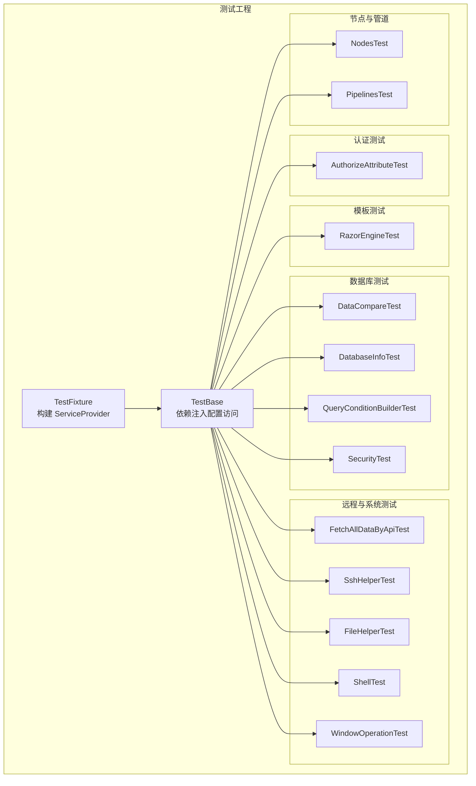
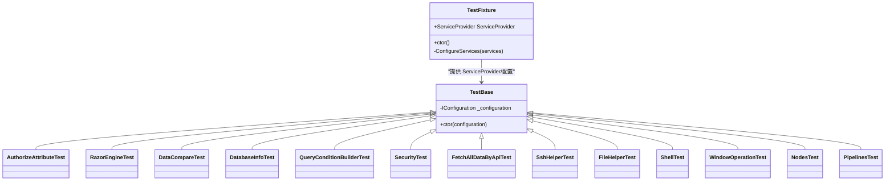
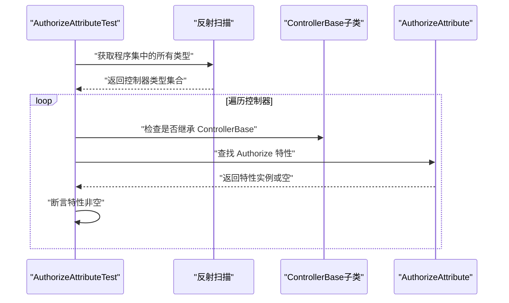
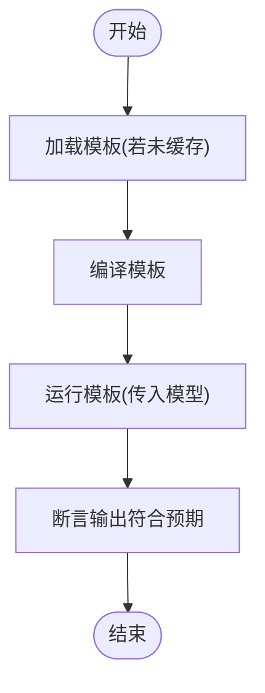
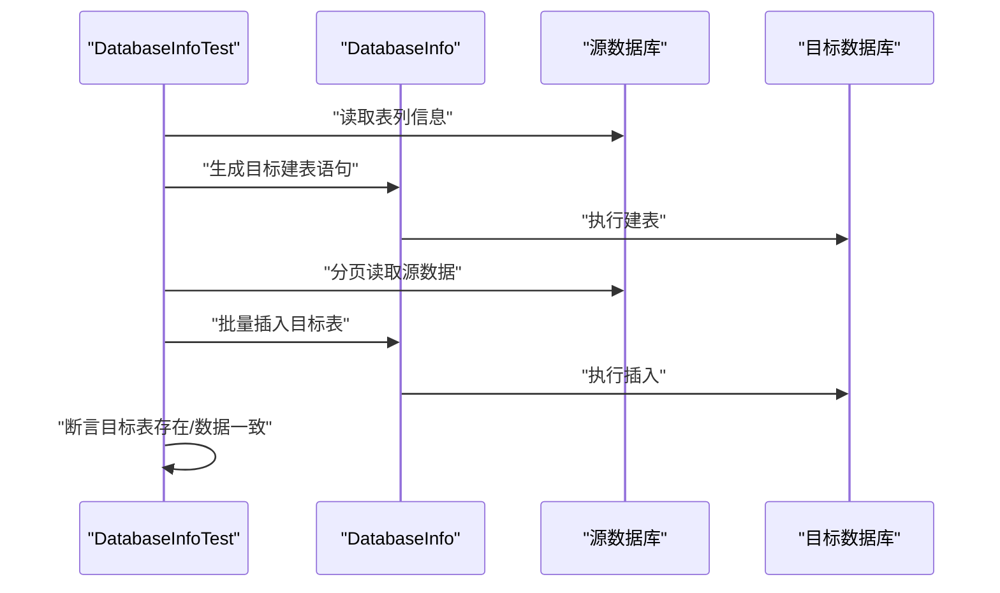
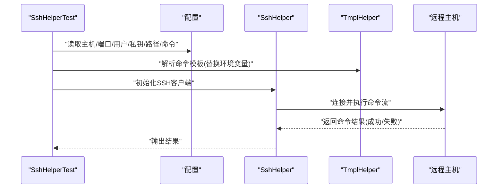
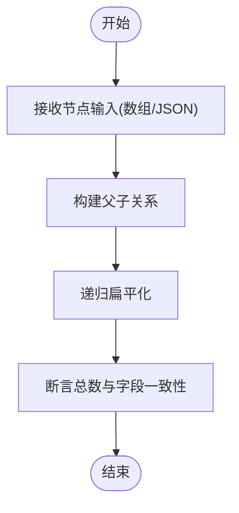
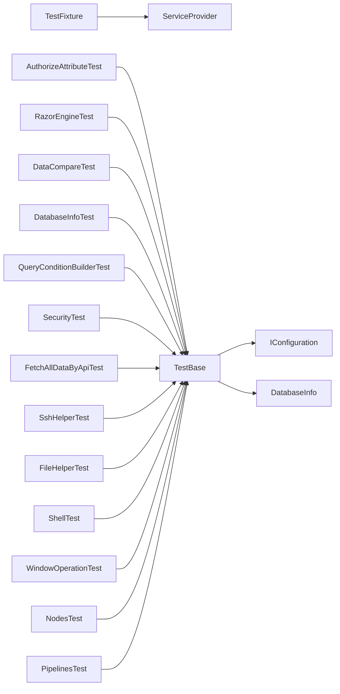

# 组件测试

<cite>
**本文引用的文件**
- [TestBase.cs](file://Sylas.RemoteTasks.Test/TestBase.cs)
- [TestFixture.cs](file://Sylas.RemoteTasks.Test/TestFixture.cs)
- [AuthorizeAttributeTest.cs](file://Sylas.RemoteTasks.Test/Auth/AuthorizeAttributeTest.cs)
- [RazorEngineTest.cs](file://Sylas.RemoteTasks.Test/Tmpl/RazorEngineTest.cs)
- [DataCompareTest.cs](file://Sylas.RemoteTasks.Test/Database/DataCompareTest.cs)
- [DatabaseInfoTest.cs](file://Sylas.RemoteTasks.Test/Database/DatabaseInfoTest.cs)
- [QueryConditionBuilderTest.cs](file://Sylas.RemoteTasks.Test/Database/QueryConditionBuilderTest.cs)
- [SecurityTest.cs](file://Sylas.RemoteTasks.Test/Database/SecurityTest.cs)
- [FetchAllDataByApiTest.cs](file://Sylas.RemoteTasks.Test/Remote/FetchAllDataByApiTest.cs)
- [SshHelperTest.cs](file://Sylas.RemoteTasks.Test/Remote/SshHelperTest.cs)
- [FileHelperTest.cs](file://Sylas.RemoteTasks.Test/FileOp/FileHelperTest.cs)
- [ShellTest.cs](file://Sylas.RemoteTasks.Test/SystemHelperTest/ShellTest.cs)
- [WindowOperationTest.cs](file://Sylas.RemoteTasks.Test/SystemHelperTest/WindowOperationTest.cs)
- [NodesTest.cs](file://Sylas.RemoteTasks.Test/Nodes/NodesTest.cs)
- [PipelinesTest.cs](file://Sylas.RemoteTasks.Test/Socket/PipelinesTest.cs)
</cite>

## 目录
1. [简介](#简介)
2. [项目结构](#项目结构)
3. [核心组件](#核心组件)
4. [架构总览](#架构总览)
5. [详细组件分析](#详细组件分析)
6. [依赖关系分析](#依赖关系分析)
7. [性能考量](#性能考量)
8. [故障排查指南](#故障排查指南)
9. [结论](#结论)
10. [附录](#附录)

## 简介
本文件面向 Sylas.RemoteTasks 的组件测试，系统性梳理并说明各核心组件（身份认证、模板引擎、数据库与数据处理、远程执行与系统辅助、节点解析与序列化）的测试方法与策略。重点覆盖以下方面：
- 单元测试与集成测试的设计思路
- 组件间交互测试与依赖注入测试
- 异常处理与边界条件验证
- 具体测试场景与用例设计方法

## 项目结构
测试工程采用基于 xUnit 的约定式测试组织方式，通过 TestFixture 在测试启动前完成服务注册与 DI 容器构建，TestBase 提供对 IConfiguration 的访问能力，确保各测试类可复用基础设施。

图表来源
- [TestFixture.cs](file://Sylas.RemoteTasks.Test/TestFixture.cs#L12-L51)
- [TestBase.cs](file://Sylas.RemoteTasks.Test/TestBase.cs#L10-L13)
- [AuthorizeAttributeTest.cs](file://Sylas.RemoteTasks.Test/Auth/AuthorizeAttributeTest.cs#L6-L25)
- [RazorEngineTest.cs](file://Sylas.RemoteTasks.Test/Tmpl/RazorEngineTest.cs#L9-L89)
- [DataCompareTest.cs](file://Sylas.RemoteTasks.Test/Database/DataCompareTest.cs#L8-L190)
- [DatabaseInfoTest.cs](file://Sylas.RemoteTasks.Test/Database/DatabaseInfoTest.cs#L10-L173)
- [QueryConditionBuilderTest.cs](file://Sylas.RemoteTasks.Test/Database/QueryConditionBuilderTest.cs#L10-L280)
- [SecurityTest.cs](file://Sylas.RemoteTasks.Test/Database/SecurityTest.cs#L7-L40)
- [FetchAllDataByApiTest.cs](file://Sylas.RemoteTasks.Test/Remote/FetchAllDataByApiTest.cs#L11-L81)
- [SshHelperTest.cs](file://Sylas.RemoteTasks.Test/Remote/SshHelperTest.cs#L10-L58)
- [FileHelperTest.cs](file://Sylas.RemoteTasks.Test/FileOp/FileHelperTest.cs#L8-L19)
- [ShellTest.cs](file://Sylas.RemoteTasks.Test/SystemHelperTest/ShellTest.cs#L8-L100)
- [WindowOperationTest.cs](file://Sylas.RemoteTasks.Test/SystemHelperTest/WindowOperationTest.cs#L8-L49)
- [NodesTest.cs](file://Sylas.RemoteTasks.Test/Nodes/NodesTest.cs#L11-L163)
- [PipelinesTest.cs](file://Sylas.RemoteTasks.Test/Socket/PipelinesTest.cs#L5-L14)

章节来源
- [TestFixture.cs](file://Sylas.RemoteTasks.Test/TestFixture.cs#L12-L51)
- [TestBase.cs](file://Sylas.RemoteTasks.Test/TestBase.cs#L10-L13)

## 核心组件
- 身份认证组件：通过扫描控制器并断言 Authorize 特性存在，验证 API 与 MVC 控制器均受保护。
- 模板引擎组件：验证 RazorEngine 基础渲染能力，支持匿名模型、字典模型、静态方法调用与多行代码块。
- 数据库与数据处理组件：涵盖跨库数据迁移、表结构生成、分页查询、条件构建、数据脱敏、AES 加解密等。
- 远程执行与系统辅助：SSH 命令执行、系统命令并发执行、窗口操作、全局热键、文件操作占位。
- 节点解析与序列化：多形态节点树扁平化与递归遍历，支持多种 JSON 类型输入。

章节来源
- [AuthorizeAttributeTest.cs](file://Sylas.RemoteTasks.Test/Auth/AuthorizeAttributeTest.cs#L6-L25)
- [RazorEngineTest.cs](file://Sylas.RemoteTasks.Test/Tmpl/RazorEngineTest.cs#L9-L89)
- [DataCompareTest.cs](file://Sylas.RemoteTasks.Test/Database/DataCompareTest.cs#L8-L190)
- [DatabaseInfoTest.cs](file://Sylas.RemoteTasks.Test/Database/DatabaseInfoTest.cs#L10-L173)
- [QueryConditionBuilderTest.cs](file://Sylas.RemoteTasks.Test/Database/QueryConditionBuilderTest.cs#L10-L280)
- [SecurityTest.cs](file://Sylas.RemoteTasks.Test/Database/SecurityTest.cs#L7-L40)
- [FetchAllDataByApiTest.cs](file://Sylas.RemoteTasks.Test/Remote/FetchAllDataByApiTest.cs#L11-L81)
- [SshHelperTest.cs](file://Sylas.RemoteTasks.Test/Remote/SshHelperTest.cs#L10-L58)
- [FileHelperTest.cs](file://Sylas.RemoteTasks.Test/FileOp/FileHelperTest.cs#L8-L19)
- [ShellTest.cs](file://Sylas.RemoteTasks.Test/SystemHelperTest/ShellTest.cs#L8-L100)
- [WindowOperationTest.cs](file://Sylas.RemoteTasks.Test/SystemHelperTest/WindowOperationTest.cs#L8-L49)
- [NodesTest.cs](file://Sylas.RemoteTasks.Test/Nodes/NodesTest.cs#L11-L163)
- [PipelinesTest.cs](file://Sylas.RemoteTasks.Test/Socket/PipelinesTest.cs#L5-L14)

## 架构总览
测试层通过 TestFixture 注册日志、配置与数据库相关服务，TestBase 为每个测试类注入 IConfiguration，从而在测试中统一访问配置与服务。

图表来源
- [TestFixture.cs](file://Sylas.RemoteTasks.Test/TestFixture.cs#L12-L51)
- [TestBase.cs](file://Sylas.RemoteTasks.Test/TestBase.cs#L10-L13)
- [AuthorizeAttributeTest.cs](file://Sylas.RemoteTasks.Test/Auth/AuthorizeAttributeTest.cs#L6-L25)
- [RazorEngineTest.cs](file://Sylas.RemoteTasks.Test/Tmpl/RazorEngineTest.cs#L9-L89)
- [DataCompareTest.cs](file://Sylas.RemoteTasks.Test/Database/DataCompareTest.cs#L8-L190)
- [DatabaseInfoTest.cs](file://Sylas.RemoteTasks.Test/Database/DatabaseInfoTest.cs#L10-L173)
- [QueryConditionBuilderTest.cs](file://Sylas.RemoteTasks.Test/Database/QueryConditionBuilderTest.cs#L10-L280)
- [SecurityTest.cs](file://Sylas.RemoteTasks.Test/Database/SecurityTest.cs#L7-L40)
- [FetchAllDataByApiTest.cs](file://Sylas.RemoteTasks.Test/Remote/FetchAllDataByApiTest.cs#L11-L81)
- [SshHelperTest.cs](file://Sylas.RemoteTasks.Test/Remote/SshHelperTest.cs#L10-L58)
- [FileHelperTest.cs](file://Sylas.RemoteTasks.Test/FileOp/FileHelperTest.cs#L8-L19)
- [ShellTest.cs](file://Sylas.RemoteTasks.Test/SystemHelperTest/ShellTest.cs#L8-L100)
- [WindowOperationTest.cs](file://Sylas.RemoteTasks.Test/SystemHelperTest/WindowOperationTest.cs#L8-L49)
- [NodesTest.cs](file://Sylas.RemoteTasks.Test/Nodes/NodesTest.cs#L11-L163)
- [PipelinesTest.cs](file://Sylas.RemoteTasks.Test/Socket/PipelinesTest.cs#L5-L14)

## 详细组件分析

### 身份认证组件测试
目标：确保所有 API 与 MVC 控制器均应用 Authorize 特性，防止未授权访问。
- 测试方法：反射扫描所有控制器类型，断言存在 Authorize 特性。
- 关键断言：每个控制器至少有一个 Authorize 特性实例。
- 场景设计要点：
  - 新增控制器需同时添加 Authorize 特性。
  - 对于开放接口，应明确标注忽略特性或走独立管线。
  - 与权限策略配合，验证不同角色访问行为。

图表来源
- [AuthorizeAttributeTest.cs](file://Sylas.RemoteTasks.Test/Auth/AuthorizeAttributeTest.cs#L6-L25)

章节来源
- [AuthorizeAttributeTest.cs](file://Sylas.RemoteTasks.Test/Auth/AuthorizeAttributeTest.cs#L6-L25)

### 模板引擎组件测试
目标：验证模板渲染在不同模型与语法下的正确性。
- 测试方法：
  - 匿名模型变量渲染
  - 字典模型（通过 ExpandoObject）变量渲染
  - 静态方法调用与多行代码块
- 关键断言：渲染结果符合预期；模板缓存与编译逻辑正常。
- 场景设计要点：
  - 模板缓存命中与首次编译路径
  - 动态模型与静态模型一致性
  - 多行代码块与局部变量作用域

图表来源
- [RazorEngineTest.cs](file://Sylas.RemoteTasks.Test/Tmpl/RazorEngineTest.cs#L9-L89)

章节来源
- [RazorEngineTest.cs](file://Sylas.RemoteTasks.Test/Tmpl/RazorEngineTest.cs#L9-L89)

### 数据库与数据处理组件测试
目标：验证跨库数据迁移、表结构生成、分页查询、条件构建、数据脱敏与安全工具。
- 跨库数据迁移与表复制：
  - 读取源库表列信息，生成目标库建表语句，批量插入数据。
  - 断言目标库表存在且数据一致。
- 分页查询与复杂条件构建：
  - 使用 QuerySqlBuilder 构造多表左连接、嵌套条件、排序与分页。
  - 与期望 SQL 与参数进行比对，并执行查询验证结果数量与字段一致性。
- 数据脱敏与 AES 加解密：
  - 对指定列执行脱敏，统计影响行数。
  - 验证 AES 字符串与字节加解密一致性。
- 大数据量对比：
  - 生成大规模源/目标数据集，对比差异集合大小与耗时。

图表来源
- [DatabaseInfoTest.cs](file://Sylas.RemoteTasks.Test/Database/DatabaseInfoTest.cs#L10-L173)

章节来源
- [DatabaseInfoTest.cs](file://Sylas.RemoteTasks.Test/Database/DatabaseInfoTest.cs#L10-L173)
- [QueryConditionBuilderTest.cs](file://Sylas.RemoteTasks.Test/Database/QueryConditionBuilderTest.cs#L10-L280)
- [DataCompareTest.cs](file://Sylas.RemoteTasks.Test/Database/DataCompareTest.cs#L8-L190)
- [SecurityTest.cs](file://Sylas.RemoteTasks.Test/Database/SecurityTest.cs#L7-L40)

### 远程执行与系统辅助组件测试
目标：验证 SSH 命令执行、系统命令并发执行、窗口操作与文件操作可用性。
- SSH 命令执行：
  - 读取配置中的主机、端口、用户、私钥、本地路径、远端路径与命令数组。
  - 通过模板解析环境变量，逐条执行命令并输出结果。
- 系统命令并发执行：
  - 并发执行多条系统命令，对比顺序执行与并行执行的耗时。
  - 获取服务器与应用信息、进程 CPU/内存指标。
- 文件操作：
  - FileHelperTest 当前为空，作为后续扩展点预留。

图表来源
- [SshHelperTest.cs](file://Sylas.RemoteTasks.Test/Remote/SshHelperTest.cs#L10-L58)

章节来源
- [SshHelperTest.cs](file://Sylas.RemoteTasks.Test/Remote/SshHelperTest.cs#L10-L58)
- [ShellTest.cs](file://Sylas.RemoteTasks.Test/SystemHelperTest/ShellTest.cs#L8-L100)
- [FileHelperTest.cs](file://Sylas.RemoteTasks.Test/FileOp/FileHelperTest.cs#L8-L19)

### 节点解析与序列化组件测试
目标：验证多形态节点树的扁平化与递归遍历，支持多种 JSON 输入类型。
- 测试方法：
  - Node 数组、JArray/JObject、JsonElement 列表三种输入形态。
  - 递归获取所有子节点，断言总数与关键字段一致性。
- 关键断言：扁平化后的节点顺序与原树一致；懒加载迭代器按需处理。
- 场景设计要点：
  - 大型树结构的性能与内存占用
  - 空节点与循环引用的健壮性

图表来源
- [NodesTest.cs](file://Sylas.RemoteTasks.Test/Nodes/NodesTest.cs#L11-L163)

章节来源
- [NodesTest.cs](file://Sylas.RemoteTasks.Test/Nodes/NodesTest.cs#L11-L163)

### 依赖注入与异常处理测试
- 依赖注入测试：
  - 通过 TestFixture 构建 ServiceProvider，确保日志、配置、仓储基类、数据库提供者等服务可用。
  - 在具体测试类中通过构造函数注入 IConfiguration 与 DatabaseInfo 等服务。
- 异常处理测试：
  - 配置缺失抛出异常（如连接字符串、参数文件路径）。
  - 模板/命令执行失败时输出详细消息，便于定位问题。
  - 数据库查询异常与参数不匹配时的断言与日志输出。

章节来源
- [TestFixture.cs](file://Sylas.RemoteTasks.Test/TestFixture.cs#L12-L51)
- [TestBase.cs](file://Sylas.RemoteTasks.Test/TestBase.cs#L10-L13)
- [FetchAllDataByApiTest.cs](file://Sylas.RemoteTasks.Test/Remote/FetchAllDataByApiTest.cs#L17-L81)
- [SshHelperTest.cs](file://Sylas.RemoteTasks.Test/Remote/SshHelperTest.cs#L10-L58)

## 依赖关系分析
- TestFixture 负责注册日志、配置与数据库相关服务，形成统一的测试上下文。
- TestBase 为各测试类提供 IConfiguration 访问，降低重复代码。
- 各测试类通过 IClassFixture<TestFixture> 获取 ServiceProvider，按需解析服务。
- 组件间耦合度低，测试关注点清晰，便于扩展与维护。

图表来源
- [TestFixture.cs](file://Sylas.RemoteTasks.Test/TestFixture.cs#L12-L51)
- [TestBase.cs](file://Sylas.RemoteTasks.Test/TestBase.cs#L10-L13)
- [AuthorizeAttributeTest.cs](file://Sylas.RemoteTasks.Test/Auth/AuthorizeAttributeTest.cs#L6-L25)
- [RazorEngineTest.cs](file://Sylas.RemoteTasks.Test/Tmpl/RazorEngineTest.cs#L9-L89)
- [DataCompareTest.cs](file://Sylas.RemoteTasks.Test/Database/DataCompareTest.cs#L8-L190)
- [DatabaseInfoTest.cs](file://Sylas.RemoteTasks.Test/Database/DatabaseInfoTest.cs#L10-L173)
- [QueryConditionBuilderTest.cs](file://Sylas.RemoteTasks.Test/Database/QueryConditionBuilderTest.cs#L10-L280)
- [SecurityTest.cs](file://Sylas.RemoteTasks.Test/Database/SecurityTest.cs#L7-L40)
- [FetchAllDataByApiTest.cs](file://Sylas.RemoteTasks.Test/Remote/FetchAllDataByApiTest.cs#L11-L81)
- [SshHelperTest.cs](file://Sylas.RemoteTasks.Test/Remote/SshHelperTest.cs#L10-L58)
- [FileHelperTest.cs](file://Sylas.RemoteTasks.Test/FileOp/FileHelperTest.cs#L8-L19)
- [ShellTest.cs](file://Sylas.RemoteTasks.Test/SystemHelperTest/ShellTest.cs#L8-L100)
- [WindowOperationTest.cs](file://Sylas.RemoteTasks.Test/SystemHelperTest/WindowOperationTest.cs#L8-L49)
- [NodesTest.cs](file://Sylas.RemoteTasks.Test/Nodes/NodesTest.cs#L11-L163)
- [PipelinesTest.cs](file://Sylas.RemoteTasks.Test/Socket/PipelinesTest.cs#L5-L14)

## 性能考量
- 数据对比与迁移：针对大数据量场景，优先使用字典枚举与批量插入，避免中间对象过多导致内存峰值。
- 查询构建：尽量使用参数化 SQL 与预编译，减少字符串拼接带来的性能损耗。
- 并发执行：系统命令与远程命令建议并行执行，但需注意资源竞争与输出合并。
- 日志与断言：在性能敏感路径减少冗余日志输出，仅在必要时开启详细日志。

## 故障排查指南
- 配置缺失
  - 现象：测试抛出“缺少配置”异常。
  - 排查：确认 appsettings.json 与 parameters.log.json 中对应键值存在。
- 数据库连接失败
  - 现象：连接字符串无效或目标库不可达。
  - 排查：核对连接字符串、网络连通性与目标数据库权限。
- 模板渲染异常
  - 现象：模板未缓存或模型类型不匹配。
  - 排查：确保模板已 AddTemplate/Compile；模型类型与模板期望一致。
- SSH 命令执行失败
  - 现象：命令无输出或返回失败。
  - 排查：检查主机、端口、用户、私钥与命令模板解析结果。
- 节点解析异常
  - 现象：扁平化结果为空或字段缺失。
  - 排查：确认父子字段映射与输入 JSON 结构一致。

章节来源
- [DatabaseInfoTest.cs](file://Sylas.RemoteTasks.Test/Database/DatabaseInfoTest.cs#L10-L173)
- [QueryConditionBuilderTest.cs](file://Sylas.RemoteTasks.Test/Database/QueryConditionBuilderTest.cs#L10-L280)
- [RazorEngineTest.cs](file://Sylas.RemoteTasks.Test/Tmpl/RazorEngineTest.cs#L9-L89)
- [SshHelperTest.cs](file://Sylas.RemoteTasks.Test/Remote/SshHelperTest.cs#L10-L58)
- [NodesTest.cs](file://Sylas.RemoteTasks.Test/Nodes/NodesTest.cs#L11-L163)

## 结论
本测试体系通过统一的 DI 上下文与约定式测试，覆盖了认证、模板、数据库、远程执行、系统辅助与节点解析等核心组件。建议持续补充：
- 增加边界与异常场景用例
- 引入 Mock 与 Fake 以隔离外部依赖
- 对热点路径增加基准测试与性能回归

## 附录
- 测试用例设计方法
  - 每个功能模块至少包含：正常路径、边界条件、异常路径
  - 使用参数化测试覆盖多数据库类型与多输入形态
  - 对外部依赖（数据库、SSH、API）采用最小化真实依赖或稳定 Mock
- 依赖注入最佳实践
  - 在 TestFixture 中集中注册服务，避免在测试类中重复注册
  - 使用接口抽象与工厂模式，便于替换与测试替身