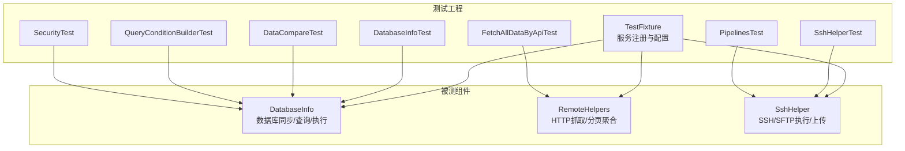
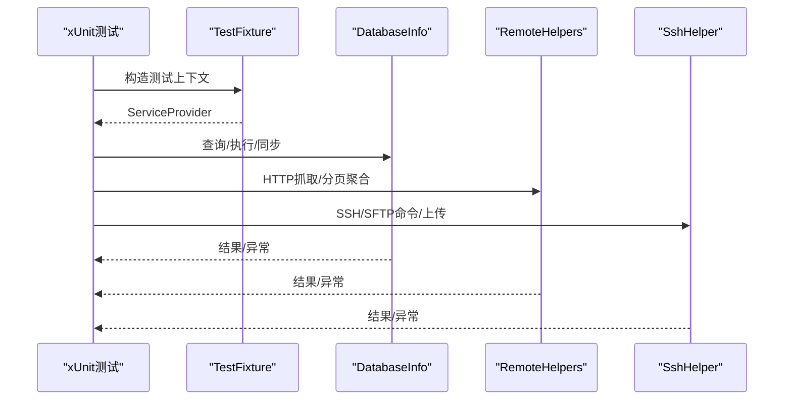
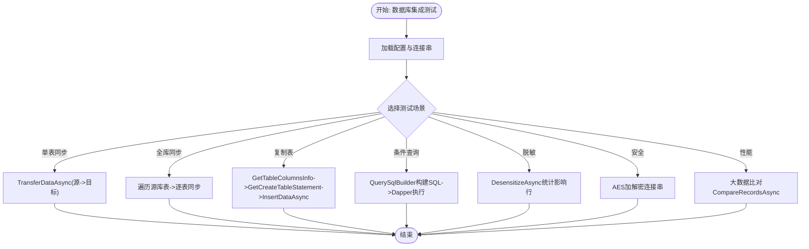
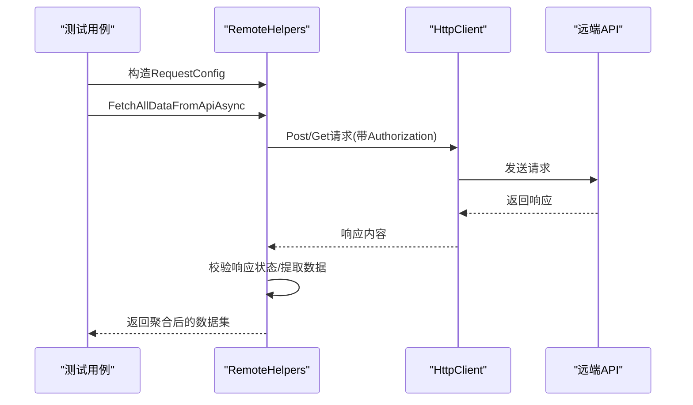
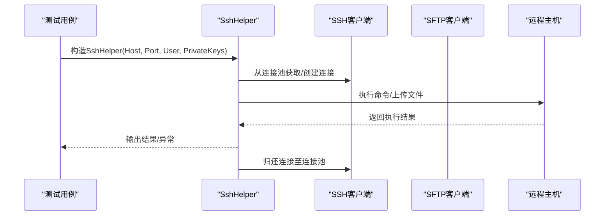
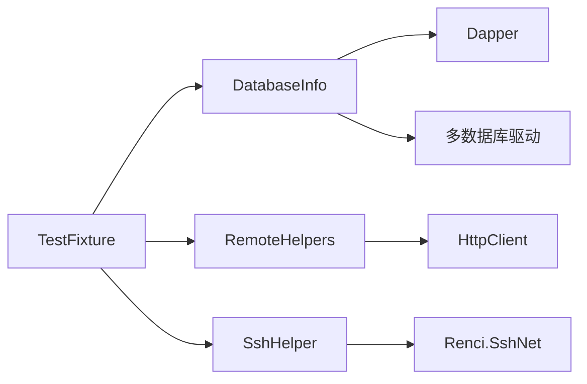

# 集成测试

<cite>
**本文引用的文件**   
- [Sylas.RemoteTasks.Test/TestBase.cs](file://Sylas.RemoteTasks.Test/TestBase.cs)
- [Sylas.RemoteTasks.Test/TestFixture.cs](file://Sylas.RemoteTasks.Test/TestFixture.cs)
- [Sylas.RemoteTasks.Test/AppSettingsOptions/SyncFromDbToDbOptions.cs](file://Sylas.RemoteTasks.Test/AppSettingsOptions/SyncFromDbToDbOptions.cs)
- [Sylas.RemoteTasks.Test/Database/DatabaseInfoTest.cs](file://Sylas.RemoteTasks.Test/Database/DatabaseInfoTest.cs)
- [Sylas.RemoteTasks.Test/Database/DataCompareTest.cs](file://Sylas.RemoteTasks.Test/Database/DataCompareTest.cs)
- [Sylas.RemoteTasks.Test/Database/QueryConditionBuilderTest.cs](file://Sylas.RemoteTasks.Test/Database/QueryConditionBuilderTest.cs)
- [Sylas.RemoteTasks.Test/Database/SecurityTest.cs](file://Sylas.RemoteTasks.Test/Database/SecurityTest.cs)
- [Sylas.RemoteTasks.Test/Remote/FetchAllDataByApiTest.cs](file://Sylas.RemoteTasks.Test/Remote/FetchAllDataByApiTest.cs)
- [Sylas.RemoteTasks.Test/Remote/SshHelperTest.cs](file://Sylas.RemoteTasks.Test/Remote/SshHelperTest.cs)
- [Sylas.RemoteTasks.Test/Socket/PipelinesTest.cs](file://Sylas.RemoteTasks.Test/Socket/PipelinesTest.cs)
- [Sylas.RemoteTasks.Database/SyncBase/DatabaseInfo.cs](file://Sylas.RemoteTasks.Database/SyncBase/DatabaseInfo.cs)
- [Sylas.RemoteTasks.Utils/RemoteHelpers.cs](file://Sylas.RemoteTasks.Utils/RemoteHelpers.cs)
- [Sylas.RemoteTasks.Utils/CommandExecutor/SshHelper.cs](file://Sylas.RemoteTasks.Utils/CommandExecutor/SshHelper.cs)
</cite>

## 目录
1. [简介](#简介)
2. [项目结构](#项目结构)
3. [核心组件](#核心组件)
4. [架构总览](#架构总览)
5. [详细组件分析](#详细组件分析)
6. [依赖关系分析](#依赖关系分析)
7. [性能考量](#性能考量)
8. [故障排查指南](#故障排查指南)
9. [结论](#结论)
10. [附录](#附录)

## 简介
本文件面向 Sylas.RemoteTasks 的集成测试，聚焦三类场景：数据库集成测试、远程 API 测试、网络套接字（SSH/SFTP）测试。文档提供测试环境搭建、测试数据准备、外部依赖模拟方法、具体测试用例与策略，并覆盖错误处理与边界条件。

## 项目结构
- 测试工程位于 Sylas.RemoteTasks.Test，采用 xUnit 断言框架与 Microsoft.Extensions.DependencyInjection 注入容器，统一通过 TestFixture 初始化服务与配置。
- 被测能力主要来自：
  - 数据库层：Sylas.RemoteTasks.Database/SyncBase/DatabaseInfo.cs
  - 远程调用层：Sylas.RemoteTasks.Utils/RemoteHelpers.cs
  - SSH/SFTP 层：Sylas.RemoteTasks.Utils/CommandExecutor/SshHelper.cs

图表来源
- [Sylas.RemoteTasks.Test/TestFixture.cs](file://Sylas.RemoteTasks.Test/TestFixture.cs#L16-L51)
- [Sylas.RemoteTasks.Test/Database/DatabaseInfoTest.cs](file://Sylas.RemoteTasks.Test/Database/DatabaseInfoTest.cs#L22-L41)
- [Sylas.RemoteTasks.Test/Remote/FetchAllDataByApiTest.cs](file://Sylas.RemoteTasks.Test/Remote/FetchAllDataByApiTest.cs#L17-L22)
- [Sylas.RemoteTasks.Test/Remote/SshHelperTest.cs](file://Sylas.RemoteTasks.Test/Remote/SshHelperTest.cs#L12-L14)

章节来源
- [Sylas.RemoteTasks.Test/TestFixture.cs](file://Sylas.RemoteTasks.Test/TestFixture.cs#L16-L51)

## 核心组件
- TestFixture：集中注册日志、配置、仓储基类、DatabaseInfo 及其 IDatabaseProvider 实现，构建 ServiceProvider 供各测试类注入使用。
- TestBase：为测试类提供 IConfiguration 访问能力。
- DatabaseInfo：提供跨数据库连接、分页查询、执行 SQL、动态更新/删除、表存在性与创建、数据迁移与同步等能力。
- RemoteHelpers：封装 HTTP 抓取、分页递归拉取、父子关系数据拉取、AI 接口调用等。
- SshHelper：封装 SSH/SFTP 连接池、命令执行、文件上传等远程主机操作。

章节来源
- [Sylas.RemoteTasks.Test/TestBase.cs](file://Sylas.RemoteTasks.Test/TestBase.cs#L10-L13)
- [Sylas.RemoteTasks.Test/TestFixture.cs](file://Sylas.RemoteTasks.Test/TestFixture.cs#L16-L51)
- [Sylas.RemoteTasks.Database/SyncBase/DatabaseInfo.cs](file://Sylas.RemoteTasks.Database/SyncBase/DatabaseInfo.cs#L64-L88)
- [Sylas.RemoteTasks.Utils/RemoteHelpers.cs](file://Sylas.RemoteTasks.Utils/RemoteHelpers.cs#L27-L538)
- [Sylas.RemoteTasks.Utils/CommandExecutor/SshHelper.cs](file://Sylas.RemoteTasks.Utils/CommandExecutor/SshHelper.cs#L18-L187)

## 架构总览
下图展示测试工程与被测组件之间的交互关系，以及测试用例如何驱动被测功能完成端到端验证。

图表来源
- [Sylas.RemoteTasks.Test/TestFixture.cs](file://Sylas.RemoteTasks.Test/TestFixture.cs#L16-L51)
- [Sylas.RemoteTasks.Database/SyncBase/DatabaseInfo.cs](file://Sylas.RemoteTasks.Database/SyncBase/DatabaseInfo.cs#L309-L351)
- [Sylas.RemoteTasks.Utils/RemoteHelpers.cs](file://Sylas.RemoteTasks.Utils/RemoteHelpers.cs#L147-L226)
- [Sylas.RemoteTasks.Utils/CommandExecutor/SshHelper.cs](file://Sylas.RemoteTasks.Utils/CommandExecutor/SshHelper.cs#L36-L80)

## 详细组件分析

### 数据库集成测试
目标：验证数据库连接、跨库/跨类型数据同步、分页查询、复杂条件构建、数据脱敏与安全处理、大体量数据比对性能。

- 测试入口与配置
  - 通过 TestFixture 注入 IConfiguration，读取多数据库连接串（Sqlite、Pg、SqlServer、Dm、Oracle、MySql），用于跨库验证。
  - 通过 SyncFromDbToDbOptions 读取源/目标库与表配置，驱动单表与全库同步测试。

- 典型测试用例与策略
  - 单表同步：从源库到目标库的 TransferDataAsync，校验目标库数据一致性。
  - 全库同步：按配置指定源库与目标库，执行全库表迁移。
  - 插入与建表：跨库复制表结构与数据，确保目标库不存在时自动创建。
  - 条件构建与分页：使用 QuerySqlBuilder 构建复杂联表/分组/排序/分页 SQL，与 Dapper 查询结果比对。
  - 数据脱敏：对敏感字段执行脱敏，统计影响行数。
  - 安全处理：AES 加解密连接串，验证解密正确性。
  - 性能与大数据：构造大规模集合进行记录比对，评估性能与内存占用。

- 错误处理与边界
  - 表不存在：CreateTableIfNotExistAsync 在目标库不存在时自动创建。
  - 异常捕获：执行 SQL/分页查询时捕获异常并回滚事务。
  - 参数校验：动态更新/删除时校验主键与更新字段，避免空参数导致异常。

图表来源
- [Sylas.RemoteTasks.Test/Database/DatabaseInfoTest.cs](file://Sylas.RemoteTasks.Test/Database/DatabaseInfoTest.cs#L48-L91)
- [Sylas.RemoteTasks.Test/Database/QueryConditionBuilderTest.cs](file://Sylas.RemoteTasks.Test/Database/QueryConditionBuilderTest.cs#L37-L52)
- [Sylas.RemoteTasks.Test/Database/DataCompareTest.cs](file://Sylas.RemoteTasks.Test/Database/DataCompareTest.cs#L18-L188)
- [Sylas.RemoteTasks.Test/Database/SecurityTest.cs](file://Sylas.RemoteTasks.Test/Database/SecurityTest.cs#L18-L38)

章节来源
- [Sylas.RemoteTasks.Test/Database/DatabaseInfoTest.cs](file://Sylas.RemoteTasks.Test/Database/DatabaseInfoTest.cs#L22-L41)
- [Sylas.RemoteTasks.Test/AppSettingsOptions/SyncFromDbToDbOptions.cs](file://Sylas.RemoteTasks.Test/AppSettingsOptions/SyncFromDbToDbOptions.cs#L3-L12)
- [Sylas.RemoteTasks.Test/Database/QueryConditionBuilderTest.cs](file://Sylas.RemoteTasks.Test/Database/QueryConditionBuilderTest.cs#L16-L30)
- [Sylas.RemoteTasks.Test/Database/DataCompareTest.cs](file://Sylas.RemoteTasks.Test/Database/DataCompareTest.cs#L18-L188)
- [Sylas.RemoteTasks.Test/Database/SecurityTest.cs](file://Sylas.RemoteTasks.Test/Database/SecurityTest.cs#L18-L38)
- [Sylas.RemoteTasks.Database/SyncBase/DatabaseInfo.cs](file://Sylas.RemoteTasks.Database/SyncBase/DatabaseInfo.cs#L309-L476)
- [Sylas.RemoteTasks.Database/SyncBase/DatabaseInfo.cs](file://Sylas.RemoteTasks.Database/SyncBase/DatabaseInfo.cs#L744-L797)

### 远程 API 测试
目标：验证 HTTP 接口抓取、分页递归拉取、父子关系数据拉取、批量参数校验、时间格式化工具。

- 测试入口与配置
  - 通过 TestFixture 注入 IConfiguration，读取网关地址、URL、参数文件路径、Token 等。
  - 使用 RequestConfig 配置 URL、分页字段、父子关联字段、响应成功字段与数据字段等。

- 典型测试用例与策略
  - 数据脱敏：对指定连接串与表执行脱敏，输出影响行数。
  - 表达式树映射：验证对象深拷贝与映射行为差异。
  - 批量参数校验：从参数文件读取大量参数，从索引起批量执行，输出结果。
  - 时间格式化：验证秒数转“x天x时x分x秒”格式。

图表来源
- [Sylas.RemoteTasks.Test/Remote/FetchAllDataByApiTest.cs](file://Sylas.RemoteTasks.Test/Remote/FetchAllDataByApiTest.cs#L17-L22)
- [Sylas.RemoteTasks.Utils/RemoteHelpers.cs](file://Sylas.RemoteTasks.Utils/RemoteHelpers.cs#L147-L226)
- [Sylas.RemoteTasks.Utils/RemoteHelpers.cs](file://Sylas.RemoteTasks.Utils/RemoteHelpers.cs#L251-L458)

章节来源
- [Sylas.RemoteTasks.Test/Remote/FetchAllDataByApiTest.cs](file://Sylas.RemoteTasks.Test/Remote/FetchAllDataByApiTest.cs#L17-L80)
- [Sylas.RemoteTasks.Utils/RemoteHelpers.cs](file://Sylas.RemoteTasks.Utils/RemoteHelpers.cs#L27-L538)

### 网络套接字测试（SSH/SFTP）
目标：验证 SSH/SFTP 连接池、命令执行、文件上传、模板变量替换与结果输出。

- 测试入口与配置
  - 通过 TestFixture 注入 IConfiguration，读取主机、端口、用户名、私钥、本地路径、远程路径、命令数组等。
  - 使用 SshHelper 构造连接，执行命令流并输出结果。

- 典型测试用例与策略
  - 命令执行：对远程主机执行一系列命令，输出成功/失败信息。
  - 文件上传：结合模板解析与命令执行，完成文件上传任务。
  - 连接池管理：验证连接池创建、复用、断线重连与释放。

图表来源
- [Sylas.RemoteTasks.Test/Remote/SshHelperTest.cs](file://Sylas.RemoteTasks.Test/Remote/SshHelperTest.cs#L12-L56)
- [Sylas.RemoteTasks.Utils/CommandExecutor/SshHelper.cs](file://Sylas.RemoteTasks.Utils/CommandExecutor/SshHelper.cs#L36-L80)
- [Sylas.RemoteTasks.Utils/CommandExecutor/SshHelper.cs](file://Sylas.RemoteTasks.Utils/CommandExecutor/SshHelper.cs#L18-L187)

章节来源
- [Sylas.RemoteTasks.Test/Remote/SshHelperTest.cs](file://Sylas.RemoteTasks.Test/Remote/SshHelperTest.cs#L12-L56)
- [Sylas.RemoteTasks.Utils/CommandExecutor/SshHelper.cs](file://Sylas.RemoteTasks.Utils/CommandExecutor/SshHelper.cs#L18-L187)

## 依赖关系分析
- 测试工程依赖注入
  - TestFixture 注册 IConfiguration、日志、仓储基类、DatabaseInfo 及其 IDatabaseProvider 实现，形成统一的服务容器。
- 被测组件耦合
  - DatabaseInfo 依赖 Dapper、多种数据库驱动、配置与日志；提供跨库连接、SQL 构建与执行、数据迁移等能力。
  - RemoteHelpers 依赖 HttpClient、JSON 序列化、日志；提供 HTTP 抓取与递归聚合。
  - SshHelper 依赖 Renci.SshNet；提供 SSH/SFTP 连接池与命令执行。

图表来源
- [Sylas.RemoteTasks.Test/TestFixture.cs](file://Sylas.RemoteTasks.Test/TestFixture.cs#L16-L51)
- [Sylas.RemoteTasks.Database/SyncBase/DatabaseInfo.cs](file://Sylas.RemoteTasks.Database/SyncBase/DatabaseInfo.cs#L1-L28)
- [Sylas.RemoteTasks.Utils/RemoteHelpers.cs](file://Sylas.RemoteTasks.Utils/RemoteHelpers.cs#L1-L21)
- [Sylas.RemoteTasks.Utils/CommandExecutor/SshHelper.cs](file://Sylas.RemoteTasks.Utils/CommandExecutor/SshHelper.cs#L1-L12)

章节来源
- [Sylas.RemoteTasks.Test/TestFixture.cs](file://Sylas.RemoteTasks.Test/TestFixture.cs#L16-L51)
- [Sylas.RemoteTasks.Database/SyncBase/DatabaseInfo.cs](file://Sylas.RemoteTasks.Database/SyncBase/DatabaseInfo.cs#L1-L28)
- [Sylas.RemoteTasks.Utils/RemoteHelpers.cs](file://Sylas.RemoteTasks.Utils/RemoteHelpers.cs#L1-L21)
- [Sylas.RemoteTasks.Utils/CommandExecutor/SshHelper.cs](file://Sylas.RemoteTasks.Utils/CommandExecutor/SshHelper.cs#L1-L12)

## 性能考量
- 大数据比对：DataCompareTest 构造大规模集合进行比对，评估新版本使用 IDictionary<string, object> 的性能与内存优势。
- SQL 执行：DatabaseInfo 在执行增删改时使用事务与参数化，减少异常风险并提升吞吐。
- 连接池：SshHelper 使用连接池与信号量控制最大并发，避免资源耗尽。

章节来源
- [Sylas.RemoteTasks.Test/Database/DataCompareTest.cs](file://Sylas.RemoteTasks.Test/Database/DataCompareTest.cs#L181-L188)
- [Sylas.RemoteTasks.Database/SyncBase/DatabaseInfo.cs](file://Sylas.RemoteTasks.Database/SyncBase/DatabaseInfo.cs#L372-L400)
- [Sylas.RemoteTasks.Utils/CommandExecutor/SshHelper.cs](file://Sylas.RemoteTasks.Utils/CommandExecutor/SshHelper.cs#L18-L187)

## 故障排查指南
- 数据库连接
  - 检查连接串是否加密与解密流程正确；使用 SecurityTest 验证 AES 加解密。
  - 若表不存在，确认 CreateTableIfNotExistAsync 是否触发建表逻辑。
- 远程 API
  - 校验 RequestConfig 的响应成功字段与数据字段配置是否匹配实际接口。
  - 检查 Authorization 头与 Token 配置。
- SSH/SFTP
  - 确认私钥路径、主机、端口、用户名配置正确；关注连接池上限与断线重连。
  - 命令执行需注意模板变量替换与空值判定。

章节来源
- [Sylas.RemoteTasks.Test/Database/SecurityTest.cs](file://Sylas.RemoteTasks.Test/Database/SecurityTest.cs#L18-L38)
- [Sylas.RemoteTasks.Database/SyncBase/DatabaseInfo.cs](file://Sylas.RemoteTasks.Database/SyncBase/DatabaseInfo.cs#L744-L797)
- [Sylas.RemoteTasks.Utils/RemoteHelpers.cs](file://Sylas.RemoteTasks.Utils/RemoteHelpers.cs#L28-L80)
- [Sylas.RemoteTasks.Utils/CommandExecutor/SshHelper.cs](file://Sylas.RemoteTasks.Utils/CommandExecutor/SshHelper.cs#L18-L187)

## 结论
本文基于现有测试工程与被测组件，系统梳理了数据库、远程 API、SSH/SFTP 三大类集成测试的实现方法与策略。通过统一的 TestFixture 注入与配置，结合丰富的测试用例，可有效验证连接、同步、查询、执行、抓取、命令执行等核心能力，并覆盖错误处理与性能要点。

## 附录
- 测试环境搭建建议
  - 在本地或 CI 中准备多数据库实例（Sqlite、Pg、SqlServer、Dm、Oracle、MySql），确保连接串可用。
  - 准备远程主机与 SSH 私钥，确保 SFTP/SSH 可用。
  - 在测试配置中提供网关地址、Token、参数文件路径等。
- 测试数据准备
  - 使用 DatabaseInfo 的 InsertDataAsync 或迁移脚本准备测试表与数据。
  - 使用 QueryConditionBuilderTest 的 JSON DTO 构建复杂查询场景。
- 模拟外部依赖
  - 使用 SshHelperTest 的模板解析与命令执行，模拟远程主机操作。
  - 使用 FetchAllDataByApiTest 的参数文件与批量校验，模拟大规模请求。