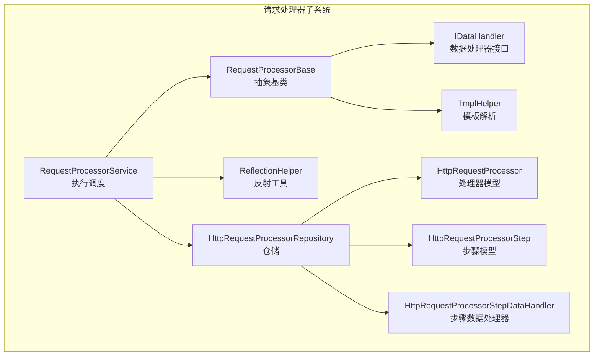
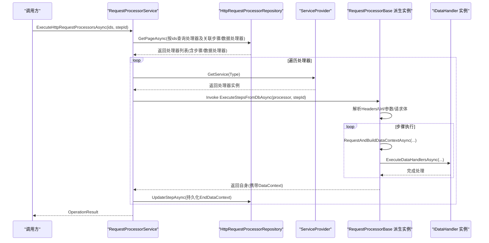
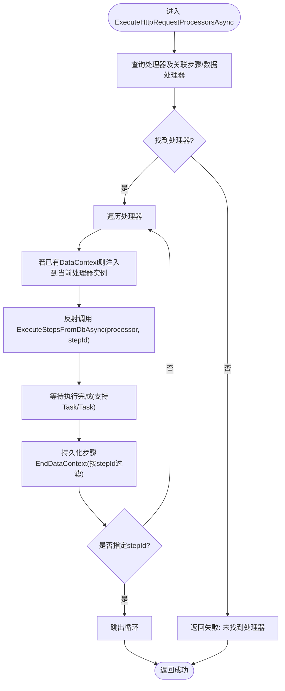
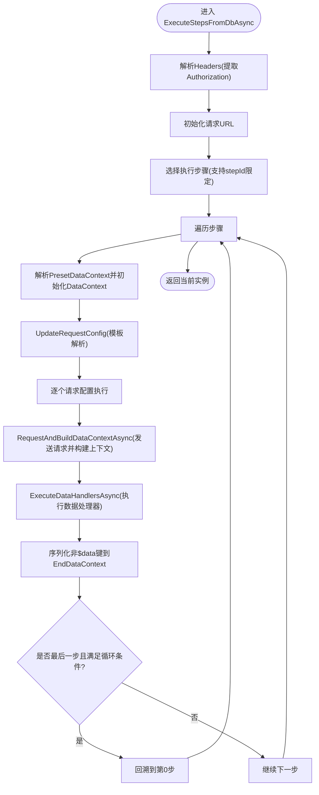
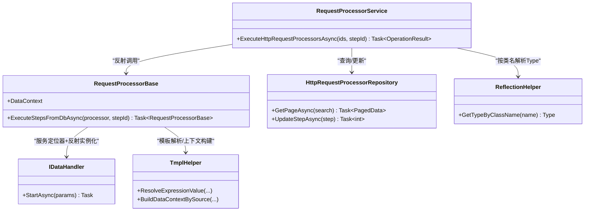

# RequestProcessorService 设计

<cite>
**本文档引用的文件**
- [RequestProcessorService.cs](file://Sylas.RemoteTasks.App/RequestProcessor/RequestProcessorService.cs)
- [RequestProcessorBase.cs](file://Sylas.RemoteTasks.App/RequestProcessor/RequestProcessorBase.cs)
- [HttpRequestProcessorRepository.cs](file://Sylas.RemoteTasks.App/RequestProcessor/HttpRequestProcessorRepository.cs)
- [HttpRequestProcessor.cs](file://Sylas.RemoteTasks.App/RequestProcessor/Models/HttpRequestProcessor.cs)
- [HttpRequestProcessorStep.cs](file://Sylas.RemoteTasks.App/RequestProcessor/Models/HttpRequestProcessorStep.cs)
- [HttpRequestProcessorStepDataHandlers.cs](file://Sylas.RemoteTasks.App/RequestProcessor/Models/HttpRequestProcessorStepDataHandlers.cs)
- [IDataHandler.cs](file://Sylas.RemoteTasks.App/DataHandlers/IDataHandler.cs)
- [ReflectionHelper.cs](file://Sylas.RemoteTasks.Utils/ReflectionHelper.cs)
- [TmplHelper.cs](file://Sylas.RemoteTasks.Utils/Template/TmplHelper.cs)
</cite>

## 目录
1. [简介](#简介)
2. [项目结构](#项目结构)
3. [核心组件](#核心组件)
4. [架构总览](#架构总览)
5. [详细组件分析](#详细组件分析)
6. [依赖分析](#依赖分析)
7. [性能考量](#性能考量)
8. [故障排查指南](#故障排查指南)
9. [结论](#结论)
10. [附录：使用模式与示例](#附录使用模式与示例)

## 简介
本文件围绕 RequestProcessorService 的设计与实现展开，重点阐述其架构设计、依赖注入模式、服务定位器模式的应用；深入解析 ExecuteHttpRequestProcessorsAsync 方法的实现逻辑（参数处理、异常处理、日志记录机制）、与 ServiceProvider 的交互方式、反射机制在动态实例化中的作用、数据上下文传递机制以及步骤执行控制逻辑，并给出与其他组件的集成关系与使用模式。

## 项目结构
RequestProcessor 子系统位于应用层，围绕“处理器-步骤-数据处理器”的三层结构组织，配合仓储层完成持久化与查询，利用反射与服务定位器实现运行时动态实例化与调用。

图表来源
- [RequestProcessorService.cs](file://Sylas.RemoteTasks.App/RequestProcessor/RequestProcessorService.cs#L1-L72)
- [RequestProcessorBase.cs](file://Sylas.RemoteTasks.App/RequestProcessor/RequestProcessorBase.cs#L1-L279)
- [HttpRequestProcessorRepository.cs](file://Sylas.RemoteTasks.App/RequestProcessor/HttpRequestProcessorRepository.cs#L1-L412)
- [IDataHandler.cs](file://Sylas.RemoteTasks.App/DataHandlers/IDataHandler.cs#L1-L8)
- [ReflectionHelper.cs](file://Sylas.RemoteTasks.Utils/ReflectionHelper.cs#L1-L80)
- [TmplHelper.cs](file://Sylas.RemoteTasks.Utils/Template/TmplHelper.cs#L210-L226)

章节来源
- [RequestProcessorService.cs](file://Sylas.RemoteTasks.App/RequestProcessor/RequestProcessorService.cs#L1-L72)
- [RequestProcessorBase.cs](file://Sylas.RemoteTasks.App/RequestProcessor/RequestProcessorBase.cs#L1-L279)
- [HttpRequestProcessorRepository.cs](file://Sylas.RemoteTasks.App/RequestProcessor/HttpRequestProcessorRepository.cs#L1-L412)

## 核心组件
- RequestProcessorService：负责根据传入的处理器ID集合批量拉取处理器及其步骤与数据处理器，通过反射与服务定位器动态实例化具体处理器，驱动执行流程并持久化步骤上下文。
- RequestProcessorBase：抽象基类，提供参数解析、请求发送、数据上下文构建、数据处理器执行等通用能力。
- HttpRequestProcessorRepository：封装对处理器、步骤、步骤数据处理器的分页查询与更新，支持一次性加载处理器关联的完整结构。
- 模型层：HttpRequestProcessor、HttpRequestProcessorStep、HttpRequestProcessorStepDataHandler，承载持久化实体与运行时配置。
- IDataHandler：数据处理器接口，约定 StartAsync 执行入口。
- ReflectionHelper：跨程序集扫描与类型解析，支持按类名获取 Type。
- TmplHelper：模板解析与数据上下文构建工具。

章节来源
- [RequestProcessorService.cs](file://Sylas.RemoteTasks.App/RequestProcessor/RequestProcessorService.cs#L1-L72)
- [RequestProcessorBase.cs](file://Sylas.RemoteTasks.App/RequestProcessor/RequestProcessorBase.cs#L1-L279)
- [HttpRequestProcessorRepository.cs](file://Sylas.RemoteTasks.App/RequestProcessor/HttpRequestProcessorRepository.cs#L1-L412)
- [IDataHandler.cs](file://Sylas.RemoteTasks.App/DataHandlers/IDataHandler.cs#L1-L8)
- [ReflectionHelper.cs](file://Sylas.RemoteTasks.Utils/ReflectionHelper.cs#L1-L80)
- [TmplHelper.cs](file://Sylas.RemoteTasks.Utils/Template/TmplHelper.cs#L210-L226)

## 架构总览
RequestProcessorService 采用“服务定位器 + 反射”的组合模式：
- 通过 ServiceProvider 获取具体 IRequestProcessor 实例（服务定位器）。
- 通过 ReflectionHelper 按类名解析 Type 并实例化（反射）。
- 结合仓储加载处理器、步骤与数据处理器，形成完整的执行计划。
- 在执行过程中，RequestProcessorBase 维护 DataContext 并将其在步骤间传递，同时持久化 EndDataContext 到数据库。

图表来源
- [RequestProcessorService.cs](file://Sylas.RemoteTasks.App/RequestProcessor/RequestProcessorService.cs#L11-L69)
- [RequestProcessorBase.cs](file://Sylas.RemoteTasks.App/RequestProcessor/RequestProcessorBase.cs#L83-L211)
- [HttpRequestProcessorRepository.cs](file://Sylas.RemoteTasks.App/RequestProcessor/HttpRequestProcessorRepository.cs#L23-L48)
- [IDataHandler.cs](file://Sylas.RemoteTasks.App/DataHandlers/IDataHandler.cs#L1-L8)

## 详细组件分析

### RequestProcessorService
- 职责
  - 批量查询处理器及其步骤与数据处理器。
  - 动态解析处理器类型并通过 ServiceProvider 获取实例。
  - 将上一处理器的 DataContext 注入当前处理器（跨处理器传递）。
  - 调用处理器的 ExecuteStepsFromDbAsync 并等待执行完成。
  - 将每个步骤的 EndDataContext 写回数据库，支持断点续跑。
- 关键点
  - 参数处理：根据 ids 与 stepId 控制执行范围。
  - 异常处理：缺失处理器、缺失步骤、缺失方法、实例获取失败等均抛出明确异常。
  - 日志记录：使用 ILogger 输出执行阶段与关键信息。
  - 反射与服务定位器：通过 ReflectionHelper 获取 Type，再由 ServiceProvider 获取实例。
  - 数据上下文：在多处理器场景下，将上一个处理器的 DataContext 通过属性注入到下一个处理器实例。
  - 步骤持久化：仅持久化当前 stepId 对应的步骤或全部步骤。

图表来源
- [RequestProcessorService.cs](file://Sylas.RemoteTasks.App/RequestProcessor/RequestProcessorService.cs#L11-L69)

章节来源
- [RequestProcessorService.cs](file://Sylas.RemoteTasks.App/RequestProcessor/RequestProcessorService.cs#L1-L72)

### RequestProcessorBase
- 职责
  - 解析处理器头部 Authorization 令牌，设置请求配置。
  - 根据步骤 Parameters 与 RequestBody 生成请求配置，支持模板解析。
  - 发送请求并构建 DataContext，支持多条请求配置的组合执行。
  - 顺序执行步骤内的数据处理器，按 OrderNo 排序。
  - 支持“最后一步有数据则回到第一步”的循环策略。
  - 将 DataContext 中除 $data 外的键值序列化为 EndDataContext，供后续步骤使用。
- 关键点
  - 参数处理：UpdateRequestConfig 使用模板引擎解析查询与请求体。
  - 请求执行：RequestAndBuildDataContextAsync 调用远程接口并构建上下文。
  - 数据处理器执行：ExecuteDataHandlersAsync 通过 ServiceProvider 获取实例并调用 StartAsync。
  - 上下文传递：支持 stepId 指定执行单步，或从上一步 EndDataContext 继承 DataContext。
  - 循环控制：当最后一步满足条件时，自动回溯到第一步继续执行。

图表来源
- [RequestProcessorBase.cs](file://Sylas.RemoteTasks.App/RequestProcessor/RequestProcessorBase.cs#L83-L211)

章节来源
- [RequestProcessorBase.cs](file://Sylas.RemoteTasks.App/RequestProcessor/RequestProcessorBase.cs#L1-L279)

### HttpRequestProcessorRepository
- 职责
  - 提供处理器、步骤、数据处理器的分页查询与更新。
  - 在查询处理器时，一次性加载其关联的步骤与数据处理器，减少多次往返。
  - 支持克隆处理器、步骤与数据处理器，便于复制配置。
- 关键点
  - GetPageAsync：先查处理器，再查步骤与数据处理器，并组装到处理器对象上。
  - UpdateStepAsync：将 EndDataContext 等字段写回数据库，用于断点续跑。

章节来源
- [HttpRequestProcessorRepository.cs](file://Sylas.RemoteTasks.App/RequestProcessor/HttpRequestProcessorRepository.cs#L1-L412)

### 模型与接口
- HttpRequestProcessor：处理器实体，包含名称、URL、Headers、备注、是否循环等。
- HttpRequestProcessorStep：步骤实体，包含参数、请求体、预置上下文、上下文构建模板、排序等。
- HttpRequestProcessorStepDataHandler：步骤内数据处理器配置，包含处理器类名、参数输入、排序等。
- IDataHandler：数据处理器接口，约定 StartAsync 执行入口。

章节来源
- [HttpRequestProcessor.cs](file://Sylas.RemoteTasks.App/RequestProcessor/Models/HttpRequestProcessor.cs#L1-L22)
- [HttpRequestProcessorStep.cs](file://Sylas.RemoteTasks.App/RequestProcessor/Models/HttpRequestProcessorStep.cs#L1-L19)
- [HttpRequestProcessorStepDataHandlers.cs](file://Sylas.RemoteTasks.App/RequestProcessor/Models/HttpRequestProcessorStepDataHandlers.cs#L1-L15)
- [IDataHandler.cs](file://Sylas.RemoteTasks.App/DataHandlers/IDataHandler.cs#L1-L8)

## 依赖分析
- RequestProcessorService 依赖
  - HttpRequestProcessorRepository：用于查询与更新处理器、步骤、数据处理器。
  - IServiceProvider：用于服务定位器模式获取处理器实例。
  - ReflectionHelper：用于按类名解析 Type 并进行反射调用。
  - ILogger：用于日志记录。
- RequestProcessorBase 依赖
  - IDataHandler：用于数据处理器执行。
  - TmplHelper：用于模板解析与上下文构建。
  - IServiceProvider：用于数据处理器实例获取。
  - ILogger：用于日志记录。
- 模块耦合
  - RequestProcessorService 与 RequestProcessorBase 通过反射与接口解耦。
  - 数据处理器通过字符串类名与接口解耦，运行时通过反射与服务定位器装配。

图表来源
- [RequestProcessorService.cs](file://Sylas.RemoteTasks.App/RequestProcessor/RequestProcessorService.cs#L1-L72)
- [RequestProcessorBase.cs](file://Sylas.RemoteTasks.App/RequestProcessor/RequestProcessorBase.cs#L1-L279)
- [HttpRequestProcessorRepository.cs](file://Sylas.RemoteTasks.App/RequestProcessor/HttpRequestProcessorRepository.cs#L1-L412)
- [IDataHandler.cs](file://Sylas.RemoteTasks.App/DataHandlers/IDataHandler.cs#L1-L8)
- [ReflectionHelper.cs](file://Sylas.RemoteTasks.Utils/ReflectionHelper.cs#L1-L80)
- [TmplHelper.cs](file://Sylas.RemoteTasks.Utils/Template/TmplHelper.cs#L210-L226)

## 性能考量
- 查询优化：仓储一次性加载处理器、步骤与数据处理器，避免 N+1 查询。
- 反射成本：反射与服务定位器在每次执行时发生，建议在处理器数量有限的情况下使用；如需更高性能，可考虑注册映射表或缓存 Type/实例。
- 上下文序列化：仅持久化非 $data 键，避免大对象写库。
- 循环策略：最后一步循环会增加执行次数，应谨慎启用并配合 stepId 控制。

## 故障排查指南
- 未找到处理器或步骤
  - 现象：返回失败并提示未找到处理器或无步骤。
  - 排查：确认 ids 是否正确、仓储查询是否返回数据。
- 缺失必要字段
  - 现象：抛出缺少 Name/Url 等异常。
  - 排查：检查处理器配置是否完整。
- 反射/实例化失败
  - 现象：按类名解析 Type 或获取实例失败。
  - 排查：确认类名正确、类型已编译并被反射扫描到、DI 容器已注册。
- 数据处理器缺失方法
  - 现象：找不到 StartAsync 方法。
  - 排查：确保数据处理器实现符合接口约定。
- 请求失败
  - 现象：发送请求时异常。
  - 排查：检查 Headers、URL、参数模板解析结果。

章节来源
- [RequestProcessorService.cs](file://Sylas.RemoteTasks.App/RequestProcessor/RequestProcessorService.cs#L11-L69)
- [RequestProcessorBase.cs](file://Sylas.RemoteTasks.App/RequestProcessor/RequestProcessorBase.cs#L83-L211)

## 结论
RequestProcessorService 通过“服务定位器 + 反射”实现了运行时动态调度，结合仓储的聚合查询与 DataContext 的跨步骤/跨处理器传递，提供了灵活、可扩展的远程任务执行框架。其设计在易用性与可维护性方面表现良好，适合复杂业务流程的可视化配置与自动化执行。

## 附录：使用模式与示例
- 基本调用
  - 传入处理器ID数组与可选的 stepId，触发批量执行。
  - 若 stepId > 0，则仅执行该步骤；否则执行全部步骤。
- 断点续跑
  - 通过持久化的 EndDataContext 与 UpdateStepAsync，支持从任意步骤重启。
- 自定义处理器
  - 新建派生自 RequestProcessorBase 的类，实现特定的参数解析与数据处理逻辑。
- 自定义数据处理器
  - 实现 IDataHandler 接口的 StartAsync 方法，按步骤配置类名与参数输入。
- 模板与上下文
  - 使用模板表达式在 Parameters/RequestBody 与 DataContextBuilder 中引用上下文变量，实现动态参数与上下文构建。

章节来源
- [RequestProcessorService.cs](file://Sylas.RemoteTasks.App/RequestProcessor/RequestProcessorService.cs#L11-L69)
- [RequestProcessorBase.cs](file://Sylas.RemoteTasks.App/RequestProcessor/RequestProcessorBase.cs#L83-L211)
- [IDataHandler.cs](file://Sylas.RemoteTasks.App/DataHandlers/IDataHandler.cs#L1-L8)
- [HttpRequestProcessorRepository.cs](file://Sylas.RemoteTasks.App/RequestProcessor/HttpRequestProcessorRepository.cs#L253-L295)